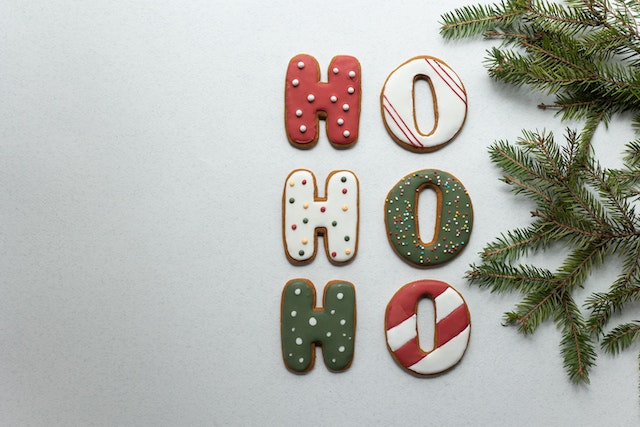
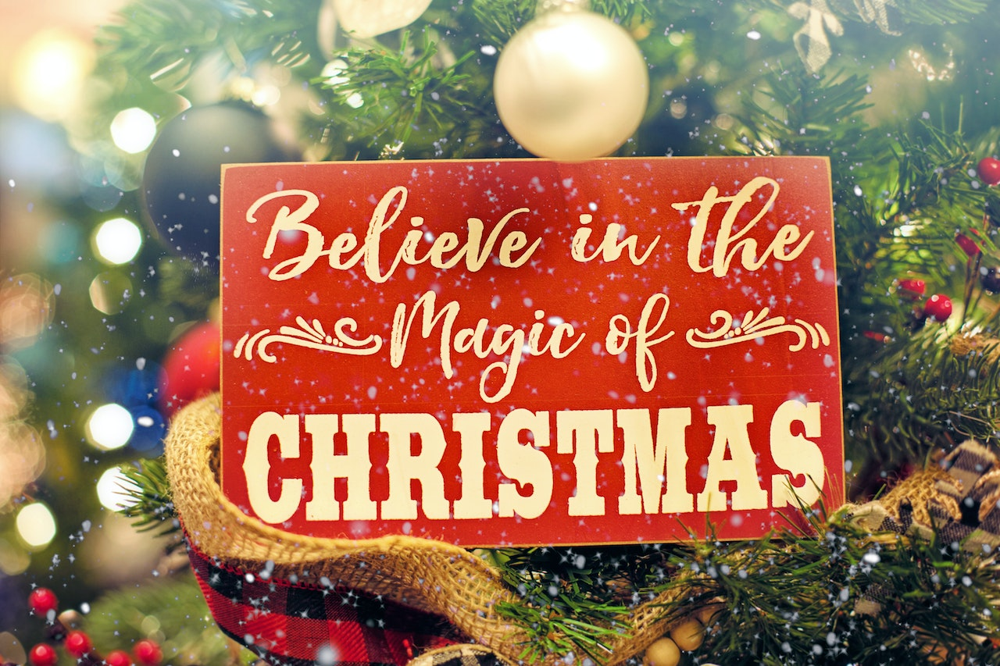

This article has been written and researched by our expert Loveable through a precise methodology. [Learn more about our methodology](https://avada.io/loveable/our-methodological.html)

[Loveable](https://avada.io/loveable/) > [Blog](https://avada.io/loveable/blog/) > [Holiday](https://avada.io/loveable/holiday/)

# 150+ Heartwarming Christmas Friendship Quotes For Festive Joy And Enduring Bonds

Written by [Blake Simpson](https://avada.io/loveable/author/blake/) Last Updated on September 07, 2023

- [Top 150 Lovely Christmas Friendship Quotes For Memorable Holiday](https://avada.io/loveable/blog/christmas-friendship-quotes/#wp-block-heading-2-3)
    - [Funny Christmas Quotes To Make Your Friend Laugh](https://avada.io/loveable/blog/christmas-friendship-quotes/#wp-block-heading-3-4)
    - [Brief Christmas Greetings For Friends](https://avada.io/loveable/blog/christmas-friendship-quotes/#wp-block-heading-3-38)
    - [Heartfelt Christmas Messages For Your Bestie](https://avada.io/loveable/blog/christmas-friendship-quotes/#wp-block-heading-3-76)
    - [Meaningful Friendship Sayings For Christmas Cards](https://avada.io/loveable/blog/christmas-friendship-quotes/#wp-block-heading-3-100)
    - [Long-Distance Friendship Quotes For Christmas](https://avada.io/loveable/blog/christmas-friendship-quotes/#wp-block-heading-3-113)
- [Bottom Line](https://avada.io/loveable/blog/christmas-friendship-quotes/#wp-block-heading-2-129)

Enjoying the essence of Christmas, where bonds are strengthened and hearts are warmed, lies the enchanting realm of **Christmas Friendship Quotes**. Amidst the family-centric festivities, let’s not overlook the cherished companions who complete our chosen family. As the holiday season rekindles its magic, the art of sending heartfelt [Christmas cards and gifts](https://avada.io/loveable/best-friend-christmas-gifts/) resurfaces. This season radiates the purest sentiment of love and camaraderie. Indeed, the allure of Christmas lies in the presence of beloved souls, intertwining their spirits in the jubilant symphony of the holiday spirit.

Enveloped in the warm embrace of the Yuletide, our collection of Christmas Friendship Quotes awaits. Let these words caress your friends’ hearts as you pen your holiday greetings. Seek out the perfect Instagram caption to honor your bestie. Extend the embrace of love and festive cheer to your friends, and let these Christmas wishes be your guiding light.

## **Top 150 Lovely Christmas Friendship Quotes For Memorable Holiday**

### **Funny Christmas Quotes To Make Your Friend Laugh**

Below are humorous Christmas quotes designed to tickle your friend’s funny bone and spread joy through shared chuckles. Capturing festive antics and merry mishaps, these quotes promise-hearty laughter as they recount festive antics and merry mishaps, brightening up the season.

- Merry Christmas. Too bad I’ll be the only one giving you a gift this time because you have been naughty all year round. 
- If Christmas was a holiday for costumes, a Santa Claus suit will be your perfect size.
- It is a sacred day. But not every day of the year is. Let’s keep it holy today, then party and have fun every other day after. Can you?
- Merry Christmas, you Grinch. And try to smile in your Christmas photo this year.
- I am so sorry every day cannot be about you. Today is for Baby Jesus but I’ll make it up to you.  
- Our friendship is a star at the top of a Christmas tree. Ha ha! I’m not good with these quotes thing but you know I love you.
- Merry Christmas, snowflake. Because you are a real flake.
- Santa can give no better gift than me but I am always yours. Enjoy all your other second-place presents.
- It’s supposed to be a silent night but me and my best buds gonna be rocking all through Christmas night. 
- Concerts and December events are great but me and my friends miss dancing at children’s Christmas parties. 
- Let’s jingle bell rock ’till we drop.
- Santa’s elves got nothing on my besties.
- Friends don’t let friends drunk textmas.
- Friends who holiday together sleigh together.
- Bestie, may your holidays be as jolly as your secrets are juicy!
- Behold, friend, I bring you tidings of great gin … um, I mean joy.
- You’ll be the first person I call if Santa ever should down my chimney really fall.
- Bestie, won’t you guide my sleigh tonight? Seriously… I need a designated driver.
- If you decide to take out Elf on the Shelf, I’ll help you bury the body. After all, that’s what friends are for.
- After one too many midnight beers, you glorious friend of old kept me from falling in the dirt and saved me with your heart of gold.
- Aren’t we forgetting the true meaning of Christmas? You know, the birth of Santa.
- Christmas is a together-y sort of holiday. 
- Did you ever notice that life seems to follow certain patterns? Like I noticed that every year around this time, I hear Christmas music.
- I don’t want the Christmas season to end, because it’s the only time I can legitimately indulge in one particular addiction: glitter. 
- The main reason Santa is so jolly is that he knows where all the bad girls live. There’s something about a Christmas sweater that will always make me laugh. We elves try to stick to the four main food groups: candy, candy canes, candy corn, and syrup. 
- Christmas is such a carefree, low-pressure time—that’s one of the things I love about it.
- Some people are born for Halloween, and some are just counting the days until Christmas. 
- Christmas sweaters are only acceptable as a cry for help.
- There are some people who want to throw their arms around you simply because it is Christmas; there are other people who want to strangle you simply because it is Christmas. 
- The outdoor Christmas lights, green and red and gold and blue and twinkling, remind me that most people are that way all year round kind, generous, friendly, and with an occasional moment of ecstasy. But Christmas is the only time they dare reveal themselves. 
- People say I don’t write books, I make Christmas presents.

### **Brief Christmas Greetings For Friends**

In the spirit of the season, convey your warm wishes with brevity and sincerity. Our concise yet heartfelt Christmas greetings capture the essence of friendship, allowing you to express your care and appreciation in just a few words.

- Christmas will always be as long as we stand heart to heart and hand in hand.   
- A joy that is shared is a joy made double.     
- Let’s be naughty and save Santa the trip.     
- May your days be merry and bright.    
- The smells of Christmas are the smells of childhood. 
- I believe… I believe… It’s silly, but I believe.    
- Christmas is the season for kindling the fire of hospitality.    
- Christmas works like glue. It keeps us all sticking together.     
- Love the giver more than the gift.     
- It’s the most wonderful time of the year!      
- Christmas isn’t just a day—it’s a frame of mind.     
- The joy of brightening others’ lives becomes for us the magic of the holidays.     
- It is Christmas in the heart that puts Christmas in the air.    
- Merry Christmas, and may your Christmas be white! 
- My love for you shines brighter than the lights on the tree. 
- Cheers to eggnog by the fire, warm holiday memories, and you. 
- I hope you have a cozy Christmas that chases the chill of winter away. 
- Merry Christmas! May your happiness be large and your bills be small. 
- Tis the season to be jolly, and I hope you have the opportunity every day! 
- Merry Christmas to you and your family! I wish you a great time at home filled with laughter and joy! 
- Peace, goodwill, and happiness for you this Christmas and every other! 
- Joy and blessings, from our family to yours, this Christmas and every day. 
- Merry Christmas! I hope you receive one blessing after another this coming year. 
- This Christmas, you’re the best gift I could ask for. 
- Christmas is magical because we’re together. 
- Happy ho-ho holidays to my ho-ho homies.
- Christmas cheer for my gees all year.
- Sending you glad tidings, my comfort, and my joy.
- If you weren’t here, Christmas won’t be the same. 
- Every season is our season.
- May Santa find you worthy of a Christmas gift, friend.
- All I want for Christmas is you.
- What our friendship is to me is Christmas all year long.
- The best man bro-liday.
- It’s the perfect jolly day with you.

### **Heartfelt Christmas Messages For Your Bestie**

Say touching words to celebrate the bond that goes beyond the ordinary for your best friend. Send your bestie an emotional hug through our heartwarming Christmas messages. Express your gratitude, memories, and hopes for a joyful festive season wrapped in the warmth of your unbreakable friendship.

- Best friends are life’s truth-tellers. 
- Friends are the family you choose.  
- Friends are relatives you make for yourself. 
- Life is an awful, ugly place to not have a best friend.  
- Friendship is a wildly underrated medication.  
- Where there are friends, there is wealth.  
- My best friend is the one who brings out the best in me.  
- There is a reason why you are my best friend. Destiny.  
- Fate chooses your relations, you choose your friends.  
- Things are never quite as scary when you’ve got a best friend.  
- Friendship is the hardest thing in the world to explain. It’s not something you learn in school. But if you haven’t learned the meaning of friendship, you really haven’t learned anything.  
- There’s not a word yet for old friends who’ve just met.  
- A friend is someone who makes it easy to believe in yourself.   
- A friend is one who knows you and loves you just the same.   
- Friends are people who know you really well and like you anyway.  
- There is nothing better than a friend unless it is a friend with chocolate. 
- A true friend is someone who is there for you when he’d rather be anywhere else.  
- It is one of the blessings of old friends that you can afford to be stupid with them.   
- If you have two friends in your lifetime, you’re lucky. If you have one good friend, you’re more than lucky. 
- Sometimes I think, ‘What is friend?’ Then I say, ‘Friend is someone to share the last cookie with.   
- Christmas is the season for kindling the fire of hospitality in the hall, the genial flame of charity in the heart.     

### **Meaningful Friendship Sayings For Christmas Cards**

Make your [Christmas card](https://avada.io/loveable/personalized-christmas-cards/) stand out with sentiments echoing your friendship’s depth. By meaningful sayings below adding an extra layer of significance to your wishes, you can share memorable moments beside your best friend during this special time of year.

- God bless us everyone – you, me, and all of our chums.
- With a friend like you, I don’t need Rudolph to light the way.
- In this Christmas season, may the joy in your heart be as true as the feeling of friendship I have for you.
- Every time a bell rings this Christmas season, that’s me thinking about how much your friendship means.
- May you be blessed with love, joy, and the knowledge of just how special you really are this holiday season.
- As I reflect on all I have to be grateful for this holiday season, my friendship with you is at the top of my list.
- Nothing embodies the spirit of Christmas more than true friendship. That is what you are to me. Merry Christmas, my friend.
- When the tree comes down and the ornaments are put away, I’ll still remember the joy of having friends like you around on Christmas Day.
- This Christmas, friend, I want you to know that I count your friendship among the most important, valuable, and enduring blessings in my life.
- Your friendship is among the greatest gifts I have ever received. My Christmas wish for you is that you experience all of the joy and happiness you deserve.

### **Long-Distance Friendship Quotes For Christmas**

Bridge the miles that separate you and your cherished friend this holiday season. These long-distance friendship quotes convey the strength of your connection across space, reminding you that the spirit of companionship knows no boundaries, even during Christmas.

- I’m Christ-missing you this holiday season. 
- All I want for Christmas is for my friends to come home for the holidays.
- I wrote to Santa and asked him to bring you a plane ticket that will bring you to me.
- All I want for Christmas is to plan a New Year’s spa trip with you, my faraway friend.
- True friends don’t have to be physically together to experience the joy of Christmas forever.
- If only I could get my hands on Santa’s sleigh, to be with you this Christmas I would be on the way!
- If Santa can travel around the world in a night, our bond can handle a few state lines. Merry Christmas.
- It seems we can’t be together this December, so next year let’s celebrate friendship and Christmas in July!
- Yule without you here just isn’t quite the same. I hope you have wonderful Christmas, but I wish you were here.
- To my dismay, friend, I realized that you’ll be away on Christmas Day. The celebration won’t be the same without your presence.

**_See More:_**

- Funny [Christmas Movie Quotes](https://avada.io/loveable/blog/funny-christmas-movie-quotes/)

- Heartwarming [Christmas Family Quotes](https://avada.io/loveable/blog/christmas-family-quotes/)

## **Bottom Line**

This Christmas, celebrate the profound bonds of friendship alongside the traditional festivities. Amidst the family-focused joy, remember the treasured friends who grace our lives with their presence. Embrace the spirit of giving by sharing heartfelt **Christmas Friendship Quotes** and fostering connections that light up the season. Let this holiday be a testament to the enduring power of friendship as we unite in love and merriment, enriching our lives with the warmth of true companionship.

- [Top 150 Lovely Christmas Friendship Quotes For Memorable Holiday](https://avada.io/loveable/blog/christmas-friendship-quotes/#wp-block-heading-2-3)
    - [Funny Christmas Quotes To Make Your Friend Laugh](https://avada.io/loveable/blog/christmas-friendship-quotes/#wp-block-heading-3-4)
    - [Brief Christmas Greetings For Friends](https://avada.io/loveable/blog/christmas-friendship-quotes/#wp-block-heading-3-38)
    - [Heartfelt Christmas Messages For Your Bestie](https://avada.io/loveable/blog/christmas-friendship-quotes/#wp-block-heading-3-76)
    - [Meaningful Friendship Sayings For Christmas Cards](https://avada.io/loveable/blog/christmas-friendship-quotes/#wp-block-heading-3-100)
    - [Long-Distance Friendship Quotes For Christmas](https://avada.io/loveable/blog/christmas-friendship-quotes/#wp-block-heading-3-113)
- [Bottom Line](https://avada.io/loveable/blog/christmas-friendship-quotes/#wp-block-heading-2-129)

### [Blake Simpson](https://avada.io/loveable/author/blake/)

Hi, I'm Blake from Loveable. I help people find perfect gifts for occasions like anniversaries and weddings. I also write a blog about holidays, sharing insights to make them more meaningful. Let's create unforgettable moments together!

- [Twitter](https://twitter.com/intent/tweet)
- [Facebook](https://www.facebook.com/sharer/sharer.php)
- [instagram](https://avada.io/loveable/blog/christmas-friendship-quotes/)
- [pinterest](https://www.pinterest.com/loveablellc/)

## Related Posts

[### 120+ Christian Birthday Wishes To Spread Your Love](https://avada.io/loveable/blog/christian-birthday-wishes/) 

[

### 35 Best 70th Birthday Ideas To Celebrate The Special Milestone

](https://avada.io/loveable/blog/70th-birthday-ideas/)

[

### 50 Best 30th Birthday Decorations for a Remarkable Birthday Bash

](https://avada.io/loveable/blog/30th-birthday-decorations/)

[

### 40 Delicious Vegan Christmas Desserts to Delight Your Palate

](https://avada.io/loveable/blog/vegan-christmas-desserts/)

[

### 60 Christmas Team Building Activities to Boost Workplace Spirit

](https://avada.io/loveable/blog/christmas-team-building-activities/)
