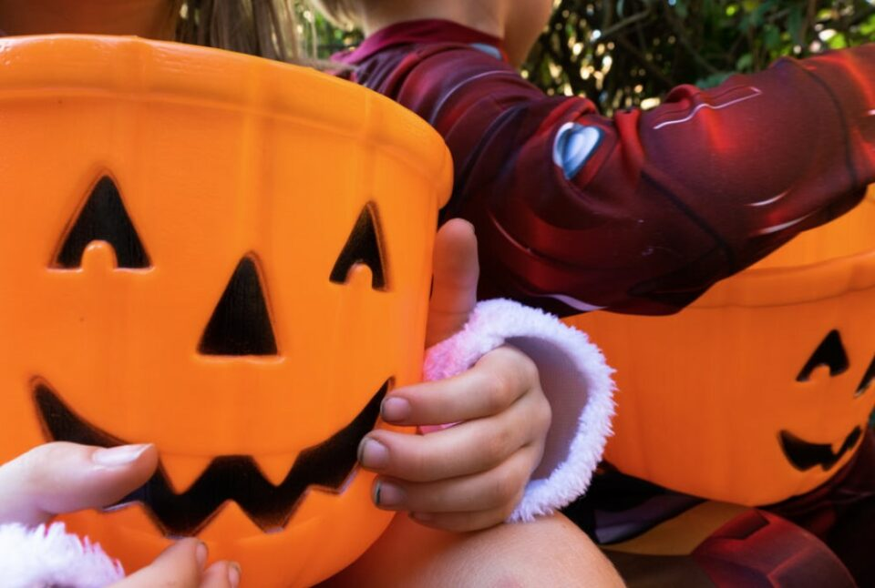
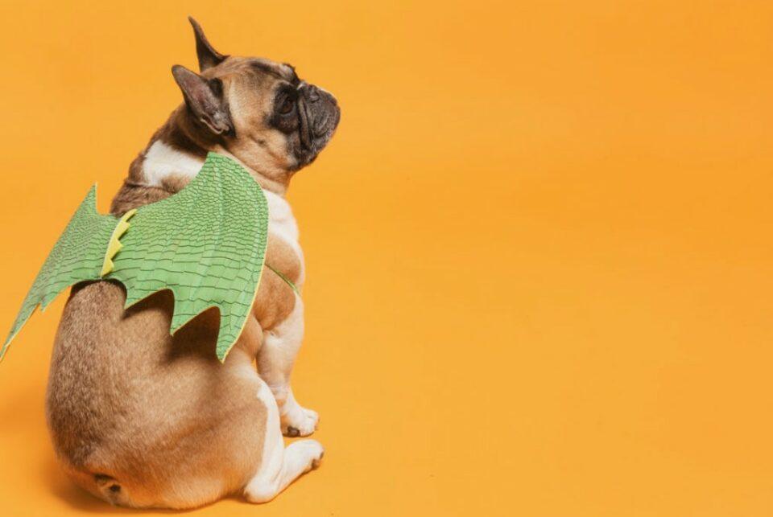
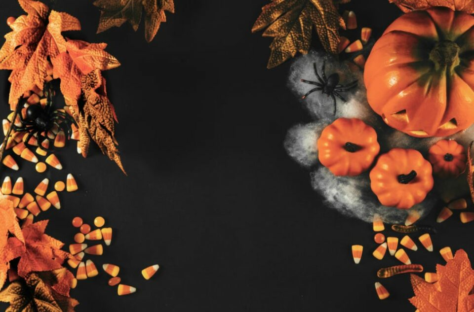

This article has been written and researched by our expert Loveable through a precise methodology. [Learn more about our methodology](https://avada.io/loveable/our-methodological.html)

[Loveable](https://avada.io/loveable/) > [Blog](https://avada.io/loveable/blog/) > [Holiday](https://avada.io/loveable/holiday/)

# 151 Best Halloween Jokes of the Year 2023 – For All Ages 

Written by [Blake Simpson](https://avada.io/loveable/author/blake/) Last Updated on September 19, 2023

- [Funny Halloween Jokes](https://avada.io/loveable/blog/halloween-jokes/#wp-block-heading-2-4)
- [Spooky Halloween Jokes](https://avada.io/loveable/blog/halloween-jokes/#wp-block-heading-2-51)
- [Halloween Jokes For Kids](https://avada.io/loveable/blog/halloween-jokes/#wp-block-heading-2-87)
- [Bottom Line](https://avada.io/loveable/blog/halloween-jokes/#wp-block-heading-2-141) 

Welcome to the spookiest collection of laughter-inducing Halloween jokes for the year 2023! Whether you’re young or young at heart, we’ve gathered the 151 best Halloween jokes that are sure to tickle your funny bone. From ghoulish gags to hilarious witchy one-liners, this collection has something for everyone to enjoy. 

So, get ready to embrace the spirit of Halloween and prepare for a howling good time with these rib-tickling jokes that will have you cackling with delight. Let’s dive into the laughter-filled world of the **151 Best Halloween Jokes** of the Year 2023!

Do you know what can make people smile besides jokes? It’s [funny gifts for Halloween](https://avada.io/loveable/funny-halloween-gifts/)! If you’re planning to surprise your loved ones or friends with spooky and humorous presents on this special holiday, don’t forget to check out [Loveable](http://loveable.ai). We offer a wide range of personalized gifts designed for everyone. Moreover, we also have [Halloween best-selling items from Amazon](https://avada.io/loveable/halloween/). You definitely don’t want to miss out on them!

## **Funny Halloween Jokes**

- What kind of horse do ghosts ride? A night-mare
- What room does a ghost not need in a house? A living room.
- How do ghosts send letters? Through the ghost office.
- What’s a vampire’s favorite ice cream flavor? Vein-illa.
- Why do vampires not want to become investment bankers? They hate stakeholders.
- Why are vampires bad at art? They are only able to draw blood.
- What was the witch’s favorite subject in school? Spelling.
- What do you call two witches who live together? Broom-mates!
- What happened to the witch who flew her broom while angry? She flew off the handle.
- How do you mend a jack-o’-lantern? With a pumpkin patch.
- What’s the best thing to put into a pumpkin pie? Your teeth.
- Why was the jack-o’-lantern scared? Because it had no guts.
- Why aren’t zombies ever arrested? They can’t be captured alive.
- What’s a zombie’s favorite treat? You might guess brain food, but it’s actually eye candy.
- What sea do zombies swim in? The dead sea.
- What do dentists hand out at Halloween? Candy. It’s good for business.
- Who’s the scariest body builder of all time? Dr. Frankenstein.
- Why don’t werewolves ever know the time? Because they’re not whenwolves.
- Knock Knock? Who’s there? Boo! Boo who? Don’t cry, it’s only Halloween.
- Knock Knock? Who’s there? Phillip! Phillip who? Phillip my bag with candy!
- What do you call a witch who lives at the beach? A sand-witch.
- What do you get when you cross a vampire and a snowman? Frostbite.
- What do you call zombies in pajamas? The sleepwalking dead.
- What brand of shampoo do zombies use? Head and Shoulders.
- Why don’t zombies eat popcorn with their hands? They eat their hands separately.
- What is a ghost’s favourite fruit? Booberries!
- Why did the skeleton cross the road? To go to the body shop.
- What do you get when you divide the circumference of a jack-o-lantern by its diameter? Pumpkin Pi.
- Who did Frankenstein take to the prom? His ghoul friend.
- Why do demons and ghouls hang out together? Because demons are a ghoul’s best friend!
- Why did the ghost starch his sheet? He wanted everyone scared stiff.
- What does a panda ghost eat? Bam-BOO!
- Why did the ghost quit studying? Because he was too ghoul for school.
- What do you call a witch with a rash? An itchy-witchy.
- What’s the problem with twin witches? You never know which witch is which.
- How did the witch get around when her broomstick broke? She witch-hiked.
- Why was Cinderella bad at football? Because she had a pumpkin for a coach.
- What’s a pumpkin’s favorite genre? Pulp fiction.
- Why did the pumpkin take a detour? To avoid a seedy part of town.
- Why don’t zombies like pirates? They’re too salty.
- What’s a zombie’s favorite weather? Cloudy, with a chance of brain.
- Why did the zombie become a mortician? To put food on the table.
- Where do zombies live? On a dead-end street.
- What type of plants do well on all Hallow’s Eve? Bam-BOO!
- Why does a witch ride a broomstick? So she can make a clean getaway.

## **Spooky Halloween Jokes**

- How do you know when a ghost is sad? He starts boo hooing.
- What did Dracula say when the witch and the warlock started kissing? Get a broom!
- How do you know you’ve been ghosted? The poltergeist doesn’t text you back.
- What’s a ghost’s favorite play? Romeo and Ghoul-iet.
- What does a ghost mom say when she gets in the car? Fasten your sheet-belts.
- What’s a vampire’s favorite fruit? Neck-tarines.
- Why did Dracula take cold medicine? Because he was coffin too much.
- What’s a vampire’s favorite ice cream flavor? Vein-illa.
- Why do vampires not want to become investment bankers? They hate stakeholders.
- Why are vampires bad at art? They are only able to draw blood.
- What do you get when you drop a pumpkin? Squash.
- What does a carved pumpkin celebrate? Hollow-een.
- Who helped the little pumpkin cross the road? The crossing gourd.
- What did the pumpkin say to its carver? Cut it out!
- What’s a pumpkin’s favorite Western? The Gourd, the Bad, and the Ugly
- Where does a pumpkin preach? From the pulp-it.
- How do gourds grow big and strong? Pumpkin iron.
- I would make a skeleton joke, but you wouldn’t find it very humerus.
- Why don’t I like Dracula? He’s a pain in the neck.
- What’s a vampire’s favorite fruit? Neck-tarines.
- How many cannibals does it take to change a lightbulb? I don’t know but you really shouldn’t be in the dark with a cannibal.
- Why was the cemetery chosen to be the perfect location to write a movie? Because it had great plots.
- Knock Knock? Who’s there? Orange! Orange who? Orange you glad it’s Halloween?
- Knock Knock? Who’s there? Figs! Figs who? Figs your doorbell so I can stop knocking!
- Knock Knock? Who’s there? Witch! Witch who? Witch one of you has my candy?
- What do you call a cleaning skeleton? The grim sweeper.
- What do skeletons order at a restaurant? Spare ribs.
- Why didn’t the skeleton go to the scary movie? He didn’t have the guts.
- What do you call a skeleton who goes out in the snow? A numb-skull
- Why was the gourd so gossipy? To give ’em pumpkin to talk about.
- Why did he jack-o-lantern fail out of school? Someone scooped his brains out.
- What’s a zombie’s favorite cheese? Zom-brie.
- What do you call a movie about zombies finding true love? A zom-com.
- What do vegetarian zombies eat? Graaaains!

## **Halloween Jokes For Kids**

- How do vampires get around on Halloween? On blood vessels.
- What’s it like to be kissed by a vampire? It’s a pain in the neck.
- What’s it called when a vampire has trouble with his house? A grave problem.
- How can you tell when a vampire has been in a bakery? All the jelly has been sucked out of the jelly doughnuts.
- Why are graveyards so noisy? Because of all the coffin.
- How do you get rid of demons? Exorcise a lot.
- I dropped my pumpkin yesterday. Jack-o-lantern? More like crack-o-lantern!
- Where do ghosts go on vacation? Mali-boo.
- What was the chicken ghost’s name? Poultrygeist.
- Who helps the little pumpkins cross the road safely? The crossing gourd.
- What’s a monster’s favourite play? Romeo and Ghouliet.
- What do you call two witches living together? Broommates.
- Where do fashionable ghosts shop for sheets? Bootiques.
- What do mummies listen to on Halloween? Wrap music.
- Why can’t skeletons play church music? Because they have no organs.
- Why did the skeleton start a fight? Because he had a bone to pick.
- Where did the skeleton keep his money? In the crypt-o market.
- What kind of art do skeletons like? Skulltures.
- What is a skeleton’s favorite instrument? A trom-bone.
- Where does a skeleton go for a fun night? Anywhere, as long as it’s a hip joint.
- Do you know any skeleton jokes? Yes, but you wouldn’t find it very humerus.
- What’s a skeleton’s favorite song? “Bad to the Bone.”
- What do you call a witch’s garage? A broom closet.
- What does the vampire’s Valentine say? You’re just my blood type.
- Knock Knock? Who’s there? Iguana. Iguana who? Iguana eat all your candy.
- Knock Knock? Who’s there? Ivana! Ivana who? Ivana suck your blood!
- Why do ghosts go on diets? So they can keep their ghoulish figures
- Where does a ghost go on vacation? Mali-boo.
- Why did the ghost go into the bar? For the Boos.
- Why did the witch take a nap? She needed to rest a spell.
- What’s a witch’s favorite makeup? Ma-scare-a.
- What do witches get when their shoes are too tight? Candy corns.
- How does a witch style her hair? With scare spray.
- What kind of medicine do witches use on their warts? I don’t know, but it’s not working.
- What is in a ghost’s nose? Boo-gers.
- Why did the policeman ticket the ghost on Halloween? It didn’t have a haunting license.
- What’s a ghost’s favorite dessert? I-Scream!
- Why did the vampire read the newspaper? He heard it had great circulation.
- What do you get when you cross a vampire and a snowman? Frostbite.
- Why do skeletons have low self-esteem? They have no body to love.
- Know why skeletons are so calm? Because nothing gets under their skin.
- What is a [zombie](https://avada.io/loveable/zombie-gifts/) sleepover called? Mass grave.
- How do vampires start their letters? Tomb it may concern.
- What treat do eye doctors give out on Halloween? Candy corneas.
- Who won the skeleton beauty contest? No body.
- What kind of food would you find on a haunted beach? A sand-witch!
- How do you know if a zombie likes someone? They ask for seconds.
- What kind of bread do zombies like? Whole brain.
- Why do ghosts make the best cheerleaders? They have a lot of spirit!
- Knock Knock? Who’s there? Ice cream! Ice Cream who? Ice cream every time I see a ghost!
- Knock Knock? Who’s there? Eddie! Eddie who? Eddie body home? It’s Halloween!
- Where do ghosts buy their food? At the ghost-ery store!

## **Bottom Line** 

In conclusion, we hope **these 151 Halloween jokes of 2023** brought laughter and joy to all ages. Keep the Halloween spirit alive and enjoy the timeless merriment they bring. Happy Halloween!

- [Funny Halloween Jokes](https://avada.io/loveable/blog/halloween-jokes/#wp-block-heading-2-4)
- [Spooky Halloween Jokes](https://avada.io/loveable/blog/halloween-jokes/#wp-block-heading-2-51)
- [Halloween Jokes For Kids](https://avada.io/loveable/blog/halloween-jokes/#wp-block-heading-2-87)
- [Bottom Line](https://avada.io/loveable/blog/halloween-jokes/#wp-block-heading-2-141) 

### [Blake Simpson](https://avada.io/loveable/author/blake/)

Hi, I'm Blake from Loveable. I help people find perfect gifts for occasions like anniversaries and weddings. I also write a blog about holidays, sharing insights to make them more meaningful. Let's create unforgettable moments together!

- [Twitter](https://twitter.com/intent/tweet)
- [Facebook](https://www.facebook.com/sharer/sharer.php)
- [instagram](https://avada.io/loveable/blog/halloween-jokes/)
- [pinterest](https://www.pinterest.com/loveablellc/)

## Related Posts

[### 120+ Christian Birthday Wishes To Spread Your Love](https://avada.io/loveable/blog/christian-birthday-wishes/) 

[

### 35 Best 70th Birthday Ideas To Celebrate The Special Milestone

](https://avada.io/loveable/blog/70th-birthday-ideas/)

[

### 50 Best 30th Birthday Decorations for a Remarkable Birthday Bash

](https://avada.io/loveable/blog/30th-birthday-decorations/)

[

### 40 Delicious Vegan Christmas Desserts to Delight Your Palate

](https://avada.io/loveable/blog/vegan-christmas-desserts/)

[

### 60 Christmas Team Building Activities to Boost Workplace Spirit

](https://avada.io/loveable/blog/christmas-team-building-activities/)
