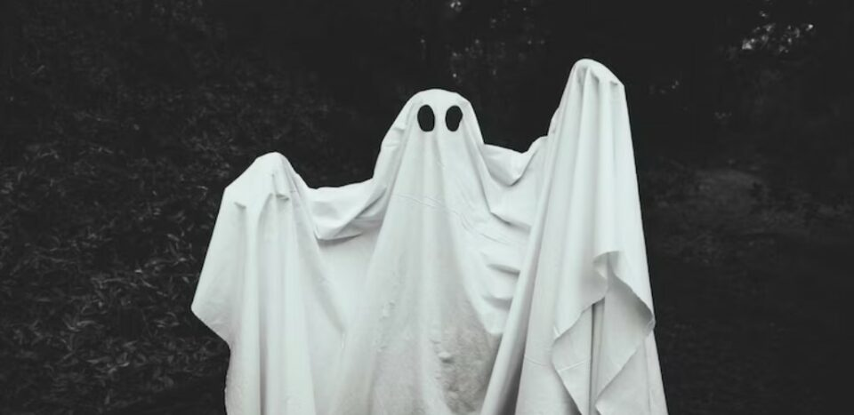
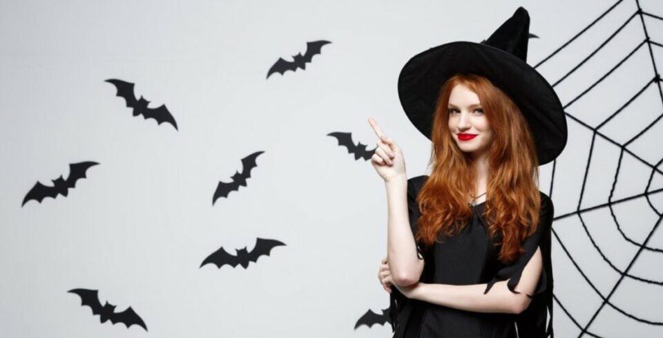
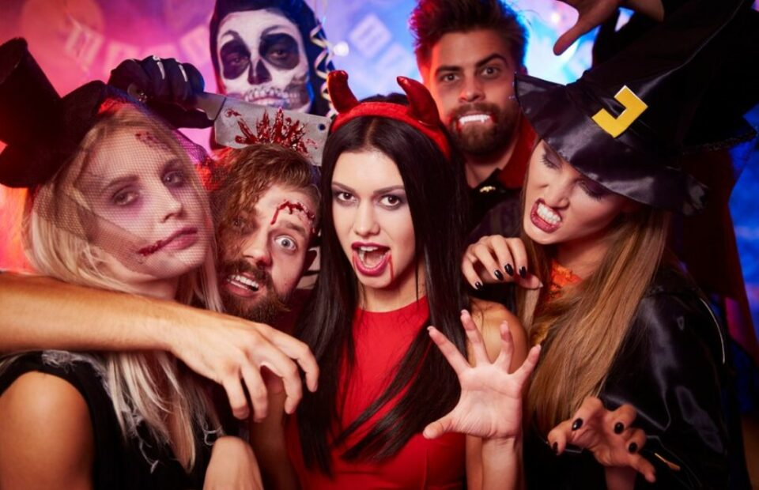
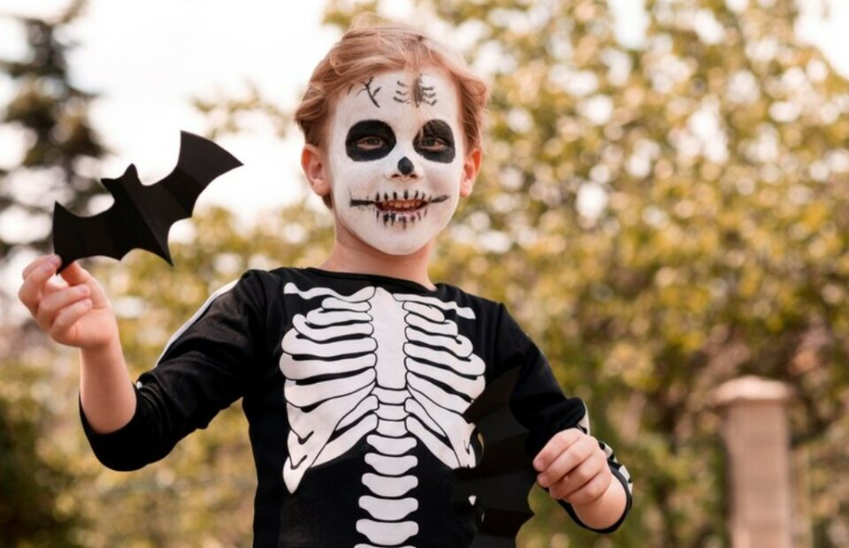
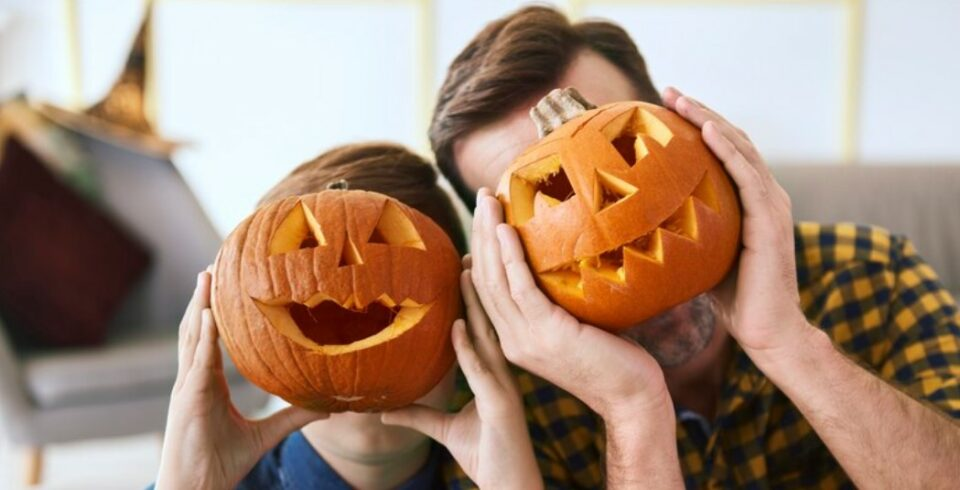
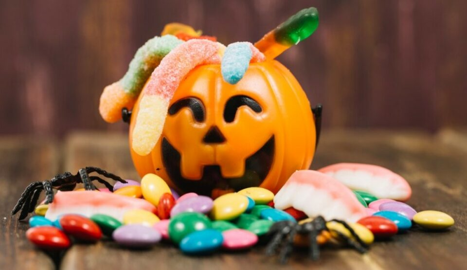

This article has been written and researched by our expert Loveable through a precise methodology. [Learn more about our methodology](https://avada.io/loveable/our-methodological.html)

[Loveable](https://avada.io/loveable/) > [Blog](https://avada.io/loveable/blog/) > [Holiday](https://avada.io/loveable/holiday/)

# 152 Hilarious Halloween Puns 2023 that’ll Make Your Friends and Family Laugh Out Loud

Written by [Blake Simpson](https://avada.io/loveable/author/blake/) Last Updated on September 08, 2023

- [152 Best Halloween Puns For All Ages This October](https://avada.io/loveable/blog/halloween-puns/#wp-block-heading-2-3)
    - [Ghost Halloween Puns](https://avada.io/loveable/blog/halloween-puns/#wp-block-heading-3-4)
    - [Witch Puns](https://avada.io/loveable/blog/halloween-puns/#wp-block-heading-3-36)
    - [Vampire Halloween Puns](https://avada.io/loveable/blog/halloween-puns/#wp-block-heading-3-66)
    - [Skeleton Puns](https://avada.io/loveable/blog/halloween-puns/#wp-block-heading-3-84)
    - [Pumpkin Halloween Puns](https://avada.io/loveable/blog/halloween-puns/#wp-block-heading-3-100)
    - [Candy Puns](https://avada.io/loveable/blog/halloween-puns/#wp-block-heading-3-121)
    - [Mixed Halloween Puns](https://avada.io/loveable/blog/halloween-puns/#wp-block-heading-3-150)
- [Bottom Line](https://avada.io/loveable/blog/halloween-puns/#wp-block-heading-2-173)

Halloween brings to mind [haunted houses](https://avada.io/loveable/blog/decorated-halloween-homes/), [scary movies](https://avada.io/loveable/blog/best-halloween-movies/), and creepy costumes for some. However, others prefer to keep it light on October 31. If you like funny over gory, or simply want to entertain kids, Halloween puns are the perfect choice for you. Luckily, we have a bunch of spook-tacular **Halloween puns** to offer that will make everyone laugh until they cry.

If you crack these Halloween puns at your [Halloween party](https://avada.io/loveable/blog/kids-halloween-party/) or while trick-or-treating with friends and family, you’ll have everyone giggling for sure!

## **152 Best Halloween Puns For All Ages This October**

### **Ghost Halloween Puns**

1. Why are ghosts so lonely? Because they have no-body to love.
2. Ghosts usually go on vacation in Mali-boo.
3. Bring your own boos.
4. What makes a ghost a great cheerleader? They have high spirits.
5. What happens when you drop a pumpkin? – Squash.
6. Ghostest with the mostest.
7. Why do ghosts love elevators? Because it lifts their spirits.
8. You can find me in the boo-bubble bath.
9. Ghosts that haunt hotels are called inn specters.
10. We look fa-boo-lous!
11. We ghosts just wanna have fun!
12. We are here for the boos!
13. Boo-yah!
14. Which dessert do ghosts like? I-scream.
15. Ghosts can go shopping at a boo-tique.
16. I think I have deja-boo.
17. Romeo and Ghouliet.
18. What caused the ghost to cross the road? Because it was a poultry-geist.
19. Boo, Felicia.
20. It’s time to boooo-gie!
21. You’ve ghost to be kidding me!
22. You are so boo-tiful!
23. You are my ghoul-friend.
24. If you have got it, haunt it.
25. It’s the ghostess with the mostest.
26. It is time to lift your spirits!
27. Do you know demons are a ghoul’s best friend?
28. Get into the Halloween spirits!
29. Where are my ghouls at?
30. Shake your boo-ty!

### **Witch Puns**

1. If the broom fits, fly it.
2. What’s going on, witches?
3. You say I’m a witch as if it’s a bad thing.
4. That is witchful thinking.
5. Keep calm and fly the broom!
6. Life’s a witch, and then you fly.
7. Witch you a Happy Happy Halloween!
8. A witch’s favorite subject in school is spelling.
9. According to my DNA test, I am 100% that witch.
10. Feeling witchy.
11. Excuse me, could you tell me witch way to the pumpkin patch?
12. Get your broomstick ready, we’re about to make a clean getaway.
13. You’ve got me under your spell.
14. Watch out for Resting Witch Face.
15. Halloween is not the same if I cannot be witch you.
16. I hope you have a hex-tra special Halloween.
17. Keep calm and carry a wand.
18. Witch upon a star.
19. Here I am, warts and all.
20. If the broom fits!
21. Wicked awesome.
22. Be-witcha in a second!
23. For you, I can brew everything.
24. I dress like a witch because that way I can get what I wand.
25. You look brew-tiful tonight.
26. Witch and famous.
27. Witcha up to now?
28. It’s a brew-tiful day to dress like a witch.

### **Vampire Halloween Puns**

1. You can easily deceive vampires since they are suckers!
2. Those who escape a vampire say what? – So long, sucker!
3. It’s love at first bite.
4. Fangs for the memories.
5. All the vampire puns I know are suck.
6. I am such a pain in the neck.
7. It is in my blood.
8. You make me batty.
9. It sucks to be me.
10. My blood bank account is active.
11. I hope you have a fang-tastic Halloween!
12. It’s time for me to find my necks victim.
13. Come and join my fang club!
14. Vampires hate peaches but adore neck-tarines.
15. Just Count on me.
16. You are my blood type.

### **Skeleton Puns**

1. No body can win the skeleton race.
2. Spine on the dotted line.
3. This is a hip joint.
4. My goal wasn’t to play it safe with a skeleton costume, but to let people know I have guts.
5. Let’s laugh until we’re coffins.
6. Do you how to play the trom-bone?
7. What makes the skeleton sad? He has no body to trick-or-treat with.
8. Bone to be wild!
9. This Halloween is going to be awesome, I can feel it in my bones!
10. Lazy bones.
11. There’s a [Halloween joke](https://avada.io/loveable/blog/halloween-jokes/) I’d like to tell you, but you may not find it humerus.
12. One thing to say about this dish: Bone appétit!
13. I’ll make you skele-run from my skele-puns.
14. It’s time for some skele-fun!

### **Pumpkin Halloween Puns**

1. She is the pumpkin of my eye.
2. I am the Pun-kin King of Halloween!
3. Let’s give ‘em pumpkins to talk about.
4. If I have to gourd my candy with my life, I will.
5. I’m having a gourd time.
6. Oh my gourdness, Halloween has finally come!
7. I’m way ahead of the carve.
8. Go big or gourd home!
9. Carving out some time for Halloween fun.
10. It stuck a gourd in my head.
11. This Halloween, let’s pumpkin spice things up.
12. Pumpkin’ out Halloween puns like there’s no tomorrow.
13. Make sure you carve out some time for pumpkin carving.
14. If your jack-o’-lantern is broken, just use a pumpkin patch to fix it!
15. Squash goals!
16. The pick of the patch is you.
17. You look extremely gourd-geous!
18. Pumpkin spice and everything nice.
19. Keep calm and pumpkin on.

### **Candy Puns**

1. A bag of trick and treats!
2. Halloween is just around the corner, so I did some exorcise to prepare.
3. When I say I love this holiday, I am not playing Twix!
4. This will come in candy.
5. The Halloween candy is spook-tacular.
6. Your costume looks real, it is un-candy!
7. Trick or treat yo’self to some candy!
8. I can’t Reese-ist a good Halloween pun.
9. Halloween candy always seems to go to waist no matter how much you eat.
10. We wish you a happy Halloween full of Snickers and (Almond) Joy.
11. Halloween candy is delicious, but don’t forget to save room for I-scream.
12. My candy isn’t for you to gobblin up!
13. When the Halloween candy comes out, everyone becomes a goblin, no matter what costume they wear!
14. Halloween puns are so (candy) corny, but I love it!
15. Witch better have my candy.
16. Can you tell me who is responsible for the candy corn? The kernel.
17. I’m starbursting to eat all this candy.
18. Pop Rocks my world on Halloween night.
19. You won’t slip through my Butter Fingers.
20. Twix or treat!
21. I won’t sugarcoat it: Give me candy.
22. Trick-or-treating: Do not knock it til you try it.
23. No candy for me. I’m trying to keep my ghoulish figure.
24. Would you mind if I had a skittle candy?
25. Candies that get straight As? Smarties.
26. Which candy is the most forgetful? Airheads.
27. Give me some candy before I fly off the handle.

### **Mixed Halloween Puns**

1. Happy Howl-oween!
2. Fiends for life.
3. Haunting my ex!
4. Too cute to spook, I’m afraid!
5. Such a Hallow-queen!
6. This Halloween, we’re just creepin’ it real.
7. Some folks just have no guts.
8. Don’t be a jerk-o-lantern and share your candy!
9. I’m having a bad scare day.
10. Tricks or it didn’t happen.
11. Let’s get this party startled!
12. Halloween has been such a breath of fresh scare for me.
13. Be scareful how you use it!
14. This Halloween, live on the fright side.
15. A scare is born tonight.
16. Your Halloween puns are eerie-sistible.
17. Fright for the right to party!
18. Trust me, I’ve got every trick or treat in the book.

**Related collections for Halloween you may like:**

- Fun [Halloween Facts](https://avada.io/loveable/halloween-facts/)

- Best [Halloween Captions](https://avada.io/loveable/halloween-captions/)

- [Halloween Pickup Lines](https://avada.io/loveable/blog/halloween-pickup-lines/)

## **Bottom Line**

There is no doubt that the above **Halloween puns** are creative and great for cracking jokes. It is a great way to inject some fun and humor into the holiday season. Whether you are looking for something spooky or something more light-hearted, these puns are sure to bring a smile. Have fun!

- [152 Best Halloween Puns For All Ages This October](https://avada.io/loveable/blog/halloween-puns/#wp-block-heading-2-3)
    - [Ghost Halloween Puns](https://avada.io/loveable/blog/halloween-puns/#wp-block-heading-3-4)
    - [Witch Puns](https://avada.io/loveable/blog/halloween-puns/#wp-block-heading-3-36)
    - [Vampire Halloween Puns](https://avada.io/loveable/blog/halloween-puns/#wp-block-heading-3-66)
    - [Skeleton Puns](https://avada.io/loveable/blog/halloween-puns/#wp-block-heading-3-84)
    - [Pumpkin Halloween Puns](https://avada.io/loveable/blog/halloween-puns/#wp-block-heading-3-100)
    - [Candy Puns](https://avada.io/loveable/blog/halloween-puns/#wp-block-heading-3-121)
    - [Mixed Halloween Puns](https://avada.io/loveable/blog/halloween-puns/#wp-block-heading-3-150)
- [Bottom Line](https://avada.io/loveable/blog/halloween-puns/#wp-block-heading-2-173)

### [Blake Simpson](https://avada.io/loveable/author/blake/)

Hi, I'm Blake from Loveable. I help people find perfect gifts for occasions like anniversaries and weddings. I also write a blog about holidays, sharing insights to make them more meaningful. Let's create unforgettable moments together!

- [Twitter](https://twitter.com/intent/tweet)
- [Facebook](https://www.facebook.com/sharer/sharer.php)
- [instagram](https://avada.io/loveable/blog/halloween-puns/)
- [pinterest](https://www.pinterest.com/loveablellc/)

## Related Posts

[### 120+ Christian Birthday Wishes To Spread Your Love](https://avada.io/loveable/blog/christian-birthday-wishes/) 

[

### 35 Best 70th Birthday Ideas To Celebrate The Special Milestone

](https://avada.io/loveable/blog/70th-birthday-ideas/)

[

### 50 Best 30th Birthday Decorations for a Remarkable Birthday Bash

](https://avada.io/loveable/blog/30th-birthday-decorations/)

[

### 40 Delicious Vegan Christmas Desserts to Delight Your Palate

](https://avada.io/loveable/blog/vegan-christmas-desserts/)

[

### 60 Christmas Team Building Activities to Boost Workplace Spirit

](https://avada.io/loveable/blog/christmas-team-building-activities/)
