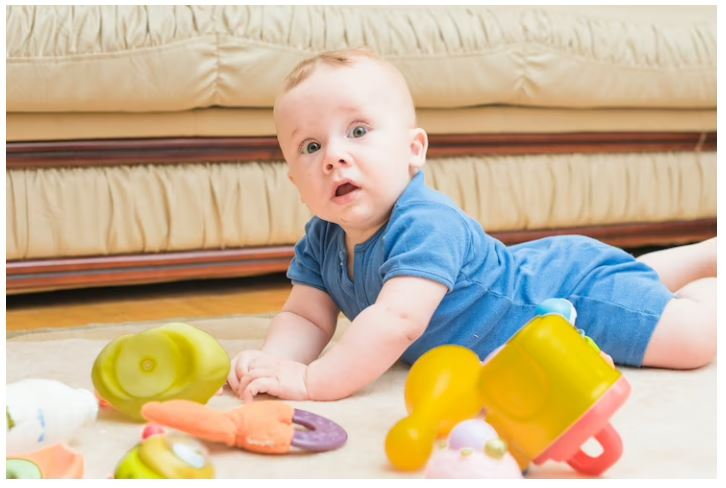
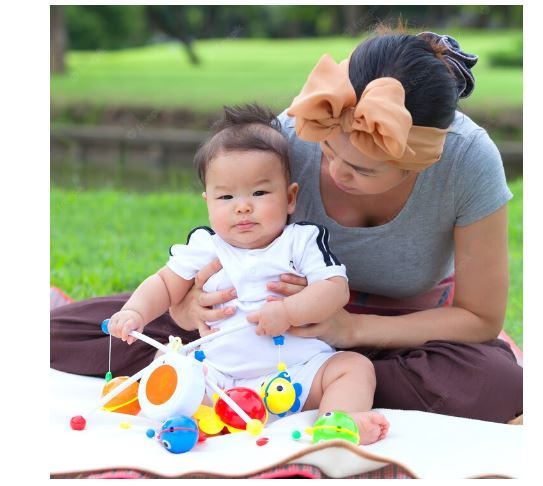
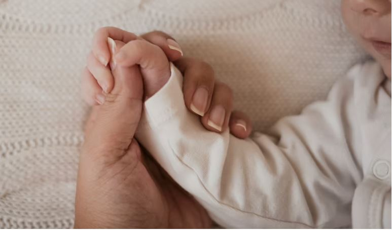
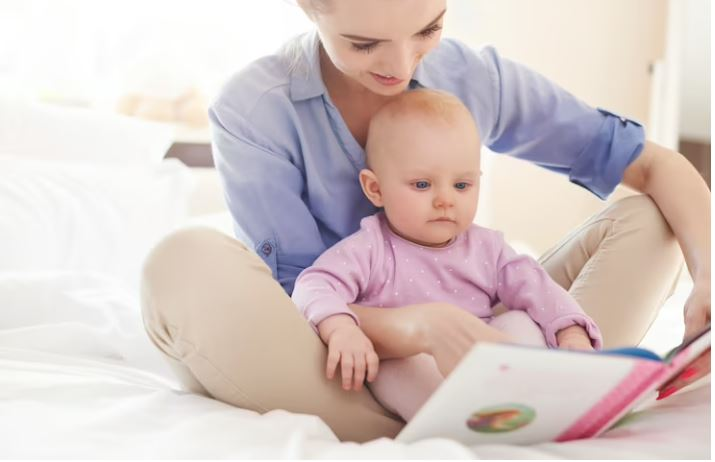
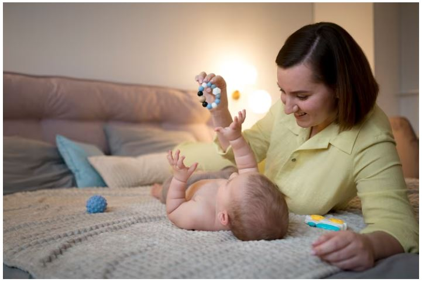
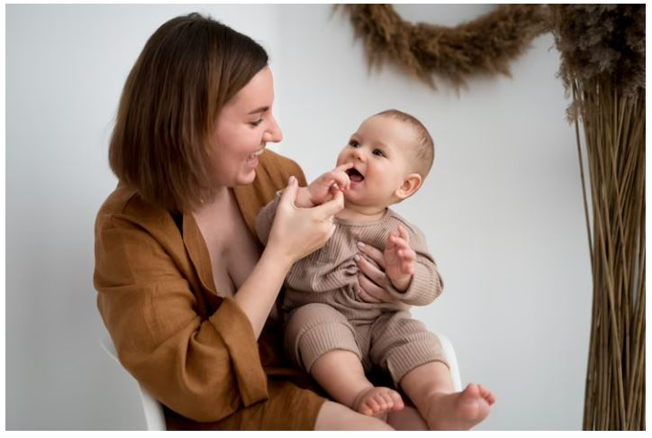

This article has been written and researched by our expert Loveable through a precise methodology. [Learn more about our methodology](https://avada.io/loveable/our-methodological.html)

[Loveable](https://avada.io/loveable/) > [Blog](https://avada.io/loveable/blog/) > [Parenting](https://avada.io/loveable/parenting/)

# 16 Engaging and Stimulating Activities for a 2-Month-Old Baby

Written by [Benjamin Collins](https://avada.io/loveable/author/benjamin/) Last Updated on August 28, 2023

- [16 Stimulating Activities for a 2-Month-Old Baby for Their Brain Development](https://avada.io/loveable/blog/activities-for-2-month-old-baby/#wp-block-heading-2-4)
    - [1\. Give them a Massage](https://avada.io/loveable/blog/activities-for-2-month-old-baby/#wp-block-heading-3-6)
    - [2\. Express Love Directly](https://avada.io/loveable/blog/activities-for-2-month-old-baby/#wp-block-heading-3-9) 
    - [3\. Expose Them to Color and Shape](https://avada.io/loveable/blog/activities-for-2-month-old-baby/#wp-block-heading-3-12)
    - [4\. Talk and Interact with Them](https://avada.io/loveable/blog/activities-for-2-month-old-baby/#wp-block-heading-3-16) 
    - [5\. Touch to Explore](https://avada.io/loveable/blog/activities-for-2-month-old-baby/#wp-block-heading-3-19) 
    - [6\. Hold Their Finger](https://avada.io/loveable/blog/activities-for-2-month-old-baby/#wp-block-heading-3-22)
    - [7\. Take the baby out to sunbathe](https://avada.io/loveable/blog/activities-for-2-month-old-baby/#wp-block-heading-3-26)
    - [8\. Tummy Time](https://avada.io/loveable/blog/activities-for-2-month-old-baby/#wp-block-heading-3-30)
    - [9\. Let The Child Meet Relative](https://avada.io/loveable/blog/activities-for-2-month-old-baby/#wp-block-heading-3-34) 
    - [10\. Read for Them](https://avada.io/loveable/blog/activities-for-2-month-old-baby/#wp-block-heading-3-37)
    - [11\. Use Wiggle Toys](https://avada.io/loveable/blog/activities-for-2-month-old-baby/#wp-block-heading-3-41) 
    - [12\. Cuddle Them](https://avada.io/loveable/blog/activities-for-2-month-old-baby/#wp-block-heading-3-44)
    - [13\. Lullaby](https://avada.io/loveable/blog/activities-for-2-month-old-baby/#wp-block-heading-3-48)
    - [14\. Swatting Game](https://avada.io/loveable/blog/activities-for-2-month-old-baby/#wp-block-heading-3-52)
    - [15\. Hold Their Finger](https://avada.io/loveable/blog/activities-for-2-month-old-baby/#wp-block-heading-3-56)
    - [16\. Imitate Their Facial Expressions](https://avada.io/loveable/blog/activities-for-2-month-old-baby/#wp-block-heading-3-59)
- [Activities for a 2-Month-Old Baby FAQ](https://avada.io/loveable/blog/activities-for-2-month-old-baby/#wp-block-heading-2-63)
    - [How long should I do tummy time with my 2-month-old?](https://avada.io/loveable/blog/activities-for-2-month-old-baby/#wp-block-heading-3-64)
    - [How do I mentally stimulate my 2-week-old?](https://avada.io/loveable/blog/activities-for-2-month-old-baby/#wp-block-heading-3-67)
    - [When should I start teaching my baby?](https://avada.io/loveable/blog/activities-for-2-month-old-baby/#wp-block-heading-3-76)
- [Bottom Line](https://avada.io/loveable/blog/activities-for-2-month-old-baby/#wp-block-heading-2-82) 

As a [new parent](https://avada.io/loveable/funny-gifts-new-parents/), many of you might be asking how to keep your 2-month-old baby engaged and stimulated. At this age, babies are becoming more aware of their surroundings and more curious about the world around them. 

There are numerous fun and interactive activities that you can engage in with your child to enhance their cognitive and physical growth. This is undoubtedly good news for parents who want to provide their children with the best possible development opportunities. From tummy time to sensory play, there are endless ways to keep your baby entertained and learning. 

This article will explore **16 exciting activities for a 2-month-old baby**. So, grab your baby’s favorite blanket and get ready to have some fun!

## **16 Stimulating Activities for a 2-Month-Old Baby for Their Brain Development**

16 Stimulating Activities for a 2-Month-Old Baby for Their Brain Development

### **1\. Give them a Massage**

Learned skills include body awareness and bonding; all you need is yourself and your little one. To start, remove your baby’s clothing until they are only in their diaper and place them on a level surface in a cozy and serene environment. 

Start [massaging](https://www.parents.com/baby/care/newborn/how-to-massage-baby/) in sections, using firm yet gentle strokes on their legs, belly, and arms. Strengthen their back and shoulder areas with a nice massage, and move their legs as if cycling. You can also clap or stretch their arms to help them feel your touch and develop a bond with you.

### **2\. Express Love Directly** 

You will gain emotional development skills through these activities for a 2-month-old. And you will only require yourself and your baby to participate in this activity.

To perform this activity, hug your baby and say ‘I love you’ every time you pick them up. Additionally, make sure to touch your baby lovingly. Even though you may think your baby is too young to comprehend anything, this activity will aid in their emotional development and help them understand the significance of touch.

### **3\. Expose Them to Color and Shape**

Expose Them to Color and Shape

Hang a toy with bright colors over your baby’s crib. The vivid hues will grab your baby’s attention, motivating her to reach out for them. The bright colors will also create a cheerful atmosphere for your baby. 

As she stretches to grasp the toy, she’ll be getting some physical exercise. Toys that emit music and lights will keep her engaged and interested. You’ll be amazed to see your little one batting at the objects.

### **4\. Talk and Interact with Them** 

It’s important to communicate with your little one through facial expressions and ensure they can hear you clearly. Don’t forget to address them during your conversation to let them know you’re talking to them. You’ll be amazed when they start responding with adorable cooing sounds. 

This will help them recognize your voice and tone, ultimately improving their attention span. Encourage more communication by responding to their coos. Keep the conversation going even while you’re busy with daily chores.

### **5\. Touch to Explore** 

Babies can gain knowledge through their sense of touch. To aid in this, you can lay them on different textured bed sheets and blankets to help them explore different surfaces.

When the weather is warm enough, you can even strip them down to their nappy, which allows them to feel the texture with their entire body. Be sure to use soft surfaces and watch your baby’s breathing while carrying out these activities for a 2-month-old.

### **6\. Hold Their Finger**

Hold Their Finger 

The skills your baby can develop through a simple yet effective activity include bonding, sensory and grasping skills. All you need is yourself and your little one. 

Encourage your baby to hold onto your finger for a few minutes every day. This will not only help her connect emotionally with you but also calm her senses and promote better sleep patterns. In addition, these activities for a 2-month-old can enhance her grasping ability.

### **7\. Take the baby out to sunbathe**

To help your baby explore the world around them, consider taking them out for a walk and showing them various things such as the sky, trees, buildings, and cars. As you point to each item, take a moment to explain what it is. This can help your baby develop an interest in their surroundings.

If you want to take your 2-month-old baby outside, it is recommended to do so during the early morning or late afternoon when the sun is not as strong. It is also important to dress your baby in lightweight, protective clothing and use a hat and sunscreen to protect their delicate skin.

**_Related_**: [How To Make Your Baby Food Easily](https://avada.io/loveable/how-to-make-baby-food/)

### **8\. Tummy Time**

Tummy Time

As your little one continues to develop, it’s crucial to provide them with sufficient tummy time on a daily basis. Not only does this aid in releasing trapped gases and reducing colic, but it also supports the development of neck muscles. Before starting this practice, seeking advice from a pediatrician is crucial.

Engaging in tummy time helps your baby strengthen their muscles, which ultimately allows them to roll over and begin exploring their surroundings. Be mindful not to leave your baby on their tummy for extended periods, as this may cause discomfort or strain on their neck and back.

### **9\. Let The Child Meet Relative** 

It is recommended to expose your baby to different people and voices by taking her to family gatherings and get-togethers. This will facilitate better social interaction and prevent confusion or fear. 

However, ensuring that the environment is not overwhelming for the baby is vital. Go for calm, soothing surroundings instead of loud or crowded places to avoid agitation and anxiety. Give your baby the opportunity to interact with others and learn in a comfortable and enjoyable setting.

### **10\. Read for Them**

Read for Them

Introducing a baby to books can aid in the development of cognitive skills, according to the Centers for Disease Control and Prevention (CDC). Reading to a baby as young as two months old can help them comprehend and learn language. 

To do this, simply sit down with your baby and place them on your lap. Show them different picture books and point out the colorful pictures, identifying each item. If it is a storybook, read it aloud to help develop their language and concentration skills. This will also be one of their first opportunities to learn vocabulary and speech.

### **11\. Use Wiggle Toys** 

Wiggle Toys are the most basic form of play that attracts babies naturally. Brightly colored objects, especially those that rattle, catch their attention. Babies at 2 months can see up to 45cm away from their eyes, allowing them to focus on objects brought close to their faces for a short period. 

By playing with toys that they find attractive, especially rattling ones, you can help develop this ability. Move the toy in different directions, closer and further away from their face, while adding sound effects, talking, and singing to make it more engaging.

### **12\. Cuddle Them**

Cuddle Them 

Cuddling with your baby is a crucial sensory activity that offers significant advantages for both the mother and child. Cuddle time refers to any activity that involves skin-to-skin contact between you and your little one. Take out some time to embrace and express your affection for your baby. 

You can do this while breastfeeding, putting them to sleep, or giving them a massage. The more you touch, the stronger the bond grows between you and your baby. Cuddle time has multiple benefits for your baby, including enhanced psychological and physical growth, better sleep quality, and stress relief.

### **13\. Lullaby**

Lullabies are songs or melodies sung to soothe babies and help them fall asleep. The significance of lullabies to a baby lies in their calming effect on the child’s body and mind. Babies find comfort in lullabies’ repetitive and rhythmic patterns, which can help them feel secure and safe.

Singing and humming your baby’s favorite song while changing the tone of your voice can be among great activities for a 2-month-old. Your infant may respond to your singing and try to focus on it, indicating different pitches with gestures or facial expressions.

Lullabies can also provide a sense of bonding and connection between the caregiver and the baby. In addition, research has shown that listening to lullabies can benefit babies physically and cognitively. For example, studies have found that lullabies can help regulate a baby’s breathing and heart rate, and may even promote brain development.

### **14\. Swatting Game**

Swatting Game

It’s important to note that improving hand-eye coordination is a crucial skill for infants. You can aid this development by providing them with colorful and exciting toys like rattles or play gyms. Placing a bright toy above their crib can also uplift their mood and encourage them to reach for it, which in turn helps them stretch and exercise their body. 

It’s worth remembering that not all infants develop at the same pace, so if your child isn’t interested or ready for these exercises, try again in a few weeks. You may be surprised to see your child swatting at the objects, as the sounds and lighting can help with their sensory development.

### **15\. Hold Their Finger**

To help your baby sleep better and improve their ability to learn, it’s important to keep them calm and secure. One way to strengthen your emotional bond with your infant is to let them hold onto your finger for a brief moment each day. This simple act can help your baby feel more connected to you and promote a sense of calmness.

In the early months of life, babies have a strong grip reflex, which means they will automatically grasp onto objects that touch their palms. Holding your baby’s finger can help them explore this reflex and develop their hand-eye coordination.

### **16\. Imitate Their Facial Expressions**

Imitate Their Facial Expressions

Babies are naturally drawn to faces and find them captivating. By introducing them to different facial features, you can encourage them to form connections with the people around them. One way to do this is by sketching a simple face and discussing its various qualities with your baby while touching their own facial features. 

These sensory experiences are crucial for a baby’s development and help them build a better understanding of the world around them. It is crucial to give 2-month-olds ample chances to discover and acquire knowledge.

## **Activities for a 2-Month-Old Baby FAQ**

### **How long should I do tummy time with my 2-month-old?**

It is recommended to start with two or three sessions of tummy time each day, lasting for three to five minutes per session. As your baby grows and develops, it’s crucial to gradually increase tummy time by 10 minutes each month until they reach six months of age and can roll over in both directions. 

However, it is important to continue placing your baby on their stomach for play even after they can roll over. Please remember that the following are just recommendations, and there is no set amount of tummy time your baby needs to have.

### **How do I mentally stimulate my 2-week-old?**

Here are a few suggestions to help your newborn learn and play:

– Make various facial expressions, such as smiling, sticking out your tongue, etc., for your baby to imitate and learn from.

– Use a favorite toy or shake a rattle to grab your newborn’s attention and encourage them to follow.

– It’s important to let your baby spend some time on their tummy as it helps in building their neck and shoulder muscles. However, it’s crucial to keep a close eye on your baby during this time and be ready to lend a hand in case they get exhausted or upset.

– Talk and read to your baby to help their language development.

– Play some soothing music and hold your baby while swaying gently to the rhythm.

– Sing a familiar lullaby to your baby, especially during fussy times, as the familiarity of the sound and words will have a calming effect.

How do I mentally stimulate my 2-week-old?

### **When should I start teaching my baby?**

When your child plays and interacts with you, they are constantly learning and becoming smarter. Many parents wonder when they can start teaching their baby, but the truth is that between 6-12 months is a great age for learning and engaging in activities together. 

Feel free to get creative with your playtime, using sounds, touch, taste, and more to teach your baby. You don’t need an expensive learning kit – all you need is to spend quality time playing with your little one.

**_See More:_**

- [Activities for Your 3-Month-Old Baby](https://avada.io/loveable/blog/activities-for-3-month-old-baby/)

- Fun And Stimulating [Activities with 4-Month-Old Baby](https://avada.io/loveable/blog/activities-4-month-old-baby/)

## **Bottom Line** 

If you want to enhance your baby’s sensory development, there are various methods to do so. Among these, playing with your baby and exposing them to different types of play is one of the most efficient ways. While there are countless play activities that you can do with your infant, the most important thing is to choose only those that involve the senses in some way or involve the use of toys and other objects.

To make your baby feel comfortable and secure, play with your child for at least 20 minutes at least 5 times per day. You can do **many activities for a 2-month-old with your baby** to help him feel more connected with you and reduce nervousness and anxiety.

- [16 Stimulating Activities for a 2-Month-Old Baby for Their Brain Development](https://avada.io/loveable/blog/activities-for-2-month-old-baby/#wp-block-heading-2-4)
    - [1\. Give them a Massage](https://avada.io/loveable/blog/activities-for-2-month-old-baby/#wp-block-heading-3-6)
    - [2\. Express Love Directly](https://avada.io/loveable/blog/activities-for-2-month-old-baby/#wp-block-heading-3-9) 
    - [3\. Expose Them to Color and Shape](https://avada.io/loveable/blog/activities-for-2-month-old-baby/#wp-block-heading-3-12)
    - [4\. Talk and Interact with Them](https://avada.io/loveable/blog/activities-for-2-month-old-baby/#wp-block-heading-3-16) 
    - [5\. Touch to Explore](https://avada.io/loveable/blog/activities-for-2-month-old-baby/#wp-block-heading-3-19) 
    - [6\. Hold Their Finger](https://avada.io/loveable/blog/activities-for-2-month-old-baby/#wp-block-heading-3-22)
    - [7\. Take the baby out to sunbathe](https://avada.io/loveable/blog/activities-for-2-month-old-baby/#wp-block-heading-3-26)
    - [8\. Tummy Time](https://avada.io/loveable/blog/activities-for-2-month-old-baby/#wp-block-heading-3-30)
    - [9\. Let The Child Meet Relative](https://avada.io/loveable/blog/activities-for-2-month-old-baby/#wp-block-heading-3-34) 
    - [10\. Read for Them](https://avada.io/loveable/blog/activities-for-2-month-old-baby/#wp-block-heading-3-37)
    - [11\. Use Wiggle Toys](https://avada.io/loveable/blog/activities-for-2-month-old-baby/#wp-block-heading-3-41) 
    - [12\. Cuddle Them](https://avada.io/loveable/blog/activities-for-2-month-old-baby/#wp-block-heading-3-44)
    - [13\. Lullaby](https://avada.io/loveable/blog/activities-for-2-month-old-baby/#wp-block-heading-3-48)
    - [14\. Swatting Game](https://avada.io/loveable/blog/activities-for-2-month-old-baby/#wp-block-heading-3-52)
    - [15\. Hold Their Finger](https://avada.io/loveable/blog/activities-for-2-month-old-baby/#wp-block-heading-3-56)
    - [16\. Imitate Their Facial Expressions](https://avada.io/loveable/blog/activities-for-2-month-old-baby/#wp-block-heading-3-59)
- [Activities for a 2-Month-Old Baby FAQ](https://avada.io/loveable/blog/activities-for-2-month-old-baby/#wp-block-heading-2-63)
    - [How long should I do tummy time with my 2-month-old?](https://avada.io/loveable/blog/activities-for-2-month-old-baby/#wp-block-heading-3-64)
    - [How do I mentally stimulate my 2-week-old?](https://avada.io/loveable/blog/activities-for-2-month-old-baby/#wp-block-heading-3-67)
    - [When should I start teaching my baby?](https://avada.io/loveable/blog/activities-for-2-month-old-baby/#wp-block-heading-3-76)
- [Bottom Line](https://avada.io/loveable/blog/activities-for-2-month-old-baby/#wp-block-heading-2-82) 

### [Benjamin Collins](https://avada.io/loveable/author/benjamin/)

I'm Benjamin Collins, a gift ideas creator at Loveable. We specialize in unique and personalized gifts for any occasion. With my honed skills, I recommend gifts tailored to the recipient's personality and interests, whether it's Halloween, Christmas, or any other celebration.

- [Twitter](https://twitter.com/intent/tweet)
- [Facebook](https://www.facebook.com/sharer/sharer.php)
- [instagram](https://avada.io/loveable/blog/activities-for-2-month-old-baby/)
- [pinterest](https://www.pinterest.com/loveablellc/)

## Related Posts

[

### 79 Heartfelt Missing Mom Quotes for Expressing Love and Longing

](https://avada.io/loveable/blog/missing-mom-quotes/)

[

### Parenting with Depression: Strategies for Coping, Seeking Help, and Building Resilience

](https://avada.io/loveable/blog/parenting-with-depression/)

[

### 100 Empowering Single Mom Quotes: Inspirational Words for Strong Mothers

](https://avada.io/loveable/blog/single-mom-quotes/)

[

### 99+ Heartfelt Quotes And Wishes: Happy Anniversary to Mom and Dad!

](https://avada.io/loveable/blog/quotes-happy-anniversary-mom-dad/)

[

### 5 Ways to Foster a Positive Parent-Teacher Relationship

](https://avada.io/loveable/blog/parent-teacher-relationship/)
