This article has been written and researched by our expert Loveable through a precise methodology. [Learn more about our methodology](https://avada.io/loveable/our-methodological.html)

[Loveable](https://avada.io/loveable/) > [Blog](https://avada.io/loveable/blog/) > [Parenting](https://avada.io/loveable/parenting/)

# 16 Playful and Educational 7 Months Old Activities: Fun Ideas for Your Baby’s Development

Written by [Benjamin Collins](https://avada.io/loveable/author/benjamin/) Last Updated on August 28, 2023

- [16 Best 7-Month-Old Activities That Will Help Them Develop](https://avada.io/loveable/blog/7-months-old-activities/#wp-block-heading-2-4)
    - [1\. Start Exploring Outside World](https://avada.io/loveable/blog/7-months-old-activities/#wp-block-heading-3-5) 
    - [2\. Show Them the Family Picture](https://avada.io/loveable/blog/7-months-old-activities/#wp-block-heading-3-9) 
    - [3\. Have fun With Beach Ball.](https://avada.io/loveable/blog/7-months-old-activities/#wp-block-heading-3-13) 
    - [4\. Let Them Try New Food](https://avada.io/loveable/blog/7-months-old-activities/#wp-block-heading-3-15)
    - [5\. Play With Block](https://avada.io/loveable/blog/7-months-old-activities/#wp-block-heading-3-19) 
    - [6\. Hand Puppets](https://avada.io/loveable/blog/7-months-old-activities/#wp-block-heading-3-22)
    - [7\. Clapping Together](https://avada.io/loveable/blog/7-months-old-activities/#wp-block-heading-3-25) 
    - [8\. Do Some Gym](https://avada.io/loveable/blog/7-months-old-activities/#wp-block-heading-3-27) 
    - [9\. Peek-a-boo](https://avada.io/loveable/blog/7-months-old-activities/#wp-block-heading-3-31)
    - [10\. Rhyme Time](https://avada.io/loveable/blog/7-months-old-activities/#wp-block-heading-3-33)
    - [11\. Shadow Play](https://avada.io/loveable/blog/7-months-old-activities/#wp-block-heading-3-35)
    - [12\. Noisy Container](https://avada.io/loveable/blog/7-months-old-activities/#wp-block-heading-3-38)
    - [13\. Tactile play through textures](https://avada.io/loveable/blog/7-months-old-activities/#wp-block-heading-3-41)
    - [14\. Hidden Object](https://avada.io/loveable/blog/7-months-old-activities/#wp-block-heading-3-43) 
    - [15\. Read Picture Book](https://avada.io/loveable/blog/7-months-old-activities/#wp-block-heading-3-47)
    - [16\. Water Fun Time](https://avada.io/loveable/blog/7-months-old-activities/#wp-block-heading-3-50)
- [7 Best Educational Items for 7-month-old to Give Them Comprehensive Development](https://avada.io/loveable/blog/7-months-old-activities/#wp-block-heading-2-53)
    - [Turn and Learn Driver For Toddler](https://avada.io/loveable/blog/7-months-old-activities/#wp-block-heading-3-55)
    - [Wiggle and Crawl Ball](https://avada.io/loveable/blog/7-months-old-activities/#wp-block-heading-3-59)
    - [Kids Pull-Back Vehicle Set](https://avada.io/loveable/blog/7-months-old-activities/#wp-block-heading-3-63)
    - [Discovery Activity Center and Table For 7 Month Old](https://avada.io/loveable/blog/7-months-old-activities/#wp-block-heading-3-67) 
    - [Flip Fish Soft Baby Toy](https://avada.io/loveable/blog/7-months-old-activities/#wp-block-heading-3-70)
    - [Pop-Up Toys for Babies](https://avada.io/loveable/blog/7-months-old-activities/#wp-block-heading-3-73)
    - [My Very Own Tool Set for Kids](https://avada.io/loveable/blog/7-months-old-activities/#wp-block-heading-3-77) 
- [FAQ 7 Months Old Activities and Things to Know](https://avada.io/loveable/blog/7-months-old-activities/#wp-block-heading-2-80) 
    - [Should my 7-month-old be crawling?](https://avada.io/loveable/blog/7-months-old-activities/#wp-block-heading-3-81)
    - [Is it OK for 7 month old to play alone?](https://avada.io/loveable/blog/7-months-old-activities/#wp-block-heading-3-83)
    - [Why does my 7-month-old get bored so easily?](https://avada.io/loveable/blog/7-months-old-activities/#wp-block-heading-3-85)
- [Bottom Line](https://avada.io/loveable/blog/7-months-old-activities/#wp-block-heading-2-90) 

Congratulations! Your little one has now reached the exciting stage of being 7 months old. At this point, your baby is making amazing progress in terms of physical, emotional, and cognitive development. He might be sitting up alone and even crawling to explore his surroundings.

Playing with your 7-month-old is a great way to support his ongoing growth and development. For babies, playtime is just as important as sleep and nutrition. Experts say that play is the primary way that little ones explore and interact with the world around them. 

As a parent, watching your baby grow and develop is a source of immense happiness. If you’re looking for some fun games and activities to play with your little one, here are some great options to consider. Not only will these **7 Months Old activities** be entertaining, but they’ll also help support your baby’s development. Be sure to read through the benefits and strategies to make the most out of your playtime together.

## 16 Best 7-Month-Old Activities That Will Help Them Develop

### **1.** **Start Exploring Outside World** 

Watching your baby grow and learn is such a rewarding experience. Why not take them outdoors to explore and discover new things? You can let them touch and feel different textures, like grass, sand, and mud, under your watchful eye. 

There’s so much to discover outside, from crunching leaves and picking up sticks to smelling flowers and dipping their toes in the water. All these simple activities can have a big impact on your 7-month-old’s development.

### **2\. Show Them the Family Picture** 

Your little one is starting to recognize familiar faces, and you can help nurture this ability with a fun game. Sit with your baby in your lap and bring out the family photo album. Show them pictures of people they know and interact with regularly, starting with your own pictures and gradually moving to others.

Use brightly colored and close-up photos, and point to each person as you say their name or relation to the baby. Even if they don’t understand everything, your baby will start to connect names with faces thanks to this activity.

**_Related_:** Best [Family Tree Gifts](https://avada.io/loveable/family-tree-gifts/) That Every Family Member Will Love

### **3\. Have fun With Beach Ball.** 

Playing with a ball is always fun, but did you know it can also help your baby’s development? Try this exercise: place your baby’s tummy on the ball and slowly move them forward until their hands reach the floor. This will help them build strength in their upper body and core muscles. Plus, it’s a fun way to play!

### **4\. Let Them Try New Food**

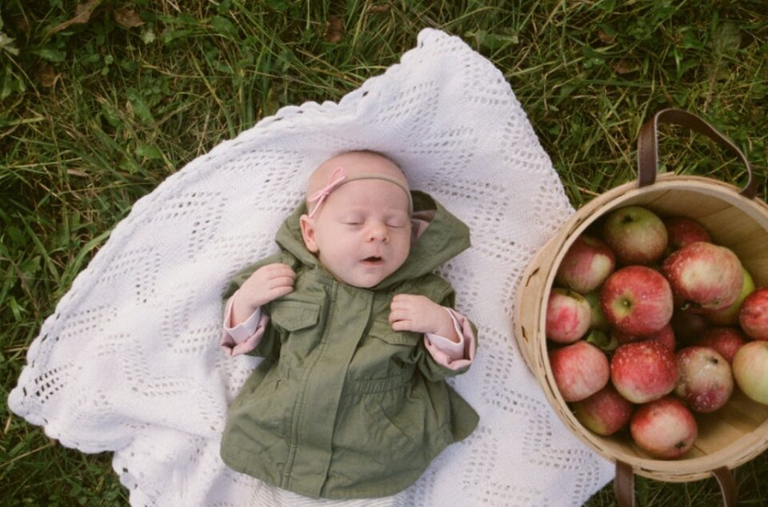

As your baby is now getting accustomed to solid foods, it’s a perfect time to introduce new flavors and textures. Experiment with different fruits and vegetables – offer some finger foods if you’re using purees, or try new dishes if you’re doing baby-led weaning. Don’t be afraid to expand your family’s menu and enjoy meals together!

Look for more baby nutritional advice at [Healthy Children](https://www.healthychildren.org/English/ages-stages/baby/feeding-nutrition/Pages/default.aspx)

### **5\. Play With Block** 

Playing with blocks is a classic baby toy that can help your little one develop their motor skills. To try a simple Montessori activity with your seven-month-old, sit next to them with the blocks in front of you. Show them how to stack the blocks one by one, and encourage them to hold a block and try stacking it too. 

As they get the hang of it, they’ll likely start picking up the blocks on their own and stacking them. Using brightly colored blocks can make it even more fun for them!

### **6\. Hand Puppets**

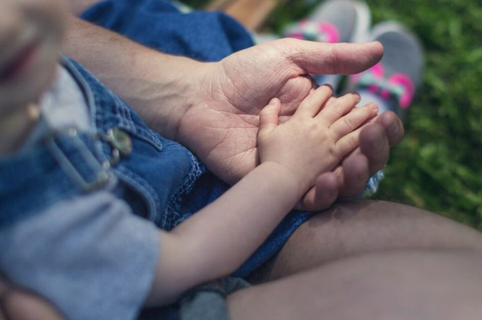

Puppets are amazing toys that can help your baby develop language, social, and emotional skills through fun and imaginative play. To play this game, sit behind a sofa or a big cushion and make the puppet visible to your baby. Move the puppet around and make funny sounds, pretending that it’s alive. Peek out from behind the object and watch your baby’s excited reaction. This game is guaranteed to spark joy and curiosity in your little one!

### **7\. Clapping Together** 

Sit facing your baby and sing a fun rhyme or song while clapping your hands. Encourage your little ones to join in by showing them how to clap along. Watch as they try to copy the clapping motion and see how excited they get. Let them practice clapping on their own, and before you know it, they’ll have mastered this fun and helpful skill, improving their hand-eye coordination and movement.

### **8\. Do Some Gym** 

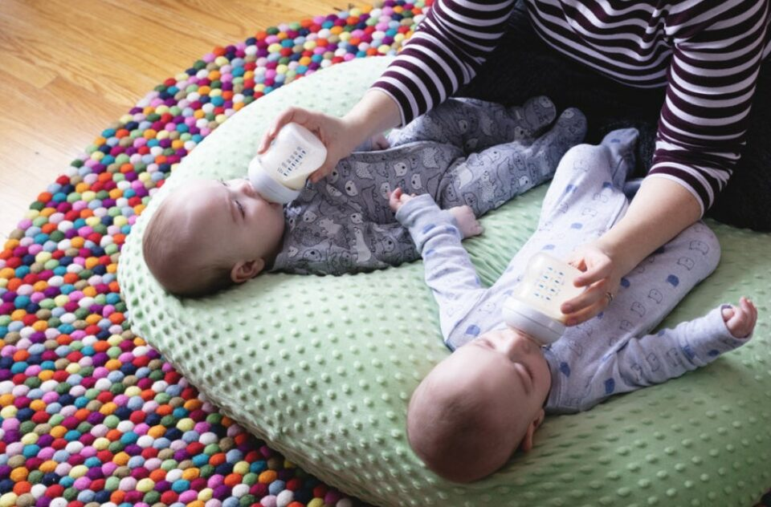

As your baby progresses from tummy time, it’s time to introduce them to baby push-ups. This will help strengthen their upper body for crawling. To get your baby to do a push-up, place their favorite toy above their head while they’re on their tummy or make funny sounds while kneeling in front of them. Encourage them to lift their chest off the floor and look up. Your baby may even surprise you by doing a plank!

**Related:** Check out some helpful tips to get your baby some exercise at [The Bump](https://www.thebump.com/a/baby-exercises)

### **9\. Peek-a-boo**

I couldn’t finish this list without bringing up the timeless game of Peek-a-boo. You can make it more exciting by incorporating a mirror into the game. Since your 7-month-old is still learning about object permanence, this can be a fun way to enhance their depth and perception abilities.

### **10.** **Rhyme Time**

Sit your little one on your lap and open a brightly illustrated nursery rhyme book. Read the rhymes playfully and musically while pointing at the illustrations. Your baby may not understand the words but will be intrigued by the pictures and entertained by your playful tone. Use a sing-song style; your baby may even mimic some of the sounds. This helps them not only listen but also process words.

### **11\. Shadow Play**

When your 7-month-old has trouble sleeping, playing with light and shadows can be a great way to help them relax. It’s amazing how mesmerized babies can be by the way shadows move on the wall! Just grab a flashlight and use toys, household objects, or even your hands to create a calming nighttime shadow show for your little one.

### **12\. Noisy Container**

As your baby turns seven months old, he will enjoy exploring cause and effect by hitting objects. Here’s a fun activity to encourage his investigative skills: take two containers, one filled with small toys or building blocks and the other with baby cereal or sand outdoors. Shake them to make noise and show the baby the source of the sound. 

Your little one will try to grab and move the containers on his own, improving his hand-eye coordination. This activity also helps develop his hearing abilities and responsiveness to sounds.

### **13\. Tactile play through textures**

This activity is essential for developing foundational skills such as fine and gross motor skills, visual perceptual, and visual motor skills. To play, encourage your baby to explore various textures with their whole body by laying down different textured fabrics or toys around them. This encourages mobility and the desire to grasp different objects.

### **14\. Hidden Object** 

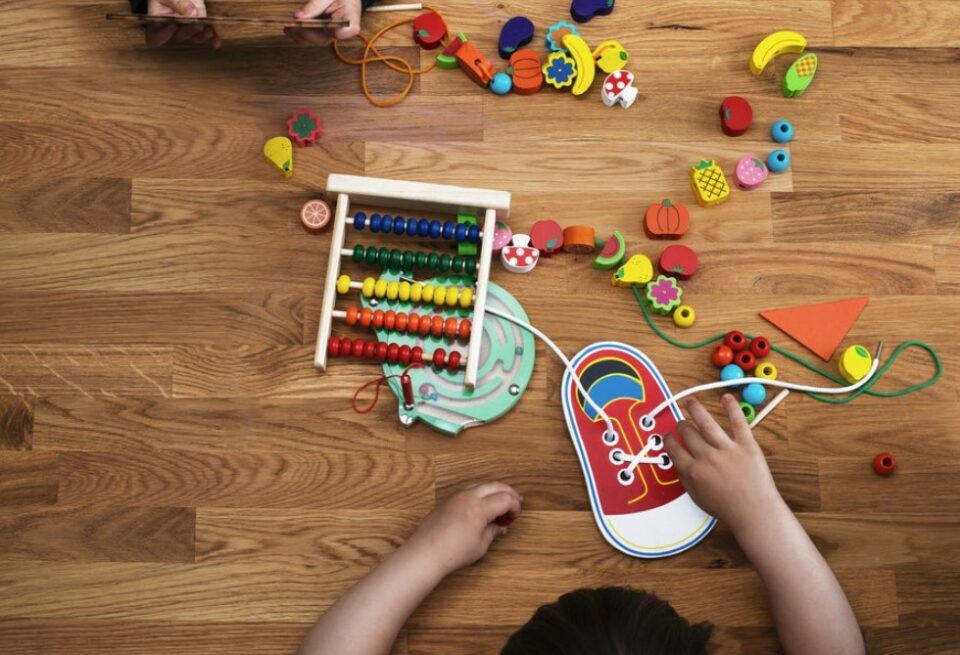

Grab three transparent cups or bowls and place them in a line. Next, take a small toy and place it under one of the cups while your baby watches. Shuffle the cups around and see how your baby reacts. Then, ask your baby to find the cup with the toy under it and give them a little tap as a hint. 

Your baby will be fascinated by the moving cups and may even try to tap the cup with the toy inside. This game is an excellent way to engage your baby’s attention and improve their hand-eye coordination.

### **15\. Read Picture Book**

One activity for a 7-month-old is to read a picture book. Choose a brightly illustrated book with simple images and large text. Sit with your baby on your lap and point to the pictures as you read the text. Use different voices and facial expressions to make the reading experience more engaging. Your baby may not understand the words, but they will enjoy the pictures and the sound of your voice.

**Related:** Best [Personalized Children’s Books](https://avada.io/loveable/personalized-children-books/) That They’ll Be Happy

### **16\. Water Fun Time**

Here’s a fun game to play with your 7-month-old during bath time. Fill up the bath or an inflatable pool with water to half its capacity so that only your baby’s legs are covered. Place some favorite toys in the water and sit your baby in the pool. Hold one of the toys and move it underwater in a way that your baby can see it. Splash the water around with the toy to get your baby interested and encourage them to grab the toy. 

Your baby will reach out to grab the toys and try splashing them to explore cause and effect, as well as to experience the sensory feel of the water. Get ready for some fun water splashing!

## 7 Best Educational Items for 7-month-old to Give Them Comprehensive Development

At 7 months old, babies are rapidly developing their cognitive and motor skills, making it a critical time for educational stimulation. Here are six of the best educational [items for toddlers](https://avada.io/loveable/toddler-christmas-gifts/) that can aid in their comprehensive development.

### [**Turn and Learn Driver For Toddler**](https://www.amazon.com/VTech-Learn-Driver-Frustration-Packaging/dp/B078KGNGNS/ref=sr_1_3?keywords=toys%2Bfor%2B7%2Bmonth%2Bold&qid=1683974408&sr=8-3&th=1)

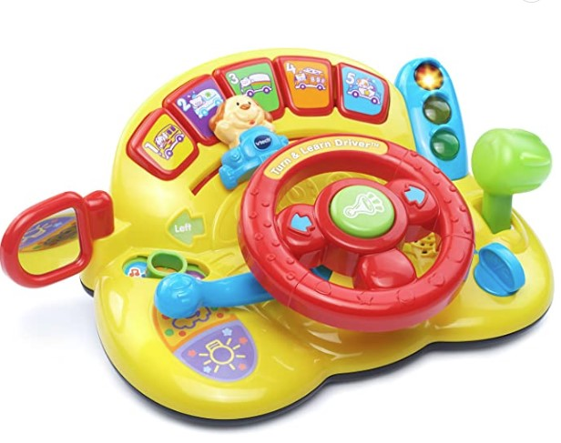

The Learn to Drive is a toy that is suitable for the development of 7-month-old babies. This toy is designed to look like a steering wheel, which can be easily grasped by little hands. 

At 7 months old, babies are starting to develop hand-eye coordination, and the Learn to Drive toy can help them with this. The bright colors and flashing lights can help to stimulate their visual senses, while the different sounds and music can help to develop their hearing.

### [**Wiggle and Crawl Ball**](https://www.amazon.com/VTech-Wiggle-and-Crawl-Ball/dp/B01D2TC31Y/ref=sr_1_9?keywords=toys%2Bfor%2B7%2Bmonth%2Bold&qid=1683974408&sr=8-9&th=1)

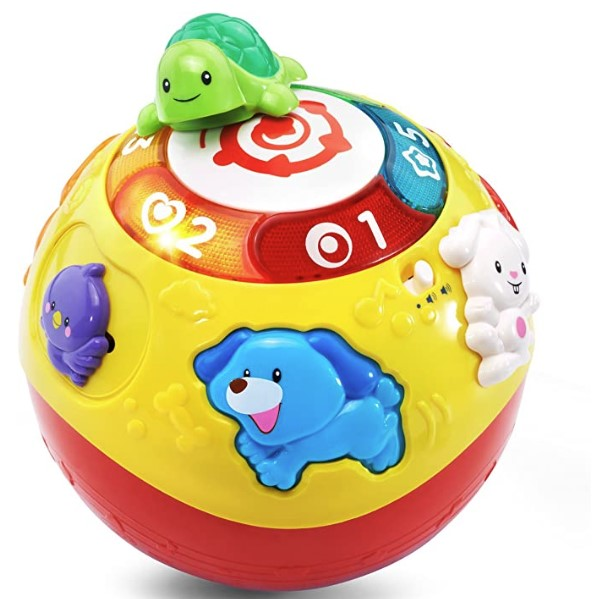

The VTech Wiggle Ball is a great choice for parents who want to stimulate their baby’s sensory perception and gross motor skills.

At 7 months old, babies are starting to develop their gross motor skills, and the Wiggle and Crawl Ball can help with this development by encouraging them to crawl, chase, and interact with the ball. The ball’s interactive features can also help to develop the baby’s sensory perception, including hearing and vision.

### [**Kids Pull-Back Vehicle Set**](https://www.amazon.com/Melissa-Doug-Pull-Back-Vehicles-Carrying/dp/B00EX5K1GG/ref=sr_1_11?keywords=toys+for+7+month+old&qid=1683974408&sr=8-11)

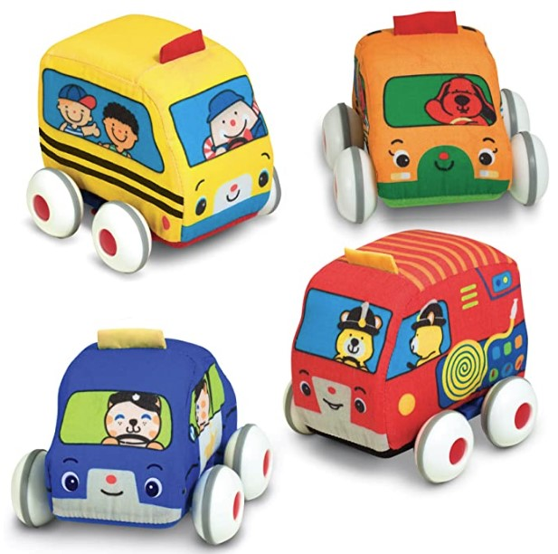

The vehicles are made with high-quality materials, including soft fabric and safe plastic parts, which make them durable and safe for babies to play with. Additionally, the vehicles’ bright colors and different textures can help stimulate the baby’s visual and tactile senses.

At 7 months old, babies are starting to develop their motor skills, and the Melissa & Doug Pull-Back Vehicles set can help with this development. The pull-back mechanism allows babies to easily move the vehicles, which can help to improve their hand-eye coordination and fine motor skills.

### [**Discovery Activity Center and Table For 7 Month Old**](https://www.amazon.com/Baby-Einstein-Around-Discovery-Activity/dp/B07QZSDWXW/ref=sr_1_18_sspa?keywords=toys+for+7+month+old&qid=1683974408&sr=8-18-spons&psc=1&spLa=ZW5jcnlwdGVkUXVhbGlmaWVyPUFZSUNEUDNWNzM4WFcmZW5jcnlwdGVkSWQ9QTA2NDM1NzgzTVZUS0YxMTI4WTkwJmVuY3J5cHRlZEFkSWQ9QTA4MzEzNzQxWFA3SzhEVTMwMllWJndpZGdldE5hbWU9c3BfbXRmJmFjdGlvbj1jbGlja1JlZGlyZWN0JmRvTm90TG9nQ2xpY2s9dHJ1ZQ==) 

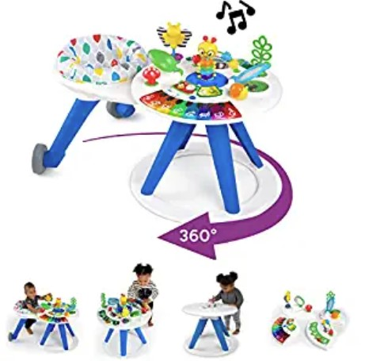

This activity station provides a safe and stimulating environment for your baby to explore and play, which can help to improve their physical and cognitive development. The 4-in-1 design allows for multiple modes of play, including a sit-and-play, walk-around, activity table, and removable take-along toy. 

### [**Flip Fish Soft Baby Toy**](https://www.amazon.com/Melissa-Doug-Developmental-Squeaker-Shatterproof/dp/B00MYWGTGQ/ref=sr_1_17_sspa?keywords=toys+for+7+month+old&qid=1683974408&sr=8-17-spons&psc=1&spLa=ZW5jcnlwdGVkUXVhbGlmaWVyPUFZSUNEUDNWNzM4WFcmZW5jcnlwdGVkSWQ9QTA2NDM1NzgzTVZUS0YxMTI4WTkwJmVuY3J5cHRlZEFkSWQ9QTA5Mzg2ODQzWlZSVTlOS05USEgmd2lkZ2V0TmFtZT1zcF9tdGYmYWN0aW9uPWNsaWNrUmVkaXJlY3QmZG9Ob3RMb2dDbGljaz10cnVl)

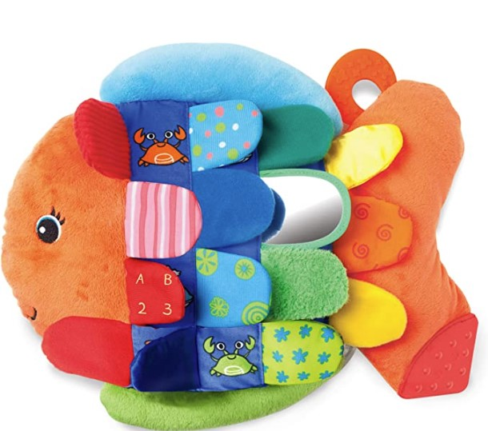

The Melissa & Doug Rainbow Stacker Classic Toy is a great tool to help children develop a sense of color and improve their cognition. This classic toy features brightly colored and graduated wooden rings that can be stacked in any order, providing a fun and challenging activity for children. 

### [**Pop-Up Toys for Babies**](https://www.amazon.com/Battat-Pop-Up-Effect-Learning-Babies/dp/B01N25KELS/ref=sr_1_21?keywords=toys+for+7+month+old&qid=1683974408&sr=8-21)

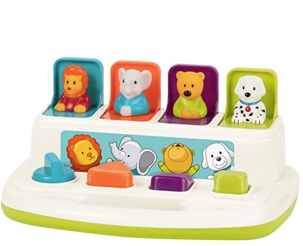

This toy is an interactive and educational toy designed to entertain and stimulate babies aged 7 months and older. This toy features 4 colorful animals – a bear, a puppy, a cat, and a bird – that pop up and down as the child presses and releases the corresponding buttons.

The toy offers various child development benefits, including hand-eye coordination, fine motor skills, and cause-and-effect learning. By pressing the buttons and seeing the animals pop up, the child can understand the cause-and-effect relationship and develop their problem-solving abilities.

### [**My Very Own Tool Set for Kids**](https://www.amazon.com/Learning-Resources-Sprouts-Motor-Pretend/dp/B006RQ8UNA/ref=sr_1_27_sspa?keywords=toys+for+7+month+old&qid=1683974408&sr=8-27-spons&psc=1&spLa=ZW5jcnlwdGVkUXVhbGlmaWVyPUFZSUNEUDNWNzM4WFcmZW5jcnlwdGVkSWQ9QTA2NDM1NzgzTVZUS0YxMTI4WTkwJmVuY3J5cHRlZEFkSWQ9QTAxNDMwNjY1VkxQUFVUUzMwVDEmd2lkZ2V0TmFtZT1zcF9tdGYmYWN0aW9uPWNsaWNrUmVkaXJlY3QmZG9Ob3RMb2dDbGljaz10cnVl) 

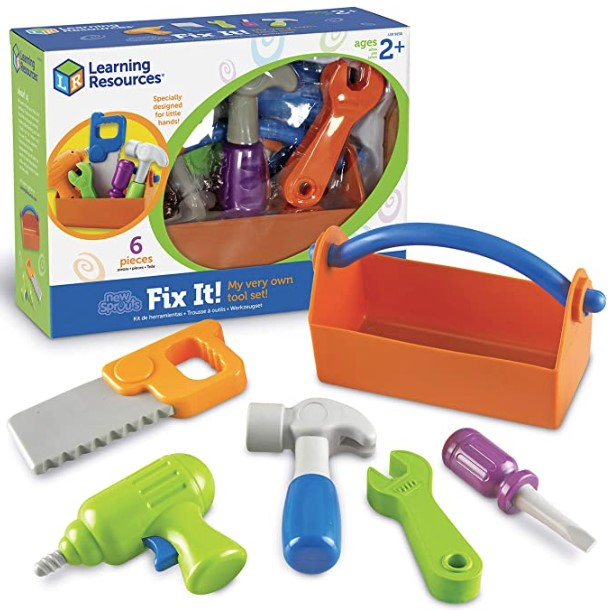

The Learning Resources New Sprouts Grow It! set is an excellent choice for parents who want to encourage their 7-month-old baby’s imagination. This set includes a range of garden-themed toys, including a watering can, a shovel, a rake, and a pot. These toys are made from high-quality, safe materials, making them durable and perfect for little hands. 

## FAQ 7 Months Old Activities and Things to Know 

### **Should my 7-month-old be crawling?**

No one-size-fits-all statement exists to this question, as every kid develops at their own pace. However, it is typical for babies to start crawling between 6 and 10 months old. Some babies may skip crawling altogether and go straight to walking, while others may crawl for a longer period of time. You need to remember that every baby is different and will develop skills at their own pace. If you have any worries about your baby’s development, it’s always best to speak with your pediatrician.

### **Is it OK for 7 month old to play alone?**

It’s generally OK for a 7-month-old to play alone for short periods of time, as long as they are in a safe environment and supervised. However, it’s important for parents to interact and play with their babies regularly, as this helps with their development and strengthens the bond between parent and child. It’s also important to note that babies thrive on human interaction and attention, so it’s recommended to limit the time they spend playing alone.

### **Why does my 7-month-old get bored so easily?**

It is not uncommon for babies at 7 months of age to get bored easily because they are rapidly developing their cognitive and motor skills, which means they need more stimulation to keep them engaged. They may also have short attention spans and be easily distracted by their environment, which can contribute to their boredom. As a parent, it’s important to provide a variety of age-appropriate toys and activities for your baby, as well as plenty of social interaction and physical movement, to help keep them entertained and engaged.

_**See More:**_

- Fun and Stimulating [Activities for an 8-Month-Old](https://avada.io/loveable/blog/activities-for-8-month-old/)

- Creative and Engaging [9-Month-Old Activities](https://avada.io/loveable/blog/9-month-old-activities-ideas/)

## Bottom Line 

In conclusion, engaging in playful and educational activities with your 7-month-old can provide fun and bonding time and aid in their physical, cognitive, and emotional development. By incorporating some of these 13 activity ideas, you can encourage your baby to explore, learn, and grow in a stimulating and enjoyable way.

- [16 Best 7-Month-Old Activities That Will Help Them Develop](https://avada.io/loveable/blog/7-months-old-activities/#wp-block-heading-2-4)
    - [1\. Start Exploring Outside World](https://avada.io/loveable/blog/7-months-old-activities/#wp-block-heading-3-5) 
    - [2\. Show Them the Family Picture](https://avada.io/loveable/blog/7-months-old-activities/#wp-block-heading-3-9) 
    - [3\. Have fun With Beach Ball.](https://avada.io/loveable/blog/7-months-old-activities/#wp-block-heading-3-13) 
    - [4\. Let Them Try New Food](https://avada.io/loveable/blog/7-months-old-activities/#wp-block-heading-3-15)
    - [5\. Play With Block](https://avada.io/loveable/blog/7-months-old-activities/#wp-block-heading-3-19) 
    - [6\. Hand Puppets](https://avada.io/loveable/blog/7-months-old-activities/#wp-block-heading-3-22)
    - [7\. Clapping Together](https://avada.io/loveable/blog/7-months-old-activities/#wp-block-heading-3-25) 
    - [8\. Do Some Gym](https://avada.io/loveable/blog/7-months-old-activities/#wp-block-heading-3-27) 
    - [9\. Peek-a-boo](https://avada.io/loveable/blog/7-months-old-activities/#wp-block-heading-3-31)
    - [10\. Rhyme Time](https://avada.io/loveable/blog/7-months-old-activities/#wp-block-heading-3-33)
    - [11\. Shadow Play](https://avada.io/loveable/blog/7-months-old-activities/#wp-block-heading-3-35)
    - [12\. Noisy Container](https://avada.io/loveable/blog/7-months-old-activities/#wp-block-heading-3-38)
    - [13\. Tactile play through textures](https://avada.io/loveable/blog/7-months-old-activities/#wp-block-heading-3-41)
    - [14\. Hidden Object](https://avada.io/loveable/blog/7-months-old-activities/#wp-block-heading-3-43) 
    - [15\. Read Picture Book](https://avada.io/loveable/blog/7-months-old-activities/#wp-block-heading-3-47)
    - [16\. Water Fun Time](https://avada.io/loveable/blog/7-months-old-activities/#wp-block-heading-3-50)
- [7 Best Educational Items for 7-month-old to Give Them Comprehensive Development](https://avada.io/loveable/blog/7-months-old-activities/#wp-block-heading-2-53)
    - [Turn and Learn Driver For Toddler](https://avada.io/loveable/blog/7-months-old-activities/#wp-block-heading-3-55)
    - [Wiggle and Crawl Ball](https://avada.io/loveable/blog/7-months-old-activities/#wp-block-heading-3-59)
    - [Kids Pull-Back Vehicle Set](https://avada.io/loveable/blog/7-months-old-activities/#wp-block-heading-3-63)
    - [Discovery Activity Center and Table For 7 Month Old](https://avada.io/loveable/blog/7-months-old-activities/#wp-block-heading-3-67) 
    - [Flip Fish Soft Baby Toy](https://avada.io/loveable/blog/7-months-old-activities/#wp-block-heading-3-70)
    - [Pop-Up Toys for Babies](https://avada.io/loveable/blog/7-months-old-activities/#wp-block-heading-3-73)
    - [My Very Own Tool Set for Kids](https://avada.io/loveable/blog/7-months-old-activities/#wp-block-heading-3-77) 
- [FAQ 7 Months Old Activities and Things to Know](https://avada.io/loveable/blog/7-months-old-activities/#wp-block-heading-2-80) 
    - [Should my 7-month-old be crawling?](https://avada.io/loveable/blog/7-months-old-activities/#wp-block-heading-3-81)
    - [Is it OK for 7 month old to play alone?](https://avada.io/loveable/blog/7-months-old-activities/#wp-block-heading-3-83)
    - [Why does my 7-month-old get bored so easily?](https://avada.io/loveable/blog/7-months-old-activities/#wp-block-heading-3-85)
- [Bottom Line](https://avada.io/loveable/blog/7-months-old-activities/#wp-block-heading-2-90) 

### [Benjamin Collins](https://avada.io/loveable/author/benjamin/)

I'm Benjamin Collins, a gift ideas creator at Loveable. We specialize in unique and personalized gifts for any occasion. With my honed skills, I recommend gifts tailored to the recipient's personality and interests, whether it's Halloween, Christmas, or any other celebration.

- [Twitter](https://twitter.com/intent/tweet)
- [Facebook](https://www.facebook.com/sharer/sharer.php)
- [instagram](https://avada.io/loveable/blog/7-months-old-activities/)
- [pinterest](https://www.pinterest.com/loveablellc/)

## Related Posts

[

### 79 Heartfelt Missing Mom Quotes for Expressing Love and Longing

](https://avada.io/loveable/blog/missing-mom-quotes/)

[

### Parenting with Depression: Strategies for Coping, Seeking Help, and Building Resilience

](https://avada.io/loveable/blog/parenting-with-depression/)

[

### 100 Empowering Single Mom Quotes: Inspirational Words for Strong Mothers

](https://avada.io/loveable/blog/single-mom-quotes/)

[

### 99+ Heartfelt Quotes And Wishes: Happy Anniversary to Mom and Dad!

](https://avada.io/loveable/blog/quotes-happy-anniversary-mom-dad/)

[

### 5 Ways to Foster a Positive Parent-Teacher Relationship

](https://avada.io/loveable/blog/parent-teacher-relationship/)
