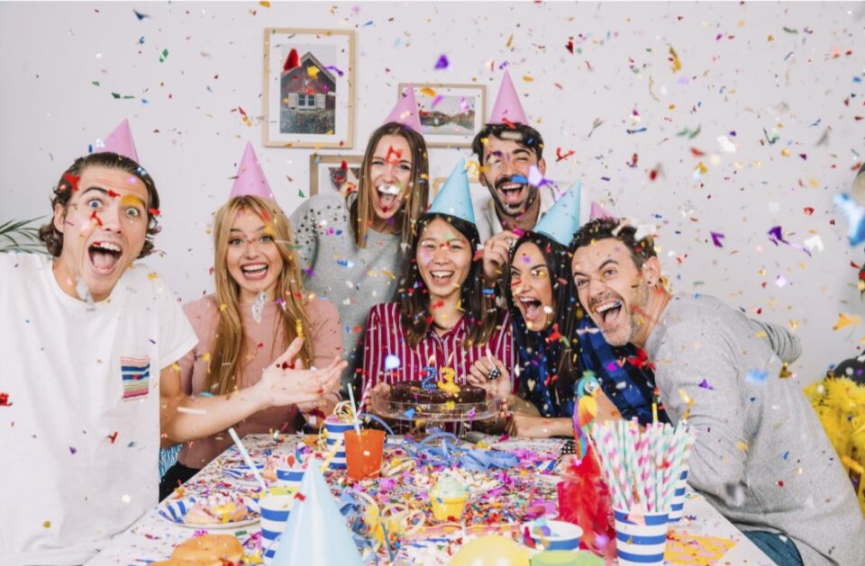
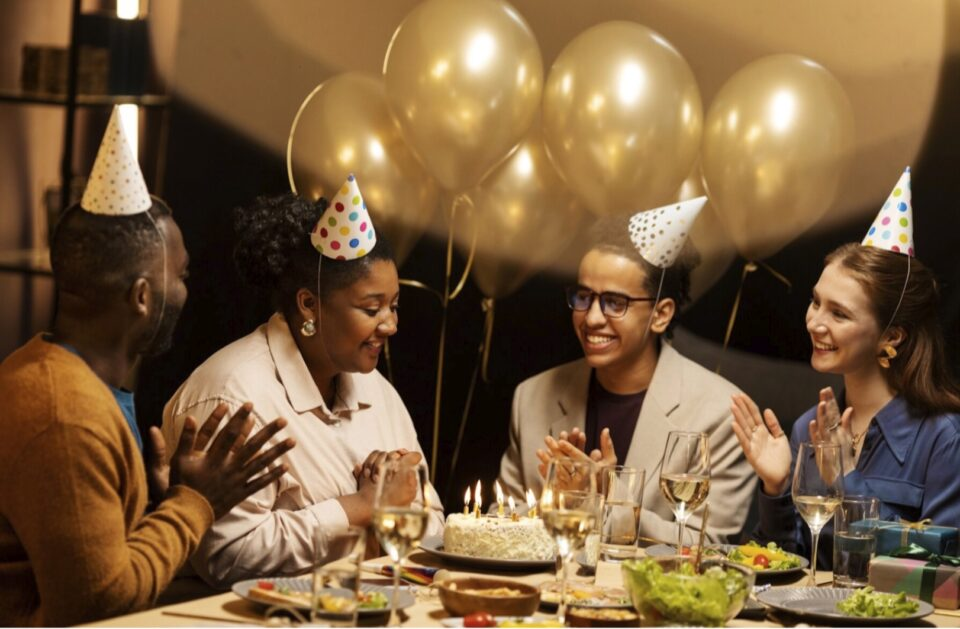

This article has been written and researched by our expert Loveable through a precise methodology. [Learn more about our methodology](https://avada.io/loveable/our-methodological.html)

[Loveable](https://avada.io/loveable/) > [Blog](https://avada.io/loveable/blog/) > [Family](https://avada.io/loveable/family/)

# 166 Hilarious Birthday Jokes To Brust Anyone Into Laughter

Written by [Rose Bryne](https://avada.io/loveable/author/rose/) Last Updated on September 19, 2023

- [150+ Funny Birthday Jokes To Brust Anyone Into Laughter](https://avada.io/loveable/blog/birthday-jokes/#wp-block-heading-2-2)
- [Bottom Line](https://avada.io/loveable/blog/birthday-jokes/#wp-block-heading-2-179)

Birthdays are the perfect time to share a good laugh, and this compilation is here to make sure that everyone’s celebration is filled with endless giggles and guffaws. From clever one-liners to playful puns, these jokes are carefully curated to tickle the funny bone and spread joy to birthday revelers of all ages. Whether you’re looking to add a touch of amusement to a birthday card or toast, or simply want to keep the laughter rolling at the party, these **birthday jokes** are your ultimate go-to. Get ready to create unforgettable memories filled with [smiles and laughte](https://avada.io/loveable/blog/hilariously-funny-jokes/)r as you explore this delightful collection.

## **150+ Funny Birthday Jokes To Brust Anyone Into Laughter**

This is a treasure trove of lighthearted humor designed to add an extra dose of joy to birthday celebrations. Packed with witty and [amusing jokes](https://avada.io/loveable/blog/humorous-valentines-day-jokes/), this compilation promises to bring smiles and laughter to people of all ages.

1\. What’s the best way to remember your wife’s birthday? Forget it once.

2\. Why does the mushroom always get invited to birthday parties? He’s a fun guy.

3\. What birthday present will make anyone’s face light up? A light bulb.

4\. Why did people take off their coats at the birthday party? Because everyone kept toasting.

5\. What kind of cake do you eat on your birthday on Halloween? I scream cake.

6\. Why were there balloons in the bathroom? For the birthday potty.

7\. Why do kids always forget their past birthday parties? Because they’re so focused on the present.

8\. Did you hear about the sale of birthday candles? It’s a blowout.

9\. How was the birthday party for the fish? It went swimmingly.

10\. What did the ocean say on its birthday? Nothing — it just waved.

11\. Did you hear about the risk behind birthdays? Yeah, too many can kill you.

12\. Why did the birthday girl hit her cake with a hammer? Because it was pound cake.

13\. Why did the student eat his homework on his birthday? Because the teacher said it was a piece of cake.

14\. What song do you sing at a snowman’s birthday party? Freeze a jolly good fellow.

15\. What did the cake say to the ice cream? “I think you’re cool.”

16\. What did one lion say to the other on its birthday? “It’s roar birthday, let’s party!”

17\. How do you know if a donut is bored at a birthday party? It looks glazed over.

18\. What did the birthday card say to the stamp on its envelope? Stick with me — we’re going places.

19\. Did Moby Dick enjoy his birthday? Oh yes — he had a whale of a time.

20\. What did one candle say to the other? “Birthdays just burn me up.”

21\. Why don’t kangaroos don’t like birthdays? They only get to celebrate them in leap years.

22\. What does every birthday end with? The letter Y.

23\. Why did the bakery get robbed? Robbers heard the cakes were rich.

24\. What do they call you when you attend a ghost birthday? The life of the party.

25\. Two birthday cupcakes were sitting in an oven. One turned to the other and said, “Hey, it’s hot in here.”

26\. How moving was the message in the birthday card? Even the cake was in tiers.

27\. Why did the pickle have so much fun at the birthday party? It relished every minute.

28\. What did one cheese say to the other on its birthday? This might sound cheesy, but I’m gouda say it anyway: Have a hap-brie birthday.

29\. What did the buffalo say when his son left the birthday party? Bison.

30\. Why do golfers take an extra pair of socks on their birthday? In case they get a hole in one!

31\. What did one candle say to the other after the raging birthday party? “I’m feeling rather burned out.”

32\. What did the mommy rose say to the baby rose on his birthday? “Happy birthday, bud!”

33\. What do you call a noodle pretending it’s his birthday? An impasta.

34\. I dread my birthday, but my friends tell me to cheer up because it’s better than falling into a hole filled with water. I know they mean well.

35\. What did one corn cob say to the other on its birthday? I’m ear to party with you!

36\. Why do leprechauns prefer cash to presents on their birthday? Because money is green.

37\. Why did the baker laugh in the bakery? Because the eggs kept cracking jokes.

38\. What did the kid tell a classmate who lied about his birthday being in the summertime? Julyed.

39\. Why didn’t the pony sing Happy Birthday? It was a little hoarse.

40\. What kind of jewelry did the rabbit wear for its birthday party? 1carrot gold.

41\. How did a duck buy birthday presents? He put them on his bill.

42\. Why couldn’t I have my birthday party at the library? It was already booked up.

43\. What did the lawyer drink on her birthday? Subpoena colada.

44\. When do you put a birthday cake in the freezer? When you’re ready to ice it.

45\. Why don’t I want to celebrate my birthday party on the moon? That place has no atmosphere.

46\. What kind of cake do you eat when it’s your birthday but you’re tired? Coffee cake.

47\. How do you organize a birthday party in space? You planet carefully.

48\. I bought you a loaf of bread for your birthday toast. 

49\. Why did the girl bring a suitcase to the party? She wanted to pack in all the fun!

50\. What do you call a cat on its name day? A meow-velous celebration! 

51\. Why couldn’t the bicycle stand up by itself? It was two-tired from all the festivities!

52\. How do bees celebrate a special day? With a beehive of activity! 

53\. Statistics show that those who have the most birthdays live the longest. Your b-day reminds me of the Chinese scholar Yung No Mo. 

54\. What is it that kangaroos don’t like about birthdays? They only get to celebrate them in leap years. 

55\. Why was the cake sad? It was in tiers. 

56\. Why was the cake hard as a rock? It was a marble cake.

57\. What’s a monkey’s favorite type of cake? Banana split cake! They say age is just a number, but it’s a huge number in your case! 

58\. What do you give a 3100 lb rhino for his special day? I don’t know, but you better hope he likes it. 

59\. What did the ice cream say to the candle? “You’re melting me with your hotness!”

60\. What’s a bee’s favorite day of the year? Its bee-day.

61.  What’s a cow’s favorite party game? Moo-sical chairs! 

62\. What kind of candle burns longer than others? None, silly — they all burn shorter.

63\. What did the pirate say on his 80th name day? “Aye, matey.” Another trip around the sun? You’re really racking up those frequent flyer miles! 

64\. Why did the little girl hit her cake with a hammer? It was a pound cake. 

65\. What’s a ghost’s favorite cake? I-scream cake. 

66\. Why did the boy put his cake in the oven? He wanted it to be a hot topic! 

67\. What did the balloon say to the cake? Don’t pop my bubble! 

68\. Why did the girl put her cake on a bicycle? She wanted to have a sweet ride!

69\. What can you do if you get heartburn from a cake? Take off the candles before you eat it next time. 

70\. How do bees celebrate their special day? With a beehive of activity! 

71\. What do you get when you cross a cat and a cake? A meow-velous celebration!

72\. What do you call a party for a bee? A buzz-tastic celebration! 

73\. Here’s to a year filled with more laughter, less hair, and even more embarrassing memories to cherish. 

74\. What do cakes and baseball teams have in common? They both need a good batter. 

75\. Why did the cupcake go to the doctor’s office? It was feeling crumby. 

76\. Do you know what cakes and dressing for winter have in common? Either way, it’s better with lots of layers! 

77\. Boy: Mom, why did you get me a bottle of bathroom cleaner as a present? Mom: I thought you wanted a “supplies” party! 

78\. Why do candles love parties? They like to get lit. 

79\. Why did the computer go to the party? Because it wanted to “byte” into some cake! 

80\. What will you do if no one comes to your party? You’ll have your cake and eat it, too. 

81\. Why did the chicken get a special invitation to the party? It was the egg-stra special guest! 

82\. What kind of music is scary for birthday balloons? Pop music.

83\. Why do some people get heartburn every time they eat birthday cake? They always forget to take off the candles.

84\. What does it mean if no one shows up to your birthday party? You can have your cake and eat it, too

85\. What do monsters serve at their birthday parties? I scream cake.

86\. Why are birthdays good for your health? Studies have shown that people who have more birthdays actually live longer.

87\. What’s something you get for your birthday every year, aside from cake and presents? Another year older.

88\. Did you hear about the birthday candle sale? It was a big blowout!

89\. Why did the birthday girl feel so warm at her birthday party? People kept toasting her!

90\. Why did the boy soap as a birthday present? Because it was a soaprize party!

91\. Why is it a good idea to become friends with babies? It means you’ll get free cake once a year on their birthday for the rest of your life.

92\. How come you didn’t get me a birthday present? You did say I should surprise you, right?

93\. What was the elephant’s birthday wish? A trunk full of gifts.

94\. What kind of birthday cake do ghosts like? I scream cake.

95\. What do you call a rabbit’s party? A hare-raising event! 

96\. What did the cake say to the fork? Do you want a piece of me? 

97\. What did one candle say to the other at the end of the party? I’m feeling a little burned out after that party!

98\. Did you hear about the tree’s birthday party? Things got pretty sappy!

99\. What does a clam do on his birthday? It shellebrates!

100\. What’s the fanciest kind of birthday party you can throw for a dog? A ball.

101\. What do you get a hunter as a birthday present? A birthday pheasant.

102\. Why was the birthday cake hard as a rock? It was a marble cake.

103\. Why did the woman celebrate her birthday for only 30 seconds? It was her 32nd birthday.

104\. What should you give a dragon for its birthday? I’m not sure, but you’d better hope he’ll like it!

105\. Why do all of my relatives keep reminding me how old I am on my birthday? Because age is a relative thing.

106\. Why couldn’t the pony sing Happy Birthday? She was feeling a little hoarse.

107\. What do George Washington, Abraham Lincoln, and Christopher Columbus have in common? They were all born on holidays.

108\. What do you say to a kangaroo on its birthday? Hoppy Birthday!

109\. What’s the best way to remember your wife’s birthday? Forget it once.

110\. What should you say to a fish on its birthday? Hope you have a fin-tastic birthday!

111\. Why is a birthday cake like playing baseball? They both need batters.

112\. How can you tell if a birthday cake is sad? If it’s in tiers.

113\. What did the cake say to the birthday girl?

114\. Why didn’t anyone say Happy Birthday to the owl? Because it didn’t give a hoot.

115\. Did you know that birthdays are good for your health? It’s a scientific fact: People who have more birthdays live longer.

116\. Where do you buy a birthday present for a cat? From a cat-alogue.

117\. What did the birthday balloon say to the safety pin? “Hey, Buster.”

118\. Why couldn’t the knot go to the birthday party? It was all tied up.

119\. What kind of birthday cake is hard as a rock? Marble cake.

120\. What kind of candle burns longer than others? None, silly — they all burn shorter.

121\. What goes up but never comes down? Your age.

122\. What famous people were born on your birthday? None — they were all just babies!

123\. What will you do if no one comes to your birthday party? You’ll have your cake and eat it, too.

124\. Did you hear what happened at the tree’s birthday party? Everyone got totally sappy.

125\. What does an oyster do on its birthday? Shellebrate.

126\. What happens when thieves crash a birthday party? They take the cake.

127\. What kind of music do balloons fear? Pop tunes.

128\. What can you do if you get heartburn from birthday cake? Take off the candles before you eat it next time.

129\. What do you sing to a cow on its birthday? Happy birthday to Moo!

130\. Why do candles love birthdays? They like to get lit.

131\. What’s a bee’s favorite day of the year? Its bee-day.

132\. Where can you go to study birthday treats? Sundae school.

133\. What do you call a birthday bash you throw for a dog? A ball.

134\. What do you say to a bunny on its birthday? Hoppy birthday to you.

135\. How do you know if a birthday cake is sad? Look for the tiers.

136\. How is a birthday cake like baseball? Both need batters.

137\. Why do we put candles on top of birthday cakes? Because it doesn’t work to put them on the bottom.

138\. What did the elephant want for his birthday? A trunk full of presents.

139\. Why did the birthday cake go to the doctor? Because it was feeling crumby.

140\. What did the bald man say when he got a comb for a birthday present? “Thanks — I’ll never part with it.”

141\. When is a birthday cake like a golf ball? When you slice it.

142\. What did the teddy bear say when asked if it wanted a second piece of birthday cake? “No thank you, I’m stuffed.”

143\. What does a witch do on her birthday? Spellebrate.

144\. How does a train celebrate a special day? It has a “choo-choo” party! 

145\. What’s a bear’s favorite party game? Pin the honey on the hive! 

146\. You’re aging like a pro! Keep it up, and you’ll be a legend in the retirement home. 

147\. You’re older; you’re wiser; you’re sophisticated. Far too sophisticated to be concerned with material things like presents. 

148\. I wanted to send you something beautiful, but the postman told me to get out of the box. 

149\. Why did the balloon go to the party alone? Because it wanted to “blow” everyone away! 

150\. Knock, knock. Who’s there? Ivan. Ivan who? Ivan a piece of your cake! 

151\. If you lick the frosting off a cake, it becomes a muffin, and muffins are healthy.

152\. What did the cake say to the candles? “You light up my life!” 

153\. What one thing are you guaranteed to get every year on your birthdate? A year older. 

154\. I know this is corny, but you’re a-maize-ing. 

155\. What do you call a dinosaur’s party? A prehistoric celebration! 

156\. You know you’re growing old when the candles cost more than the cake. 

157\. I eat cake because it’s somebody’s birthday somewhere. 

158\. What does a house wear to its birthday party? Address.

159\. Why does a joke become a dad joke on its 18th birthday? Because that’s when it’s fully groan.

160\. On my 18th birthday, my grandmother shared some wisdom: “Remember these two words that will open a lot of doors throughout your life: Push and pull.”

161\. What’s one thing you’re guaranteed to get on your birthday? A year older.

162\. What did the frog drink to wash down his birthday cake? Diet croak.

163\. Why did the math book have such a great birthday? It took the day off from thinking about all its problems.

164\. What did one plate say to the other on its birthday? “Dinner’s on me!”

165\. What game do rabbits play at their birthday parties? Musical hares.

166\. Why did the kid get soap for his birthday? Because it was a soap-rise party.

_**See More:**_

- Hilarious [Mom Jokes](https://avada.io/loveable/blog/hilarious-mom-jokes/)

- [Christmas Knock Knock Jokes](https://avada.io/loveable/blog/christmas-knock-knock-jokes/)

## **Bottom Line**

As you celebrate another year of life, remember that laughter is the best gift you can give yourself or someone else. These **birthday jokes** are a delightful addition to any birthday gathering, spreading joy and happiness to everyone present. So, go ahead and share a laugh, because nothing adds more warmth and cheer to a birthday celebration than the sound of genuine laughter.

- [150+ Funny Birthday Jokes To Brust Anyone Into Laughter](https://avada.io/loveable/blog/birthday-jokes/#wp-block-heading-2-2)
- [Bottom Line](https://avada.io/loveable/blog/birthday-jokes/#wp-block-heading-2-179)

### [Rose Bryne](https://avada.io/loveable/author/rose/)

Hi, I'm Rose! I love animals and spending time with kids. At Loveable, I help people find unique gifts for special occasions like Valentine's Day, housewarmings, and graduations. I enjoy finding gifts for kids, teens, and animal lovers that match their interests and personalities. Making gift-giving a pleasant experience is my priority. Let me assist you in finding the perfect gift!

- [Twitter](https://twitter.com/intent/tweet)
- [Facebook](https://www.facebook.com/sharer/sharer.php)
- [instagram](https://avada.io/loveable/blog/birthday-jokes/)
- [pinterest](https://www.pinterest.com/loveablellc/)

## Related Posts

[### 30 Best 4 Year Old Birthday Party Ideas For A Memorable Celebration](https://avada.io/loveable/blog/4-year-old-birthday-party-ideas/) 

[

### 16th Birthday Party Ideas to Make an Unforgettable Day

](https://avada.io/loveable/blog/16th-birthday-party-ideas/)

[

### 150+ Inspirational Birthday Quotes to Spread Joy on Special Day

](https://avada.io/loveable/blog/inspirational-birthday-quotes/)

[

### 160+ Birthday Wishes for Wife to Express Eternal Love

](https://avada.io/loveable/blog/birthday-wishes-for-wife/)

[### 90+ Heart Touching Birthday Wishes for Niece to Make Her Day Extra Special](https://avada.io/loveable/blog/birthday-wishes-for-niece/)
