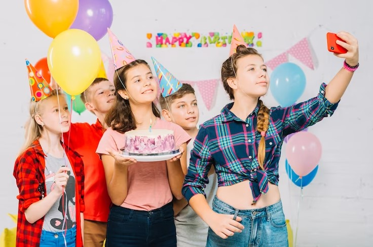

This article has been written and researched by our expert Loveable through a precise methodology. [Learn more about our methodology](https://avada.io/loveable/our-methodological.html)

[Loveable](https://avada.io/loveable/) > [Blog](https://avada.io/loveable/blog/) > [Family](https://avada.io/loveable/family/)

# 16th Birthday Party Ideas to Make an Unforgettable Day

Written by [Rose Bryne](https://avada.io/loveable/author/rose/) Last Updated on October 02, 2023

- [10 Special 16th Birthday Party Theme Ideas](https://avada.io/loveable/blog/16th-birthday-party-ideas/#wp-block-heading-2-3)
    - [1\. Vintage Arcade](https://avada.io/loveable/blog/16th-birthday-party-ideas/#wp-block-heading-3-5)
    - [2\. Hollywood Red Carpet](https://avada.io/loveable/blog/16th-birthday-party-ideas/#wp-block-heading-3-8)
    - [3\. Around the World](https://avada.io/loveable/blog/16th-birthday-party-ideas/#wp-block-heading-3-11)
    - [4\. Superhero Soiree](https://avada.io/loveable/blog/16th-birthday-party-ideas/#wp-block-heading-3-14)
    - [5\. Wild West Western](https://avada.io/loveable/blog/16th-birthday-party-ideas/#wp-block-heading-3-16)
    - [6\. Music Festival](https://avada.io/loveable/blog/16th-birthday-party-ideas/#wp-block-heading-3-19)
    - [7\. Gaming Paradise](https://avada.io/loveable/blog/16th-birthday-party-ideas/#wp-block-heading-3-22)
    - [8\. Great Gatsby/Roaring Twenties](https://avada.io/loveable/blog/16th-birthday-party-ideas/#wp-block-heading-3-25)
    - [9\. Neon Glow Costume](https://avada.io/loveable/blog/16th-birthday-party-ideas/#wp-block-heading-3-28)
    - [10\. Mystery Masquerade](https://avada.io/loveable/blog/16th-birthday-party-ideas/#wp-block-heading-3-31)
- [10 Best 16th Birthday Party Decoration Ideas](https://avada.io/loveable/blog/16th-birthday-party-ideas/#wp-block-heading-2-34)
    - [1\. Balloons](https://avada.io/loveable/blog/16th-birthday-party-ideas/#wp-block-heading-3-36)
    - [2\. Banners](https://avada.io/loveable/blog/16th-birthday-party-ideas/#wp-block-heading-3-39)
    - [3\. Photo Wall](https://avada.io/loveable/blog/16th-birthday-party-ideas/#wp-block-heading-3-42)
    - [4\. String Lights](https://avada.io/loveable/blog/16th-birthday-party-ideas/#wp-block-heading-3-45)
    - [5\. Table Centerpieces](https://avada.io/loveable/blog/16th-birthday-party-ideas/#wp-block-heading-3-48)
    - [6\. Backdrop](https://avada.io/loveable/blog/16th-birthday-party-ideas/#wp-block-heading-3-51)
    - [7\. DIY Crafts](https://avada.io/loveable/blog/16th-birthday-party-ideas/#wp-block-heading-3-54)
    - [8\. Glowing Letters](https://avada.io/loveable/blog/16th-birthday-party-ideas/#wp-block-heading-3-57)
    - [9\. Photo Booth](https://avada.io/loveable/blog/16th-birthday-party-ideas/#wp-block-heading-3-60)
    - [10\. Chalkboard Art](https://avada.io/loveable/blog/16th-birthday-party-ideas/#wp-block-heading-3-63)
- [Enhance the16th Birthday Party with Simple Food Menu Ideas](https://avada.io/loveable/blog/16th-birthday-party-ideas/#wp-block-heading-2-68)
    - [Appetizers](https://avada.io/loveable/blog/16th-birthday-party-ideas/#wp-block-heading-3-70)
        - [Mini Sliders](https://avada.io/loveable/blog/16th-birthday-party-ideas/#wp-block-heading-4-71)
        - [Stuffed Mushrooms](https://avada.io/loveable/blog/16th-birthday-party-ideas/#wp-block-heading-4-74)
        - [Caprese Skewers](https://avada.io/loveable/blog/16th-birthday-party-ideas/#wp-block-heading-4-77)
        - [Chicken Wings](https://avada.io/loveable/blog/16th-birthday-party-ideas/#wp-block-heading-4-80)
        - [Vegetable Spring Rolls](https://avada.io/loveable/blog/16th-birthday-party-ideas/#wp-block-heading-4-83)
        - [Mini Quiches](https://avada.io/loveable/blog/16th-birthday-party-ideas/#wp-block-heading-4-86)
    - [Main Courses](https://avada.io/loveable/blog/16th-birthday-party-ideas/#wp-block-heading-3-89)
        - [Taco Bar](https://avada.io/loveable/blog/16th-birthday-party-ideas/#wp-block-heading-4-90)
        - [Pizza Party](https://avada.io/loveable/blog/16th-birthday-party-ideas/#wp-block-heading-4-93)
        - [Pasta Bar](https://avada.io/loveable/blog/16th-birthday-party-ideas/#wp-block-heading-4-96)
        - [Slider Buffet](https://avada.io/loveable/blog/16th-birthday-party-ideas/#wp-block-heading-4-99)
        - [BBQ Ribs](https://avada.io/loveable/blog/16th-birthday-party-ideas/#wp-block-heading-4-102)
    - [Desserts](https://avada.io/loveable/blog/16th-birthday-party-ideas/#wp-block-heading-3-105)
        - [Cupcake Tower](https://avada.io/loveable/blog/16th-birthday-party-ideas/#wp-block-heading-4-106)
        - [Ice Cream Sundae Bar](https://avada.io/loveable/blog/16th-birthday-party-ideas/#wp-block-heading-4-109)
        - [Chocolate Fondue](https://avada.io/loveable/blog/16th-birthday-party-ideas/#wp-block-heading-4-112)
        - [Mini Cheesecakes](https://avada.io/loveable/blog/16th-birthday-party-ideas/#wp-block-heading-4-115)
        - [Fruit Skewers](https://avada.io/loveable/blog/16th-birthday-party-ideas/#wp-block-heading-4-118)
- [5 16th Birthday Party Activity Ideas](https://avada.io/loveable/blog/16th-birthday-party-ideas/#wp-block-heading-2-121)
    - [1\. Karaoke Night](https://avada.io/loveable/blog/16th-birthday-party-ideas/#wp-block-heading-3-123)
    - [2\. Outdoor Movie Screening](https://avada.io/loveable/blog/16th-birthday-party-ideas/#wp-block-heading-3-126)
    - [3\. Escape Room Adventure](https://avada.io/loveable/blog/16th-birthday-party-ideas/#wp-block-heading-3-129)
    - [4\. DIY Craft Station](https://avada.io/loveable/blog/16th-birthday-party-ideas/#wp-block-heading-3-132)
    - [5\. Game Tournament](https://avada.io/loveable/blog/16th-birthday-party-ideas/#wp-block-heading-3-135)
- [Bottom Line](https://avada.io/loveable/blog/16th-birthday-party-ideas/#wp-block-heading-2-138)

At 16, you’re at an age of discovery and dreams. It’s a time when your child begins to solidify their sense of personal identity and explore the world around them. So, we are here to offer you some **16th birthday party ideas** to make your child’s birthday more unforgettable. That will be filled with laughter, joy, and memories that’ll stick with them for their life. With these ideas for themed decorations to exciting activities, we’ve got a treasure trove of inspiration to support your child in having a playful and delightful day.  

So, are you gearing up to embrace the sweet sixteen milestone ideas in a way that truly resonates with your [teen’s unique style](https://avada.io/loveable/blog/birthday-party-ideas-for-teens/) and aspirations? Let’s come with us as we embark on a journey through imaginative concepts and thoughtful planning, all crafted to ensure that his/her 16th birthday marks a dazzling and cherished chapter in his/her life’s story!

## **10 Special 16th Birthday Party Theme Ideas**

Discover a world of appealing possibilities with our handpicked selection of 10 special 16th birthday party theme ideas, tailor-made for your child! Inspired by both traditional and modern ideas for the theme, these suggestions allow your creativity to flourish as you explore these unique concepts. Therefore, let’s scroll down to make your child’s 16th birthday a truly extraordinary event!

### **1\. Vintage Arcade**

Have you ever imagined the joy on your teen’s face with the Vintage Arcade theme for their 16th birthday? With a nostalgic touch, this theme promises a trip back in time, offering a fun and unique experience. Moreover, you can add classic arcade games and retro decorations to make the party more exciting. Now, if you are eager for a memorable day where you and your child can bond over old-school games, let’s choose this one!

### **2\. Hollywood Red Carpet**

You’re in for a glamorous treat with the Hollywood Red Carpet theme for your teen’s 16th birthday! Transform your home into a dazzling showbiz affair, where your child takes center stage. With this idea, you are ideal to capture picture-perfect moments as radiant as the stars themselves. It’s definitely an opportunity to make your child feel like the true VIP they are. 

### **3\. Around the World**

If you want to send a traveling package for your child when he/she is turning 16 but for a reason, you can’t make this plan. Don’t worry because you can do something more special than that with the 16th birthday party theme idea of Around the World. Your child can discover cultures, flavors, and fun from various corners of the world at the right home. When you do this theme, you will find it like a passport to have an unforgettable celebration. 

### **4\. Superhero Soiree**

You know you can unleash the superhero spirit at your teen’s 16th birthday, right at home not at a cinema. The Superhero Soiree theme is a dynamic way to celebrate their special day. With some cape and mask costumes combined with heroic decorations and thrilling games, you are enough to have limitless excitement on that day. Thus, don’t be afraid of thinking out of the box to create a unique birthday for your loved teen. 

### **5\. Wild West Western**

Saddle up for a rootin’ tootin’ good time with the “Wild West Western” theme for your teen’s 16th birthday! The excitement will spark when he/she watches their friends or maybe themself dress in delightful costumes such as cowboy hats or boots. This idea is very great, right? It will transport your home into the heart of the Old West to cherish your child, especially if you are a history story fan. 

### **6\. Music Festival**

The Music Festival theme is absolutely fantastic for your aspiring idol, your cherished daughter, or your beloved son. It’s a party you won’t want to miss to rock out him/her. With only some simple preparations like vibrant decor and musical instruments, you can turn your house into a musical wonderland. This party also encourages your child to chase dreams and make them come true. 

### **7\. Gaming Paradise**

The Gaming Paradise may be a considerable choice when selecting a theme idea for your upcoming 16-year-old. You can [decorate your house](https://avada.io/loveable/decorating-deals/) to be a gamer’s haven, complete with an array of exciting video games. This theme guarantees non-stop entertainment when your child competes with his friends and creates memories. 

### **8\. Great Gatsby/Roaring Twenties**

It’s a splendid opportunity to celebrate your child’s special day with a touch of vintage sophistication. It is nothing other than The Great Gatsby/Roaring Twenties theme for the 16th birthday party. By dressing in elegant attire, your loved child will live up to the glamour of the 1920s and bring joy on the special day.

### **9\. Neon Glow Costume**

Are you Looking for an exciting theme for your teen’s 16th birthday? Consider the Neon Glow Costume party!  With vibrant colors and a fun atmosphere, you can create a memorable celebration. You’ll see smiles all around as your child and their friends enjoy the luminous party together. So, get ready to light up the night and make this birthday a glowing success!

### **10\. Mystery Masquerade**

Try the Mystery Masquerade theme now! Via elegant masks and thrilling games, this theme creates a sense of wonder. You and your guests will have a blast solving mysteries in style. This 16th birthday party idea is perfect for a night of enchantment and surprises. Thus, don’t ignore this if you are desiring a unique [birthday for your loved daughter](https://avada.io/loveable/birthday-gifts-daughter/)/son.

## **10 Best 16th Birthday Party Decoration Ideas**

When planning your child’s 16th birthday, you want it to be truly special. That’s why we’re here to inspire you with creative decoration ideas. The ideal decor, like colorful balloon arrangements and personalized banners, may be the top priority to effortlessly transform your space. While easy DIY options are budget-friendly choices to reflect your teen’s personality. So, dive into our ideas below to spark your own birthday decor. 

### **1\. [Balloons](https://www.amazon.com/Balloon-Balloons-Birthday-Decorations-Anniversary/dp/B0C3HGR3PB/)**

Let’s Elevate your teen’s 16th birthday with a burst of joy using balloons! Your child definitely delights as they walk into a room adorned with a sea of vibrant balloons. You also make these balloons more special by featuring words like “Sweet 16” or their name. Also, you can choose colors that resonate with your personality or order shapes such as stars, hearts, and numbers to better decorate

### **2\. [Banners](https://www.amazon.com/All-About-Details-Birthday-Decoration/dp/B07GTRBGWK/)**

There are various styles and designs for banners available you can easily find one that captures your child’s personality. Furthermore, you can also personalize them by including your teen’s name or a special message. Then, you can hang them on walls, across tables, or as a backdrop for photos to elevate your celebration. 

### **3\. [Photo Wall](https://www.amazon.com/Iydamc-Valentines-Decorations-Photography-W-7627/dp/B0BCPZKLF4/)**

Craft cherished memories on your teen’s 16th birthday with a captivating photo wall! You can use strings and clips for a rustic look or opt for a sleek arrangement with adhesive photo frames. By Incorporating childhood photos, friend group shots, and recent adventures, you can celebrate his/her growth through this heartwarming idea. 

### **4\. [String Lights](https://www.amazon.com/imprsv-Marquee-Princess-Birthday-Decorations/dp/B0C8S9HHK7/)**

Quickly illuminate your teen’s 16th birthday with the magical glow of string lights! Whether indoors or outdoors, you can easily drape these twinkling lights to set the mood. You can hang them along walls, wrap them around furniture, or even string them across the ceiling. Therefore, it is amazing for you to turn your child’s day into a luminous wonderland with these captivating string light decoration ideas.

### [**5\. Table Centerpieces**](https://www.amazon.com/Big-Dot-Happiness-Sweet-Decorations/dp/B0B4PW13GS/)

Why not enhance the dining experience at your daughter/son’s 16th birthday party by adorning tables with creative decorations? You can choose elegant floral arrangements, thematic ornaments, or personalized items for this decor. Then You can coordinate colors and themes to match the overall decor, making every meal a special moment. 

### **6\. [Backdrop](https://www.amazon.com/Birthday-Backdrop-Champagne-Background-Backdrops/dp/B0BD51HZXF)**

A stunning backdrop may be an indispensable decoration for your beloved at her/his 16th birthday party, right? With endless possibilities, you can easily create a captivating focal point for photos and memories. These backdrops will set the stage as you place them behind the cake table or in a designated photo area. Plus, you can get a personalized backdrop to fit your theme party and level up your child’s experience. 

### [**7\. DIY Crafts**](https://www.amazon.com/Hand-Casting-Kit-Couples-Birthday/dp/B092RFHRVW/)

It would be regretful for you if you didn’t consider DIY crafts for your teen’s 16th birthday party. This idea is a heartfelt and emotional way to celebrate that time. Your child with friends crafts some adorable shapes together, such as flowers, animals, lanterns, or simple art. And then from that, it allows your child to create valuable memories and share interests with friends to foster their team spirit and friendships as well. 

### **8\. [Glowing Letters](https://www.amazon.com/Letters-Changing-Alphabet-Birthday-Christmas/dp/B0C96CBP2R/)**

You’ll be delighted with the Glowing Letters decoration for your child’s 16th birthday! These luminous decorations add a warm, celebratory glow that captures the joy of the day. By picturing their name in shimmering lights, you can create an enchanting atmosphere.

### **9\. [Photo Booth](https://www.amazon.com/Big-Dot-Happiness-Funny-Sweet/dp/B0BG91CFLK/)**

For your child’s 16th birthday, the Photo Booth idea is a hit! Imagine the smiles as your teen and their friends pose with fun props and backgrounds. You’ll cherish the hilarious snapshots for years to come. With endless creative possibilities, you can capture the joy of the celebration in unique ways. No matter what you design for this photo booth, it definitely will add an extra layer of excitement to the special day.

### **10\. [Chalkboard Art](https://www.amazon.com/Andaz-Press-Personalized-12x18-inch-Chalkboard/dp/B07JVGZRKJ/)**

Chalkboard Art to celebrate your child’s 16th birthday is a wonderful choice! The charming and personalized designs bring a nostalgic touch to the party atmosphere. Through their name and special messages beautifully scripted on chalkboards, he/she will feel love around them. Furthermore, you also can make chalkboard art personalized to resonate with your teen’s personality. With this decor idea, you’ll infuse the celebration with heartfelt creativity.

In favor of choosing the wonderful and greatest decorations for your loved child, we would like to list some tips and places for you to buy the best product for this important event. 

**Tips:** Match the theme to your teen’s interests, stick to a budget, and focus on important spots like the entrance and cake table. 

## **Enhance the16th Birthday Party with Simple Food Menu Ideas**

When it comes to your child’s 16th birthday party, the food menu is a central aspect that can make the celebration truly enjoyable. Crafting a delightful array of dishes doesn’t have to be complicated. Instead, you can opt for simple yet delicious food menu ideas that cater to various tastes with us right below. Our ideas would be useful for you to organize a perfect birthday. 

### **Appetizers**

#### [**Mini Sliders**](https://www.amazon.com/Knorr-Pasta-Sides-Alfredo-Side/dp/B00099XOQ4)

Let’s take into account Mini Sliders as appetizers for your loved one’s 16th birthday party. These tiny burgers pack a big flavor, delighting both teens and adults. Your guests can enjoy these handheld treats, customizable with various toppings, while your child can choose what they want to eat. This idea is obviously a convenient and appealing option for busy parents. 

#### [**Stuffed Mushrooms**](https://www.amazon.com/Willow-Stuffed-Mushroom-Cheeseball-Appetizer/dp/B008X8ORLY)

It would be mouth-watering when thinking of Stuffed Mushrooms, a delightful appetizer at your child’s 16th birthday party, right? Mushroom is filled with rich ingredients like cheese, herbs, and more to satisfy your guest’s bites. You’ll impress both teens and their friends with this sophisticated appetizer option.

#### [**Caprese Skewers**](https://www.etsy.com/listing/945148791/photo-appetizer-skewers-personalized)

Make your child’s 16th birthday memorable with Caprese Skewers as appetizers. These bite-sized wonders combine fresh mozzarella, juicy tomatoes, and fragrant basil, drizzled with balsamic glaze. Your teen and his/her best friends will adore the burst of flavors and the elegant presentation. So, let’s make an order now!

#### [**Chicken Wings**](https://www.etsy.com/listing/1539354089/fried-chicken-flyer-chicken-frie)

Chicken Wings are the everlasting popular appetizers to delight your child at their 16th birthday party. The joy as your child and your guests savor these flavorful bites would contribute to the success of your party. Besides, with the existence of Macdollar and KFC, you only take a second minute to make an order and treat your guest whenever you want. 

#### [**Vegetable Spring Rolls**](https://www.etsy.com/listing/1552751161/100pcs-overnight-shipping-filipino)

Originating from Asian culinary traditions, Vegetable Spring Rolls make a delightful addition to your child’s 16th birthday celebration. These appetizers showcase a blend of fresh vegetables and aromatic herbs wrapped in thin rice paper. It is a pleasure to add to your guests’ faces as they savor these crisp and flavorful bites.

#### [**Mini Quiches**](https://www.etsy.com/listing/839079123/cupcake-cone-box)

Mini Quiches are incredible appetizers for you to surprise your loved daughter/son who is into this dish. This food idea comes in various flavors. When your child and friends eat it they will have the buttery crusts and flavorful filling in their mouth. That’s why we guarantee that this dish will treat everyone to a delectable appetizer experience.

### **Main Courses**

#### [**Taco Bar**](https://www.amazon.com/Nostalgia-Taco-Tuesday-Burritos-Tortilla/dp/B087HH61LR/)

Then let’s go to the main course.  If you’re looking for a fantastic main course idea, Taco Bar is perfect for your daughter/son’s 16th birthday party. You can let everyone build their own tacos with various yummy fillings like seasoned meat, veggies, cheese, and salsa. It’s a fun and interactive way to enjoy food together. Plus, it’s easy to set up, so you can relax and enjoy the celebration with your kids. 

#### [**Pizza Party**](https://www.etsy.com/listing/979629138/pizza-party-sprinkle-mix-edible-pizza)

Pizza Party is a surefire hit to celebrate your loved one’s 16th birthday bash. You can kick back and enjoy the festivities while the kids have a blast making and munching on their creations. So why not treat your guests to a slice of happiness? A Pizza Party is a win-win for everyone!

#### [**Pasta Bar**](https://www.amazon.com/DeCecco-Fettucine-6-16-oz/dp/B0014CRZII/)

Pasta Bar is a spread of different pasta types and mouthwatering sauces. Your guests can mix and match to create their dream pasta dish. With minimal effort, you can set up a delightful pasta buffet that allows everyone to enjoy their favorites. 

#### [**Slider Buffet**](https://www.amazon.com/Lundberg-Family-Farms-Traditional-Sustainably/dp/B00EODYUUK/)

If you’re searching for an awesome main course idea for your teen’s 16th birthday get-together, think about a Slider Buffet. It’s a simple yet satisfying way to let everyone enjoy their favorite flavors. You can set it up effortlessly, leaving you more time to join in the fun. 

#### [**BBQ Ribs**](https://www.etsy.com/listing/1525999341/realistic-rack-of-bbq-baby-back-ribs)

BBQ Ribs are a nice treat for everyone on your teenager’s 16th birthday extravaganza. The dish features tender, flavorful ribs with an irresistible smoky taste. You can easily arrange a finger-licking barbecue experience that everyone will love. While your young one enjoys their big day, you can delight in seeing the smiles as guests savor those delicious ribs.

### **Desserts**

#### [**Cupcake Tower**](https://www.amazon.com/Cupcake-Stand-Premium-Weddings-Birthday/dp/B086L449B2/)

Cupcake Tower is a delightful dessert idea for your teen’s 16th birthday celebration.  With a display of scrumptious cupcakes, each one a sweet treat in its own right. You can easily create a tower that doubles as both decor and dessert, pleasing both the eyes and the taste buds.

#### [**Ice Cream Sundae Bar**](https://www.etsy.com/listing/123551738/ceramic-soft-serve-ice-cream-cone-with)

When it comes to a fantastic dessert idea for your teen’s 16th birthday bash, Ice Cream Sundae Bar is ideal. It is easy for you to set up this delightful bar, letting everyone create their dream sundaes. Moreover, with a variety of delicious toppings, your child and guest can choose what they want. 

#### [**Chocolate Fondue**](https://www.etsy.com/listing/1107351813/chocolate-melt-kit-chocolate-dipping-at)

Chocolate Fondue features rich, melted chocolate for dipping all sorts of treats like fruits and marshmallows. It’s an interactive and indulgent experience that everyone will adore. With minimal effort, you can create a charming fondue station that adds a touch of sweetness to the celebration. 

#### [**Mini Cheesecakes**](https://www.etsy.com/listing/781700070/cheesecake-pieces-petite-cubes-ice-cream)

You can effortlessly arrange a selection of Mini Cheesecakes that cater to everyone’s taste buds. These bite-sized delights are perfect for celebrating and indulging. So, why not treat your young one and their friends to Mini Cheesecakes that will make the party even more memorable?

#### [**Fruit Skewers**](https://www.etsy.com/listing/866264724/200-decorative-tulip-heart-shape-deco)

Fruit Skewers will bring a colorful array of fresh fruits threaded onto skewers, creating a vibrant and healthy treat. Plus, you can easily craft these delightful skewers, offering a refreshing option for your young one and their friends to enjoy.

## **5 16th Birthday Party Activity Ideas**

Activities are an indispensable part of making your teen’s 16th birthday unforgettable. Here are five fantastic activity ideas to support you in holding a playful and happy birthday for your teen. So, let’s explore these fantastic ways right now!

### **1\. Karaoke Night**

Let’s get started with the karaoke Night idea. With this suggestion, your young one and their friends sing their favorite songs, laughing and enjoying the spotlight. For setup preparation, you can create a music-filled atmosphere that’s full of energy and laughter.

### **2\. Outdoor Movie Screening**

Outdoor Movie Screening invites everyone to gather under the stars, enjoying a film on a big screen. With comfy seating and favorite snacks, you’ll create a cozy and memorable atmosphere. It’s a surefire way to make the celebration stand out. 

### **3\. Escape Room Adventure**

Escape Room Adventure is an exciting game as your young one and their friends work together to solve puzzles and crack codes. It’s a brain-teasing and fun-filled experience that fosters teamwork and excitement. With an escape room, you can add a touch of mystery and challenge to the celebration. 

### **4\. DIY Craft Station**

Discover a perfect match for your creative teen’s personality with a DIY Craft Station at their 16th birthday bash. This idea will Spark their imagination as you provide a variety of craft supplies, letting them and their friends design unique creations. 

### **5\. Game Tournament**

For your game-loving teen boy, let’s elevate his 16th birthday celebration with an exciting Game Tournament. The game fuels his competitive spirit and that of his friends as they engage in friendly battles of video games, board games, or even sports like mini-golf. 

## **Bottom Line**

At the end of this article, we want to tell parents that remembering these **16th birthday party ideas** is a foundation for a birthday party. Therefore, don’t miss any part to send a cheerful day to your 16-year-old. By incorporating engaging activities like karaoke nights, game tournaments, and thoughtful gifts such as personalized keychains or scrapbook albums, you can create a truly unforgettable day. Let your teen’s personality shine through your choices, ensuring a celebration that’s both enjoyable and cherished.

- [10 Special 16th Birthday Party Theme Ideas](https://avada.io/loveable/blog/16th-birthday-party-ideas/#wp-block-heading-2-3)
    - [1\. Vintage Arcade](https://avada.io/loveable/blog/16th-birthday-party-ideas/#wp-block-heading-3-5)
    - [2\. Hollywood Red Carpet](https://avada.io/loveable/blog/16th-birthday-party-ideas/#wp-block-heading-3-8)
    - [3\. Around the World](https://avada.io/loveable/blog/16th-birthday-party-ideas/#wp-block-heading-3-11)
    - [4\. Superhero Soiree](https://avada.io/loveable/blog/16th-birthday-party-ideas/#wp-block-heading-3-14)
    - [5\. Wild West Western](https://avada.io/loveable/blog/16th-birthday-party-ideas/#wp-block-heading-3-16)
    - [6\. Music Festival](https://avada.io/loveable/blog/16th-birthday-party-ideas/#wp-block-heading-3-19)
    - [7\. Gaming Paradise](https://avada.io/loveable/blog/16th-birthday-party-ideas/#wp-block-heading-3-22)
    - [8\. Great Gatsby/Roaring Twenties](https://avada.io/loveable/blog/16th-birthday-party-ideas/#wp-block-heading-3-25)
    - [9\. Neon Glow Costume](https://avada.io/loveable/blog/16th-birthday-party-ideas/#wp-block-heading-3-28)
    - [10\. Mystery Masquerade](https://avada.io/loveable/blog/16th-birthday-party-ideas/#wp-block-heading-3-31)
- [10 Best 16th Birthday Party Decoration Ideas](https://avada.io/loveable/blog/16th-birthday-party-ideas/#wp-block-heading-2-34)
    - [1\. Balloons](https://avada.io/loveable/blog/16th-birthday-party-ideas/#wp-block-heading-3-36)
    - [2\. Banners](https://avada.io/loveable/blog/16th-birthday-party-ideas/#wp-block-heading-3-39)
    - [3\. Photo Wall](https://avada.io/loveable/blog/16th-birthday-party-ideas/#wp-block-heading-3-42)
    - [4\. String Lights](https://avada.io/loveable/blog/16th-birthday-party-ideas/#wp-block-heading-3-45)
    - [5\. Table Centerpieces](https://avada.io/loveable/blog/16th-birthday-party-ideas/#wp-block-heading-3-48)
    - [6\. Backdrop](https://avada.io/loveable/blog/16th-birthday-party-ideas/#wp-block-heading-3-51)
    - [7\. DIY Crafts](https://avada.io/loveable/blog/16th-birthday-party-ideas/#wp-block-heading-3-54)
    - [8\. Glowing Letters](https://avada.io/loveable/blog/16th-birthday-party-ideas/#wp-block-heading-3-57)
    - [9\. Photo Booth](https://avada.io/loveable/blog/16th-birthday-party-ideas/#wp-block-heading-3-60)
    - [10\. Chalkboard Art](https://avada.io/loveable/blog/16th-birthday-party-ideas/#wp-block-heading-3-63)
- [Enhance the16th Birthday Party with Simple Food Menu Ideas](https://avada.io/loveable/blog/16th-birthday-party-ideas/#wp-block-heading-2-68)
    - [Appetizers](https://avada.io/loveable/blog/16th-birthday-party-ideas/#wp-block-heading-3-70)
        - [Mini Sliders](https://avada.io/loveable/blog/16th-birthday-party-ideas/#wp-block-heading-4-71)
        - [Stuffed Mushrooms](https://avada.io/loveable/blog/16th-birthday-party-ideas/#wp-block-heading-4-74)
        - [Caprese Skewers](https://avada.io/loveable/blog/16th-birthday-party-ideas/#wp-block-heading-4-77)
        - [Chicken Wings](https://avada.io/loveable/blog/16th-birthday-party-ideas/#wp-block-heading-4-80)
        - [Vegetable Spring Rolls](https://avada.io/loveable/blog/16th-birthday-party-ideas/#wp-block-heading-4-83)
        - [Mini Quiches](https://avada.io/loveable/blog/16th-birthday-party-ideas/#wp-block-heading-4-86)
    - [Main Courses](https://avada.io/loveable/blog/16th-birthday-party-ideas/#wp-block-heading-3-89)
        - [Taco Bar](https://avada.io/loveable/blog/16th-birthday-party-ideas/#wp-block-heading-4-90)
        - [Pizza Party](https://avada.io/loveable/blog/16th-birthday-party-ideas/#wp-block-heading-4-93)
        - [Pasta Bar](https://avada.io/loveable/blog/16th-birthday-party-ideas/#wp-block-heading-4-96)
        - [Slider Buffet](https://avada.io/loveable/blog/16th-birthday-party-ideas/#wp-block-heading-4-99)
        - [BBQ Ribs](https://avada.io/loveable/blog/16th-birthday-party-ideas/#wp-block-heading-4-102)
    - [Desserts](https://avada.io/loveable/blog/16th-birthday-party-ideas/#wp-block-heading-3-105)
        - [Cupcake Tower](https://avada.io/loveable/blog/16th-birthday-party-ideas/#wp-block-heading-4-106)
        - [Ice Cream Sundae Bar](https://avada.io/loveable/blog/16th-birthday-party-ideas/#wp-block-heading-4-109)
        - [Chocolate Fondue](https://avada.io/loveable/blog/16th-birthday-party-ideas/#wp-block-heading-4-112)
        - [Mini Cheesecakes](https://avada.io/loveable/blog/16th-birthday-party-ideas/#wp-block-heading-4-115)
        - [Fruit Skewers](https://avada.io/loveable/blog/16th-birthday-party-ideas/#wp-block-heading-4-118)
- [5 16th Birthday Party Activity Ideas](https://avada.io/loveable/blog/16th-birthday-party-ideas/#wp-block-heading-2-121)
    - [1\. Karaoke Night](https://avada.io/loveable/blog/16th-birthday-party-ideas/#wp-block-heading-3-123)
    - [2\. Outdoor Movie Screening](https://avada.io/loveable/blog/16th-birthday-party-ideas/#wp-block-heading-3-126)
    - [3\. Escape Room Adventure](https://avada.io/loveable/blog/16th-birthday-party-ideas/#wp-block-heading-3-129)
    - [4\. DIY Craft Station](https://avada.io/loveable/blog/16th-birthday-party-ideas/#wp-block-heading-3-132)
    - [5\. Game Tournament](https://avada.io/loveable/blog/16th-birthday-party-ideas/#wp-block-heading-3-135)
- [Bottom Line](https://avada.io/loveable/blog/16th-birthday-party-ideas/#wp-block-heading-2-138)

### [Rose Bryne](https://avada.io/loveable/author/rose/)

Hi, I'm Rose! I love animals and spending time with kids. At Loveable, I help people find unique gifts for special occasions like Valentine's Day, housewarmings, and graduations. I enjoy finding gifts for kids, teens, and animal lovers that match their interests and personalities. Making gift-giving a pleasant experience is my priority. Let me assist you in finding the perfect gift!

- [Twitter](https://twitter.com/intent/tweet)
- [Facebook](https://www.facebook.com/sharer/sharer.php)
- [instagram](https://avada.io/loveable/blog/16th-birthday-party-ideas/)
- [pinterest](https://www.pinterest.com/loveablellc/)

## Related Posts

[### 30 Best 4 Year Old Birthday Party Ideas For A Memorable Celebration](https://avada.io/loveable/blog/4-year-old-birthday-party-ideas/) 

[

### 16th Birthday Party Ideas to Make an Unforgettable Day

](https://avada.io/loveable/blog/16th-birthday-party-ideas/)

[

### 150+ Inspirational Birthday Quotes to Spread Joy on Special Day

](https://avada.io/loveable/blog/inspirational-birthday-quotes/)

[

### 160+ Birthday Wishes for Wife to Express Eternal Love

](https://avada.io/loveable/blog/birthday-wishes-for-wife/)

[### 90+ Heart Touching Birthday Wishes for Niece to Make Her Day Extra Special](https://avada.io/loveable/blog/birthday-wishes-for-niece/)
