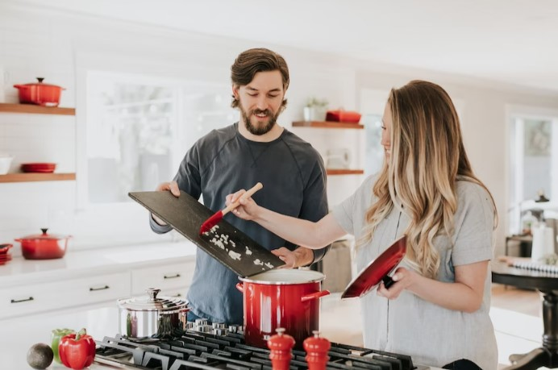
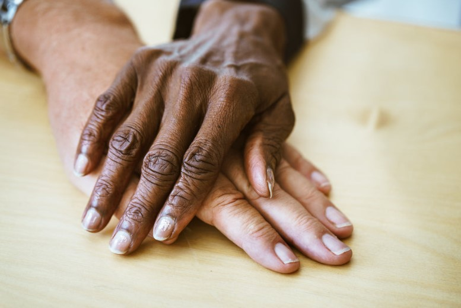

This article has been written and researched by our expert Loveable through a precise methodology. [Learn more about our methodology](https://avada.io/loveable/our-methodological.html)

[Loveable](https://avada.io/loveable/) > [Blog](https://avada.io/loveable/blog/) > [Family](https://avada.io/loveable/family/)

# 17 Best Ways To Spice Up Your Marriage | According To Experts

Written by [Rose Bryne](https://avada.io/loveable/author/rose/) Last Updated on August 17, 2023

- [1\. Restore your favorite indoor date ideas](https://avada.io/loveable/blog/how-to-spice-up-your-marriage/#wp-block-heading-3-5) 
- [2\. Try role play](https://avada.io/loveable/blog/how-to-spice-up-your-marriage/#wp-block-heading-3-9)
- [3\. Make plan for it](https://avada.io/loveable/blog/how-to-spice-up-your-marriage/#wp-block-heading-3-12) 
- [4\. Use sexual toys to spice up your sex life](https://avada.io/loveable/blog/how-to-spice-up-your-marriage/#wp-block-heading-3-16) 
- [5\. Get the best out of Some Erotica.](https://avada.io/loveable/blog/how-to-spice-up-your-marriage/#wp-block-heading-3-19)
- [6\. Seek Counseling](https://avada.io/loveable/blog/how-to-spice-up-your-marriage/#wp-block-heading-3-22)
- [7\. Try something different together](https://avada.io/loveable/blog/how-to-spice-up-your-marriage/#wp-block-heading-3-26) 
- [8\. Don’t Wait Till You want to do](https://avada.io/loveable/blog/how-to-spice-up-your-marriage/#wp-block-heading-3-29) 
- [9\. Get sweaty before making love](https://avada.io/loveable/blog/how-to-spice-up-your-marriage/#wp-block-heading-3-33)
- [10\. Stimulate the senses](https://avada.io/loveable/blog/how-to-spice-up-your-marriage/#wp-block-heading-3-36)
- [11\. Don’t Worry And Stress](https://avada.io/loveable/blog/how-to-spice-up-your-marriage/#wp-block-heading-3-39)
- [12\. Random acts of kindness](https://avada.io/loveable/blog/how-to-spice-up-your-marriage/#wp-block-heading-3-42)
- [13\. Relive your very first date](https://avada.io/loveable/blog/how-to-spice-up-your-marriage/#wp-block-heading-3-46)
- [14\. Words of affirmation](https://avada.io/loveable/blog/how-to-spice-up-your-marriage/#wp-block-heading-3-49)
- [15\. Hugs, more hugs, and hand-holding](https://avada.io/loveable/blog/how-to-spice-up-your-marriage/#wp-block-heading-3-57)
- [16\. Indulge in quality time](https://avada.io/loveable/blog/how-to-spice-up-your-marriage/#wp-block-heading-3-61)
- [17\. Give unexpected gift](https://avada.io/loveable/blog/how-to-spice-up-your-marriage/#wp-block-heading-3-65) 

Are you in a long-term marriage that needs some excitement and romance? If this is the case, you are not alone. Many couples discover that the same old rituals may become tedious and repetitive after years of marriage. It is inevitable in long-term relationships because if both of them only maintain the relationship with a sense of responsibility without cultivating it, the feelings will soon cool down. Fortunately, there are several practical techniques to spice up your marriage and [rekindle the romance in your partnership](https://avada.io/loveable/how-to-rekindle-a-relationship/).

Making time for each other is one of the simplest and most straightforward methods to spice up your marriage. No matter how busy you both are, it’s critical to schedule dates and special activities together. The surprising gestures will demonstrate to your spouse that you are still interested in them and care enough to organize something special for them, even if it is at the last minute.

Try to recapture the passion and romance of your youth. Take the time to recognize and share your gratitude for one another. Simple praises, hugs, and other simple acts of affection might assist in rekindling the spark you previously shared.

There are some tips for **how to spice up your marriage** as a reference for you to improve your married life. You will be able to maintain your marriage fresh and romantic with a little effort and imagination. 

### **1\. Restore your favorite indoor date ideas** 

Restore your favorite indoor date ideas 

When a couple marries, the attraction of their relationship shifts, they no longer love like they used to do while they were dating because they unconsciously believe that effort is not necessary to try. If both of them see it as normal, sooner or later this relationship will fall apart.

Re-enact is considered the best way to show off your sincerity to others. When the feeling of love fades out, let’s recall why we belong together, why you get married, and why your spouse is the final choice, not others else. To answer this question, recreate each other’s favorite date, the time the other half was filled in the mind. It’s often a first date as an example, when you and your mate were still shy and polite in gesture, the moment just wanted to show the strengths and hide the flaws.

### **2\. Try role play**

Role-play is a popular form to get new experiences and enhance the excitement of couples through pillow talk. Are you too bored with the traditional form? Create new spaces and new ideas to have great times with your spouse. 

Call your partner and seriously mention this requirement. Are you ready for an unforgettable night? Show off your ideas without fear of being judged. How about the cosplay student era with old uniforms? You can modify it sexier with handmade designs. In uniform, you can see your partner at his/her peak. A short student skirt with torn mesh socks is a matching combo that provokes any guy. Let’s see what will happen if the two are ready for a role-playing game. It’s a sign of the comeback of strong love. 

### **3\. Make plan for it** 

Make plan for it

Making a sex plan may be one of the most pleasurable, private, and thrilling experiences. It can be a little ridiculous if you set up a fixed schedule for sex as an obligation, but it will show your respect and responsibility to your spouse. It may be a fun and exciting way to spice up your relationship while also generating a sense of closeness and intimacy. Communication is essential in this situation, so make sure you’re both honest and upfront with one another.

Consider what makes each of you happy, what you enjoy and detest. This might help you come up with specific activities that you and your partner will love. Consider when you’d want to have sex, where you’ll have it, and what activities you’ll engage in. If you want to attempt anything new, make sure you have all of the required supplies on hand first.

### **4\. Use sexual toys to spice up your sex life** 

New toys can support the sexual process to go smoothly and reach maximum effectiveness. If you are trying to find how to spice up your marriage, sex toys are what you need. Don’t be hesitant to explore and attempt new things in the bedroom. It will be a time that lovemaking is not as great as the first time. Don’t underestimate adult toys, and they will be effective assistants on the long journey of long-term relationships.

Many online sex toy markets are available, so if you are shy to go to stores, order them through social media. It can help satisfy your spouse. You can ask for what they are keen on first; let’s purchase some to test on your partner, what are the most suitable choices, and what makes him/her great. Some sex toys can be too violent and hurt your partner, so you should kindly ask if they are satisfied or not so that appropriate adjustments can be made. 

### **5\. Get the best out of Some Erotica.**

Erotica refers to works of art that depict or describe sexual behavior and are designed to elicit sexual sensations. The most popular form is some films or footage which is significantly associated with sexual arousal. It is totally different from porn, so don’t put it wrong. 

If you don’t care about sex for a long time, you will definitely be lazy to exercise. Something to stimulate natural instinct is necessary at that moment, so this is what can help you out of procrastination. Search on the Internet or legally buy them. If finding tastelessness in your relationship, you need to rapidly search for how to spice up your marriage. Many couples have regained their burning time thanks to the influence of these artworks.

### **6\. Seek Counseling**

Seek Counseling

Surely, when someone gets into trouble in life, most people choose to seek advice from others, especially in love matters. Remember that only by sharing with others you can gain a multi-dimensional view of an issue; The advice given always has the most general and objective view. Therefore, don’t be hesitant to ask for counsel.

Consultation can come from your partner, relatives, or friends, who are ready to listen to your confession and give back valuable knowledge to solve problems. Besides, if you find that out of control and really need to resolve it amicably, a professional therapist should be considered. Sex education was once looked down upon, but it’s recognized globally nowadays for knowledge enhancement. Many courses both online and offline are available to provide a secure area for people to talk about their goals and desires in sex life with their partner.

### **7\. Try something different together** 

Being in difficulty just because the two don’t spend time together. Everything will be brighter when ready to stand by each other. It’s a reasonable way to escape from a dilemma situation. There are many new fun things to do if you search for them. What haven’t you and your spouse done yet? Have you had an ideal honeymoon since getting married? 

You probably haven’t done simple things together, so make it happen. Classes (cooking, dancing, sex education) or social activities are some common choices to improve oneself in both knowledge and dignity. Otherwise, the most important benefit is the moments together to see each other, to grow up affection, and to remind the beauty in the eye of the beholder. Something new is just a reason to reconnect with the beautiful things that have been forgotten. 

### **8\. Don’t Wait Till You want to do** 

Don’t Wait Till You want to do 

Over time, the spontaneous urge for sex declines, so it’s hard to wait for desire the next time. You need to be active in finding your instinct again, even if you are in excitement or not. You will miss your opportunities if you keep that attitude; from family members to friends, everyone will eventually leave you alone one day soon. 

Instead of rejecting all chances to be with your spouse, you should take advantage of the time you spend together to talk and [cuddle with each other](https://avada.io/loveable/how-to-cuddle/). Is that person so busy that he/she doesn’t have any time for you? Definitely not. Make an arrangement and have a serious talk with your partner. Try to find any way to convince your spouse for a little time together because maybe he/she is probably waiting in the same lustful mood as you used to.

### **9\. Get sweaty before making love**

The physical benefits of sweating are an excellent method to boost your degree of enjoyment and amplify the sensations you feel when performing intimate actions. All of this contributes to a more sensual ambiance, helping you to unwind and enjoy yourself. The mental benefits of sweating together are just as important. Sweating can also help you to bond, as it helps to create a shared experience between you and your partner.

Getting sweaty before making love can also help to create a sense of anticipation which is key to a great love-making session. It helps you to strengthen your bond with your spouse, improves pleasure, and provides a unique and personal environment that can lead to an incredible session of love-making.

### **10\. Stimulate the senses**

The senses contribute vital parts in lovemaking that a professional person will know how to optimize to reach the climax. Each one generally uses the 5 basic senses to enhance the quality of lovemaking.

Everyone hopes to look good in other eyes, surely, and in this case, they must be looked sexy. Beyond physical pleasure, the sensations felt during close physical contact can be extremely intense for both people. When it comes to engaging the senses in lovemaking, the sense of smell may also be a significant instrument. Finally, the sound is a sometimes forgotten component of arousing the senses during lovemaking. Moans and whispers can enhance the enjoyment of the encounter, whilst louder pleasure noises can aid in raising arousal.

### **11\. Don’t Worry And Stress**

Certainly, you cannot do anything with anxiety. One of the most important things in sex life is staying mentally healthy. You only bring euphoria to others if you can control your emotions in good condition. Therefore, just think about how to spice up your marriage after you take good care of yourself. “You can’t love anyone if you haven’t loved yourself”. 

Always taking everything too seriously and having negative sights will ruin anything you have built so far. If you are going to bring that annoying face in front of your partner for cuddling, it will be a shame to bring negativity to others. Doing anything can spirit up emotions, play a game, have a football match, or even have a cup of coffee or wine. Release dopamine to get back the feeling before staying with your partner. When that person sees the freshness on your face, everything can go a lot smoother. 

### **12\. Random acts of kindness**

Random acts of kindness

The details seem small but make a big impact on your mate. Suddenly do simple things such as pick up children, do laundry, clean the house, ask about his/her health condition, prepare a meal, etc. They are great suggestions for thanking them instead. Those unexpected actions can move her; maybe it’s been a long time since you acted like that. If that’s the case, you’ve probably let them down a lot.

For example, after a long working day, your partner is exhausted and stressed heavily. A caring question or a cup of tea is really essential to clear the mind. Talk to them about something bad they experienced today or something memorable. Husband and wife are for refuge and companionship in times like these; you must behave like a responsible person to promote the feelings of the two.

### **13\. Relive your very first date**

The first date is one of the most important landmarks for the celebration. It is said that “First impressions are the most important”. Maybe they are the reasons why you determine that person will be with you until the end of life. That awkward feeling at that time is no longer present because the two understood each other so well. Once again, relive the first time.

Do you remember when and where you meet your partner? Even if it is too hard to re-enact the exact backgrounds, you can do similar things. It’s impossible to back the first time meeting at a dance club in high school. Let’s take a new dancing club. In fact, the most important thing is the moments together; familiar events will bring up fond memories to initiate recollection.

### **14\. Words of affirmation**

Giving your partner words of affirmation and compliments is a wonderful way to show them how much you appreciate them. Words of encouragement may bring a ray of sunshine into your relationship, bringing you and your spouse closer, more supported, and cherished. Words carry a power that can hurt or cure someone, so they always are the best medium to express the heart.

Praising your spouse does more than simply make them feel good; it also shows them that you are paying attention and value their efforts. A few small words may make a significant impact on how someone thinks about themselves, allowing them to identify something they may not have noticed otherwise.

- You are an excellent listener; I like how attentive you are whenever I speak.
- You always make me feel unique, and I consider myself fortunate to have you in my life.
- I like how you never give up; your perseverance is extremely amazing
- You and I may have been given the destiny to be together and protect each other for life
- Perhaps the greatest gift God has given me in life is you

### **15\. Hugs, more hugs, and hand-holding**

Hugs, more hugs and hand-holding

Hugging and hand-holding are two simple yet powerful expressions of love that can help strengthen and deepen relationships. By taking the time to hug and hold hands with your partner, you communicate feelings of love and appreciation. This physical contact is an important way for couples to show their love and emotion for each other and to demonstrate that their bond is unconditional. Therefore, this can act as a catalyst for building a sense of safety and security, which can then be used as the foundation to build a stronger bond. 

Hugging triggers the reduction of oxytocin, a hormone associated with feelings of love and security. Therefore, hugging and holding hands can help to reduce stress and anxiety. Many research shows that the more couples hug each other, the stronger their love will be. It also demonstrates why long-distance relationships often fall apart; they don’t frequently have physical intimacy. 

### **16\. Indulge in quality time**

Indulge in quality time

A date night is a terrific way to get started. Plan something special, such as a picnic or a night out at a beautiful restaurant or theater, where you and your partner can spend quality time together. A weekend break or even a short vacation might help you relax and reconnect. You may also spend quality time together by doing things that you both like. Nothing may be just as pleasurable as doing anything together. You may also have a chat about your day, your aspirations and dreams, or even irrelevant stuff.

Whatever method you choose to spend quality time with your spouse, the key thing is that you do it together and make it a priority in your marriage. Quality time may be a terrific way to demonstrate your love and gratitude for your spouse while also strengthening your connection.

### **17\. Give unexpected gift** 

Who doesn’t like to get gifts? Unexpected presents are an excellent way to spice up your marriage and show your mate that you are thinking of them. Unexpected presents don’t have to be large or expensive; even something as simple as a handwritten love note or a single flower may leave an indelible impact on your lover. Some great ideal presents can be A bouquet of their favorite flowers, a thoughtful card with a personal message, a box of their favorite chocolates, or a small piece of jewelry.

Giving your spouse little and thoughtful presents throughout the day is a terrific way to show them that you are thinking about them. It may also be a great way to surprise and delight your sweetheart. Giving a gift does not prove that you are materialistic; by simple thinking, the gift is representative of the secret words in your heart.

**_Related_**: [Surprise Anniversary Gifts For Husband](https://avada.io/loveable/surprise-anniversary-gifts-husband/)

## **Final Words**

Don’t ignore what you see as normal; irresponsibility shouldn’t appear in an adult. After realizing the incident, take action as soon as possible. The love doesn’t disappear; just the attitude about it has changed. Always keep in mind that a sustainable relationship has to be built by the two sides. If your partner hasn’t been ready yet, why don’t you go first? 

Let’s look back to see how you try to be with each other and what promises you have made together. Proving that what you said was not just empty words! Remind your partner of love that has sunk into oblivion. One more time, revive it again. Hope that **17 Best Ways To Spice Up Your Marriage | According To Experts** will support you and yours to get back the beautiful moments that you have been through.

- [1\. Restore your favorite indoor date ideas](https://avada.io/loveable/blog/how-to-spice-up-your-marriage/#wp-block-heading-3-5) 
- [2\. Try role play](https://avada.io/loveable/blog/how-to-spice-up-your-marriage/#wp-block-heading-3-9)
- [3\. Make plan for it](https://avada.io/loveable/blog/how-to-spice-up-your-marriage/#wp-block-heading-3-12) 
- [4\. Use sexual toys to spice up your sex life](https://avada.io/loveable/blog/how-to-spice-up-your-marriage/#wp-block-heading-3-16) 
- [5\. Get the best out of Some Erotica.](https://avada.io/loveable/blog/how-to-spice-up-your-marriage/#wp-block-heading-3-19)
- [6\. Seek Counseling](https://avada.io/loveable/blog/how-to-spice-up-your-marriage/#wp-block-heading-3-22)
- [7\. Try something different together](https://avada.io/loveable/blog/how-to-spice-up-your-marriage/#wp-block-heading-3-26) 
- [8\. Don’t Wait Till You want to do](https://avada.io/loveable/blog/how-to-spice-up-your-marriage/#wp-block-heading-3-29) 
- [9\. Get sweaty before making love](https://avada.io/loveable/blog/how-to-spice-up-your-marriage/#wp-block-heading-3-33)
- [10\. Stimulate the senses](https://avada.io/loveable/blog/how-to-spice-up-your-marriage/#wp-block-heading-3-36)
- [11\. Don’t Worry And Stress](https://avada.io/loveable/blog/how-to-spice-up-your-marriage/#wp-block-heading-3-39)
- [12\. Random acts of kindness](https://avada.io/loveable/blog/how-to-spice-up-your-marriage/#wp-block-heading-3-42)
- [13\. Relive your very first date](https://avada.io/loveable/blog/how-to-spice-up-your-marriage/#wp-block-heading-3-46)
- [14\. Words of affirmation](https://avada.io/loveable/blog/how-to-spice-up-your-marriage/#wp-block-heading-3-49)
- [15\. Hugs, more hugs, and hand-holding](https://avada.io/loveable/blog/how-to-spice-up-your-marriage/#wp-block-heading-3-57)
- [16\. Indulge in quality time](https://avada.io/loveable/blog/how-to-spice-up-your-marriage/#wp-block-heading-3-61)
- [17\. Give unexpected gift](https://avada.io/loveable/blog/how-to-spice-up-your-marriage/#wp-block-heading-3-65) 

### [Rose Bryne](https://avada.io/loveable/author/rose/)

Hi, I'm Rose! I love animals and spending time with kids. At Loveable, I help people find unique gifts for special occasions like Valentine's Day, housewarmings, and graduations. I enjoy finding gifts for kids, teens, and animal lovers that match their interests and personalities. Making gift-giving a pleasant experience is my priority. Let me assist you in finding the perfect gift!

- [Twitter](https://twitter.com/intent/tweet)
- [Facebook](https://www.facebook.com/sharer/sharer.php)
- [instagram](https://avada.io/loveable/blog/how-to-spice-up-your-marriage/)
- [pinterest](https://www.pinterest.com/loveablellc/)

## Related Posts

[### 30 Best 4 Year Old Birthday Party Ideas For A Memorable Celebration](https://avada.io/loveable/blog/4-year-old-birthday-party-ideas/) 

[

### 16th Birthday Party Ideas to Make an Unforgettable Day

](https://avada.io/loveable/blog/16th-birthday-party-ideas/)

[

### 150+ Inspirational Birthday Quotes to Spread Joy on Special Day

](https://avada.io/loveable/blog/inspirational-birthday-quotes/)

[

### 160+ Birthday Wishes for Wife to Express Eternal Love

](https://avada.io/loveable/blog/birthday-wishes-for-wife/)

[### 90+ Heart Touching Birthday Wishes for Niece to Make Her Day Extra Special](https://avada.io/loveable/blog/birthday-wishes-for-niece/)
