This article has been written and researched by our expert Loveable through a precise methodology. [Learn more about our methodology](https://avada.io/loveable/our-methodological.html)

[Loveable](https://avada.io/loveable/) > [Blog](https://avada.io/loveable/blog/) > [Parenting](https://avada.io/loveable/parenting/)

# 17 Engaging Educational Activities For Kids And Students to Enhance Learning

Written by [Benjamin Collins](https://avada.io/loveable/author/benjamin/) Last Updated on September 18, 2023

- [17 Educational Activities For Kids And Students](https://avada.io/loveable/blog/engaging-educational-activities/#wp-block-heading-2-3)
    - [1\. Jigsaw](https://avada.io/loveable/blog/engaging-educational-activities/#wp-block-heading-3-5)
    - [2\. One-Minute Paper](https://avada.io/loveable/blog/engaging-educational-activities/#wp-block-heading-3-9)
    - [3\. Sidewalk Chalk Letters](https://avada.io/loveable/blog/engaging-educational-activities/#wp-block-heading-3-12)
    - [4\. Word Memory Game](https://avada.io/loveable/blog/engaging-educational-activities/#wp-block-heading-3-17)
    - [5\. Funny Math Game](https://avada.io/loveable/blog/engaging-educational-activities/#wp-block-heading-3-19)
    - [6\. Marshmallow Shapes Games](https://avada.io/loveable/blog/engaging-educational-activities/#wp-block-heading-3-22)
    - [7\. Family Flag](https://avada.io/loveable/blog/engaging-educational-activities/#wp-block-heading-3-24)
    - [8\. Story Map](https://avada.io/loveable/blog/engaging-educational-activities/#wp-block-heading-3-27)
    - [9\. Experiment with color](https://avada.io/loveable/blog/engaging-educational-activities/#wp-block-heading-3-31) 
    - [10\. Stick Math Game](https://avada.io/loveable/blog/engaging-educational-activities/#wp-block-heading-3-33) 
    - [11\. Personality Note](https://avada.io/loveable/blog/engaging-educational-activities/#wp-block-heading-3-35) 
    - [12\. STEM Challenge](https://avada.io/loveable/blog/engaging-educational-activities/#wp-block-heading-3-39)
    - [13\. DIY Board Game](https://avada.io/loveable/blog/engaging-educational-activities/#wp-block-heading-3-41)
    - [14\. Vocabulary Scavenger Hunt](https://avada.io/loveable/blog/engaging-educational-activities/#wp-block-heading-3-45)
    - [15\. Play Pretend](https://avada.io/loveable/blog/engaging-educational-activities/#wp-block-heading-3-48)
    - [16\. Semantic Maps](https://avada.io/loveable/blog/engaging-educational-activities/#wp-block-heading-3-53)
    - [17\. Make a Movie](https://avada.io/loveable/blog/engaging-educational-activities/#wp-block-heading-3-55)
- [7 Best Educational Toys For Kids That Will Enhance Brain Development](https://avada.io/loveable/blog/engaging-educational-activities/#wp-block-heading-2-58)
    - [Montessori Wooden Garden Toy](https://avada.io/loveable/blog/engaging-educational-activities/#wp-block-heading-3-60)
    - [Wooden Kids Baby Activity Cube](https://avada.io/loveable/blog/engaging-educational-activities/#wp-block-heading-3-64)
    - [Wooden Montessori Toys](https://avada.io/loveable/blog/engaging-educational-activities/#wp-block-heading-3-68)
    - [Personalized Take-Along Tool Kit](https://avada.io/loveable/blog/engaging-educational-activities/#wp-block-heading-3-72)
    - [Chomp and Count Dino](https://avada.io/loveable/blog/engaging-educational-activities/#wp-block-heading-3-76)
    - [Personalized Train Name With Magnets](https://avada.io/loveable/blog/engaging-educational-activities/#wp-block-heading-3-80)
    - [RenFox Kids Musical Mats](https://avada.io/loveable/blog/engaging-educational-activities/#wp-block-heading-3-84)
- [Bottom Line](https://avada.io/loveable/blog/engaging-educational-activities/#wp-block-heading-2-88) 

As parents and educators, we share a common goal of wanting our children to thrive academically and develop a passion for knowledge. One way to achieve this is by incorporating engaging educational activities into their daily routine. From fun games to creative crafts, there are countless ways to make learning exciting for kids and students of all ages. 

In this article, we’ll explore **17 educational activities** that are sure to foster a love for learning in your little ones. And if you’re on the hunt for the best [educational toys for a one-year-old](https://avada.io/loveable/educational-toys-1-year-olds/), be sure to check out the list created by Loveable. Get ready to inspire your children’s curiosity, creativity, and passion for knowledge with these fun and educational activities.

## **17 Educational Activities For Kids And Students**

Here are 17 engaging educational activities that will help your child enhance their learning and cognitive skills while having fun.

### **1\. Jigsaw**

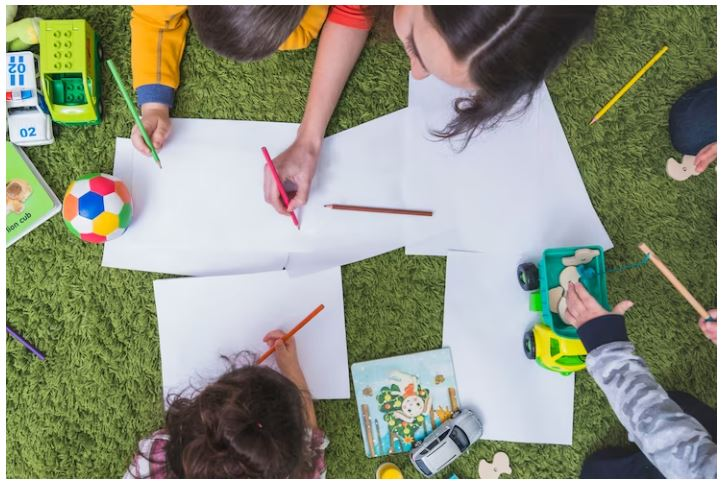

Jigsaw

One way to encourage accountability among students is to have them teach each other. To do this, create “home groups” consisting of 4 or 5 individuals. Even if everyone is learning remotely, this can be done using Zoom or Google Meet breakout rooms. 

Assign each member of the group a different topic to investigate, and then have them collaborate with students from other groups on the same topic. After mastering the subject matter, they will return to their original group to share their newfound knowledge.

### **2\. One-Minute Paper**

One way to encourage students to reflect on their learning and improve their writing skills is by asking them to share their biggest question or most eye-opening revelation in a minute-long recording at the end of class. 

This activity not only provides insight into their understanding and misunderstandings but also allows them to express their thoughts. Additionally, there are various prompts available that can be used to prompt students to write.

### **3\. Sidewalk Chalk Letters**

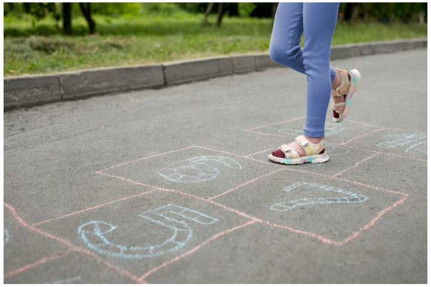

Sidewalk Chalk Letters

Encourage simultaneous physical and mental activity by using sidewalk chalk letters. Spell out various sight words by hopping from one letter to another. It’s a great way to engage both the mind and body.

This activity is great for kids of all ages. For younger children, you can start with simple three-letter words such as ‘cat’ or ‘dog’ and then move on to more complex words. Older children can practice spelling out longer words like ‘dinosaur’ or ‘elephant’. You can also challenge them to spell out their name or a favorite phrase. 

It encourages gross motor skill development and helps them become more familiar with the sight words they learn in school. Plus, it’s a fun way to get outside and enjoy the fresh air while learning!

### **4\. Word Memory Game**

A way to practice two skills simultaneously is by playing a Word/Definition Memory Game. This can be done by writing new vocabulary words on one card and corresponding definitions on another. Afterward, the game is played similarly to traditional Memory games. Another option is to use synonyms and antonyms instead. 

### **5\. Funny Math Game**

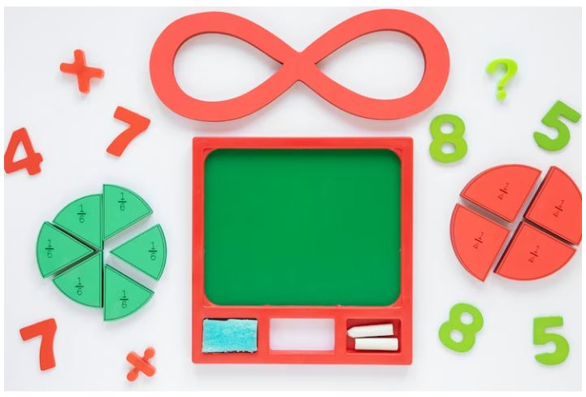

Funny Math Game

Setting up this game is quite easy. All you need to do is write math problems on the top of bottle caps and their solutions inside them. If a student answers a math problem correctly, they can keep the bottle cap. Otherwise, it goes back to the pile. The game ends when all the bottle caps are used up, and the player with the most collected bottle caps is declared the winner.

### **6\. Marshmallow Shapes Games**

You can teach geometry in a fun way by using mini marshmallows and toothpicks or small pretzel rods to construct various shapes. Children can progress from 2D to 3D designs as they become more skilled.

### **7\. Family Flag**

Encourage your children to learn about vexillology, which is the study of flags. Discuss with them the meaning behind the symbols on the flags of various countries. You can also guide them in creating their own flag, using the “Good Flag, Bad Flag” guidelines from the North American Vexillological Association. 

Alternatively, you can collaborate with your family to design a flag for your household. This is among great educational activities that will make your kids feel proud and accomplished, as vexillology is an impressive subject to learn about.

### **8\. Story Map**

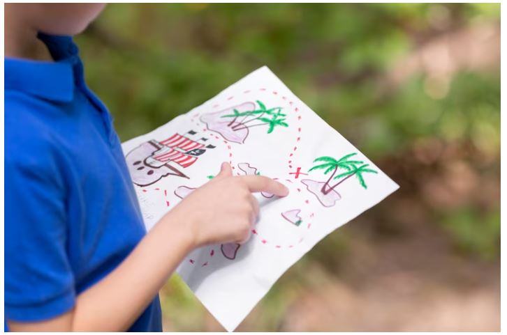

Story Map

In order for children to become writers, it’s beneficial for them to understand the structure of stories. To achieve this, they can use a story map to break down the components of a book. 

This can be done by creating a map for a familiar tale, such as “Goldilocks and the Three Bears,” or by utilizing it as a framework for their own unique story. It’s important not to leave out any key details when paraphrasing this text.

### **9\. Experiment with color** 

The excitement level increases by adding food coloring to the traditional vinegar and baking soda experiment. Apart from using a baster or eye dropper to produce more “explosions,” children can also observe the outcome when different shades merge. No information is omitted when paraphrasing the original text.

### **10\. Stick Math Game** 

One of the benefits of this task is that children can engage in it without any assistance, at any time they have a spare moment (such as when traveling by car). The task involves inscribing a set of mathematical problems on craft sticks, providing an opportunity for children to practice mental arithmetic. The aim is to see how many sticks they can complete within a specified time frame. You can also use this game to [explore even and odd numbers](https://www.smartick.com/lp/learn-even-and-odd-numbers/) and fractions.

### **11\. Personality Note** 

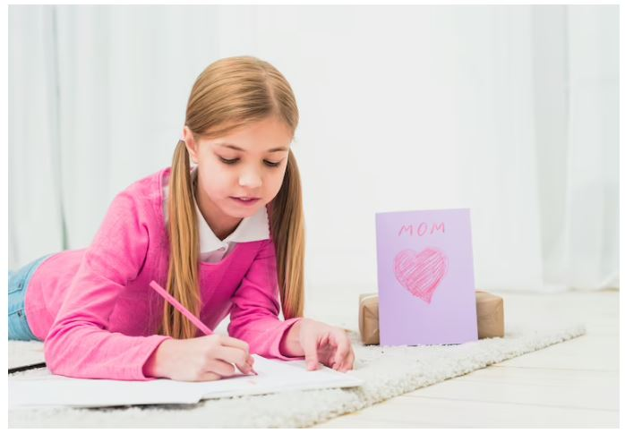

Personality Note 

Making a personality note can be an engaging educational activity for kids and students because it allows them to reflect on their own thoughts, feelings, and behaviors. This activity can help them develop self-awareness, an essential skill for personal growth and success.

When students [create a personality note](https://avada.io/loveable/personalized-notepads/), they are encouraged to think about their strengths, weaknesses, values, and goals. They can also consider how their personality traits and habits impact their relationships with others and their ability to achieve their objectives.

### **12\. STEM Challenge**

STEM challenges often involve designing and building something like a bridge, robot, or simple machine. By working on these projects, kids apply what they have learned in science, math, and engineering practically and engagingly. This can help them better understand these subjects and how they relate to the real world.

### **13\. DIY Board Game**

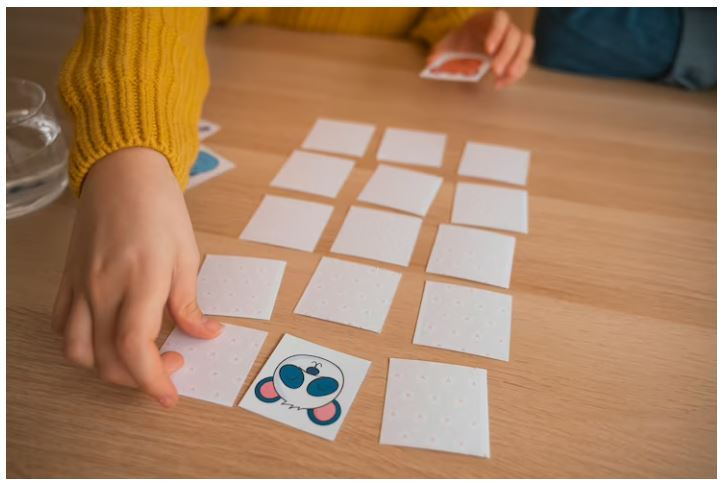

Board Game

DIY (Do-It-Yourself) board games are great for kids because they encourage creativity, critical thinking, and problem-solving skills. When kids create their own board games, they get to use their imaginations to come up with new ideas and put their design skills to the test.

Designing a board game requires kids to think about game mechanics, player interactions, and balance. They also have to consider the game’s theme, art, and overall presentation. It’s a [fun indoor game](https://avada.io/loveable/fun-indoor-games/) for your kids.

### **14\. Vocabulary Scavenger Hunt**

A vocabulary scavenger hunt is among fun and engaging educational activity for kids and students because it allows them to explore and discover new words in a hands-on and interactive way. 

This activity is great for enhancing learning because it helps students build their vocabulary, improve their reading and writing skills, and increase their overall knowledge of the language. Students are given a list of words to find and define during a vocabulary scavenger hunt. 

### **15\. Play Pretend**

Play Pretend

Pretend play involves creating and acting out scenarios or roles that are not based on reality. This can involve playing make-believe, acting out imaginary situations, or taking on different personas. By engaging in pretend play, children can develop their imaginations and creativity, which can help them to come up with unique solutions to problems.

Pretend play also helps children develop social and emotional intelligence by exploring different social roles and relationships.

**_Related_**: [Fun for the Whole Family: 26 Family Outdoor Activities to Enjoy Together](https://avada.io/loveable/family-outdoor-activities/)

### **16\. Semantic Maps**

Semantic maps are indeed a great educational activity for kids and students to enhance learning. It is a visual technique used to organize information and ideas around a central concept or theme. It can be used to help students better understand and remember new vocabulary, concepts, or relationships between ideas.

### **17\. Make a Movie**

Creating a film can be an entertaining and informative undertaking for children as it enables them to unleash their inventiveness, innovativeness, and storytelling abilities while enhancing crucial skills such as teamwork, communication, and critical thinking.

Making a movie requires creating a storyline, characters, and plot, which can help kids improve their storytelling skills. They can also develop their ability to organize and sequence events, which can be useful in various academic subjects.

## **7 Best Educational Toys For Kids That Will Enhance Brain Development**

There are types of toys that usually have pieces that are interactive, and youngsters are engaged in learning through playing rather than just by reading a book or listening to a presentation. They can be educational in themselves or help promote an interest or learning activity you are already engaged in.

### **[Montessori Wooden Garden Toy](https://www.amazon.com/SKYFIELD-Montessori-Developmental-Sorting-Orchard/dp/B0B5RG691D/r?ie=UTF8&tag=loveable06-20)**

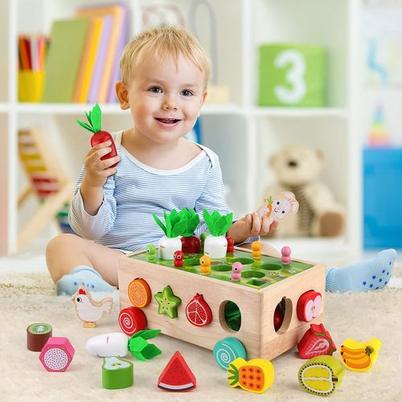

Made from high-quality and non-toxic water-based paint, this toy is safe for kids of all ages, including 1 2 3 years old boys and girls. With round, smooth edges, you can rest assured that your child will play safely all day.

It is not only safe but also fun and educational! Your child will be able to learn to recognize and match fruit shapes with the help of these adorable wooden fruits. And with its kid sizes, it’s perfect for little hands to grasp and manipulate, promoting fine motor skills development.

### **[Wooden Kids Baby Activity Cube](https://www.amazon.com/Spunky-Kinder-Wooden-Kids-Activity/dp/B07NCQ1Z1C/?ie=UTF8&tag=loveable06-20&th=1)**

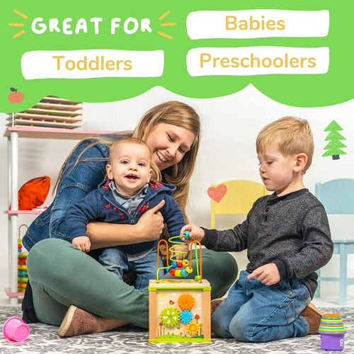

This exciting toy features a variety of games and activities that will engage and entertain 1-year-old toddlers, while also helping them learn and develop important skills.

Parents can enjoy a fun and stress-free time with their kids as they explore the different games and activities on the cube. Say goodbye to the frustration that comes with teaching young children, and hello to a world of learning and fun!

### **[Wooden Montessori Toys](https://www.amazon.com/Montessori-Hammering-Xylophone-Developmental-Activities/dp/B09XMRSG9G/?th=1)**

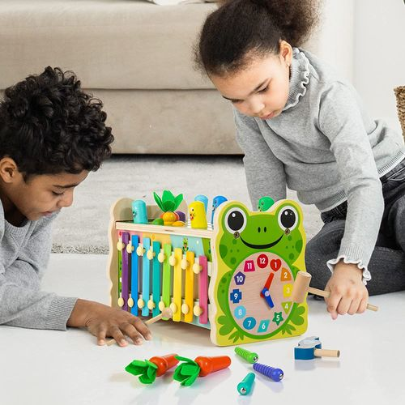

These toys are specifically designed with your toddler’s development in mind, based on the Montessori method of learning. With a variety of games and activities to explore, your child will stay busy and entertained while also learning important skills.

From shape recognition to hand-eye coordination, these toys offer a range of educational benefits that will help your child excel in their development. And the best part? While your child is busy having fun and learning, you’ll have some extra time to relax and take a breather.

### **[Personalized Take-Along Tool Kit](https://www.etsy.com/listing/1096367536/melissa-doug-personalized-take-along?zanpid=10690_1684422701_5d3b2f3184c6a6d029b7eecb61f59f01&utm_medium=affiliate&utm_source=affiliate_window&utm_campaign=row_buyer&utm_content=963277&awc=10690_1684422701_5d3b2f3184c6a6d029b7eecb61f59f01)**

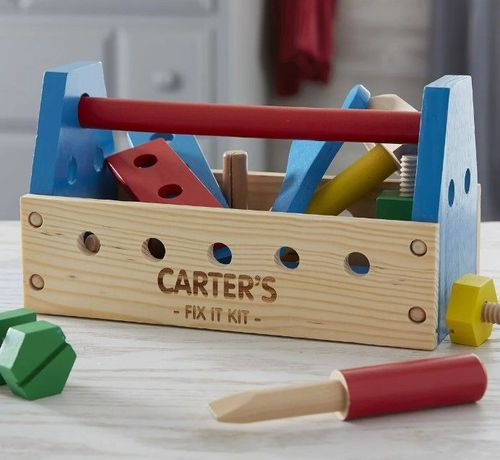

Attention all parents of curious toddlers! This is the perfect toy to entertain your little ones while teaching them basic repair skills. This kit is designed to be easily portable, making it convenient to bring along on outings such as trips to the park or road trips, thanks to its compact size. 

And the best part? You have the option to make it more unique by adding your child’s name. Say goodbye to worrying about your child getting into dangerous tools, and hello to a fun and educational toy that will widen their mind.

### **[Chomp and Count Dino](https://www.amazon.com/VTech-Chomp-and-Count-Dino/dp/B00K89KFX0/?ie=UTF8&tag=loveable06-20)**

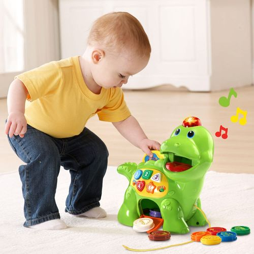

This super cute plastic dinosaur is the perfect addition to your child’s toy collection. Not only does it provide endless entertainment with its diverse sounds and exciting games, but it also helps your child learn to count by feeding the dinosaur with colorful pieces that make a sound. 

With over 130 melodies to choose from, your child will never tire of playing with this amazing toy. Plus, the Chomp and Count Dino is made from high-quality, user-friendly plastic that will last for years to come. 

### **[Personalized Train Name With Magnets](https://www.etsy.com/listing/1273039834/personalized-train-name-with-magnets?zanpid=10690_1684422738_739740378a86d825d2dd9b2e3b3d2631&utm_medium=affiliate&utm_source=affiliate_window&utm_campaign=row_buyer&utm_content=963277&awc=10690_1684422738_739740378a86d825d2dd9b2e3b3d2631)**

The magnets on each part of the train create a strong connection, allowing your child to connect and disconnect the pieces easily. Not only is this fun, but it also helps to educate the flexibility of their fingers. 

Moreover, you can personalize this train with your child’s name, making it a one-of-a-kind toy they will cherish for years. Imagine the excitement on their face as they drive their very own train around the house or backyard. 

### **[RenFox Kids Musical Mats](https://www.amazon.com/RenFox-Musical-Keyboard-Education-43-3x14-2in/dp/B07MBDZCXT/r?ie=UTF8&tag=loveable06-20)**

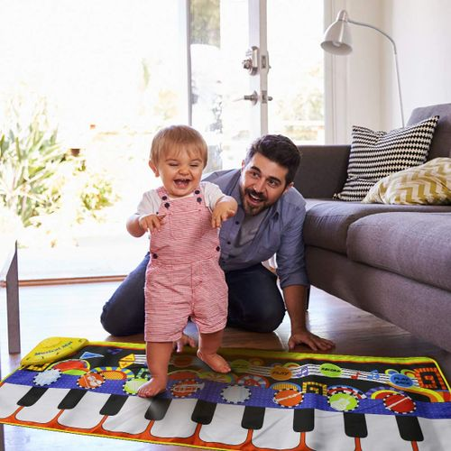

This is the perfect way to cheer up your little ones while stimulating their excitement for music and learning! This mat is made from soft cotton material and is ideal for 1-year-old toddlers who love to crawl and play. With 25 different sounds, this musical mat offers your child endless hours of fun and learning. 

But that’s not all – this mat is also a fantastic way to introduce basic education about music to your little one. As they play and explore the different sounds, they’ll be learning about notes, rhythms, and melodies.

## **Bottom Line** 

The best way for kids and students to learn is to have fun. **Engaging in educational activities** is one of the best ways to promote a love of learning and help your students engage in hands-on learning activities. 

While our children play, they explore their world and connect with what they see. They will also be learning and developing their abilities in many areas while they are having fun. These are some of the best educational toys that will help your kids, and students learn and have fun while doing so.

- [17 Educational Activities For Kids And Students](https://avada.io/loveable/blog/engaging-educational-activities/#wp-block-heading-2-3)
    - [1\. Jigsaw](https://avada.io/loveable/blog/engaging-educational-activities/#wp-block-heading-3-5)
    - [2\. One-Minute Paper](https://avada.io/loveable/blog/engaging-educational-activities/#wp-block-heading-3-9)
    - [3\. Sidewalk Chalk Letters](https://avada.io/loveable/blog/engaging-educational-activities/#wp-block-heading-3-12)
    - [4\. Word Memory Game](https://avada.io/loveable/blog/engaging-educational-activities/#wp-block-heading-3-17)
    - [5\. Funny Math Game](https://avada.io/loveable/blog/engaging-educational-activities/#wp-block-heading-3-19)
    - [6\. Marshmallow Shapes Games](https://avada.io/loveable/blog/engaging-educational-activities/#wp-block-heading-3-22)
    - [7\. Family Flag](https://avada.io/loveable/blog/engaging-educational-activities/#wp-block-heading-3-24)
    - [8\. Story Map](https://avada.io/loveable/blog/engaging-educational-activities/#wp-block-heading-3-27)
    - [9\. Experiment with color](https://avada.io/loveable/blog/engaging-educational-activities/#wp-block-heading-3-31) 
    - [10\. Stick Math Game](https://avada.io/loveable/blog/engaging-educational-activities/#wp-block-heading-3-33) 
    - [11\. Personality Note](https://avada.io/loveable/blog/engaging-educational-activities/#wp-block-heading-3-35) 
    - [12\. STEM Challenge](https://avada.io/loveable/blog/engaging-educational-activities/#wp-block-heading-3-39)
    - [13\. DIY Board Game](https://avada.io/loveable/blog/engaging-educational-activities/#wp-block-heading-3-41)
    - [14\. Vocabulary Scavenger Hunt](https://avada.io/loveable/blog/engaging-educational-activities/#wp-block-heading-3-45)
    - [15\. Play Pretend](https://avada.io/loveable/blog/engaging-educational-activities/#wp-block-heading-3-48)
    - [16\. Semantic Maps](https://avada.io/loveable/blog/engaging-educational-activities/#wp-block-heading-3-53)
    - [17\. Make a Movie](https://avada.io/loveable/blog/engaging-educational-activities/#wp-block-heading-3-55)
- [7 Best Educational Toys For Kids That Will Enhance Brain Development](https://avada.io/loveable/blog/engaging-educational-activities/#wp-block-heading-2-58)
    - [Montessori Wooden Garden Toy](https://avada.io/loveable/blog/engaging-educational-activities/#wp-block-heading-3-60)
    - [Wooden Kids Baby Activity Cube](https://avada.io/loveable/blog/engaging-educational-activities/#wp-block-heading-3-64)
    - [Wooden Montessori Toys](https://avada.io/loveable/blog/engaging-educational-activities/#wp-block-heading-3-68)
    - [Personalized Take-Along Tool Kit](https://avada.io/loveable/blog/engaging-educational-activities/#wp-block-heading-3-72)
    - [Chomp and Count Dino](https://avada.io/loveable/blog/engaging-educational-activities/#wp-block-heading-3-76)
    - [Personalized Train Name With Magnets](https://avada.io/loveable/blog/engaging-educational-activities/#wp-block-heading-3-80)
    - [RenFox Kids Musical Mats](https://avada.io/loveable/blog/engaging-educational-activities/#wp-block-heading-3-84)
- [Bottom Line](https://avada.io/loveable/blog/engaging-educational-activities/#wp-block-heading-2-88) 

### [Benjamin Collins](https://avada.io/loveable/author/benjamin/)

I'm Benjamin Collins, a gift ideas creator at Loveable. We specialize in unique and personalized gifts for any occasion. With my honed skills, I recommend gifts tailored to the recipient's personality and interests, whether it's Halloween, Christmas, or any other celebration.

- [Twitter](https://twitter.com/intent/tweet)
- [Facebook](https://www.facebook.com/sharer/sharer.php)
- [instagram](https://avada.io/loveable/blog/engaging-educational-activities/)
- [pinterest](https://www.pinterest.com/loveablellc/)

## Related Posts

[

### 79 Heartfelt Missing Mom Quotes for Expressing Love and Longing

](https://avada.io/loveable/blog/missing-mom-quotes/)

[

### Parenting with Depression: Strategies for Coping, Seeking Help, and Building Resilience

](https://avada.io/loveable/blog/parenting-with-depression/)

[

### 100 Empowering Single Mom Quotes: Inspirational Words for Strong Mothers

](https://avada.io/loveable/blog/single-mom-quotes/)

[

### 99+ Heartfelt Quotes And Wishes: Happy Anniversary to Mom and Dad!

](https://avada.io/loveable/blog/quotes-happy-anniversary-mom-dad/)

[

### 5 Ways to Foster a Positive Parent-Teacher Relationship

](https://avada.io/loveable/blog/parent-teacher-relationship/)
