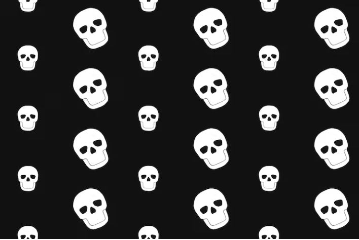

This article has been written and researched by our expert Loveable through a precise methodology. [Learn more about our methodology](https://avada.io/loveable/our-methodological.html)

[Loveable](https://avada.io/loveable/) > [Blog](https://avada.io/loveable/blog/) > [Holiday](https://avada.io/loveable/holiday/)

# 17 Halloween Symbols Explained in Detail – Unveiling the Mysteries

Written by [Blake Simpson](https://avada.io/loveable/author/blake/) Last Updated on September 19, 2023

- [Halloween Symbols Explained in Detail](https://avada.io/loveable/blog/halloween-symbols-explained/#wp-block-heading-2-3)
    - [Candy Corn](https://avada.io/loveable/blog/halloween-symbols-explained/#wp-block-heading-3-4)
    - [Corn Husks](https://avada.io/loveable/blog/halloween-symbols-explained/#wp-block-heading-3-9)
    - [Halloween Pumpkins](https://avada.io/loveable/blog/halloween-symbols-explained/#wp-block-heading-3-14)
    - [Halloween Clowns](https://avada.io/loveable/blog/halloween-symbols-explained/#wp-block-heading-3-20)
    - [Spider Symbolism](https://avada.io/loveable/blog/halloween-symbols-explained/#wp-block-heading-3-28)
    - [Blood Symbolism](https://avada.io/loveable/blog/halloween-symbols-explained/#wp-block-heading-3-35)
    - [Trick or Treating](https://avada.io/loveable/blog/halloween-symbols-explained/#wp-block-heading-3-42)
    - [Owl Symbolism](https://avada.io/loveable/blog/halloween-symbols-explained/#wp-block-heading-3-47)
    - [Scarecrow Halloween Symbols](https://avada.io/loveable/blog/halloween-symbols-explained/#wp-block-heading-3-54)
    - [Mexican Skull](https://avada.io/loveable/blog/halloween-symbols-explained/#wp-block-heading-3-61)
    - [Skull Symbol](https://avada.io/loveable/blog/halloween-symbols-explained/#wp-block-heading-3-66)
    - [Halloween Bat](https://avada.io/loveable/blog/halloween-symbols-explained/#wp-block-heading-3-71)
    - [Skeleton Halloween Symbols](https://avada.io/loveable/blog/halloween-symbols-explained/#wp-block-heading-3-78)
    - [Halloween Cat](https://avada.io/loveable/blog/halloween-symbols-explained/#wp-block-heading-3-85)
    - [Ghost Symbol](https://avada.io/loveable/blog/halloween-symbols-explained/#wp-block-heading-3-93)
    - [Witch Symbols](https://avada.io/loveable/blog/halloween-symbols-explained/#wp-block-heading-3-98)
    - [Jack-o-Lantern Symbol](https://avada.io/loveable/blog/halloween-symbols-explained/#wp-block-heading-3-106)
- [In Conclusion,](https://avada.io/loveable/blog/halloween-symbols-explained/#wp-block-heading-2-115)

As Halloween approaches, expect store shelves to be adorned with vibrant and festive decorations, creating a colorful atmosphere. Every year, we find ourselves surrounded by familiar Halloween symbols, and we often incorporate our favorites into our own decor. This year, why not take the opportunity to delve deeper into the meaning behind your cherished symbols?

While Halloween practices and traditions can vary across different locations and generations, the symbols associated with the holiday tend to remain consistent. However, as time goes by, cultures may gradually lose sight of the original meanings behind these symbols, and new interpretations can emerge. Presented below is a compilation of enduring **Halloween symbols** that have been passed down through generations, accompanied by information on the significance they have acquired over time.

## **Halloween Symbols Explained in Detail**

### **Candy Corn**

You may be curious about the symbolism behind candy corn, wondering, “What does it represent?” Although it doesn’t trace back to the ancient festival of Samhain or possesses ancient ritual significance, candy corn has garnered considerable admiration among Halloween enthusiasts. 

Despite its relatively recent origin in the late 1800s, [Halloween candy](https://avada.io/loveable/halloween-candy-gifts/) corn has evolved into a symbol that encapsulates the transition of seasons. It embodies the essence of autumn, serving as a nostalgic reminder of the changing hues of leaves and the invigorating coolness in the air. Additionally, candy corn holds symbolic significance as an indicator of the imminent arrival of Halloween.

[Take a look at the collection!](https://depositphotos.com/photos/candy-corn.html?filter=all)

### **Corn Husks**

They have appeared in Halloween symbols since the ancient times of Samhain when agriculture played a significant role during the season. In present-day, corn husk decorations endure well beyond Halloween and can persist until Thanksgiving, much like scarecrows.

This enduring presence is due to the symbolism associated with corn husks, representing the conclusion of the harvest season and the transition between seasons. They embody the culmination of a fruitful harvest, signifying the end of autumn and the onset of winter.

[Take a look at the collection!](https://depositphotos.com/photos/corn-husks-halloween.html?filter=all)

### **Halloween Pumpkins**

The [carved pumpkin](https://avada.io/loveable/blog/halloween-pumpkin/) is an iconic and timeless Halloween symbol. Its origins can be traced back to ancient Ireland, where the Celts would carve turnips and place an ember inside to ward off malevolent spirits. In Ireland, pumpkins were not readily available, but the tradition transitioned to pumpkins in other countries.

What does the jack-o-lantern symbolize? According to Irish folklore, the practice of carving a face on the pumpkin is linked to the tale of Stingy Jack, a drunken individual who delighted in playing tricks on others. His mischievous antics incurred the wrath of God and the Devil, resulting in his rejection from heaven and hell upon his demise. As a consequence, Stingy Jack was condemned to eternal wandering on Earth. To illuminate his path, the Devil presented him with a lump of glowing coal, which Jack placed inside a carved turnip.

During Halloween, the sight of [decorated doorsteps](https://avada.io/loveable/blog/halloween-door-decorations/) and windows adorned with carved pumpkins is ubiquitous. While the original significance of the jack-o-lantern may have evolved over time, it remains one of the most prevalent symbols associated with Halloween.

[Take a look at the collection!](https://depositphotos.com/folder/Halloween%20Pumpkin-362885530.html?utm_source=blogcollection&utm_medium=blog&utm_campaign=Halloween_Pumpkin)

### **Halloween Clowns**

The concept of clowns has a long-standing history, but it is only in recent times that the emergence of dark and terrifying clowns has gained popularity. Throughout history, in places like Rome, China, Europe, and elsewhere, clowns held a unique role as the sole individuals permitted to mock and jest about kings and emperors.

They embodied trickery and merriment, concealing an impish nature behind their smiling, [makeup-covered faces](https://avada.io/loveable/blog/halloween-face-paint-ideas/). Clowns were amiable yet also symbolized mischief and unpredictability, presenting a joyful facade while harboring a mischievous spirit. 

In contemporary culture, the image of the clown has taken a notably darker turn, with the portrayal of scary clown personas dominating the scene. In fact, it is easier to recall instances of eerie and menacing carnival clowns than it is to conjure images of jovial and endearing ones.

Several notable movies and shows have featured infamous evil clowns, such as Stephen King’s “IT,” “Killer Klowns From Outer Space,” “American Horror Story,” “The Devil’s Rejects,” and even the unsettling clown toy in the film “Krampus.”

Furthermore, the unsettling trend of real-life creepy clown sightings in 2016 further solidified the Halloween clown as a chilling symbol of fear. While clowns have always represented the enigmatic and unknown, they also encompass a sense of dread and uncertainty.

[Take a look at the collection!](https://depositphotos.com/photos/halloween-clowns.html?filter=all)

### **Spider Symbolism**

This symbolism holds significant prominence in folklore and mythology, where spiders are often regarded as the weavers of destiny and harbingers of death. However, this discussion will specifically explore spider symbolism about Halloween, as spiders and their intricate webs are consistently intertwined with this eerie holiday.

Throughout history, spider symbolism took a dark turn during the time of the Witch Hunts. Like other creatures of the night, spiders were perceived as sinister companions of witches, ultimately becoming associated with ill omens. 

Another reason behind spiders’ creepy reputation is their habitat choice. These creatures are frequently found in dark and forsaken locations such as haunted houses, graveyards, eerie caves, and gloomy dungeons. This tendency naturally links spiders to abandoned and spine-chilling places.

Additionally, the fact that some spiders possess venom potent enough to be lethal to humans adds to the perception of spiders as fearsome creatures of the night. These factors contribute to the prevalent fear and apprehension associated with spiders.

[Take a look at the collection!](https://depositphotos.com/folder/Halloween%20Spiders-362882056.html?utm_source=blogcollection&utm_medium=blog&utm_campaign=Halloween_Spiders)

### **Blood Symbolism**

In contemporary culture, blood has assumed a significant role in Halloween. It frequently takes center stage in Halloween movies, costumes, and even decorations. The availability and popularity of window clings depicting bloody hands and dripping blood exemplify this phenomenon.

A notable instance of blood symbolism in Halloween culture is the portrayal of vampires with blood trickling from the corners of their mouths. The symbolism associated with blood on Halloween aligns closely with its symbolic use in other contexts.

Similar to many other Halloween symbols, blood represents both life and mortality. It serves as a poignant reminder of our shared humanity, underscoring our vulnerability to pain and death. Depicting the loss of blood or its draining from a body directly alludes to mortality and the fear of dying.

Furthermore, when adorning Halloween decorations, the color red, alongside the classic orange and black, is often employed to symbolize the hue of blood.

[Take a look at the collection!](https://depositphotos.com/photos/blood-halloween.html?filter=all)

### **Trick or Treating**

It was believed that during Halloween, the boundary separating the living and the dead became remarkably fragile, enabling spirits to freely roam the earthly realm. As a result, on Halloween night, it was thought that deceased loved ones would return to their former homes for visitation. Living relatives would prepare food offerings and even set out chairs to provide comfort for the returning spirits.

Over time, this practice evolved into individuals, particularly those who were impoverished or hungry, disguising themselves as spirits and going from door to door in search of offerings. Subsequent customs such as guiding, mumming, and souling significantly shaped the modern-day [Halloween tradition](https://avada.io/loveable/blog/halloween-traditions/) of trick-or-treating. I encourage you to explore our Halloween traditions page for more in-depth information on these intriguing traditions.

[Take a look at the collection!](https://depositphotos.com/photos/trick-or-treating.html?filter=all)

### **Owl Symbolism**

Owls have been intertwined with [Halloween animal](https://avada.io/loveable/blog/halloween-animals/) since the early days of the holiday, during the festivities of Samhain. In those times, the lighting of grand sacred bonfires by the druids would attract many insects, flying creatures like bats, and of course, owls.

Owls and bats would flock to these fires in search of the easily accessible food provided by the insects. With their association with Halloween and magic, owls have maintained a long-standing connection to the holiday, as exemplified by characters like Hedwig in the Harry Potter series.

During the Middle Ages, owl symbolism took a darker turn as the bird became associated with witches. People started believing that witches had the ability to transform into owls, and the piercing calls of the Screech Owl evoked images of witches soaring through the night sky. The eerie hooting sounds produced by owls became recognized as symbolic of an approaching witch.

Additionally, owl symbolism has categorized these creatures as omens of impending death or haunted surroundings. Although not all owl symbolism is negative, numerous legends and superstitions regarding owls abound. Owls are also renowned for their wisdom, being seen as harbingers of good fortune, providers of guidance, and held sacred in certain cultures. For more intriguing insights into owl symbolism, explore our Halloween Superstitions page!

[Take a look at the collection!](https://depositphotos.com/photos/owl-halloween.html?filter=all)

### **Scarecrow Halloween Symbols**

In contemporary culture, scarecrows serve as versatile decorations, suitable for both Halloween and fall-themed displays. They encompass more than just Halloween symbolism; they embody the spirit of the autumn season and the bountiful harvest.

Even after the witches, bats, and ghosts have been packed away, the presence of scarecrows endures. These figures persist throughout the Thanksgiving period, symbolizing the abundance of the fall harvest and the festivities of autumn.

However, this does not diminish the scarecrow’s rightful place as a Halloween symbol. Across various cultures, scarecrows were employed in fields, sometimes fashioned with animal skulls as heads. During harvest rituals, these scarecrows would be ceremoniously burned, with the ashes returned to the soil as part of the celebration.

Scarecrows hold their status as Halloween symbols because, irrespective of cultural context or harvest traditions, their fundamental purpose is to evoke fear. Their primary function has always been to deter intruders, and they fulfill this role adeptly. Modern-day scarecrows have taken on haunting roles in TV shows, comics, and [Halloween movies](https://avada.io/loveable/blog/best-halloween-movies/), becoming terrifying entities that evoke a profound sense of dread.

[Take a look at the collection!](https://depositphotos.com/photos/scarecrow-halloween.html?filter=all)

### **Mexican Skull**

The Mexican skull holds significant importance during the holiday festivities known as El Dia De Los Muertos, also called The Day of The Dead. It is alternatively known as a sugar skull or Calavera in Spanish. In contrast to a conventional skull, the Mexican skull stands out due to its vibrant decorations and lively colors.

When a Mexican skull is crafted as an offering for a departed loved one, it becomes profoundly personal and tailored to honor that individual. Unlike the typical Halloween skull, the Mexican skull embodies a multifaceted representation encompassing remembrance, sorrow, mourning, and celebration simultaneously.

[Take a look at the collection!](https://depositphotos.com/folder/Skeletons%20%2526amp%253B%20Skulls-362898634.html?utm_source=blogcollection&utm_medium=blog&utm_campaign=+Skeletons_Skulls+)

### **Skull Symbol**

Skulls, both in conjunction with skeletons or as standalone symbols, are prevalent in Halloween imagery. They bear significance as symbols of death and peril. Similar to skeletons, skulls serve as poignant reminders of human mortality and the fleeting nature of our existence.

While skulls add a playful element to Halloween symbolism, they simultaneously serve as a stark reminder that each of us will eventually return to the earth, leaving behind a solitary journey.

[Take a look at the collection!](https://depositphotos.com/photos/skull-symbol.html?filter=all)

### **Halloween Bat**

Bat Halloween symbols pervade the backdrop of holiday decorations, immersing the Halloween spirit. The roots of this association trace back to the ancient traditions of Samhain, a festival deeply intertwined with the origins of Halloween.

During the sacred Samhain bonfires, numerous insects and flying creatures would attract bats, leading to their close connection with the holiday. Bats became inseparable from the Halloween festivities as nocturnal creatures that primarily feed on insects.

Furthermore, the Halloween bat symbol is associated with vampires, intensifying its eerie allure. The presence of a Halloween bat evokes an extra level of spookiness, as one never knows if it may transform into an undead vampire.

Another aspect that solidifies bats as a compelling Halloween symbol is the existence of three species of real-life vampire bats that exclusively feed on blood. These vampire bats possess the ability to silently consume the blood of animals or even humans for up to half an hour at a time, imparting a chilling and unsettling element to their portrayal.

[Take a look at the collection!](https://depositphotos.com/folder/Halloween%20Bat-362898896.html?utm_source=blogcollection&utm_medium=blog&utm_campaign=Halloween_Bat)

### **Skeleton Halloween Symbols**

Skeletons possess a captivating allure as Halloween symbols due to their powerful association with mortality. They serve as a stark reminder of the inevitability of death, reaffirming the profound connection between Halloween and the realm of the deceased.

In certain beliefs, Halloween night holds the belief that the spirits of the departed can traverse the earthly plane, further emphasizing the connection between the holiday and the realm of the dead.

Furthermore, the visual impact of skeleton costumes, with their white bone structures set against a black background, lends itself exceptionally well to the medium of television and movies. This aesthetic quality contributes to the enduring popularity of skeleton imagery during Halloween.

The popularity of skeletons as Halloween symbols has surged to such an extent that one can now find an assortment of whimsical decorations featuring skeleton renditions of various animals, including dogs, birds, cats, and more. This expansion of skeleton-themed decorations offers a delightful range of options for creating playful and spirited Halloween displays.

[Take a look at the collection!](https://depositphotos.com/photos/skeleton-halloween-symbols.html?filter=all)

### **Halloween Cat**

The black cat, among all Halloween symbols, has endured a tumultuous journey to secure its place in the festive traditions. Since ancient times, black cat symbolism has been fraught with unfortunate consequences, with numerous cats falling victim to horrifying fates. During the era of Samhain, for instance, the association of black cats with evil led to the cruel practice of burning them alive.

Druids held a belief that malevolent individuals could transform themselves into cats, leading them to confine these felines in cages and cast them into sacred fires. Being a black cat during the Samhain festival was a time of peril rather than celebration.

As history progressed, the perception of black cats shifted further. Many believed that witches had the power to metamorphose into cats, and black cats subsequently became associated with a witch’s familiar. This association, unfortunately, resulted in the killing of cats alongside accused witches during the dark period of the Witch Trials.

Interestingly, in contrast to such negative connotations, black cat symbolism carries a significantly different meaning in many other countries, where they are regarded as harbingers of good luck.

[Take a look at the collection!](https://depositphotos.com/photos/halloween-cat.html?filter=all)

**_Related_**: Cute [Cat Costumes](https://avada.io/loveable/cat-costumes/) for Your Cat In This Halloween

### **Ghost Symbol**

Ghosts have perpetually served as quintessential Halloween symbols. From the ancient Celtic festival of Samhain onwards, the presence of ghosts has been believed to be particularly potent, owing to the thinning of the barrier between the realm of the living and that of the deceased.

On Halloween night, it is widely held that the spirits of the departed can freely wander amongst the living, bestowing an eerie appropriateness upon the ghost symbol for this haunting holiday. It is also believed that ghosts seek to reconnect with their loved ones from the past and revisit their former homes on this spectral occasion.

[Take a look at the collection!](https://depositphotos.com/photos/ghost-symbol.html?filter=all)

### **Witch Symbols**

The symbols persist as some of the most enduring and traditional images associated with Halloween. Among them, the iconic silhouette of a witch soaring through the full moon ranks among the most popular representations during this holiday.

But why has the witch become so closely linked to Halloween? In Celtic culture, witches were revered as supernatural female healers. In fact, the term “Witch” finds its origins in “Wicca,” meaning “wise one.”

However, as other religions began to merge with the Celtic festival of Samhain, anything of a supernatural nature became feared and shunned, including witches. The church condemned practices that were once viewed as helpful, such as healing, as pagan worship, and malevolent sorcery.

Christianity regarded witchcraft as “detestable to the Lord.” Consequently, witches transformed into supernatural symbols associated with sorcery and evil, carrying the weight of societal fears and religious taboos.

Thus, due to this complex interplay of cultural shifts and religious influences, witches have come to embody the realm of the supernatural and the perception of malevolence, earning their status as enduring symbols of Halloween.

[Take a look at the collection!](https://depositphotos.com/folder/Witch%20Symbols-362886830.html?utm_source=blogcollection&utm_medium=blog&utm_campaign=Witch_Symbols)

### **Jack-o-Lantern Symbol**

The origin of the pumpkin symbol can be traced back to ancient Ireland, where the Celts would carve turnips on All Hallow’s Eve as a means to ward off evil spirits. These turnips would be hollowed out, and an ember would be placed inside them.

Since pumpkins were not native to Ireland, the pumpkin symbol did not gain popularity until the Irish migrated to America during the time of the potato famine. It was during this period that the Irish transitioned from using turnips to carving pumpkins.

Now, let’s explore the significance of the jack-o-lantern’s face. The practice of carving a face onto the pumpkin can be attributed to the old Irish legend of Stingy Jack. According to the tale, Stingy Jack was a notorious and mischievous Irishman who played tricks on people. Throughout his life, Jack managed to anger both God and the Devil. 

Consequently, neither heaven nor hell would accept him when he passed away. Jack was condemned to wander the earth, carrying only a hollowed-out turnip [jack-o-lantern](https://en.wikipedia.org/wiki/Jack-o%27-lantern), which served as his sole source of light. Thus, the tradition of carving a face on the pumpkin, resembling the visage of Stingy Jack, has persisted as a reminder of this eerie and cautionary Irish folklore.

[Take a look at the collection!](https://depositphotos.com/photos/jack-o-lantern.html?filter=all&sh=aa4c206d1566fc892c9b019c8240376445fa275c)

**_See More:_**

- 99 [Halloween Pickup Lines](https://avada.io/loveable/blog/halloween-pickup-lines/) That’ll Make Your Boo

## **In Conclusion**,

In the present day, Halloween has undergone significant commercialization. For most of us, it has evolved into an opportunity to don spooky attire, adorn our homes, and host festive gatherings with friends. Incorporating the Halloween theme into your upcoming campaigns can effectively engage with your audience and enhance their involvement.

However, it is essential to recognize the historical meanings associated with **Halloween symbols**. These symbols have their origins in ancient folklore and traditions, often intertwined with fears, superstitions, and perilous beliefs. When incorporating classic Halloween symbols into your seasonal projects, delving into their cultural context is crucial, adding depth and value to your creative endeavors.

- [Halloween Symbols Explained in Detail](https://avada.io/loveable/blog/halloween-symbols-explained/#wp-block-heading-2-3)
    - [Candy Corn](https://avada.io/loveable/blog/halloween-symbols-explained/#wp-block-heading-3-4)
    - [Corn Husks](https://avada.io/loveable/blog/halloween-symbols-explained/#wp-block-heading-3-9)
    - [Halloween Pumpkins](https://avada.io/loveable/blog/halloween-symbols-explained/#wp-block-heading-3-14)
    - [Halloween Clowns](https://avada.io/loveable/blog/halloween-symbols-explained/#wp-block-heading-3-20)
    - [Spider Symbolism](https://avada.io/loveable/blog/halloween-symbols-explained/#wp-block-heading-3-28)
    - [Blood Symbolism](https://avada.io/loveable/blog/halloween-symbols-explained/#wp-block-heading-3-35)
    - [Trick or Treating](https://avada.io/loveable/blog/halloween-symbols-explained/#wp-block-heading-3-42)
    - [Owl Symbolism](https://avada.io/loveable/blog/halloween-symbols-explained/#wp-block-heading-3-47)
    - [Scarecrow Halloween Symbols](https://avada.io/loveable/blog/halloween-symbols-explained/#wp-block-heading-3-54)
    - [Mexican Skull](https://avada.io/loveable/blog/halloween-symbols-explained/#wp-block-heading-3-61)
    - [Skull Symbol](https://avada.io/loveable/blog/halloween-symbols-explained/#wp-block-heading-3-66)
    - [Halloween Bat](https://avada.io/loveable/blog/halloween-symbols-explained/#wp-block-heading-3-71)
    - [Skeleton Halloween Symbols](https://avada.io/loveable/blog/halloween-symbols-explained/#wp-block-heading-3-78)
    - [Halloween Cat](https://avada.io/loveable/blog/halloween-symbols-explained/#wp-block-heading-3-85)
    - [Ghost Symbol](https://avada.io/loveable/blog/halloween-symbols-explained/#wp-block-heading-3-93)
    - [Witch Symbols](https://avada.io/loveable/blog/halloween-symbols-explained/#wp-block-heading-3-98)
    - [Jack-o-Lantern Symbol](https://avada.io/loveable/blog/halloween-symbols-explained/#wp-block-heading-3-106)
- [In Conclusion,](https://avada.io/loveable/blog/halloween-symbols-explained/#wp-block-heading-2-115)

### [Blake Simpson](https://avada.io/loveable/author/blake/)

Hi, I'm Blake from Loveable. I help people find perfect gifts for occasions like anniversaries and weddings. I also write a blog about holidays, sharing insights to make them more meaningful. Let's create unforgettable moments together!

- [Twitter](https://twitter.com/intent/tweet)
- [Facebook](https://www.facebook.com/sharer/sharer.php)
- [instagram](https://avada.io/loveable/blog/halloween-symbols-explained/)
- [pinterest](https://www.pinterest.com/loveablellc/)

## Related Posts

[### 120+ Christian Birthday Wishes To Spread Your Love](https://avada.io/loveable/blog/christian-birthday-wishes/) 

[

### 35 Best 70th Birthday Ideas To Celebrate The Special Milestone

](https://avada.io/loveable/blog/70th-birthday-ideas/)

[

### 50 Best 30th Birthday Decorations for a Remarkable Birthday Bash

](https://avada.io/loveable/blog/30th-birthday-decorations/)

[

### 40 Delicious Vegan Christmas Desserts to Delight Your Palate

](https://avada.io/loveable/blog/vegan-christmas-desserts/)

[

### 60 Christmas Team Building Activities to Boost Workplace Spirit

](https://avada.io/loveable/blog/christmas-team-building-activities/)
