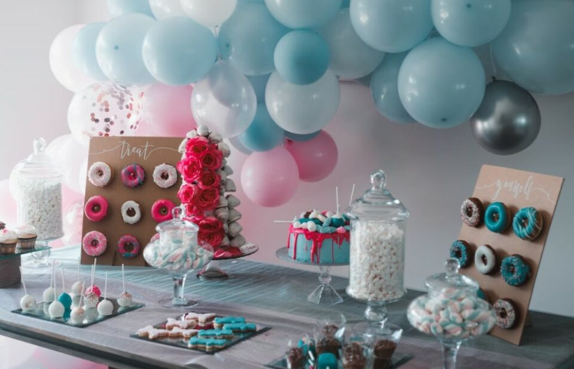
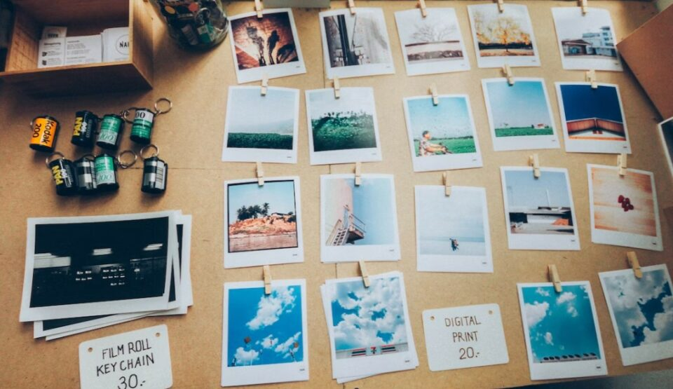
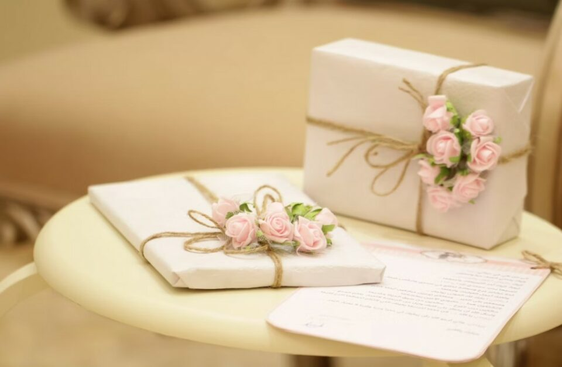
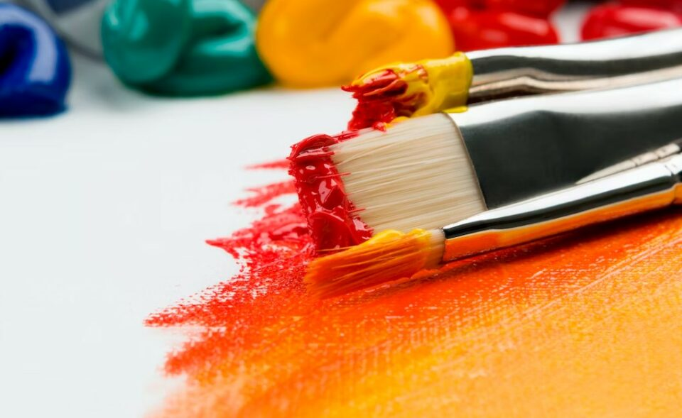
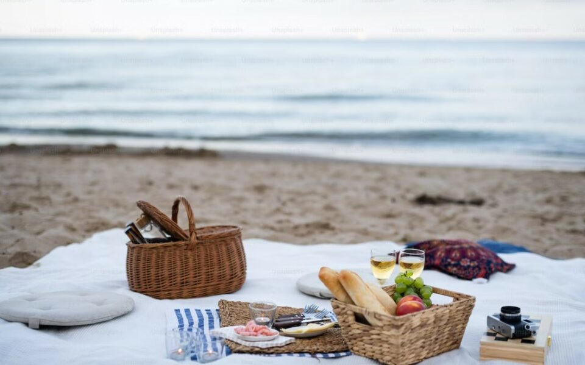
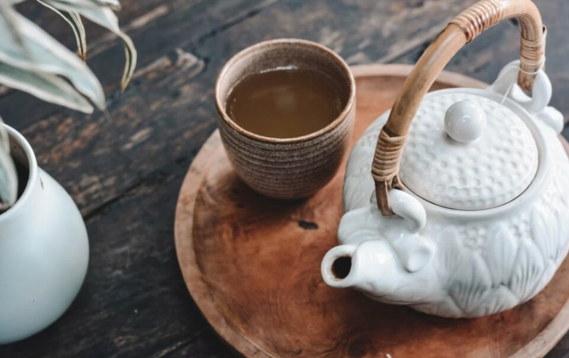
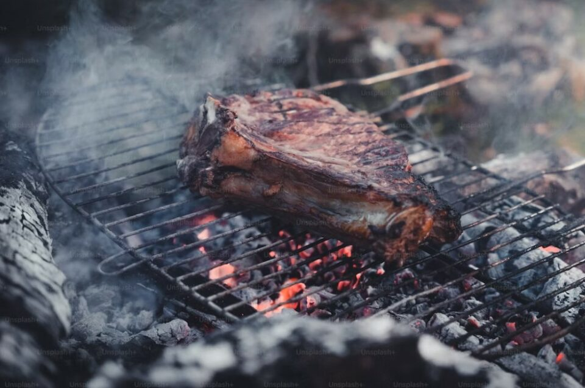

This article has been written and researched by our expert Loveable through a precise methodology. [Learn more about our methodology](https://avada.io/loveable/our-methodological.html)

[Loveable](https://avada.io/loveable/) > [Blog](https://avada.io/loveable/blog/) > [Family](https://avada.io/loveable/family/)

# 18 Best 60th Birthday Ideas to Make the Milestone Truly Remarkable (2023)

Written by [Rose Bryne](https://avada.io/loveable/author/rose/) Last Updated on August 29, 2023

- [18 Best 60th Birthday Ideas To Celebrate Special Occasions](https://avada.io/loveable/blog/60th-birthday-ideas/#wp-block-heading-2-4)
    - [1\. Throw a Surprise Party](https://avada.io/loveable/blog/60th-birthday-ideas/#wp-block-heading-3-5)
    - [2\. Plan a Meaningful Trip or Vacation](https://avada.io/loveable/blog/60th-birthday-ideas/#wp-block-heading-3-8)
    - [3\. Host a Themed Party](https://avada.io/loveable/blog/60th-birthday-ideas/#wp-block-heading-3-12)
    - [4\. Arrange a Personalized Photo or Video Montage](https://avada.io/loveable/blog/60th-birthday-ideas/#wp-block-heading-3-15)
    - [5\. Organize a Meaningful Gift Exchange](https://avada.io/loveable/blog/60th-birthday-ideas/#wp-block-heading-3-18)
    - [6\. Arrange a Special Live Performance or Entertainment](https://avada.io/loveable/blog/60th-birthday-ideas/#wp-block-heading-3-22)
    - [7\. Reflect on Life’s Achievements and Share Memories](https://avada.io/loveable/blog/60th-birthday-ideas/#wp-block-heading-3-25)
    - [8\. Bring Out Your Inner Artist With Some Art Activities](https://avada.io/loveable/blog/60th-birthday-ideas/#wp-block-heading-3-28)
    - [9\. Foodie 60th Birthday Party Ideas](https://avada.io/loveable/blog/60th-birthday-ideas/#wp-block-heading-3-32)
    - [10\. Have a Picnic: 60th Celebration Ideas With Family](https://avada.io/loveable/blog/60th-birthday-ideas/#wp-block-heading-3-42) 
    - [11\. Uncommon 60th Celebration Idea: Take a Cruise](https://avada.io/loveable/blog/60th-birthday-ideas/#wp-block-heading-3-46)
    - [12\. Easy 60th Celebration Idea: Garden Tea](https://avada.io/loveable/blog/60th-birthday-ideas/#wp-block-heading-3-49)
    - [13\. Host a Movie Night for Old People](https://avada.io/loveable/blog/60th-birthday-ideas/#wp-block-heading-3-52) 
    - [14\. Lawn Games and Barbecue](https://avada.io/loveable/blog/60th-birthday-ideas/#wp-block-heading-3-55)
    - [15\. Relax at the Spa – 60th Celebration Idea for Women](https://avada.io/loveable/blog/60th-birthday-ideas/#wp-block-heading-3-59) 
    - [16\. Games And Outdoor Ideas For the 60th CelebrationCelebration](https://avada.io/loveable/blog/60th-birthday-ideas/#wp-block-heading-3-61) 
    - [17\. Take a Food Tour](https://avada.io/loveable/blog/60th-birthday-ideas/#wp-block-heading-3-71) 
    - [18\. Formal 60th Celebration Idea: Dinner Party](https://avada.io/loveable/blog/60th-birthday-ideas/#wp-block-heading-3-74)
- [60th Birthday Party Planning Tips](https://avada.io/loveable/blog/60th-birthday-ideas/#wp-block-heading-2-78)
- [60th Birthday Ideas, In Conclusion](https://avada.io/loveable/blog/60th-birthday-ideas/#wp-block-heading-2-92) 

Are you looking for exciting **60th birthday ideas** to celebrate this milestone in style? Turning 60 is a significant occasion that deserves a memorable celebration. Whether it’s for yourself, a family member, or a dear friend, finding the perfect way to mark this special day can be exciting and challenging. Don’t worry, though! We’ve got you covered with an array of creative and unforgettable 60th-birthday ideas that will make this milestone truly exceptional.

In this article, we’ll explore a variety of unique and meaningful ways to celebrate a 60th birthday. From intimate gatherings with close friends and family to adventurous trips to exotic destinations, we’ll provide you with inspiring ideas to suit different preferences and budgets. Whether you’re looking for something low-key or grand, sentimental or adventurous, you’ll find plenty of options to make this milestone birthday a [cherished memory](https://avada.io/loveable/memory-gifts/) for years to come.

In addition to the heartfelt and meaningful birthday celebration ideas, we can’t forget the element of fun! If you’re looking to add a touch of humor to the 60th birthday festivities, we’ve curated a hilarious collection of gifts that are sure to bring a smile to the birthday honoree’s face. From witty t-shirts and quirky mugs to playful gag gifts, this collection is bound to have something that will tickle their funny bone. So, be sure to check out our [funny 60th gift collection](https://avada.io/loveable/funny-60th-birthday-gifts/) and add an extra dose of laughter to the Celebration!

## **18 Best 60th Birthday Ideas To Celebrate Special Occasions**

### **1\. Throw a Surprise Party**

Surprise parties are always a hit, and they add an extra element of excitement and joy to any celebration. Choose a suitable venue, whether it’s a favorite restaurant, a rented event space, or even the comfort of home. Invite close friends and family members who have played a significant role in the celebrant’s life. To make it truly memorable, incorporate meaningful surprises and gestures, such as inviting long-lost friends or arranging a special performance that holds sentimental value.

### **2\. Plan a Meaningful Trip or Vacation**

A milestone birthday is an excellent opportunity to embark on a special journey. Consider the celebrant’s interests and preferences when selecting a destination. It could be a dream vacation spot, a place connected to their heritage, or simply a location they have always wanted to visit.

Organize travel arrangements and accommodations, ensuring every detail is taken care of. Create memorable experiences and activities throughout the trip, such as visiting landmarks, indulging in local cuisine, or engaging in meaningful cultural activities.

### **3\. Host a Themed Party**

Themed parties are a fantastic way to add fun and creativity to a 60th birthday celebration. Choose a theme that resonates with the celebrant’s interests or hobbies. It could be a decade-themed party, a favorite movie or book theme, or a celebration of a passion they’ve cultivated over the years.

Decorate the venue accordingly, incorporating elements that reflect the chosen theme. Encourage guests to dress up and participate in themed activities, making the CelebrationCelebration lively and engaging.

### **4\. Arrange a Personalized Photo or Video Montage**

A personalized photo or video montage is a heartfelt way to celebrate a lifetime of memories. Gather photos and videos from different stages of the celebrant’s life, including childhood, career achievements, and memorable moments. Create a visually appealing montage that tells a story and captures the essence of their journey. Present it during the CelebrationCelebration as a nostalgic tribute, evoking emotions and fostering a sense of appreciation for the life lived.

### **5\. Organize a Meaningful Gift Exchange**

Gifts are an integral part of any birthday celebration. For a [60th birthday](https://avada.io/loveable/60th-birthday-gifts/), encourage guests to bring thoughtful and personalized gifts that reflect the celebrant’s interests, hobbies, or aspirations.

Consider organizing a gift exchange activity or game that adds an element of surprise and joy to the occasion. This creates an opportunity for loved ones to express their love and appreciation through meaningful presents.

### **6\. Arrange a Special Live Performance or Entertainment**

Live performances or entertainment can elevate the CelebrationCelebration and create an unforgettable experience. Consider hiring a live band, musician, or performer based on the celebrant’s musical preferences or entertainment taste. Ensure that the entertainment aligns with their style and resonates with their personality. This addition will create a lively atmosphere, encouraging guests to dance, sing along, and celebrate the milestone with enthusiasm.

### **7\. Reflect on Life’s Achievements and Share Memories**

A 60th birthday celebration is a perfect time to reflect on life’s achievements and share treasured memories. Allocate time for speeches or toasts, where loved ones can express their heartfelt messages and share favorite memories with the celebrant.

Encourage guests to prepare meaningful anecdotes or stories that capture the essence of their relationship and the impact the celebrant has had on their lives. This reflection will create an emotional and meaningful experience, emphasizing the significance of the milestone.

### **8\. Bring Out Your Inner Artist With Some Art Activities**

Add a creative twist to your 60th birthday celebration with art activities that will inspire and entertain your guests. Set up an art station where everyone can unleash their inner artist and create unique masterpieces. Provide a variety of art supplies such as canvases, paints, brushes, and sketchbooks, allowing guests to explore their creativity. Consider hiring a professional art instructor to lead a painting class or provide guidance on different art techniques.

Whether it’s creating personalized paintings, collages, or even pottery, these art activities will not only provide an enjoyable experience but also leave guests with meaningful and personalized keepsakes from the CelebrationCelebration.

### **9\. Foodie 60th Birthday Party Ideas**

Celebrate the foodie in your life’s 60th birthday with a mouthwatering feast and culinary delights that will tantalize their taste buds. Here are some delectable ideas to make their birthday party a gastronomic celebration to remember

- Create a custom menu featuring their favorite dishes, incorporating a variety of flavors and cuisines.
- Arrange a cooking demonstration or workshop with a renowned chef to provide an interactive and educational experience.
- Set up a food-tasting station with a selection of gourmet cheeses, charcuterie, and artisanal bread.
- Think about hiring a private chef to prepare a multi-course gourmet dinner tailored to their preferences.
- Organize a wine or craft beer tasting, pairing different varietals or brews with complementary food items.
- Personalize the CelebrationCelebration by incorporating their favorite desserts, such as a custom cake or a dessert table filled with delectable treats.
- Consider organizing a food-themed trivia or cooking competition to add a touch of fun and engaging element to the party.

With these foodie-inspired birthday party ideas, you’ll create a culinary experience that will leave your loved one and guests savoring every moment.

### **10\. Have a Picnic: 60th Celebration Ideas With Family** 

Gather your loved ones and celebrate the 60th milestone with a delightful picnic that brings everyone together in a relaxed and scenic setting. Choose a picturesque outdoor location, such as a park, garden, or beach, where you can spread out blankets and set up a charming picnic spread. 

Prepare a delicious assortment of picnic-friendly foods, including sandwiches, salads, finger foods, and refreshing beverages. Encourage family members to bring their favorite dishes or contribute to a potluck-style picnic, adding a personal touch to the Celebration. Engage in fun activities like outdoor games, storytelling, or sharing family memories.

### **11\. Uncommon 60th Celebration Idea: Take a Cruise**

For a truly unique and unforgettable 60th celebration, consider [taking a cruise](https://avada.io/loveable/gifts-boaters/) to create lasting memories with your loved ones. Embark on a maritime adventure where you can indulge in luxurious amenities and explore fascinating destinations. Choose a cruise itinerary that appeals to the celebrant’s interests, whether it’s a tropical getaway, an exotic cultural expedition, or a scenic voyage along picturesque coastlines. 

On board, the cruise ship, enjoy a wide range of activities and entertainment options, including fine dining experiences, live performances, spa treatments, and relaxing by the pool. With breathtaking views of the open sea and the opportunity to bond with family and friends in a luxurious setting, a cruise offers a unique way to commemorate the 60th milestone in style.

### **12\. Easy 60th Celebration Idea: Garden Tea**

Celebrate the classy 60th birthday with a charming garden tea party. Indulge in the beauty of a serene garden setting while savoring delicious treats and exquisite teas served on delicate china. Encourage guests to dress in tea attire, whether it’s a casual or more formal style. This delightful gathering can be a perfect day spent with friends or a delightful surprise for Mom or Grandma on their special day.

### **13\. Host a Movie Night for Old People** 

Movie enthusiasts will adore celebrating their 60th birthday with a delightful movie night. You can enjoy a cozy movie marathon at home, complete with all the classic movie snacks and your favorite films in the queue.

If you’re feeling adventurous, consider going all out and renting a movie theater for a grand cinematic experience, where you can relish watching a selection of films on the big screen. Whichever option you choose, the joy of immersing yourself in movies will make this birthday celebration truly memorable.

### **14\. Lawn Games and Barbecue**

Celebrate the 60th birthday with a fun-filled day of lawn games and a delightful barbecue that will bring family and friends together. Set up an outdoor space with a variety of lawn games such as croquet, bocce ball, cornhole, or ladder toss, providing endless entertainment and friendly competition. Fire up the grill and prepare a delicious spread of barbecue favorites, including juicy burgers, marinated meats, grilled vegetables, and flavorful side dishes. Create a relaxed and inviting atmosphere with picnic tables, cozy seating, and festive decorations. 

This casual and enjoyable CelebrationCelebration is the perfect way to honor the milestone and create lasting memories while enjoying great company, delicious food, and friendly games under the sun.

### **15\. Relax at the Spa – 60th Celebration Idea for Women** 

Looking for ideas to celebrate a woman’s 60th birthday? How about [treating her to a blissful day](https://avada.io/loveable/pampering-gifts-women/) at the spa? Book a day of pampering with a range of treatments, from facials to massages to wraps, ensuring she leaves feeling refreshed and rejuvenated. It’s a thoughtful and practical experience gift that allows her to spend quality time with her loved ones, such as her daughters, sisters, and friends. Indulge in a day of relaxation, bonding, and self-care, making her birthday extra special and memorable.

### **16\. Games And Outdoor Ideas For the 60th CelebrationCelebration** 

Get ready for a lively and enjoyable 60th birthday celebration by gathering everyone together for a day of games and [outdoor activities](https://avada.io/loveable/gifts-outdoorsmen/). Create a festive atmosphere where family and friends can bond and create lasting memories. Here are some ideas to make the gathering even more entertaining:

- Set up a variety of classic outdoor games such as bocce ball, croquet, or horseshoes.
- Organize friendly competitions like a three-legged race, sack race, or tug-of-war.
- Create a game station with board games, card games, or trivia quizzes for those who prefer indoor activities.
- Arrange a scavenger hunt or treasure hunt that challenges everyone’s problem-solving skills.
- Have a karaoke session or a dance-off to get everyone up and moving.
- Provide prizes or small gifts for winners to add an extra element of excitement and friendly competition.

With these game-focused ideas, your 60th birthday celebration will be filled with laughter, camaraderie, and a whole lot of fun.

### **17\. Take a Food Tour** 

Embark on a mouthwatering adventure and explore the flavors of the world with this exciting 60th birthday party idea. Take your taste buds on a culinary journey as you indulge in a variety of incredible cuisines from around the globe. Treat yourself and your guests to a wide range selection of dishes from different cultures, such as Brazilian, Lebanese, Thai, and more, sourced from local restaurants. 

With each bite, you’ll feel like you’ve traveled to every continent, savoring the authentic flavors and experiencing the richness of international cuisine. So, call your loved ones and prepare for a gastronomic celebration that will leave you craving more culinary delights from around the world.

### **18\. Formal 60th Celebration Idea: Dinner Party**

Celebrate your 60th birthday in style with a formal dinner party that exudes elegance and sophistication. Choose a fancy venue, like a private dining room or a nice restaurant, to create the perfect setting for your special occasion. Prepare a delectable menu featuring gourmet dishes and mouthwatering desserts that will impress your esteemed guests. Decorate the tables with fancy china, shiny silverware, and beautiful centerpieces to create a luxurious atmosphere. 

Don’t forget to ask your guests to dress up in their finest attire for an evening of delightful conversation and indulgence. A formal dinner party will make your milestone celebration truly unforgettable, leaving everyone with wonderful memories of a glamorous and sophisticated affair.

## **60th Birthday Party Planning Tips**

Planning a 60th birthday party? Here are some helpful tips to ensure a successful and memorable celebration:

- **Start Early:** Begin the party planning process well in advance to allow ample time for preparations and to secure the desired venue or services.
- **Set a Budget:** Determine a realistic budget and allocate funds accordingly for venue, decorations, food, entertainment, and any other necessary expenses.
- **Choose a Theme:** Consider selecting a theme that reflects the celebrant’s interests or preferences, which can guide the overall party planning process and add a fun element to the CelebrationCelebration.
- **Guest List and Invitations:** Create a guest list and send out invitations well in advance, providing RSVP details and any specific instructions if needed.
- **Venue Selection:** Decide whether to host the party at home, a rented venue, or a restaurant, taking into account the number of guests and the desired atmosphere.
- **Menu Planning:** Plan the menu based on the chosen theme, catering to different dietary preferences and ensuring a variety of delicious food options for guests to enjoy.
- **Decorations:** Set the mood with appropriate decorations that align with the chosen theme, including balloons, banners, table centerpieces, and personalized touches.
- **Entertainment:** Arrange entertainment that suits the celebrant’s tastes, such as live music, a DJ, or hiring a professional entertainer to ensure a lively and enjoyable atmosphere.
- **Special Moments:** Incorporate personalized elements into the party, such as a slideshow of cherished memories, a speech or toast, or a surprise guest appearance.
- **Party Favors:** Consider providing small tokens of appreciation for guests to take home, such as personalized keepsakes or themed party favors.
- **Create a Timeline**: Plan a schedule for the party, outlining key activities and allowing enough time for socializing, eating entertainment, and any planned speeches or surprises.

Capture the Memories: Arrange for a photographer or designate someone to capture photos and videos throughout the CelebrationCelebration, ensuring that the special moments are preserved.

## **60th Birthday Ideas, In Conclusion** 

Turning 60 is a milestone worth celebrating in a remarkable way. By incorporating these unforgettable **60th birthday ideas**, you can create a personalized and memorable experience for your loved ones. Whether it’s through a surprise party, a meaningful trip, a themed celebration, or other creative elements, the goal is to honor the celebrant’s life, achievements, and the impact they have had on those around them. Make this milestone a truly remarkable and unforgettable celebration to cherish for years to come.

- [18 Best 60th Birthday Ideas To Celebrate Special Occasions](https://avada.io/loveable/blog/60th-birthday-ideas/#wp-block-heading-2-4)
    - [1\. Throw a Surprise Party](https://avada.io/loveable/blog/60th-birthday-ideas/#wp-block-heading-3-5)
    - [2\. Plan a Meaningful Trip or Vacation](https://avada.io/loveable/blog/60th-birthday-ideas/#wp-block-heading-3-8)
    - [3\. Host a Themed Party](https://avada.io/loveable/blog/60th-birthday-ideas/#wp-block-heading-3-12)
    - [4\. Arrange a Personalized Photo or Video Montage](https://avada.io/loveable/blog/60th-birthday-ideas/#wp-block-heading-3-15)
    - [5\. Organize a Meaningful Gift Exchange](https://avada.io/loveable/blog/60th-birthday-ideas/#wp-block-heading-3-18)
    - [6\. Arrange a Special Live Performance or Entertainment](https://avada.io/loveable/blog/60th-birthday-ideas/#wp-block-heading-3-22)
    - [7\. Reflect on Life’s Achievements and Share Memories](https://avada.io/loveable/blog/60th-birthday-ideas/#wp-block-heading-3-25)
    - [8\. Bring Out Your Inner Artist With Some Art Activities](https://avada.io/loveable/blog/60th-birthday-ideas/#wp-block-heading-3-28)
    - [9\. Foodie 60th Birthday Party Ideas](https://avada.io/loveable/blog/60th-birthday-ideas/#wp-block-heading-3-32)
    - [10\. Have a Picnic: 60th Celebration Ideas With Family](https://avada.io/loveable/blog/60th-birthday-ideas/#wp-block-heading-3-42) 
    - [11\. Uncommon 60th Celebration Idea: Take a Cruise](https://avada.io/loveable/blog/60th-birthday-ideas/#wp-block-heading-3-46)
    - [12\. Easy 60th Celebration Idea: Garden Tea](https://avada.io/loveable/blog/60th-birthday-ideas/#wp-block-heading-3-49)
    - [13\. Host a Movie Night for Old People](https://avada.io/loveable/blog/60th-birthday-ideas/#wp-block-heading-3-52) 
    - [14\. Lawn Games and Barbecue](https://avada.io/loveable/blog/60th-birthday-ideas/#wp-block-heading-3-55)
    - [15\. Relax at the Spa – 60th Celebration Idea for Women](https://avada.io/loveable/blog/60th-birthday-ideas/#wp-block-heading-3-59) 
    - [16\. Games And Outdoor Ideas For the 60th CelebrationCelebration](https://avada.io/loveable/blog/60th-birthday-ideas/#wp-block-heading-3-61) 
    - [17\. Take a Food Tour](https://avada.io/loveable/blog/60th-birthday-ideas/#wp-block-heading-3-71) 
    - [18\. Formal 60th Celebration Idea: Dinner Party](https://avada.io/loveable/blog/60th-birthday-ideas/#wp-block-heading-3-74)
- [60th Birthday Party Planning Tips](https://avada.io/loveable/blog/60th-birthday-ideas/#wp-block-heading-2-78)
- [60th Birthday Ideas, In Conclusion](https://avada.io/loveable/blog/60th-birthday-ideas/#wp-block-heading-2-92) 

### [Rose Bryne](https://avada.io/loveable/author/rose/)

Hi, I'm Rose! I love animals and spending time with kids. At Loveable, I help people find unique gifts for special occasions like Valentine's Day, housewarmings, and graduations. I enjoy finding gifts for kids, teens, and animal lovers that match their interests and personalities. Making gift-giving a pleasant experience is my priority. Let me assist you in finding the perfect gift!

- [Twitter](https://twitter.com/intent/tweet)
- [Facebook](https://www.facebook.com/sharer/sharer.php)
- [instagram](https://avada.io/loveable/blog/60th-birthday-ideas/)
- [pinterest](https://www.pinterest.com/loveablellc/)

## Related Posts

[### 30 Best 4 Year Old Birthday Party Ideas For A Memorable Celebration](https://avada.io/loveable/blog/4-year-old-birthday-party-ideas/) 

[

### 16th Birthday Party Ideas to Make an Unforgettable Day

](https://avada.io/loveable/blog/16th-birthday-party-ideas/)

[

### 150+ Inspirational Birthday Quotes to Spread Joy on Special Day

](https://avada.io/loveable/blog/inspirational-birthday-quotes/)

[

### 160+ Birthday Wishes for Wife to Express Eternal Love

](https://avada.io/loveable/blog/birthday-wishes-for-wife/)

[### 90+ Heart Touching Birthday Wishes for Niece to Make Her Day Extra Special](https://avada.io/loveable/blog/birthday-wishes-for-niece/)
