This article has been written and researched by our expert Loveable through a precise methodology. [Learn more about our methodology](https://avada.io/loveable/our-methodological.html)

[Loveable](https://avada.io/loveable/) > [Blog](https://avada.io/loveable/blog/) > [Holiday](https://avada.io/loveable/holiday/)

# 18 Easy Draw Halloween for Kids and Beginners in 2023

Written by [Blake Simpson](https://avada.io/loveable/author/blake/) Last Updated on September 18, 2023

- [18 Typical Easy Draw Halloween Characters to Make](https://avada.io/loveable/blog/easy-draw-halloween/#wp-block-heading-2-4)
    - [1\. Bat](https://avada.io/loveable/blog/easy-draw-halloween/#wp-block-heading-3-5)
    - [2\. Zombie](https://avada.io/loveable/blog/easy-draw-halloween/#wp-block-heading-3-10)
    - [3\. Tombstone](https://avada.io/loveable/blog/easy-draw-halloween/#wp-block-heading-3-15)
    - [4\. Skull](https://avada.io/loveable/blog/easy-draw-halloween/#wp-block-heading-3-20)
    - [5\. Vampire](https://avada.io/loveable/blog/easy-draw-halloween/#wp-block-heading-3-25)
    - [6\. Halloween Houses](https://avada.io/loveable/blog/easy-draw-halloween/#wp-block-heading-3-30)
    - [7\. Mummy](https://avada.io/loveable/blog/easy-draw-halloween/#wp-block-heading-3-35)
    - [8\. Owl](https://avada.io/loveable/blog/easy-draw-halloween/#wp-block-heading-3-40)
    - [9\. Witch](https://avada.io/loveable/blog/easy-draw-halloween/#wp-block-heading-3-45)
    - [10\. Clown](https://avada.io/loveable/blog/easy-draw-halloween/#wp-block-heading-3-50)
    - [11\. Cauldron](https://avada.io/loveable/blog/easy-draw-halloween/#wp-block-heading-3-55)
    - [12\. Cat](https://avada.io/loveable/blog/easy-draw-halloween/#wp-block-heading-3-60)
    - [13\. Jack O’Lantern](https://avada.io/loveable/blog/easy-draw-halloween/#wp-block-heading-3-64)
    - [14\. Halloween Wreath](https://avada.io/loveable/blog/easy-draw-halloween/#wp-block-heading-3-69)
    - [15\. Spider](https://avada.io/loveable/blog/easy-draw-halloween/#wp-block-heading-3-74)
    - [16\. Ghost](https://avada.io/loveable/blog/easy-draw-halloween/#wp-block-heading-3-79)
    - [17\. Candy Corn](https://avada.io/loveable/blog/easy-draw-halloween/#wp-block-heading-3-84)
    - [18\. Witch’s Broom](https://avada.io/loveable/blog/easy-draw-halloween/#wp-block-heading-3-89)
- [Incorporating Color: Coloring Tips for Halloween Drawings](https://avada.io/loveable/blog/easy-draw-halloween/#wp-block-heading-2-95)
    - [1\. Offer suggestions for color palettes that evoke a Halloween atmosphere](https://avada.io/loveable/blog/easy-draw-halloween/#wp-block-heading-3-96)
    - [2\. Share basic coloring techniques to enhance the drawings](https://avada.io/loveable/blog/easy-draw-halloween/#wp-block-heading-3-99)
    - [3\. Encourage experimentation and creativity with color choices](https://avada.io/loveable/blog/easy-draw-halloween/#wp-block-heading-3-102)
- [In Conclusion,](https://avada.io/loveable/blog/easy-draw-halloween/#wp-block-heading-2-107)

Halloween, the spooky and fun-filled holiday, is just around the corner, and what better way to celebrate than by unleashing your [inner artist](https://avada.io/loveable/gifts-for-art-lovers/)? If you’re looking to get into the Halloween spirit and explore your creativity, these easy draw Halloween ideas are here to guide you through the process of drawing typical Halloween characters with ease. 

From friendly ghosts and grinning jack-o’-lanterns to wicked witches and eerie bats, this beginner-friendly guide offers step-by-step instructions to bring these [iconic Halloween characters](https://avada.io/loveable/blog/famous-halloween-cartoon-characters/) to life on paper. Whether you’re a seasoned artist or a complete novice, get ready to dive into the world of Halloween-inspired drawing and create captivating artworks that capture the essence of this thrilling holiday. 

So grab your pencils and let your imagination run wild as we embark on a journey of artistic Halloween delights!

## **18 Typical Easy Draw Halloween Characters to Make**

### **1\. Bat**

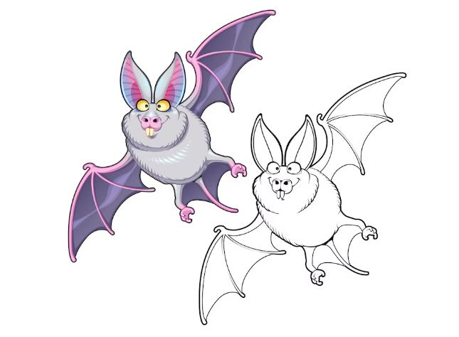

The bat is an excellent choice for an easy-draw Halloween idea. It’s distinctive silhouette, and recognizable features make it an ideal subject for beginners. With its simple shape and few key details, drawing a bat allows you to practice basic lines, curves, and proportions.

The bat’s body is often depicted as an elongated oval or teardrop shape, making it straightforward to sketch. Its wings can be represented by curved lines extending from the body’s sides, giving it a recognizable and spooky appearance. Adding small triangular ears and pointy fangs can further enhance its Halloween charm.

[Get the detailed guideline!](https://www.instagram.com/p/B37-cBLhg4P/?epik=dj0yJnU9VTh3UXhMS1hwQUVicV9WUDRaUnVaUGo1SW5FbXVMTC0mcD0wJm49c1YycFFoWmVlZVBfd1FCaUdVaGoxdyZ0PUFBQUFBR0ZJN0o0)

### **2\. Zombie**

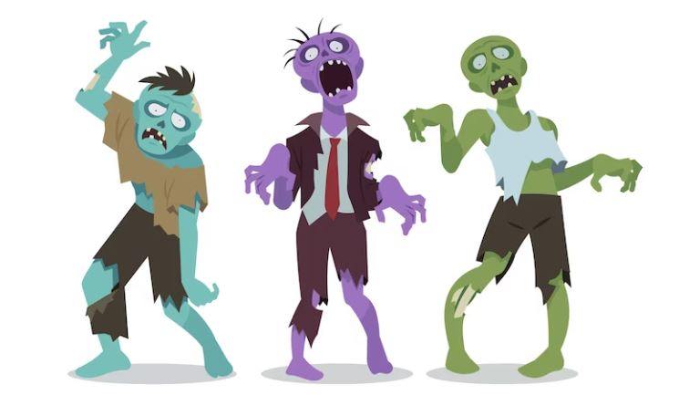

Drawing a [zombie for Halloween](https://avada.io/loveable/zombie-gifts/) is a fantastic way to embrace the eerie and undead spirit of the holiday. With its decomposed appearance and characteristic features, the zombie offers a fun and engaging subject for your drawing endeavors.

To start, sketch the basic shape of the zombie’s head, typically depicted as a rough oval or a distorted circle. Add exaggerated facial features, such as sunken eyes, jagged teeth, and exposed bones, to give your zombie a truly haunting look. Remember, imperfections and asymmetry are key to capturing the undead essence.

[Get the detailed guideline!](https://www.pinterest.ca/pin/267119821638275989/)

### **3\. Tombstone**

Drawing a tombstone for Halloween is a captivating way to capture the eerie essence of the holiday. With its iconic shape and mysterious aura, a tombstone makes for an intriguing subject that instantly sets the stage for a haunting scene.

To begin, sketch the outline of the tombstone using straight lines to form a rectangular or trapezoidal shape. You can add decorative details like curved or scalloped edges to give it a more ornate look. Remember that tombstones come in various styles, so you have the freedom to customize their design.

[Get the detailed guideline!](https://easydrawingguides.com/how-to-draw-a-tombstone/)

### **4\. Skull**

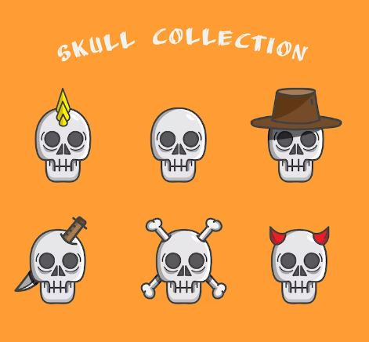

With its distinct shape and eerie vibe, a skull makes for a striking subject that embodies the spirit of the holiday. To get started, sketch the basic outline of the skull using a rounded shape for the cranium and a narrower shape for the jawline. Pay attention to the proportions and angles to capture the skull’s characteristic features accurately.

You can further enhance the skull’s macabre charm by adding details like teeth or cracks on the bone. Experiment with different tooth shapes and sizes, and feel free to make them jagged or irregular for a more sinister effect. Cracks and weathering can be added strategically to give the skull an aged and worn look.

[Get the detailed guideline!](https://easydrawingguides.com/how-to-draw-a-skull-in-3-4-view/)

### **5\. Vampire**

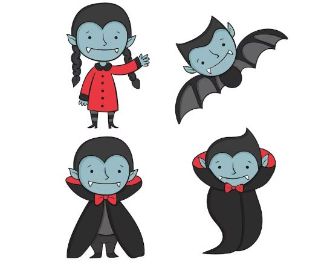

Drawing a vampire for Halloween exudes a captivating aura of darkness and mystery. Capture their alluring yet chilling essence by sketching their sharp facial features, including fangs, intense eyes, and a sleek hairstyle. 

Add a dramatic cloak and a touch of pale skin, accentuating their undead nature. Let your imagination run wild and create a creature embodying these nocturnal beings’ eerie allure.

[Get the detailed guideline!](https://www.how-to-draw-funny-cartoons.com/vampire-pictures.html)

### **6\. Halloween Houses**

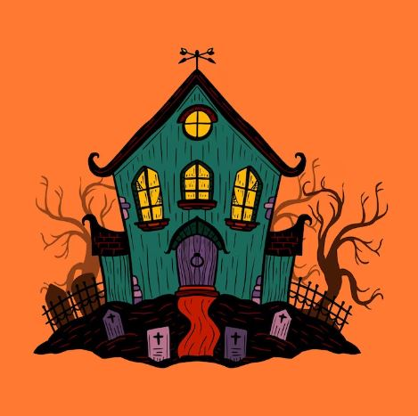

One of the most delightful aspects of Halloween is taking a leisurely stroll through the neighborhood, marveling at the breathtaking array of decorations adorning the homes of your neighbors. However, if you’re searching for a captivating and Halloween-themed artistic endeavor, why not unleash your creativity and bring your very own Halloween scene to life on paper? 

Immerse yourself in the spooky spirit by conjuring a chilling landscape, complete with haunting creatures, eerie moonlit skies, and intricately carved jack-o’-lanterns. Let your imagination run wild as you craft a scene that captures the essence of this bewitching holiday, showcasing your artistic talent and spreading the Halloween cheer.

[Get the detailed guideline!](https://www.drawinghowtodraw.com/stepbystepdrawinglessons/2016/09/draw-halloween-trick-treating-scene-word-word-toons-easy-drawing-tutorial-kids/)

### **7\. Mummy**

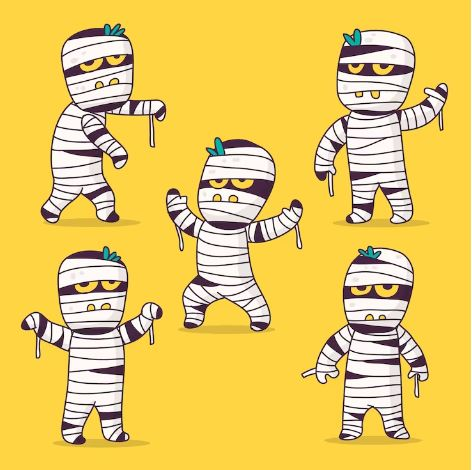

Mummies, once a popular choice for [Halloween costumes](https://avada.io/loveable/halloween-costume-ideas/), seem to have lost their association with the holiday over time. It’s a pity because mummies have always been an incredibly enjoyable and exciting option for Halloween attire. 

The mystique and allure of a wrapped figure from ancient times can create a captivating and spooky presence at any Halloween gathering. 

[Get the detailed guideline!](https://www.youtube.com/watch?app=desktop&v=wmaxSXVMDg0&feature=share)

### **8\. Owl**

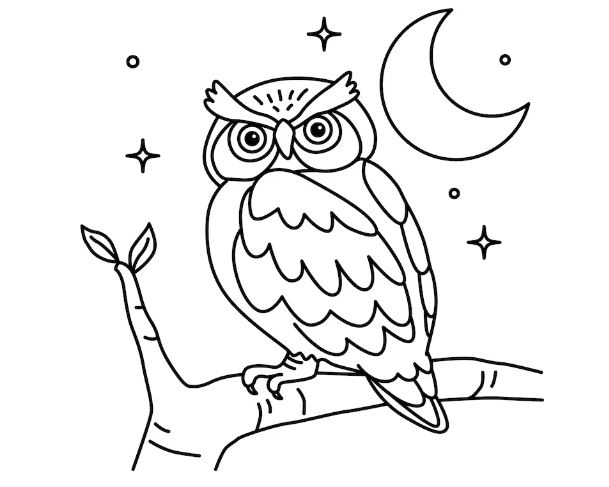

These birds are often associated with Halloween due to their nocturnal nature and eerie hoots, providing a fantastic subject for an easy Halloween drawing. This cartoon owl, however, defies the spooky stereotype and embraces adorable charm. With its endearing features and irresistible cuteness, it’s as delightful as a little button. 

So, grab your art supplies and follow the simple steps to bring this easy draw Halloween owl to life on paper. Let’s celebrate the whimsical side of Halloween with this charming and approachable drawing.

[Get the detailed guideline!](https://www.easylinedrawing.com/how-to-draw-an-owl-step-by-step/)

### **9\. Witch**

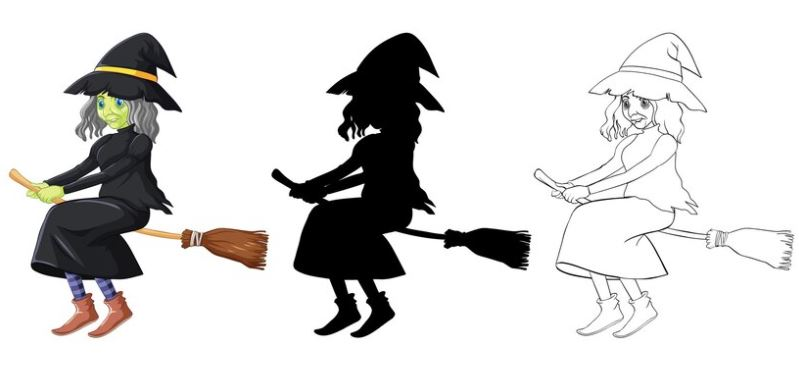

This feature reigns as one of the all-time favorite Halloween costume choices. It’s hard to find someone who hasn’t donned the witch’s garb at least once in their lifetime during Halloween festivities. 

With their iconic pointed hats, flowing robes, and broomsticks, witches epitomize the enchanting and mystical spirit of the holiday. Whether casting spells or riding through the night sky, witches have captured our imaginations and become a timeless symbol of Halloween.

[Get the detailed guideline!](https://www.youtube.com/watch?v=AEwNxm9sAZI&ab_channel=DrawinGeek)

### **10\. Clown**

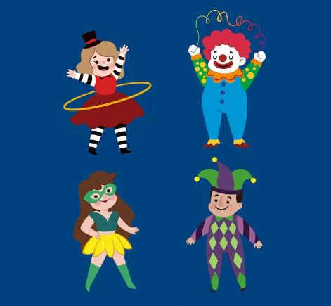

Their vibrant and exaggerated features make for a surprisingly enjoyable and easy-draw Halloween subject. Their distinctive appearance, characterized by colorful face paint, oversized shoes, and a comical costume, provides ample opportunity for creative expression.

To begin, sketch a basic oval shape for the clown’s head and add a large, round nose at the center. Draw two curving lines for the mouth, allowing for a cheerful or mischievous expression. Next, bring the clown to life by adding expressive eyes, whether big and exaggerated or adorned with exaggerated eyelashes.

[Get the detailed guideline!](https://learntodraw.today/2017/07/27/how-to-draw-a-clown-in-six-steps/)

### **11\. Cauldron**

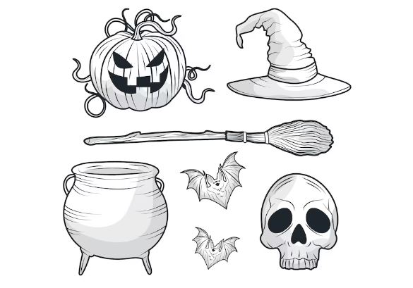

Drawing a cauldron for Halloween is an effortlessly enjoyable task. Its simple and iconic shape, resembling a large pot with a curved base and handle, makes it easy to recreate. 

Add a few wavy lines around the rim to depict bubbling liquid, and you’ll have a spooky cauldron ready to be filled with mysterious potions or treats. It’s a quick and fun way to infuse your Halloween artwork with a touch of witchy charm.

[Get the detailed guideline!](https://www.youtube.com/watch?v=QyNDELdFgXE&ab_channel=DoodleDrawArt)

### **12\. Cat**

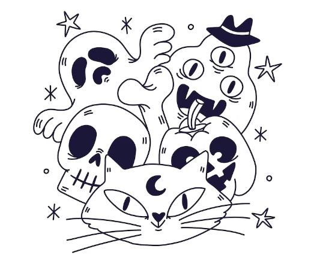

With its recognizable silhouette and unique features, a cat makes for a straightforward and iconic subject. Start by sketching a basic oval shape for the head, followed by two pointy ears on top. Draw slanted almond-shaped eyes, a small nose, and a smiling mouth to give the cat its friendly or mischievous expression. Complete the drawing by adding a long, curving tail and sleek body. 

[Get the detailed guideline!](https://diaryofajournalplanner.com/halloween-doodles/)

### **13\. Jack O’Lantern**

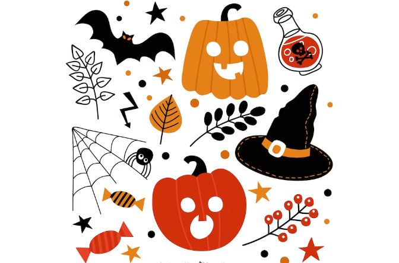

Curious about the distinction between a Jack O’Lantern and a pumpkin? We’re delighted you inquired. Although pumpkins can be [stylish Halloween decorations](https://avada.io/loveable/cool-halloween-decorations/) on their own, you can elevate your decor by transforming your pumpkin into a captivating Jack O’Lantern. 

Carving a Jack O’Lantern involves intricately cutting patterns, creating eerie faces, and placing a light source inside, resulting in a mesmerizing glow that adds an extra layer of enchantment to your Halloween ambiance. 

[Get the detailed guideline!](https://www.skiptomylou.org/jack-o-lantern-drawing/?utm_medium=social&utm_source=pinterest&utm_campaign=tailwind_tribes&utm_content=tribes&utm_term=876710832_37303248_199176)

### **14\. Halloween Wreath**

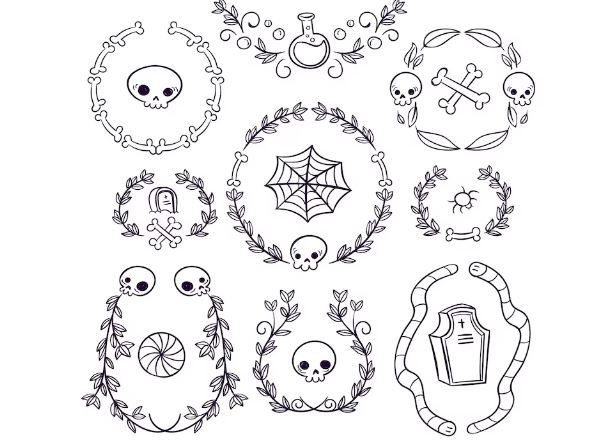

Why limit wreaths to Christmas when they can also shine as splendid decorations during the Halloween season? Embrace the versatility of wreaths and discover their charm in [autumn festivities](https://en.wikipedia.org/wiki/Category:Autumn_festivals). 

Whether you opt for a Halloween-specific design or a delightful fall-themed wreath, it can grace your door or wall from September through November, extending the spirit of the season well beyond Halloween.

[Get the detailed guideline!](https://www.youtube.com/watch?v=Uc1l1RRLpL8)

### **15\. Spider**

If you have a fear of spiders, you may prefer to avert your gaze for what follows. However, if you delight in the eerie essence of Halloween and have an affinity for creepy crawlies, then we have just the tutorial for you! 

Embrace the spine-chilling spirit of the season as we guide you through a step-by-step process to create a delightfully creepy masterpiece. Get ready to unleash your creativity and indulge in the thrilling side of Halloween with our tutorial designed for the bold and the fearless.

[Get the detailed guideline!](https://museprintables.com/download/how-to-draw/how-to-draw-a-black-widow-spider/)

### **16\. Ghost**

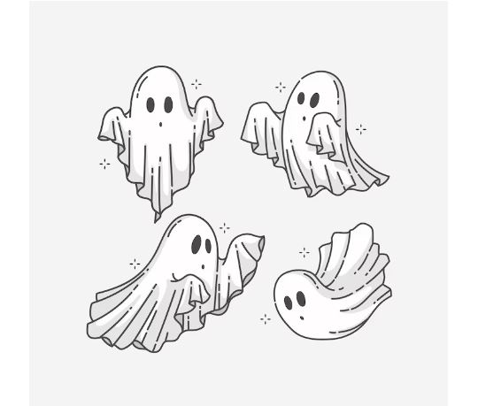

Whether they are friendly apparitions or not, ghosts hold a significant place in the realm of Halloween folklore. Therefore, it is no surprise that we anticipate your desire to create at least one spectral drawing this Halloween season. 

Embrace the ethereal charm and mystery as you put pencil to paper and bring forth a ghostly presence of your own. With a touch of imagination and a dash of artistic flair, conjure up a hauntingly beautiful or whimsically spooky ghost illustration to capture the essence of Halloween in your artwork.

[Get the detailed guideline!](https://discover.hubpages.com/art/How-to-draw-a-ghost)

### 17\. Candy Corn

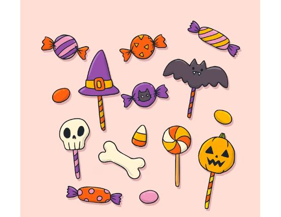

This corn is an ideal subject for an easy-draw Halloween. Its distinctive triangular shape and vibrant colors lend itself well to a simple and straightforward illustration.

Start by drawing three overlapping triangles, each representing a different color section. Add a small, curved line at the base of each section to create texture. Voila! You’ve captured the essence of this beloved Halloween treat in a delightful and uncomplicated drawing.

[Get the detailed guideline!](https://www.youtube.com/watch?v=CEnA8qxzLX0&ab_channel=ArtforKidsHub)

### **18\. Witch’s Broom**

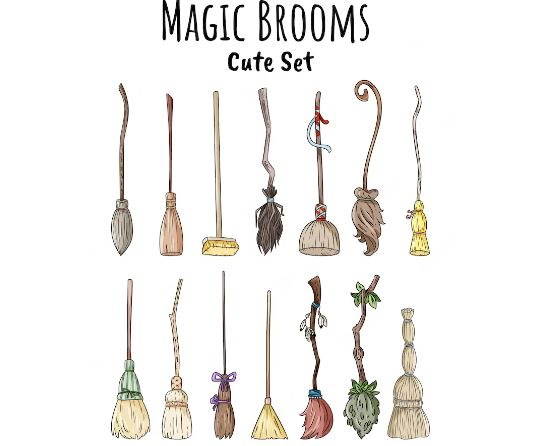

Drawing a witch’s broom for Halloween is a wonderfully simple and iconic subject. Start by sketching a long, straight handle in the shape of a wooden stick. Extend a few short, angled lines from the bottom to depict the bristle portion of the broom. Add texture and detail by drawing thin, wispy lines to represent individual bristles.

With just a few strokes, you can bring to life the quintessential accessory of a witch, adding a touch of enchantment to your Halloween drawings.

[Get the detailed guideline!](https://letsdrawthat.com/how-to-draw-a-broom/)

**_Check out_**: DIY [Halloween Door Decorations](https://avada.io/loveable/halloween-door-decorations/) that Evoke the Spooky Season

## **Incorporating Color: Coloring Tips for Halloween Drawings**

### **1\. Offer suggestions for color palettes that evoke a Halloween atmosphere**

When it comes to coloring easy-draw Halloween characters, consider using color palettes that evoke the mysterious and spooky atmosphere of the season. Opt for deep shades of purple, eerie greens, haunting blues, and fiery oranges. 

Black is a classic choice for outlining and adding depth. Play with contrasting colors to create a visually striking effect. Experiment with metallic or iridescent colors to add a touch of magic and intrigue.

### **2\. Share basic coloring techniques to enhance the drawings**

Basic coloring techniques can elevate your Halloween drawings. Start with flat coloring, where you fill the shapes with solid colors. Then, try shading to add dimension and depth. Use darker tones for areas that would be in shadow and lighter tones for highlights. 

Consider blending colors together smoothly or use cross-hatching for a textured look. Experiment with gradients, where colors transition from one shade to another. Don’t forget about adding details with fine lines or patterns.

### **3\. Encourage experimentation and creativity with color choices**

Halloween is a time to let your creativity run wild, so don’t be afraid to experiment with unconventional color choices. While traditional Halloween colors are popular, feel free to add your own twist. 

Explore unexpected color combinations that evoke a unique mood or theme. Maybe try a neon color scheme for a modern twist, or pastel hues for a whimsical touch. Let your imagination guide you and embrace the freedom to create your own vibrant and captivating Halloween world through color.

**_See More:_**

- Easy [Halloween Drawing Ideas](https://avada.io/loveable/blog/halloween-drawing-ideas/) for Kids and Beginners

## **In Conclusion,**

Exploring the world of easy-draw Halloween characters is a delightful and accessible creative endeavor. From bats and zombies to witches and ghosts, there are numerous iconic figures to bring to life on paper. With the tips and techniques shared, you can confidently embark on your artistic journey. 

Whether you’re a beginner or an experienced artist, the joy of capturing the spirit of Halloween in your drawings is boundless. So grab your pencils, let your imagination soar, and have a spooktacular time creating your very own Halloween masterpieces. Happy drawing!

- [18 Typical Easy Draw Halloween Characters to Make](https://avada.io/loveable/blog/easy-draw-halloween/#wp-block-heading-2-4)
    - [1\. Bat](https://avada.io/loveable/blog/easy-draw-halloween/#wp-block-heading-3-5)
    - [2\. Zombie](https://avada.io/loveable/blog/easy-draw-halloween/#wp-block-heading-3-10)
    - [3\. Tombstone](https://avada.io/loveable/blog/easy-draw-halloween/#wp-block-heading-3-15)
    - [4\. Skull](https://avada.io/loveable/blog/easy-draw-halloween/#wp-block-heading-3-20)
    - [5\. Vampire](https://avada.io/loveable/blog/easy-draw-halloween/#wp-block-heading-3-25)
    - [6\. Halloween Houses](https://avada.io/loveable/blog/easy-draw-halloween/#wp-block-heading-3-30)
    - [7\. Mummy](https://avada.io/loveable/blog/easy-draw-halloween/#wp-block-heading-3-35)
    - [8\. Owl](https://avada.io/loveable/blog/easy-draw-halloween/#wp-block-heading-3-40)
    - [9\. Witch](https://avada.io/loveable/blog/easy-draw-halloween/#wp-block-heading-3-45)
    - [10\. Clown](https://avada.io/loveable/blog/easy-draw-halloween/#wp-block-heading-3-50)
    - [11\. Cauldron](https://avada.io/loveable/blog/easy-draw-halloween/#wp-block-heading-3-55)
    - [12\. Cat](https://avada.io/loveable/blog/easy-draw-halloween/#wp-block-heading-3-60)
    - [13\. Jack O’Lantern](https://avada.io/loveable/blog/easy-draw-halloween/#wp-block-heading-3-64)
    - [14\. Halloween Wreath](https://avada.io/loveable/blog/easy-draw-halloween/#wp-block-heading-3-69)
    - [15\. Spider](https://avada.io/loveable/blog/easy-draw-halloween/#wp-block-heading-3-74)
    - [16\. Ghost](https://avada.io/loveable/blog/easy-draw-halloween/#wp-block-heading-3-79)
    - [17\. Candy Corn](https://avada.io/loveable/blog/easy-draw-halloween/#wp-block-heading-3-84)
    - [18\. Witch’s Broom](https://avada.io/loveable/blog/easy-draw-halloween/#wp-block-heading-3-89)
- [Incorporating Color: Coloring Tips for Halloween Drawings](https://avada.io/loveable/blog/easy-draw-halloween/#wp-block-heading-2-95)
    - [1\. Offer suggestions for color palettes that evoke a Halloween atmosphere](https://avada.io/loveable/blog/easy-draw-halloween/#wp-block-heading-3-96)
    - [2\. Share basic coloring techniques to enhance the drawings](https://avada.io/loveable/blog/easy-draw-halloween/#wp-block-heading-3-99)
    - [3\. Encourage experimentation and creativity with color choices](https://avada.io/loveable/blog/easy-draw-halloween/#wp-block-heading-3-102)
- [In Conclusion,](https://avada.io/loveable/blog/easy-draw-halloween/#wp-block-heading-2-107)

### [Blake Simpson](https://avada.io/loveable/author/blake/)

Hi, I'm Blake from Loveable. I help people find perfect gifts for occasions like anniversaries and weddings. I also write a blog about holidays, sharing insights to make them more meaningful. Let's create unforgettable moments together!

- [Twitter](https://twitter.com/intent/tweet)
- [Facebook](https://www.facebook.com/sharer/sharer.php)
- [instagram](https://avada.io/loveable/blog/easy-draw-halloween/)
- [pinterest](https://www.pinterest.com/loveablellc/)

## Related Posts

[### 120+ Christian Birthday Wishes To Spread Your Love](https://avada.io/loveable/blog/christian-birthday-wishes/) 

[

### 35 Best 70th Birthday Ideas To Celebrate The Special Milestone

](https://avada.io/loveable/blog/70th-birthday-ideas/)

[

### 50 Best 30th Birthday Decorations for a Remarkable Birthday Bash

](https://avada.io/loveable/blog/30th-birthday-decorations/)

[

### 40 Delicious Vegan Christmas Desserts to Delight Your Palate

](https://avada.io/loveable/blog/vegan-christmas-desserts/)

[

### 60 Christmas Team Building Activities to Boost Workplace Spirit

](https://avada.io/loveable/blog/christmas-team-building-activities/)
