This article has been written and researched by our expert Loveable through a precise methodology. [Learn more about our methodology](https://avada.io/loveable/our-methodological.html)

[Loveable](https://avada.io/loveable/) > [Blog](https://avada.io/loveable/blog/) > [Holiday](https://avada.io/loveable/holiday/)

# 18 Spooktacular DIY Halloween Wreath Ideas for 2023

Written by [Blake Simpson](https://avada.io/loveable/author/blake/) Last Updated on August 30, 2023

- [18 DIY Halloween Wreath Ideas With Tutorials](https://avada.io/loveable/blog/diy-halloween-wreath/#wp-block-heading-2-4) 
    - [1\. DIY Crow Wreath Halloween](https://avada.io/loveable/blog/diy-halloween-wreath/#wp-block-heading-3-6) 
    - [2\. DIY Halloween Black Magic Vintage Frame](https://avada.io/loveable/blog/diy-halloween-wreath/#wp-block-heading-3-10)
    - [3\. DIY Creepy Crawly Spider Web Wreath](https://avada.io/loveable/blog/diy-halloween-wreath/#wp-block-heading-3-16)
    - [4\. Plaid Fall Wreath DIY](https://avada.io/loveable/blog/diy-halloween-wreath/#wp-block-heading-3-21) 
    - [5\. DIY Colorful Corn Husk Wreath](https://avada.io/loveable/blog/diy-halloween-wreath/#wp-block-heading-3-26)
    - [6\. Black Ribbon Halloween Wreath DIY](https://avada.io/loveable/blog/diy-halloween-wreath/#wp-block-heading-3-30) 
    - [7\. DIY Halloween Candy Wreath](https://avada.io/loveable/blog/diy-halloween-wreath/#wp-block-heading-3-35)
    - [8\. Spider Halloween Wreath Handmade](https://avada.io/loveable/blog/diy-halloween-wreath/#wp-block-heading-3-40) 
    - [9\. DIY Wreath: Ribbon Ties & String Ghost](https://avada.io/loveable/blog/diy-halloween-wreath/#wp-block-heading-3-45) 
    - [10\. DIY Rainbow Pumpkin Wreath](https://avada.io/loveable/blog/diy-halloween-wreath/#wp-block-heading-3-49)
    - [11\. DIY Customizable Hay Wreath](https://avada.io/loveable/blog/diy-halloween-wreath/#wp-block-heading-3-53)
    - [12\. Spooky Halloween Ribbon Wreath](https://avada.io/loveable/blog/diy-halloween-wreath/#wp-block-heading-3-57)
    - [13\. Sugar Skull Wreath DIY](https://avada.io/loveable/blog/diy-halloween-wreath/#wp-block-heading-3-61)
    - [14\. DIY Orange Felt Wreath](https://avada.io/loveable/blog/diy-halloween-wreath/#wp-block-heading-3-65)
    - [15\. Cupcake Liner Wreath](https://avada.io/loveable/blog/diy-halloween-wreath/#wp-block-heading-3-69)
    - [16\. Fall Cookie Wreath DIY](https://avada.io/loveable/blog/diy-halloween-wreath/#wp-block-heading-3-73)
    - [17\. Batty Wreath Ideas](https://avada.io/loveable/blog/diy-halloween-wreath/#wp-block-heading-3-77) 
    - [18\. DIY Vintage Masks Wreath](https://avada.io/loveable/blog/diy-halloween-wreath/#wp-block-heading-3-81)
- [DIY Halloween Wreath, In conclusion](https://avada.io/loveable/blog/diy-halloween-wreath/#wp-block-heading-2-86) 

Are you ready to unleash your creativity and give your front door a spooky makeover this Halloween? Look no further than the **DIY Halloween wreath**! With its eerie charm and endless possibilities, a Halloween wreath is the perfect way to set the mood for this ghoulish holiday. Get ready to dive into the world of crafting as we explore how you can create your very own show-stopping wreath that will leave your neighbors in awe.

With just some easy steps, you can transform ordinary materials into a [Halloween masterpiece](https://avada.io/loveable/blog/easy-halloween-craft-ideas/). Whether you prefer a wicked witch theme, a haunted graveyard design, or a playful array of pumpkins and ghosts, the possibilities are as vast as your imagination. From choosing the right base and materials to adding haunting embellishments, this article will guide you through the process of crafting a DIY Halloween wreath that captures the spirit of the season.

So, are you ready to embark on a [spooktacular DIY adventure](https://avada.io/loveable/blog/diy-halloween-costume-ideas/)? Join us as we delve into the world of DIY Halloween wreaths and unlock the secrets to creating a bewitching display that will leave everyone spellbound. From beginner-friendly techniques to advanced tips and tricks, this article has got you covered. Let’s get started and make this Halloween a truly unforgettable one!

## **18 DIY Halloween Wreath Ideas With Tutorials** 

In our quest to gather a collection of captivating DIY wreath ideas, we have diligently researched and explored a variety of reputable sources, including esteemed websites such as [Country Living](https://www.countryliving.com/), [Good Housekeeping](https://www.goodhousekeeping.com/holidays/halloween-ideas/g79/diy-halloween-wreaths/), and [Pioneer Woman](https://www.thepioneerwoman.com/holidays-celebrations/g37024739/diy-halloween-wreaths/). These incredible sources have provided us with an abundance of creativity, inspiration, and practical guidance for crafting unique and festive wreaths. We express our profound gratitude to the talented authors and contributors of these articles for their expertise and the wealth of ideas they have shared. Their unwavering dedication and passion for all things Halloween have truly fueled our own excitement to create beautiful wreaths that will add a touch of spooktacular charm to any home.

### **1\. DIY Crow Wreath Halloween** 

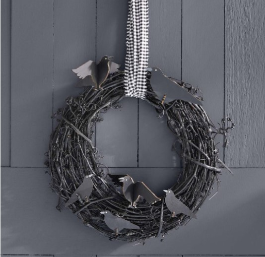

Crows land on a spooky grapevine wreath that has been painted black.

**To create this wreath:** Begin by spraying a grapevine wreath with black paint. Let it dry completely. Use hot glue to attach small wooden scarecrows to the wreath (if preferred, you can also cut them out of cardboard and paint them black). Finally, thread a piece of striped or grosgrain ribbon through the wreath to hang it up.

### **2\. DIY Halloween Black Magic Vintage Frame**

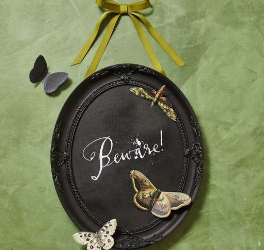

This craft project is delightfully spooky. We suggest hanging it in a covered area to keep it safe from the weather.

**To create this piece:** Begin by removing the glass from a vintage frame, preferably one with intricate designs. Give the surface a light sanding, then spray paint it black and let it dry.

Next, cut a piece of ribbon and use hot glue to stick it to the back of the frame, forming a hanger. If the frame is heavy, you can use a staple gun or traditional picture hanging wire for extra support. Cut the other length of ribbon and tie a bow in the middle of the hanger.

Now, download and print [the “Beware!” calligraphy clip art](https://hmg-prod.s3.amazonaws.com/files/gh-halloween-calligraphy-1597083228.pdf) onto cardstock. You can choose to frame the lettering or make a simple paper scroll by rolling the paper and securing it with glue. Additionally, download and print the Halloween bug images onto cardstock. Cut them out, fold them at the joints to give them dimension, and then glue them onto the frame.

### **3\. DIY Creepy Crawly Spider Web Wreath**

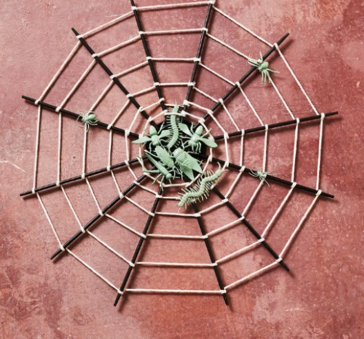

Create a spooky spider web this Halloween by using a mason jar lid, some chopsticks, and cotton string. Prepare to give your space an extra creepy touch!

**Tutorials:** To begin, spray paint the metal lid from a large-mouth canning jar with black paint. Also, spray paint a handful of plastic bugs in any color you prefer. Once dry, grab 12 black chopsticks and evenly space them on the metal lid. Use a huge amount of hot glue to secure them in place, and let them dry completely.

Now, take a 17-inch length of cotton rope or string. Wrap it around each chopstick once, moving on to the next until you’ve wrapped all the chopsticks. To secure the end, apply hot glue where you began and trim off any excess rope. Repeat this process using a new length of rope that’s about five inches longer than the previous one. Wrap it around the chopsticks, creating another circle of rope about an inch-and-a-half away from the previous circle. Keep repeating this step until you reach the end of the chopsticks. For an extra eerie touch, use hot glue to attach your painted bugs in the center of the web, as well as a few spiders on the outside.

### **4\. Plaid Fall Wreath DIY** 

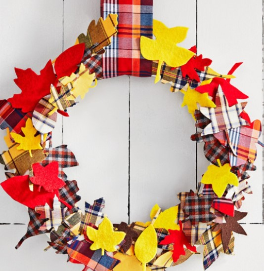

Plaid shirts and autumn leaves are the perfect combination, just like Thanksgiving and turkey! We adore the idea of celebrating these fall essentials with a joyful wreath that brings them together.

**Let’s make the wreath:** Start by tracing leaf stencils onto double-stick fusible webbing. Fuse the webbing into plaid fabric and carefully cut out the leaf shapes. Next, fuse the cut out leaves into felt and cut them out once again. Now, take a foam wreath form and wrap it with ribbon. To attach the leaves, you can use push-pins or hot glue, mixing both the plaid and felt sides for a delightful contrast. Finally, hang the wreath with a strip of plaid fabric.

This charming wreath will beautifully capture the essence of fall, combining the warmth of plaid and the natural beauty of autumn leaves. Get ready to add a spooky touch to your home with this delightful creation!

### **5\. DIY Colorful Corn Husk Wreath**

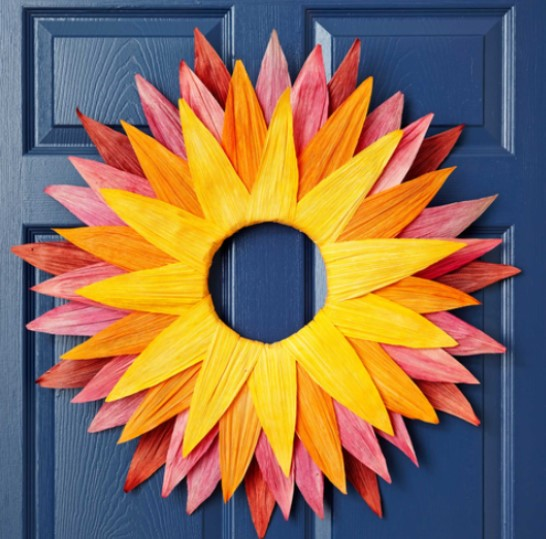

Create a stunning autumn wreath effortlessly using corn husks and liquid fabric dye. Crafting this eye-catching fall wreath is a breeze. Simply gather corn husks and liquid fabric dye, and let your creativity shine.

**To make the wreath:** check out [Woman’s Day.](https://www.womansday.com/home/crafts-projects/how-to/a56397/how-to-make-a-natural-fall-wreath/)

### **6\. Black Ribbon Halloween Wreath DIY** 

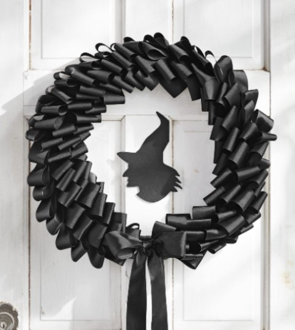

Who says an all-black wreath is off-limits? On Halloween, we’re ready to embrace the unconventional! This bewitching craft may not give off a warm welcome, but it’s sure to captivate every trick-or-treater in town.

**Let’s get started on making this spellbinding wreath:** Begin by cutting 150 strips of black grosgrain ribbon, each measuring 6 inches in length and 2 inches in width. Fold each strip in half and attach them to a 16-inch foam wreath form using straight pins. Layer them on top of each other to create a beautifully ruffled effect.

Next, cut out a witch silhouette from black kraft paper. Take a 16-inch round piece of clear acrylic and affix the witch silhouette to its center using double-sided tape. Carefully hot-glue the edges of the acrylic round to the back of the wreath form, securing it firmly in place. To add a final touch, tie a bow with long tails and incorporate it into the wreath design.

### **7\. DIY Halloween Candy Wreath**

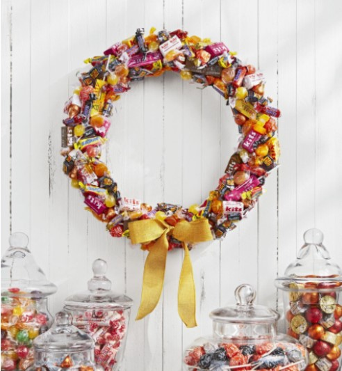

Bringing retro candy to your front door adds a delightful touch of nostalgia. The only hurdle? Resisting the temptation to snack on them before you start crafting!

**Let’s dive into making this sweet wreath:** Start by gathering an assortment of old-fashioned candies in vibrant autumnal hues like yellow, orange, and magenta. Take a 14-inch foam wreath form and wrap it snugly with white ribbon. Using hot glue, attach the candies to the wreath, layering and overlapping them as you go to create an eye-catching arrangement. Finally, add a finishing touch with a yellow burlap bow.

Prepare to welcome guests with a charming wreath that not only showcases retro candy but also evokes a sense of whimsy and joy. Just remember to resist the temptation to indulge in those sweet treats until after you’ve completed your craft!

### **8\. Spider Halloween Wreath Handmade** 

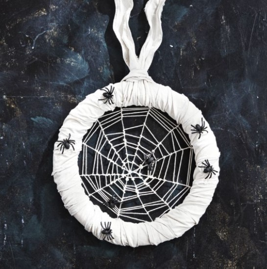

Create an elegant yet spooky ambiance with an all-white wreath adorned with tiny faux spiders.

**Let’s get started on crafting this enchanting piece:** Begin by tying six pieces of white string across a 14-inch foam wreath form. Make sure to loop each string at the midway point of the first piece attached, forming a central point. This will serve as the base of the web and should have 12 “spokes.” Next, tie a long piece of string to the center point and start weaving and looping it from the center outwards to create the intricate web pattern. If you run out of string, simply tie the other piece to the end and continue weaving. When you reach the nice wreath form, tie off the string at your desired ending point. For an added touch of authenticity, move the twine up and down to create some uneven gaps in the web.

Next, wrap the wreath form with white burlap ribbon, ensuring it is fully covered, and secure it in place. Use hot glue to attach the faux spiders to the edges of the wreath, adding a subtle yet eerie touch. Finally, loop a piece of white burlap ribbon around the form to serve as a hanger.

### **9\. DIY Wreath: Ribbon Ties & String Ghost** 

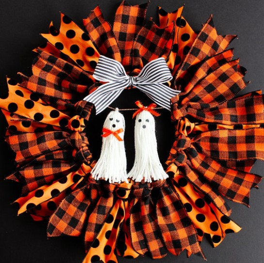

If you’re in search of a wreath that exudes sweetness rather than spookiness, then this delightful option might be the perfect choice for you.

Check out the tutorial at [Positively Splendid](https://www.positivelysplendid.com/halloween-ribbon-wreath/).

### **10\. DIY Rainbow Pumpkin Wreath**

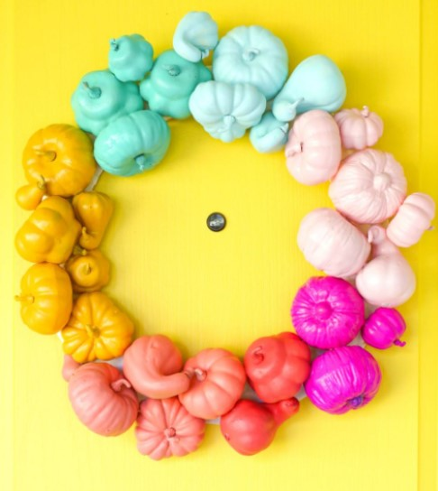

Halloween doesn’t have to be all about darkness and creepiness. You can add a touch of color to your doorstep by painting a few mini gourds, which are true holiday staples!

Check out the tutorial at [Lovely Indeed.](https://lovelyindeed.com/make-a-colorful-halloween-wreath-in-about-an-hour/)

### **11\. DIY Customizable Hay Wreath**

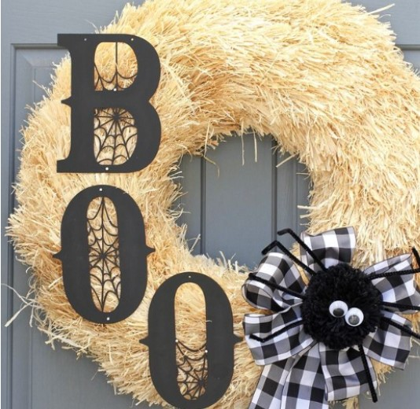

If you’re a fan of farmhouse-chic decor, chances are you may already have some hay and black wood letters on hand. Creating this adorable wreath will only require 15 minutes of your time, and the best part is that you can personalize it in three different ways to enjoy it year after year!

Check out the tutorial at  [The Homes I Have Made.](https://www.thirtyhandmadedays.com/3-spook-tacular-wreaths-can-make-just-15-minutes/)

### **12\. Spooky Halloween Ribbon Wreath**

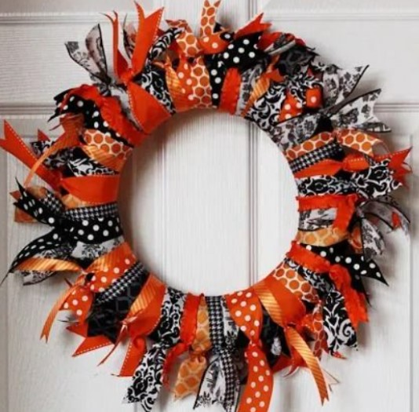

Ribbon wreaths are absolutely stunning no matter what time of year it is, and this particular Halloween-themed design is certainly no different. All you need to do is select a variety of ribbons in black, white, and orange and then skillfully tie them around a foam wreath, alternating between the colors. The beauty of this project lies in its imperfections, so don’t worry about achieving perfect symmetry. Let your creativity flow, and enjoy the process!

Check out the tutorial at [Landeelu.](https://www.landeeseelandeedo.com/halloween-ribbon-wreath/)

### **13\. Sugar Skull Wreath DIY**

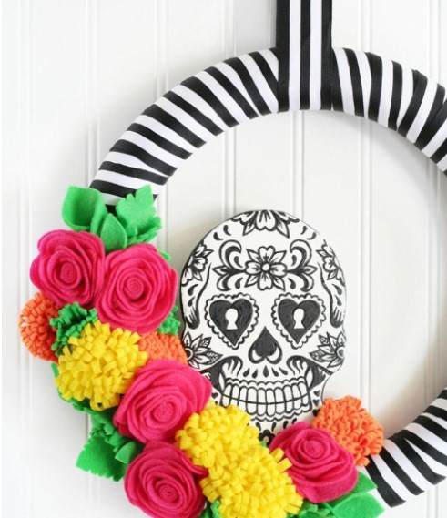

The vibrant colors of the tropics bring a delightful contrast to this black-and-white striped wreath. Alternatively, you can choose your own hues to match the overall aesthetic of your porch decorations.

Check out the tutorial at [The Crafted Sparrow](http://www.thecraftedsparrow.com/2015/10/sugar-skull-wreath.html).

### **14\. DIY Orange Felt Wreath**

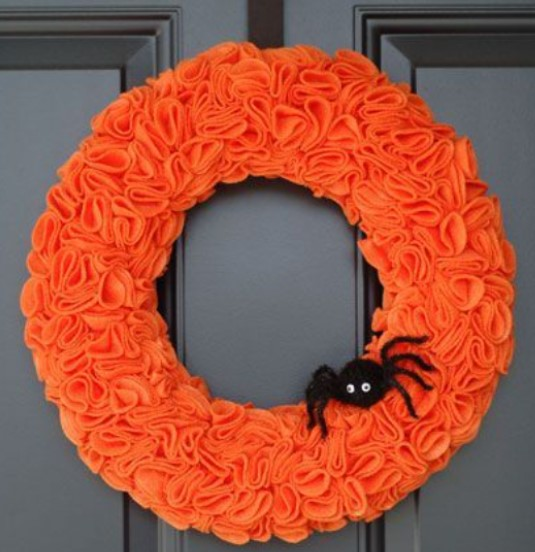

For a wreath that exudes luxuriousness like this one, opt for heavyweight felt. This choice of material will ensure a plush and rich texture. And don’t forget to add a small spider accent as the final touch, as it’s an essential detail that brings everything together.

Check out the tutorial at [All Things Simple.](http://kimmccrary.blogspot.com/2011/01/pinked-felt-wreath.html#.VCr0kvldXTp)

### **15\. Cupcake Liner Wreath**

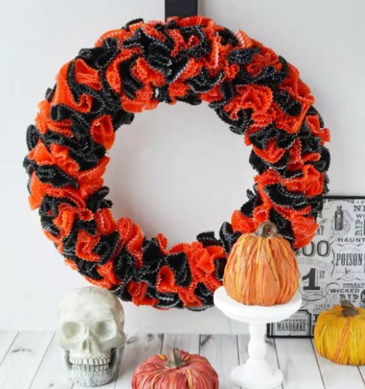

Set aside your hot glue gun and bring out your baking essentials instead! To create this charming wreath, all you’ll need is a foam wreath form, cupcake liners, some pins, and a bit of ribbon. No need for any complicated tools or techniques!

Check out the tutorial at [MomDot.](https://www.momdot.com/how-to-make-a-halloween-wreath/)

### **16\. Fall Cookie Wreath DIY**

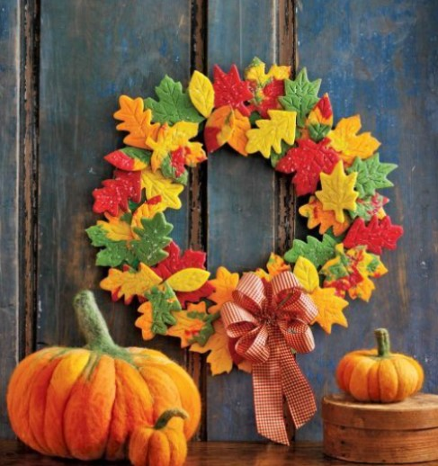

Made with love from freshly baked cookies, this adorable autumn-inspired wreath is a delightful homage to the sugary treats that Halloween is famous for. It’s a charming and creative way to celebrate the season while indulging in the spirit of Halloween.

Check out the tutorial at [Country Living.](https://www.countryliving.com/diy-crafts/how-to/g1732/fall-cookie-wreath/)

### **17\. Batty Wreath Ideas** 

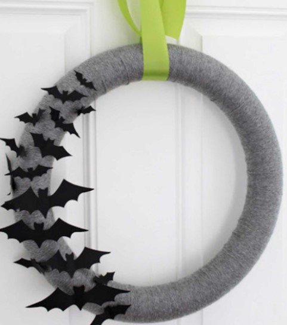

Embrace simplicity with this predominantly monochrome wreath. By keeping the color palette mostly black and white, you create an elegant and understated look. To infuse a touch of vibrancy into the spooky scene, simply incorporate a brightly colored ribbon. It’s the perfect way to add a pop of color without overpowering the overall aesthetic.

Check out the tutorial at [Eighteen25.](http://eighteen25.com/2011/09/todays-guest-just-girl/)

### **18\. DIY Vintage Masks Wreath**

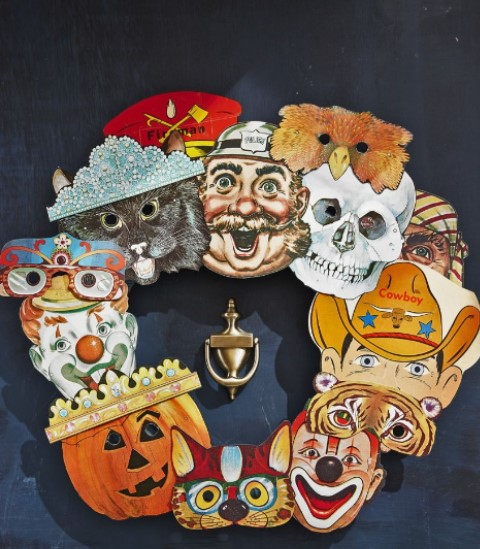

These delightful and nostalgic masks are far from frightening. However, they fit the Halloween theme perfectly and serve as fantastic decorations!

To create the wreath, start by sourcing vibrant vintage paper masks from platforms like Etsy or eBay. Aim for a total of 10 to 15 masks. Attach them to an 18-inch craft ring using a small amount of hot glue, ensuring to layer and overlap them as you progress. This technique adds depth and visual interest to the wreath, resulting in a captivating and playful Halloween display.

_**Related Collection:** 35 Best [Halloween Wreath](https://avada.io/loveable/halloween-wreath/) To Buy for October_

## **DIY Halloween Wreath, In conclusion** 

In conclusion, these spooktacular **DIY Halloween wreath ideas** are sure to bring a hauntingly good time to your festivities. Whether you’re hosting a costume party or simply want to add a touch of Halloween spirit to your home, these wreaths offer a perfect blend of creativity and spookiness. From eerie spiderwebs and creepy-crawly critters to whimsical ghosts and [Halloween pumpkins](https://avada.io/loveable/blog/halloween-pumpkin/), there is a wreath idea to suit every style and preference. The DIY aspect of these projects allows for customization and personalization, making each wreath unique and special. Get ready to impress your guests and enjoy a delightfully haunting atmosphere with these fabulous wreath ideas. Happy Halloween!

- [18 DIY Halloween Wreath Ideas With Tutorials](https://avada.io/loveable/blog/diy-halloween-wreath/#wp-block-heading-2-4) 
    - [1\. DIY Crow Wreath Halloween](https://avada.io/loveable/blog/diy-halloween-wreath/#wp-block-heading-3-6) 
    - [2\. DIY Halloween Black Magic Vintage Frame](https://avada.io/loveable/blog/diy-halloween-wreath/#wp-block-heading-3-10)
    - [3\. DIY Creepy Crawly Spider Web Wreath](https://avada.io/loveable/blog/diy-halloween-wreath/#wp-block-heading-3-16)
    - [4\. Plaid Fall Wreath DIY](https://avada.io/loveable/blog/diy-halloween-wreath/#wp-block-heading-3-21) 
    - [5\. DIY Colorful Corn Husk Wreath](https://avada.io/loveable/blog/diy-halloween-wreath/#wp-block-heading-3-26)
    - [6\. Black Ribbon Halloween Wreath DIY](https://avada.io/loveable/blog/diy-halloween-wreath/#wp-block-heading-3-30) 
    - [7\. DIY Halloween Candy Wreath](https://avada.io/loveable/blog/diy-halloween-wreath/#wp-block-heading-3-35)
    - [8\. Spider Halloween Wreath Handmade](https://avada.io/loveable/blog/diy-halloween-wreath/#wp-block-heading-3-40) 
    - [9\. DIY Wreath: Ribbon Ties & String Ghost](https://avada.io/loveable/blog/diy-halloween-wreath/#wp-block-heading-3-45) 
    - [10\. DIY Rainbow Pumpkin Wreath](https://avada.io/loveable/blog/diy-halloween-wreath/#wp-block-heading-3-49)
    - [11\. DIY Customizable Hay Wreath](https://avada.io/loveable/blog/diy-halloween-wreath/#wp-block-heading-3-53)
    - [12\. Spooky Halloween Ribbon Wreath](https://avada.io/loveable/blog/diy-halloween-wreath/#wp-block-heading-3-57)
    - [13\. Sugar Skull Wreath DIY](https://avada.io/loveable/blog/diy-halloween-wreath/#wp-block-heading-3-61)
    - [14\. DIY Orange Felt Wreath](https://avada.io/loveable/blog/diy-halloween-wreath/#wp-block-heading-3-65)
    - [15\. Cupcake Liner Wreath](https://avada.io/loveable/blog/diy-halloween-wreath/#wp-block-heading-3-69)
    - [16\. Fall Cookie Wreath DIY](https://avada.io/loveable/blog/diy-halloween-wreath/#wp-block-heading-3-73)
    - [17\. Batty Wreath Ideas](https://avada.io/loveable/blog/diy-halloween-wreath/#wp-block-heading-3-77) 
    - [18\. DIY Vintage Masks Wreath](https://avada.io/loveable/blog/diy-halloween-wreath/#wp-block-heading-3-81)
- [DIY Halloween Wreath, In conclusion](https://avada.io/loveable/blog/diy-halloween-wreath/#wp-block-heading-2-86) 

### [Blake Simpson](https://avada.io/loveable/author/blake/)

Hi, I'm Blake from Loveable. I help people find perfect gifts for occasions like anniversaries and weddings. I also write a blog about holidays, sharing insights to make them more meaningful. Let's create unforgettable moments together!

- [Twitter](https://twitter.com/intent/tweet)
- [Facebook](https://www.facebook.com/sharer/sharer.php)
- [instagram](https://avada.io/loveable/blog/diy-halloween-wreath/)
- [pinterest](https://www.pinterest.com/loveablellc/)

## Related Posts

[### 120+ Christian Birthday Wishes To Spread Your Love](https://avada.io/loveable/blog/christian-birthday-wishes/) 

[

### 35 Best 70th Birthday Ideas To Celebrate The Special Milestone

](https://avada.io/loveable/blog/70th-birthday-ideas/)

[

### 50 Best 30th Birthday Decorations for a Remarkable Birthday Bash

](https://avada.io/loveable/blog/30th-birthday-decorations/)

[

### 40 Delicious Vegan Christmas Desserts to Delight Your Palate

](https://avada.io/loveable/blog/vegan-christmas-desserts/)

[

### 60 Christmas Team Building Activities to Boost Workplace Spirit

](https://avada.io/loveable/blog/christmas-team-building-activities/)
