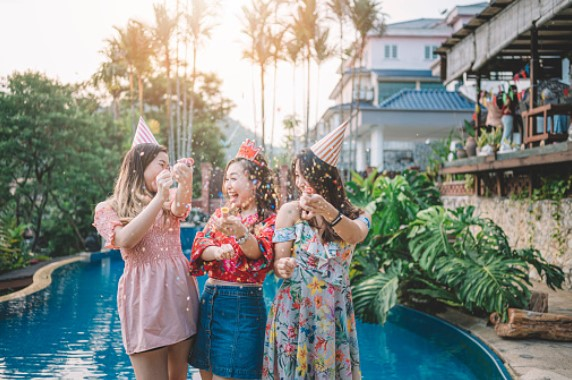
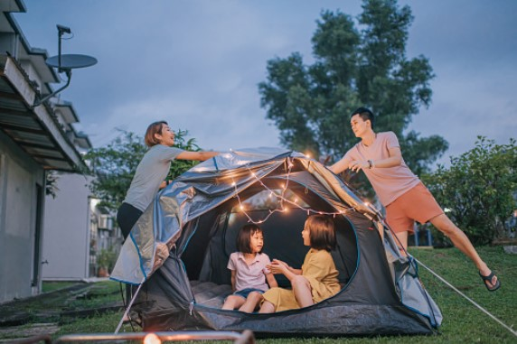
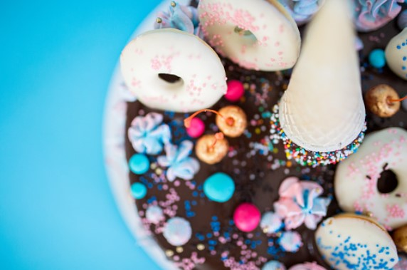
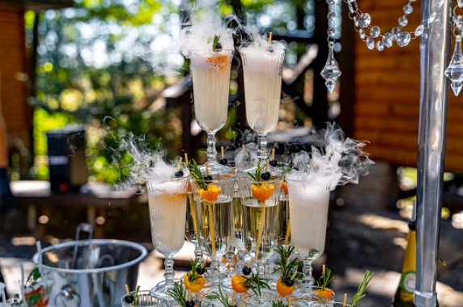
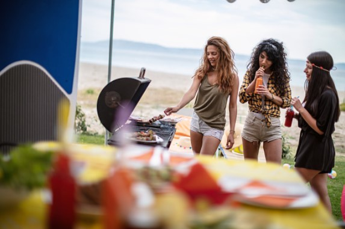
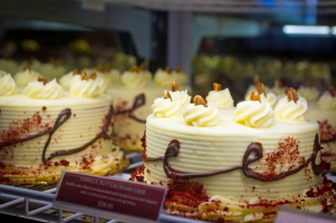
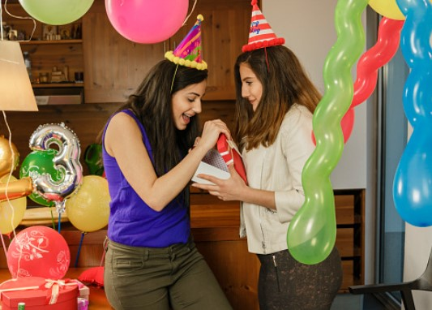

This article has been written and researched by our expert Loveable through a precise methodology. [Learn more about our methodology](https://avada.io/loveable/our-methodological.html)

[Loveable](https://avada.io/loveable/) > [Blog](https://avada.io/loveable/blog/) > [Family](https://avada.io/loveable/family/)

# 19 Fun and Creative Summer Birthday Party Ideas for All Ages  

Written by [Rose Bryne](https://avada.io/loveable/author/rose/) Last Updated on August 23, 2023

- [1\. Summer Pool Birthday Party](https://avada.io/loveable/blog/summer-birthday-party-ideas/#wp-block-heading-2-4) 
- [2\. Backyard Movie Night](https://avada.io/loveable/blog/summer-birthday-party-ideas/#wp-block-heading-2-7) 
- [3\. Personalized Birthday Gifts](https://avada.io/loveable/blog/summer-birthday-party-ideas/#wp-block-heading-2-9) 
- [4\. Backyard Camping](https://avada.io/loveable/blog/summer-birthday-party-ideas/#wp-block-heading-2-12)
- [5\. Water Balloon Battles](https://avada.io/loveable/blog/summer-birthday-party-ideas/#wp-block-heading-2-15) 
- [6\. Ice-Cream Birthday Party](https://avada.io/loveable/blog/summer-birthday-party-ideas/#wp-block-heading-2-17) 
- [7\. Birthday Game in Backyard](https://avada.io/loveable/blog/summer-birthday-party-ideas/#wp-block-heading-2-20) 
- [8\. Mimosa Party](https://avada.io/loveable/blog/summer-birthday-party-ideas/#wp-block-heading-2-22)
- [9\. Root Beer Float](https://avada.io/loveable/blog/summer-birthday-party-ideas/#wp-block-heading-2-24)
- [10\. DIY Spa Birthday Party](https://avada.io/loveable/blog/summer-birthday-party-ideas/#wp-block-heading-2-27) 
- [11\. Drink Tower and Fresh Fruit](https://avada.io/loveable/blog/summer-birthday-party-ideas/#wp-block-heading-2-29) 
- [12\. Summer Grill Party](https://avada.io/loveable/blog/summer-birthday-party-ideas/#wp-block-heading-2-32) 
- [13\. Summer Garden Party](https://avada.io/loveable/blog/summer-birthday-party-ideas/#wp-block-heading-2-35)
- [14\. Summer Theme Decoration](https://avada.io/loveable/blog/summer-birthday-party-ideas/#wp-block-heading-2-37) 
- [15\. Make an ice cream cake.](https://avada.io/loveable/blog/summer-birthday-party-ideas/#wp-block-heading-2-39) 
- [16\. Summer Painting Competition](https://avada.io/loveable/blog/summer-birthday-party-ideas/#wp-block-heading-2-42) 
- [17\. Birthday Gifts Scavenger Hunt](https://avada.io/loveable/blog/summer-birthday-party-ideas/#wp-block-heading-2-44) 
- [18\. Coconut Cups](https://avada.io/loveable/blog/summer-birthday-party-ideas/#wp-block-heading-2-47)
- [19\. Summer Birthday Party Invitations](https://avada.io/loveable/blog/summer-birthday-party-ideas/#wp-block-heading-2-49)
- [Bottom Line](https://avada.io/loveable/blog/summer-birthday-party-ideas/#wp-block-heading-2-51) 

Those born in the summer will be very lucky because they will have many ideas for their birthday. With the longer days and nicer weather, there are numerous chances for fun and unique **summer birthday party ideas** that will leave a lasting impact on attendees of all ages. Are you ready to make a perfect day on this birthday? 

Summer is the ideal season for this, as mentioned, whether they are held outside or indoors. The parties may be customized to any interest. Summer birthday celebrations, regardless of age or interest, provide an opportunity to make wonderful memories with friends and family. Anyone, with a little imagination and effort, can host a summer birthday celebration that will be remembered for years to come. 

Let’s see what we can do for this birthday!

## **1\. Summer Pool Birthday Party** 

Surely, we can’t ignore the swimming pool on the summer day. You may invite guests to swim, lay by the pool, or enjoy some cool beverages. You should add more [Beach Accessories Ideas](https://avada.io/loveable/beach-accessories/) to make the celebration more vibrant; decorate the pool area with balloons, streamers, and beach balls. If you have younger guests, consider having pool toys, such as water pistols, to keep them engaged. 

## **2\. Backyard Movie Night** 

You may turn your backyard into an outdoor movie theater by installing a projector and screen, or by using a large TV if you have one. It’s great to gather everyone to enjoy a favorite film and talk about it. You may supply popcorn and other movie refreshments, and guests can bring blankets or lawn chairs to sit on. 

## **3\. Personalized Birthday Gifts** 

With personalized birthday gifts, you can create something truly unique and special. It’s a great way to make birthdays even more memorable with DIY gifts. There are many simple ideas to do together. Remember that the best thing is to spend time together rather than finished products.

_**Related**_: [Personalised Birthday Gifts](https://avada.io/loveable/personalized-birthday-gifts/)

## **4\. Backyard Camping**

Set up a tent on your lawn and ask friends and family to join you for the night. Begin by constructing a fire, toasting marshmallows, and telling campfire stories. Prepare lots of food and beverages, and consider erecting an outside movie screen for a late-night movie beneath the stars. 

## **5\. Water Balloon Battles** 

Surely, you can take a bit long time to prepare for water balloons. However, as soon as it’s done, you can enjoy a great battle. Water balloon wars, especially for smaller children, are definitely a refreshing way to celebrate a summer birthday celebration. Set up barricades or forts for each team to hide behind and strategize behind to add some excitement. Set some ground rules ahead of time to ensure everyone has a fun and safe time. 

## **6\. Ice-Cream Birthday Party** 

Ice cream can’t be ignored on a hot summer day. Let’s imagine how it’s amazing to taste fresh ice cream under the scorching shine. You can create a summer paradise with this idea. You may have an ice cream sundae bar with various toppings or may also get creative with the toppings, such as gummy bears or cotton candy. You could also set up a DIY ice cream sandwich station where visitors can mix their favorite flavors to create their own dessert. 

## **7\. Birthday Game in Backyard** 

You may set up various activities in nice summer weather in your backyard. You may also design enjoyable tasks such as an obstacle course or a treasure hunt, with the winner receiving a prize such as a bag of candies or a small toy.

## **8\. Mimosa Party**

Serve the traditional Mimosa cocktail with a twist by offering a selection of juices and fruit pieces for visitors to mix & match. You may also provide non-alcoholic choices for visitors. Let’s play some background music and enjoy some glasses. This party style is ideal for those who want a low-key celebration with nice food and drink.

## **9\. Root Beer Float**

Simply select your favorite root beer and ice cream brands and allow your guests to make their own floats! You might add a variation by offering several flavors of soda or ice cream, or by using mix-ins like chocolate syrup or sprinkles. It’s a low-cost, low-maintenance party idea that’s likely to please both youngsters and adults.

## **10\. DIY Spa Birthday Party** 

If you don’t like crowded, you can make your own spa for this birthday party. Homemade spa birthday parties are a relaxing way to celebrate with friends to de-stress after a long day at work. Let’s make your own comfortable space, such as face masks or making your own sugar scrubs or bath bombs. Play some soothing music and serve refreshing drinks or wine to enjoy.

## **11\. Drink Tower and Fresh Fruit** 

A drink tower and fresh fruit are a great addition to any summer birthday party. Make a drink tower by stacking various sizes of cups in a pyramid configuration and filling them with juices. Add colored straws and fruit slices to each cup for a personal touch. A perfect idea to keep attendees hydrated during the hot summer months while also making a vibrant party.

## **12\. Summer Grill Party** 

It’s actually perfect for any season, not only summer. We all know that grill party has been a symbol of parties for a long time. It’s an excellent time to experiment with your cuisine. One of the most significant advantages of a summer BBQ is the ability to spend quality time together while eating wonderful, low-cost outdoor meals.

## **13\. Summer Garden Party**

The celebration might be held in your own home or at a nearby park with a lovely garden. To create a celebratory atmosphere, decorate the space with flowers and balloons. It is wonderful to be immersed in nature, where you can comfortably rest and escape the hustle and bustle of the city.

## **14\. Summer Theme Decoration** 

A birthday celebration may be made more cheerful with summer-themed décor. Consider using bright colors to express the season’s liveliness. Paper lanterns, bunting, and balloons are common decorations. Incorporating beach balls, sunglasses, or ice cream cones can also be a fun way to contribute to the theme.

## **15\. Make an ice cream cake.** 

A deliciously refreshing dessert for a summer birthday party is an ice cream cake. That is a unique twist on the conventional birthday cake that is sure to please visitors of all ages.

## **16\. Summer Painting Competition** 

Set up a painting station with canvases, paint, brushes, and other equipment to inspire attendees to express their creativity. You can also suggest a topic or prompt for the artworks to be inspired by. Allow everyone to show their artwork for a group vote at the end of the competition, and then offer awards to the victors. This exercise is suitable for people of all ages and may be performed both indoors and outdoors. 

## **17\. Birthday Gifts Scavenger Hunt** 

This activity may be done both inside and outside. It works by hiding various gifts across the party venue and then offering a scavenger hunt map to assist partygoers in locating concealed items. The presents can range from modest trinkets to major rewards, and they can even be related to the party theme. 

## **18\. Coconut Cups**

They are not only useful as party favors but may also be utilized as drink cups or as ornamental centerpieces. Let’s make a competition to find out who will make the best artwork with coconut shells.

## **19\. Summer Birthday Party Invitations**

Invites are important to consider when preparing a summer birthday celebration. Depending on your tastes and budget, you may send out paper invites or digital invitations. Consider using bright colors on the invites to reflect the summer theme. Remember to make invitations related to themed activities.

## **Bottom Line** 

Everyone loves to have an unforgettable birthday party in life. It is the desire to receive sincere blessings from family and friends and get the feeling of the main character. It’s even more fantastic if your birthday is in the summer. It is the perfect time for enjoying a variety of activities thanks to its beautiful weather. From backyard BBQs and DIY spa parties to painting competitions and coconut cups; Whatever you do, make sure you’re satisfied and happy. 

Tired of organizing the same old boring birthday parties year after year? This summer, spice things up with these **19 Fun and Creative Summer Birthday Party Ideas for All Ages!** So, why settle for a standard birthday bash when these entertaining and unique ideas will help you create amazing memories?

- [1\. Summer Pool Birthday Party](https://avada.io/loveable/blog/summer-birthday-party-ideas/#wp-block-heading-2-4) 
- [2\. Backyard Movie Night](https://avada.io/loveable/blog/summer-birthday-party-ideas/#wp-block-heading-2-7) 
- [3\. Personalized Birthday Gifts](https://avada.io/loveable/blog/summer-birthday-party-ideas/#wp-block-heading-2-9) 
- [4\. Backyard Camping](https://avada.io/loveable/blog/summer-birthday-party-ideas/#wp-block-heading-2-12)
- [5\. Water Balloon Battles](https://avada.io/loveable/blog/summer-birthday-party-ideas/#wp-block-heading-2-15) 
- [6\. Ice-Cream Birthday Party](https://avada.io/loveable/blog/summer-birthday-party-ideas/#wp-block-heading-2-17) 
- [7\. Birthday Game in Backyard](https://avada.io/loveable/blog/summer-birthday-party-ideas/#wp-block-heading-2-20) 
- [8\. Mimosa Party](https://avada.io/loveable/blog/summer-birthday-party-ideas/#wp-block-heading-2-22)
- [9\. Root Beer Float](https://avada.io/loveable/blog/summer-birthday-party-ideas/#wp-block-heading-2-24)
- [10\. DIY Spa Birthday Party](https://avada.io/loveable/blog/summer-birthday-party-ideas/#wp-block-heading-2-27) 
- [11\. Drink Tower and Fresh Fruit](https://avada.io/loveable/blog/summer-birthday-party-ideas/#wp-block-heading-2-29) 
- [12\. Summer Grill Party](https://avada.io/loveable/blog/summer-birthday-party-ideas/#wp-block-heading-2-32) 
- [13\. Summer Garden Party](https://avada.io/loveable/blog/summer-birthday-party-ideas/#wp-block-heading-2-35)
- [14\. Summer Theme Decoration](https://avada.io/loveable/blog/summer-birthday-party-ideas/#wp-block-heading-2-37) 
- [15\. Make an ice cream cake.](https://avada.io/loveable/blog/summer-birthday-party-ideas/#wp-block-heading-2-39) 
- [16\. Summer Painting Competition](https://avada.io/loveable/blog/summer-birthday-party-ideas/#wp-block-heading-2-42) 
- [17\. Birthday Gifts Scavenger Hunt](https://avada.io/loveable/blog/summer-birthday-party-ideas/#wp-block-heading-2-44) 
- [18\. Coconut Cups](https://avada.io/loveable/blog/summer-birthday-party-ideas/#wp-block-heading-2-47)
- [19\. Summer Birthday Party Invitations](https://avada.io/loveable/blog/summer-birthday-party-ideas/#wp-block-heading-2-49)
- [Bottom Line](https://avada.io/loveable/blog/summer-birthday-party-ideas/#wp-block-heading-2-51) 

### [Rose Bryne](https://avada.io/loveable/author/rose/)

Hi, I'm Rose! I love animals and spending time with kids. At Loveable, I help people find unique gifts for special occasions like Valentine's Day, housewarmings, and graduations. I enjoy finding gifts for kids, teens, and animal lovers that match their interests and personalities. Making gift-giving a pleasant experience is my priority. Let me assist you in finding the perfect gift!

- [Twitter](https://twitter.com/intent/tweet)
- [Facebook](https://www.facebook.com/sharer/sharer.php)
- [instagram](https://avada.io/loveable/blog/summer-birthday-party-ideas/)
- [pinterest](https://www.pinterest.com/loveablellc/)

## Related Posts

[### 30 Best 4 Year Old Birthday Party Ideas For A Memorable Celebration](https://avada.io/loveable/blog/4-year-old-birthday-party-ideas/) 

[

### 16th Birthday Party Ideas to Make an Unforgettable Day

](https://avada.io/loveable/blog/16th-birthday-party-ideas/)

[

### 150+ Inspirational Birthday Quotes to Spread Joy on Special Day

](https://avada.io/loveable/blog/inspirational-birthday-quotes/)

[

### 160+ Birthday Wishes for Wife to Express Eternal Love

](https://avada.io/loveable/blog/birthday-wishes-for-wife/)

[### 90+ Heart Touching Birthday Wishes for Niece to Make Her Day Extra Special](https://avada.io/loveable/blog/birthday-wishes-for-niece/)
