This article has been written and researched by our expert Loveable through a precise methodology. [Learn more about our methodology](https://avada.io/loveable/our-methodological.html)

[Loveable](https://avada.io/loveable/) > [Blog](https://avada.io/loveable/blog/) > [Holiday](https://avada.io/loveable/holiday/)

# 20 Best Halloween Poems for the 2023 Celebration

Written by [Blake Simpson](https://avada.io/loveable/author/blake/) Last Updated on September 05, 2023

- [20 Most Popular Halloween Poems For All Ages](https://avada.io/loveable/blog/halloween-poems/#wp-block-heading-2-5) 
    - [1\. The Spider and the Fly by Mary Howitt](https://avada.io/loveable/blog/halloween-poems/#wp-block-heading-3-6)
    - [2\. Macklin’s Jack O’Lantern by David McCord](https://avada.io/loveable/blog/halloween-poems/#wp-block-heading-3-18)
    - [3\. Halloween Party by Kenn Nesbitt](https://avada.io/loveable/blog/halloween-poems/#wp-block-heading-3-28)
    - [4\. Halloween in the Anthropocene, 2015 by Craig Santos Perez](https://avada.io/loveable/blog/halloween-poems/#wp-block-heading-3-39)
    - [5\. Halloween by Robert Burns](https://avada.io/loveable/blog/halloween-poems/#wp-block-heading-3-52)
    - [6\. A Rhyme For Halloween by Maurice Kilwein Guevara](https://avada.io/loveable/blog/halloween-poems/#wp-block-heading-3-67)
    - [7\. Halloween by Arthur Peterson](https://avada.io/loveable/blog/halloween-poems/#wp-block-heading-3-78)
    - [8\. Theme In Yellow by Carl Sandburg](https://avada.io/loveable/blog/halloween-poems/#wp-block-heading-3-89)
    - [9\. All Hallows by Louise Glück](https://avada.io/loveable/blog/halloween-poems/#wp-block-heading-3-99)
    - [10\. Halloween by John Mayne](https://avada.io/loveable/blog/halloween-poems/#wp-block-heading-3-110)
    - [11\. The Raven by Edgar Allan Poe](https://avada.io/loveable/blog/halloween-poems/#wp-block-heading-3-123)
    - [12\. The Vampire by Conrad Aiken](https://avada.io/loveable/blog/halloween-poems/#wp-block-heading-3-132) 
    - [13\. The Haunted Palace by Edgar Allan Poe](https://avada.io/loveable/blog/halloween-poems/#wp-block-heading-3-142)
    - [14\. Omens by Cecilia Llompart](https://avada.io/loveable/blog/halloween-poems/#wp-block-heading-3-153) 
    - [15\. All Hallows’ Eve by Dorothea Tanning](https://avada.io/loveable/blog/halloween-poems/#wp-block-heading-3-163)
    - [16\. “Song of the Terrible” By Hilda Morley](https://avada.io/loveable/blog/halloween-poems/#wp-block-heading-3-173)
    - [17\. “Finding the Great Dream of Hell” by  Linda Addison](https://avada.io/loveable/blog/halloween-poems/#wp-block-heading-3-182)
    - [18\. “Before the Mirror” By Elizabeth Drew Barstow Stoddard](https://avada.io/loveable/blog/halloween-poems/#wp-block-heading-3-192)
    - [19\. “Ghost Q & A” By  Anne Carson](https://avada.io/loveable/blog/halloween-poems/#wp-block-heading-3-201)
    - [20\. “Not Merely Because of the Unknown That Was Stalking Towards Them ” – Jenny Boully](https://avada.io/loveable/blog/halloween-poems/#wp-block-heading-3-209)
- [Bottom line](https://avada.io/loveable/blog/halloween-poems/#wp-block-heading-2-214) 

Looking for poetic tales that embrace the spooky season? We’ve got you covered! These 20 **Halloween poems** bring forth ghoulish stories and magical moments under the moonlight. From ancient legends to modern verses, get ready to be captivated by the artistry of these talented poets.

But it’s not just about ghosts and goblins—these poems hold deeper meanings too. Discover the secrets behind [Halloween’s symbolism](https://avada.io/loveable/blog/halloween-symbols-explained/), the dance between life and death, and the wonder of the unknown. Let your imagination run wild as we uncover the hidden layers within these bewitching verses.

Don’t miss out on this poetic treat! Join us as we explore the 20 best Halloween poems for 2023, and let the enchantment of words sweep you away into a world of spooky wonders. Embrace the magic of Halloween and let these poems cast a spell on your soul. Let the celebration begin!

To make this Halloween celebration extra special, we also have an article about spooky [Halloween quotes](https://avada.io/loveable/halloween-quotes/). You’re sure to enjoy looking through this fantastic collection!

## **20 Most Popular Halloween Poems For All Ages** 

### **1\. The Spider and the Fly by Mary Howitt**

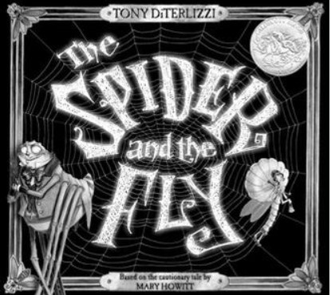

Mary Howitt’s ‘The Spider and the Fly,’ though not explicitly a Halloween poem, bears a thematic connection to the spirit of the occasion. Published in 1829, it has become one of the favored verses for Hallows’ Eve, frequently recited. The poem serves as a cautionary tale, advising young children to be wary of those who employ flattery to allure, as depicted in the story of the spider and the fly.

**Excerpt for You**

_“Will you walk into my parlour?” said the Spider to the Fly,_

_“‘Tis the prettiest little parlour that ever you did spy;_

_(…)_

_And now dear little children, who may this story read,_

_To idle, silly flattering words, I pray you ne’er give heed:_

_Unto an evil counsellor, close heart and ear and eye,_

_And take a lesson from this tale, of the Spider and the Fly.”_

**Buy [Spider](https://www.amazon.com/Spider-Fly-Illustrated-Mary-Howitt/dp/1684931525/)** and the Fly on Amazon 

### **2\. Macklin’s Jack O’Lantern by David McCord**

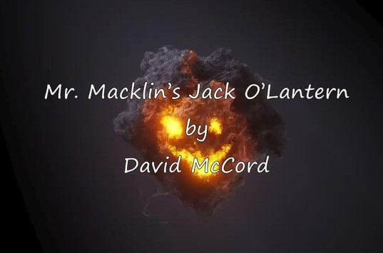

In David McCord’s poem, ‘Mr. Macklin’s Jack O’Lantern,’ we witness the artistry of Mr. Macklin as he skillfully [carves a pumpkin](https://avada.io/loveable/blog/halloween-pumpkin/) into a jack-o-lantern. Once the task is done, he places a lit candle inside Jack’s skull. The eerie glow emanating from the lantern creates a creepy feeling, yet it serves the purpose of warding off the darkness. The concluding line playfully wonders, “O Mr. Macklin! where’s the door?”

**Excerpt for You**

_“Mr. Macklin takes his knife_

_And carves the yellow pumpkin face:_

_(…)_

_With Jack’s face dancing on the wall._

_O Mr. Macklin! where’s the door?”_

**Read the full poem at** [**fourteenlines**](https://fourteenlines.blog/tag/mr-macklins-jack-olantern-by-david-mccord/)

### **3\. Halloween Party by Kenn Nesbitt**

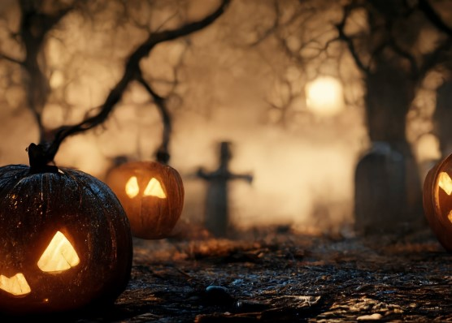

In the poem ‘Halloween Party’ by esteemed American children’s poet Kenn Nesbitt, the speaker fondly recalls childhood memories filled with joy and excitement, but also tinged with regret. This renowned poem, known for its depiction of youthful merriment, focuses on the child’s preparations for the Halloween party. It beautifully captures the thrill and happiness experienced by the young heart as the festivities approach.

Towards the end of the poem, the author candidly shares a silly mistake made during the celebration, adding a touch of vulnerability that endears the speaker to the readers. ‘Halloween Party’ is a beloved verse that resonates with anyone who cherishes the magical moments of their own childhood, where fun and folly intertwined to create cherished memories.

**Excerpt for You**

_“We’re having a Halloween party at school._

_I’m dressed up like Dracula. Man, I look cool!_

_(…)_

_The other kids stare like I’m some kind of freak—_

_the Halloween party is not till next week.”_

**Read the full poem at** [**poetryfoundation**](https://www.poetryfoundation.org/poems/47155/halloween-party)

### **4\. Halloween in the Anthropocene, 2015 by Craig Santos Perez**

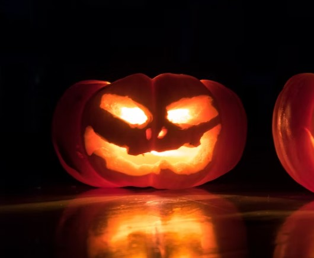

The year is 2015, and the poet paints a somber picture of a dark day with the moon shining bright against the oil-black sky. In this ironic portrayal, the poem contrasts the lives of the privileged children dressed up for the festivities with the harsh reality of Black boys and girls toiling under the unforgiving sun.

The poet’s anguished voice echoes the pain and suffering of those souls on earth who remain unaddressed and marginalized. Amidst the Halloween revelry, a deeper truth emerges, revealing the stark disparities in society. The juxtaposition of joyous [Halloween costumes](https://avada.io/loveable/halloween-costume-ideas/) against the toil and struggle of the underprivileged serves as a poignant reminder of the injustices that persist in the Anthropocene.

**Excerpt for You**

_“Darkness spills across the sky like an oil plume._

_The moon reflects bleached coral. Tonight, let us_

_praise the sacrificed. Praise the souls of  black_

_(…)_

_mothers of  lost habitats, mothers of  fallout, mothers_

_of extinction — pray for us — because even tomorrow_

_will be haunted — leave them, leave us, leave —”_

**Read the full poem at** [**poetryfoundation**](https://www.poetryfoundation.org/poetrymagazine/poems/88745/halloween-in-the-anthropocene-2015)

### **5\. Halloween by Robert Burns**

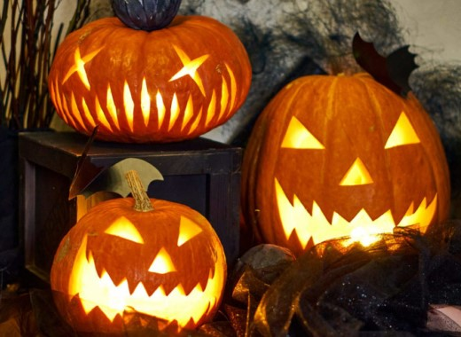

‘Rober Burns’ ‘Halloween,’ written in 1785 and first published in 1786 as part of the Kilmarnock Edition, is a lesser-known yet significant poem. Among his works, it stands as one of his longest, and notably, one of the earliest poems in English to delve into the subject of Halloween. Set in 18th-century Scotland, the poem vividly portrays the traditions and activities associated with this enchanting occasion.

Spanning 252 lines, divided into twenty-eight stanzas, the poem weaves a delightful tapestry of Scots dialect and English. Through the eyes of twenty narrative [cartoon characters](https://avada.io/loveable/blog/famous-halloween-cartoon-characters/), the reader gains an intimate insight into the pleasures and sense of community that marked this festive season in the bygone era.

**Excerpt for You**

_“Upon that night, when fairies light_

_On Cassilis Downans dance,_

_Or owre the lays, in splendid blaze,_

_On sprightly coursers prance;_

_(…)_

_Set a’ their gabs a-steerin’;_

_Syne, wi’ a social glass o’ strunt,_

_They parted aff careerin’_

_Fu’ blythe that night.”_

**Read the full poem at** [**Poets**](https://poets.org/poem/halloween)

### **6\. A Rhyme For Halloween by Maurice Kilwein Guevara**

In Maurice Kilwein Guevara’s poem ‘A Rhyme For Halloween,’ the eve of Halloween comes to life with vibrant imagery and rhymes. This modern take on Halloween captures the essence of the season as it marks the transition from autumn to winter. The poem paints a vivid picture of the festivities, where apples fall with a resounding thump, signaling the arrival of winter.

Amidst the celebration, there’s a sense of optimism in the air. While one season draws to a close, another begins, bringing with it new experiences and joys. ‘A Rhyme For Halloween’ embraces the cyclical nature of life and reminds us that every ending is a gateway to a fresh beginning.

**Excerpt for You**

_“Tonight I light the candles of my eyes in the lee_

_And swing down this branch full of red leaves._

_(…)_

_By the caw of the crow on the first of the year,_

_Something will die, something appear.”_

**Read the full poem at** [**poetryfoundation**](https://www.poetryfoundation.org/poems/56863/a-rhyme-for-halloween)

### **7\. Halloween by Arthur Peterson**

Arthur Peterson’s ‘Halloween’ stands as yet another beloved poem that captures the essence of Halloween night. Through the speaker’s eyes, we embark on an unforgettable journey of this mystical evening. The poem unravels the secrets of the fairies and spirits that grace the Hallows’ Eve, painting a vivid tapestry of imagery and references across its eleven octaves. With a wealth of details, the poet delves into his own experience of Halloween, bringing to life the enchantment and wonder that define this magical night.

**Excerpt for You**

_“Out I went into the meadow,_

_Where the moon was shining brightly,_

_And the oak-tree’s lengthening shadows_

_(…)_

_To behold the elves and pixies,_

_To behold the merry spirits,_

_Who come forth on Halloween.”_

**Read the full poem at** [**Poets**](https://poets.org/poem/halloween-0)

### **8\. Theme In Yellow by Carl Sandburg**

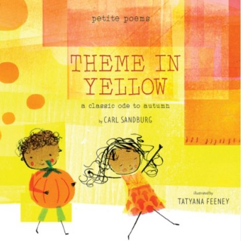

In the poem ‘Theme in Yellow,’ Halloween night unfolds from the unique perspective of a pumpkin. The speaker, personified as the pumpkin, shares its journey from a small yellow ball to a fully matured orange or tawny fruit, ready to play its role as a Jack-o-lantern on Halloween. As the festivities approach, children gather around the pumpkin, joining hands and singing ghost songs in joyful celebration. Unlike the typical spooky associations with Halloween and Jack-o-lanterns, this poem presents a lighter, more cheerful sense of the day.

**Excerpt for You**

_“I spot the hills_

_With yellow balls in autumn._

_(…)_

_And the children know_

_I am fooling.”_

**Read the full poem at** [**poetryfoundation**](https://www.poetryfoundation.org/poems/45041/theme-in-yellow)

### **9\. All Hallows by Louise Glück**

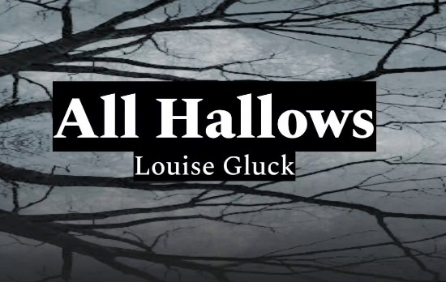

“All Hallows,” the shortened title for “All Hallows’ Eve,” marks the evening before All Saints’ Day, symbolizing the end of the harvest season. Late October sets in, and the earth begins its slumber, knowing it won’t grow for a while. The poet beautifully depicts the conclusion of the harvest, with bare fields and animals safely sheltered in barns.

In the poem, a sense of death looms, embodied by the wife who extends her hand to the spirit. As if nurturing the spirit, she offers it seeds, invoking its resurrection now that the earth’s harvesting is complete. The poem beautifully weaves themes of life and death, celebrating the transition from a bountiful harvest to the somber stillness of winter, all observed on this enchanting night of All Hallows.

**Excerpt for You**

_“Even now this landscape is assembling._

_The hills darken. The oxen_

_sleep in their blue yoke,_

_(…)_

_And the soul creeps out of the tree.”_

**Read the full poem at** [**poetryfoundation**](https://www.poetryfoundation.org/poems/45041/theme-in-yellow)

### **10\. Halloween by John Mayne**

The poem, comprising twelve stanzas and published in Ruddiman’s Weekly Magazine, vividly captures the mischievous pranks that unfold on Halloween night, evoking a sense of both excitement and fear: “What fearful pranks ensue!” Additionally, the poem touches on the spooky aspect associated with the night, with mentions of “Bogies” or ghosts.

Mayne’s composition evidently left an impact on Robert Burns, as he seems to engage with Mayne’s work in his own poem titled ‘Halloween.’ In this way, the two poets share a common theme, and Burns echoes some of Mayne’s imagery in his own creative expression. ‘Halloween’ by John Mayne serves as a timeless reminder of the spirit of fun and mischief that permeates this enchanting night of celebration.

**Excerpt for You**

_“OF a’ the festivals we hear,_

_Frae Handsel-Monday till New Year,_

_There’s few in Scotland held mair dear_

_(…)_

_Till death in everlasting bliss_

_Shall steek their e’en,_

_Will ever be the constant wish of_

_Jockie Mein.”_

**Read the full poem at** [**poetryexplorer**](https://www.poetryexplorer.net/poem.php?id=10105857)

### **11\. The Raven by Edgar Allan Poe**

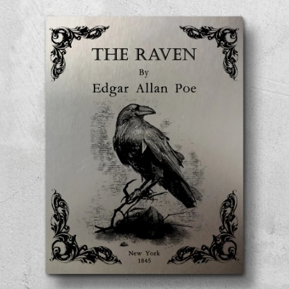

Poe’s most popular poem, ‘The Raven,’ encompasses his recurring themes of loss, death, fear, and the eerie presence of a talking raven. The bird’s haunting cry of “Nevermore” echoes throughout this supernatural and dream-like piece. Undoubtedly, this chilling poem ranks among the scariest examples in English literature, making it an ideal choice for a night of spine-tingling terror.

**Excerpt for You**

_“Once upon a midnight dreary, while I pondered, weak and weary,_

_Over many a quaint and curious volume of forgotten lore—_

    _While I nodded, nearly napping, suddenly there came a tapping,_

_As of some one gently rapping, rapping at my chamber door.”_

**Read the full poem at** [**poetryfoundation**](https://www.poetryfoundation.org/poems/48860/the-raven)

### **12\. The Vampire by Conrad Aiken** 

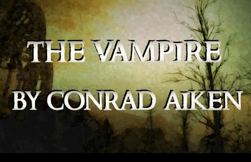

In ‘The Vampire,’ Aiken delves into the emergence of profound evil and the choices confronted by mankind in its wake. The poem commences with the speaker and his companions witnessing the arrival of a formidable being—a woman possessing power over darkness, a vampire. As her presence engulfs the world, terrifying darkness descends upon the sky. 

Though her words are initially obscure, they eventually become clear, enticing those who join her with promises of wonders, while warning deniers of unholy deaths. As the violence subsides, the night retreats, revealing the aftermath—bodies scattered across the field and trees stained with crimson blood.

**Excerpt for You**

_“She rose among us where we lay._

_She wept, we put our work away._

_She chilled our laughter, stilled our play;_

_And spread a silence there.”_

**Read the full poem at** [**Poets**](https://poets.org/poem/vampire)

### **13\. The Haunted Palace by Edgar Allan Poe**

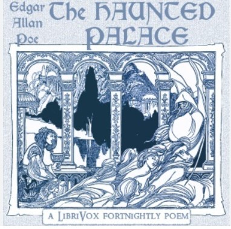

In Poe’s short story “The Fall of the House of Usher,” ‘The Haunted Palace’ is a chilling and eerily realistic portrayal of insanity. This haunting poem illustrates a decaying structure and its residents, mirroring the gradual deterioration of the human mind. The house becomes a potent metaphor for the human psyche, as its decline reflects the unraveling of one’s sanity. Poe skillfully draws parallels between these two distinct structures, crafting a powerful and unsettling narrative.

**Excerpt for You**

_“In the greenest of our valleys_

_By good angels tenanted,_

_Once a fair and stately palace—_

_Radiant palace—reared its head._

_In the monarch Thought’s dominion,_

_It stood there!”_

**Read the full poem at** [**poetryfoundation**](https://www.poetryfoundation.org/poems/52370/the-haunted-palace)

### **14\. Omens by Cecilia Llompart** 

In Cecilia Llompart’s ‘Omens,’ a strange and chilling poem, haunting images blend to explore omens, oracles, nostalgia, and dreams. The speaker’s perspective shifts to the first person in the second half, leading the reader through eerie dreams that leave them gasping for breath. The poem culminates with two thought-provoking rhetorical questions, pondering the future and what might be lost, as well as reflecting on what has already been left behind in the past. This captivating poem weaves a tapestry of dark and entrancing themes, evoking a sense of mystery and foreboding.

**Excerpt for You**

_“The dead bird, color of a bruise,_

_and smaller than an eye_

_swollen shut,_

_is king among omens._

_Who can blame the ants for feasting?_

_Let him cast the first crumb.”_

**Read the full poem at** [**Poets**](https://poets.org/poem/omens)

### **15\. All Hallows’ Eve by Dorothea Tanning**

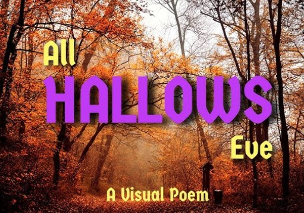

In the concise fourteen-line poem, ‘All Hallows’ Eve,’ Tanning skillfully paints a vivid picture of night, darkness, and pain. With striking language, she describes bones cracking and doom sneaking in on “rubber treads.” The poem delves into the theme of insanity among housewives, where lipstick serves as a means to tranquilize their fears. 

The final lines present a flurry of alliterative words, mentioning “tasty antidotes” and even a metaphorical werewolf. Tanning’s evocative imagery takes the reader on a haunting journey, exploring a realm of eerie sensations and captivating mysteries.

**Excerpt for You**

_“Be perfect, make it otherwise._

_Yesterday is torn in shreds._

_Lightning’s thousand sulfur eyes_

_Rip apart the breathing beds.”_

**Read the full poem at** [**poetryoutloud**](https://www.poetryoutloud.org/poem/all-hallows-eve/)

### **16\. “Song of the Terrible” By Hilda Morley**

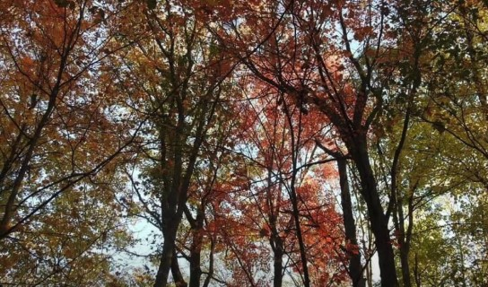

Morley’s poem sets a subtly dark and atmospheric scene, awash with the autumnal hues of fire and blood. Her writing skillfully weaves a flickering and wavering narrative, half-hidden in shadow, inviting the reader’s mind to conjure its own dark answers to the questions posed by her evocative words.

**Excerpt for You**

“the smoke cleared, my head & eyes clearing

with it, my heart lightened,

& I saw the dark-red colored

wine-dark leaf I’d chosen…”

**Read the full poem at** [**poetryfoundation**](https://www.poetryfoundation.org/poetrymagazine/browse?contentId=36928)

### **17\. “Finding the Great Dream of Hell” by  Linda Addison**

Addison, the first African American to win the Bram Stoker award, has held this prestigious honor four times. Her poem delves deeply into themes of helplessness and cosmic, natural horror, showcasing her exceptional skill. The narrator’s journey into a realm of creeping and whirling dread, whether a literal Hell or a personal one, is a testament to Addison’s ability to craft a haunting and impactful piece.

**Excerpt for You**

_“The Underworld sings_

_from earth that will_

_no longer embrace me,_

_abandoned by gravity_

_exhaling nothing_

_I still remember soft tissue.”_

**Read the full poem at** [**The Horror**](https://horror.org/in-april-bram-stoker-nominees-the-brilliant-world-of-horror-poetry/)

### **18\. “Before the Mirror” By Elizabeth Drew Barstow Stoddard**

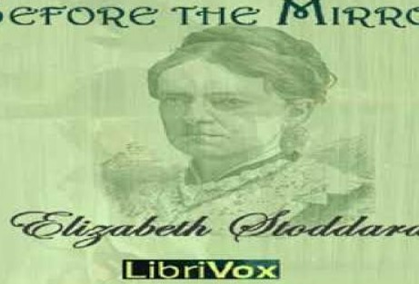

Stoddard, an underappreciated poet from the 19th century, draws upon imagery from mythology and earlier works of Tennyson to craft her Gothic scene. With her unique blend of darkness and tranquility, her poems have the power to quietly spook and unsettle the reader.

**Excerpt for You**

_“But weaving with a steady hand_

_These shadows, whether false or true,_

_I put aside a doubt which asks_

_‘Among these phantoms what are you?”_

**Read the full poem at** [**poetryfoundation**](https://www.poetryfoundation.org/poems/52059/before-the-mirror)

### **19\. “Ghost Q & A” By  Anne Carson**

Carson’s Ghost Q&A carries a disquieting rhythm, resembling a séance at first glance. Yet, the peculiar tangents in the dialogue, combined with an eerie absence of punctuation, create a strange monotone in the narrators’ exchange. This imparts a sense of helplessness and confusion, while an insistent need to be understood lingers beneath the surface. The portrayal of ghosts in this poem is gently unsettling, leaving a lasting impression. From beginning to end, it is a worthwhile read that will leave you intrigued.

**Excerpt for You**

_“Q is it crowded_

_A are you joking_

_Q are there ghosts in this room_

_A most of the objects here are ghosts…”_

**Read the full poem at** [**apublicspace**](https://apublicspace.org/magazine/detail/ghost-q-a)

### **20\. “Not Merely Because of the Unknown That Was Stalking Towards Them ” – Jenny Boully**

This prose poem exudes a deep sense of autumn, enveloping you in imagery that will make you crave a cozy blanket and a hot drink. Yet, if you look closely, you’ll detect a layer of confusion and franticness woven through its whimsical fabric. Within these words lie hundreds of possible stories, waiting to be explored on a chilly morning as the days grow shorter.

**Excerpt for You**

_“I will can the preserves; I will can the preserves so that come autumn, come autumn when I have hung up the dustpan, you will have this small bit of apricot to remember. Me by. I don’t think I quite believe in that anymore, and besides, this here tooth has fallen out…”_

**Read The full poem at** [**Poets**](https://poets.org/book/not-merely-because-unknown-was-stalking-towards-them)

## **Bottom line** 

The 20 Best **Halloween Poems** compiled for the 2023 Celebration showcase the essence of this eerie and enchanting holiday. From haunted houses and spooky tales to witches, ghosts, and pumpkins, these poems evoke a sense of mystery, excitement, and nostalgia that captivates readers of all ages. Each piece demonstrates the creativity and imagination of the poets, painting vivid pictures of the Halloween spirit in its various forms. As we immerse ourselves in the captivating verses of these poems, we find ourselves transported to a world where the boundaries between reality and the supernatural blur. The clever wordplay, haunting imagery, and rhythmic cadence combine to create an enthralling experience that leaves a lasting impression.

- [20 Most Popular Halloween Poems For All Ages](https://avada.io/loveable/blog/halloween-poems/#wp-block-heading-2-5) 
    - [1\. The Spider and the Fly by Mary Howitt](https://avada.io/loveable/blog/halloween-poems/#wp-block-heading-3-6)
    - [2\. Macklin’s Jack O’Lantern by David McCord](https://avada.io/loveable/blog/halloween-poems/#wp-block-heading-3-18)
    - [3\. Halloween Party by Kenn Nesbitt](https://avada.io/loveable/blog/halloween-poems/#wp-block-heading-3-28)
    - [4\. Halloween in the Anthropocene, 2015 by Craig Santos Perez](https://avada.io/loveable/blog/halloween-poems/#wp-block-heading-3-39)
    - [5\. Halloween by Robert Burns](https://avada.io/loveable/blog/halloween-poems/#wp-block-heading-3-52)
    - [6\. A Rhyme For Halloween by Maurice Kilwein Guevara](https://avada.io/loveable/blog/halloween-poems/#wp-block-heading-3-67)
    - [7\. Halloween by Arthur Peterson](https://avada.io/loveable/blog/halloween-poems/#wp-block-heading-3-78)
    - [8\. Theme In Yellow by Carl Sandburg](https://avada.io/loveable/blog/halloween-poems/#wp-block-heading-3-89)
    - [9\. All Hallows by Louise Glück](https://avada.io/loveable/blog/halloween-poems/#wp-block-heading-3-99)
    - [10\. Halloween by John Mayne](https://avada.io/loveable/blog/halloween-poems/#wp-block-heading-3-110)
    - [11\. The Raven by Edgar Allan Poe](https://avada.io/loveable/blog/halloween-poems/#wp-block-heading-3-123)
    - [12\. The Vampire by Conrad Aiken](https://avada.io/loveable/blog/halloween-poems/#wp-block-heading-3-132) 
    - [13\. The Haunted Palace by Edgar Allan Poe](https://avada.io/loveable/blog/halloween-poems/#wp-block-heading-3-142)
    - [14\. Omens by Cecilia Llompart](https://avada.io/loveable/blog/halloween-poems/#wp-block-heading-3-153) 
    - [15\. All Hallows’ Eve by Dorothea Tanning](https://avada.io/loveable/blog/halloween-poems/#wp-block-heading-3-163)
    - [16\. “Song of the Terrible” By Hilda Morley](https://avada.io/loveable/blog/halloween-poems/#wp-block-heading-3-173)
    - [17\. “Finding the Great Dream of Hell” by  Linda Addison](https://avada.io/loveable/blog/halloween-poems/#wp-block-heading-3-182)
    - [18\. “Before the Mirror” By Elizabeth Drew Barstow Stoddard](https://avada.io/loveable/blog/halloween-poems/#wp-block-heading-3-192)
    - [19\. “Ghost Q & A” By  Anne Carson](https://avada.io/loveable/blog/halloween-poems/#wp-block-heading-3-201)
    - [20\. “Not Merely Because of the Unknown That Was Stalking Towards Them ” – Jenny Boully](https://avada.io/loveable/blog/halloween-poems/#wp-block-heading-3-209)
- [Bottom line](https://avada.io/loveable/blog/halloween-poems/#wp-block-heading-2-214) 

### [Blake Simpson](https://avada.io/loveable/author/blake/)

Hi, I'm Blake from Loveable. I help people find perfect gifts for occasions like anniversaries and weddings. I also write a blog about holidays, sharing insights to make them more meaningful. Let's create unforgettable moments together!

- [Twitter](https://twitter.com/intent/tweet)
- [Facebook](https://www.facebook.com/sharer/sharer.php)
- [instagram](https://avada.io/loveable/blog/halloween-poems/)
- [pinterest](https://www.pinterest.com/loveablellc/)

## Related Posts

[### 120+ Christian Birthday Wishes To Spread Your Love](https://avada.io/loveable/blog/christian-birthday-wishes/) 

[

### 35 Best 70th Birthday Ideas To Celebrate The Special Milestone

](https://avada.io/loveable/blog/70th-birthday-ideas/)

[

### 50 Best 30th Birthday Decorations for a Remarkable Birthday Bash

](https://avada.io/loveable/blog/30th-birthday-decorations/)

[

### 40 Delicious Vegan Christmas Desserts to Delight Your Palate

](https://avada.io/loveable/blog/vegan-christmas-desserts/)

[

### 60 Christmas Team Building Activities to Boost Workplace Spirit

](https://avada.io/loveable/blog/christmas-team-building-activities/)
