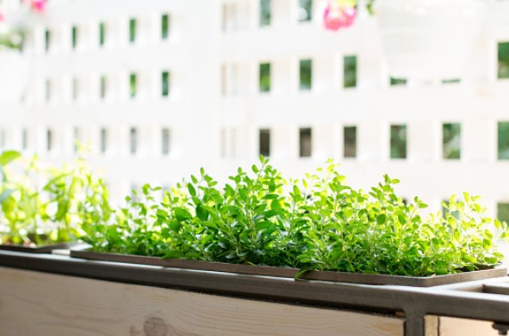

This article has been written and researched by our expert Loveable through a precise methodology. [Learn more about our methodology](https://avada.io/loveable/our-methodological.html)

[Loveable](https://avada.io/loveable/) > [Blog](https://avada.io/loveable/blog/) > [Family](https://avada.io/loveable/family/)

# 20 Best Ideas For Gardening Activities In 2023

Written by [Rose Bryne](https://avada.io/loveable/author/rose/) Last Updated on August 22, 2023

- [10 Fun and Rewarding Gardening Activities of All Ages](https://avada.io/loveable/blog/gardening-activities-ideas/#wp-block-heading-2-4) 
    - [1\. Picking Fruits Or Vegetables](https://avada.io/loveable/blog/gardening-activities-ideas/#wp-block-heading-3-5)
    - [2\. Paint The Pots](https://avada.io/loveable/blog/gardening-activities-ideas/#wp-block-heading-3-8)
    - [3\. Make Decoration Rock](https://avada.io/loveable/blog/gardening-activities-ideas/#wp-block-heading-3-10)
    - [4\. Catch and Learn about Insects](https://avada.io/loveable/blog/gardening-activities-ideas/#wp-block-heading-3-12)
    - [5\. Watering the Plants](https://avada.io/loveable/blog/gardening-activities-ideas/#wp-block-heading-3-15) 
    - [6\. Pulling Wild Plants](https://avada.io/loveable/blog/gardening-activities-ideas/#wp-block-heading-3-17)
    - [7\. Garden Cleaning](https://avada.io/loveable/blog/gardening-activities-ideas/#wp-block-heading-3-19) 
    - [8\. Plant Herb Garden](https://avada.io/loveable/blog/gardening-activities-ideas/#wp-block-heading-3-22)
    - [9\. Make Dishes from Vegetables in the Garden](https://avada.io/loveable/blog/gardening-activities-ideas/#wp-block-heading-3-24) 
    - [10\. Composting The Soil](https://avada.io/loveable/blog/gardening-activities-ideas/#wp-block-heading-3-26)
- [10 Ideas to Make Gardening More Enjoyable With Kids](https://avada.io/loveable/blog/gardening-activities-ideas/#wp-block-heading-2-29)
    - [1\. Eggshell Garden](https://avada.io/loveable/blog/gardening-activities-ideas/#wp-block-heading-3-30)
    - [2\. Vegetable Regrowing](https://avada.io/loveable/blog/gardening-activities-ideas/#wp-block-heading-3-32) 
    - [3\. Make a Greenhouse out of a Plastic Bottle.](https://avada.io/loveable/blog/gardening-activities-ideas/#wp-block-heading-3-35)
    - [4\. Make a potted plant with a toilet paper core](https://avada.io/loveable/blog/gardening-activities-ideas/#wp-block-heading-3-37)
    - [5\. Tin Can Flower Pots](https://avada.io/loveable/blog/gardening-activities-ideas/#wp-block-heading-3-39)
    - [6\. Rainboot Plant Pots](https://avada.io/loveable/blog/gardening-activities-ideas/#wp-block-heading-3-42)
    - [7\. LEGO Plant Pots](https://avada.io/loveable/blog/gardening-activities-ideas/#wp-block-heading-3-44)
    - [8\. Miniature Garden](https://avada.io/loveable/blog/gardening-activities-ideas/#wp-block-heading-3-46) 
    - [9\. DIY Popsicle Stick Garden](https://avada.io/loveable/blog/gardening-activities-ideas/#wp-block-heading-3-49)
    - [10\. DIY Bird Feeders and Baths](https://avada.io/loveable/blog/gardening-activities-ideas/#wp-block-heading-3-51)
- [Child Safety in the Garden](https://avada.io/loveable/blog/gardening-activities-ideas/#wp-block-heading-2-53)
- [Bottom Line](https://avada.io/loveable/blog/gardening-activities-ideas/#wp-block-heading-2-57) 

**Gardening activities** are a pastime that has been practiced for generations, but it has been growing popular today. Let’s think of contemplating an artwork garden after a long working day when you get exhausted from the hustle and bustle of the city and the pressure of [office work](https://avada.io/loveable/balancing-work-and-family-life/).  Take a deep breath with the natural scents in the homemade garden. 

Whether you’re a seasoned gardener or a novice, there’s always something new to discover. Gardening is becoming even more popular in 2023 as people seek ways to bond with nature, especially older ones. Most of them said that making friends with nature is the best way to enjoy a peaceful life. Many gardening ideas will work for you even, if you have vast land or not. A small space on the balcony is still Ok for a mini garden.

With the new year upon us, It’s time to prepare for the forthcoming gardening season ideas. So, whether you want to start a new pastime, teach your children about wildlife, or simply enjoy the [outdoors](https://avada.io/loveable/family-outdoor-activities/), etc. Just get started!

## **10 Fun and Rewarding Gardening Activities of All Ages** 

### **1\. Picking Fruits Or Vegetables**

It’s a hands-on experience that lets us witness the results of their efforts. Collect what you have cultivated for a while; that is the time to celebrate achievements. It may also be a social activity where family and friends gather to select and share their harvest.

### **2\. Paint The Pots**

It’s amazing to make your own artwork; let’s try with the pots of plants. Painting pots is to add some personality to your garden. You can also repurpose old pots by giving them a new coat of paint. Very environmentally friendly, right? Take everything that can be containers to unleash your creativity.

### **3\. Make Decoration Rock**

You can make something special with some ugly rocks surrounding the garden. Collect some rocks and properly wash them. Then, use paint or markers to embellish them with diverse designs. Once the rocks have dried, carefully scatter them throughout your garden to offer a unique background.

### **4\. Catch and Learn about Insects**

Many insects will undoubtedly be attracted to congregate in your lush garden. An excellent way to observe and learn about insects that educate and foster a sense of respect for the natural world. After examining insects, you should be reminded to release them back into the garden. 

### **5\. Watering the Plants** 

Sure, anyone can water a garden but be careful, as not all plants have the same need for water. It not only keeps the plants well alive, but it also teaches responsibility for living things. It is important to know the right quantity of water required for various plants and how frequently they should be watered. 

### **6\. Pulling Wild Plants**

The cleaning step is indispensable to having a domestic garden. It helps in the removal of weeds and maintains the yard neat. Make a challenge to see who can pluck the most weeds in the shortest period of time. Besides, picking weeds by hand is a more environmentally friendly option than the way using herbicides.

### **7\. Garden Cleaning** 

It involves removing weeds, dead leaves, and other debris that can attract pests or diseases. Keep it as beautiful as possible because it is your dreamy place to take a rest. 

### **8\. Plant Herb Garden**

Herb gardens beautify your outside area which may be used in cooking and as medicine. Choose types of herbs you love that thrive in your lands and give them adequate nourishment. Create a one-of-a-kind herb garden arrangement to make your garden stand out.

### **9\. Make Dishes from Vegetables in the Garden** 

The whole family can participate in making meals from garden veggies is a delightful pastime. You may attempt a variety of recipes, ranging from basic salads to more sophisticated meals. It’s a fantastic time to taste different dishes from your own garden – an experience that cannot be created by store-bought produce.

### **10\. Composting The Soil**

This is to provide nutrient-rich soil for fertilizing plants. Composting is an excellent approach to learn about sustainability and the need for waste reduction. It’s also an effective way to save money on fertilizer while lowering your carbon footprint.

## **10 Ideas to Make Gardening More Enjoyable With Kids**

### **1\. Eggshell Garden**

Kids are really into creativity with simple products. An easy way to start would be with herbs because it’s often small and easy to grow. The majority of the items are simply accessible in your kitchen. You’ll need egg cartons or a simple seed starting kit to get started, as well as clean eggshells. 

### **2\. Vegetable Regrowing** 

It’s a simple and inexpensive technique that you may incorporate into your normal culinary regimen. Examples include avocado, basil, carrots, and other foods that may be regrown. You may simply begin the regrowing process in the kitchen by putting the veggies in water or a tiny bit of soil.

### **3\. Make a Greenhouse out of a Plastic Bottle.**

Use available plastic bottles to build a Fortnite (dreamy home for most children). You may grow seedlings inside and minimize garbage in the ocean by recycling plastic bottles (instead of throwing them into the garbage). Making a tiny plastic greenhouse both teaches your babies to protect the environment and pushes their creativity.

### **4\. Make a potted plant with a toilet paper core**

You may use the empty tubes to start seeds. This is an excellent method to reuse something that would otherwise be discarded while also giving your seedlings a head start in the planting process. Motivate them by holding a competition to find who makes the best Tube.  

### **5\. Tin Can Flower Pots**

Paint, draw or do anything you can to make colorful tins to accent the garden. A simple DIY technique may transform regular tin cans into eye-catching planters. You may hang them to add color to a chain-link fence filled with greenery.

### **6\. Rainboot Plant Pots**

Don’t get rid of your children’s rain boots just because they’ve outgrown them! Rain boots are frequently thrown by children since they outgrow them soon. Instead of throwing away old rain boots, rework them into planters in your yard. 

### **7\. LEGO Plant Pots**

LEGO is a popular childhood toy that almost every child has. However, after a short period of play, toddlers frequently spread an excess of blocks across your home. Why not utilize them to create a thriving planter system? With highly skilled, it is promised to be constructed the unique planters by kids. 

### **8\. Miniature Garden** 

It is possible to accomplish this using modest items. Encourage children to create the garden using their imaginations, adding natural features to make it more lifelike. 

### **9\. DIY Popsicle Stick Garden**

You may build small garden beds, trellises, and even fences out of popsicle sticks. When your garden is finished, place it on a windowsill or use it as a centerpiece for an outside table.

### **10\. DIY Bird Feeders and Baths**

A great idea to attract birds to your dreamy garden. Put it somewhere in your garden (tree) and watch the birds come to enjoy it. The kids will be very happy to welcome new friends.

## **Child Safety in the Garden**

Certain precautions must be taken to protect the safety of youngsters in the garden. To begin, use instruments that are appropriate for their size to avoid injuries. Besides, keep sprays and fertilizers out of reach of children and avoid using chemicals as much as possible; instead, practice organic gardening. Equipment and tools should be kept in a secure location where children cannot reach them. 

_**Related**_: [Gifts for Gardeners](https://avada.io/loveable/gifts-gardeners/)

## **Bottom Line** 

It’s amazing to create a secret base where you can stay without any worry. Gardening activities are fantastic ways that may give several advantages to people of all ages, particularly youngsters. You can make gardening interesting and educational for your children by using these **20 Best Ideas For Gardening Activities In 2023**.

Overall, gardening can be a rewarding activity that develops creativity, responsibility, and collaboration while also teaching everyone about the natural world. So, let’s go planting and have some fun in 2023!

- [10 Fun and Rewarding Gardening Activities of All Ages](https://avada.io/loveable/blog/gardening-activities-ideas/#wp-block-heading-2-4) 
    - [1\. Picking Fruits Or Vegetables](https://avada.io/loveable/blog/gardening-activities-ideas/#wp-block-heading-3-5)
    - [2\. Paint The Pots](https://avada.io/loveable/blog/gardening-activities-ideas/#wp-block-heading-3-8)
    - [3\. Make Decoration Rock](https://avada.io/loveable/blog/gardening-activities-ideas/#wp-block-heading-3-10)
    - [4\. Catch and Learn about Insects](https://avada.io/loveable/blog/gardening-activities-ideas/#wp-block-heading-3-12)
    - [5\. Watering the Plants](https://avada.io/loveable/blog/gardening-activities-ideas/#wp-block-heading-3-15) 
    - [6\. Pulling Wild Plants](https://avada.io/loveable/blog/gardening-activities-ideas/#wp-block-heading-3-17)
    - [7\. Garden Cleaning](https://avada.io/loveable/blog/gardening-activities-ideas/#wp-block-heading-3-19) 
    - [8\. Plant Herb Garden](https://avada.io/loveable/blog/gardening-activities-ideas/#wp-block-heading-3-22)
    - [9\. Make Dishes from Vegetables in the Garden](https://avada.io/loveable/blog/gardening-activities-ideas/#wp-block-heading-3-24) 
    - [10\. Composting The Soil](https://avada.io/loveable/blog/gardening-activities-ideas/#wp-block-heading-3-26)
- [10 Ideas to Make Gardening More Enjoyable With Kids](https://avada.io/loveable/blog/gardening-activities-ideas/#wp-block-heading-2-29)
    - [1\. Eggshell Garden](https://avada.io/loveable/blog/gardening-activities-ideas/#wp-block-heading-3-30)
    - [2\. Vegetable Regrowing](https://avada.io/loveable/blog/gardening-activities-ideas/#wp-block-heading-3-32) 
    - [3\. Make a Greenhouse out of a Plastic Bottle.](https://avada.io/loveable/blog/gardening-activities-ideas/#wp-block-heading-3-35)
    - [4\. Make a potted plant with a toilet paper core](https://avada.io/loveable/blog/gardening-activities-ideas/#wp-block-heading-3-37)
    - [5\. Tin Can Flower Pots](https://avada.io/loveable/blog/gardening-activities-ideas/#wp-block-heading-3-39)
    - [6\. Rainboot Plant Pots](https://avada.io/loveable/blog/gardening-activities-ideas/#wp-block-heading-3-42)
    - [7\. LEGO Plant Pots](https://avada.io/loveable/blog/gardening-activities-ideas/#wp-block-heading-3-44)
    - [8\. Miniature Garden](https://avada.io/loveable/blog/gardening-activities-ideas/#wp-block-heading-3-46) 
    - [9\. DIY Popsicle Stick Garden](https://avada.io/loveable/blog/gardening-activities-ideas/#wp-block-heading-3-49)
    - [10\. DIY Bird Feeders and Baths](https://avada.io/loveable/blog/gardening-activities-ideas/#wp-block-heading-3-51)
- [Child Safety in the Garden](https://avada.io/loveable/blog/gardening-activities-ideas/#wp-block-heading-2-53)
- [Bottom Line](https://avada.io/loveable/blog/gardening-activities-ideas/#wp-block-heading-2-57) 

### [Rose Bryne](https://avada.io/loveable/author/rose/)

Hi, I'm Rose! I love animals and spending time with kids. At Loveable, I help people find unique gifts for special occasions like Valentine's Day, housewarmings, and graduations. I enjoy finding gifts for kids, teens, and animal lovers that match their interests and personalities. Making gift-giving a pleasant experience is my priority. Let me assist you in finding the perfect gift!

- [Twitter](https://twitter.com/intent/tweet)
- [Facebook](https://www.facebook.com/sharer/sharer.php)
- [instagram](https://avada.io/loveable/blog/gardening-activities-ideas/)
- [pinterest](https://www.pinterest.com/loveablellc/)

## Related Posts

[### 30 Best 4 Year Old Birthday Party Ideas For A Memorable Celebration](https://avada.io/loveable/blog/4-year-old-birthday-party-ideas/) 

[

### 16th Birthday Party Ideas to Make an Unforgettable Day

](https://avada.io/loveable/blog/16th-birthday-party-ideas/)

[

### 150+ Inspirational Birthday Quotes to Spread Joy on Special Day

](https://avada.io/loveable/blog/inspirational-birthday-quotes/)

[

### 160+ Birthday Wishes for Wife to Express Eternal Love

](https://avada.io/loveable/blog/birthday-wishes-for-wife/)

[### 90+ Heart Touching Birthday Wishes for Niece to Make Her Day Extra Special](https://avada.io/loveable/blog/birthday-wishes-for-niece/)
