This article has been written and researched by our expert Loveable through a precise methodology. [Learn more about our methodology](https://avada.io/loveable/our-methodological.html)

[Loveable](https://avada.io/loveable/) > [Blog](https://avada.io/loveable/blog/) > [Holiday](https://avada.io/loveable/holiday/)

# 20+ Best Kid Christmas Story on Christmas Eve

Written by [Blake Simpson](https://avada.io/loveable/author/blake/) Last Updated on September 12, 2023

- [20+ Best Amazing Kid Christmas Stories for Bedtime](https://avada.io/loveable/blog/kid-christmas-story/#wp-block-heading-2-2)
    - [1\. A Christmas Carol](https://avada.io/loveable/blog/kid-christmas-story/#wp-block-heading-3-3)
    - [2\. Story Of Santa Clause](https://avada.io/loveable/blog/kid-christmas-story/#wp-block-heading-3-6)
    - [3\. The Little Christmas Tree](https://avada.io/loveable/blog/kid-christmas-story/#wp-block-heading-3-9)
    - [4\. The Gift of the Magi](https://avada.io/loveable/blog/kid-christmas-story/#wp-block-heading-3-12)
    - [5\. How Winston Delivered Christmas](https://avada.io/loveable/blog/kid-christmas-story/#wp-block-heading-3-15)
    - [6\. The Animals’ Christmas Eve](https://avada.io/loveable/blog/kid-christmas-story/#wp-block-heading-3-18)
    - [7\. Mortimer’s Christmas Manger](https://avada.io/loveable/blog/kid-christmas-story/#wp-block-heading-3-21)
    - [8\. The Girl Who Saved Christmas](https://avada.io/loveable/blog/kid-christmas-story/#wp-block-heading-3-24)
    - [9\. The Polar Express](https://avada.io/loveable/blog/kid-christmas-story/#wp-block-heading-3-27)
    - [10\. Rudolph The Red Nosed Reindeer](https://avada.io/loveable/blog/kid-christmas-story/#wp-block-heading-3-30)
    - [11\. The Elves And The Shoemaker Story](https://avada.io/loveable/blog/kid-christmas-story/#wp-block-heading-3-33)
    - [12\. The NutCracker](https://avada.io/loveable/blog/kid-christmas-story/#wp-block-heading-3-36)
    - [13\. Twas The Night Before Christmas Story](https://avada.io/loveable/blog/kid-christmas-story/#wp-block-heading-3-39)
    - [14\. The Carpenter’s Gift](https://avada.io/loveable/blog/kid-christmas-story/#wp-block-heading-3-42)
    - [15\. How the Grinch Stole Christmas](https://avada.io/loveable/blog/kid-christmas-story/#wp-block-heading-3-45)
    - [16\. The Candymaker’s Gift](https://avada.io/loveable/blog/kid-christmas-story/#wp-block-heading-3-48)
    - [17\. The Night Before Christmas](https://avada.io/loveable/blog/kid-christmas-story/#wp-block-heading-3-51)
    - [18\. Little Drummer Boy](https://avada.io/loveable/blog/kid-christmas-story/#wp-block-heading-3-54)
    - [19\. The Pine Tree Parable](https://avada.io/loveable/blog/kid-christmas-story/#wp-block-heading-3-57)
    - [20\. The Little Fir Tree](https://avada.io/loveable/blog/kid-christmas-story/#wp-block-heading-3-60)
    - [21\. The Velveteen Rabbit](https://avada.io/loveable/blog/kid-christmas-story/#wp-block-heading-3-63)
    - [22\. Dream Snow](https://avada.io/loveable/blog/kid-christmas-story/#wp-block-heading-3-66)
    - [23\. A Simple Christmas On The Farm](https://avada.io/loveable/blog/kid-christmas-story/#wp-block-heading-3-69)
    - [24\. The Snowman](https://avada.io/loveable/blog/kid-christmas-story/#wp-block-heading-3-72)
    - [25\. Mr. Willowby’s Christmas Tree](https://avada.io/loveable/blog/kid-christmas-story/#wp-block-heading-3-75)
- [Bottom Line](https://avada.io/loveable/blog/kid-christmas-story/#wp-block-heading-2-82)

The tradition of reading heartwarming kid Christmas stories on Christmas Eve is cherished, bringing families closer together and kindling the spirit of wonder and joy in young hearts. Whether you’re looking for classic favorites or new enchanting discoveries, these kid Christmas stories will captivate and inspire, making this Christmas Eve a truly special and memorable occasion.

## **20+ Best Amazing Kid Christmas Stories for Bedtime**

### **1**. [**A Christmas Carol**](https://www.amazon.com/Christmas-Carol-Charles-Dickens/dp/1503212831)

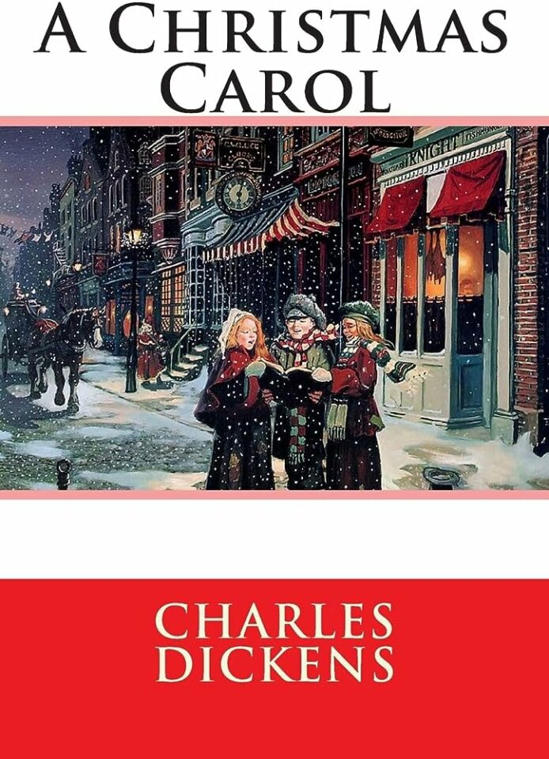

“A Christmas Carol” is a timeless tale that has captured readers’ hearts for generations. The story follows Ebenezer Scrooge, a cold-hearted and miserly old man, on a night of awakening. Guided by the spirits of Christmas Past, Present, and Yet to Come, Scrooge is shown the impact of his own actions and the dire consequences of his callous ways. The novella’s power lies in its ability to capture the true spirit of the holiday season while delivering a heartfelt message about the potential for change within even the most hardened of hearts.

### **2\. [Story Of Santa Clause](https://www.amazon.com/Story-Santa-Claus-Scribbler-Elf/dp/1878685457)**

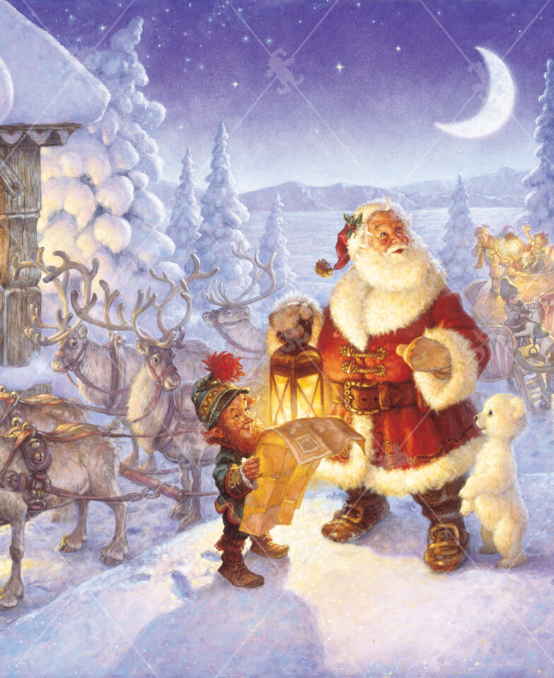

Set in a distant time, the story unfolds with a humble toymaker named Nicholas, who resides in a picturesque village. Struck by the plight of the less fortunate during winter, Nicholas embarks on a remarkable journey, eventually evolving into the iconic figure known as Santa Claus. The narrative beautifully weaves together themes of generosity, compassion, and the magic of the holiday spirit, resonating with readers of all ages.

### **3\. [The Little Christmas Tree](https://www.amazon.com/Little-Christmas-Tree-Loek-Koopmans/dp/0863157173)**

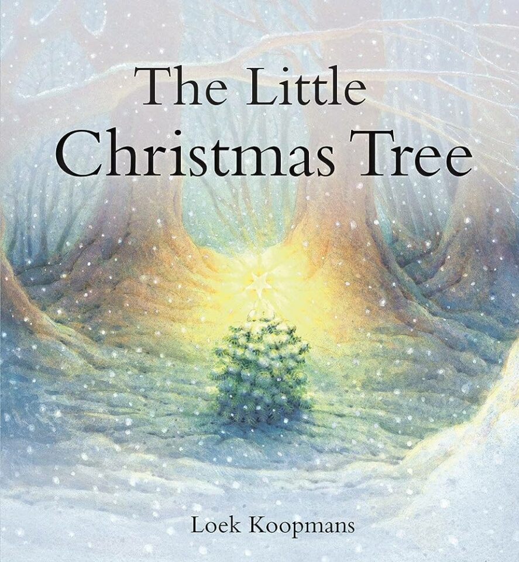

“The Little Christmas Tree” is a heartwarming tale that captures the essence of the holiday spirit. Set in a quaint village, the story revolves around a small and seemingly insignificant Christmas tree that yearns to be chosen by a family for their festive celebrations. Through its journey, the story beautifully highlights themes of self-discovery, perseverance, and the true meaning of Christmas.

### **4\. [The Gift of the Magi](https://www.amazon.com/Gift-Holiday-Classics-Illustrated-Lynch/dp/0763635308)**

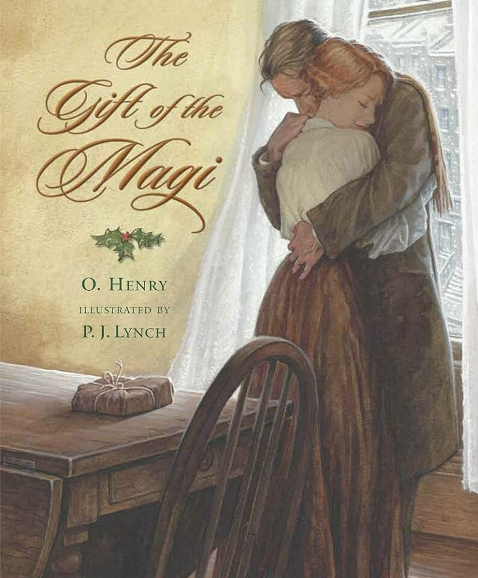

It follows the lives of a young married couple, Jim and Della, who are struggling financially. The story revolves around their desire to buy each other meaningful gifts despite their limited means. What makes this tale captivating is the unexpected twist—Jim and Della make sacrifices that perfectly align with their partner’s most cherished possession, highlighting the depth of their love and the true spirit of giving.

### **5\. [How Winston Delivered Christmas](https://www.amazon.com/Winston-Delivered-Christmas-Alex-Smith/dp/1684129834)**

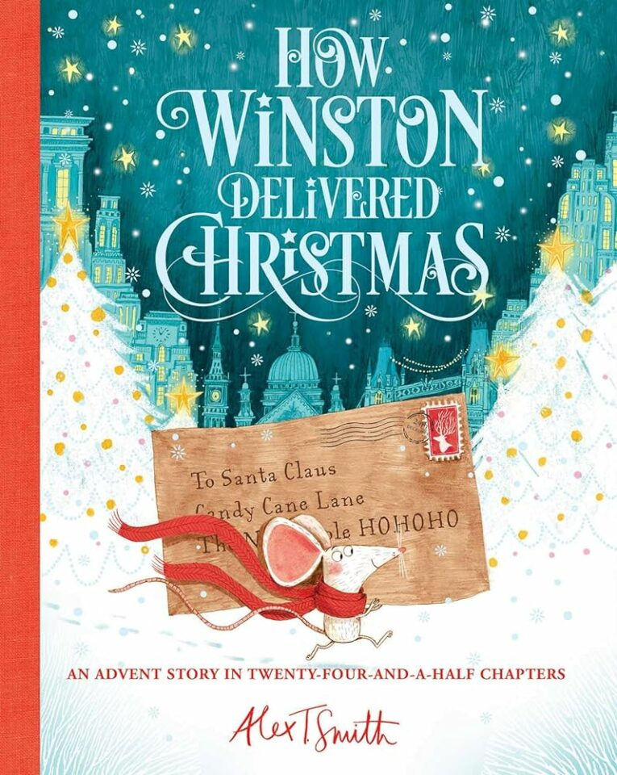

Set in the wintery backdrop of London during the 1930s, the story unfolds as Winston stumbles upon a letter meant for Santa Claus. With a heart full of determination, he embarks on an extraordinary adventure to ensure the letter reaches its destination in time for Christmas. This enchanting narrative captures the magic of Christmas and celebrates the power of kindness and the joy of unexpected friendships.

### **6\. [The Animals’ Christmas Eve](https://www.amazon.com/Animals-Christmas-Little-Golden-Book/dp/0375839232)**

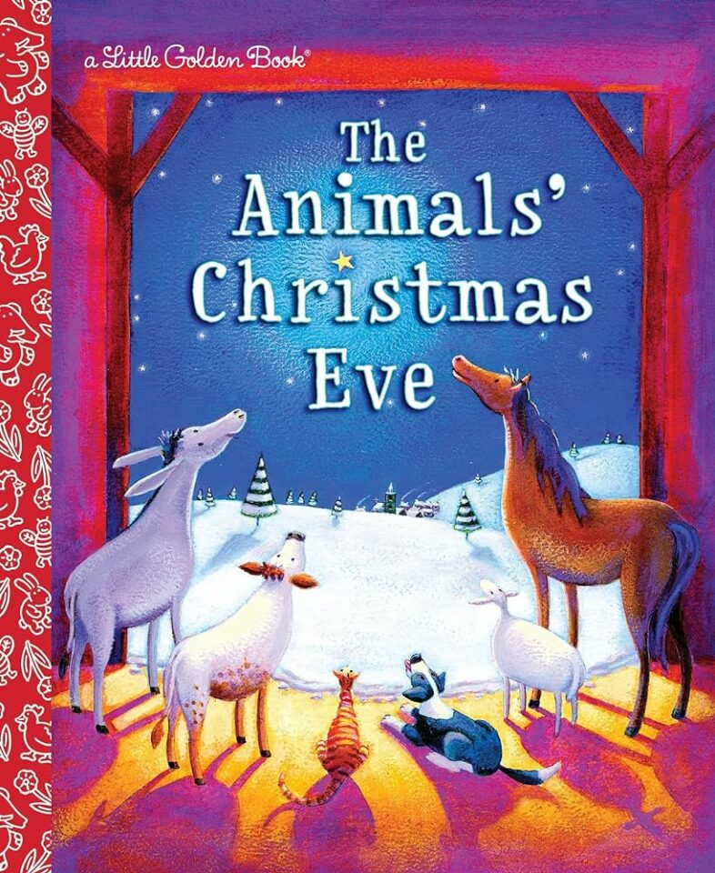

“The Animals’ Christmas Eve” unfolds on a magical night when animals from various habitats and corners of the earth come together to celebrate the birth of baby Jesus in Bethlehem. Through vivid and charming illustrations, the narrative highlights animals’ anticipation and joy as they witness the miraculous event. 

### **7\. [Mortimer’s Christmas Manger](https://www.amazon.com/Mortimers-Christmas-Manger-Karma-Wilson/dp/1416950494)**

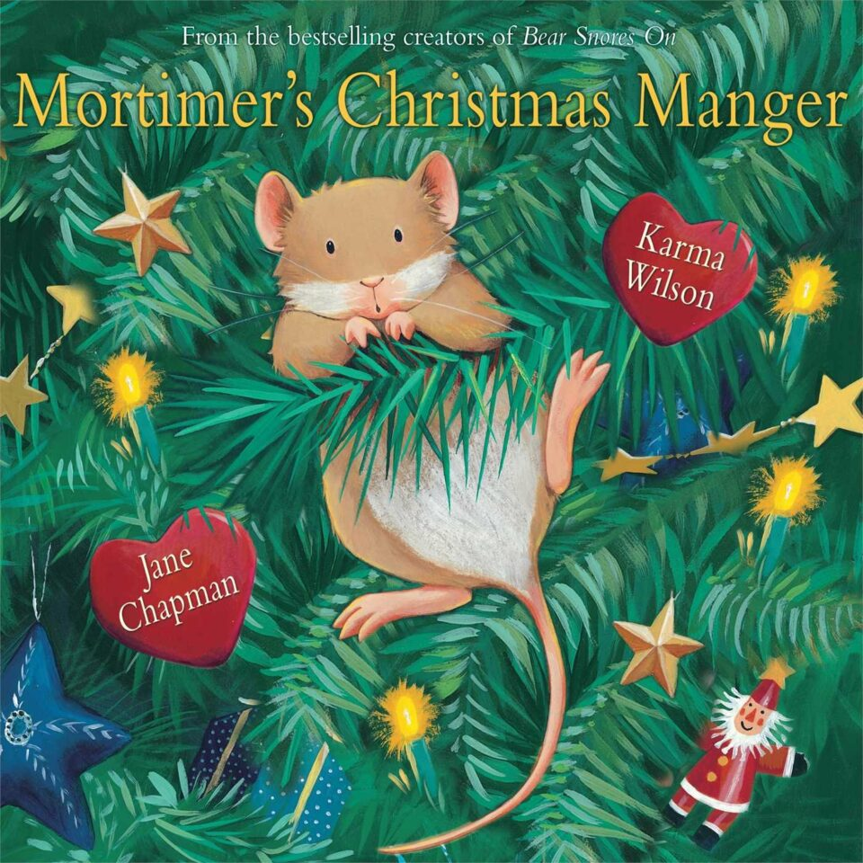

The story beautifully emphasizes the joy of giving and the unexpected ways to find connection and understanding in the most unlikely places. Set in a dusty attic, Mortimer discovers the miniature figures of Mary, Joseph, and Baby Jesus, which he initially mistakes for a real home. Intrigued by the scene, Mortimer decides to make the manger his own, adorning it with bits and pieces he collects around the attic.

### **8\. [The Girl Who Saved Christmas](https://www.amazon.com/Girl-Who-Saved-Christmas/dp/1782118578)**

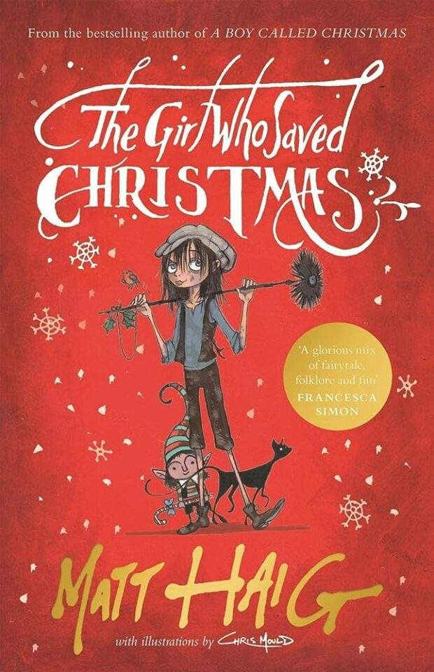

“The Girl Who Saved Christmas” follows the adventurous journey of Lily, a curious and kind-hearted young girl who discovers that Santa’s magic is fading, jeopardizing Christmas for children worldwide. It’s a heartwarming and enchanting tale that will inspire young readers to believe in the season’s magic and the power of kindness.

### **9\. [The Polar Express](https://www.amazon.com/Polar-Express-anniversary-Chris-Allsburg/dp/0544580141)**

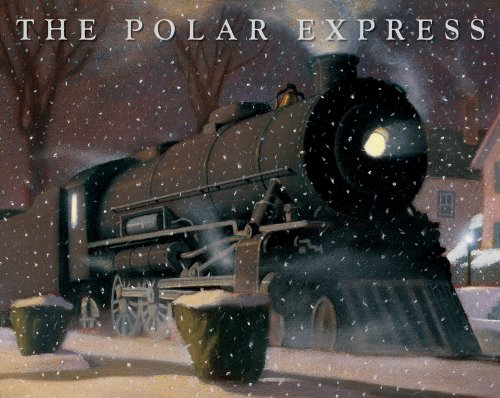

The story captures the essence of childhood wonder and the power of belief as the protagonist embarks on a breathtaking adventure aboard a mysterious train headed for the North Pole. Filled with captivating illustrations and vivid imagery, the narrative seamlessly weaves together themes of friendship, courage, and the spirit of the holiday season.

### **10\. [Rudolph The Red Nosed Reindeer](https://www.amazon.com/Rudolph-the-Red-Nosed-Reindeer/dp/B01M74J8Z9)**

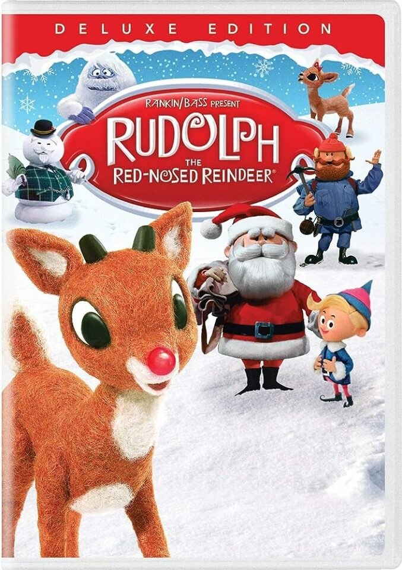

The tale revolves around Rudolph, a young reindeer with a luminous red nose that sets him apart from his peers. As he struggles with being different and facing rejection, Rudolph’s journey takes an unexpected turn when his unique trait becomes his greatest asset. The story teaches valuable lessons about self-acceptance, embracing individuality, and the power of kindness.

### **11\. [The Elves And The Shoemaker Story](https://www.amazon.com/Elves-Shoemaker-Jacob-Grimm/dp/0811834778)**

In this heartwarming story, the main character, a skilled yet destitute shoemaker, finds himself on the brink of ruin due to his financial troubles. Unexpectedly, the shoemaker’s fortunes take a miraculous turn when he discovers that his unfinished work is being completed during the night by a duo of mysterious elves. This delightful narrative explores themes of generosity, kindness, and the belief in the extraordinary.

### **12\. [The NutCracker](https://www.amazon.com/Nutcracker-T-Hoffmann/dp/0385348649)**

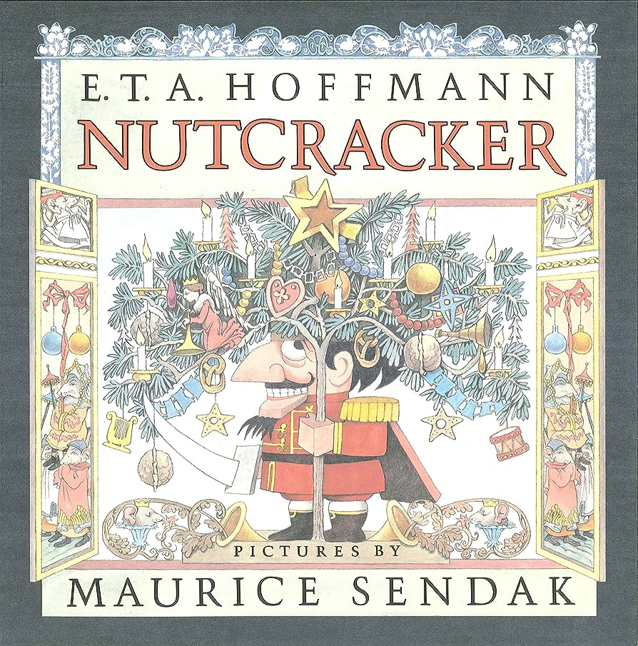

“The Nutcracker” is a beloved holiday tale that weaves together enchantment and adventure. Set in a whimsical world of magic and imagination, the story follows a young girl named Clara who receives a nutcracker doll from her mysterious godfather Drosselmeyer, on Christmas Eve. The story’s blend of whimsical elements, intricate dance sequences, and a journey through dreamlike landscapes between reality and imagination.

### **13\. [Twas The Night Before Christmas Story](https://www.amazon.com/Night-Before-Christmas-Illustrated-Children/dp/B0BLR6YXNX/)**

Written by Clement Clarke Moore, the story vividly paints the scene on Christmas Eve, where a father awakens to the magical presence of Santa Claus in his home. The poem captures the excitement and anticipation of children awaiting Santa’s arrival, describing his sleigh, reindeer, and jolly appearance.

### **14\. [The Carpenter’s Gift](https://www.amazon.com/Carpenters-Gift-Christmas-Rockefeller-Center/dp/0375869220)**

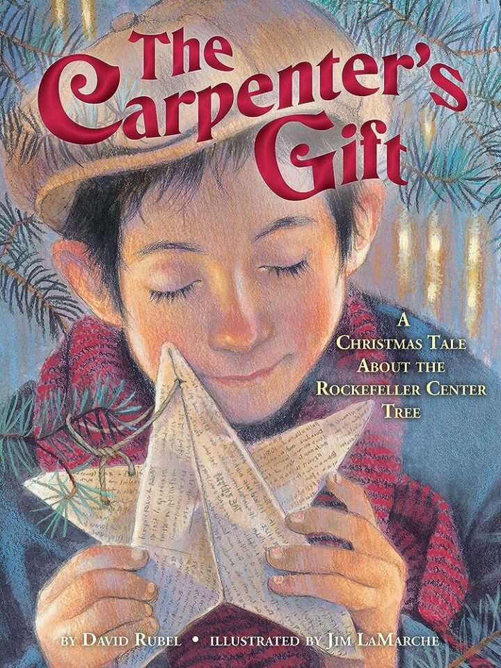

Set against the backdrop of Depression-era New York City, the story follows a young boy named Henry who sells Christmas trees to support his struggling family. Through a chance encounter, Henry meets a kind-hearted carpenter who offers him a job. The carpenter, inspired by Henry’s plight, teaches him the value of generosity by introducing him to a tradition that holds the power to change lives. 

### **15\. [How the Grinch Stole Christmas](https://www.amazon.com/Grinch-Stole-Christmas-Classic-Seuss/dp/0394800796)**

“How the Grinch Stole Christmas” revolves around the curmudgeonly Grinch’s quest to undermine the Christmas festivities of the cheerful town of Whoville. Driven by his disdain for the holiday’s commercialism, the Grinch hatches a plan to steal all the presents, decorations, and joy from the Whos on Christmas Eve. However, as he witnesses their unshakable holiday spirit, the Grinch experiences a change of heart even without material possessions. 

### **16\. [The Candymaker’s Gift](https://www.amazon.com/Candymakers-Gift-Helen-David-Haidle/dp/1593174020)**

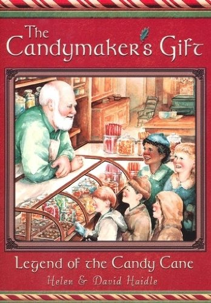

Set in a charming village, the story follows a gifted candymaker named Oliver, known for crafting delectable treats that spread joy throughout the community. However, the story takes a captivating turn when Oliver unveils his most extraordinary creation yet: a candy that grants the person who receives it their deepest, unspoken wish. “The Candymaker’s Gift” becomes a timeless reminder of the power of kindness and the magic in small acts and heartfelt intentions.

### **17\. [The Night Before Christmas](https://www.amazon.com/Night-Before-Christmas-Charles-Santore/dp/1604332379)**

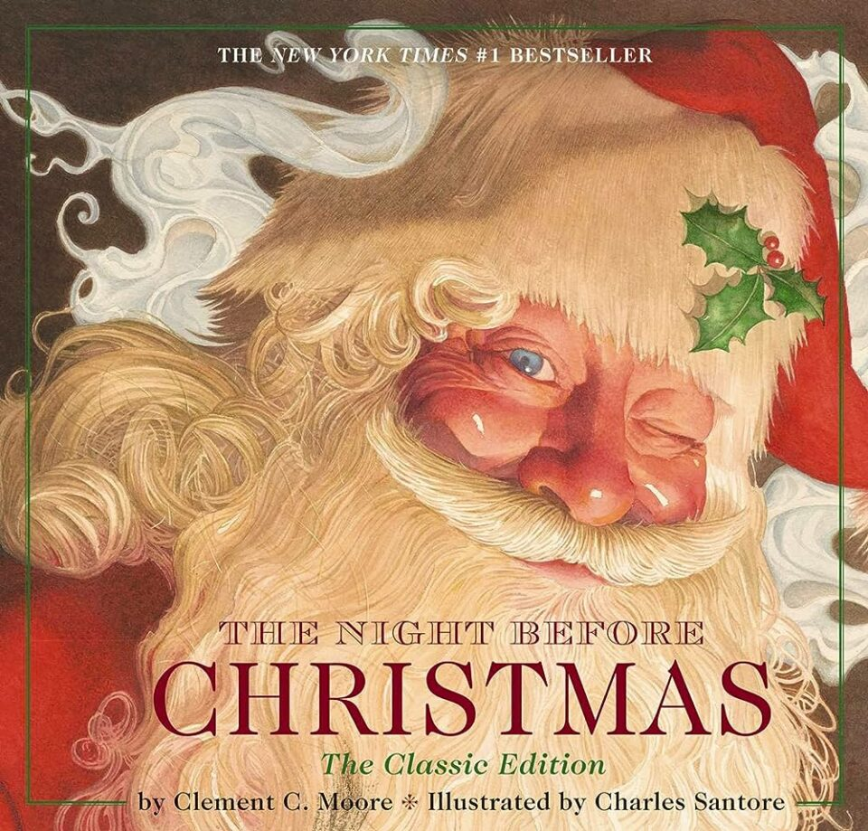

This enchanting tale captures the anticipation and magic of Christmas Eve as seen through the eyes of a child. The poem vividly describes the scene of a quiet and cozy household on the night before Christmas, with children nestled in their beds, and a father’s excitement building as he awaits the arrival of Santa Claus.

### **18\. [Little Drummer Boy](https://www.amazon.com/Little-Drummer-Ezra-Jack-Keats/dp/0140567437)**

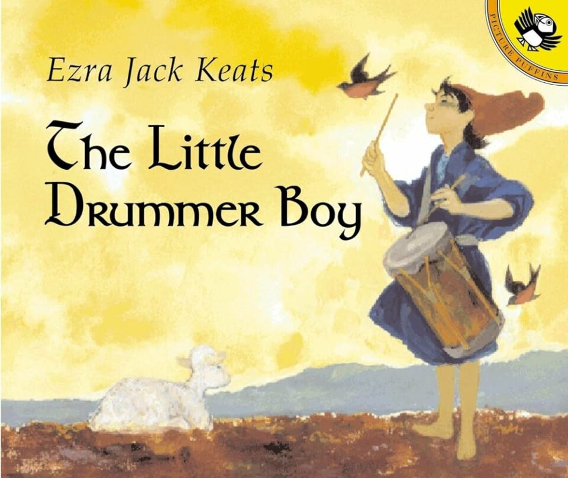

The story follows a young, impoverished drummer boy named Aaron, who encounters the biblical scene of the nativity. With no gift to present to the newborn Jesus, Aaron uses his drumming skills to play a heartfelt tune, expressing his love and devotion. This timeless narrative captures the essence of Christmas by emphasizing the significance of offering what one has, regardless of its material worth.

### **19\. [The Pine Tree Parable](https://www.amazon.com/Pine-Tree-Parable-Special-ebook/dp/B003RCJCS4)**

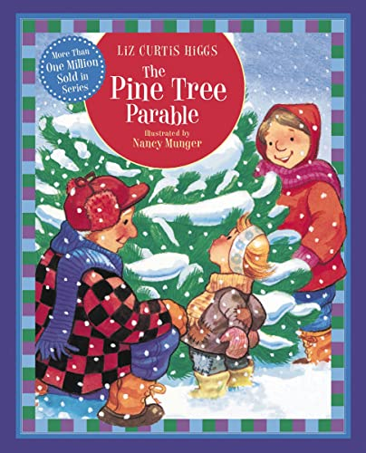

In this story, a young woman named Liz finds herself in a predicament when she stumbles upon a small, scraggly pine tree while Christmas shopping. Rather than discarding it as insignificant, she recognizes its potential and nurtures and cares for it, eventually transforming it into a magnificent Christmas tree. This parable highlights the power of compassion and the hidden beauty within simple acts of kindness. 

### **20\. [The Little Fir Tree](https://www.amazon.com/Little-Fir-Tree-Christopher-Corr/dp/1786036622)**

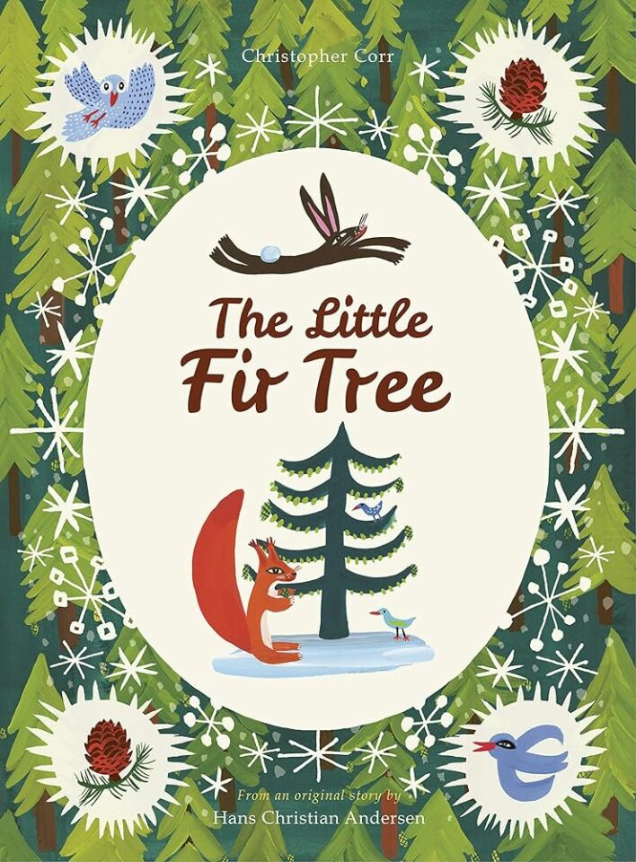

The story follows the journey of a small fir tree from its humble beginnings in the forest to its eventual destiny.  As it grows, it witnesses various seasons and experiences, including the joyous celebrations of Christmas. Through its experiences, the story beautifully captures the themes of longing, innocence, and the bittersweet passage of time, making it a timeless tale that resonates with readers of all ages.

### **21\. [The Velveteen Rabbit](https://www.amazon.com/Velveteen-Rabbit-Margery-Williams/dp/0385375662)**

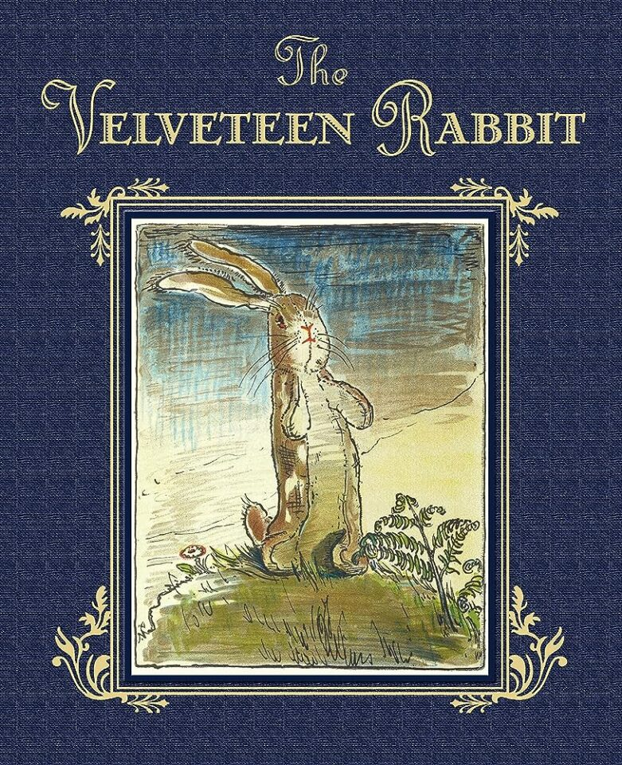

“The Velveteen Rabbit” is a heartwarming children’s story. Abandoned and initially overlooked by other toys, the velveteen rabbit befriends a wise old Skin Horse who imparts wisdom about transforming from a mere plaything to a living being. The story beautifully explores themes of love, friendship, and the power of belief. 

### **22\. [Dream Snow](https://www.amazon.com/Dream-Snow-Eric-Carle/dp/B0002TX5B0)**

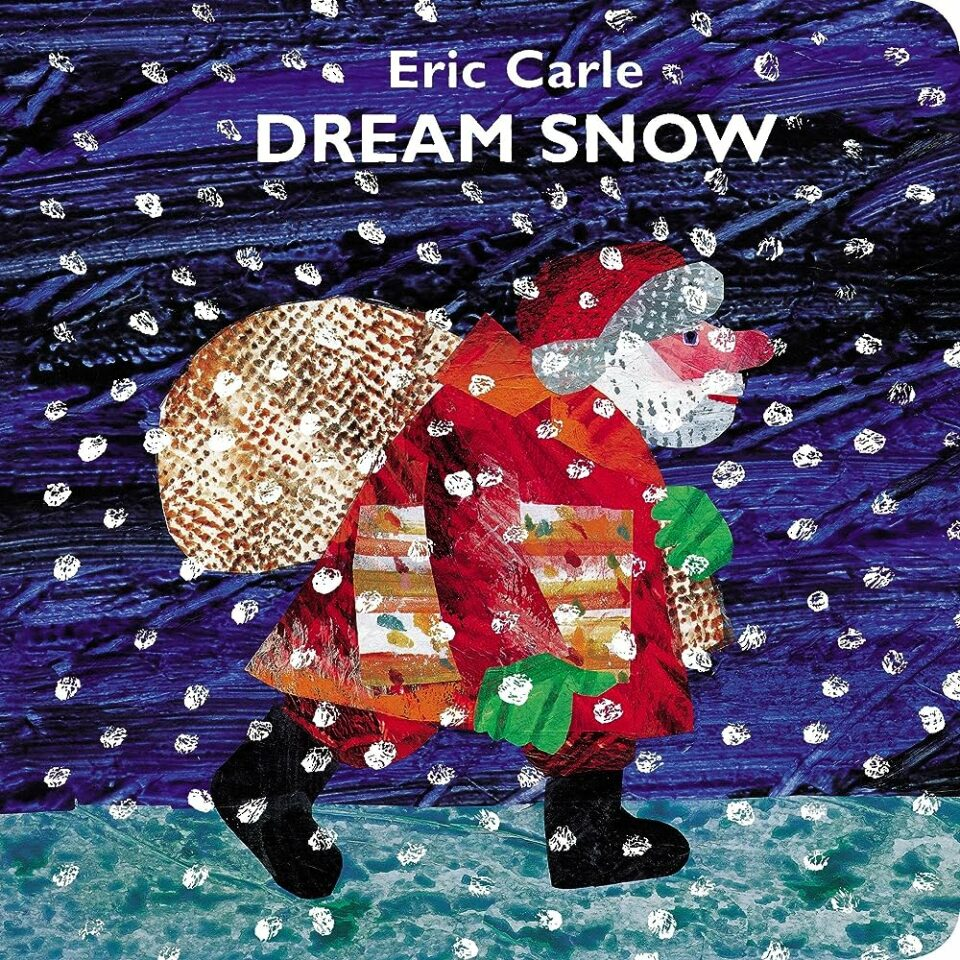

The narrative revolves around a farmer who, on Christmas Eve, dreams of covering his animals with a blanket of snow to celebrate the holiday season. With its engaging narrative and signature collage-style illustrations, “Dream Snow” captures the essence of anticipation and the magic of the holiday season while incorporating an interactive element that allows readers to unveil the hidden surprise beneath the snowflakes.

### **23\. [A Simple Christmas On The Farm](https://www.amazon.com/Simple-Christmas-Farm-Phyllis-Alsdurf/dp/1506471366)**

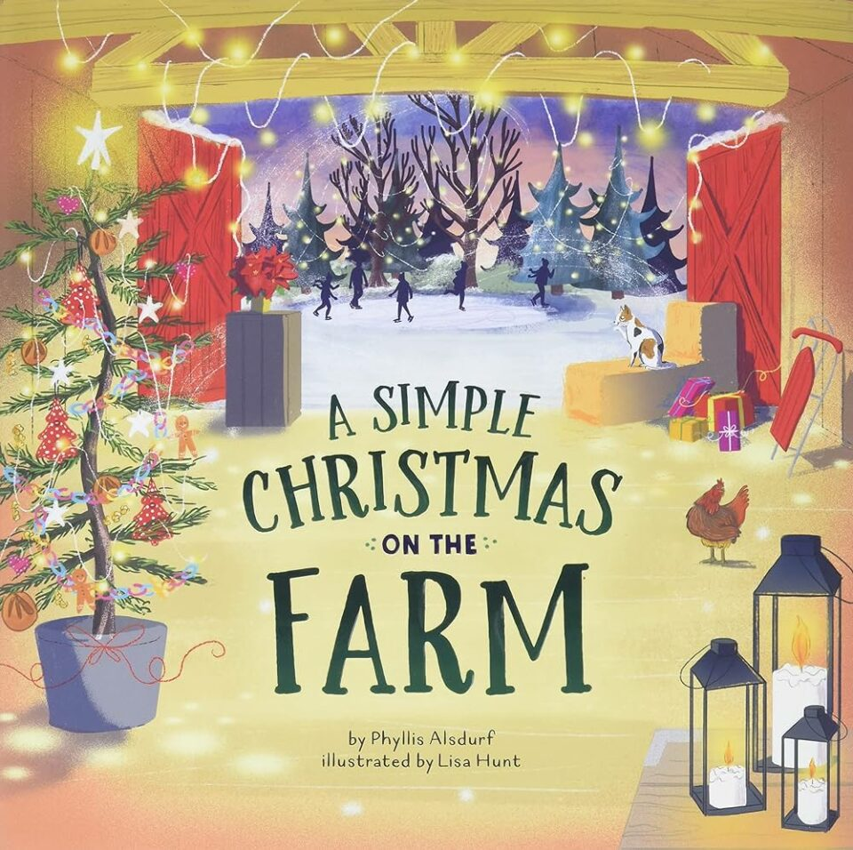

Set against a quaint countryside farm, the story follows a close-knit family preparing for a unique and meaningful Christmas celebration. Straying away from modern-day extravagance, the family members find happiness in the simplicity of their traditions, from decorating the barn with homemade ornaments to sharing heartfelt stories around a crackling fireplace.

### **24\. [The Snowman](https://www.amazon.com/Snowman-Raymond-Briggs/dp/0394839730)**

“The Snowman” is a heartwarming and enchanting children’s tale written and illustrated by Raymond Briggs. It revolves around a young boy who builds a snowman on a cold winter’s day. However, the magic begins when the snowman comes to life at night, taking the boy on a magical journey. The story’s charm lies in its exploration of the innocent wonder of childhood and the dreamlike adventure shared between the boy and his newfound snowman friend.

### **25\. [Mr. Willowby’s Christmas Tree](https://www.amazon.com/Willowbys-Christmas-Tree-Robert-Barry/dp/0385327218)**

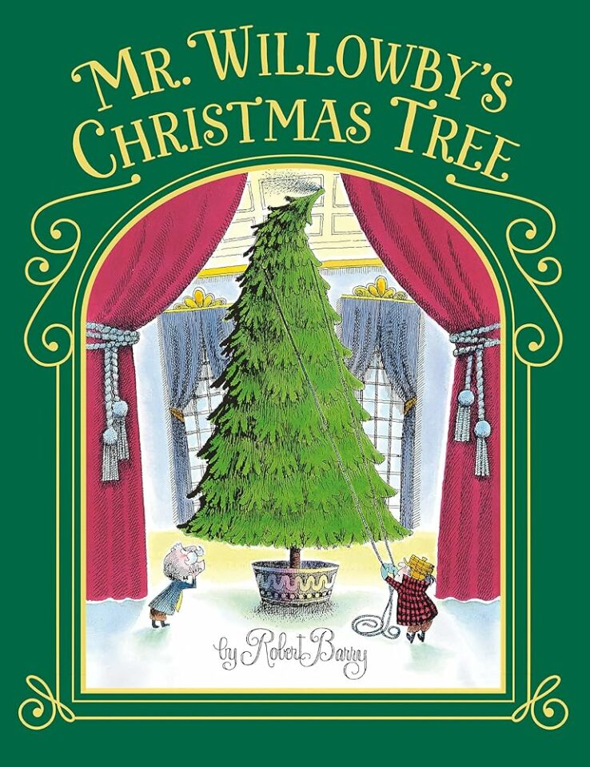

The story revolves around the comical misadventures after Mr. Willowby’s enormous Christmas tree is delivered to his home. As the tree is too tall for his living room, he has to trim the top, and the discarded piece becomes the centerpiece for a series of endearing subplots. The story skillfully weaves together the interconnected lives of characters, highlighting the sharing and joy during the festive season.

**_See More:_**

- [Christmas Trivia for Kids](https://avada.io/loveable/blog/christmas-trivia-kids/)

- Playful [Kids Christmas Jokes](https://avada.io/loveable/blog/kids-christmas-jokes/)

- [Funny Christmas Party Games](https://avada.io/loveable/blog/funny-christmas-party-games/)

## **Bottom Line**

As snow blankets the world outside, these heartwarming tales will transport your little ones to enchanting realms filled with wonder, joy, and holiday spirit. From mischievous elves tinkering away in Santa’s workshop to brave reindeer embarking on epic adventures, each **kid Christmas story** is a gift that unwraps the true meaning of Christmas. Watch as their eyes light up with every page turned, weaving the threads of tradition and creating memories that will be loved for years afterward.

But the magic doesn’t have to stop at the summaries! Delve into the full stories by following the adorned links. The pages come alive with illustrations that dance alongside the words, allowing young readers to fully immerse themselves in the enchanting worlds painted by these talented authors.

- [20+ Best Amazing Kid Christmas Stories for Bedtime](https://avada.io/loveable/blog/kid-christmas-story/#wp-block-heading-2-2)
    - [1\. A Christmas Carol](https://avada.io/loveable/blog/kid-christmas-story/#wp-block-heading-3-3)
    - [2\. Story Of Santa Clause](https://avada.io/loveable/blog/kid-christmas-story/#wp-block-heading-3-6)
    - [3\. The Little Christmas Tree](https://avada.io/loveable/blog/kid-christmas-story/#wp-block-heading-3-9)
    - [4\. The Gift of the Magi](https://avada.io/loveable/blog/kid-christmas-story/#wp-block-heading-3-12)
    - [5\. How Winston Delivered Christmas](https://avada.io/loveable/blog/kid-christmas-story/#wp-block-heading-3-15)
    - [6\. The Animals’ Christmas Eve](https://avada.io/loveable/blog/kid-christmas-story/#wp-block-heading-3-18)
    - [7\. Mortimer’s Christmas Manger](https://avada.io/loveable/blog/kid-christmas-story/#wp-block-heading-3-21)
    - [8\. The Girl Who Saved Christmas](https://avada.io/loveable/blog/kid-christmas-story/#wp-block-heading-3-24)
    - [9\. The Polar Express](https://avada.io/loveable/blog/kid-christmas-story/#wp-block-heading-3-27)
    - [10\. Rudolph The Red Nosed Reindeer](https://avada.io/loveable/blog/kid-christmas-story/#wp-block-heading-3-30)
    - [11\. The Elves And The Shoemaker Story](https://avada.io/loveable/blog/kid-christmas-story/#wp-block-heading-3-33)
    - [12\. The NutCracker](https://avada.io/loveable/blog/kid-christmas-story/#wp-block-heading-3-36)
    - [13\. Twas The Night Before Christmas Story](https://avada.io/loveable/blog/kid-christmas-story/#wp-block-heading-3-39)
    - [14\. The Carpenter’s Gift](https://avada.io/loveable/blog/kid-christmas-story/#wp-block-heading-3-42)
    - [15\. How the Grinch Stole Christmas](https://avada.io/loveable/blog/kid-christmas-story/#wp-block-heading-3-45)
    - [16\. The Candymaker’s Gift](https://avada.io/loveable/blog/kid-christmas-story/#wp-block-heading-3-48)
    - [17\. The Night Before Christmas](https://avada.io/loveable/blog/kid-christmas-story/#wp-block-heading-3-51)
    - [18\. Little Drummer Boy](https://avada.io/loveable/blog/kid-christmas-story/#wp-block-heading-3-54)
    - [19\. The Pine Tree Parable](https://avada.io/loveable/blog/kid-christmas-story/#wp-block-heading-3-57)
    - [20\. The Little Fir Tree](https://avada.io/loveable/blog/kid-christmas-story/#wp-block-heading-3-60)
    - [21\. The Velveteen Rabbit](https://avada.io/loveable/blog/kid-christmas-story/#wp-block-heading-3-63)
    - [22\. Dream Snow](https://avada.io/loveable/blog/kid-christmas-story/#wp-block-heading-3-66)
    - [23\. A Simple Christmas On The Farm](https://avada.io/loveable/blog/kid-christmas-story/#wp-block-heading-3-69)
    - [24\. The Snowman](https://avada.io/loveable/blog/kid-christmas-story/#wp-block-heading-3-72)
    - [25\. Mr. Willowby’s Christmas Tree](https://avada.io/loveable/blog/kid-christmas-story/#wp-block-heading-3-75)
- [Bottom Line](https://avada.io/loveable/blog/kid-christmas-story/#wp-block-heading-2-82)

### [Blake Simpson](https://avada.io/loveable/author/blake/)

Hi, I'm Blake from Loveable. I help people find perfect gifts for occasions like anniversaries and weddings. I also write a blog about holidays, sharing insights to make them more meaningful. Let's create unforgettable moments together!

- [Twitter](https://twitter.com/intent/tweet)
- [Facebook](https://www.facebook.com/sharer/sharer.php)
- [instagram](https://avada.io/loveable/blog/kid-christmas-story/)
- [pinterest](https://www.pinterest.com/loveablellc/)

## Related Posts

[### 120+ Christian Birthday Wishes To Spread Your Love](https://avada.io/loveable/blog/christian-birthday-wishes/) 

[

### 35 Best 70th Birthday Ideas To Celebrate The Special Milestone

](https://avada.io/loveable/blog/70th-birthday-ideas/)

[

### 50 Best 30th Birthday Decorations for a Remarkable Birthday Bash

](https://avada.io/loveable/blog/30th-birthday-decorations/)

[

### 40 Delicious Vegan Christmas Desserts to Delight Your Palate

](https://avada.io/loveable/blog/vegan-christmas-desserts/)

[

### 60 Christmas Team Building Activities to Boost Workplace Spirit

](https://avada.io/loveable/blog/christmas-team-building-activities/)
