This article has been written and researched by our expert Loveable through a precise methodology. [Learn more about our methodology](https://avada.io/loveable/our-methodological.html)

[Loveable](https://avada.io/loveable/) > [Blog](https://avada.io/loveable/blog/) > [Holiday](https://avada.io/loveable/holiday/)

# 20 Claymation Christmas Movies that You Can’t Miss This Holiday Season

Written by [Blake Simpson](https://avada.io/loveable/author/blake/) Last Updated on September 11, 2023

- [20 Unmissable Claymation Christmas Movie To Watch With The Beloved](https://avada.io/loveable/blog/claymation-christmas-movies/#wp-block-heading-2-3)
    - [1\. Rudolph the Red-Nosed Reindeer (1964)](https://avada.io/loveable/blog/claymation-christmas-movies/#wp-block-heading-3-4)
    - [2\. Santa Claus Is Comin’ to Town (1970)](https://avada.io/loveable/blog/claymation-christmas-movies/#wp-block-heading-3-10)
    - [3\. The Year Without a Santa Claus (1974)](https://avada.io/loveable/blog/claymation-christmas-movies/#wp-block-heading-3-16)
    - [4\. Rudolph’s Shiny New Year (1976)](https://avada.io/loveable/blog/claymation-christmas-movies/#wp-block-heading-3-22)
    - [5\. The Little Drummer Boy (1968)](https://avada.io/loveable/blog/claymation-christmas-movies/#wp-block-heading-3-28)
    - [6\. The Life & Adventures of Santa Claus (1985)](https://avada.io/loveable/blog/claymation-christmas-movies/#wp-block-heading-3-34)
    - [7\. The First Christmas: The Story of the First Christmas Snow (1975)](https://avada.io/loveable/blog/claymation-christmas-movies/#wp-block-heading-3-40)
    - [8\. VeggieTales: The Toy That Saved Christmas (1996)](https://avada.io/loveable/blog/claymation-christmas-movies/#wp-block-heading-3-46)
    - [9\. The Christmas Toy (1986)](https://avada.io/loveable/blog/claymation-christmas-movies/#wp-block-heading-3-52)
    - [10\. Robbie the Reindeer (Various specials)](https://avada.io/loveable/blog/claymation-christmas-movies/#wp-block-heading-3-58)
    - [11\. Elf: Buddy’s Musical Christmas (2014)](https://avada.io/loveable/blog/claymation-christmas-movies/#wp-block-heading-3-64)
    - [12\. The Star (2017)](https://avada.io/loveable/blog/claymation-christmas-movies/#wp-block-heading-3-70)
    - [13\. The Santa Claus Brothers (2001)](https://avada.io/loveable/blog/claymation-christmas-movies/#wp-block-heading-3-76)
    - [14\. Leprechaun’s Christmas Gold (1981)](https://avada.io/loveable/blog/claymation-christmas-movies/#wp-block-heading-3-82)
    - [15\. Pinocchio’s Christmas (1980)](https://avada.io/loveable/blog/claymation-christmas-movies/#wp-block-heading-3-88)
    - [16\. Rudolph & Frosty’s Christmas in July (1979)](https://avada.io/loveable/blog/claymation-christmas-movies/#wp-block-heading-3-94)
    - [17\. Jack Frost (1979)](https://avada.io/loveable/blog/claymation-christmas-movies/#wp-block-heading-3-100)
    - [18\. Nestor the Long-Eared Christmas Donkey (1977)](https://avada.io/loveable/blog/claymation-christmas-movies/#wp-block-heading-3-106)
    - [19\. A Miser Brothers’ Christmas (2008)](https://avada.io/loveable/blog/claymation-christmas-movies/#wp-block-heading-3-112)
    - [20\. Shaun The Sheep: The Flight Before Christmas (2021)](https://avada.io/loveable/blog/claymation-christmas-movies/#wp-block-heading-3-118)
- [Why Claymation Movies Are Perfect For The Holidays?](https://avada.io/loveable/blog/claymation-christmas-movies/#wp-block-heading-2-124)
- [Bottom Line](https://avada.io/loveable/blog/claymation-christmas-movies/#wp-block-heading-2-132)

Are you ready to start the holiday and dive into the engaging world of Christmas movies? Here, we’re thrilled to present you with an exhilarating lineup of over 30 must-watch **Claymation Christmas movies** that captivate your heart and infuse your celebrations with extra holiday magic.

As the Christmas season approaches, there’s nothing quite like cuddling up with loved ones and indulging in heartwarming tales that capture the essence of the holidays. Enter Claymation films – those magical creations that bring characters to life with a tangible charm. So, gather with your loved one and prepare to experience a cinematic journey that will leave you surprised, moved, and utterly delighted!

## **20 Unmissable Claymation Christmas Movie To Watch With The Beloved**

### **1\. Rudolph the Red-Nosed Reindeer (1964)**

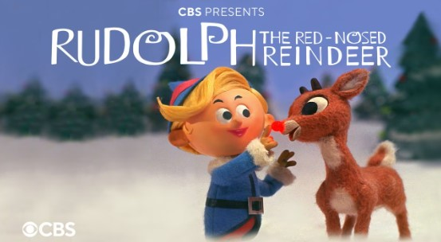

Voice cast: Burl Ives, Billie Mae Richards, Paul Soles, Larry Mann, Stan Francis

Let’s take on the journey to the North Pole and follow the heartwarming tale of Rudolph, a reindeer with a glowing red nose that sets him apart. Rudolph embarks on a daring adventure with newfound friends Hermey and Yukon Cornelius. 

Together with your loved ones embrace the uniqueness and save your day by leading Santa’s sleigh on a foggy night. This timeless Claymation classic will make you feel warm inside and remind you that kindness and bravery are important.

**Where to watch:** [Amazon Prime Video](https://www.amazon.com/Rudolph-Red-Nosed-Reindeer-Larry-Mann/dp/B09M699B8F/) 

### **2\. Santa Claus Is Comin’ to Town (1970)**

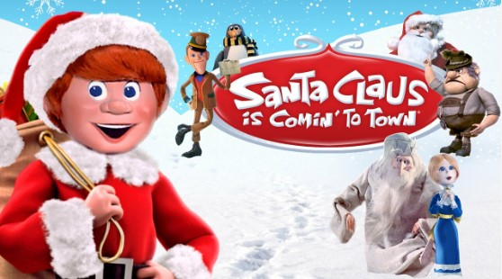

Voice cast: Fred Astaire, Mickey Rooney, Keenan Wynn, Paul Frees

Why not Immerse yourself in the enchanting origin story of Santa Claus with this movie? This film traces the journey of Kris Kringle from a baby abandoned in the woods to the beloved figure who brings joy and gifts to children worldwide. 

Through the movie, you will see how Kris overcomes challenges with the help of his friends. It’s perfectly a jolly movie that brings holiday happiness and reminds you that being kind and generous is wonderful.

**Where to watch:** [Amazon Prime Video](https://www.amazon.com/Santa-Claus-Comin-Town-Astaire/dp/B00AH70BKA/)

### **3\. The Year Without a Santa Claus (1974)**

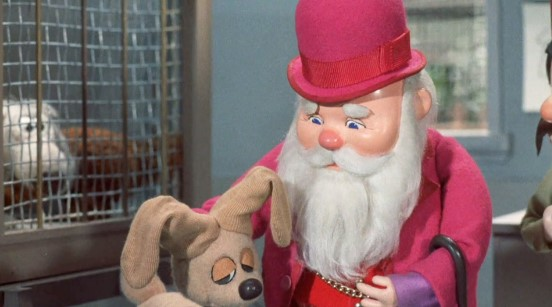

Voice cast: Mickey Rooney, Shirley Booth, Dick Shawn, and more

This claymation starts when Santa decides to skip Christmas due to a lack of holiday spirit. Mrs. Claus and two trusty elves, Jingle and Jangle, embark on a mission to prove that people still believe in Christmas.

This movie will remind you that kindness and friendship can improve everything, even when things seem tough. So, don’t miss watching this movie with your kids or friends this holiday. 

**Where to watch:** [Amazon Prime Video](https://www.amazon.com/Year-Without-Santa-Claus/dp/B08MD29NYD/) 

### **4\. Rudolph’s Shiny New Year (1976)**

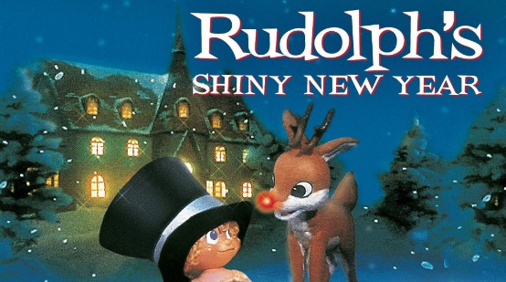

Voice cast: Red Skelton, Frank Gorshin, Morey Amsterdam, Harold Peary

Do you want to join Rudolph on another enchanting adventure as he embarks on a quest to find the missing New Year’s Baby? The movie presents Rudolph’s journeys through time and across different historical periods, encountering quirky characters and overcoming challenges.

Moreover, when he races against the clock to save the year, Rudolph will teach you valuable lessons about self-discovery, courage, and the importance of embracing change. This Claymation Christmas movie is ideal to warm up your hearts with kindness.

**Where to watch:** [IMDb](https://www.imdb.com/title/tt0073640/)

### **5\. The Little Drummer Boy (1968)**

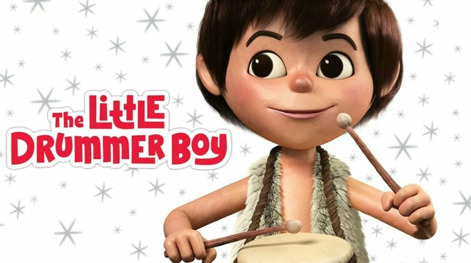

Voice cast: José Ferrer, Paul Frees, June Foray, Ted Eccles

The Little Drummer Boy (1968) will take you on a journey with the young and humble drummer boy, Aaron. In the film, he will embark on a poignant pilgrimage to witness the birth of the baby Jesus. 

Not only that, Aaron’s encounter with the newborn Messiah leads to a transformative realization about the power of compassion, forgiveness, and the healing touch of love. If you are seeking a heartwarming storybook with lovely music, this claymation will bring you a world of joy and happiness this Christmas. 

**Where to watch:** [Amazon Prime Video](https://www.amazon.com/Little-Drummer-Boy-Jose-Ferrer/dp/B09M69PC4M/) 

### **6\. The Life & Adventures of Santa Claus (1985)**

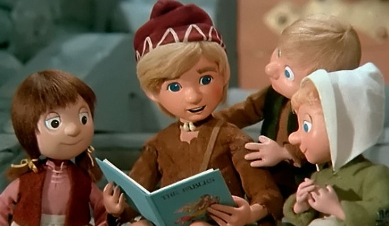

Voice cast: Earl Hammond, Earle Hyman, Larry Kenney, Lynne Lipton, Robert McFadden

The film will tell you about the origin story of Santa Claus, exploring his early years as an orphan in the magical forest of Burzee. Besides Ak and the Master Woodsman, Claus dedicates his life to spreading love and joy.

This claymation movie shows you how Santa overcame challenges and spread joy. With the spirit of Christmas, the movie reminds you that the holiday season is about love, giving, and making the world a better place.

**Where to watch:** [Amazon Prime Video](https://www.amazon.com/Life-Adventures-Santa-Claus/dp/B09RF1XWGK/)

### **7\. The First Christmas: The Story of the First Christmas Snow (1975)**

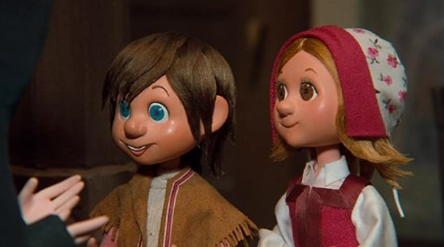

Voice cast: Angela Lansbury, Cyril Ritchard, and more

This stop motion focuses on Lucas, a blind shepherd boy, and his miraculous encounter with a Christmas angel that blesses him with the gift of sight. Lucas’s faith journey intertwines with the nativity story while he learns the true meaning of love, sacrifice, and the transformative power of belief.

In the heartwarming story with beautiful scenes, you’ll see Lucas’s journey and how he learns about love and the true meaning of Christmas.

**Where to watch:** [Amazon Prime Video](https://www.amazon.com/First-Christmas-Story-Snow/dp/B09QG1GR4V/)

### **8\. VeggieTales: The Toy That Saved Christmas (1996)**

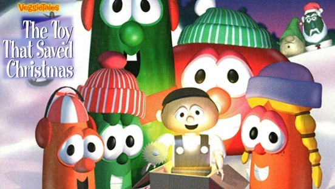

Voice cast: Dan Anderson, Lesly Benodin, Kristin Blegen, Ken Cavanagh, Bridget Miller

“VeggieTales: The Toy That Saved Christmas” (1996) is about a group of friendly vegetables who learn about the real meaning of Christmas. The movie is like a silly and cheerful story with talking veggies. You’ll join them on an adventure to find the true joy of giving.

This movie teaches you that gifts aren’t the most important thing during the holidays. It’s a lighthearted reminder that Christmas is about kindness, love, and sharing happiness with others. So, get ready for a veggie-filled holiday tale that will make you smile!

**Where to watch:** [Algifhary](https://algifhary.com/vi/movie/265923/veggietales-the-toy-that-saved-christmas)

### **9\. The Christmas Toy (1986)**

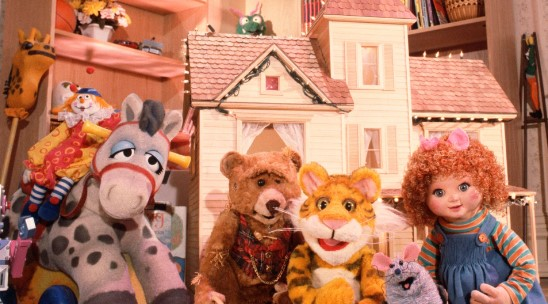

Voice cast: Dave Goelz, Steve Whitmire, Kathryn Mullen, Jerry Nelson

The Christmas toy is started in a playroom, where toys magically come to life when humans are not around, perfectly immersing you in a heartwarming tale. Let’s follow Rugby the Tiger, who fears being replaced as the favorite toy by a new arrival, Meteora the spaceship. 

As Christmas approaches, the toys embark on a lively adventure to ensure Meteora understands the true meaning of being a toy and the joys of childhood play.  

**Where to watch:** [Amazon Prime Video](https://www.amazon.com/Christmas-Toy-Dave-Goelz/dp/B07ZPG2WC5/)

### **10\. Robbie the Reindeer (Various specials)**

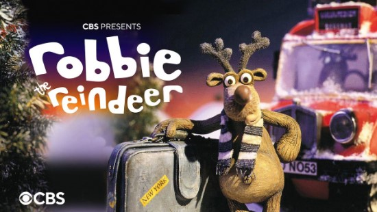

Voice cast: Ardal O’Hanlon, Jane Horrocks, Steve Coogan, Caroline Quentin, Paul Whitehouse

Do you want to come back to your childhood? Let’s follow Robbie, a determined and lovable reindeer, in a series of exciting adventures with this claymation Christmas movie, Robbie the Reindeer.

From his misadventures as a rookie in “Hooves of Fire” to his heroic quests in “Legend of the Lost Tribe” and “Close Encounters of the Herd Kind,” you will learn how important determination and friendship are. So, get ready for giggles and snowy fun in these holiday tales!

**Where to watch:** [Netflix](https://www.netflix.com/vn-en/browse/genre/34399)

### **11\. Elf: Buddy’s Musical Christmas (2014)**

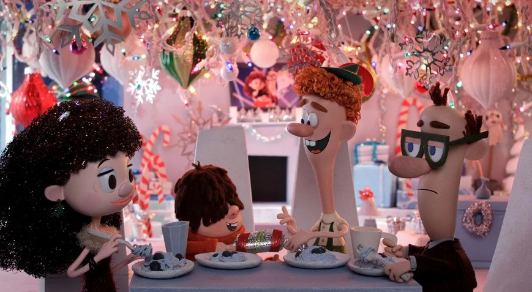

Voice cast: Jim Parsons, Mark Hamill, Kate Micucci, Ed Asner, Max Charles

Buddy the Elf will lead you to the world of Merry Christmas this holiday as he leaves the North Pole to find his true identity in New York City. Buddy spreads his infectious Christmas spirit while trying to connect with his estranged father and bring holiday joy to the bustling city.

Besides, This charming movie takes you on a heartwarming journey as Buddy the Elf spreads holiday cheer through catchy [christmas songs](https://avada.io/loveable/blog/best-christmas-songs/) and colorful animation. So, don’t miss it for a festive holiday!

**Where to watch:** [Amazon Prime Video](https://www.amazon.com/Elf-Musical-Christmas-Jim-Parsons/dp/B013W00U0E/)

### **12\. The Star (2017)**

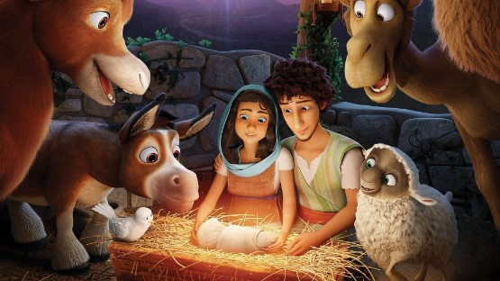

Voice cast: Steven Yeun, Keegan-Michael Key, Aidy Bryant, Gina Rodriguez

Nothing is more exciting than a journey alongside a brave donkey named Bo and his endearing animal friends when they participate in a divine adventure to witness the first Christmas.

“The Star” brings the Nativity story to your life, telling about their heroic efforts to protect Mary, Joseph, and baby Jesus from King Herod’s plans. Throughout the screen, you’ll laugh and maybe even shed a tear as you follow their quest to be part of the first Christmas.

**Where to watch:** [Amazon Prime Video](https://www.amazon.com/Star-Anthony-Anderson/dp/B077H7396S/)

### **13\. The Santa Claus Brothers (2001)**

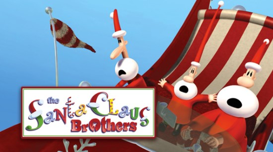

Voice cast: Bryan Cranston, Caroline Rhea, Richard Kind, Kevin McDonald

This movie tells you about a spirited adventure with Santa’s three bumbling but endearing nephews—Jingle, Jangle, and Jolly—as they take on the responsibility of delivering presents when Santa falls ill. 

So, why not gather your family, grab some cookies, and let “The Santa Claus Brothers” fill your heart with holiday spirit and a touch of sibling love? It must be a meaningful lesson for your kids on off-school days.

**Where to watch:** [Amazon Prime Video](https://www.amazon.com/Santa-Claus-Brothers-Bryan-Cranston/dp/B08B44MZPQ/)

### **14\. Leprechaun’s Christmas Gold (1981)**

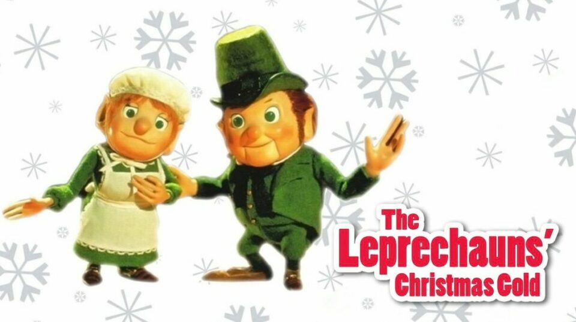

Voice cast: Art Carney, Peggy Cass, and Bob McFadden

You’re in for a unique holiday adventure in “Leprechaun’s Christmas Gold” (1981). This movie takes you to a world of leprechauns and holiday magic. You’ll follow a young sailor who discovers a stranded leprechaun on a deserted island.

With its Celtic folklore, the film offers a refreshing twist on the usual Christmas stories. As you watch, you’ll find yourself enchanted by the holiday spirit and Irish mythology blend, making it a hidden gem in the holiday movie collection.

**Where to watch:** [Amazon Prime Video](https://www.amazon.com/Leprechauns-Christmas-Gold-Art-Carney/dp/B09MNVPZZ4/)

### **15\. Pinocchio’s Christmas (1980)**

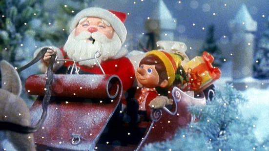

Voice cast: Alan King, George S. Irving, and Bob McFadden

“Pinocchio’s Christmas” (1980) is a delightful holiday treat that brings you into the enchanting world of Pinocchio. In this animated film, you’ll witness Pinocchio’s journey as he seeks a perfect Christmas gift for Geppetto.

It’s a wonderful addition to your holiday movie list. You’ll find yourself captivated by Pinocchio’s adventures and reminded of the importance of kindness during the holiday season.

**Where to watch:** [Amazon Prime Video](https://www.amazon.com/Pinocchios-Christmas-Alan-King/dp/B01BJC8FXQ/)

### **16\. Rudolph & Frosty’s Christmas in July (1979)**

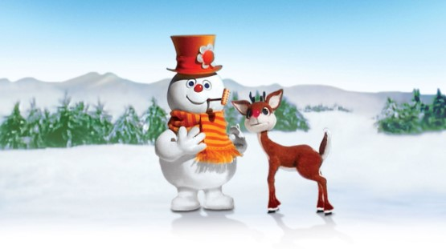

Voice cast: Jackie Vernon, Billie Mae Richards, Ethel Merman

“Rudolph & Frosty’s Christmas in July” (1979) brings you a double dose of holiday magic in this animated adventure. You’ll follow Rudolph the Red-Nosed Reindeer and Frosty the Snowman as they team up for a midsummer Christmas extravaganza. 

In this claymation Christmas movie,  you’ll be drawn into their journey to save the circus. The blend of beloved characters and a unique setting will keep you entertained all year round.

**Where to watch:** [Amazon Prime Video](https://www.amazon.com/Rudolph-Frostys-Christmas-Jackie-Vernon/dp/B017DSNU80/)

### **17\. Jack Frost (1979)**

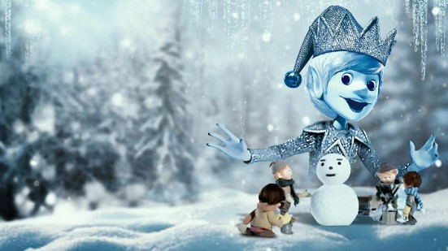

Voice cast: Buddy Hackett, Robert Morse, Paul Frees, and Larry Storch

“Jack Frost” (1979) invites you into a whimsical winter world in this animated tale. You’ll meet Jack Frost, a mischievous character who longs to become human and experience life’s wonders. 

You’ll join him on a heartwarming adventure filled with friendship and love when he gets his chance. The movie will captivate you with its memorable songs as Jack faces challenges and learns valuable lessons.

**Where to watch:** [Amazon Prime Video](https://www.amazon.com/Jack-Frost-Buddy-Hackett/dp/B082WN2YYH)

### **18\. Nestor the Long-Eared Christmas Donkey (1977)**

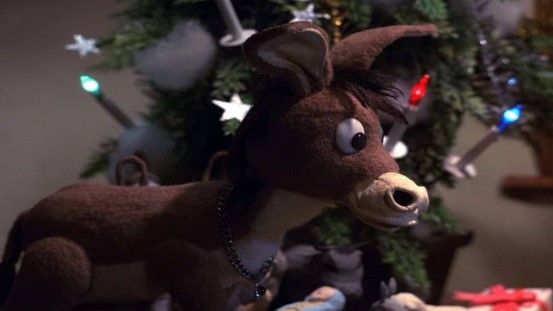

Voice cast: Roger Miller, Brenda Vaccaro, Paul Frees, Don Messick

“Nestor the Long-Eared Christmas Donkey/The First Christmas” (1977) warmly welcomes you into a timeless tale of courage and kindness. You’ll follow Nestor, a unique donkey with long ears, on a journey that leads him to a special purpose. 

Through challenges and heartwarming moments, you’ll see Nestor’s resilience and determination. The film will remind you of the power of compassion and the true meaning of Christmas.

**Where to watch:** [IMDb](https://www.imdb.com/title/tt0076448/)

### **19\. A Miser Brothers’ Christmas (2008)**

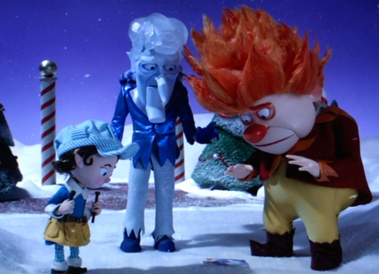

Voice cast: Mickey Rooney, George S. Irving, Juan Chioran, Catherine Disher

“A Miser Brothers’ Christmas” (2008) invites you to a festive world where holiday magic meets sibling rivalry. You’ll find yourself caught up in the comical clash between Heat Miser and Snow Miser, two quirky characters responsible for winter and summer weather. 

Through its catchy songs and imaginative story, you’ll discover that even feuding brothers can come together to spread holiday cheer.

**Where to watch:** [Amazon Prime Video](https://www.amazon.com/Miser-Brothers-Christmas-Not-Specified/dp/B019G7XPGS/)

### **20\. Shaun The Sheep: The Flight Before Christmas (2021)**

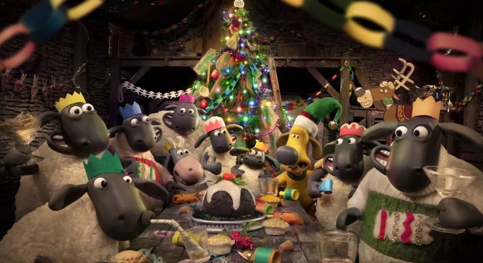

Voice cast: Justin Fletcher, John Sparkes, Laura Aikman, Marcus Brigstocke

“Shaun The Sheep: The Flight Before Christmas” (2021) brings you an adorable and hilarious holiday adventure. You’ll join Shaun the Sheep and his flock on a journey that takes unexpected twists.

When a mix-up leads them to the North Pole, you’ll be treated to a heartwarming tale filled with friendship and laughter. The movie’s clever humor will keep you entertained from start to finish.

**Where to watch**: [IMDb](https://www.imdb.com/title/tt15857304/)

## **Why Claymation Movies Are Perfect For The Holidays?**

Claymation movies are the perfect holiday companions, bringing a touch of appeal and nostalgia to the festive season. And here’s why Claymation movies are a match made in yuletide heaven:

- **Whimsical Visuals:** Claymation brings characters and scenes to life with its tactile and handcrafted aesthetic. The artistry and attention to detail create a sense of wonder.

- **Timeless Nostalgia**: Many Claymation classics have been adored for generations, creating a sense of nostalgia that resonates with both young and old. Sharing these films with loved ones becomes a cherished tradition.

- **Heartwarming Themes**: Claymation movies often center around themes of love, friendship, generosity, and the true spirit of the holidays. These heartfelt narratives remind us of the values that define the season, encouraging us to embrace kindness and compassion.

- **Family-Friendly Entertainment**: Their wholesome stories and relatable characters offer something for everyone, fostering a sense of togetherness during holiday celebrations.

- **Creative Expression:** The creative process behind Claymation is a labor of love, reflecting the dedication and craftsmanship that embody the holiday spirit. The art of molding and animating clay characters adds an extra layer of appreciation for the hard work of making the magic happen.

## **Bottom Line**

As you wrap up your journey through these 30 **Claymation Christmas movies**, it’s clear that these timeless treasures hold a special place in your hearts. With emotional stories of love and friendship to attractive characters, these films will lift your holiday season and make you happy. 

No matter you’re reliving cherished memories or discovering these classics for the first time, these Claymation gems are a must-watch for the whole family. Cozy up, grab some hot cocoa, and let the Claymation festivities add joy to your holiday celebrations. Happy watching, and happy holidays!

**_See More:_**

- [Christmas Trivia for Kids](https://avada.io/loveable/blog/christmas-trivia-kids/)

- Playful [Kids Christmas Jokes](https://avada.io/loveable/blog/kids-christmas-jokes/)

- [20 Unmissable Claymation Christmas Movie To Watch With The Beloved](https://avada.io/loveable/blog/claymation-christmas-movies/#wp-block-heading-2-3)
    - [1\. Rudolph the Red-Nosed Reindeer (1964)](https://avada.io/loveable/blog/claymation-christmas-movies/#wp-block-heading-3-4)
    - [2\. Santa Claus Is Comin’ to Town (1970)](https://avada.io/loveable/blog/claymation-christmas-movies/#wp-block-heading-3-10)
    - [3\. The Year Without a Santa Claus (1974)](https://avada.io/loveable/blog/claymation-christmas-movies/#wp-block-heading-3-16)
    - [4\. Rudolph’s Shiny New Year (1976)](https://avada.io/loveable/blog/claymation-christmas-movies/#wp-block-heading-3-22)
    - [5\. The Little Drummer Boy (1968)](https://avada.io/loveable/blog/claymation-christmas-movies/#wp-block-heading-3-28)
    - [6\. The Life & Adventures of Santa Claus (1985)](https://avada.io/loveable/blog/claymation-christmas-movies/#wp-block-heading-3-34)
    - [7\. The First Christmas: The Story of the First Christmas Snow (1975)](https://avada.io/loveable/blog/claymation-christmas-movies/#wp-block-heading-3-40)
    - [8\. VeggieTales: The Toy That Saved Christmas (1996)](https://avada.io/loveable/blog/claymation-christmas-movies/#wp-block-heading-3-46)
    - [9\. The Christmas Toy (1986)](https://avada.io/loveable/blog/claymation-christmas-movies/#wp-block-heading-3-52)
    - [10\. Robbie the Reindeer (Various specials)](https://avada.io/loveable/blog/claymation-christmas-movies/#wp-block-heading-3-58)
    - [11\. Elf: Buddy’s Musical Christmas (2014)](https://avada.io/loveable/blog/claymation-christmas-movies/#wp-block-heading-3-64)
    - [12\. The Star (2017)](https://avada.io/loveable/blog/claymation-christmas-movies/#wp-block-heading-3-70)
    - [13\. The Santa Claus Brothers (2001)](https://avada.io/loveable/blog/claymation-christmas-movies/#wp-block-heading-3-76)
    - [14\. Leprechaun’s Christmas Gold (1981)](https://avada.io/loveable/blog/claymation-christmas-movies/#wp-block-heading-3-82)
    - [15\. Pinocchio’s Christmas (1980)](https://avada.io/loveable/blog/claymation-christmas-movies/#wp-block-heading-3-88)
    - [16\. Rudolph & Frosty’s Christmas in July (1979)](https://avada.io/loveable/blog/claymation-christmas-movies/#wp-block-heading-3-94)
    - [17\. Jack Frost (1979)](https://avada.io/loveable/blog/claymation-christmas-movies/#wp-block-heading-3-100)
    - [18\. Nestor the Long-Eared Christmas Donkey (1977)](https://avada.io/loveable/blog/claymation-christmas-movies/#wp-block-heading-3-106)
    - [19\. A Miser Brothers’ Christmas (2008)](https://avada.io/loveable/blog/claymation-christmas-movies/#wp-block-heading-3-112)
    - [20\. Shaun The Sheep: The Flight Before Christmas (2021)](https://avada.io/loveable/blog/claymation-christmas-movies/#wp-block-heading-3-118)
- [Why Claymation Movies Are Perfect For The Holidays?](https://avada.io/loveable/blog/claymation-christmas-movies/#wp-block-heading-2-124)
- [Bottom Line](https://avada.io/loveable/blog/claymation-christmas-movies/#wp-block-heading-2-132)

### [Blake Simpson](https://avada.io/loveable/author/blake/)

Hi, I'm Blake from Loveable. I help people find perfect gifts for occasions like anniversaries and weddings. I also write a blog about holidays, sharing insights to make them more meaningful. Let's create unforgettable moments together!

- [Twitter](https://twitter.com/intent/tweet)
- [Facebook](https://www.facebook.com/sharer/sharer.php)
- [instagram](https://avada.io/loveable/blog/claymation-christmas-movies/)
- [pinterest](https://www.pinterest.com/loveablellc/)

## Related Posts

[### 120+ Christian Birthday Wishes To Spread Your Love](https://avada.io/loveable/blog/christian-birthday-wishes/) 

[

### 35 Best 70th Birthday Ideas To Celebrate The Special Milestone

](https://avada.io/loveable/blog/70th-birthday-ideas/)

[

### 50 Best 30th Birthday Decorations for a Remarkable Birthday Bash

](https://avada.io/loveable/blog/30th-birthday-decorations/)

[

### 40 Delicious Vegan Christmas Desserts to Delight Your Palate

](https://avada.io/loveable/blog/vegan-christmas-desserts/)

[

### 60 Christmas Team Building Activities to Boost Workplace Spirit

](https://avada.io/loveable/blog/christmas-team-building-activities/)
