This article has been written and researched by our expert Loveable through a precise methodology. [Learn more about our methodology](https://avada.io/loveable/our-methodological.html)

[Loveable](https://avada.io/loveable/) > [Blog](https://avada.io/loveable/blog/) > [Holiday](https://avada.io/loveable/holiday/)

# 20 Creative Christmas Tree Decorating Ideas to Get You Into The Holiday Spirit

Written by [Blake Simpson](https://avada.io/loveable/author/blake/) Last Updated on October 03, 2023

- [20 Christmas Tree Decorating Ideas To Impress Your Friends and Family](https://avada.io/loveable/blog/christmas-tree-decorating-ideas/#wp-block-heading-2-3)
    - [Red and Green Plaid Ribbon Tree](https://avada.io/loveable/blog/christmas-tree-decorating-ideas/#wp-block-heading-3-4)
    - [Neutral Christmas Tree](https://avada.io/loveable/blog/christmas-tree-decorating-ideas/#wp-block-heading-3-7)
    - [Full Glam Christmas Tree Decorating Idea](https://avada.io/loveable/blog/christmas-tree-decorating-ideas/#wp-block-heading-3-10)
    - [Woodland Wonder](https://avada.io/loveable/blog/christmas-tree-decorating-ideas/#wp-block-heading-3-13)
    - [Cozy Lodge Tree](https://avada.io/loveable/blog/christmas-tree-decorating-ideas/#wp-block-heading-3-16)
    - [Velvet Goldmine](https://avada.io/loveable/blog/christmas-tree-decorating-ideas/#wp-block-heading-3-19)
    - [Retro Christmas Tree Decorating Idea](https://avada.io/loveable/blog/christmas-tree-decorating-ideas/#wp-block-heading-3-22)
    - [Farmhouse-Style](https://avada.io/loveable/blog/christmas-tree-decorating-ideas/#wp-block-heading-3-25)
    - [Rustic Tree](https://avada.io/loveable/blog/christmas-tree-decorating-ideas/#wp-block-heading-3-28)
    - [Chalkboard Christmas Tree Decorating Idea](https://avada.io/loveable/blog/christmas-tree-decorating-ideas/#wp-block-heading-3-31)
    - [Rope Christmas Tree Collar](https://avada.io/loveable/blog/christmas-tree-decorating-ideas/#wp-block-heading-3-34)
    - [Plaid and Natural Wood](https://avada.io/loveable/blog/christmas-tree-decorating-ideas/#wp-block-heading-3-37)
    - [Modern White Tree](https://avada.io/loveable/blog/christmas-tree-decorating-ideas/#wp-block-heading-3-40)
    - [Green and Pink Modern Tree](https://avada.io/loveable/blog/christmas-tree-decorating-ideas/#wp-block-heading-3-43)
    - [Unexpected Greenery](https://avada.io/loveable/blog/christmas-tree-decorating-ideas/#wp-block-heading-3-46)
    - [Tree Branch Display](https://avada.io/loveable/blog/christmas-tree-decorating-ideas/#wp-block-heading-3-49)
    - [Disco Ball Tree](https://avada.io/loveable/blog/christmas-tree-decorating-ideas/#wp-block-heading-3-52)
    - [Rainbow Christmas Tree Decorating Idea](https://avada.io/loveable/blog/christmas-tree-decorating-ideas/#wp-block-heading-3-55)
    - [Mason Jar Tree](https://avada.io/loveable/blog/christmas-tree-decorating-ideas/#wp-block-heading-3-58)
    - [Yarn Christmas Tree Decorating Idea](https://avada.io/loveable/blog/christmas-tree-decorating-ideas/#wp-block-heading-3-61)
- [Bottom Line](https://avada.io/loveable/blog/christmas-tree-decorating-ideas/#wp-block-heading-2-64)

It’s time to jazz up your Christmas tree decorations this year and move away from the usual stuff you’ve been using. If you’re looking for some inspiring **Christmas tree decorating ideas** to spruce up your tree this holiday season, you’ve come to the right place! We’ve gathered some exciting and fun Christmas tree decorations that will spark your creativity for your tree this year. Whether you prefer a simple and subtle look, a rustic charm, a glamorous touch, a burst of colors, or a nature-inspired theme, we’ve got you covered! There’s something here to give you plenty of inspiration.

With these wonderful Christmas tree themes, your home will be filled with even more holiday cheer. Let’s make this holiday season extra special and unforgettable!

## **20 Christmas Tree Decorating Ideas To Impress Your Friends and Family**

### **[Red and Green Plaid Ribbon Tree](https://www.amazon.com/Morex-Ribbon-Festival-Fabric-50-Yard/dp/B00A23JZME/)**

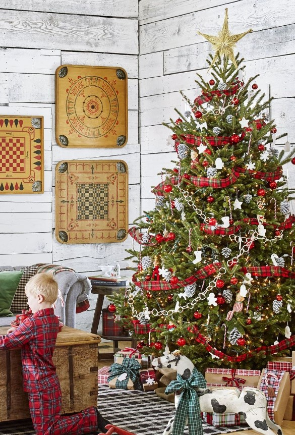

Transform your leftover festive plaid ribbon from gift wrapping into a delightful addition to your Christmas tree. Don’t let it go to waste; instead, let it infuse your tree with a touch of personality and charm. Embrace creativity and make the most of every resource in your home to add a unique and festive touch to your holiday decor.

### **[Neutral Christmas Tree](https://www.bhg.com/christmas/trees/christmas-tree-collar-hacks/)**

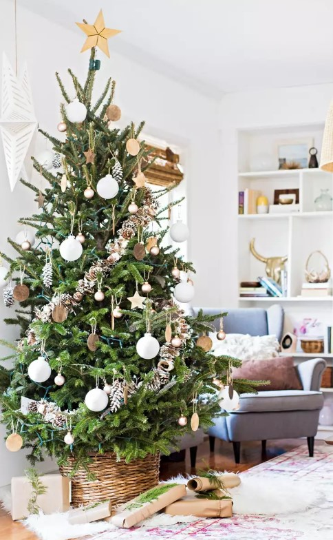

Embrace the elegance of simplicity with this classic Christmas tree adorned in gold and white colors. Stick to the traditional charm by embellishing your tree with classic elements such as white glass ball ornaments, pinecones, and wooden cut stars. For the perfect finishing touch, opt for a simple DIY basket tree collar that complements the overall theme. Sometimes, less is more, and this minimalist approach will surely bring a touch of sophistication and beauty to your home.

### **[Full Glam Christmas Tree Decorating Idea](https://www.balsamhill.com/)**

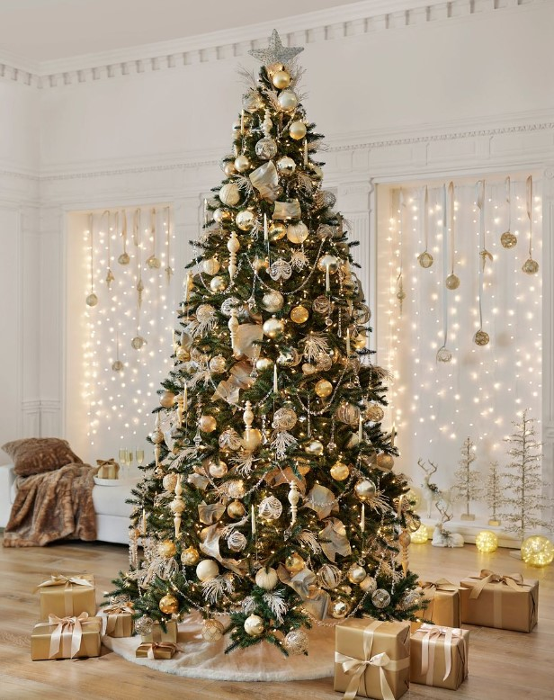

This Christmas tree decorating idea is a beautiful mix of gold, silver, and white ornaments, and it sparkles with crystal garlands. Feathers, twinkling lights, and a lovely gold ribbon make this tree even more special. And here’s a bonus: create a starlit backdrop by hanging cascading lights on the wall behind your tree. It will be like a magical wonderland right in your home! Enjoy the holiday magic with this enchanting and elegant tree.

### **[Woodland Wonder](https://briahammelinteriors.com/)**

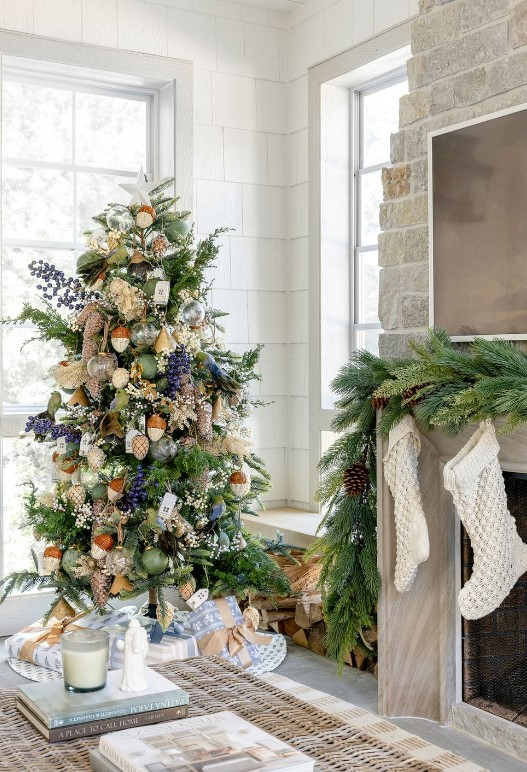

Christmas this year is all about embracing the enchanting and natural vibe. This Christmas tree is adorned with delightful birds perched on branches filled with acorns, pine cones, and berries, as if Mother Nature herself designed it. It is a charming and delightful way to bring the magic of the forest into your home this holiday season.

### **[Cozy Lodge Tree](https://inspiredbycharm.com/cozy-lodge-christmas-tree/)**

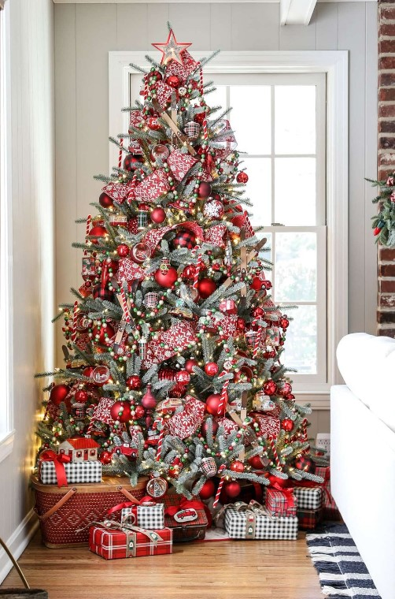

Create a snug ambiance in your home by decorating your spruce tree with red and burgundy baubles, complemented by classic beaded garland and snowflake ribbon. This festive combination will infuse your space with a cozy and inviting atmosphere, perfect for celebrating the holiday season with loved ones.

### **[Velvet Goldmine](https://www.elledecor.com/design-decorate/house-interiors/a38552722/house-of-hackney-london-townhouse/)**

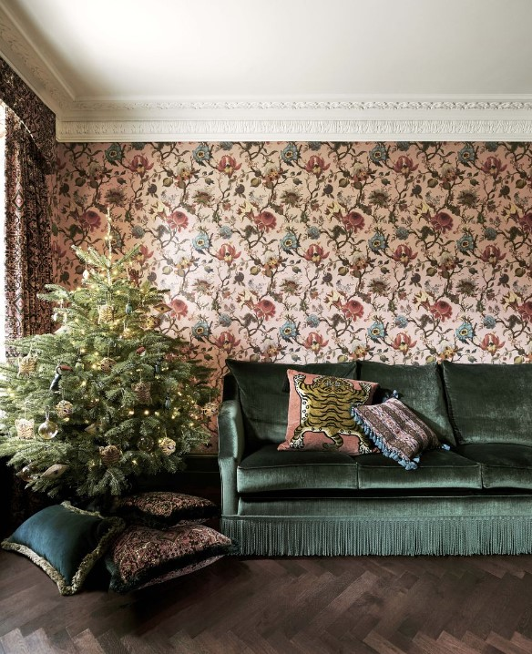

For a Victorian scene resemblance, you can use tiger-themed ornaments, inspired by House of Hackney’s velvet pillows, to decorate your Christmas tree. Also, try matching cushions under the tree in place of a traditional skirt. It will look amazing!

### **[Retro Christmas Tree Decorating Idea](https://www.bhg.com/christmas/trees/how-to-flock-a-tree-two-ways/)**

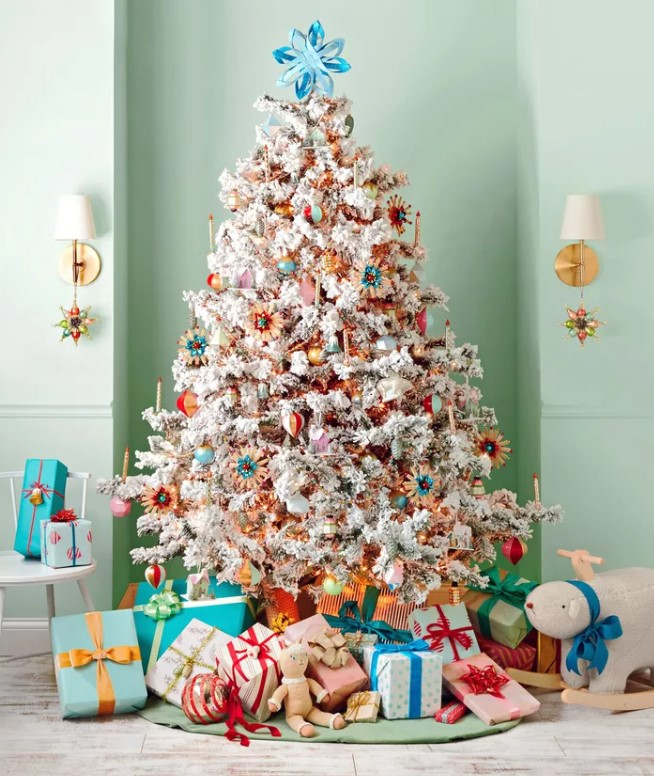

Get inspired by old holiday traditions for this year’s Christmas tree decorating idea! A flocked-white Christmas tree will be our starting point. It’s like a blank canvas that we can decorate with charming vintage Christmas ornaments. Then let’s hunt for some delightful decorations. Look out for ornaments like mercury glass, cute globes, and fake candles in lovely shades of baby blue, pink, and silver. These will add a touch of nostalgia and a magical atmosphere to your Christmas tree.

### **[Farmhouse-Style](https://lovegrowswild.com/2016/11/simple-farmhouse-christmas-bedroom)**

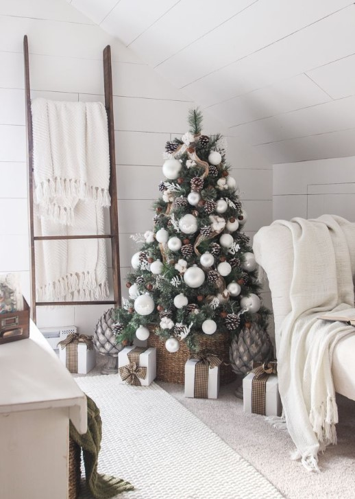

Create a charming Farmhouse-style Christmas tree that would make Chip and Jo proud! Simply combine nature’s beauty with pinecones, flocked branches, and burlap, and add some oversized white ornaments for a touch of elegance. This unique blend of rustic and chic elements will give your tree a sophisticated look that will impress everyone. Get creative, and you will have a picture-perfect tree ready to spread holiday cheer!

### **[Rustic Tree](https://www.amazon.com/Aglife-Natural-Garland-Tassels-Farmhouse/dp/B07ZWJ8MCD/)**

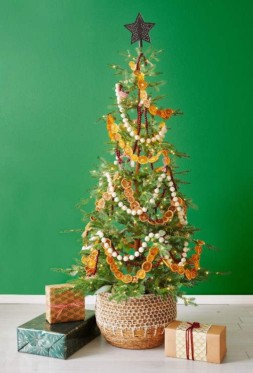

Creating this nature-inspired look is a breeze! Gather some dried oranges, faux cranberries, and a pom-pom garland. And let’s not forget about the charming straw basket, a unique alternative to the traditional tree skirt. With these simple elements, you will have a cozy and rustic feel that brings the outdoors inside.

### **[Chalkboard Christmas Tree Decorating Idea](https://www.lilyardor.com/magnetic-chalk-board-christmas-tree-diy-cricut-ornaments/)**

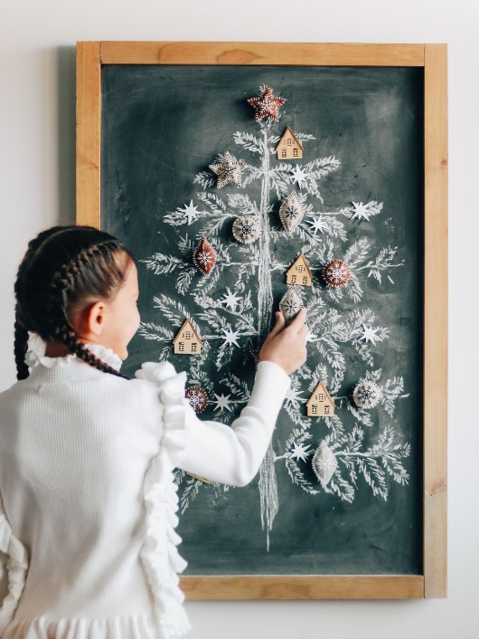

Check out this super fun and easy Christmas tree decorating idea for the whole family! It won’t take more than a few hours to complete. All you need is a metal sheet covered with chalkboard vinyl, and voilà, you have a magnetic surface for your tree. Making your own DIY ornaments is a breeze! Just grab some felt cutouts, stick a magnet on the back, and you’re good to go!

### **[Rope Christmas Tree Collar](https://abeautifulmess.com/rope-christmas-tree-collar-diy/)**

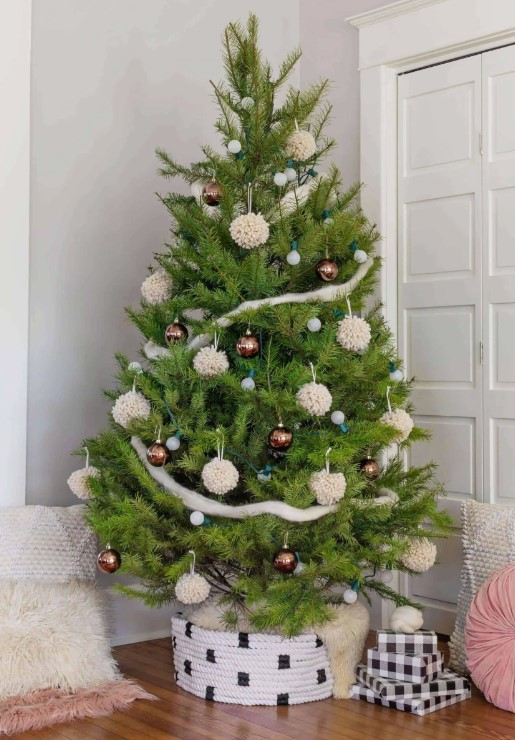

If you prefer classic ornaments, why not add a creative touch to your tree stand? Making a simple tree collar is easy and fun. Grab some basic supplies and follow these steps: use a cardboard box as a guide and apply glue as you go. This will give your tree a traditional look while showcasing your unique style.

### [**Plaid and Natural Wood**](https://theturquoisehome.com/flocked-plaid-christmas-tree/)

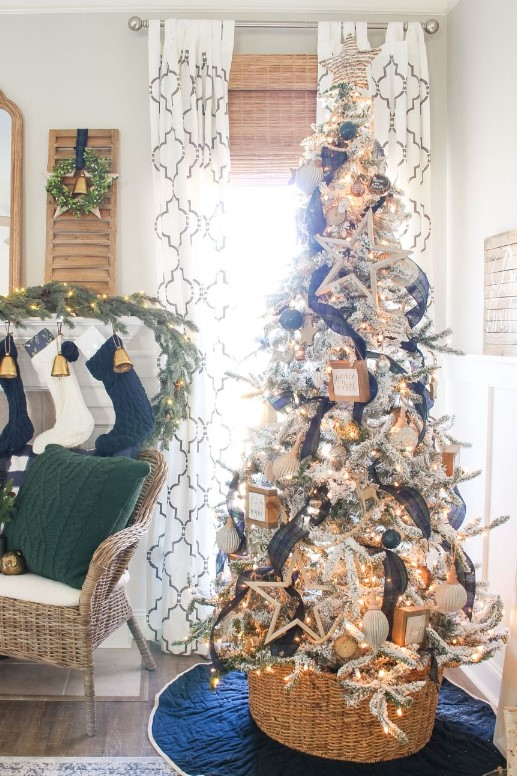

This Christmas tree’s got a beautiful navy and green plaid ribbon mixed with natural [Christmas wood ornaments](https://avada.io/loveable/personalized-christmas-ornaments/). It gives off a classy and elegant vibe. It’s a perfect combination of rustic charm and sophistication. If you are looking for a classy and eye-catching tree, this one’s a winner!

### **[Modern White Tree](https://www.amazon.com/Exceart-Embellishment-Wedding-Scrapbooking-Decoration/dp/B086QDP4Z4/)**

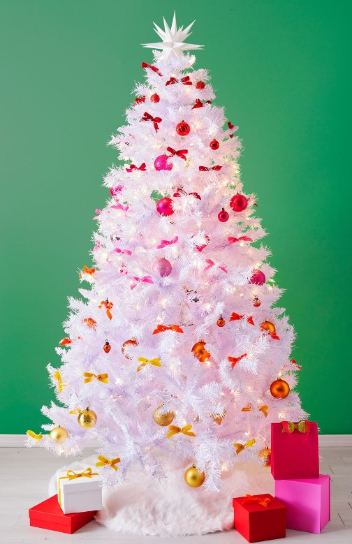

Here’s the perfect Christmas tree decorating idea for those who want to have a blast this holiday season! To create a modern and fun look, you will need some clear lights, colorful velvet bows for a beautiful ombré effect, and a bunch of ball ornaments in various colors. Complete the tree by adding a soft, plush white skirt and a lovely Moravian star on top.

### **[Green and Pink Modern Tree](https://persialou.com/modern-christmas-tree/)**

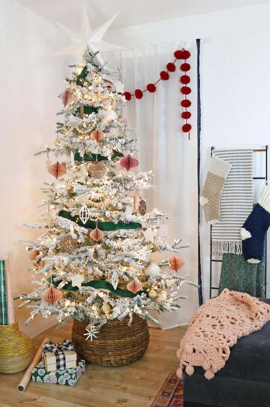

This modern Christmas tree is all about embracing nature’s beauty and adding a personal touch to your festive decor. It has charming natural textures, lovely 3D paper ornaments made with love at home, and warm wooden accents. To give it a playful twist, add a splash of color with a vibrant ribbon garland.

### **[Unexpected Greenery](https://www.keystoinspiration.com/colorful-modern-christmas-master-bedroom/)**

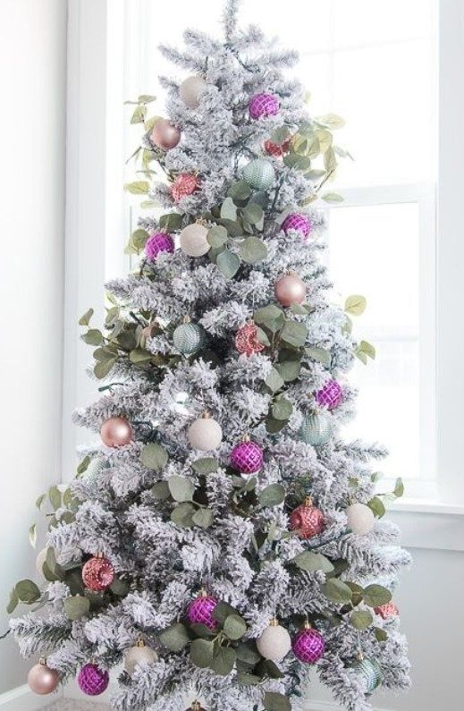

Get ready to make your Christmas tree look amazing! First, decorate your flocked tree with lots of colorful ornaments. Then, here’s a fun trick: add some surprising greenery, like beautiful eucalyptus leaves, into the branches. Your holiday guests will be impressed by your creative and festive style!

### **[Tree Branch Display](https://themerrythought.com/christmas-2/tree-branch-christmas-display/)**

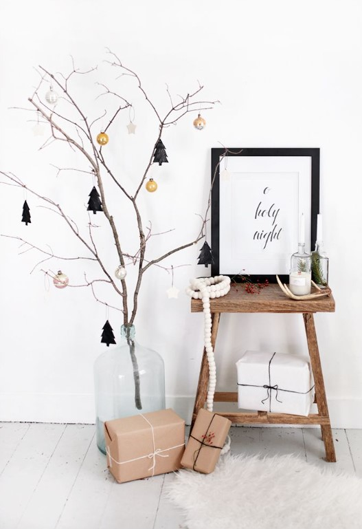

You don’t need a fancy, extravagant Christmas tree just to understand the real meaning of the holiday. If you like to keep things simple and cozy during Christmas, consider putting a tree branch in a glass jar as your decoration. It’s a minimalist and charming way to celebrate the season.

### **[Disco Ball Tree](https://studiodiy.com/diy-disco-ball-christmas-tree/)**

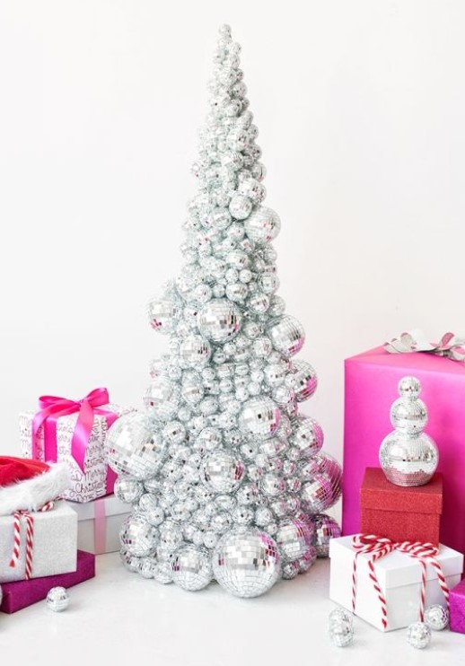

Make your holiday home shine with some glitz and glam by creating a dazzling disco ball tree! To get started, you’ll need a 24″ foam cone or wire tree. Use hot glue to carefully layer disco balls of various sizes all over the tree. This will add a touch of sparkle and fun to your festive decorations. It’s a simple and enjoyable Christmas tree decorating idea that will bring some disco magic to your holiday season!

### **[Rainbow Christmas Tree Decorating Idea](https://inspiredbycharm.com/gradient-rainbow-christmas-tree/)**

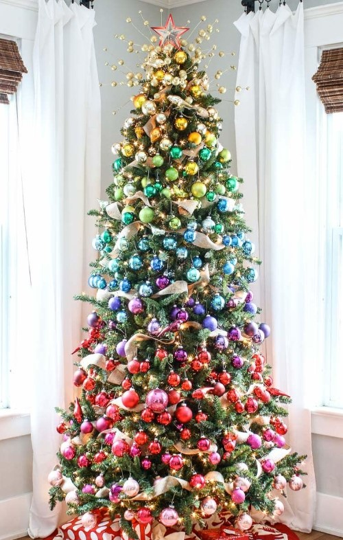

Why settle for just one color scheme when you can have them all? If you’re not sure what color to choose or you simply love multiple colors, go ahead and decorate your tree with a delightful mix of colorful ball ornaments. It’s a fun and easy way to create a rainbow of joy!

### **[Mason Jar Tree](https://www.amazon.com/dp/B08JLNHHZX)**

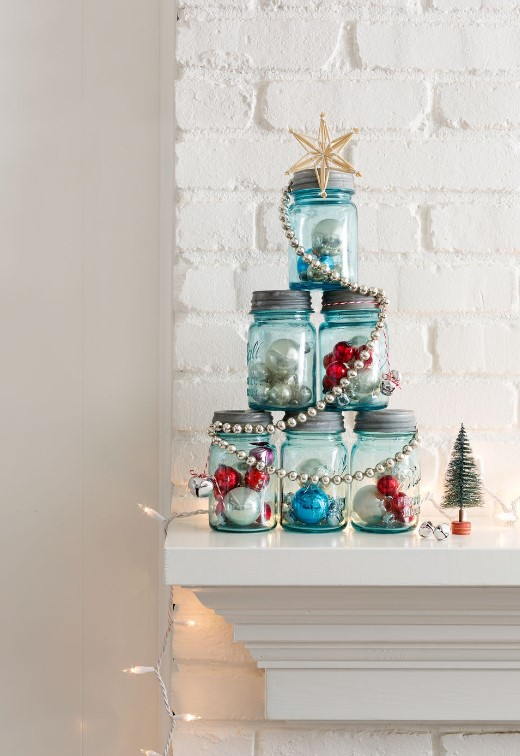

If you have some old mason jars lying around and want a fun way to use them, here’s a cool idea for you! How about creating a mini Christmas tree with these colorful jars? You can make it even more festive by filling the jars with lovely ornaments and hanging some beautiful beads on them. This little Christmas tree will look adorable on your [living room mantel](https://avada.io/loveable/personalized-christmas-stockings/)!

### **[Yarn Christmas Tree Decorating Idea](https://www.amazon.com/dp/B0042TLQ6M)**

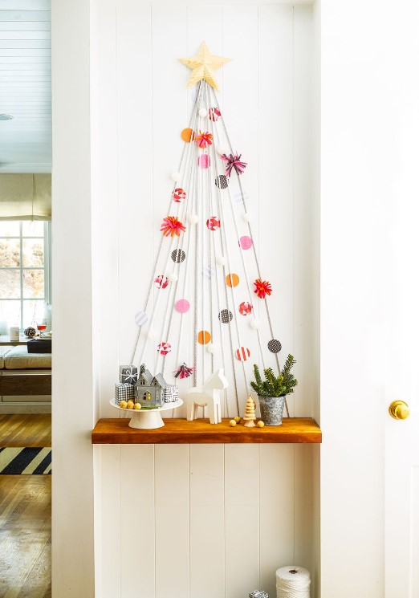

Turn that bare wall or hallway into a colorful delight with a yarn tree! Get your kids involved and have a blast decorating it together with paper circle ornaments and felt decorations. It’s a wonderful way to spark creativity and make a fun family project. Let your imagination run wild as you create a unique and charming yarn tree that will brighten up your home and bring joy to everyone.

## **Bottom Line**

Christmas tree decorating is a delightful and cherished tradition that brings joy and warmth to our homes during the holiday season. These creative **Christmas tree decorating ideas** allows us to personalize our trees, making them an expression of our unique tastes and styles. Whether you opt for a classic and elegant look with sparkling lights and heirloom ornaments or prefer a colorful theme with handmade crafts and ribbons, the key is to let your imagination run wild. Let your Christmas tree become a symbol of love, unity, and celebration, as it stands tall with twinkling lights and gleaming ornaments, creating a magical ambiance that fills the hearts of all who gather around it. Happy decorating!

- [20 Christmas Tree Decorating Ideas To Impress Your Friends and Family](https://avada.io/loveable/blog/christmas-tree-decorating-ideas/#wp-block-heading-2-3)
    - [Red and Green Plaid Ribbon Tree](https://avada.io/loveable/blog/christmas-tree-decorating-ideas/#wp-block-heading-3-4)
    - [Neutral Christmas Tree](https://avada.io/loveable/blog/christmas-tree-decorating-ideas/#wp-block-heading-3-7)
    - [Full Glam Christmas Tree Decorating Idea](https://avada.io/loveable/blog/christmas-tree-decorating-ideas/#wp-block-heading-3-10)
    - [Woodland Wonder](https://avada.io/loveable/blog/christmas-tree-decorating-ideas/#wp-block-heading-3-13)
    - [Cozy Lodge Tree](https://avada.io/loveable/blog/christmas-tree-decorating-ideas/#wp-block-heading-3-16)
    - [Velvet Goldmine](https://avada.io/loveable/blog/christmas-tree-decorating-ideas/#wp-block-heading-3-19)
    - [Retro Christmas Tree Decorating Idea](https://avada.io/loveable/blog/christmas-tree-decorating-ideas/#wp-block-heading-3-22)
    - [Farmhouse-Style](https://avada.io/loveable/blog/christmas-tree-decorating-ideas/#wp-block-heading-3-25)
    - [Rustic Tree](https://avada.io/loveable/blog/christmas-tree-decorating-ideas/#wp-block-heading-3-28)
    - [Chalkboard Christmas Tree Decorating Idea](https://avada.io/loveable/blog/christmas-tree-decorating-ideas/#wp-block-heading-3-31)
    - [Rope Christmas Tree Collar](https://avada.io/loveable/blog/christmas-tree-decorating-ideas/#wp-block-heading-3-34)
    - [Plaid and Natural Wood](https://avada.io/loveable/blog/christmas-tree-decorating-ideas/#wp-block-heading-3-37)
    - [Modern White Tree](https://avada.io/loveable/blog/christmas-tree-decorating-ideas/#wp-block-heading-3-40)
    - [Green and Pink Modern Tree](https://avada.io/loveable/blog/christmas-tree-decorating-ideas/#wp-block-heading-3-43)
    - [Unexpected Greenery](https://avada.io/loveable/blog/christmas-tree-decorating-ideas/#wp-block-heading-3-46)
    - [Tree Branch Display](https://avada.io/loveable/blog/christmas-tree-decorating-ideas/#wp-block-heading-3-49)
    - [Disco Ball Tree](https://avada.io/loveable/blog/christmas-tree-decorating-ideas/#wp-block-heading-3-52)
    - [Rainbow Christmas Tree Decorating Idea](https://avada.io/loveable/blog/christmas-tree-decorating-ideas/#wp-block-heading-3-55)
    - [Mason Jar Tree](https://avada.io/loveable/blog/christmas-tree-decorating-ideas/#wp-block-heading-3-58)
    - [Yarn Christmas Tree Decorating Idea](https://avada.io/loveable/blog/christmas-tree-decorating-ideas/#wp-block-heading-3-61)
- [Bottom Line](https://avada.io/loveable/blog/christmas-tree-decorating-ideas/#wp-block-heading-2-64)

### [Blake Simpson](https://avada.io/loveable/author/blake/)

Hi, I'm Blake from Loveable. I help people find perfect gifts for occasions like anniversaries and weddings. I also write a blog about holidays, sharing insights to make them more meaningful. Let's create unforgettable moments together!

- [Twitter](https://twitter.com/intent/tweet)
- [Facebook](https://www.facebook.com/sharer/sharer.php)
- [instagram](https://avada.io/loveable/blog/christmas-tree-decorating-ideas/)
- [pinterest](https://www.pinterest.com/loveablellc/)

## Related Posts

[### 120+ Christian Birthday Wishes To Spread Your Love](https://avada.io/loveable/blog/christian-birthday-wishes/) 

[

### 35 Best 70th Birthday Ideas To Celebrate The Special Milestone

](https://avada.io/loveable/blog/70th-birthday-ideas/)

[

### 50 Best 30th Birthday Decorations for a Remarkable Birthday Bash

](https://avada.io/loveable/blog/30th-birthday-decorations/)

[

### 40 Delicious Vegan Christmas Desserts to Delight Your Palate

](https://avada.io/loveable/blog/vegan-christmas-desserts/)

[

### 60 Christmas Team Building Activities to Boost Workplace Spirit

](https://avada.io/loveable/blog/christmas-team-building-activities/)
