This article has been written and researched by our expert Loveable through a precise methodology. [Learn more about our methodology](https://avada.io/loveable/our-methodological.html)

[Loveable](https://avada.io/loveable/) > [Blog](https://avada.io/loveable/blog/) > [Holiday](https://avada.io/loveable/holiday/)

# 20+ Easy Christmas Drawings for Your Holiday Cards, Gifts, And Invitations

Written by [Blake Simpson](https://avada.io/loveable/author/blake/) Last Updated on October 03, 2023

- [20+ Easy and Cute Christmas Drawings For All Ages](https://avada.io/loveable/blog/christmas-drawings/#wp-block-heading-2-3)
    - [Santa Claus](https://avada.io/loveable/blog/christmas-drawings/#wp-block-heading-3-4)
    - [Winter Hot Chocolate](https://avada.io/loveable/blog/christmas-drawings/#wp-block-heading-3-7)
    - [Christmas Penguin Drawing](https://avada.io/loveable/blog/christmas-drawings/#wp-block-heading-3-10)
    - [Reindeer](https://avada.io/loveable/blog/christmas-drawings/#wp-block-heading-3-13)
    - [Christmas Gift](https://avada.io/loveable/blog/christmas-drawings/#wp-block-heading-3-16)
    - [Wreath Drawing](https://avada.io/loveable/blog/christmas-drawings/#wp-block-heading-3-19)
    - [Christmas Elf Drawing](https://avada.io/loveable/blog/christmas-drawings/#wp-block-heading-3-22)
    - [Christmas Snow Globe](https://avada.io/loveable/blog/christmas-drawings/#wp-block-heading-3-25)
    - [Santa Hat Christmas Drawing](https://avada.io/loveable/blog/christmas-drawings/#wp-block-heading-3-28)
    - [Snowman](https://avada.io/loveable/blog/christmas-drawings/#wp-block-heading-3-31)
    - [Christmas Bells Drawing](https://avada.io/loveable/blog/christmas-drawings/#wp-block-heading-3-34)
    - [Snowflake](https://avada.io/loveable/blog/christmas-drawings/#wp-block-heading-3-37)
    - [Winter Mittens](https://avada.io/loveable/blog/christmas-drawings/#wp-block-heading-3-40)
    - [Christmas Stocking Drawing](https://avada.io/loveable/blog/christmas-drawings/#wp-block-heading-3-43)
    - [Polar Bear](https://avada.io/loveable/blog/christmas-drawings/#wp-block-heading-3-46)
    - [Gingerbread House](https://avada.io/loveable/blog/christmas-drawings/#wp-block-heading-3-49)
    - [Christmas Angel Drawing](https://avada.io/loveable/blog/christmas-drawings/#wp-block-heading-3-52)
    - [Santa’s Sleigh](https://avada.io/loveable/blog/christmas-drawings/#wp-block-heading-3-55)
    - [Mistletoe Drawing](https://avada.io/loveable/blog/christmas-drawings/#wp-block-heading-3-58)
    - [Gingerbread Man](https://avada.io/loveable/blog/christmas-drawings/#wp-block-heading-3-61)
    - [Christmas Tree Ornaments](https://avada.io/loveable/blog/christmas-drawings/#wp-block-heading-3-64)
    - [Candy Cane](https://avada.io/loveable/blog/christmas-drawings/#wp-block-heading-3-67)
    - [Candle Christmas Drawing](https://avada.io/loveable/blog/christmas-drawings/#wp-block-heading-3-70)
    - [Christmas Star Drawing](https://avada.io/loveable/blog/christmas-drawings/#wp-block-heading-3-73)
- [Bottom Line](https://avada.io/loveable/blog/christmas-drawings/#wp-block-heading-2-78)

The Christmas season brings forth one of the finest moments for indulging in the art of drawing. Not only do we usually have ample time to embrace our hobbies, but the weather outside is often, in a sense, frightful, leaving us with limited outdoor activities. Whether you seek inspiration for festive drawings or plan to guide young students in an art workshop, we have compiled a list of **Christmas drawings** that you’ll be eager to explore.

These adorable drawings are suitable for both children and adults. Let them serve as an inspiration for your winter doodling endeavors or as embellishments for your holiday cards, invitations, and presents. Even beginners can confidently explore most of these Christmas drawings, making them a joy to try out!

## **20+ Easy and Cute Christmas Drawings For All Ages**

### [**Santa Claus**](https://helloartsy.com/how-to-draw-santa-claus/)

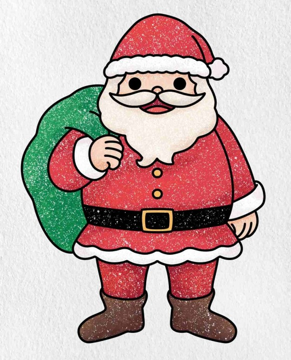

Santa is undoubtedly one of the most iconic symbols of Christmas. Thankfully, drawing the famous Mr. Claus is much simpler than you might imagine. This Christmas drawing is super easy, making it suitable for kids to create their own Santa masterpiece.

### [**Winter Hot Chocolate**](https://helloartsy.com/how-to-draw-a-hot-chocolate/)

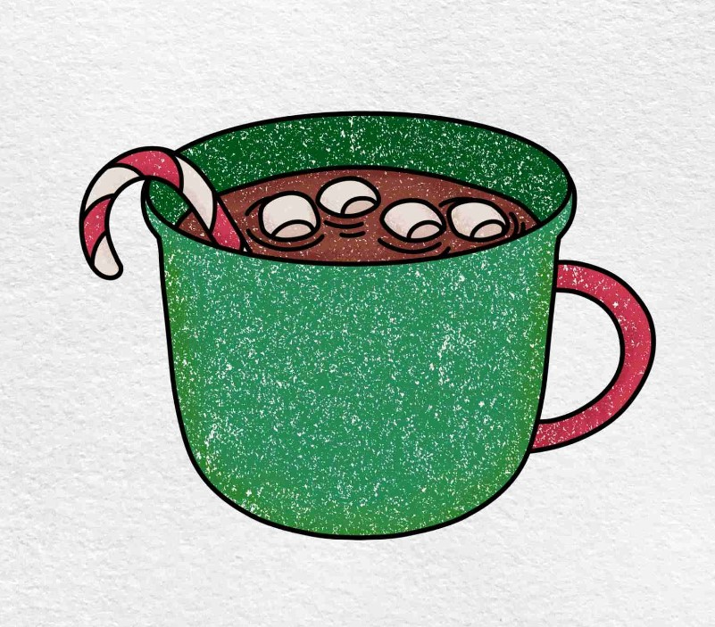

Nothing quite announces the arrival of winter like a steaming cup of hot chocolate. Although hot chocolate isn’t exclusively a Christmas drink, you can easily infuse it with holiday spirit by sipping it from a charming Christmas-themed mug.

### [**Christmas Penguin Drawing**](https://helloartsy.com/how-to-draw-a-christmas-penguin/)

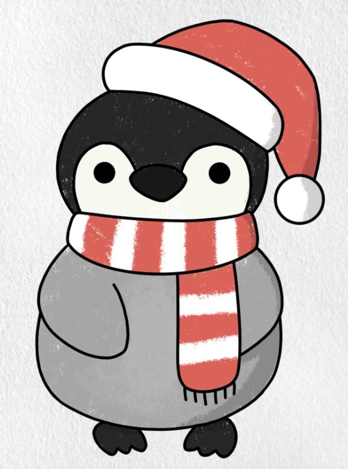

Penguins make charming winter or Christmas drawings, exuding cuteness. They are easy to draw and look super cute in any pose. They are a great way to add fun and whimsy to this holiday season.

### [**Reindeer**](https://artprojectsforkids.org/draw-rudolph-red-nosed-reindeer/)

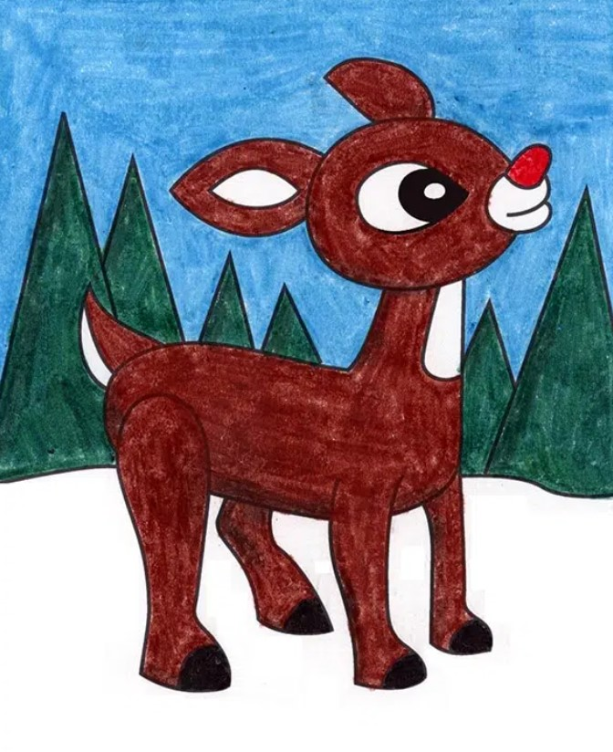

Christmas wouldn’t be complete without Rudolph guiding Santa’s sleigh. This Rudolph drawing can be used as a base for reindeer drawings, simply by swapping the red nose for a smaller black one. Try adding ornaments or string lights in the antlers for a delightful touch to your artwork.

### [**Christmas Gift**](https://helloartsy.com/how-to-draw-a-christmas-present/)

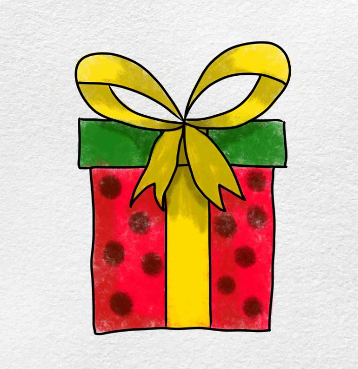

What makes the holiday season truly special? Though we often acknowledge the importance of spending time with loved ones and embracing kindness, there’s an undeniable joy in both giving and receiving gifts that elevate the Christmas season to new heights.

### [**Wreath Drawing**](https://easydrawingguides.com/how-to-draw-christmas-wreath/)

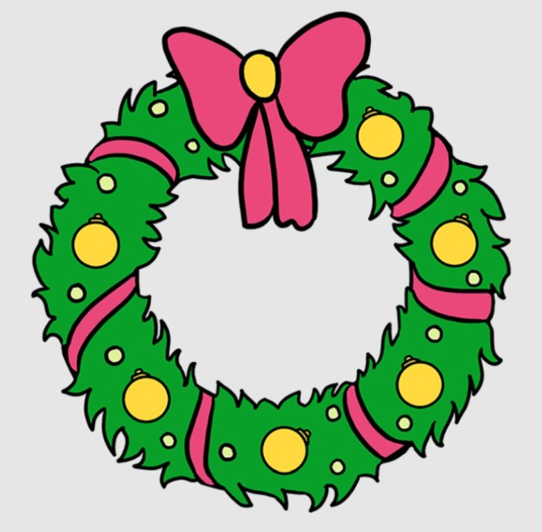

Home decorating is an enjoyable activity during Christmas. Not only do we take pleasure in investing our time and effort into decorations, but we also find joy in exploring our neighbors’ creative ideas as we drive around the neighborhood. Christmas decorations also make great inspiration for Christmas drawings. A perfect example is this lovely wreath, inspired by the festive decorations.

### [**Christmas Elf Drawing**](https://artprojectsforkids.org/step-step-elf-drawing/)

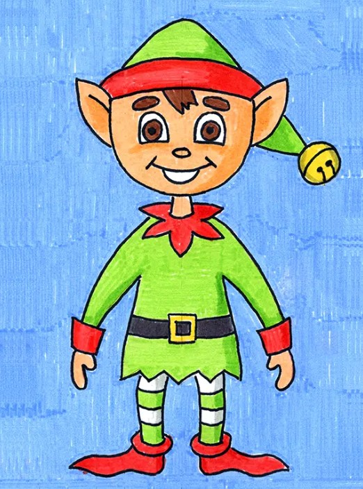

Christmas elves are undoubtedly charming characters for Christmas drawings. Their fame stems from their unwavering dedication to Santa’s workshop, where they work tirelessly to create toys and gifts for children around the globe. These festive drawings portray the elves in red and green costumes embellished with jingle bells, while their smiles radiate pure merriment. Their mischievous expressions perfectly encapsulate the joyful meaning of the season.

### [**Christmas Snow Globe**](https://artprojectsforkids.org/how-to-draw-a-snow-globe/)

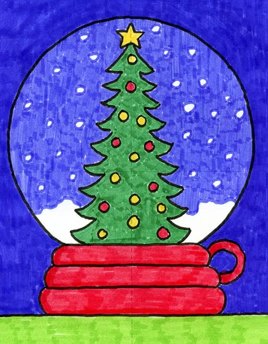

The perfect drawing for Christmas is a snow globe because you can draw almost anything inside it. If you want a winter wonderland feel, you can even add snow inside the globe. Let your creativity flow and draw your favorite Yuletide scenes within these magical spheres.

### [**Santa Hat Christmas Drawing**](https://artprojectsforkids.org/draw-a-santa-hat/)

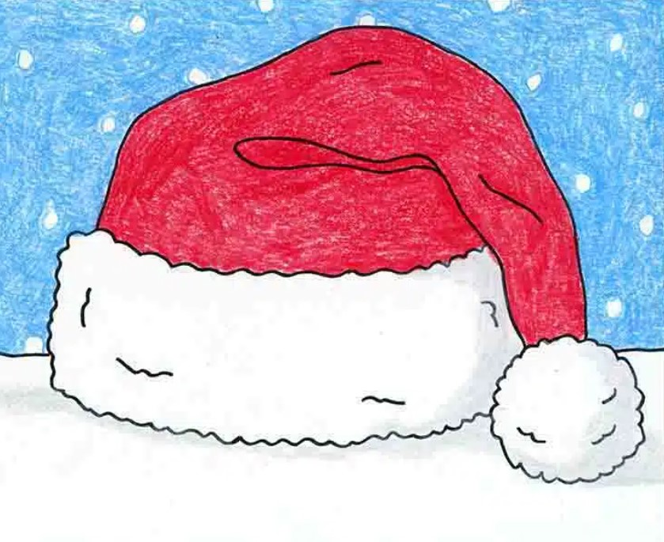

Drawing Santa hats is a breeze, yet with a touch of creativity, you can elevate yours to the next level. Add zigzags to the pompom and hat base to create a fuzzy effect. Your Santa hat will undoubtedly stand out with these simple yet effective tweaks.

### [**Snowman**](https://helloartsy.com/cute-snowman-drawing/)

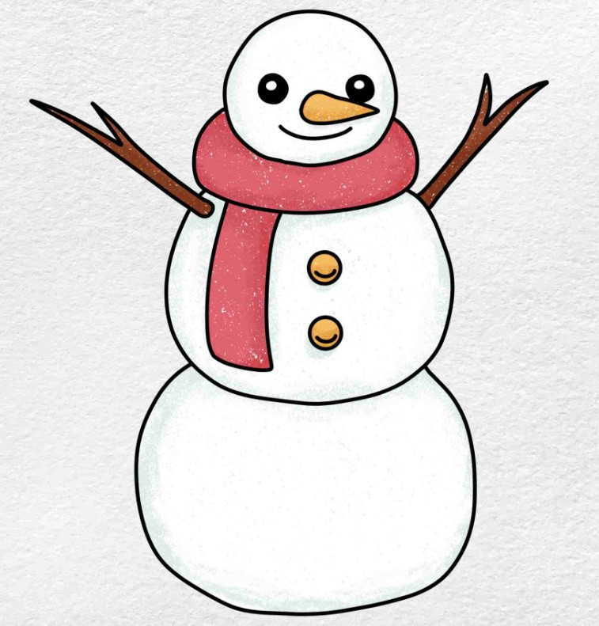

A snowman is another Christmas drawing that is easy to customize with small changes. Try drawing your own snowman with vibrant, lively colors to craft a delightful winter masterpiece that exudes cheerfulness.

### [**Christmas Bells Drawing**](https://helloartsy.com/how-to-draw-christmas-bells/)

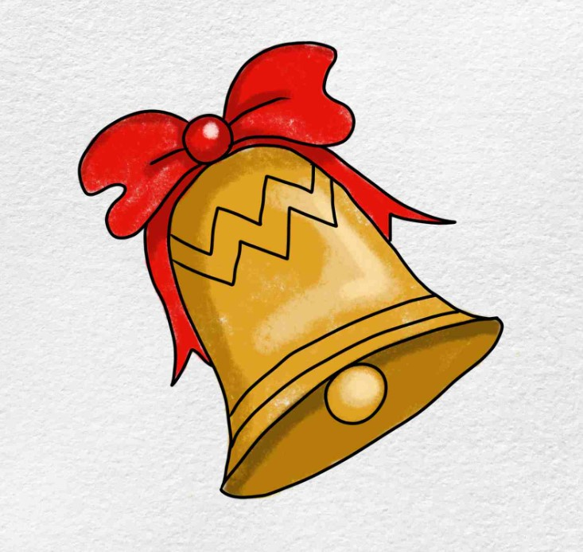

Discover the enchantment of Christmas traditions! Tie a red bow around your golden bells to enhance their charm. These vivid ornaments will infuse your holiday celebration with an extra dose of Christmas spirit.

### [**Snowflake**](https://helloartsy.com/how-to-draw-small-snowflakes/)

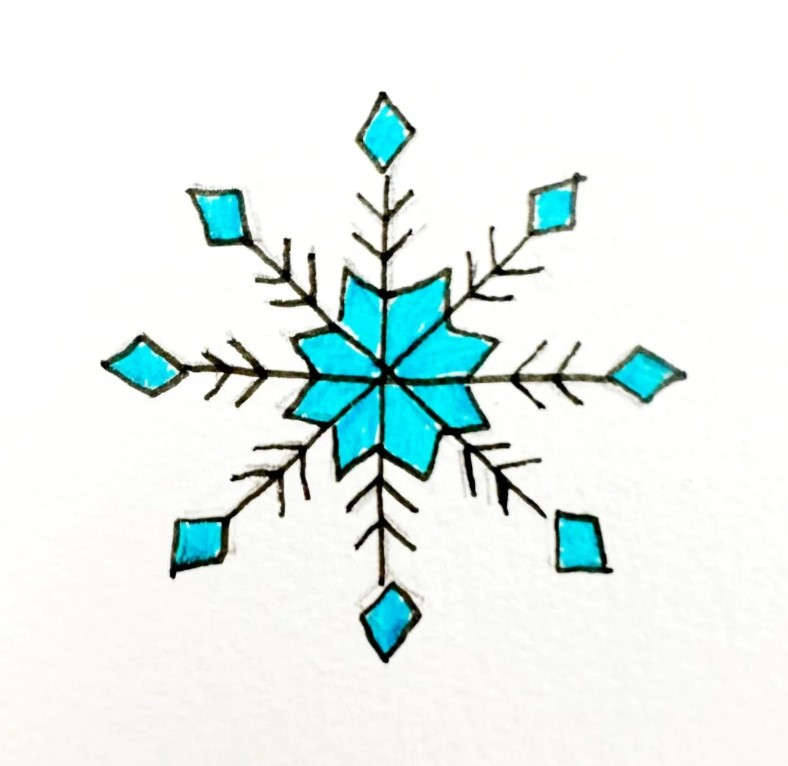

Each snowflake has its own unique charm, allowing you to embrace your creativity while seeking inspiration for your Christmas drawing. You can try various patterns with different lines and geometric shapes. Create your basic guides with a pencil first, then draw over them with a ruler if you’re having trouble making your snowflake symmetrical.

### [**Winter Mittens**](https://helloartsy.com/christmas-mittens-drawing/)

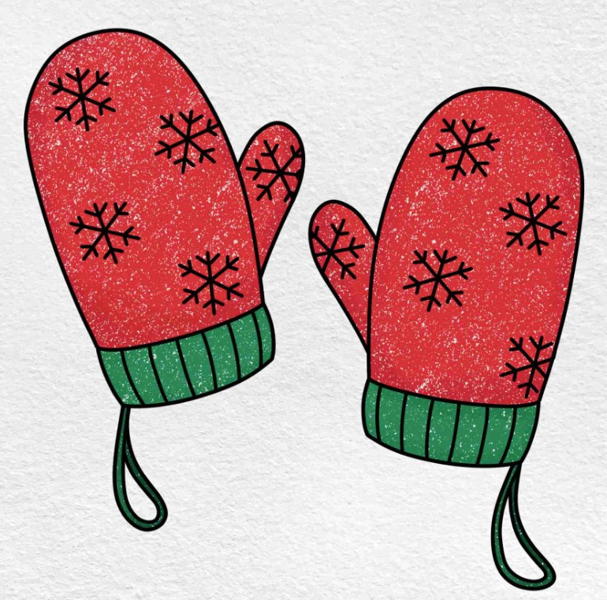

It’s easy to draw mitten outlines, so you can get creative with patterns instead. Embrace your creativity and adorn them with unique designs!

### [**Christmas Stocking Drawing**](https://artprojectsforkids.org/how-to-draw-a-stocking/)

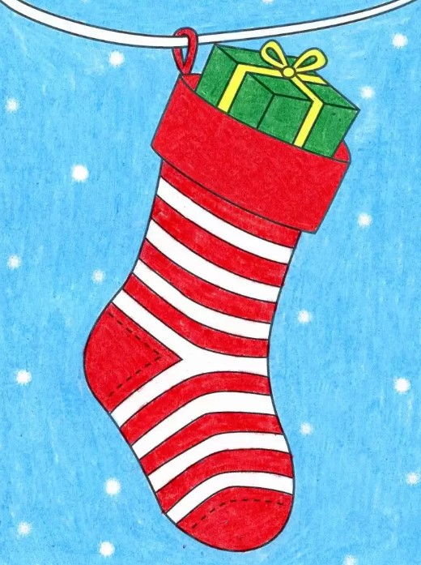

After you have completed your [Christmas stocking](https://avada.io/loveable/personalized-christmas-stockings/) drawing, fill it up with some toys and candy. Get creative and design unique stockings for every cherished member of your family!

### [**Polar Bear**](https://helloartsy.com/how-to-draw-a-christmas-polar-bear/)

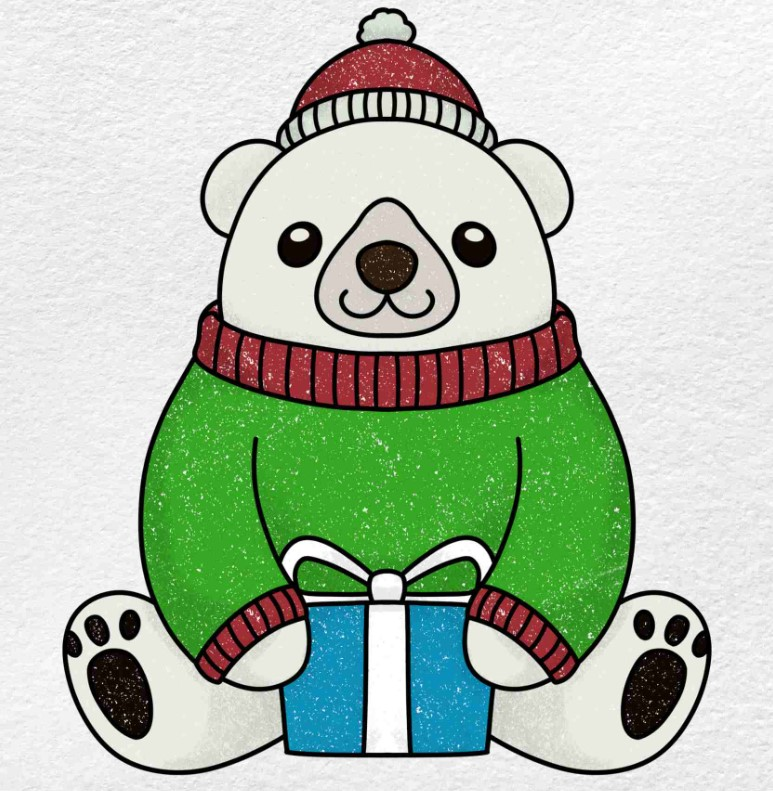

It’s so much fun to doodle polar bears in the wintertime. You can also draw a scarf and candy cane to make it extra special, but a Santa hat would look great too!

### [**Gingerbread House**](https://artprojectsforkids.org/how-to-draw-a-gingerbread-house/)

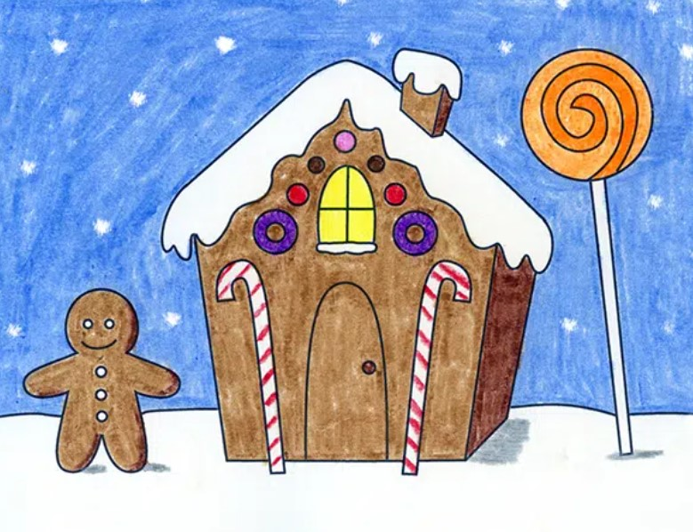

Drawing a gingerbread house might seem complicated, but it is very simple to do. Start by drawing the outline of your gingerbread house. Then draw a snow-covered roof, chimney, and windows. As a final touch, add some candy-inspired decorations.

### [**Christmas Angel Drawing**](https://helloartsy.com/christmas-angel-drawing-easy/)

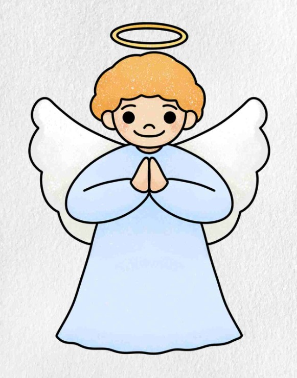

Christmas angels make adorable Christmas drawings during this festive season. Express your creativity by drawing the angel in any style you like, but be sure to add fluffy wings and a halo. To truly capture the essence of a Christmas angel, consider dressing them in festive colors and adding pink circles to their cheeks, giving them a rosy, cheerful appearance.

### [**Santa’s Sleigh**](https://helloartsy.com/how-to-draw-santas-sleigh/)

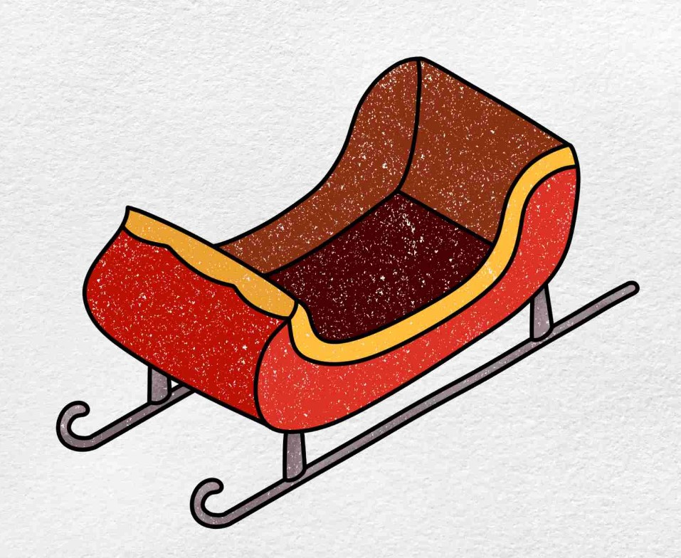

The Santa’s sleigh is perfect on its own or as a base for your festive drawings! If you want to make it look more fancy, add a scroll design and gold accents. Unleash your artistic flair and witness the magic unfold!

### [**Mistletoe Drawing**](https://helloartsy.com/how-to-draw-mistletoe/)

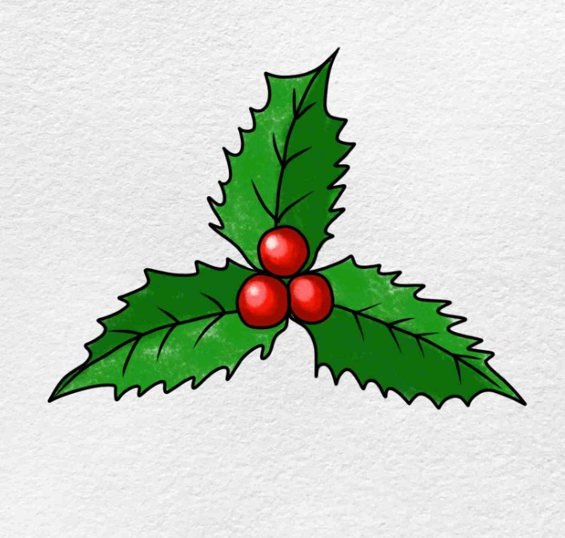

Another classic Christmas symbol is the mistletoe, which is easy to draw. Yet, exercise caution in displaying this artwork at your Christmas party, unless you intend for your guests to be caught beneath its charm!

### [**Gingerbread Man**](https://artprojectsforkids.org/how-to-draw-a-gingerbread-man/)

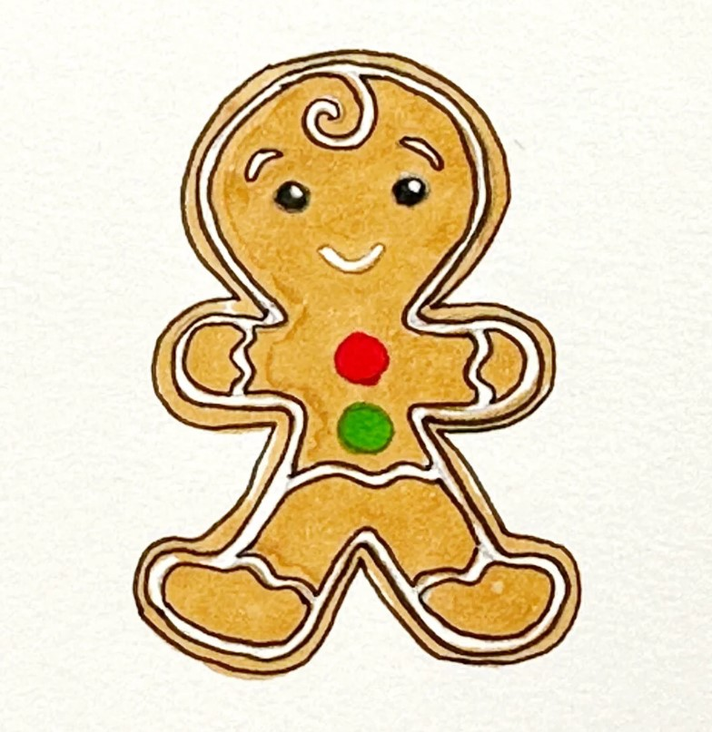

Here’s a lovely Christmas drawing for beginners – super easy to recreate! First, draw the outline of a gingerbread cookie. Then comes the fun part – you can decorate it in any way you want! To make it look like there’s icing on top, just leave a white outline around the cookie when you color it in.

### [**Christmas Tree Ornaments**](https://helloartsy.com/easy-ornament-drawing/)

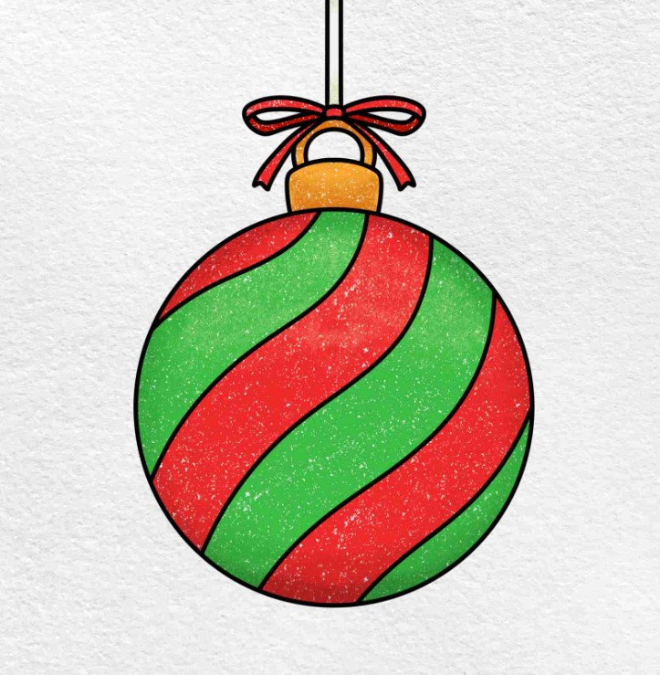

To create a cute Christmas [tree ornament](https://avada.io/loveable/personalized-christmas-ornaments/), you’ll need a basic ornament shape. It can be round or you can choose a pointed or any special shape you like. Next, let your creativity flow and decorate the ornament with your own design. Add vibrant colors to make it stand out! Lastly, don’t forget the hook at the top, so it looks like your ornament is hanging beautifully on the Christmas tree.

### [**Candy Cane**](https://artprojectsforkids.org/how-to-draw-a-candy-cane/)

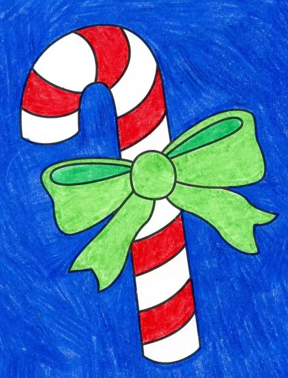

Don’t you just love those sweet candy canes during Christmas? Whether you’re hanging them on your trees or putting them in your stockings, they are a classic holiday treat. And guess what? Drawing candy canes is simple too! So, get your pens and papers ready, because you’ll have a blast creating these delightful and yummy-looking candies this Christmas!

### **[Candle Christmas Drawing](https://artprojectsforkids.org/how-to-draw-a-candle/)**

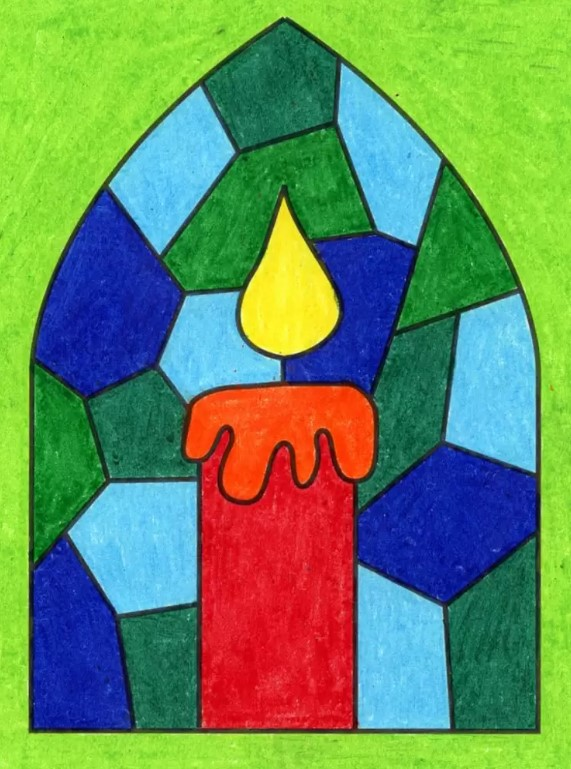

Candles are a neat yet often overlooked symbol of the Christmas season. They can be a joyful drawing experience, especially for beginners or kids searching for creative Christmas drawings. Give it a go, and you’ll be surprised how delightful these candles can be in capturing the holiday spirit! So grab your colors and let the artistic journey begin!

### **[Christmas Star Drawing](https://helloartsy.com/how-to-draw-a-christmas-star/)**

Christmas drawings often feature a significant symbol, the Christmas star. This star stands for hope, guidance, and the birth of Jesus. It reminds us of the incredible event that brings joy and togetherness during the holiday. Its presence in Christmas drawings truly captures the real magic of the festive season.

**_See More:_**

- Easy [Halloween Drawing Ideas](https://avada.io/loveable/blog/halloween-drawing-ideas/)

## **Bottom Line**

**Christmas drawings** truly embody the spirit of the holiday season, capturing the joy, warmth, and nostalgia that fills our hearts. As we admire these masterpieces, we are reminded that Christmas is not just a time of exchanging gifts but a celebration of creativity, love, and togetherness. This holiday season, let us revel in the enchantment of Christmas drawings and allow their magic to inspire us to spread joy and goodwill to all.

- [20+ Easy and Cute Christmas Drawings For All Ages](https://avada.io/loveable/blog/christmas-drawings/#wp-block-heading-2-3)
    - [Santa Claus](https://avada.io/loveable/blog/christmas-drawings/#wp-block-heading-3-4)
    - [Winter Hot Chocolate](https://avada.io/loveable/blog/christmas-drawings/#wp-block-heading-3-7)
    - [Christmas Penguin Drawing](https://avada.io/loveable/blog/christmas-drawings/#wp-block-heading-3-10)
    - [Reindeer](https://avada.io/loveable/blog/christmas-drawings/#wp-block-heading-3-13)
    - [Christmas Gift](https://avada.io/loveable/blog/christmas-drawings/#wp-block-heading-3-16)
    - [Wreath Drawing](https://avada.io/loveable/blog/christmas-drawings/#wp-block-heading-3-19)
    - [Christmas Elf Drawing](https://avada.io/loveable/blog/christmas-drawings/#wp-block-heading-3-22)
    - [Christmas Snow Globe](https://avada.io/loveable/blog/christmas-drawings/#wp-block-heading-3-25)
    - [Santa Hat Christmas Drawing](https://avada.io/loveable/blog/christmas-drawings/#wp-block-heading-3-28)
    - [Snowman](https://avada.io/loveable/blog/christmas-drawings/#wp-block-heading-3-31)
    - [Christmas Bells Drawing](https://avada.io/loveable/blog/christmas-drawings/#wp-block-heading-3-34)
    - [Snowflake](https://avada.io/loveable/blog/christmas-drawings/#wp-block-heading-3-37)
    - [Winter Mittens](https://avada.io/loveable/blog/christmas-drawings/#wp-block-heading-3-40)
    - [Christmas Stocking Drawing](https://avada.io/loveable/blog/christmas-drawings/#wp-block-heading-3-43)
    - [Polar Bear](https://avada.io/loveable/blog/christmas-drawings/#wp-block-heading-3-46)
    - [Gingerbread House](https://avada.io/loveable/blog/christmas-drawings/#wp-block-heading-3-49)
    - [Christmas Angel Drawing](https://avada.io/loveable/blog/christmas-drawings/#wp-block-heading-3-52)
    - [Santa’s Sleigh](https://avada.io/loveable/blog/christmas-drawings/#wp-block-heading-3-55)
    - [Mistletoe Drawing](https://avada.io/loveable/blog/christmas-drawings/#wp-block-heading-3-58)
    - [Gingerbread Man](https://avada.io/loveable/blog/christmas-drawings/#wp-block-heading-3-61)
    - [Christmas Tree Ornaments](https://avada.io/loveable/blog/christmas-drawings/#wp-block-heading-3-64)
    - [Candy Cane](https://avada.io/loveable/blog/christmas-drawings/#wp-block-heading-3-67)
    - [Candle Christmas Drawing](https://avada.io/loveable/blog/christmas-drawings/#wp-block-heading-3-70)
    - [Christmas Star Drawing](https://avada.io/loveable/blog/christmas-drawings/#wp-block-heading-3-73)
- [Bottom Line](https://avada.io/loveable/blog/christmas-drawings/#wp-block-heading-2-78)

### [Blake Simpson](https://avada.io/loveable/author/blake/)

Hi, I'm Blake from Loveable. I help people find perfect gifts for occasions like anniversaries and weddings. I also write a blog about holidays, sharing insights to make them more meaningful. Let's create unforgettable moments together!

- [Twitter](https://twitter.com/intent/tweet)
- [Facebook](https://www.facebook.com/sharer/sharer.php)
- [instagram](https://avada.io/loveable/blog/christmas-drawings/)
- [pinterest](https://www.pinterest.com/loveablellc/)

## Related Posts

[### 120+ Christian Birthday Wishes To Spread Your Love](https://avada.io/loveable/blog/christian-birthday-wishes/) 

[

### 35 Best 70th Birthday Ideas To Celebrate The Special Milestone

](https://avada.io/loveable/blog/70th-birthday-ideas/)

[

### 50 Best 30th Birthday Decorations for a Remarkable Birthday Bash

](https://avada.io/loveable/blog/30th-birthday-decorations/)

[

### 40 Delicious Vegan Christmas Desserts to Delight Your Palate

](https://avada.io/loveable/blog/vegan-christmas-desserts/)

[

### 60 Christmas Team Building Activities to Boost Workplace Spirit

](https://avada.io/loveable/blog/christmas-team-building-activities/)
