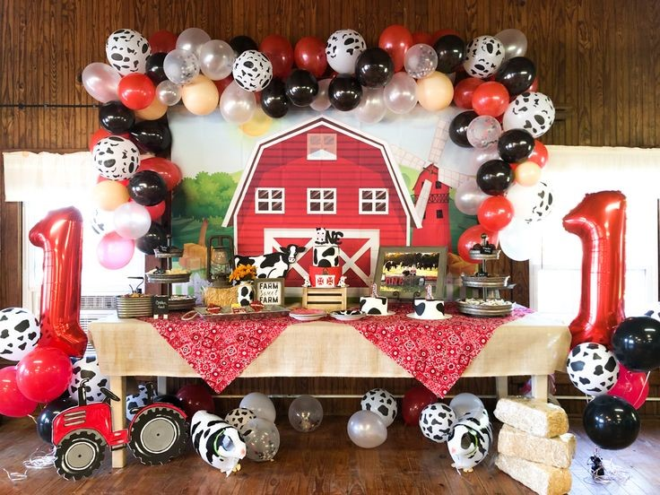
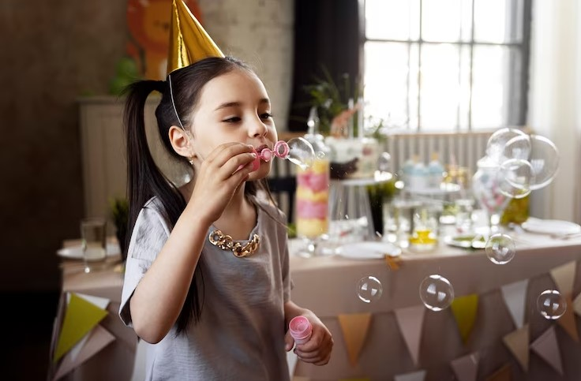

This article has been written and researched by our expert Loveable through a precise methodology. [Learn more about our methodology](https://avada.io/loveable/our-methodological.html)

[Loveable](https://avada.io/loveable/) > [Blog](https://avada.io/loveable/blog/) > [Family](https://avada.io/loveable/family/)

# 20 First Birthday Ideas To Celebrate Your Little One’s Big Day

Written by [Rose Bryne](https://avada.io/loveable/author/rose/) Last Updated on September 25, 2023

- [How Important of The First Birthday Around The World?](https://avada.io/loveable/blog/first-birthday-ideas/#wp-block-heading-2-3)
- [20 Creative First Birthday Ideas to Make an Unforgettable Birthday](https://avada.io/loveable/blog/first-birthday-ideas/#wp-block-heading-2-12)
    - [1\. Cake Smash Photoshoot](https://avada.io/loveable/blog/first-birthday-ideas/#wp-block-heading-3-15)
    - [2\. Themed Photo Booth](https://avada.io/loveable/blog/first-birthday-ideas/#wp-block-heading-3-17)
    - [3\. Balloon Wonderland](https://avada.io/loveable/blog/first-birthday-ideas/#wp-block-heading-3-20)
    - [4\. Outdoor Picnic](https://avada.io/loveable/blog/first-birthday-ideas/#wp-block-heading-3-23)
    - [5\. Baby’s Time Capsule](https://avada.io/loveable/blog/first-birthday-ideas/#wp-block-heading-3-26)
    - [6\. Giant Baby Blocks](https://avada.io/loveable/blog/first-birthday-ideas/#wp-block-heading-3-29)
    - [7\. Baby Animal Farm](https://avada.io/loveable/blog/first-birthday-ideas/#wp-block-heading-3-32)
    - [8\. Storybook Theme](https://avada.io/loveable/blog/first-birthday-ideas/#wp-block-heading-3-35)
    - [9\. Baby-Friendly Food Stations](https://avada.io/loveable/blog/first-birthday-ideas/#wp-block-heading-3-38)
    - [10\. Smashable Pinata](https://avada.io/loveable/blog/first-birthday-ideas/#wp-block-heading-3-41)
    - [11\. Baby Art Station](https://avada.io/loveable/blog/first-birthday-ideas/#wp-block-heading-3-44)
    - [12\. Bubble Bonanza](https://avada.io/loveable/blog/first-birthday-ideas/#wp-block-heading-3-47)
    - [13\. Baby Yoga or Music Session](https://avada.io/loveable/blog/first-birthday-ideas/#wp-block-heading-3-50)
    - [14\. Fairy Tale Theme](https://avada.io/loveable/blog/first-birthday-ideas/#wp-block-heading-3-53)
    - [15\. Time of Day Party](https://avada.io/loveable/blog/first-birthday-ideas/#wp-block-heading-3-56)
    - [16\. Custom Onesie Decorating](https://avada.io/loveable/blog/first-birthday-ideas/#wp-block-heading-3-59)
    - [17\. Garden Tea Party](https://avada.io/loveable/blog/first-birthday-ideas/#wp-block-heading-3-62)
    - [18\. Baby Science Exploration](https://avada.io/loveable/blog/first-birthday-ideas/#wp-block-heading-3-65)
    - [19\. Baby-friendly Concert](https://avada.io/loveable/blog/first-birthday-ideas/#wp-block-heading-3-68)
    - [20\. Nature Adventure](https://avada.io/loveable/blog/first-birthday-ideas/#wp-block-heading-3-71)
- [5 Helpful First Birthday Ideas Planning Tips](https://avada.io/loveable/blog/first-birthday-ideas/#wp-block-heading-2-74)
    - [1\. Theme and Decorations](https://avada.io/loveable/blog/first-birthday-ideas/#wp-block-heading-3-77)
    - [2\. Guest List and Invitations](https://avada.io/loveable/blog/first-birthday-ideas/#wp-block-heading-3-83)
    - [3\. Venue](https://avada.io/loveable/blog/first-birthday-ideas/#wp-block-heading-3-91)
    - [4\. Date and Time](https://avada.io/loveable/blog/first-birthday-ideas/#wp-block-heading-3-97)
    - [5\. Food and Drinks](https://avada.io/loveable/blog/first-birthday-ideas/#wp-block-heading-3-103)
- [Bottom Line](https://avada.io/loveable/blog/first-birthday-ideas/#wp-block-heading-2-111)

Congratulations on reaching a remarkable moment in your parenting journey! Your little one’s first birthday is a fascinating event that’s all about celebrating this special milestone. As you plan this joyous day, we’re here to assist you with 20 wonderful **first birthday ideas** that will make it unforgettable. 

Such as some parties with interesting themes or some creative and unique ideas to lift up your [personalized 1st birthday gifts](https://avada.io/loveable/personalized-1st-birthday-gifts/) for your little angel. All these ideas will go toward an intimate family get-together and a lively extravaganza. That’s why you craft an extraordinary celebration to show off your love. Now, Let’s satisfy your curiosity and explore 20 delightful ways to commemorate your precious one’s significant first year!

## **How Important of The First Birthday Around The World?**

Might you be curious about the significance of first birthdays worldwide? Thus, why not come here to discover how cultures embrace this milestone differently? Let’s take this flight to travel around the world now!

- **Korean “Doljanchi”**: In Korea, the “doljanchi” is celebrated with colorful decorations and traditional customs. The child is dressed in a hanbok and presented with symbolic objects that predict their future.

- **Mexican “Un Dos Tres”**: Mexicans celebrate with a “un dos tres” ritual, where the child selects from objects like toys, money, and books. This choice is believed to offer insights into their future talents.

- **Chinese “Zhua Zhou”**: In China, the “zhua zhou” tradition involves placing various items in front of the child. The chosen item is believed to predict their future interests and talents.

- **Japanese “Hatsu-Zekku”**: The first birthday, or “hatsu-zekku,” is celebrated in Japan with a focus on long life and health. The child is often dressed in traditional attire and offered a special meal.

- **British Cake Smash**: The cake smash has gained popularity in the UK and other Western cultures. The child is given a cake to explore and “smash,” resulting in adorable and messy photos.

- **Brazilian “Festa de um Ano”**: In Brazil, the first birthday, or “Festa de um Ano,” is often a grand affair with elaborate decorations, music, and delicious treats.

## **20 Creative First Birthday Ideas to Make an Unforgettable Birthday**

Head to 20 Creative First Birthday Ideas, your go-to source for inspiration! With various imaginative suggestions, you will embark on this wonderful journey of celebrating your baby’s first remarkable year! Don’t talk more; see how magic comes into your life below. 

### **1\. Cake Smash Photoshoot**

With this colorful Cake Smash photoshoot, you will see their joyous expression as they dig into the cake and the laughter shared as frosting gets everywhere. Plus, the photos captured during the session become cherished memories you can treasure forever. 

### **2\. Themed Photo Booth**

Themed Photo Booth, this charming activity promises adorable snapshots and unforgettable moments. Your baby will dress up in cute costumes to capture spontaneous smiles. This idea is a surefire way to make unforgettable memories that will warm your heart for years.

### **3\. Balloon Wonderland**

The Balloon Wonderland experience might be exactly what you’re looking for. The interactive setup offers endless opportunities for playful photos and heartwarming memories. That’s why making the first birthday truly special is a fantastic choice.

### **4\. Outdoor Picnic**

Do you want to have an easy and simple birthday? It is for you. You and your loved ones can enjoy delicious treats while your baby explores the wonders of the outdoors. He can play with soft grass and discover new textures.

### **5\. Baby’s Time Capsule**

Baby’s Time Capsule is a unique way to celebrate your baby’s first birthday. You’ll gather meaningful mementos, heartfelt letters, and tiny treasures. All of them represent the beginning of your little one’s journey. And when you and your child reopen it years from now, you’ll relive the joy of his/her first year. 

### **6\. Giant Baby Blocks**

Why not consider the Giant Baby Blocks idea to have a funny birthday for your baby? The blocks can be personalized with your baby’s name or age. Then, your little one will delight as he interacts with these colorful structures, stacking and exploring. This idea is also flexible when adding it for indoor and outdoor parties.

### **7\. Baby Animal Farm**

Baby Animal Farm is a delightful experience that brings the farm’s magic to your celebration. Your baby can play with cute, friendly animals like fluffy bunnies or playful lambs. With opportunities for petting, this idea will fill the party with joy for you, your baby, and your guests.

### **8\. Storybook Theme**

Are you embarking on your baby’s first birthday planning? The Storybook Theme is a charming choice that brings beloved tales to life. You can choose from classic fairy tales or modern adventures, tailoring the theme to your child’s preferences. 

### **9\. Baby-Friendly Food Stations**

This idea ensures that both little ones and adults enjoy the party. You’ll create a fun and stress-free dining experience with various age-appropriate, finger-friendly foods. While babies explore new flavors, adults can savor delicious treats too. 

### **10\. Smashable Pinata**

Let’s elevate your baby’s first birthday with a Smashable Pinata. You can personalize the pinata with various themes to match your party’s vibe. As your baby smashes away, you’ll capture heart-touching photos and create unforgettable memories. 

### **11\. Baby Art Station**

With this Baby Art Station idea, you use safe and non-toxic materials and, with your baby make some artistic masterpieces. This idea encourages sensory development and bonding, making it a meaningful and enjoyable activity for both of you. 

### **12\. Bubble Bonanza**

It would be your mistake when you miss the Bubble Bonanza idea. In this suggestion, you may see the pure joy on your little one’s face as they chase and pop colorful bubbles, filling the air with magic. It is also why you should choose this idea for your baby’s upcoming first birthday. 

### **13\. Baby Yoga or Music Session**

Baby Yoga or Music Sessions will amazingly bring you and your baby a dynamic and joyful experience. Your little one can engage in gentle yoga poses or sway to the rhythm of music. When you see this situation, you cannot stand your smile and laugh out loud with him/her. 

### **14\. Fairy Tale Theme**

A Fairy Tale-themed party is fascinating to transform your baby’s first birthday into a magical adventure. You can decorate your house with familiar characters and colorful decor to make this party. Remember to dress up your baby with a beautiful costume to experience this theme better. 

### **15\. Time of Day Party**

Through this idea, you and your little one share special moments with friends and family at their peak energy. With flexible timings, you can ensure a relaxed and enjoyable atmosphere that suits everyone. So, if you are busy parents, let’s try this one. 

### **16\. Custom Onesie Decorating**

Custom Onesie Decorating activity is a connecting idea for you to stay with your baby and create sweet memories. You and your little one can personalize a onesie by using colorful paints, stamps, and designs. It would be a tangible way to preserve the magic of your baby’s first year.

### **17\. Garden Tea Party**

If you desire the first birthday idea of elegance and playfulness, the Garden Tea Party is ideal. Through a birthday party in the garden, your little angel can explore a picturesque outdoor setting adorned with flowers and decorations. Your guests can enjoy a relaxed atmosphere while sipping tea and indulging in delightful treats. 

### **18\. Baby Science Exploration**

This idea is special for the little boy’s parents. This kind of activity combines play and discovery to delight your boy and keep him away from being bored through hands-on activities. Besides, with the goal of education, this idea will nurture your baby’s curiosity and set the stage for a lifetime of learning.

### **19\. Baby-friendly Concert**

The Baby-friendly Concert is a joyful choice that introduces your little one to the magic of music. With songs tailored for young ears, this musical journey captivates his attention and fosters a love for melodies. Therefore, why not warm up the party’s atmosphere with rhythmic beats?

### **20\. Nature Adventure**

The first birthday idea is to take a nature adventure that would be a unique experience for your baby. You can set a backdrop featuring fresh air, sunshine, and the beauty of nature. It is an incredible chance for your baby to observe wildlife and foster a love for nature.

## **5 Helpful First Birthday Ideas Planning Tips**

If you are eager for your baby’s first birthday celebration, here are 5 helpful tips to ensure a joyful and stress-free experience.

### **1\. Theme and Decorations**

Select a theme that resonates with your baby’s personality or interests. 

- Decorations like banners, balloons, and table settings that match the theme. 
- Mix and match colors and patterns to create an appealing visual experience. 

**Tips**: Keeping everything simple yet charming works wonders.

**Where to buy party supplies**: Amazon, Etsy, Walmart, and Party City

### **2\. Guest List and Invitations**

You should start early, considering space and your baby’s comfort. 

- Prioritize close family and friends and extend from there. 
- Consider virtual options for those unable to attend in person. 
- Craft invitations that match your chosen theme, ensuring clarity with event details and RSVP instructions.

**Tips**: Tracking RSVPs, coordinating attire, and expressing gratitude afterward all contribute to a seamless and joyful celebration.

**Where to purchase invitations**: Amazon, Walmart, and Etsy

### **3\. Venue**

Choosing the right venue is crucial when planning your baby’s first birthday. You should consider the number of guests and the space required for activities. Whether it’s your home, a park, or a community hall, ensure it’s baby-friendly and safe. 

- Evaluate if the venue aligns with your chosen theme and decorations
- Booking the venue well in advance gives you time to arrange and set up everything

**Tips**: Focus on the weather and accessibility for guests

**Where to find an ideal venue**: VenueBook, Peerspace, Eventbrite, and PartySlate

### **4\. Date and Time**

When choosing the date and time for your baby’s first birthday, you should consider your baby’s routine and energy levels. 

- Decide whether a morning, afternoon, or evening celebration works best
- Take into account the convenience of your guests as well
- Check for any conflicting events in your family or social circle

**Tips**: Shorter durations might be ideal for babies

### **5\. Food and Drinks**

You should prioritize baby-friendly options. Opt for soft finger foods, purees, and snacks that are easy to handle.

- Ensure there’s a variety of choices to cater to different tastes and dietary needs
- Consider any potential allergies among guests and plan accordingly
- Plan for drinks suitable for babies and adults, like water, juices, and perhaps milk

**Tips**: Simplicity can be effective, so don’t feel pressured to create elaborate dishes

**Where to order foods and drinks**: Local restaurants, catering services, Amazon Fresh, Walmart Grocery

## **Bottom Line**

When you wrap up your exploration of these **20 first birthday ideas**, remember that each one offers a unique way to celebrate your baby’s big day. No matter what you choose is a themed party, outdoor adventure, or creative activity, you have the chance to create cherished memories. 

So, take a deep breath, consider what resonates most with you and your little one, and start on a wonderful journey of planning an unforgettable first birthday celebration that marks the beginning of many joyful years ahead.

- [How Important of The First Birthday Around The World?](https://avada.io/loveable/blog/first-birthday-ideas/#wp-block-heading-2-3)
- [20 Creative First Birthday Ideas to Make an Unforgettable Birthday](https://avada.io/loveable/blog/first-birthday-ideas/#wp-block-heading-2-12)
    - [1\. Cake Smash Photoshoot](https://avada.io/loveable/blog/first-birthday-ideas/#wp-block-heading-3-15)
    - [2\. Themed Photo Booth](https://avada.io/loveable/blog/first-birthday-ideas/#wp-block-heading-3-17)
    - [3\. Balloon Wonderland](https://avada.io/loveable/blog/first-birthday-ideas/#wp-block-heading-3-20)
    - [4\. Outdoor Picnic](https://avada.io/loveable/blog/first-birthday-ideas/#wp-block-heading-3-23)
    - [5\. Baby’s Time Capsule](https://avada.io/loveable/blog/first-birthday-ideas/#wp-block-heading-3-26)
    - [6\. Giant Baby Blocks](https://avada.io/loveable/blog/first-birthday-ideas/#wp-block-heading-3-29)
    - [7\. Baby Animal Farm](https://avada.io/loveable/blog/first-birthday-ideas/#wp-block-heading-3-32)
    - [8\. Storybook Theme](https://avada.io/loveable/blog/first-birthday-ideas/#wp-block-heading-3-35)
    - [9\. Baby-Friendly Food Stations](https://avada.io/loveable/blog/first-birthday-ideas/#wp-block-heading-3-38)
    - [10\. Smashable Pinata](https://avada.io/loveable/blog/first-birthday-ideas/#wp-block-heading-3-41)
    - [11\. Baby Art Station](https://avada.io/loveable/blog/first-birthday-ideas/#wp-block-heading-3-44)
    - [12\. Bubble Bonanza](https://avada.io/loveable/blog/first-birthday-ideas/#wp-block-heading-3-47)
    - [13\. Baby Yoga or Music Session](https://avada.io/loveable/blog/first-birthday-ideas/#wp-block-heading-3-50)
    - [14\. Fairy Tale Theme](https://avada.io/loveable/blog/first-birthday-ideas/#wp-block-heading-3-53)
    - [15\. Time of Day Party](https://avada.io/loveable/blog/first-birthday-ideas/#wp-block-heading-3-56)
    - [16\. Custom Onesie Decorating](https://avada.io/loveable/blog/first-birthday-ideas/#wp-block-heading-3-59)
    - [17\. Garden Tea Party](https://avada.io/loveable/blog/first-birthday-ideas/#wp-block-heading-3-62)
    - [18\. Baby Science Exploration](https://avada.io/loveable/blog/first-birthday-ideas/#wp-block-heading-3-65)
    - [19\. Baby-friendly Concert](https://avada.io/loveable/blog/first-birthday-ideas/#wp-block-heading-3-68)
    - [20\. Nature Adventure](https://avada.io/loveable/blog/first-birthday-ideas/#wp-block-heading-3-71)
- [5 Helpful First Birthday Ideas Planning Tips](https://avada.io/loveable/blog/first-birthday-ideas/#wp-block-heading-2-74)
    - [1\. Theme and Decorations](https://avada.io/loveable/blog/first-birthday-ideas/#wp-block-heading-3-77)
    - [2\. Guest List and Invitations](https://avada.io/loveable/blog/first-birthday-ideas/#wp-block-heading-3-83)
    - [3\. Venue](https://avada.io/loveable/blog/first-birthday-ideas/#wp-block-heading-3-91)
    - [4\. Date and Time](https://avada.io/loveable/blog/first-birthday-ideas/#wp-block-heading-3-97)
    - [5\. Food and Drinks](https://avada.io/loveable/blog/first-birthday-ideas/#wp-block-heading-3-103)
- [Bottom Line](https://avada.io/loveable/blog/first-birthday-ideas/#wp-block-heading-2-111)

### [Rose Bryne](https://avada.io/loveable/author/rose/)

Hi, I'm Rose! I love animals and spending time with kids. At Loveable, I help people find unique gifts for special occasions like Valentine's Day, housewarmings, and graduations. I enjoy finding gifts for kids, teens, and animal lovers that match their interests and personalities. Making gift-giving a pleasant experience is my priority. Let me assist you in finding the perfect gift!

- [Twitter](https://twitter.com/intent/tweet)
- [Facebook](https://www.facebook.com/sharer/sharer.php)
- [instagram](https://avada.io/loveable/blog/first-birthday-ideas/)
- [pinterest](https://www.pinterest.com/loveablellc/)

## Related Posts

[### 30 Best 4 Year Old Birthday Party Ideas For A Memorable Celebration](https://avada.io/loveable/blog/4-year-old-birthday-party-ideas/) 

[

### 16th Birthday Party Ideas to Make an Unforgettable Day

](https://avada.io/loveable/blog/16th-birthday-party-ideas/)

[

### 150+ Inspirational Birthday Quotes to Spread Joy on Special Day

](https://avada.io/loveable/blog/inspirational-birthday-quotes/)

[

### 160+ Birthday Wishes for Wife to Express Eternal Love

](https://avada.io/loveable/blog/birthday-wishes-for-wife/)

[### 90+ Heart Touching Birthday Wishes for Niece to Make Her Day Extra Special](https://avada.io/loveable/blog/birthday-wishes-for-niece/)
