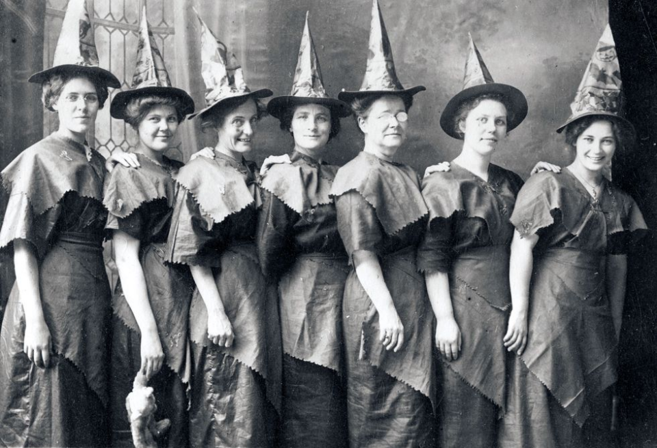
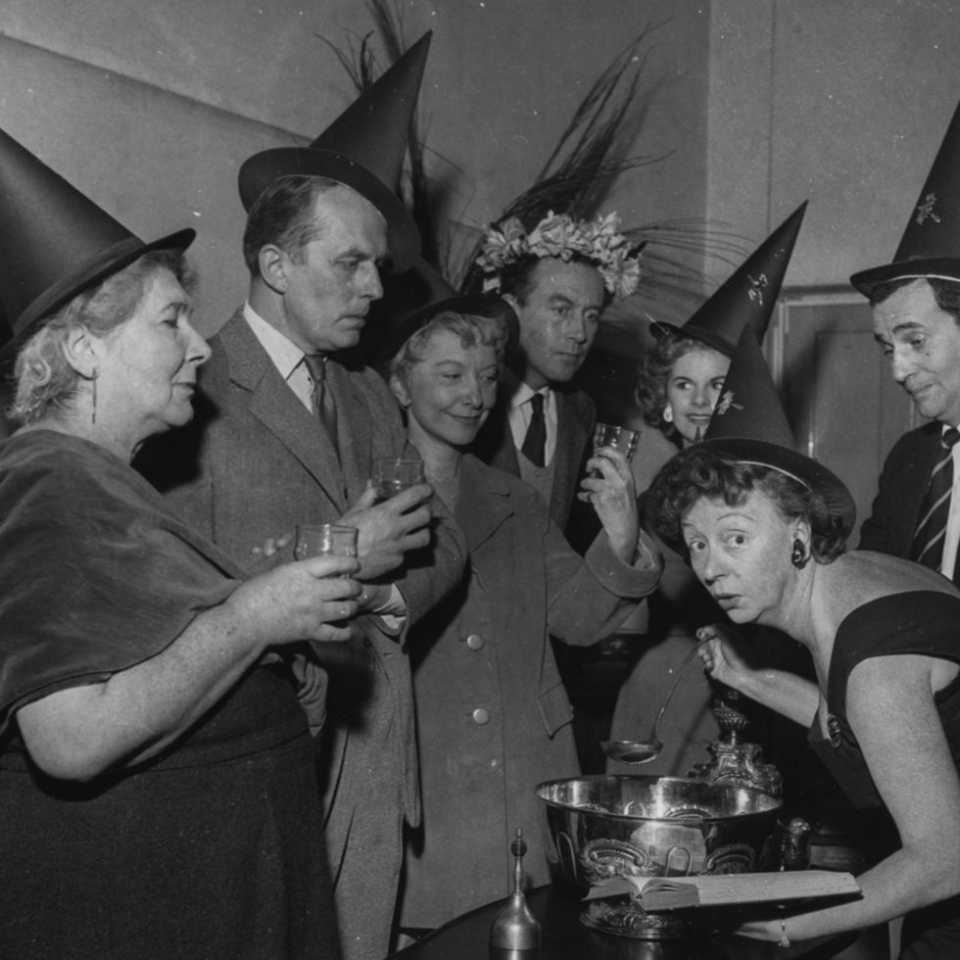
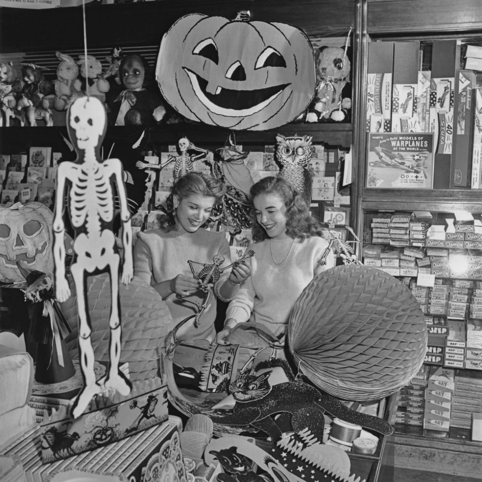
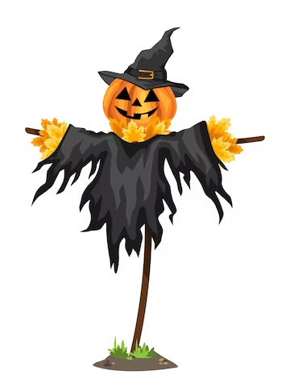
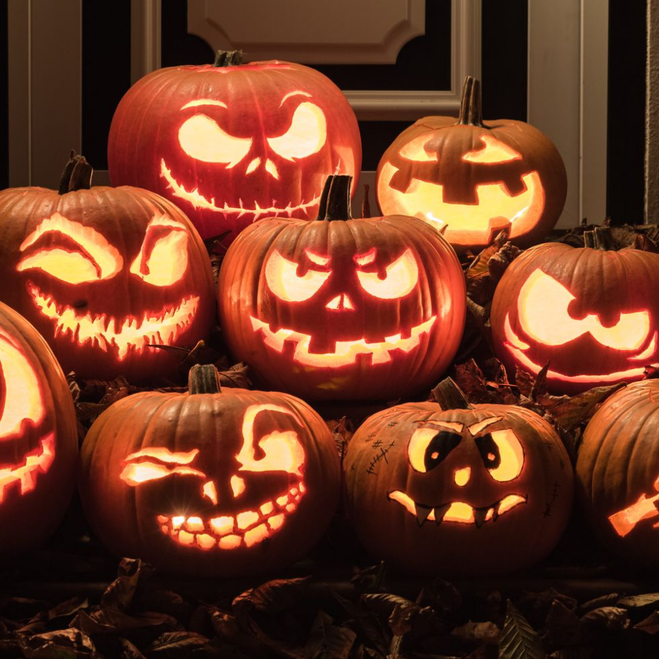
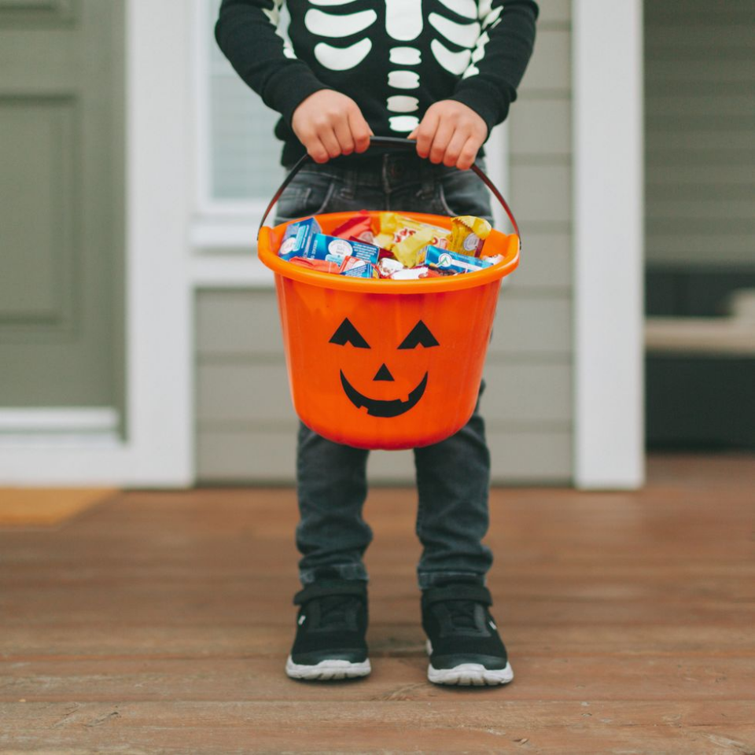
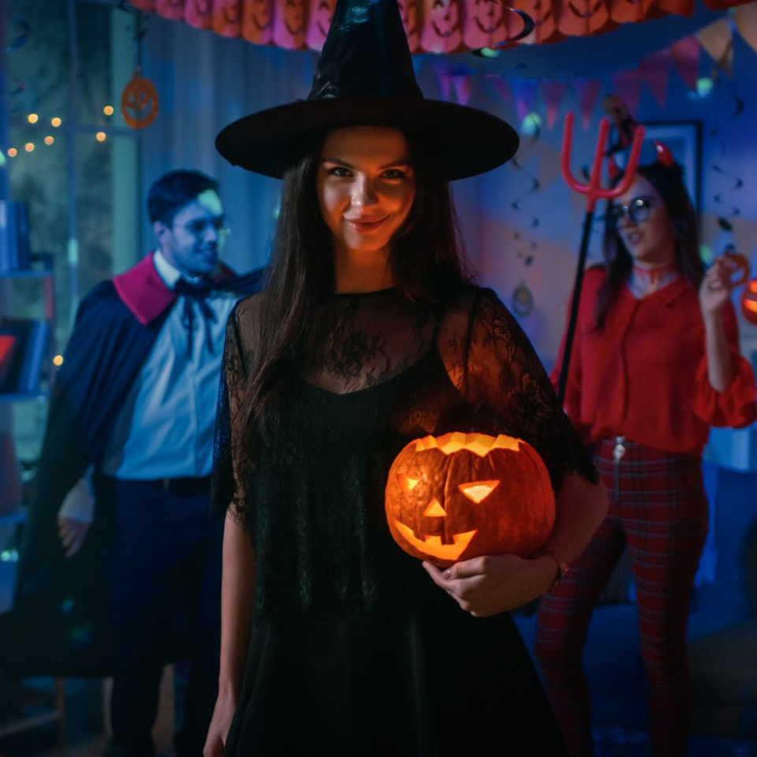

This article has been written and researched by our expert Loveable through a precise methodology. [Learn more about our methodology](https://avada.io/loveable/our-methodological.html)

[Loveable](https://avada.io/loveable/) > [Blog](https://avada.io/loveable/blog/) > [Holiday](https://avada.io/loveable/holiday/)

# 20 Fun Halloween Facts to Share on This Spooky Season

Written by [Blake Simpson](https://avada.io/loveable/author/blake/) Last Updated on October 03, 2023

- [Unlock the mysteries of Halloween facts’ ancient origins](https://avada.io/loveable/blog/halloween-facts/#wp-block-heading-2-2)
- [Some of the cherished Halloween facts about customs](https://avada.io/loveable/blog/halloween-facts/#wp-block-heading-2-9)
- [20 Interesting Halloween facts you should know](https://avada.io/loveable/blog/halloween-facts/#wp-block-heading-2-14)
    - [The origins of the word “witch” – Halloween facts about word](https://avada.io/loveable/blog/halloween-facts/#wp-block-heading-3-16)
    - [The biggest pumpkin you know](https://avada.io/loveable/blog/halloween-facts/#wp-block-heading-3-18)
    - [The birthplace of Halloween in Ireland](https://avada.io/loveable/blog/halloween-facts/#wp-block-heading-3-20)
    - [The cost for Halloween in America](https://avada.io/loveable/blog/halloween-facts/#wp-block-heading-3-23)
    - [The Halloween facts in Germany](https://avada.io/loveable/blog/halloween-facts/#wp-block-heading-3-25)
    - [The Halloween facts about the alternative symbol of Halloween without using pumpkin in the past](https://avada.io/loveable/blog/halloween-facts/#wp-block-heading-3-27)
    - [Before the invention of telephones, Halloween cards is popular](https://avada.io/loveable/blog/halloween-facts/#wp-block-heading-3-29)
    - [Stephen Clarke is the reigning champion in the world of pumpkin carving, holding the prestigious record for the fastest pumpkin carving time.](https://avada.io/loveable/blog/halloween-facts/#wp-block-heading-3-31)
    - [The association of black and orange with Halloween](https://avada.io/loveable/blog/halloween-facts/#wp-block-heading-3-33)
    - [Scarecrows is an essential symbol of Halloween](https://avada.io/loveable/blog/halloween-facts/#wp-block-heading-3-35)
    - [Which is pumpkin in Halloween facts?](https://avada.io/loveable/blog/halloween-facts/#wp-block-heading-3-38)
    - [When Halloween starts](https://avada.io/loveable/blog/halloween-facts/#wp-block-heading-3-40)
    - [Who brings Halloween to the US](https://avada.io/loveable/blog/halloween-facts/#wp-block-heading-3-42)
    - [The legend Halloween facts about jack-o’-lanterns draws](https://avada.io/loveable/blog/halloween-facts/#wp-block-heading-3-44)
    - [The Guinness World Record of jack-o’-lanterns](https://avada.io/loveable/blog/halloween-facts/#wp-block-heading-3-47)
    - [The tradition of trick-or-treating dates back to medieval times and has persisted through the ages](https://avada.io/loveable/blog/halloween-facts/#wp-block-heading-3-49)
    - [Another source of inspiration for trick-or-treating was the age-old custom known as “mumming.”](https://avada.io/loveable/blog/halloween-facts/#wp-block-heading-3-52)
    - [It wasn’t until the 1950s that candy became a popular treat handed out to trick-or-treaters](https://avada.io/loveable/blog/halloween-facts/#wp-block-heading-3-54)
    - [The allure of a captivating and eerie Halloween costume remains universally cherished](https://avada.io/loveable/blog/halloween-facts/#wp-block-heading-3-56)
    - [Halloween facts about favorite candy in US](https://avada.io/loveable/blog/halloween-facts/#wp-block-heading-3-65)

As the spookiest season of the year creeps closer, you’re probably gearing up for a series of [fun Halloween activities](https://avada.io/loveable/blog/kids-halloween-party/). But hold on—don’t let the excitement blind you to the fact that there’s still a treasure trove of intriguing knowledge awaiting you about this bewitching holiday, known as All-Hallows Eve. Even if you’ve been celebrating Halloween your whole life, there are bound to be mysterious and surprising Halloween facts that have eluded you thus far. To help you impress your friends and family, we’ve gathered some spook-tacular and mind-boggling Halloween facts that will leave everyone amazed.

## **Unlock the mysteries of Halloween facts’ ancient origins**

As the leaves turn and the nights grow longer, the world gears up for Halloween—a beloved holiday celebrated worldwide. But have you ever wondered about the true story behind this spooky and enchanting [Halloween tradition](https://avada.io/loveable/blog/halloween-traditions/)?

The roots of Halloween facts trace back to the ancient Celts of Ireland, who marked the new year on November 1. It symbolized the transition from the vibrant and fruitful summer months to the cold and dark winter—a time that held associations with death. On October 31, the night preceding the new year, they held a haunting celebration called (cue the spooky voice) Samhain. It was believed that on this night, the boundary between the living and the world of the dead grew thin, allowing ghosts to roam the earth.

These wandering spirits were believed to cause mischief and damage crops. However, the veil between worlds also facilitated Celtic priests in making predictions for the coming year.

As part of their commemoration, the priests built towering bonfires, serving as the focal point for the night’s activities. People donned disguises to ward off malevolent spirits, fortunes were told, lavish feasts were enjoyed, and lanterns were crafted from gourds—an early form of [pumpkin carving](https://avada.io/loveable/blog/halloween-pumpkin/). Curiously, the bonfires attracted insects, which in turn enticed bats to the scene, leading to the association of these winged creatures with Halloween.

With the spread of Christianity into Celtic lands, the holiday’s pagan traditions gradually merged with Christian celebrations. The name “Halloween” derived from “All Hallows’ Eve,” with “All Hallows” referring to the Christian All Souls’ Day observed on November 1.

## **Some of the cherished Halloween facts about customs**

The playful tradition of bobbing for apples – traditional Halloween facts – may have been introduced through early Roman conquests, as the Romans associated apples with their own fall holiday. As for the eerie reputation of black cats, its roots date back to the Middle Ages when many believed that witches could [transform into black cats](https://avada.io/loveable/halloween-cat-costume-for-adults/) to elude detection.

The classic Halloween colors, black and orange, hearken back to the Celtic festival of Samhain. For the Celts, black symbolized the “death” of summer, while orange represented the bountiful harvest season.

So, as you delve into the enchanting world of Halloween, armed with these fascinating facts, you’ll find an even deeper appreciation for the centuries-old traditions that make this haunting holiday so beloved and enduring.

## **20 Interesting Halloween facts you should know**

Dive into the world of Halloween as we explore 20 fascinating and fun Halloween facts. From ancient origins to modern traditions, these intriguing tidbits will surely captivate your curiosity and add a touch of mystery to this beloved holiday. Join us as we unravel the enchanting tales behind Halloween’s most cherished customs and uncover the surprising history that lies beneath the surface. Get ready for a thrilling journey through the realms of Halloween knowledge! Unravel the mystique of Halloween facts with these captivating and lesser-known Halloween facts!

### **The origins of the word “witch” – Halloween facts about word**

Let’s begin our journey by delving into the origins of the term “witch,” which traces its roots back to Old English as “wicce,” signifying a “wise woman.” But the intrigue doesn’t end there—enter the “wiccan,” who were once esteemed for their wisdom and revered opinions, a quality that might have proven valuable during the historic events of Salem. These are amazing Halloween facts.

### **The biggest pumpkin you know**

Prepare to be amazed by the grandeur of the world’s heaviest jack-o’-lantern, weighing an astounding 2,684 pounds and 2 ounces – Halloween facts you may not know. This gargantuan pumpkin took the stage at the Ludwigsburg Pumpkin Festival in Baden-Württemberg, Germany, on November 6, 2021. However, this was no ordinary jack-o’-lantern—it boasted intricate etchings of facial features, stars, and even heraldic scenes, making it a true work of art.

### **The birthplace of Halloween in Ireland**

Venture to the birthplace of Halloween, Ireland, where vibrant festivities await. There, the night sky illuminates with dazzling fireworks, while the tantalizing aroma of traditional fruitcake, known as barnbrack, fills the air. The celebrations reach their peak as majestic bonfires blaze, casting an enchanting glow over the revelers.

### **The cost for Halloween in America**

Unlock the secrets of Halloween expenditures, as Americans willingly invest more than $100 in the spirit of the holiday. The year 2022 saw a remarkable average spending of $100.45 on Halloween-related items, ranging from charming costumes and delectable candy to captivating decorations, as revealed by the National Retail Federation.

### **The Halloween facts in Germany**

On Halloween night in Germany, a fascinating and age-old tradition involves concealing knives. The purpose behind this intriguing custom is to ensure the safety of the spirits that are believed to return on this mystical occasion. By hiding their knives, the people of Germany aim to protect these wandering souls from any potential harm or injury.

### **The Halloween facts about the alternative symbol of Halloween without using pumpkin in the past**

Long ago, people in Ireland embraced a different tradition when it came to jack-o’-lanterns. Instead of the iconic pumpkin we know today, they ingeniously carved turnips in the 19th century to create these eerie lanterns.

### **Before the invention of telephones, Halloween cards is popular**

In the early 1900s in America, before the advent of telephones, Halloween cards took center stage in celebrating the holiday. Surprisingly, these cards were just as beloved as [Christmas cards](https://avada.io/loveable/personalized-christmas-cards/), reflecting the festive spirit and enthusiasm of the Halloween season.

### **Stephen Clarke is the reigning champion in the world of pumpkin carving, holding the prestigious record for the fastest pumpkin carving time.**

In a remarkable feat, he accomplished this extraordinary pumpkin carving skill in an astonishing time of under 24.03 seconds, surpassing his own previous record of 54.72 seconds. Are you up for the challenge to see if you can achieve an even faster time? You have known Halloween facts about famous people. 

### **The association of black and orange with Halloween**

It is rooted in meaningful symbolism. Orange represents the bountiful harvest of autumn, while black serves as a powerful emblem of darkness, reminding us that Halloween was once a festival that commemorated the intricate boundary between life and death.

### **Scarecrows is an essential symbol of Halloween**

Scarecrows, serving as a [Halloween symbolic](https://avada.io/loveable/halloween-symbols-explained/) representation of the holiday’s ancient agricultural roots, were originally crafted by Greek farmers. Their purpose was to resemble humans and protect their crops from the notorious crows, thus giving rise to their name.

### **Which is pumpkin in Halloween facts?**

While commonly associated with vegetables, pumpkins are technically classified as fruits. This distinction is attributed to their origin from flowering plants, making them fall under the botanical definition of fruits.

### **When Halloween starts**

Which are Halloween facts about the origin of this holiday? The roots of Halloween can be traced back an impressive 2,000 years to the ancient Celtic festival of Samhain. Celebrated on October 31, the eve of their new year, the Celts believed this night marked the return of the dead to Earth. In response, they lit bonfires and adorned costumes to ward off the wandering spirits, ushering in the captivating traditions that continue to shape Halloween’s spirit.

### **Who brings Halloween to the US**

Halloween’s journey to the U.S. was paved by Irish immigrants during the mid-1800s, fleeing the devastating potato famine and bringing their cherished traditions across the Atlantic.

### **The legend Halloween facts about jack-o’-lanterns draws**

The legend of jack-o’-lanterns draws its inspiration from a captivating Irish folktale. The History Channel reveals the tale of Stingy Jack, a man who outwitted the devil and, as a consequence, was condemned to roam the Earth with only a burning coal placed inside a hollowed turnip to illuminate his path. The Irish affectionately referred to him as “Jack of the Lantern,” which eventually evolved into the beloved moniker, “Jack o’Lantern.”

### **The Guinness World Record of jack-o’-lanterns**

Now, we will start with another Halloween facts about jack-o’-lanterns. Setting a truly illuminated spectacle, the City of Keene in New Hampshire has secured the Guinness World Record for the most lit jack-o’-lanterns on display, boasting an astounding number of 30,581. This dazzling feat not only made Keene the original record holder in this category but also earned them the distinction of breaking the record an impressive eight times thereafter. Prepare to be mesmerized by this glowing extravaganza that has rightfully earned its place in the Halloween history books.

### **The tradition of trick-or-treating dates back to medieval times and has persisted through the ages**

The practice of trick-or-treating finds its roots in the medieval English custom known as “souling.” In this heartwarming tradition, children would go from door to door on All Souls Day, tendering prayers for the departed loved ones of the residents, and in return, they would receive food as a gesture of kindness.

### **Another source of inspiration for trick-or-treating was the age-old custom known as “mumming.”**

During the medieval era, a fascinating tradition called mumming emerged, where people would don costumes resembling ghosts and demons. They would then visit homes, delighting the residents with songs and theatrical performances in exchange for food and drink. This intriguing custom is believed to have laid the groundwork for the beloved tradition of trick-or-treating, as documented by the History Channel. It is one of the true Halloween facts about traditions.

### **It wasn’t until the 1950s that candy became a popular treat handed out to trick-or-treaters**

Halloween’s enchantment would not be complete without the delightful presence of those fun-sized candy bars, bringing sweetness to the festivities – it is one of the funny Halloween facts. Yet, in times past, trick-or-treaters experienced a different kind of treat altogether. Instead of candies, they were gifted pieces of cake, fruit, nuts, coins, and charming little toys, as documented by the History Channel. It wasn’t until the 1950s that candy makers seized the opportunity to promote their treats specifically for Halloween, forever cementing candy as a staple in the trick-or-treating tradition. Today, an astonishing one-quarter of all the candy sold in the U.S. each year is purchased exclusively for Halloween, embodying the sweet spirit of this bewitching holiday.

### **The allure of a captivating and eerie Halloween costume remains universally cherished**

Halloween attire encompasses a wide range of emotions, from the comical and adorable to the downright eerie – the normal Halloween facts you know. As reported by the National Retail Federation, frightening ensembles continue to hold their throne as the most popular choice. In the year 2023, the leading Halloween costumes for adults included:

- Witch
- Vampire
- Ghost
- Pirate
- Cat/Batman (costumes shared the same rank)

**RELATED:** [Halloween Traditions](https://avada.io/loveable/halloween-traditions/) And Everything You Need to Know

### **Halloween facts about favorite candy in US**

When it comes to America’s favorite candy, Reese’s Cups take the crown, and Halloween is the perfect occasion to savor them in all their delectable glory! As revealed by CandyStore.com, Reese’s Cups dominated as the top choice last year, closely followed by Skittles and M&Ms, offering a delightful assortment of flavors to indulge in during the spooky season.

To sum up, with these enthralling Halloween facts in your possession, you’ll undoubtedly become the life of the Halloween party, regaling your friends and family with fascinating tales that add a touch of magic and wonder to this beloved holiday. So, embrace the allure of Halloween trivia and let the fun begin as you embark on a journey through the enigmatic traditions and spellbinding history that make Halloween so extraordinary!

- [Unlock the mysteries of Halloween facts’ ancient origins](https://avada.io/loveable/blog/halloween-facts/#wp-block-heading-2-2)
- [Some of the cherished Halloween facts about customs](https://avada.io/loveable/blog/halloween-facts/#wp-block-heading-2-9)
- [20 Interesting Halloween facts you should know](https://avada.io/loveable/blog/halloween-facts/#wp-block-heading-2-14)
    - [The origins of the word “witch” – Halloween facts about word](https://avada.io/loveable/blog/halloween-facts/#wp-block-heading-3-16)
    - [The biggest pumpkin you know](https://avada.io/loveable/blog/halloween-facts/#wp-block-heading-3-18)
    - [The birthplace of Halloween in Ireland](https://avada.io/loveable/blog/halloween-facts/#wp-block-heading-3-20)
    - [The cost for Halloween in America](https://avada.io/loveable/blog/halloween-facts/#wp-block-heading-3-23)
    - [The Halloween facts in Germany](https://avada.io/loveable/blog/halloween-facts/#wp-block-heading-3-25)
    - [The Halloween facts about the alternative symbol of Halloween without using pumpkin in the past](https://avada.io/loveable/blog/halloween-facts/#wp-block-heading-3-27)
    - [Before the invention of telephones, Halloween cards is popular](https://avada.io/loveable/blog/halloween-facts/#wp-block-heading-3-29)
    - [Stephen Clarke is the reigning champion in the world of pumpkin carving, holding the prestigious record for the fastest pumpkin carving time.](https://avada.io/loveable/blog/halloween-facts/#wp-block-heading-3-31)
    - [The association of black and orange with Halloween](https://avada.io/loveable/blog/halloween-facts/#wp-block-heading-3-33)
    - [Scarecrows is an essential symbol of Halloween](https://avada.io/loveable/blog/halloween-facts/#wp-block-heading-3-35)
    - [Which is pumpkin in Halloween facts?](https://avada.io/loveable/blog/halloween-facts/#wp-block-heading-3-38)
    - [When Halloween starts](https://avada.io/loveable/blog/halloween-facts/#wp-block-heading-3-40)
    - [Who brings Halloween to the US](https://avada.io/loveable/blog/halloween-facts/#wp-block-heading-3-42)
    - [The legend Halloween facts about jack-o’-lanterns draws](https://avada.io/loveable/blog/halloween-facts/#wp-block-heading-3-44)
    - [The Guinness World Record of jack-o’-lanterns](https://avada.io/loveable/blog/halloween-facts/#wp-block-heading-3-47)
    - [The tradition of trick-or-treating dates back to medieval times and has persisted through the ages](https://avada.io/loveable/blog/halloween-facts/#wp-block-heading-3-49)
    - [Another source of inspiration for trick-or-treating was the age-old custom known as “mumming.”](https://avada.io/loveable/blog/halloween-facts/#wp-block-heading-3-52)
    - [It wasn’t until the 1950s that candy became a popular treat handed out to trick-or-treaters](https://avada.io/loveable/blog/halloween-facts/#wp-block-heading-3-54)
    - [The allure of a captivating and eerie Halloween costume remains universally cherished](https://avada.io/loveable/blog/halloween-facts/#wp-block-heading-3-56)
    - [Halloween facts about favorite candy in US](https://avada.io/loveable/blog/halloween-facts/#wp-block-heading-3-65)

### [Blake Simpson](https://avada.io/loveable/author/blake/)

Hi, I'm Blake from Loveable. I help people find perfect gifts for occasions like anniversaries and weddings. I also write a blog about holidays, sharing insights to make them more meaningful. Let's create unforgettable moments together!

- [Twitter](https://twitter.com/intent/tweet)
- [Facebook](https://www.facebook.com/sharer/sharer.php)
- [instagram](https://avada.io/loveable/blog/halloween-facts/)
- [pinterest](https://www.pinterest.com/loveablellc/)

## Related Posts

[### 120+ Christian Birthday Wishes To Spread Your Love](https://avada.io/loveable/blog/christian-birthday-wishes/) 

[

### 35 Best 70th Birthday Ideas To Celebrate The Special Milestone

](https://avada.io/loveable/blog/70th-birthday-ideas/)

[

### 50 Best 30th Birthday Decorations for a Remarkable Birthday Bash

](https://avada.io/loveable/blog/30th-birthday-decorations/)

[

### 40 Delicious Vegan Christmas Desserts to Delight Your Palate

](https://avada.io/loveable/blog/vegan-christmas-desserts/)

[

### 60 Christmas Team Building Activities to Boost Workplace Spirit

](https://avada.io/loveable/blog/christmas-team-building-activities/)
