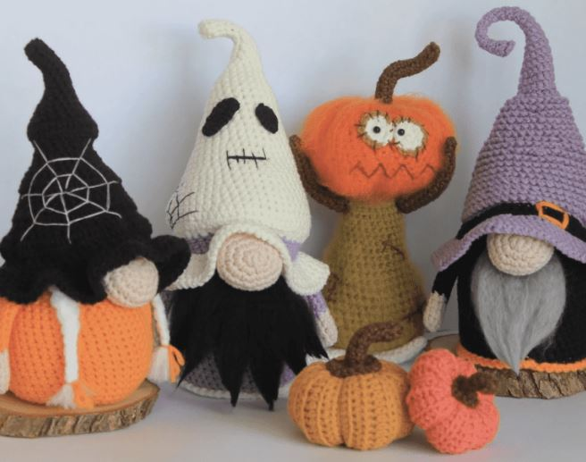

This article has been written and researched by our expert Loveable through a precise methodology. [Learn more about our methodology](https://avada.io/loveable/our-methodological.html)

[Loveable](https://avada.io/loveable/) > [Blog](https://avada.io/loveable/blog/) > [Holiday](https://avada.io/loveable/holiday/)

# 20+ Halloween Crochet Patterns for Festive Fun in 2023

Written by [Blake Simpson](https://avada.io/loveable/author/blake/) Last Updated on September 18, 2023

- [Halloween Crochet Patterns for Festive Fun](https://avada.io/loveable/blog/halloween-crochet-patterns/#wp-block-heading-2-4)
    - [Black Cat In Pumpkin](https://avada.io/loveable/blog/halloween-crochet-patterns/#wp-block-heading-3-5)
    - [Gnomes Crochet Set Pattern](https://avada.io/loveable/blog/halloween-crochet-patterns/#wp-block-heading-3-10)
    - [Crochet Treat Bags](https://avada.io/loveable/blog/halloween-crochet-patterns/#wp-block-heading-3-16)
    - [Bat Crochet](https://avada.io/loveable/blog/halloween-crochet-patterns/#wp-block-heading-3-21)
    - [Candy Corn Sack](https://avada.io/loveable/blog/halloween-crochet-patterns/#wp-block-heading-3-26)
    - [Skull Crochet](https://avada.io/loveable/blog/halloween-crochet-patterns/#wp-block-heading-3-31)
    - [Crochet Pattern “Pumpkin”](https://avada.io/loveable/blog/halloween-crochet-patterns/#wp-block-heading-3-36)
    - [Vampire Amigurumi](https://avada.io/loveable/blog/halloween-crochet-patterns/#wp-block-heading-3-41)
    - [Granny Squares](https://avada.io/loveable/blog/halloween-crochet-patterns/#wp-block-heading-3-46)
    - [Frankenstein’s Monster](https://avada.io/loveable/blog/halloween-crochet-patterns/#wp-block-heading-3-51)
    - [Combo 3 Witch Patterns](https://avada.io/loveable/blog/halloween-crochet-patterns/#wp-block-heading-3-56)
    - [Harvest Time Pumpkins](https://avada.io/loveable/blog/halloween-crochet-patterns/#wp-block-heading-3-61)
    - [Jack-O’-Lantern Wall Hanging](https://avada.io/loveable/blog/halloween-crochet-patterns/#wp-block-heading-3-66)
    - [Crochet Heart-Shaped Spider](https://avada.io/loveable/blog/halloween-crochet-patterns/#wp-block-heading-3-71)
    - [Huggable Spider](https://avada.io/loveable/blog/halloween-crochet-patterns/#wp-block-heading-3-76)
    - [Spooky Ghost Amigurumi Crochet Blanket](https://avada.io/loveable/blog/halloween-crochet-patterns/#wp-block-heading-3-81)
    - [Crochet Halloween Hearts](https://avada.io/loveable/blog/halloween-crochet-patterns/#wp-block-heading-3-86)
    - [Pumpkin Key Chain](https://avada.io/loveable/blog/halloween-crochet-patterns/#wp-block-heading-3-91)
    - [Black Cat Hat](https://avada.io/loveable/blog/halloween-crochet-patterns/#wp-block-heading-3-96)
    - [Owl Crochet Earrings](https://avada.io/loveable/blog/halloween-crochet-patterns/#wp-block-heading-3-101)
    - [Ghostly Lights Necklace](https://avada.io/loveable/blog/halloween-crochet-patterns/#wp-block-heading-3-106)
    - [Red Riding Hood Costume](https://avada.io/loveable/blog/halloween-crochet-patterns/#wp-block-heading-3-111)
    - [Crochet Cupcake Halloween](https://avada.io/loveable/blog/halloween-crochet-patterns/#wp-block-heading-3-116)
- [Spooky Crochet Techniques and Embellishments](https://avada.io/loveable/blog/halloween-crochet-patterns/#wp-block-heading-2-122)
- [Materials and Tips for Creating Halloween Crochet Patterns](https://avada.io/loveable/blog/halloween-crochet-patterns/#wp-block-heading-2-131)
- [In Conclusion,](https://avada.io/loveable/blog/halloween-crochet-patterns/#wp-block-heading-2-140)

As Halloween approaches, chances are you, like us, are already gearing up for the festivities. It’s an ideal occasion to showcase your crochet skills by crafting festive decorations or even a [custom-made costume](https://avada.io/loveable/easy-halloween-costumes/)!

Despite the misconception that crochet is overly challenging, we assure you it’s not. With dedication and practice, anyone can master these impressive **Halloween crochet patterns**.

If you’re in search of enjoyable and uncomplicated crochet designs for Halloween, your search ends here. These patterns cater to both beginners and experienced crocheters, offering something for everyone.

## **Halloween Crochet Patterns for Festive Fun**

### **Black Cat In Pumpkin**

This pattern guides you through creating a crocheted black cat playfully peeking out of a jack-o-lantern pumpkin. The [pumpkin is crafted](https://avada.io/loveable/blog/halloween-pumpkin/) using orange yarn, while the cat is brought to life with black yarn.

The final size may vary depending on the yarn chosen, but it starts at approximately 4 inches (10 cm) in height without the hat. Please note that this pattern is recommended for individuals with some prior crochet experience, as it assumes familiarity with basic crochet stitches and techniques.

[Get o](https://rstyle.me/+dVti79i_Jl00hVqnzi1jNQ)[n](https://www.etsy.com/listing/743050461/)[e!](https://rstyle.me/+dVti79i_Jl00hVqnzi1jNQ)

### **Gnomes Crochet Set Pattern**

Gnomes have gained immense popularity lately, and these endearing creatures are bound to captivate anyone who lays eyes on them. Each gnome measures approximately 17cm in height and flaunts a unique outfit inspired by Halloween.

The sheer joy of creating these adorable gnomes will be so infectious that you won’t be able to resist making more than just one! Not only do these gnomes make fantastic [gifts for loved ones](https://avada.io/loveable/gifts-halloween-lovers/), but they also serve as delightful additions to your own home, infusing it with festive cheer this Halloween.

Regardless of your crochet skill level, whether you’re a beginner or an expert, these patterns are perfectly tailored to accommodate everyone’s abilities.

[Get one!](https://www.etsy.com/listing/1208532399/)

### **Crochet Treat Bags**

These spooktacular bags are specially designed to add a touch of handmade charm to your trick-or-treating adventures. Crafted with love and attention to detail, these bags are perfect for collecting candies and goodies on Halloween night. 

Choose from a variety of hauntingly delightful designs and colors, each showcasing your crochet skills. Get ready to impress with these unique and practical crochet treat bags, making your Halloween celebrations even more memorable.

[Get one!](https://www.stitching-together.com/halloween-trick-or-treat-bags-free-crochet-pattern/)

### **Bat Crochet**

For advanced beginners seeking a delightful challenge, behold the Kawaii bat amigurumi pattern! This adorable bat can be crafted in rainbow hues or any color of your choosing, adding a vibrant touch of spookiness to your year-round decor.

These bats make charming decorations for Halloween or any time of the year, and their petite size is perfect for little hands to enjoy playful interactions. Perhaps you aspire to assemble a colony of these super sweet bat babies!

[Get one!](https://www.etsy.com/listing/1205035361/)

### **Candy Corn Sack**

Indulge in the Halloween spirit with the Candy Corn Sack crochet pattern, a fantastic [idea for Halloween crafting](https://avada.io/loveable/blog/easy-halloween-craft-ideas/). This adorable sack captures the essence of the holiday with its candy corn-inspired design. Perfect for storing Halloween treats or as a decorative accent, this crochet creation adds a touch of handmade charm to your festivities. 

Its versatility allows for customization with different colors and sizes, making it a delightful project for crocheters of all skill levels. Get ready to embrace the Halloween magic with this delightful Candy Corn Sack crochet pattern.

[Get one!](https://rowsandroses.com/2019/10/25/throwback-candy-corn-sack/)

### **Skull Crochet**

Elevate your [Halloween decorations](https://avada.io/loveable/cool-halloween-decorations/) or surprise loved ones with the help of this Skull Crochet Pattern. Crafted to perfection, these petite skulls are ideal for adding a touch of eerie charm to your festive ambiance.

The pattern is presented in English, employing US crochet terms for ease of understanding. While the finished skull stands about 2.36 inches (6 cm) tall, variations in size can occur based on yarn weight and hook size. 

[Get one!](https://www.etsy.com/listing/1248035659/)

### **Crochet Pattern “Pumpkin”**

Immerse yourself in the art of crochet with this exquisite pattern that captures the beauty and realism of a pumpkin. It’s an ideal choice for adorning your home during Halloween or presenting as a heartfelt handmade gift.

Once completed, the pumpkin will stand at an approximate size of 120mm (12cm). To bring it to life, gather gazal baby cotton yarn in orange, Alize forever yarn in brown, and a trusty crochet hook.

[Get one!](https://www.etsy.com/listing/923941403/)

### **Vampire Amigurumi**

This adorable vampire-inspired amigurumi character is guaranteed to add a touch of spooky charm to your holiday decorations. 

With its fangs, cape, and mesmerizing eyes, this crochet creation captures the essence of classic vampire lore. Whether displayed as part of your Halloween decor or gifted to a fellow enthusiast, this Vampire Amigurumi will evoke smiles and delight during the festive season. 

[Get one!](https://spinayarncrochet.com/vampire-amigurumi-free-crochet-pattern/)

### **Granny Squares**

This extraordinary bundle features an assortment of Halloween-themed designs. Craft an unforgettable afghan just in time for the holiday, as you explore patterns like Eye Grannies, Skulls, Bats, and Witches. 

Regardless of your skill level, this collection guarantees to offer something you’ll adore. So grab your hook, Halloween-colored yarn, and get ready for a spooktacular crochet adventure!

[Get one!](https://www.etsy.com/listing/875026060/)

### **Frankenstein’s Monster**

Bring the iconic Frankenstein’s Monster to life through Halloween crochet! This captivating project entails crafting a crochet rendition of the legendary creature. Choose green yarn to capture the essence of this classic monster. 

The pattern provides step-by-step instructions to guide you in creating a remarkable [Frankenstein’s Monster](https://en.wikipedia.org/wiki/Frankenstein%27s_monster) amigurumi, making it a perfect addition to your Halloween decorations or a unique gift.

[Get one!](https://spinayarncrochet.com/frankensteins-monster-free-crochet-pattern)

### **Combo 3 Witch Patterns**

Get ready to infuse your Halloween crochet projects with a touch of enchantment with Combo 3 Witch Patterns. This incredible bundle offers three captivating crochet patterns inspired by witches.

With detailed instructions included, crocheters of all levels can bring these bewitching creations to life. Let your imagination soar as you craft these whimsical witches, adding a magical touch to your [Halloween decorations](https://avada.io/loveable/halloween-decoration-ideas/) and festivities.

[Get one!](https://rstyle.me/+pP8WGGBNdGqtUbcsC8M-9Q)

### **Harvest Time Pumpkins**

These charming pumpkins are ideal for adorning your home during the autumn season or presenting as heartfelt gifts to loved ones. They also make delightful additions to the farmhouse-themed decor. 

The pattern is beginner-friendly, ensuring that even novices can easily follow along. Moreover, intermediate to advanced crocheters can explore various techniques to create their own unique interpretation of these pumpkins.

[Get one!](https://www.etsy.com/listing/1052215420/)

### **Jack-O’-Lantern Wall Hanging**

Elevate your Halloween crochet game with the captivating Jack-O’-Lantern Wall Hanging pattern. This design offers a unique twist on traditional jack-o’-lanterns, transforming them into a remarkable decorative piece. 

Crafted to be hung on walls, this crochet creation showcases the iconic grinning faces of jack-o’-lanterns, adding a festive and spooky touch to your Halloween decor. The pattern provides clear instructions, enabling both beginners and experienced crocheters to bring this wall hanging to life. 

[Get one!](https://divinedebris.com/the-pumpkin-ing/)

### **Crochet Heart-Shaped Spider**

This unique creation combines the elegance of a [heart shape](https://avada.io/loveable/heart-shaped-gifts/) with the eerie allure of a spider, making it a perfect addition to your Halloween-themed projects. The pattern guides you through each step, allowing beginners and experienced crocheters to craft this captivating spider. 

With its whimsical yet creepy charm, the Crochet Heart-Shaped Spider adds a touch of intrigue to your Halloween decorations, making it a must-have for any crochet enthusiast during the spooky season.

[Get one!](https://www.goldenlucycrafts.com/crochet-spider-pattern)

### **Huggable Spider**

This user-friendly pattern provides step-by-step instructions and accompanying pictures to craft your cuddly and adorable eight-legged friend.

Whether you’re a beginner or an experienced crocheter, this pattern caters to all skill levels. With this pattern, you can create a one-of-a-kind spider that will become a timeless keepsake. Plus, who can resist the allure of a captivating spider story?

[Get one!](https://www.etsy.com/listing/1039684704/)

### **Spooky Ghost Amigurumi Crochet Blanket**

This handmade crochet blanket ghost introduces a touch of whimsical charm to your Halloween decorations or year-round goth home decor. Crafted with soft and cozy blanket yarn, it brings any space a comforting and cozy feel.

This delightful ghost is bound to bring smiles to the faces of trick-or-treaters and admirers of your spooky home decor alike. It also serves as a thoughtful gift for fellow Halloween enthusiasts. Although the pattern is easy to follow, it is best suited for intermediate to advanced crocheters, allowing for a rewarding project.

[Get one!](https://www.etsy.com/listing/867189513/)

### **Crochet Halloween Hearts**

Add a touch of Halloween charm to your crochet projects with these delightful Crochet Halloween Hearts. This pattern allows you to create adorable heart-shaped designs infused with the spirit of the Halloween season. 

These Halloween-themed hearts can be used to embellish decorations, and gifts or even worn as accessories. Let your crochet hook bring these charming Halloween Hearts to life, and enjoy the festive spirit they bring to your projects.

[Get one!](https://www.goldenlucycrafts.com/crochet-halloween-decorations/)

### **Pumpkin Key Chain**

This delightful design allows you to create a miniature pumpkin that doubles as a charming key chain. The pattern provides step-by-step instructions, making it suitable for beginners and experienced crocheters. 

With its compact size, this pumpkin key chain is perfect for adding a touch of Halloween flair to your keys or as a decorative accessory. Crochet it in festive orange yarn, and let this cute pumpkin accompany you throughout the spooky season.

[Get one!](https://spinayarncrochet.com/pumpkin-keychain-free-crochet-pattern)

### **Black Cat Hat**

Unleash your feline side with the Crochet Black Cat Hat pattern, the perfect addition to your Halloween crochet collection. This enchanting design allows you to create a whimsical hat featuring the iconic charm of a black cat. 

The pattern includes detailed instructions, making it suitable for crocheters of various skill levels. Crafted with black yarn, this hat brings an air of mystery and playfulness to your Halloween attire. Whether you’re attending parties, trick-or-treating, or simply embracing the season’s spirit, this Crochet Black Cat Hat will surely make you the center of attention.

[Get one!](https://www.crochetforyoublog.com/2018/10/crochet-halloween-black-cat-hat/)

### **Owl Crochet Earrings**

This unique crochet pattern allows you to craft charming owl-shaped earrings that will surely make a statement. With their intricate details and delicate design, these earrings capture the beauty and wisdom associated with these majestic creatures.

The pattern provides step-by-step instructions, making it suitable for both beginner and experienced crocheters. Using your choice of colorful yarn, you can customize the owls to match your personal style or Halloween costume.

[Get one!](https://divinedebris.com/olgaowls/)

### **Ghostly Lights Necklace**

Illuminate your Halloween ensemble with the enchanting Ghostly Lights Necklace. This crochet pattern allows you to create a hauntingly beautiful necklace adorned with ghostly motifs that emit an ethereal glow. 

When the lights go out, the necklace glows in the dark, creating an eerie and mesmerizing effect. It’s the perfect statement piece to complete your Halloween outfit or add a touch of spooky elegance to your everyday attire. 

[Get one!](https://www.acrochetedsimplicity.com/free-crochet-pattern-diy-ghostly-lights-necklace)

### **Red Riding Hood Costume**

Transport yourself into the enchanting world of fairy tales with the mesmerizing Red Riding Hood Costume. This crochet pattern allows you to create a captivating ensemble inspired by the beloved storybook character.

Complete your transformation by pairing the cape with a simple dress and accessorizing with a basket and a touch of imagination. Whether attending a Halloween party or participating in a cosplay event, the Red Riding Hood Costume is a timeless choice that captures the imagination of all who see it.

[Get one!](https://www.withalexofficialblog.com/2019/10/mary-hooded-shawl-free-crochet-pattern.html)

### **Crochet Cupcake Halloween**

This enchanting design allows you to create adorable crochet cupcakes with a spooky twist. Decorated with Halloween-themed motifs like bats, spiders, or ghosts, these cupcakes are a sweet treat for the eyes. 

The pattern provides step-by-step instructions, making it suitable for crocheters of all skill levels. These crocheted cupcakes can be used as decorations, party favors, or even as unique gifts. Let your crochet hook work its magic and add a touch of Halloween sweetness to your festive celebrations.

[Get one!](https://www.repeatcrafterme.com/2017/10/crochet-cupcake-halloween-costume.html)

**_Related_**: Best [Gifts For Crocheters](https://avada.io/loveable/gifts-crocheters/) That’ll Brighten Their Heart

## **Spooky Crochet Techniques and Embellishments**

Unleash your creativity and let these spooky crochet techniques and embellishments transform your projects into captivating works of art. From cute amigurumi creatures with glowing eyes to intricate spiderweb-inspired shawls, the possibilities are endless. Dive into the world of Halloween crochet and bring a touch of magic to your creations.

- **Provide tutorials on adding spooky details such as crocheted eyes, fangs, or stitches resembling spiderwebs.**

Discover how to add eerie details like crocheted eyes, fangs, or stitches resembling intricate spiderwebs. Step-by-step tutorials will guide you through the process, ensuring you achieve the perfect Halloween-inspired accents.

- **Explore the use of glow-in-the-dark or metallic yarn to enhance the Halloween effect of crochet projects.**

Glow-in-the-dark yarn will enchant your projects, creating an otherworldly glow when the lights go out. On the other hand, metallic yarns will add a touch of glamour and intrigue, enhancing the Halloween effect with their shimmering allure.

- **Discuss techniques for creating texture and depth, such as bobble stitches or surface crochet.**

These techniques will create raised bumps and intricate patterns, adding a tactile element to your designs. Whether it’s the bumpy texture of a pumpkin or the intricate cobwebs of a haunted house, these techniques will breathe life into your Halloween crochet projects.

## **Materials and Tips for Creating Halloween Crochet Patterns**

With the right materials, attention to gauge and tension, and a well-organized pattern collection, your Halloween crochet projects are bound to be a success. 

- **Discuss the importance of selecting appropriate yarns and hooks for different Halloween crochet patterns.**

Understanding the importance of yarn and hook selection for different patterns will help bring your creations to life. Consider the yarn’s texture, weight, and color to achieve the desired effect. Thicker yarns can create a more substantial and cozy feel, while fine yarns lend themselves to delicate and intricate designs. Similarly, the choice of hook size will impact your project’s overall size and appearance.

- **Share tips on gauge, tension, and blocking techniques to ensure the best results.**

Maintaining consistent gauge and tension is key to ensuring a polished finished product. Take the time to check your gauge using a swatch before diving into a project. Adjust your tension as needed to achieve the desired outcome. Additionally, blocking techniques can enhance the look of your crochet pieces, allowing them to lay flat and show off their stitchwork.

- **Provide suggestions for finding and organizing crochet patterns, including online resources and pattern books.**

Explore online resources such as pattern databases, blogs, and social media platforms dedicated to crochet. You can also invest in pattern books that offer a wide range of Halloween-inspired designs. Organize your patterns in a way that works best for you, whether it’s through physical binders, digital folders, or dedicated crochet apps.

## **In Conclusion,**

With this collection of popular **Halloween crochet patterns** for fall and winter, you’re ready to embark on your next creative journey! Whether you’re a beginner or an experienced crocheter, these patterns are designed to bring you hours of joy and satisfaction. 

Whether you’re looking to infuse your home décor with a unique flair or create a heartfelt handmade gift for someone special, these crochet patterns are exactly what you need. 

Don’t hesitate any longer! Gather your hooks and yarn, and let the magic of crochet unfold. It’s time to dive into these patterns and let your creativity soar. Your cozy and charming creations are just waiting to come to life, so let’s start stitching and bring your crochet projects to fruition!

- [Halloween Crochet Patterns for Festive Fun](https://avada.io/loveable/blog/halloween-crochet-patterns/#wp-block-heading-2-4)
    - [Black Cat In Pumpkin](https://avada.io/loveable/blog/halloween-crochet-patterns/#wp-block-heading-3-5)
    - [Gnomes Crochet Set Pattern](https://avada.io/loveable/blog/halloween-crochet-patterns/#wp-block-heading-3-10)
    - [Crochet Treat Bags](https://avada.io/loveable/blog/halloween-crochet-patterns/#wp-block-heading-3-16)
    - [Bat Crochet](https://avada.io/loveable/blog/halloween-crochet-patterns/#wp-block-heading-3-21)
    - [Candy Corn Sack](https://avada.io/loveable/blog/halloween-crochet-patterns/#wp-block-heading-3-26)
    - [Skull Crochet](https://avada.io/loveable/blog/halloween-crochet-patterns/#wp-block-heading-3-31)
    - [Crochet Pattern “Pumpkin”](https://avada.io/loveable/blog/halloween-crochet-patterns/#wp-block-heading-3-36)
    - [Vampire Amigurumi](https://avada.io/loveable/blog/halloween-crochet-patterns/#wp-block-heading-3-41)
    - [Granny Squares](https://avada.io/loveable/blog/halloween-crochet-patterns/#wp-block-heading-3-46)
    - [Frankenstein’s Monster](https://avada.io/loveable/blog/halloween-crochet-patterns/#wp-block-heading-3-51)
    - [Combo 3 Witch Patterns](https://avada.io/loveable/blog/halloween-crochet-patterns/#wp-block-heading-3-56)
    - [Harvest Time Pumpkins](https://avada.io/loveable/blog/halloween-crochet-patterns/#wp-block-heading-3-61)
    - [Jack-O’-Lantern Wall Hanging](https://avada.io/loveable/blog/halloween-crochet-patterns/#wp-block-heading-3-66)
    - [Crochet Heart-Shaped Spider](https://avada.io/loveable/blog/halloween-crochet-patterns/#wp-block-heading-3-71)
    - [Huggable Spider](https://avada.io/loveable/blog/halloween-crochet-patterns/#wp-block-heading-3-76)
    - [Spooky Ghost Amigurumi Crochet Blanket](https://avada.io/loveable/blog/halloween-crochet-patterns/#wp-block-heading-3-81)
    - [Crochet Halloween Hearts](https://avada.io/loveable/blog/halloween-crochet-patterns/#wp-block-heading-3-86)
    - [Pumpkin Key Chain](https://avada.io/loveable/blog/halloween-crochet-patterns/#wp-block-heading-3-91)
    - [Black Cat Hat](https://avada.io/loveable/blog/halloween-crochet-patterns/#wp-block-heading-3-96)
    - [Owl Crochet Earrings](https://avada.io/loveable/blog/halloween-crochet-patterns/#wp-block-heading-3-101)
    - [Ghostly Lights Necklace](https://avada.io/loveable/blog/halloween-crochet-patterns/#wp-block-heading-3-106)
    - [Red Riding Hood Costume](https://avada.io/loveable/blog/halloween-crochet-patterns/#wp-block-heading-3-111)
    - [Crochet Cupcake Halloween](https://avada.io/loveable/blog/halloween-crochet-patterns/#wp-block-heading-3-116)
- [Spooky Crochet Techniques and Embellishments](https://avada.io/loveable/blog/halloween-crochet-patterns/#wp-block-heading-2-122)
- [Materials and Tips for Creating Halloween Crochet Patterns](https://avada.io/loveable/blog/halloween-crochet-patterns/#wp-block-heading-2-131)
- [In Conclusion,](https://avada.io/loveable/blog/halloween-crochet-patterns/#wp-block-heading-2-140)

### [Blake Simpson](https://avada.io/loveable/author/blake/)

Hi, I'm Blake from Loveable. I help people find perfect gifts for occasions like anniversaries and weddings. I also write a blog about holidays, sharing insights to make them more meaningful. Let's create unforgettable moments together!

- [Twitter](https://twitter.com/intent/tweet)
- [Facebook](https://www.facebook.com/sharer/sharer.php)
- [instagram](https://avada.io/loveable/blog/halloween-crochet-patterns/)
- [pinterest](https://www.pinterest.com/loveablellc/)

## Related Posts

[### 120+ Christian Birthday Wishes To Spread Your Love](https://avada.io/loveable/blog/christian-birthday-wishes/) 

[

### 35 Best 70th Birthday Ideas To Celebrate The Special Milestone

](https://avada.io/loveable/blog/70th-birthday-ideas/)

[

### 50 Best 30th Birthday Decorations for a Remarkable Birthday Bash

](https://avada.io/loveable/blog/30th-birthday-decorations/)

[

### 40 Delicious Vegan Christmas Desserts to Delight Your Palate

](https://avada.io/loveable/blog/vegan-christmas-desserts/)

[

### 60 Christmas Team Building Activities to Boost Workplace Spirit

](https://avada.io/loveable/blog/christmas-team-building-activities/)
