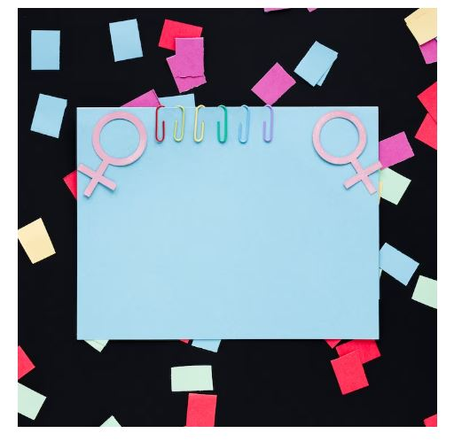
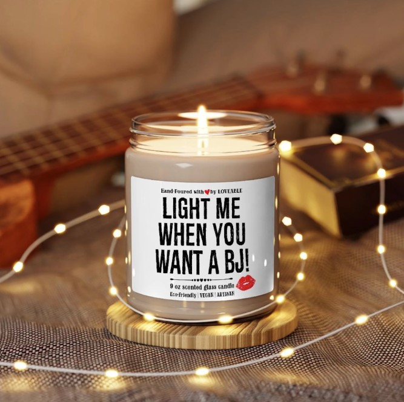

This article has been written and researched by our expert Loveable through a precise methodology. [Learn more about our methodology](https://avada.io/loveable/our-methodological.html)

[Loveable](https://avada.io/loveable/) > [Blog](https://avada.io/loveable/blog/) > [Relationship](https://avada.io/loveable/relationship/)

# 20+ Sex Questions to Ask Before Marriage | Love & Sex

Written by [Luna Miller](https://avada.io/loveable/author/luna/) Last Updated on August 29, 2023

- [Is Sex Really Important in a Relationship?](https://avada.io/loveable/blog/sex-questions-to-ask-before-marriage/#wp-block-heading-2-4)
- [21+ Sex Questions to Ask Before Marriage](https://avada.io/loveable/blog/sex-questions-to-ask-before-marriage/#wp-block-heading-2-12)
    - [7 Basic Sex Questions to Ask Before Marriage](https://avada.io/loveable/blog/sex-questions-to-ask-before-marriage/#wp-block-heading-3-14)
        - [1\. How’s your sex life?](https://avada.io/loveable/blog/sex-questions-to-ask-before-marriage/#wp-block-heading-4-15)
        - [2\. How often do you want to make love?](https://avada.io/loveable/blog/sex-questions-to-ask-before-marriage/#wp-block-heading-4-18)
        - [3\. Do you think our sex life will be affected when we have kids?](https://avada.io/loveable/blog/sex-questions-to-ask-before-marriage/#wp-block-heading-4-21)
        - [4\. What would you like to try if there were no consequences or guilty?](https://avada.io/loveable/blog/sex-questions-to-ask-before-marriage/#wp-block-heading-4-25)
        - [5\. What did you learn about sex?](https://avada.io/loveable/blog/sex-questions-to-ask-before-marriage/#wp-block-heading-4-30)
        - [6\. Do you want to try sex toys?](https://avada.io/loveable/blog/sex-questions-to-ask-before-marriage/#wp-block-heading-4-34)
        - [7\. What are your thoughts on pornography?](https://avada.io/loveable/blog/sex-questions-to-ask-before-marriage/#wp-block-heading-4-37)
    - [14 Questions Make Secret Turn-ons Before Marriage](https://avada.io/loveable/blog/sex-questions-to-ask-before-marriage/#wp-block-heading-3-42)
- [4 Best Sexy Gifts To Satisfy Any Couples](https://avada.io/loveable/blog/sex-questions-to-ask-before-marriage/#wp-block-heading-2-65)
    - [Funny Blanket I Promise To Always By Your Side](https://avada.io/loveable/blog/sex-questions-to-ask-before-marriage/#wp-block-heading-3-66)
    - [Funny Scented Candle For Husband or Boyfriend](https://avada.io/loveable/blog/sex-questions-to-ask-before-marriage/#wp-block-heading-3-69)
    - [I Promise To Always Be By Your Side – Personalized Pillow](https://avada.io/loveable/blog/sex-questions-to-ask-before-marriage/#wp-block-heading-3-72)
    - [Best Gift For Him Personalized Mug](https://avada.io/loveable/blog/sex-questions-to-ask-before-marriage/#wp-block-heading-3-75)
- [Final Thoughts](https://avada.io/loveable/blog/sex-questions-to-ask-before-marriage/#wp-block-heading-2-81)

Love and sex are two of the most important factors to consider when you’re thinking about getting married. Sure, marriage is a time for celebrating your commitment to each other and looking forward to a lifetime of shared memories, but it’s also an incredible leap into what can be an incredibly intimate aspect of life: physical relationships. 

While there may be some conversations that both of you should have had before popping the question, diving head-first into asking questions about sex can feel stressful or awkward, still, to create a happy and healthy future together, it’s essential that these topics get discussed — ideally before entering into matrimony. 

That’s why we’ve compiled this list of over 20 must-ask **sex questions to ask before marriage** so that couples can start their marriage with confidence.

## **Is Sex Really Important in a Relationship?**

There isn’t a single, appropriate response to this. Because everyone is distinct, what is significant to some people may not be at all significant to others. Ultimately, it comes down to your values, sexual preferences, and relationship patterns.

Without engaging in sex with their spouses, many individuals enjoy happy, meaningful, and healthy love relationships (or only have sex with their partners once in a while). This does not necessarily imply that the relationship will be harmful, though. It also doesn’t always mean that your partner doesn’t appreciate or love you!

Others view sex as a crucial component of dating relationships, desiring a sexual relationship with the person they are dating.

_Is sex really important in a relationship?_

There is a range of sexual preferences. Allosexuals do experience sexual desire, although asexual persons seldom do (and often don’t have sex, though each person is different).

We all have various approaches to sex since there is such a wide range in our tendency for sexual attraction and our sentiments about sex, but no method is incorrect.

It turns out to be really significant. There are a ton of scientifically proven advantages to having frequent sex with your lover. These positives include improved relationships, stress reduction, and even better sleep for both spouses.

## **21+ Sex Questions to Ask Before Marriage**

_21+ Sex Questions To Ask Before Marriage_

### **7 Basic Sex Questions to Ask Before Marriage**

#### **1\. How’s your sex life?**

This question is fundamental when we discuss unlearning shame since it helps to establish a secure environment in which both parties may interact.

Almost everyone wants to share their favorite bedtime activities with their spouses. However, in practice, most of us find it difficult to speak out when necessary or feel self-conscious about doing so. By addressing the “how” of communication, this question might facilitate easier conversation.

#### **2\. How often do you want to make love?**

It’s not really a good idea to ask this question to count on your sexual desires lining up right away. If one partner seems to crave sex more frequently than the other, couples commonly fall into a routine of doubt and guilt. Sadly, this is nearly always unavoidable. 

Since each person’s schedule, mood, energy level, and stress level might vary, discussing any additional intimate requirements you may have in addition to your partner’s need to get down frequently is essential.

#### **3\. Do you think our sex life will be affected when we have kids?**

Most individuals don’t pause to consider how having children would impact their sex life since it’s so simple to become immersed in the joy of having sex. However, you can explore topics like whether you believe you will be distracted or inhibited and whether you believe that becoming a parent saps your sexiness and sexual vitality. 

And what is the best way to devise a strategy to separate the physical demands of being a mum from the sexual touch of a partner by asking your significant other how they think things will change once you have children?

_Do you think our sex life will be affected when we have kids?_

#### **4\. What would you like to try if there were no consequences or guilty?**

Answering this question with a new partner or someone you’ve been sleeping with for a long time might be nerve-wracking. Many of us find it difficult to express our most private needs in full and clear terms, especially if we think of them as uncommon fetishes or even a preferred position we’re unsure whether our partner will be sympathetic to.

Put less emphasis on the two of you and more emphasis on the fantasy by framing it in a relaxed manner. Such conversations enable your spouse to voice wants that they would otherwise feel too anxious to do so. They feel liberated to fully explore their desires and imaginations because of this.

Everybody has one or two sexual fantasies. However, partners might be reluctant to disclose the sorts of sex they prefer because they don’t want their spouse to know what they have previously done with others, they are ashamed of their fantasies, or they fear their partner will judge them. 

Before you get married, it’s crucial to explore them and let your partner know you can be honest and open with them.

#### **5\. What did you learn about sex?**

_What did you learn about sex?_

This is among the most important questions about sex before marriage. Sharing your most private sexual fantasies might seem quite awkward. Because of their sentiments of guilt or shame, some people may feel this way. It might be a lot easier to understand someone’s preferences, actions, and wants if you know where they’re coming from.

It can help you understand their thoughts, perspectives, and general understanding about sex by asking them this question, which is also a good suggestion. In addition, it provides you a place to start when talking with them about issues so that your experience can be more enjoyable.

#### **6\. Do you want to try sex toys?**

Sexual routine frequently leads to sex ruts. In order to maintain your brain’s interest and arousal over time, it is therefore beneficial to have novelty in your sexual life. Getting on the same page about having sex in various positions and combining oral sex with manual stimulation is a fantastic idea. 

Sex toys may also be a terrific addition to your sex life, increasing the variety of sensations and activities you can experience. In addition to using sex toys, you can buy some [sexy gifts for her](https://avada.io/loveable/sexy-gifts-wife/) or [sexy gifts for him](https://avada.io/loveable/sexy-gifts-husband/) to increase the pleasure in your sex life.

#### **7\. What are your thoughts on pornography?**

These days, it’s hard to avoid porn, and a lot of individuals use it to spark their excitement. Unfortunately, watching porn in secret might increase sentiments of hostility and avoidance. 

Couples should talk about how they personally feel about porn and what expectations they have for each other, and the relationship’s usage of porn to avoid those uneasy feelings and maintain open communication about the subject.

_What are your thoughts on pornography?_

**_Related_**_:_ [35 Perfect Sexy Valentine’s Day Gifts That’ll Satisfy Any Couples](https://avada.io/loveable/sexy-valentines-day-gifts/)

### **14 Questions Make Secret Turn-ons Before Marriage**

Just getting through the first date with a new person makes learning about them a fascinating mystery, from their upbringing to their preferred sex position. Once a couple has been dating for a while, however, they frequently compare their spouse to a book that has been read so many times that there are no surprises left. 

A terrific game to spice up a long-term relationship and a hot method to learn what a new partner loves and how to turn them on is to ask each other dirty questions.

It’s more than simply a verbal [foreplay idea](https://malaysia.news.yahoo.com/foreplay-ideas-try-because-sex-224500335.html)—even if you’ve been married for decades, you might be astonished by the responses to the sex questions. It’s all about repeatedly meeting your mates and falling in love with them. And also with yourself. There’s more to learn than you think. We’re all continually evolving, which is one of the most interesting aspects of long-term marriages.

These sex questions to ask before marriage are a great approach to learning about your and your partner’s tastes and how you may combine them to make the finest sexually intimate relationship possible.

If discussing sex is uncomfortable for you or your spouse, start slowly, similar to how you would create an exercise plan with a gentle stroll.

_Questions make secret turn-ons before marriage_

**Here are some sex questions to turn each other on**.

1. What’s your idea of amazing sex?
2. What kind of sex position would you like to do? 
3. If you could make love anywhere, where would you go? 
4. If you could have sex with any celebrity, who would it be – and what do you think it would be like?
5. What do you define as cheating?
6. What is something you have never tried but would like to do? 
7. Do you have a sexual fetish? If so, what is it?
8. Where do you like and not like to be touched?
9. What’s one thing you love that I do when we have sex and why?
10. What porn are you watching now?
11. What does the thing go through your mind while you masturbate?
12. How many people did you make love to?
13. In what context do you feel the sexiest?
14. What’s your favorite sex-related fantasy?
15. When sex is satisfying, how do you look and sound?

## **4 Best Sexy Gifts To Satisfy Any Couples**

### [**Funny Blanket I Promise To Always By Your Side**](https://loveable.ai/products/i-promise-to-always-by-your-side-or-under-you-or-on-top-of-you-fleece-blanket-best-funny-gifts-for-him-her-on-christmas-valentine-birthday-anniversaries-210ihpbnbl419?variant=43992587895016)

If there’s something I want to say to my beloved before getting married, it would be a humorous message on this blanket. This blanket will make every night on your bed cozy and warm, adding a touch of charm to our bedroom space. Moreover, the blanket is made of high-quality breathable fabric, suitable for all seasons, and it’s also easy to wash and perfect for dry cleaning.

### [**Funny Scented Candle For Husband or Boyfriend**](https://loveable.ai/products/light-me-when-you-want-a-bj-9oz-scented-candle-best-funny-gifts-for-husband-boyfriend-him-on-birthday-anniversary-christmas-209ihpthsc333?variant=44173918077160)

A gift that’s both enticing and humorous guaranteed to make any guy burst into laughter. This scented candle will definitely add a touch of decoration and bring a gentle fragrance to any space. Made entirely from natural soy wax, it’s completely safe for health, besides its pleasant scent. The product can also be used to decorate the bathroom and bedroom, creating a more romantic atmosphere.

### [**I Promise To Always Be By Your Side – Personalized Pillow**](https://loveable.ai/products/i-always-to-be-by-your-side-personalized-all-over-print-pillow-best-funny-dirty-gifts-for-couple-on-valentine-anniversaries-210ihpnppi420?variant=43989350678760)

If you want to express your love for your spouse in a genuine yet humorous and non-cheesy way, then this personalized pillow is the perfect choice. Designed to perfectly complement any bedroom space, this gift will undoubtedly replace the need for your sweet words of affection. Additionally, the pillow is made from premium, breathable, durable fabric that is specifically suitable for handwashing and dry cleaning.

### [**Best Gift For Him Personalized Mug**](https://loveable.ai/products/thanks-for-all-the-orgasms-11oz-15oz-white-mug-best-gift-for-him-on-valentines-day-birthdays-anniversaries-212ihpbnmu688?variant=44202163470568)

When considering gifts for your significant other, it’s not just about expensive or extravagant items that your boyfriend will appreciate. This personalized mug with a hilarious message is sure to score points. Made from high-quality porcelain material that can withstand heat, the product is completely safe for microwave and dishwasher use. Furthermore, with every sip of morning coffee, this mug will remind your loved one how much they mean to you.

_**See More:**_

- Best [Sex Bucket List](https://avada.io/loveable/sex-bucket-list/) Ideas

- Important [Questions for A New Relationship](https://avada.io/loveable/questions-new-relationship/)

## **Final Thoughts**

Ultimately, discussing sex before marriage should be considered a necessary part of preparing for a healthy, trusting relationship. While it can be difficult to ask tough questions or confront deeper issues, having an open and honest dialogue about where both partners stand on topics like gender expression and fidelity can ensure the couple’s mutual understanding of their expectations in the future. 

No matter which **sex questions to ask before marriage** work best for your relationship, staying safe and respecting each other’s wishes is critical. Above all else, remember that sexual exploration should remain a source of fun and passion throughout one’s lifetime! With proper education, communication, and respect for boundaries, couples can continue developing their connection and enjoy every second of it!

- [Is Sex Really Important in a Relationship?](https://avada.io/loveable/blog/sex-questions-to-ask-before-marriage/#wp-block-heading-2-4)
- [21+ Sex Questions to Ask Before Marriage](https://avada.io/loveable/blog/sex-questions-to-ask-before-marriage/#wp-block-heading-2-12)
    - [7 Basic Sex Questions to Ask Before Marriage](https://avada.io/loveable/blog/sex-questions-to-ask-before-marriage/#wp-block-heading-3-14)
        - [1\. How’s your sex life?](https://avada.io/loveable/blog/sex-questions-to-ask-before-marriage/#wp-block-heading-4-15)
        - [2\. How often do you want to make love?](https://avada.io/loveable/blog/sex-questions-to-ask-before-marriage/#wp-block-heading-4-18)
        - [3\. Do you think our sex life will be affected when we have kids?](https://avada.io/loveable/blog/sex-questions-to-ask-before-marriage/#wp-block-heading-4-21)
        - [4\. What would you like to try if there were no consequences or guilty?](https://avada.io/loveable/blog/sex-questions-to-ask-before-marriage/#wp-block-heading-4-25)
        - [5\. What did you learn about sex?](https://avada.io/loveable/blog/sex-questions-to-ask-before-marriage/#wp-block-heading-4-30)
        - [6\. Do you want to try sex toys?](https://avada.io/loveable/blog/sex-questions-to-ask-before-marriage/#wp-block-heading-4-34)
        - [7\. What are your thoughts on pornography?](https://avada.io/loveable/blog/sex-questions-to-ask-before-marriage/#wp-block-heading-4-37)
    - [14 Questions Make Secret Turn-ons Before Marriage](https://avada.io/loveable/blog/sex-questions-to-ask-before-marriage/#wp-block-heading-3-42)
- [4 Best Sexy Gifts To Satisfy Any Couples](https://avada.io/loveable/blog/sex-questions-to-ask-before-marriage/#wp-block-heading-2-65)
    - [Funny Blanket I Promise To Always By Your Side](https://avada.io/loveable/blog/sex-questions-to-ask-before-marriage/#wp-block-heading-3-66)
    - [Funny Scented Candle For Husband or Boyfriend](https://avada.io/loveable/blog/sex-questions-to-ask-before-marriage/#wp-block-heading-3-69)
    - [I Promise To Always Be By Your Side – Personalized Pillow](https://avada.io/loveable/blog/sex-questions-to-ask-before-marriage/#wp-block-heading-3-72)
    - [Best Gift For Him Personalized Mug](https://avada.io/loveable/blog/sex-questions-to-ask-before-marriage/#wp-block-heading-3-75)
- [Final Thoughts](https://avada.io/loveable/blog/sex-questions-to-ask-before-marriage/#wp-block-heading-2-81)

### [Luna Miller](https://avada.io/loveable/author/luna/)

I'm Luna Miller, a helpful employee at Loveable. I excel at giving great advice on birthday gifts. I love suggesting memorable experiences like concerts, spas, and getaways. As a reliable and supportive colleague, I'm always there to assist.

- [Twitter](https://twitter.com/intent/tweet)
- [Facebook](https://www.facebook.com/sharer/sharer.php)
- [instagram](https://avada.io/loveable/blog/sex-questions-to-ask-before-marriage/)
- [pinterest](https://www.pinterest.com/loveablellc/)

## Related Posts

[

### 35 Unforgettable Exciting Adult Birthday Party Ideas

](https://avada.io/loveable/blog/adult-birthday-party-ideas/)

[

### 42 Best 21st Birthday Outfits to Rock the Party

](https://avada.io/loveable/blog/21st-birthday-outfits/)

[

### 50+ Happy 40th Anniversary Quotes, Messages, and Wishes

](https://avada.io/loveable/blog/happy-40th-anniversary-quotes/)

[

### 100+ Heartwarming Happy 30th Anniversary Quotes, Messages, and Wishes

](https://avada.io/loveable/blog/happy-30th-anniversary-quotes/)

[

### 120+ Heartfelt Thank You Messages for The Birthday Wishes

](https://avada.io/loveable/blog/thank-you-messages-birthday-wishes/)
