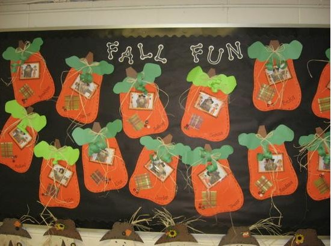

This article has been written and researched by our expert Loveable through a precise methodology. [Learn more about our methodology](https://avada.io/loveable/our-methodological.html)

[Loveable](https://avada.io/loveable/) > [Blog](https://avada.io/loveable/blog/) > [Holiday](https://avada.io/loveable/holiday/)

# 20 Spooktacular DIY Halloween Bulletin Board Ideas In 2023

Written by [Blake Simpson](https://avada.io/loveable/author/blake/) Last Updated on August 24, 2023

- [20 Easy DIY Halloween Bulletin Board Ideas](https://avada.io/loveable/blog/halloween-bulletin-board-ideas/#wp-block-heading-2-3)
    - [1\. Reading is Spooktacular](https://avada.io/loveable/blog/halloween-bulletin-board-ideas/#wp-block-heading-3-4) 
    - [2\. Halloween and The Animals](https://avada.io/loveable/blog/halloween-bulletin-board-ideas/#wp-block-heading-3-7) 
    - [3\. Mummify your Door](https://avada.io/loveable/blog/halloween-bulletin-board-ideas/#wp-block-heading-3-10)
    - [4\. Frankenstein Door](https://avada.io/loveable/blog/halloween-bulletin-board-ideas/#wp-block-heading-3-13)
    - [5\. Spooky Eyes](https://avada.io/loveable/blog/halloween-bulletin-board-ideas/#wp-block-heading-3-16)
    - [6\. Create A Spooktacular Village](https://avada.io/loveable/blog/halloween-bulletin-board-ideas/#wp-block-heading-3-20)
    - [7\. Corn Candy Theme](https://avada.io/loveable/blog/halloween-bulletin-board-ideas/#wp-block-heading-3-23)
    - [8\. Get Caught In a Good Book](https://avada.io/loveable/blog/halloween-bulletin-board-ideas/#wp-block-heading-3-26)
    - [9\. Frankenstein Art](https://avada.io/loveable/blog/halloween-bulletin-board-ideas/#wp-block-heading-3-29)
    - [10\. Pumpkin Patch Bulletin Board](https://avada.io/loveable/blog/halloween-bulletin-board-ideas/#wp-block-heading-3-32)
    - [11\. Read More Book Spooky Eyes](https://avada.io/loveable/blog/halloween-bulletin-board-ideas/#wp-block-heading-3-36)
    - [12\. This Class Is Sweet](https://avada.io/loveable/blog/halloween-bulletin-board-ideas/#wp-block-heading-3-39) 
    - [13\. Pumpkin Glyphs – Festive Autumn Bulletin Board Idea](https://avada.io/loveable/blog/halloween-bulletin-board-ideas/#wp-block-heading-3-42)
    - [14\. A Batch of Smart Cookies](https://avada.io/loveable/blog/halloween-bulletin-board-ideas/#wp-block-heading-3-44)
    - [15\. Autumn Bulletin Board Idea Falling for All Things Fall](https://avada.io/loveable/blog/halloween-bulletin-board-ideas/#wp-block-heading-3-48) 
    - [16\. Arts Bulletin Board Idea Creepy Contractions Halloween Language](https://avada.io/loveable/blog/halloween-bulletin-board-ideas/#wp-block-heading-3-54) 
    - [17\. We’re Batty Over Halloween! – Halloween Bat-Themed Bulletin Board Idea](https://avada.io/loveable/blog/halloween-bulletin-board-ideas/#wp-block-heading-3-61)
    - [18\. Halloween Math Bulletin Board Idea Trick or Treat On Odd and Even Street!](https://avada.io/loveable/blog/halloween-bulletin-board-ideas/#wp-block-heading-3-69) 
    - [19\. Look Who We Caught For Student of the Month](https://avada.io/loveable/blog/halloween-bulletin-board-ideas/#wp-block-heading-3-76)
    - [20\. Dora The Explorer Halloween Bulletin Board Display Idea](https://avada.io/loveable/blog/halloween-bulletin-board-ideas/#wp-block-heading-3-84)
- [Final Words](https://avada.io/loveable/blog/halloween-bulletin-board-ideas/#wp-block-heading-2-93) 

Step into the world of Halloween with our collection of spooktacular **bulletin board ideas**! Whether you’re a teacher, a parent, or someone looking to bring some Halloween spirit to your office or community space, a well-designed bulletin board can set the stage for a festive and engaging environment. 

We’ll explore a variety of creative and eye-catching ideas that will transform your bulletin board into a captivating Halloween display. From adorable monsters to wicked witches, get ready to inspire and delight with these **Halloween-themed bulletin board** designs.

## **20 Easy DIY Halloween Bulletin Board Ideas**

### **1\. Reading is Spooktacular** 

Imagine captivating your students with a Halloween-themed bulletin board that screams, “Reading is cool!” Enter the realm of three fascinating witches who bring magic to the world of books. Let their enchanting presence inspire young imaginative minds.

### **2\. Halloween and The Animals** 

Are you a science teacher looking to add some excitement to your classroom during the fall season? Well, a science-centered Halloween bulletin board might just be the answer! By incorporating science facts into the board, not only will you create a spooky atmosphere, but your students will also learn some fascinating new information along the way. It’s a win-win situation that combines education with Halloween fun!

### **3\. Mummify your Door**

Got an abundance of toilet paper from your back-to-school wishlist? No worries! Put that extra TP to good use by wrapping it around a bulletin board, and with the addition of some glowing eyes, you’ll have a spooktacular Halloween display ready to go!

### **4\. Frankenstein Door**

No room for a bulletin board? No problem! [Transform your door](https://avada.io/loveable/blog/classroom-door-halloween-decorations/) into a frightful Frankenstein with just some green-colored paper, a face, and a few bolts. It’s a simple yet effective way to give unsuspecting passers-by a good scare this Halloween!

### **5\. Spooky Eyes**

Want some simple Halloween bulletin board ideas? Here’s a quick and easy way to give your classroom a spooky touch. Print out various eye shapes and stick them onto a bulletin board. Let your students get creative and design their own eyes to make it even more engaging. It’s a fun and interactive way to celebrate Halloween!

**You may also like:** _[Best Halloween Gift Tags Printable](https://avada.io/loveable/halloween-gift-tags-printable/)_

### **6\. Create A Spooktacular Village**

Looking for a classroom activity that brings Halloween vibes to your empty bulletin board? Here’s a fantastic idea! Have each of your students draw something that reminds them of Halloween. Once they’re done, cut out their individual drawings and arrange them on the board to create a marvelous and spooky village. It’s a surefire way to ignite creativity and transform your bulletin board into a Halloween masterpiece!

### **7\. Corn Candy Theme**

Looking for a fun twist on a Halloween-themed bulletin board activity? Instead of letting your students draw Halloween-related items, why not have them create their own candy corn masterpieces? Ask them to cut out and glue together their best candy corn creations. The result? A playful assortment of goofy-looking candy pieces that will add a personalized touch to your bulletin board. Get ready to showcase their sweet and whimsical designs in a spooktacular display!

### **8\. Get Caught In a Good Book**

Transform a corner of your bulletin board into a captivating spiderweb. Attach some books that appear to be caught up in the web, giving them a whimsical touch. Encourage your students to participate by writing [their favorite books](https://avada.io/loveable/halloween-books-kids/) on the covers of these trapped books. Now, invite the class to explore the bulletin board and discover new favorites among the tangled web of literature.

### **9\. Frankenstein Art**

Unleash the creative genius in your students by inviting them to draw their own unique interpretations of Frankenstein’s monster. Prepare to be amazed as a multitude of imaginative results flood in, ready to be showcased on a lighthearted Halloween bulletin board. Each [Halloween drawing](https://avada.io/loveable/blog/halloween-drawing-ideas/) will contribute to a playful and diverse display, adding a touch of whimsy and spookiness to your classroom. 

### **10\. Pumpkin Patch Bulletin Board**

If you’re aiming for a Halloween bulletin board that’s more adorable than spooky, here’s a delightful idea for you! Have your students decorate pumpkin cut-outs and transform them into charming jack-o’-lanterns. 

Let their creativity shine as they [design each pumpkin](https://avada.io/loveable/blog/halloween-pumpkin/) with cheerful expressions, vibrant colors, and playful decorations. This way, you can create a festive and inviting display that captures the spirit of Halloween without any fright.

### **11\. Read More Book Spooky Eyes**

With just a black or colored backdrop, you can set the stage for an enchanting display. But don’t stop there! Take it up a notch by adding a [Halloween-themed quote](https://www.countryliving.com/life/g4559/halloween-quotes/) that will inspire and ignite their imagination. This simple yet eye-catching bulletin board is sure to capture the attention of your students and create a spooky atmosphere that sets the tone for the Halloween season. 

### **12\. This Class Is Sweet** 

Embrace fancy lettering and opt for high-quality materials to make your display truly shine. With a combination of kindness and aesthetics, you can create a bulletin board that exudes warmth and charm while captivating everyone who lays eyes on it. So, let your creativity soar, incorporate intricate designs, and infuse your bulletin board with the spirit of Halloween in a way that delights both the heart and the senses.

### **13\. Pumpkin Glyphs – Festive Autumn Bulletin Board Idea**

In the world of bulletin boards, glyphs provide a delightful and distinct approach to collecting and showcasing data. We stumbled upon an incredibly charming pumpkin glyph bulletin board on Mrs. Smith’s first-grade classroom page, and we believe it would make a perfect fall display for any early childhood classroom. Let’s dive into the details of this adorable pumpkin glyph bulletin board and explore how it can bring a festive touch to your classroom.

### **14\. A Batch of Smart Cookies**

While a simple classroom decoration cannot magically transform a “C” into an “A,” it is widely acknowledged that immersing students in a positive learning environment can greatly enhance their engagement and performance. 

Nadia Rolle, a preschool teacher from the Bahamas and a contributor to Classroom Displays and Bulletin Boards, has designed a delightful and scrumptious display that reinforces her confidence in her students’ abilities to succeed both inside and outside the classroom. Let’s take a closer look at this motivational bulletin board, which proves that Nadia Rolle herself is “one smart cookie!”

### **15\. Autumn Bulletin Board Idea Falling for All Things Fall** 

At McKinley Early Childhood, the toddler teachers understand the value of involving their little ones in the decoration process. They have come up with a delightful and engaging fall bulletin board idea that incorporates adorable hand-print leaves. This simple yet creative bulletin board serves as a perfect backdrop for the entire fall season. With the addition of pumpkins, scarecrows, corn stalks, and other fun fall items, the possibilities for decorating are endless. Let’s explore this toddler-friendly fall bulletin board idea in more detail!

**To-Do**

- The Tree: Trace or draw a tree shape on brown paper and position it on the left side of the board, with branches pointing right.
- The Leaves: Print or trace leaf templates onto colored cardstock. Optionally, have children dip their hands in paint and press them onto the leaf cutouts. Place the leaves on the tree branches, cascading down towards the bottom of the board.

### **16\. Arts Bulletin Board Idea Creepy Contractions Halloween Language** 

Betsy McKnight, a fourth-grade teacher and contributor to Izzyshare, faced an interesting challenge when her unit on contractions coincided with the week of Halloween. Instead of keeping these two themes separate, she decided to creatively merge them, inventing an engaging concept called “Creepy Contractions.”

**Creepy Contraction Activities:**

You have two options for this activity: use a pre-designed haunted house coloring page or let students design their own houses using construction paper. Ensure the house design has plenty of windows.

Students should color or decorate their creations and cut them out. Carefully create window flaps with scissors, then mount the cutout on colored construction paper (black, orange, or yellow). While the glue dries, have students brainstorm common contractions and their original words.

Afterward, students can write the contractions on the front of the house windows and open the flaps to write the original words underneath. These decorations serve as both festive classroom decor and useful study aid.

### **17\. We’re Batty Over Halloween! – Halloween Bat-Themed Bulletin Board Idea**

Kim White, a preschool teacher and contributor to the teacher resource site Gigglepotz has designed a delightful holiday bulletin board to showcase her [students’ Halloween crafts](https://avada.io/loveable/blog/easy-halloween-craft-ideas/). This fun and festive bulletin board idea is not only super simple to create but also serves as a wonderful source of inspiration for future Halloween displays. 

**Decoration:**

1. The Bats

For the decoration, utilize the creations made by your students! Display their handmade bats on the bulletin board to bring a personalized touch to the design.

2. The Other Details

To enhance the theme of “bats in the night sky,” Kim White, the creator of this bulletin board, added a yellow moon. You can follow suit by incorporating a yellow moon as well. For added excitement, consider creating wispy white clouds to give a spooky ambiance. Additionally, you can create an illusion that the bats are flying out of a haunted chimney or attic window, adding an extra element of intrigue to the overall design. 

### **18\. Halloween Math Bulletin Board Idea Trick or Treat On Odd and Even Street!** 

Although this bulletin board idea, originally submitted to Teaching Photos, was not intended as a Halloween display, we believe it can be easily adapted to serve as a fantastic addition to your holiday decor. By making a few tweaks, you can transform it into an interactive math review activity for your students while also creating a festive display to enjoy throughout the month of October.

**Decoration:** 

- Even Street Houses: Paint the houses on “Even Street” orange and accentuate them with purple roofs, lime green doors, and gray windows, creating a captivating Halloween theme.

- Odd Street Houses: Utilize Halloween-themed or printed scrapbook paper to construct the houses on “Odd Street.” Enhance the houses by incorporating cutouts of ghosts, ghouls, and other eerie figures from windows and doors.

- House Numbers: Create house numbers using a ‘spooky’ Halloween font like Wild Wood, adding a touch of charisma and charm to the bulletin board.

### **19\. Look Who We Caught For Student of the Month**

With Halloween just around the corner, it’s the perfect time to spruce up your classroom decor. If you’re still looking for inspiration, we’re thrilled to showcase some of the fantastic bulletin board ideas that were submitted to our Halloween contest last year. Get ready to be inspired by these vibrant and themed boards that will bring a festive touch to your classroom.

**Decoration:**

- Draw or trace a spider web shape onto the background paper. Make it large enough to fit your desired layout.

- Use white craft yarn to bring the web to life. Glue the yarn onto the design, creating a three-dimensional effect. Allow it to dry completely.

- Arrange student photos on the web, placing them strategically. This adds a personalized touch to the board.

- Enhance the web by adding spider cutouts. Print each student’s name on the spiders using a silver Sharpie marker or a white paint pen.

### **20\. Dora The Explorer Halloween Bulletin Board Display Idea**

Although Halloween has passed, it’s never too early to gather inspiration for next year’s decorations! A creative preschool teacher took a unique approach by incorporating pop culture into her classroom with a Dora the Explorer-themed Halloween board. By tapping into her students’ current interests, she not only created a visually engaging display but also added a personalized touch to her classroom walls.

**Decoration:** 

- Characters: Draw or use pre-made Dora the Explorer cutouts to add to the board.
- Spider: Cut out a spider shape from black paper and add goofy eyes and a mouth using white, purple, and black construction paper.
- Spider Web: Hang orange fake spider webbing for a spooky effect.
- Details: Include pumpkins and fall leaves by either free-handing or printing clip-art on colored cardstock.
- Lettering: Use bubble letters for the title, shade them with an orange marker, and add a green slime illusion with a green marker.

## **Final Words** 

These 30 DIY **Halloween bulletin board ideas** for 2023 offer a wide range of spooktacular inspiration. Whether you prefer whimsical characters or eerie landscapes, these creative displays will engage students and create a festive atmosphere in your classroom. Get ready to unleash your creativity and have a frightfully fun time decorating your classroom this Halloween!

https://blog-admin.loveable.ai/wp-admin/post.php?post=94815&action=edit

- [20 Easy DIY Halloween Bulletin Board Ideas](https://avada.io/loveable/blog/halloween-bulletin-board-ideas/#wp-block-heading-2-3)
    - [1\. Reading is Spooktacular](https://avada.io/loveable/blog/halloween-bulletin-board-ideas/#wp-block-heading-3-4) 
    - [2\. Halloween and The Animals](https://avada.io/loveable/blog/halloween-bulletin-board-ideas/#wp-block-heading-3-7) 
    - [3\. Mummify your Door](https://avada.io/loveable/blog/halloween-bulletin-board-ideas/#wp-block-heading-3-10)
    - [4\. Frankenstein Door](https://avada.io/loveable/blog/halloween-bulletin-board-ideas/#wp-block-heading-3-13)
    - [5\. Spooky Eyes](https://avada.io/loveable/blog/halloween-bulletin-board-ideas/#wp-block-heading-3-16)
    - [6\. Create A Spooktacular Village](https://avada.io/loveable/blog/halloween-bulletin-board-ideas/#wp-block-heading-3-20)
    - [7\. Corn Candy Theme](https://avada.io/loveable/blog/halloween-bulletin-board-ideas/#wp-block-heading-3-23)
    - [8\. Get Caught In a Good Book](https://avada.io/loveable/blog/halloween-bulletin-board-ideas/#wp-block-heading-3-26)
    - [9\. Frankenstein Art](https://avada.io/loveable/blog/halloween-bulletin-board-ideas/#wp-block-heading-3-29)
    - [10\. Pumpkin Patch Bulletin Board](https://avada.io/loveable/blog/halloween-bulletin-board-ideas/#wp-block-heading-3-32)
    - [11\. Read More Book Spooky Eyes](https://avada.io/loveable/blog/halloween-bulletin-board-ideas/#wp-block-heading-3-36)
    - [12\. This Class Is Sweet](https://avada.io/loveable/blog/halloween-bulletin-board-ideas/#wp-block-heading-3-39) 
    - [13\. Pumpkin Glyphs – Festive Autumn Bulletin Board Idea](https://avada.io/loveable/blog/halloween-bulletin-board-ideas/#wp-block-heading-3-42)
    - [14\. A Batch of Smart Cookies](https://avada.io/loveable/blog/halloween-bulletin-board-ideas/#wp-block-heading-3-44)
    - [15\. Autumn Bulletin Board Idea Falling for All Things Fall](https://avada.io/loveable/blog/halloween-bulletin-board-ideas/#wp-block-heading-3-48) 
    - [16\. Arts Bulletin Board Idea Creepy Contractions Halloween Language](https://avada.io/loveable/blog/halloween-bulletin-board-ideas/#wp-block-heading-3-54) 
    - [17\. We’re Batty Over Halloween! – Halloween Bat-Themed Bulletin Board Idea](https://avada.io/loveable/blog/halloween-bulletin-board-ideas/#wp-block-heading-3-61)
    - [18\. Halloween Math Bulletin Board Idea Trick or Treat On Odd and Even Street!](https://avada.io/loveable/blog/halloween-bulletin-board-ideas/#wp-block-heading-3-69) 
    - [19\. Look Who We Caught For Student of the Month](https://avada.io/loveable/blog/halloween-bulletin-board-ideas/#wp-block-heading-3-76)
    - [20\. Dora The Explorer Halloween Bulletin Board Display Idea](https://avada.io/loveable/blog/halloween-bulletin-board-ideas/#wp-block-heading-3-84)
- [Final Words](https://avada.io/loveable/blog/halloween-bulletin-board-ideas/#wp-block-heading-2-93) 

### [Blake Simpson](https://avada.io/loveable/author/blake/)

Hi, I'm Blake from Loveable. I help people find perfect gifts for occasions like anniversaries and weddings. I also write a blog about holidays, sharing insights to make them more meaningful. Let's create unforgettable moments together!

- [Twitter](https://twitter.com/intent/tweet)
- [Facebook](https://www.facebook.com/sharer/sharer.php)
- [instagram](https://avada.io/loveable/blog/halloween-bulletin-board-ideas/)
- [pinterest](https://www.pinterest.com/loveablellc/)

## Related Posts

[### 120+ Christian Birthday Wishes To Spread Your Love](https://avada.io/loveable/blog/christian-birthday-wishes/) 

[

### 35 Best 70th Birthday Ideas To Celebrate The Special Milestone

](https://avada.io/loveable/blog/70th-birthday-ideas/)

[

### 50 Best 30th Birthday Decorations for a Remarkable Birthday Bash

](https://avada.io/loveable/blog/30th-birthday-decorations/)

[

### 40 Delicious Vegan Christmas Desserts to Delight Your Palate

](https://avada.io/loveable/blog/vegan-christmas-desserts/)

[

### 60 Christmas Team Building Activities to Boost Workplace Spirit

](https://avada.io/loveable/blog/christmas-team-building-activities/)
