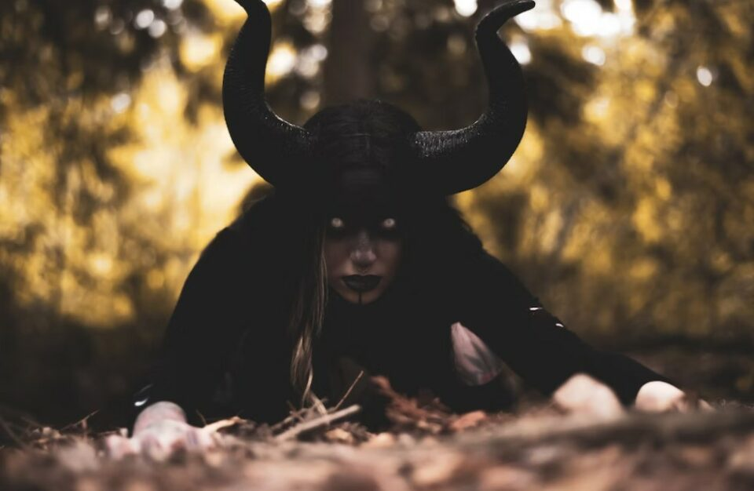
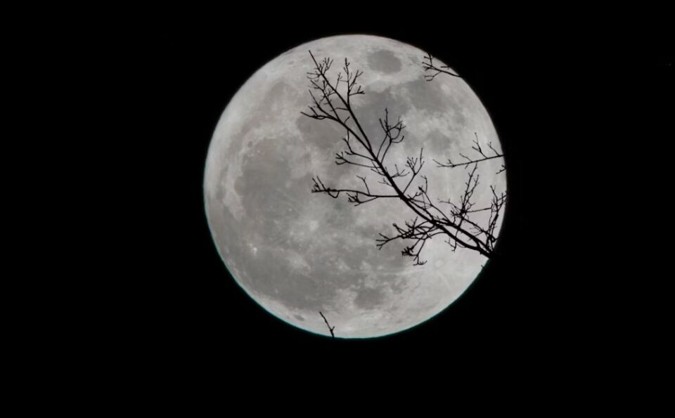
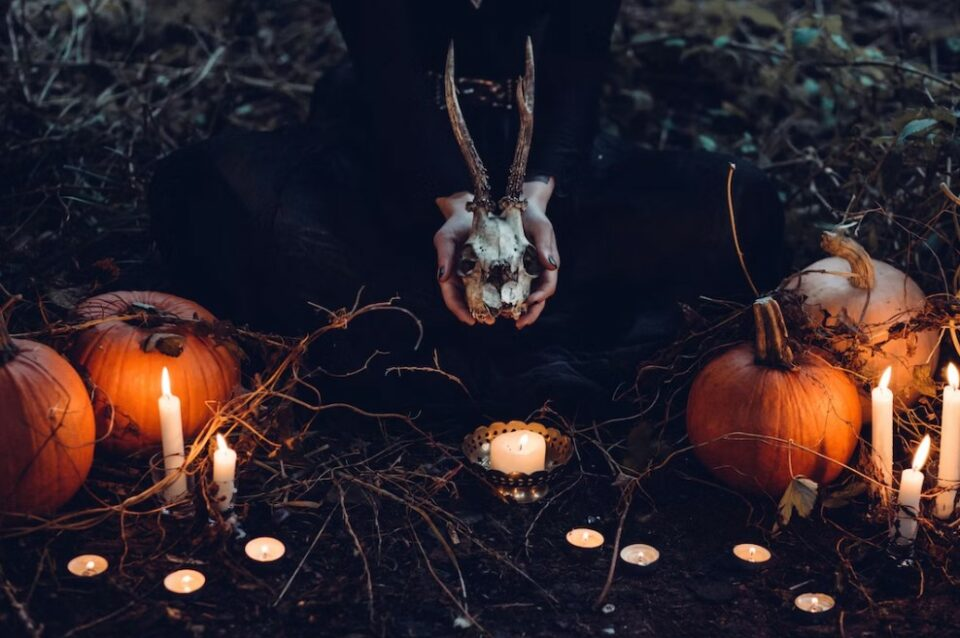
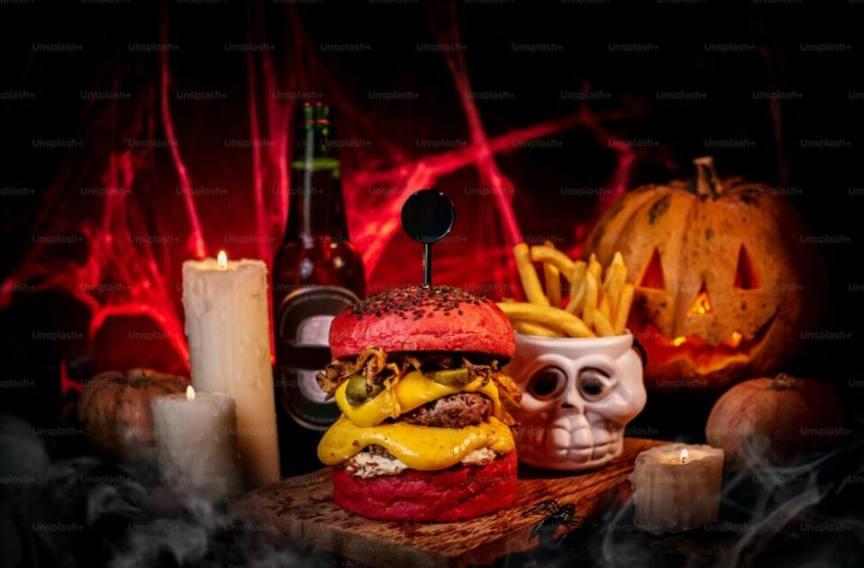
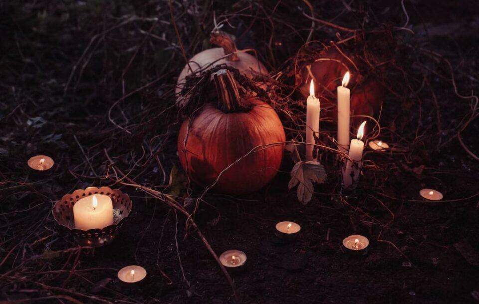

This article has been written and researched by our expert Loveable through a precise methodology. [Learn more about our methodology](https://avada.io/loveable/our-methodological.html)

[Loveable](https://avada.io/loveable/) > [Blog](https://avada.io/loveable/blog/) > [Holiday](https://avada.io/loveable/holiday/)

# 20 Spooky Halloween Stories in 2023 that’ll Give You The Creeps

Written by [Blake Simpson](https://avada.io/loveable/author/blake/) Last Updated on September 11, 2023

- [Classic Halloween Stories](https://avada.io/loveable/blog/best-halloween-stories/#wp-block-heading-2-4)
    - [1\. “The Haunting of Ravenswood Manor” by Sarah Collins](https://avada.io/loveable/blog/best-halloween-stories/#wp-block-heading-3-5)
    - [2\. “Witching Hour” by Jonathan Blackwood](https://avada.io/loveable/blog/best-halloween-stories/#wp-block-heading-3-10)
    - [3\. “Cursed Souls” by Emily Harris](https://avada.io/loveable/blog/best-halloween-stories/#wp-block-heading-3-14)
    - [4\. “Pumpkin Hollow” by Michael Thompson](https://avada.io/loveable/blog/best-halloween-stories/#wp-block-heading-3-19)
    - [5\. “The Shadow Within” by Rebecca Williams](https://avada.io/loveable/blog/best-halloween-stories/#wp-block-heading-3-23)
- [Halloween Stories for Adult](https://avada.io/loveable/blog/best-halloween-stories/#wp-block-heading-2-28) 
    - [6\. “The Witch’s Apprentice” by Benjamin Green](https://avada.io/loveable/blog/best-halloween-stories/#wp-block-heading-3-29)
    - [7\. “Nightmare Avenue” by Jessica Anderson](https://avada.io/loveable/blog/best-halloween-stories/#wp-block-heading-3-33)
    - [8\. “The Black Cat’s Curse” by Samantha Lee](https://avada.io/loveable/blog/best-halloween-stories/#wp-block-heading-3-37)
    - [9\. “Ghosts of Greywood Manor” by Matthew Collins](https://avada.io/loveable/blog/best-halloween-stories/#wp-block-heading-3-42)
    - [10\. “The Vampire’s Embrace” by Olivia Reed](https://avada.io/loveable/blog/best-halloween-stories/#wp-block-heading-3-46)
    - [11\. “The Witch Hunter’s Curse” by Daniel Roberts](https://avada.io/loveable/blog/best-halloween-stories/#wp-block-heading-3-49)
    - [12\. “Trick or Treat: A Collection of Spooky Stories” by Lucy Johnson](https://avada.io/loveable/blog/best-halloween-stories/#wp-block-heading-3-54)
    - [13\. “The House at the End of the Lane” by Thomas Miller](https://avada.io/loveable/blog/best-halloween-stories/#wp-block-heading-3-58)
    - [14\. “The Halloween Spellbook” by Sarah Thompson](https://avada.io/loveable/blog/best-halloween-stories/#wp-block-heading-3-61)
    - [15\. “The Ghostly Guardian” by James Wilson](https://avada.io/loveable/blog/best-halloween-stories/#wp-block-heading-3-65)
    - [16\. “Midnight Masquerade” by Emma Roberts](https://avada.io/loveable/blog/best-halloween-stories/#wp-block-heading-3-68)
    - [17\. “The Witching Hour Mysteries” by Samantha Adams](https://avada.io/loveable/blog/best-halloween-stories/#wp-block-heading-3-72)
    - [18\. “The Legend of Sleepy Hollow: Retold” by David Peterson](https://avada.io/loveable/blog/best-halloween-stories/#wp-block-heading-3-75)
    - [19\. “The Monster Under the Bed” by Stephanie Collins](https://avada.io/loveable/blog/best-halloween-stories/#wp-block-heading-3-80)
    - [20\. “The Witching Season” by Robert Anderson](https://avada.io/loveable/blog/best-halloween-stories/#wp-block-heading-3-83)
- [Halloween Stories, Final Thoughts](https://avada.io/loveable/blog/best-halloween-stories/#wp-block-heading-2-87) 

Halloween, a time when the boundary between the living and the supernatural blurs, has long been a source of fascination and inspiration for storytellers. From the classic tales of ghosts and monsters to the modern narratives that push the boundaries of horror, contemporary Halloween stories continue to captivate audiences with their fresh perspectives and chilling narratives. 

In this section, we will explore a selection of contemporary **Halloween stories** that have left an indelible mark on the genre. These narratives delve into the depths of psychological terror, introduce fantastical realms, and navigate post-apocalyptic landscapes, offering readers a thrilling and sometimes thought-provoking journey into the unknown. 

As we delve into these stories, we will examine the unique elements and themes that make them stand out, showcasing the enduring power of Halloween literature in captivating and chilling our imaginations. Join us as we venture into the world of contemporary [**Halloween**](https://avada.io/loveable/halloween/) stories and unlock the door to a realm where darkness and imagination collide.

## **Classic Halloween Stories**

### **1\. “The Haunting of Ravenswood Manor” by Sarah Collins**

In “The Haunting of Ravenswood Manor,” Sarah Collins takes readers on a chilling journey through the mysterious corridors of Ravenswood Manor. The atmospheric setting and richly detailed descriptions create a sense of foreboding as secrets and spirits lurk in every shadow. 

Collins masterfully builds suspense, skillfully intertwining the present with the dark history of the manor. With its expert pacing and unexpected twists, this gothic tale keeps readers enthralled until the final page.

**_Read_** [**_The Haunting of Ravenswood Manor_**](https://www.amazon.co.jp/-/en/Aftab-Khan-ebook/dp/B0C33XHRVN)

### **2\. “Witching Hour” by Jonathan Blackwood**

Jonathan Blackwood’s “Witching Hour” immerses readers in a world where the veil between the living and the supernatural is thinnest. The story follows a coven of witches as they harness their powers during the bewitching hour. 

Blackwood’s evocative prose captures the essence of Halloween, painting vivid scenes of magic, rituals, and the power struggles within the coven. With its enchanting plot and well-developed characters, “Witching Hour” is a spellbinding read for those seeking a bewitching Halloween experience.

**_Read_** [**_Witching Hour_**](https://www.amazon.com/gp/product/B01MDQE3YR/)

### **3\. “Cursed Souls” by Emily Harris**

In “Cursed Souls,” Emily Harris delves into the realm of supernatural horror, weaving a tale of ancient curses and vengeful spirits. The story follows a protagonist who becomes entangled in a web of dark magic and haunted memories. 

Harris skillfully blends elements of suspense, mystery, and the supernatural, creating a chilling atmosphere that keeps readers on edge. With its intricate plot and memorable characters, “Cursed Souls” is a captivating Halloween story that will leave readers breathless.

**_Read_** [**_Cursed Souls_**](https://www.amazon.com/Cursed-Souls-Society-Ancient-Magic-ebook/dp/B08WLGKV5Z/)

### **4\. “Pumpkin Hollow” by Michael Thompson**

Michael Thompson’s “Pumpkin Hollow” offers a heartwarming and whimsical tale set in a town where pumpkins come alive. The story follows a group of endearing characters as they navigate the magical adventures and challenges of Pumpkin Hollow. 

Thompson’s delightful narrative captures the joy and excitement of Halloween, making it a [**perfect choice for family**](https://avada.io/loveable/halloween-family-costumes/) reading. With its charming illustrations and positive messages, “Pumpkin Hollow” is sure to enchant readers of all ages.

**_Read_** [**_Pumpkin Hollow_**](https://www.amazon.com/Candy-Coated-Murder-Pumpkin-Mystery-ebook/dp/B074146SMX/)

### **5\. “The Shadow Within” by Rebecca Williams**

Rebecca Williams combines psychological suspense with supernatural elements in “The Shadow Within.” The story follows a protagonist plagued by a malevolent presence that slowly consumes their sanity. 

Williams expertly builds tension and explores the psychological depths of fear, creating an eerie and [**captivating reading experience**](https://avada.io/loveable/gifts-readers/). With its blend of supernatural and psychological horror, “The Shadow Within” is a gripping tale that will leave readers questioning the boundaries of reality.

**_Read_** [**_The Shadow Within_**](https://www.amazon.com/Within-Shadows-Brandon-Massey-ebook/dp/B01NBUOVJM/)

## **Halloween Stories for Adult** 

### **6\. “The Witch’s Apprentice” by Benjamin Green**

In “The Witch’s Apprentice,” Benjamin Green introduces readers to a young girl who embarks on a journey into the world of witchcraft. As the protagonist confronts her fears and navigates the challenges of magic, Green weaves a tale of friendship, bravery, and self-discovery. 

The vividly depicted magical world and well-developed characters make “The Witch’s Apprentice” a must-read for fans of fantasy and coming-of-age stories. With its enchanting narrative and themes of empowerment, this Halloween tale casts a spell on readers.

**_Read_** [**_The Witch’s Apprentice_**](https://www.amazon.com/Witchs-Apprentice-Dragons-Bag-Book-ebook/dp/B097ZDCG7Y/)

### **7\. “Nightmare Avenue” by Jessica Anderson**

Jessica Anderson’s “Nightmare Avenue” takes readers on a spine-chilling exploration of the dark side of suburban life. The collection of interconnected short stories uncovers the terrifying secrets that lie behind the closed doors of a seemingly ordinary neighborhood. 

Anderson expertly builds suspense, delivering unexpected twists and haunting revelations. With its blend of psychological tension and supernatural horror, “Nightmare Avenue” keeps readers on the edge of their seats, questioning the true nature of their own neighborhoods.

**_Read_** [**_Nightmare Avenue_**](https://www.amazon.com/Nightmare-Avenue-Laura-Ponce-Leon-ebook/dp/B0B32V12MC/)

### **8\. “The Black Cat’s Curse” by Samantha Lee**

Samantha Lee weaves a tale of ancient witchcraft and superstition in “The Black Cat’s Curse.” The story follows a protagonist who becomes entangled in a malevolent curse tied to a mysterious black cat. 

Lee’s atmospheric descriptions and skillful pacing create an immersive reading experience, evoking a sense of unease and apprehension. With its blend of folklore, witchcraft, and Gothic elements, “The Black Cat’s Curse” is a captivating Halloween story that leaves readers eagerly turning the pages.

**_Read_** [**_The Black Cat’s Curse_**](https://www.amazon.com/Black-Cats-Curse-Heather-Karn-ebook/dp/B08RWZXLHT/)

### **9\. “Ghosts of Greywood Manor” by Matthew Collin**s

In “Ghosts of Greywood Manor,” Matthew Collins invites readers to explore a haunted mansion teeming with spirits from the past. The story follows a group of characters as they unravel the mysteries and secrets that linger within the manor’s walls. 

Collins’ descriptive prose and atmospheric setting create an immersive and chilling reading experience. With its engaging characters and ghostly encounters, “Ghosts of Greywood Manor” is a standout choice for fans of paranormal fiction and haunted house tales.

**_Read_** [**_Ghosts of Greywood Manor_**](https://www.amazon.com/Greywood-House-supernatural-V-Lynne-ebook/dp/B0C28BK74Q/)

### **10\. “The Vampire’s Embrace” by Olivia Reed**

Olivia Reed breathes new life into the vampire genre with “The Vampire’s Embrace.” The story presents a captivating romance that unfolds against a backdrop of darkness and the supernatural. Reed skillfully explores the allure of forbidden love, intertwining passion and danger with the complexities of vampire lore. With its richly developed characters and sensual atmosphere, “The Vampire’s Embrace” is a must-read for those seeking a hauntingly romantic Halloween tale.

**_Read_** [**_The Vampire’s Embrace_**](https://www.amazon.com/Vampires-Embrace-Secrets-Thornfield-Manor-ebook/dp/B0C6DB7QVB/)

### **11\. “The Witch Hunter’s Curse” by Daniel Roberts**

Daniel Roberts blends historical fiction with dark fantasy in “The Witch Hunter’s Curse.” Set in a world where magic and witchcraft are outlawed, the story follows a young witch hunter caught in a web of deception and magic. 

Roberts expertly crafts a tale filled with intrigue, suspense, and moral dilemmas. The richly detailed world-building and complex characters make “The Witch Hunter’s Curse” a compelling read that immerses readers in a world of witches, secrets, and hidden agendas.

**_Read_** [**_The Witch Hunter’s Curse_**](https://www.amazon.com/Curse-Chronicles-Witch-Hunter-Book-ebook/dp/B018T0BF92/)

### **12\. “Trick or Treat: A Collection of Spooky Stories” by Lucy Johnson**

Lucy Johnson’s anthology, “Trick or Treat,” offers a delightful range of Halloween-themed stories that cater to all tastes. From spine-chilling horrors to charming tales of trick-or-treating adventures, this collection captures the essence of the Halloween season. 

Johnson’s storytelling prowess shines through in each story, creating a diverse reading experience that keeps readers engaged. Whether you prefer eerie tales of the supernatural or heartwarming stories of Halloween traditions, “Trick or Treat” has something for everyone.

**_Read_** [**_Trick or Treat: A Collection of Spooky Stori_**es](https://www.amazon.com/Trick-Treat-Collection-Spooky-Stories-ebook/dp/B0161IKAO0/)

### **13\. “The House at the End of the Lane” by Thomas Miller**

Prepare to be entranced by “The House at the End of the Lane,” a haunting tale of a family who moves into a house with a dark past. Thomas Miller’s atmospheric descriptions and expertly crafted suspense draw readers into a web of mystery and paranormal occurrences. As the family unravels the house’s secrets, the tension builds, leaving readers on the edge of their seats. With its blend of supernatural elements and family drama, “The House at the End of the Lane” is a captivating Halloween read that lingers in the mind.

**_Read_** [**_The House at the End of the Lane_**](https://www.amazon.com/House-At-End-Lane-ebook/dp/B08N43N4YB/)

### **14\. “The Halloween Spellbook” by Sarah Thompson**

“The Halloween Spellbook” by Sarah Thompson offers a delightful blend of magic and mischief. This enchanting book presents a collection of spells and incantations, beautifully illustrated and accompanied by charming anecdotes. Thompson’s writing captures the wonder and excitement of Halloween, making it the perfect companion for anyone looking to add a touch of magic to their celebrations. Whether you are seeking spells for good fortune, love potions, or tricks for a memorable Halloween party, “The Halloween Spellbook” is a whimsical and enchanting read.

**_Read_** [**_The Halloween Spellbook_**](https://www.amazon.com/Spellbooks-Sleepovers-Mystic-Short-Mysteries-ebook/dp/B074T2PP8M/)

### **15\. “The Ghostly Guardian” by James Wilson**

James Wilson’s “The Ghostly Guardian” takes readers on an atmospheric journey to a haunted lighthouse. The story follows the spectral guardian that dwells within, protecting its secrets. Wilson’s evocative imagery and descriptive prose create an eerie and captivating reading experience. As the protagonist unravels the mysteries surrounding the lighthouse, readers are drawn deeper into a world of ghostly encounters and supernatural phenomena. With its haunting atmosphere and well-crafted suspense, “The Ghostly Guardian” is a must-read for fans of paranormal fiction.

**_Read_** [**_The Ghostly Guardian_**](https://www.amazon.com/Spirited-Situation-Ghostly-Guardians-Book-ebook/dp/B09KQNSDW1/)

### **16\. “Midnight Masquerade” by Emma Roberts**

Step into the enchanting world of “Midnight Masquerade,” where masks conceal secrets and reality blurs with illusion. Emma Roberts weaves a tale of intrigue, romance, and hidden identities set against the backdrop of a glamorous Halloween ball. With its captivating plot and well-drawn characters, this story keeps readers guessing and enthralled until the final revelation. Roberts’ vivid descriptions transport readers to a world of elegance and mystery, making “Midnight Masquerade” a spellbinding Halloween read.

**_Read_** [**_Midnight Masquerade_**](https://www.amazon.com/Midnight-Masquerade-Dungeon-Singles-Night-ebook/dp/B08VNK8RQH/)

### **17\. “The Witching Hour Mysteries” by Samantha Adams**

Samantha Adams invites readers on a thrilling journey with her series “The Witching Hour Mysteries.” Set in a world filled with magic and danger, the stories follow a young witch detective as she unravels supernatural puzzles and solves spine-chilling crimes. Adams’ storytelling is skillful and fast-paced, keeping readers on the edge of their seats with each twist and turn. With its blend of magic, mystery, and suspense, “The Witching Hour Mysteries” is a captivating series that immerses readers in a world of witchcraft and intrigue.

**_Read_** [**_The Witching Hour Mysteries_**](https://www.amazon.com/Witching-Hour-Cozy-Witch-Mystery-ebook/dp/B07THCWFBT/)

### **18\. “The Legend of Sleepy Hollow: Retold” by David Peterson**

David Peterson presents a captivating retelling of Washington Irving’s classic tale, “The Legend of Sleepy Hollow.” Peterson breathes new life into this beloved Halloween story, offering fresh insights and interpretations. 

With his evocative descriptions and attention to detail, Peterson captures the haunting atmosphere of Sleepy Hollow, immersing readers in a world of dark legends and ghostly encounters. Whether you are discovering the story for the first time or revisiting a beloved classic, “The Legend of Sleepy Hollow: Retold” is a must-read for Halloween enthusiasts.

**_Read_** [**_The Legend of Sleepy Hollow_**](https://www.amazon.com/Legend-Sleepy-Hollow-Simplified-Accelerated-ebook/dp/B00B6L2Q3G/)

### **19\. “The Monster Under the Bed” by Stephanie Collins**

Stephanie Collins ventures into the realm of children’s horror with “The Monster Under the Bed.” The story empowers young readers to confront their fears and find courage in the face of the unknown. With its endearing characters and spooky encounters, Collins crafts a tale that balances scares with messages of resilience and friendship. “The Monster Under the Bed” is a charming Halloween story that introduces children to the thrill of suspense and the power of bravery.

**_Read_** [**_The Monster Under the Bed_**](https://www.amazon.com/Monster-Under-Bed-Depression-Conversations-ebook/dp/B0831RY3GM/)

### **20\. “The Witching Season” by Robert Anderso**n

“The Witching Season” is a chilling collection of short stories that explores the darker side of human nature. Robert Anderson’s masterful storytelling creates an immersive reading experience, delving into the realms of psychological horror and supernatural encounters. Each story offers a unique and haunting perspective, leaving readers captivated and unsettled. With its atmospheric settings and thought-provoking narratives, “The Witching Season” is a standout collection that will appeal to fans of macabre and atmospheric tales.

**_Read_** [**_The Witching Season_**](https://www.amazon.com/DEAD-LEAVES-Tales-Witching-Season-ebook/dp/B005TKIQWU/)

**Collection for 2023 Halloween:** _35 [**Creative Halloween Gnomes Ideas**](https://avada.io/loveable/halloween-gnomes/) For 2023_

## **Halloween Stories, Final Thoughts** 

In conclusion, these **20 Halloween stories in 2023** provide readers with a wide range of captivating narratives. From gothic hauntings and witchcraft to mysteries and enchanting adventures, these stories offer something for everyone seeking thrills and chills during the Halloween season. Whether you prefer supernatural horror, heartwarming tales, or captivating mysteries, these stories are sure to keep you entertained and immersed in the spirit of Halloween.

- [Classic Halloween Stories](https://avada.io/loveable/blog/best-halloween-stories/#wp-block-heading-2-4)
    - [1\. “The Haunting of Ravenswood Manor” by Sarah Collins](https://avada.io/loveable/blog/best-halloween-stories/#wp-block-heading-3-5)
    - [2\. “Witching Hour” by Jonathan Blackwood](https://avada.io/loveable/blog/best-halloween-stories/#wp-block-heading-3-10)
    - [3\. “Cursed Souls” by Emily Harris](https://avada.io/loveable/blog/best-halloween-stories/#wp-block-heading-3-14)
    - [4\. “Pumpkin Hollow” by Michael Thompson](https://avada.io/loveable/blog/best-halloween-stories/#wp-block-heading-3-19)
    - [5\. “The Shadow Within” by Rebecca Williams](https://avada.io/loveable/blog/best-halloween-stories/#wp-block-heading-3-23)
- [Halloween Stories for Adult](https://avada.io/loveable/blog/best-halloween-stories/#wp-block-heading-2-28) 
    - [6\. “The Witch’s Apprentice” by Benjamin Green](https://avada.io/loveable/blog/best-halloween-stories/#wp-block-heading-3-29)
    - [7\. “Nightmare Avenue” by Jessica Anderson](https://avada.io/loveable/blog/best-halloween-stories/#wp-block-heading-3-33)
    - [8\. “The Black Cat’s Curse” by Samantha Lee](https://avada.io/loveable/blog/best-halloween-stories/#wp-block-heading-3-37)
    - [9\. “Ghosts of Greywood Manor” by Matthew Collins](https://avada.io/loveable/blog/best-halloween-stories/#wp-block-heading-3-42)
    - [10\. “The Vampire’s Embrace” by Olivia Reed](https://avada.io/loveable/blog/best-halloween-stories/#wp-block-heading-3-46)
    - [11\. “The Witch Hunter’s Curse” by Daniel Roberts](https://avada.io/loveable/blog/best-halloween-stories/#wp-block-heading-3-49)
    - [12\. “Trick or Treat: A Collection of Spooky Stories” by Lucy Johnson](https://avada.io/loveable/blog/best-halloween-stories/#wp-block-heading-3-54)
    - [13\. “The House at the End of the Lane” by Thomas Miller](https://avada.io/loveable/blog/best-halloween-stories/#wp-block-heading-3-58)
    - [14\. “The Halloween Spellbook” by Sarah Thompson](https://avada.io/loveable/blog/best-halloween-stories/#wp-block-heading-3-61)
    - [15\. “The Ghostly Guardian” by James Wilson](https://avada.io/loveable/blog/best-halloween-stories/#wp-block-heading-3-65)
    - [16\. “Midnight Masquerade” by Emma Roberts](https://avada.io/loveable/blog/best-halloween-stories/#wp-block-heading-3-68)
    - [17\. “The Witching Hour Mysteries” by Samantha Adams](https://avada.io/loveable/blog/best-halloween-stories/#wp-block-heading-3-72)
    - [18\. “The Legend of Sleepy Hollow: Retold” by David Peterson](https://avada.io/loveable/blog/best-halloween-stories/#wp-block-heading-3-75)
    - [19\. “The Monster Under the Bed” by Stephanie Collins](https://avada.io/loveable/blog/best-halloween-stories/#wp-block-heading-3-80)
    - [20\. “The Witching Season” by Robert Anderson](https://avada.io/loveable/blog/best-halloween-stories/#wp-block-heading-3-83)
- [Halloween Stories, Final Thoughts](https://avada.io/loveable/blog/best-halloween-stories/#wp-block-heading-2-87) 

### [Blake Simpson](https://avada.io/loveable/author/blake/)

Hi, I'm Blake from Loveable. I help people find perfect gifts for occasions like anniversaries and weddings. I also write a blog about holidays, sharing insights to make them more meaningful. Let's create unforgettable moments together!

- [Twitter](https://twitter.com/intent/tweet)
- [Facebook](https://www.facebook.com/sharer/sharer.php)
- [instagram](https://avada.io/loveable/blog/best-halloween-stories/)
- [pinterest](https://www.pinterest.com/loveablellc/)

## Related Posts

[### 120+ Christian Birthday Wishes To Spread Your Love](https://avada.io/loveable/blog/christian-birthday-wishes/) 

[

### 35 Best 70th Birthday Ideas To Celebrate The Special Milestone

](https://avada.io/loveable/blog/70th-birthday-ideas/)

[

### 50 Best 30th Birthday Decorations for a Remarkable Birthday Bash

](https://avada.io/loveable/blog/30th-birthday-decorations/)

[

### 40 Delicious Vegan Christmas Desserts to Delight Your Palate

](https://avada.io/loveable/blog/vegan-christmas-desserts/)

[

### 60 Christmas Team Building Activities to Boost Workplace Spirit

](https://avada.io/loveable/blog/christmas-team-building-activities/)
