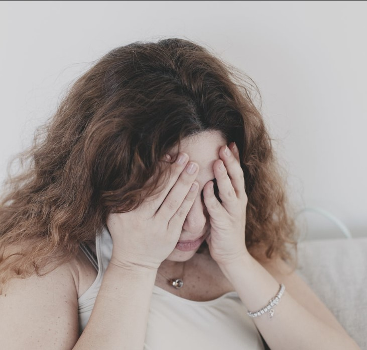

This article has been written and researched by our expert Loveable through a precise methodology. [Learn more about our methodology](https://avada.io/loveable/our-methodological.html)

[Loveable](https://avada.io/loveable/) > [Blog](https://avada.io/loveable/blog/) > [Relationship](https://avada.io/loveable/relationship/)

# 21 Characteristics Of a Cheating Woman

Written by [Luna Miller](https://avada.io/loveable/author/luna/) Last Updated on August 22, 2023

- [Who Cheats More: Men or Women?](https://avada.io/loveable/blog/characteristics-of-cheating-woman/#wp-block-heading-2-4)
- [10 Possible Reasons Why Women Cheat](https://avada.io/loveable/blog/characteristics-of-cheating-woman/#wp-block-heading-2-7) 
    - [When You Don’t Spend Time With Her](https://avada.io/loveable/blog/characteristics-of-cheating-woman/#wp-block-heading-3-8)
    - [Sexually Motivated](https://avada.io/loveable/blog/characteristics-of-cheating-woman/#wp-block-heading-3-11)
    - [Maybe She Met Someone That Her Feel Extra Special](https://avada.io/loveable/blog/characteristics-of-cheating-woman/#wp-block-heading-3-14) 
    - [Money Is A Big Deal With Your Women](https://avada.io/loveable/blog/characteristics-of-cheating-woman/#wp-block-heading-3-16)
    - [Your Woman Feel Unsatisfied In The Relationship](https://avada.io/loveable/blog/characteristics-of-cheating-woman/#wp-block-heading-3-20)
    - [Your Woman May Cheat If She Has A Chance](https://avada.io/loveable/blog/characteristics-of-cheating-woman/#wp-block-heading-3-22) 
    - [She is the victim in your relationship](https://avada.io/loveable/blog/characteristics-of-cheating-woman/#wp-block-heading-3-25) 
    - [Midlife Crisis](https://avada.io/loveable/blog/characteristics-of-cheating-woman/#wp-block-heading-3-29)
    - [Low self-esteem](https://avada.io/loveable/blog/characteristics-of-cheating-woman/#wp-block-heading-3-32)
    - [Cheating As A Revenge](https://avada.io/loveable/blog/characteristics-of-cheating-woman/#wp-block-heading-3-36) 
- [21 Characteristics Of A Cheating Woman](https://avada.io/loveable/blog/characteristics-of-cheating-woman/#wp-block-heading-2-40)
    - [She Spends Less Time With You](https://avada.io/loveable/blog/characteristics-of-cheating-woman/#wp-block-heading-3-41) 
    - [She Avoids Confrontation](https://avada.io/loveable/blog/characteristics-of-cheating-woman/#wp-block-heading-3-43) 
    - [She Communicates With You Less](https://avada.io/loveable/blog/characteristics-of-cheating-woman/#wp-block-heading-3-46) 
    - [Change In Sexual Habits](https://avada.io/loveable/blog/characteristics-of-cheating-woman/#wp-block-heading-3-48) 
    - [She Is Always Busy](https://avada.io/loveable/blog/characteristics-of-cheating-woman/#wp-block-heading-3-52)
    - [She Shows Signs Of Lying](https://avada.io/loveable/blog/characteristics-of-cheating-woman/#wp-block-heading-3-54)
    - [She Is A Narcissist](https://avada.io/loveable/blog/characteristics-of-cheating-woman/#wp-block-heading-3-56)
    - [She Cares More About Her Appearance](https://avada.io/loveable/blog/characteristics-of-cheating-woman/#wp-block-heading-3-59) 
    - [She Gets Startled Every Time You Try To Touch Her Phone](https://avada.io/loveable/blog/characteristics-of-cheating-woman/#wp-block-heading-3-61)
    - [She Finds A Way To Argue With You Even The Smallest Thing](https://avada.io/loveable/blog/characteristics-of-cheating-woman/#wp-block-heading-3-64)
    - [She Values ​​Her Private Space More Than Before](https://avada.io/loveable/blog/characteristics-of-cheating-woman/#wp-block-heading-3-66)
    - [Sometimes Cheating Woman Afraid Of Divorce](https://avada.io/loveable/blog/characteristics-of-cheating-woman/#wp-block-heading-3-69) 
    - [Cheating Women Has Low Self-Esteem](https://avada.io/loveable/blog/characteristics-of-cheating-woman/#wp-block-heading-3-71) 
    - [She Is Emotionally Unavailable](https://avada.io/loveable/blog/characteristics-of-cheating-woman/#wp-block-heading-3-74) 
    - [She Breaks The Family Rules](https://avada.io/loveable/blog/characteristics-of-cheating-woman/#wp-block-heading-3-77) 
    - [The Repentant](https://avada.io/loveable/blog/characteristics-of-cheating-woman/#wp-block-heading-3-79)
    - [She Stops Sharing Her Social Life With You](https://avada.io/loveable/blog/characteristics-of-cheating-woman/#wp-block-heading-3-81) 
    - [She Acts As A Victim](https://avada.io/loveable/blog/characteristics-of-cheating-woman/#wp-block-heading-3-84)
    - [She Has Commitment Issues](https://avada.io/loveable/blog/characteristics-of-cheating-woman/#wp-block-heading-3-86)
    - [Sometimes Her Mood Is Inexplicably Good](https://avada.io/loveable/blog/characteristics-of-cheating-woman/#wp-block-heading-3-88)
    - [Unusual Body Language](https://avada.io/loveable/blog/characteristics-of-cheating-woman/#wp-block-heading-3-91)
- [Final Thoughts](https://avada.io/loveable/blog/characteristics-of-cheating-woman/#wp-block-heading-2-94)

The love story in real life is not as rosy as in the movie. Even when you think you’ve met the woman of your life, you discover she’s showing signs of infidelity. I know it’s unacceptable, but sometimes you have to face it!

Cheating is a painful reality that affects many relationships. While it is commonly thought of as a behavior associated with men, the truth is that women are also capable of cheating. In fact, some studies suggest that the rate of infidelity among women has been on the rise in recent years. Certain characteristics may indicate a woman is more likely to cheat on her partner, and being aware of these signs can help you make better decisions when it comes to relationships. 

In this context, we will explore **25 characteristics of a cheating woman**, ranging from behavioral patterns to personality traits, and provide insights into what you can do if you suspect your partner may be unfaithful.

## Who Cheats More: Men or Women?

Who Cheats More: Men or Women?

A study has shown that men are more likely to cheat on their partners than married women. 20% of men cheat on their partners, while only 13% of women cheat on their partners while married. The study also reveals that women between the ages of 18-29 are more likely to cheat, whereas, for men, the percentage remains higher from age 30 to 80+. Demographic and social factors also play a significant role in cheating. However, regardless of gender, those who have cheated possess the traits of a cheater and are likely to continue doing so in the future. While reading about the characteristics of cheating women may help understand a female cheater, it is crucial to remember that people cheat for various reasons.

## 10 Possible Reasons Why Women Cheat 

### **When You Don’t Spend Time With Her**

Women require emotional intimacy and non-sexual affection in a relationship, and if their partner is too preoccupied with other things, they may feel neglected. This could lead them to seek emotional support from someone else.

Therefore, it is crucial to prioritize spending time with your partner and making them feel valued. A good practice is to set aside a specific evening every week solely for each other, similar to a date night. This dedicated time together can strengthen your emotional connection and prevent the risk of infidelity.

### **Sexually Motivated**

**Sexually Motivated**

In order to maintain their primary partnerships, some women have resorted to seeking sexual pleasure outside of their relationships. This is because they feared that if their sexual needs continued to go unfulfilled, they would dissolve their families and cause heartbreak for their partners. It’s important to note that none of these women made the decision to engage in infidelity lightly. After years, and sometimes decades, of attempting to address issues in their marriages, they ultimately made the difficult decision to seek fulfillment elsewhere.

### **Maybe She Met Someone That Her Feel Extra Special** 

Women are always very sensitive. They follow the call of their heart. Maybe they ran into a man with a strange hobby or fell in love with another man who made them feel very familiar. In this case, she doesn’t really out of love with you. It just means she wants to find a new feeling with another man. In addition, a woman’s attention from an affair lover is said to make her feel desirable and desired regardless of her husband’s actions at home.

### **Money Is A Big Deal With Your Women**

**Money Is A Big Deal With Your Women**

Does your partner genuinely love you, or are they just interested in your wealth? What motivates married women to engage in infidelity? Unfortunately, some women prioritize financial gain and material pleasures over emotional connections in relationships. This can lead to infidelity, making it a common reason for married women to cheat.

Holding onto a woman who prioritizes money over emotional intimacy is futile, as these tendencies often lead to ongoing infidelity. There will always be individuals with more wealth, and these people are likely to continue seeking out such relationships.

### **Your Woman Feel Unsatisfied In The Relationship**

It is crucial to note that not all women who cheat are attempting to salvage their primary partnership. In some cases, infidelity may be a way for women to break free from relationships that make them feel confined. These women may find themselves with a partner who, although seemingly pleasant, may exhibit controlling, suffocating, or emotionally distant behavior. Despite making efforts to improve the relationship by suggesting couples therapy or encouraging their partner’s growth, the woman may feel unsuccessful in her attempts. In such situations, infidelity may serve as a catalyst for their partner to initiate the breakup.

### **Your Woman May Cheat If She Has A Chance** 

**Your Woman May Cheat If She Has A Chance** 

If you’re a busy man who doesn’t have time for her or often leaves your wife home alone, you’re giving your significant other a chance to have an affair. After all, no one wants to be lonely, especially women; they always need someone by their side to protect and share with them. If you continue like this, you are the one to blame; you should spend more time with her. 

### **She is the victim in your relationship** 

One of the most frequently observed characteristics of a woman who cheats is that she feels unfairly treated in her relationship. Many women believe they have compromised too much of their individuality and aspirations to maintain their partner’s happiness. While they may not actively seek a new partner, they may be open to men who offer support and empathy.

Women who fall into this category often resist the temptation to cheat but ultimately yield to their desires depending on the quality of their current relationship, particularly if their partner habitually overlooks their needs. When questioning why women cheat on their boyfriends, it is often due to their boyfriends being inconsiderate.

These women represent the most common types of cheaters. Some women are not suited for monogamy due to their personalities, but the majority cheat because they are dissatisfied with their current partner. It is that straightforward. If you keep a woman happy, unless she is one of those who value freedom above all else, she will remain loyal to the relationship.

### **Midlife Crisis**

**Midlife Crisis**

Although midlife crises are typically associated with people aged 35 to 60, they are often triggered by external factors rather than age. Women, for instance, may experience a midlife crisis due to significant life events, such as the passing of a parent or reaching a milestone age. Societal expectations that women are capable of and expected to achieve great success in all aspects of life, including a flourishing career, a loving partner, and children, can also be a trigger. As Skurtu notes, individuals may feel as though time is running out and may act in ways that are out of character to realize their potential and make up for the lost time.

### **Low self-esteem**

According to psychologist Margaret Paul, Ph.D., low self-esteem may lead to seeking validation from external sources. This may be especially true if the person is not receiving validation from their current partner. However, Paul emphasizes that the lack of self-love can ultimately drive someone to cheat.

Paul explains that, in her experience, people tend to cheat when they fail to take responsibility for their own emotions and needs. They may struggle to advocate for themselves in their current relationship, leading to a sense of self-abandonment and a need for external validation.

Therefore, Paul suggests that instances of cheating or affairs may not be solely about the attention someone receives from another person but rather about the attention they are not giving themselves.

### **Cheating As A Revenge** 

**Cheating As A Revenge** 

When a person’s self-esteem is lowered, they will take revenge. A woman, when she finds out you have an affair (or at least she thinks so), will cheat on you as a warning. Some women talk seriously about the relationship, while others will quietly destroy it if they feel their partner is unfaithful.

**_Related_**: [How to Be A Better Lover](https://avada.io/loveable/how-to-be-a-better-lover/) | The Guide to Cement Your Affections

## 21 Characteristics Of A Cheating Woman

### **She Spends Less Time With You** 

In the early days of your marriage, your wife was likely your most trusted confidante, and the two of you may have enjoyed a variety of activities together. You may have gone to movies or sporting events that weren’t necessarily your cup of tea just to spend time with each other. However, physical infidelity often stems from emotional detachment or mental separation. While it’s normal for partners to experience a decrease in interest in spending time together, intentional avoidance of each other is a red flag. If your wife is emotionally distant and spending less time with you, it could be an indication that she is cheating.

### **She Avoids Confrontation** 

**She Avoids Confrontation** 

A woman who is engaging in infidelity might exhibit a tendency to shy away from direct confrontation and instead rely on more nuanced tactics. When confronted about her deceitful behavior, such as fabrications or suspicious phone messages, she may try to deflect the conversation or offer vague and evasive replies whenever feasible.

### **She Communicates With You Less** 

If a woman thinks she can’t connect with her partner, the bond between them will weaken over time if it isn’t taken care of. Couple therapy is one way to fix this before it’s too late. Read this BetterHelp review to learn more. When a woman loses touch with a person she cares about, she looks for someone else to talk to and comfort her.

### **Change In Sexual Habits** 

**Change In Sexual Habits** 

One of the most important signs that a woman is cheating is a sudden or unusually strong desire for sex. Since the person she’s engaged in an affair with makes her feel sexier, she can now show her boyfriend more sexual desire than before. Another idea is that a woman who has been unfaithful showers her current partner with love out of guilt. 

On the other hand, a woman who is cheating might not need more physical contact because she is getting what she needs from other places. Infidelity cue research by T. Dr. Shackelford and Mr. Buss expands on these points by pointing out other important signs of extramarital encounters. Some of these are changes in sexual behavior, showing too much love, and sexual boredom. Look for more signs that your wife is having an affair.

### **She Is Always Busy**

When your wife or girlfriend doesn’t seem to care about you, that’s never a good sign. Unlike men who cheat, women who cheat usually don’t want to keep two partners together. Instead, they will stop caring about one and put all of their time and energy into the other. If your girlfriend is cheating, her plans may change all of a sudden. If you can’t take her out without telling her ahead of time, this could be a sign that your woman is seeing someone else.

### **She Shows Signs Of Lying**

Have you noticed that your partner has been lying to you a lot lately? Is this something that has never happened? If your woman is cheating on you, there is a chance that you will catch them lying often. These lies could be a way for them to hide the fact that they betrayed each other while making their affair easier.

### **She Is A Narcissist**

**She Is A Narcissist**

Throughout the length of a committed relationship, narcissistic women have high tendency to cheat, according to studies. Marriage to a narcissist can be challenging enough without adding the stress of infidelity to the mix. Yet, in terms of personal characteristics, they were born dishonest. A cheating woman believes she is entitled to “have it all” since her primary goal in life is to make herself happy. Cheating women are looking for instant gratification. They don’t see people finding out about their affair as a huge deal. Therefore, they don’t bother trying to disguise it.

### **She Cares More About Her Appearance** 

Your woman’s increased focus on her appearance could be a sign that she’s cheating on you. Moreover, she may begin adopting more stereotypically feminine or sexually provocative attire. Instead of wearing normal jeans, she dresses up in skirts, tops, and shoes. Certainly, a change in her sense of style isn’t the most conclusive sign that she’s cheating on you. And if she gets dolled up and goes out without her husband, she might try to woo another suitor.

### **She Gets Startled Every Time You Try To Touch Her Phone**

**She Gets Startled Every Time You Try To Touch Her Phone**

If you suspect that your wife may be cheating, there are several signs you can look out for. One clear indication is if she jumps up to answer her phone before you can see who is calling. Another sign is if she suddenly starts password-protecting her phone, including individual apps like WhatsApp, which she has never used before. It may be a red flag if she acts jumpy when you tend to touch her phone and is hesitant to lend it to you even for a few minutes. A person who is cheating may be afraid to share their phone, even for something as trivial as taking a photo. Keep an eye on her body language; if she becomes too unsettled, it may be a sign of cheating that you cannot ignore.

### **She Finds A Way To Argue With You Even The Smallest Thing**

If your wife starts nagging you about small and insignificant things, it could be a sign that something is wrong in your marriage. She may be looking for excuses to fight with you. This behavior could be due to anger towards you for something else, or she may be trying to justify an affair. You may also notice that you are picking fights that suggest your wife is falling out of love with you. These fights may be her way of convincing herself that the marriage is not working out. According to relationship expert Swaty, it’s not uncommon for partners to find faults in each other after the honeymoon phase is over. However, if there is someone new in your spouse’s life, their patience threshold may decrease, and they may become easily irritated with you, even with things they found cute in the past.

### **She Values ​​Her Private Space More Than Before**

**She Values ​​Her Private Space More Than Before**

If you think that your partner may be cheating, one of the most obvious signs is an increased need for privacy. Watch out for your partner being more secretive with their technology, as they may be using their phone to cheat. They can easily add a new contact under a fake name or hide dating apps from sight. Signs of infidelity could include leaving the room or go outside when taking a phone call, being overly possessive of their phone, and frequently deleting history on their devices. If your partner is not as open with their devices as they used to be, it could be a strong indication that they are hiding something from you and that they may be cheating.

### **Sometimes Cheating Woman Afraid Of Divorce** 

When a woman is unfaithful, she may exhibit a great fear of separation. Even if she is tired of her partner or their relationship, she may not want to end it. For some women, cheating is a way to fulfill their emotional and sexual desires without having to leave their current partner.

### **Cheating Women Has Low Self-Esteem** 

It is a common psychological trait for cheating women to require external validation of their worth. Seeking confirmation is a normal human instinct, but it is essential to keep things in perspective. Women who cheat may seek validation on a daily basis, and studies have shown that seeking external validation can help those who do not receive constant affirmation of their value from others to avoid depression and stress. If a woman cannot count on her current partner for support, she may look for validation in other places. However, the joy a cheating woman experiences are often short-lived and based on the approval of other men.

### **She Is Emotionally Unavailable** 

Studies into the mental characteristics of a woman who cheats reveal that the most notable signs are a lack of empathy, respect, and indifference to her partner’s emotional state. A faithful woman would be interested in her partner’s day and any challenges they may face at work, while a cheating woman may show no interest. A cheating woman no longer has an emotional connection with her partner and therefore has no motivation to share her true feelings with them. When a partner strays, it’s not uncommon for the couple to stop showing affection or engaging in intimate interactions.

### **She Breaks The Family Rules** 

Frequent disregard for rules may be a sign of infidelity in your significant other. A woman who is cheating may enjoy being sneaky and breaking the basic agreements of the relationship.

### **The Repentant**

While some women may have a natural rebellious streak, they often learn to control their impulses as they mature. They strive to live up to societal expectations and maintain a certain image. However, external factors such as stress or alcohol consumption can cause a temporary lapse in judgment, causing them to revert to their original nature. This behavior is not a common characteristic of cheaters, and they often feel remorseful afterward.

### **She Stops Sharing Her Social Life With You** 

Sharing and emotional investment are intertwined. Our life experiences often lead us to seek someone to share them with. However, a woman who is cheating may lead a separate life that doesn’t involve her partner. She may not communicate as much as before, delay or avoid responding to texts and ignore phone calls.

### **She Acts As A Victim**

Feeling unsatisfied and unfairly treated can be a precursor to cheating. If your partner frequently expresses dissatisfaction and feels mistreated, it is essential to address the issue promptly. Failure to do so may create a reason for your partner to leave or, in some cases, cheat on you.

### **She Has Commitment Issues**

Some women may have a fear of commitment, and unless addressed, it can hinder their ability to maintain a healthy relationship. If a person is committed to other aspects of their life, they are more likely to be committed to their partner as well. Commitment is a skill that can be developed by practicing it in various areas of life, such as projects, goals, plans, exercise routines, and relationships.

### **Sometimes Her Mood Is Inexplicably Good**

If your partner is consistently in a good mood without a clear explanation, it could be a sign of cheating. If you inquire about the reason for their happiness, they may provide a dishonest or evasive response.

### **Unusual Body Language**

When attempting to avoid you, a person may create not only emotional but also physical distance. For instance, if your partner used to greet you with a hug when you came home from work, they may now only acknowledge you from afar. Furthermore, they may avoid making eye contact, turn their body away from you, and exhibit signs of nervousness when you ask questions that could reveal their hidden behavior.

**_Related_**: 21 Signs That You’re In [A Loveless Marriage](https://avada.io/loveable/loveless-marriage/) And How To Reverse It!

## Final Thoughts

Cheating in romantic relationships is a complex issue that affects both men and women. While men cheat more frequently, women also engage in infidelity, often due to dissatisfaction in their current relationship. The article highlights **21 characteristics of cheating women**, including self-focus, insecurity, and reckless behavior. However, it is important to note that these traits are not definitive indicators of infidelity, and infidelity is not a one-size-fits-all issue. Addressing the underlying issues in a relationship is crucial to prevent cheating and to maintain a healthy and happy partnership.

- [Who Cheats More: Men or Women?](https://avada.io/loveable/blog/characteristics-of-cheating-woman/#wp-block-heading-2-4)
- [10 Possible Reasons Why Women Cheat](https://avada.io/loveable/blog/characteristics-of-cheating-woman/#wp-block-heading-2-7) 
    - [When You Don’t Spend Time With Her](https://avada.io/loveable/blog/characteristics-of-cheating-woman/#wp-block-heading-3-8)
    - [Sexually Motivated](https://avada.io/loveable/blog/characteristics-of-cheating-woman/#wp-block-heading-3-11)
    - [Maybe She Met Someone That Her Feel Extra Special](https://avada.io/loveable/blog/characteristics-of-cheating-woman/#wp-block-heading-3-14) 
    - [Money Is A Big Deal With Your Women](https://avada.io/loveable/blog/characteristics-of-cheating-woman/#wp-block-heading-3-16)
    - [Your Woman Feel Unsatisfied In The Relationship](https://avada.io/loveable/blog/characteristics-of-cheating-woman/#wp-block-heading-3-20)
    - [Your Woman May Cheat If She Has A Chance](https://avada.io/loveable/blog/characteristics-of-cheating-woman/#wp-block-heading-3-22) 
    - [She is the victim in your relationship](https://avada.io/loveable/blog/characteristics-of-cheating-woman/#wp-block-heading-3-25) 
    - [Midlife Crisis](https://avada.io/loveable/blog/characteristics-of-cheating-woman/#wp-block-heading-3-29)
    - [Low self-esteem](https://avada.io/loveable/blog/characteristics-of-cheating-woman/#wp-block-heading-3-32)
    - [Cheating As A Revenge](https://avada.io/loveable/blog/characteristics-of-cheating-woman/#wp-block-heading-3-36) 
- [21 Characteristics Of A Cheating Woman](https://avada.io/loveable/blog/characteristics-of-cheating-woman/#wp-block-heading-2-40)
    - [She Spends Less Time With You](https://avada.io/loveable/blog/characteristics-of-cheating-woman/#wp-block-heading-3-41) 
    - [She Avoids Confrontation](https://avada.io/loveable/blog/characteristics-of-cheating-woman/#wp-block-heading-3-43) 
    - [She Communicates With You Less](https://avada.io/loveable/blog/characteristics-of-cheating-woman/#wp-block-heading-3-46) 
    - [Change In Sexual Habits](https://avada.io/loveable/blog/characteristics-of-cheating-woman/#wp-block-heading-3-48) 
    - [She Is Always Busy](https://avada.io/loveable/blog/characteristics-of-cheating-woman/#wp-block-heading-3-52)
    - [She Shows Signs Of Lying](https://avada.io/loveable/blog/characteristics-of-cheating-woman/#wp-block-heading-3-54)
    - [She Is A Narcissist](https://avada.io/loveable/blog/characteristics-of-cheating-woman/#wp-block-heading-3-56)
    - [She Cares More About Her Appearance](https://avada.io/loveable/blog/characteristics-of-cheating-woman/#wp-block-heading-3-59) 
    - [She Gets Startled Every Time You Try To Touch Her Phone](https://avada.io/loveable/blog/characteristics-of-cheating-woman/#wp-block-heading-3-61)
    - [She Finds A Way To Argue With You Even The Smallest Thing](https://avada.io/loveable/blog/characteristics-of-cheating-woman/#wp-block-heading-3-64)
    - [She Values ​​Her Private Space More Than Before](https://avada.io/loveable/blog/characteristics-of-cheating-woman/#wp-block-heading-3-66)
    - [Sometimes Cheating Woman Afraid Of Divorce](https://avada.io/loveable/blog/characteristics-of-cheating-woman/#wp-block-heading-3-69) 
    - [Cheating Women Has Low Self-Esteem](https://avada.io/loveable/blog/characteristics-of-cheating-woman/#wp-block-heading-3-71) 
    - [She Is Emotionally Unavailable](https://avada.io/loveable/blog/characteristics-of-cheating-woman/#wp-block-heading-3-74) 
    - [She Breaks The Family Rules](https://avada.io/loveable/blog/characteristics-of-cheating-woman/#wp-block-heading-3-77) 
    - [The Repentant](https://avada.io/loveable/blog/characteristics-of-cheating-woman/#wp-block-heading-3-79)
    - [She Stops Sharing Her Social Life With You](https://avada.io/loveable/blog/characteristics-of-cheating-woman/#wp-block-heading-3-81) 
    - [She Acts As A Victim](https://avada.io/loveable/blog/characteristics-of-cheating-woman/#wp-block-heading-3-84)
    - [She Has Commitment Issues](https://avada.io/loveable/blog/characteristics-of-cheating-woman/#wp-block-heading-3-86)
    - [Sometimes Her Mood Is Inexplicably Good](https://avada.io/loveable/blog/characteristics-of-cheating-woman/#wp-block-heading-3-88)
    - [Unusual Body Language](https://avada.io/loveable/blog/characteristics-of-cheating-woman/#wp-block-heading-3-91)
- [Final Thoughts](https://avada.io/loveable/blog/characteristics-of-cheating-woman/#wp-block-heading-2-94)

### [Luna Miller](https://avada.io/loveable/author/luna/)

I'm Luna Miller, a helpful employee at Loveable. I excel at giving great advice on birthday gifts. I love suggesting memorable experiences like concerts, spas, and getaways. As a reliable and supportive colleague, I'm always there to assist.

- [Twitter](https://twitter.com/intent/tweet)
- [Facebook](https://www.facebook.com/sharer/sharer.php)
- [instagram](https://avada.io/loveable/blog/characteristics-of-cheating-woman/)
- [pinterest](https://www.pinterest.com/loveablellc/)

## Related Posts

[

### 35 Unforgettable Exciting Adult Birthday Party Ideas

](https://avada.io/loveable/blog/adult-birthday-party-ideas/)

[

### 42 Best 21st Birthday Outfits to Rock the Party

](https://avada.io/loveable/blog/21st-birthday-outfits/)

[

### 50+ Happy 40th Anniversary Quotes, Messages, and Wishes

](https://avada.io/loveable/blog/happy-40th-anniversary-quotes/)

[

### 100+ Heartwarming Happy 30th Anniversary Quotes, Messages, and Wishes

](https://avada.io/loveable/blog/happy-30th-anniversary-quotes/)

[

### 120+ Heartfelt Thank You Messages for The Birthday Wishes

](https://avada.io/loveable/blog/thank-you-messages-birthday-wishes/)
