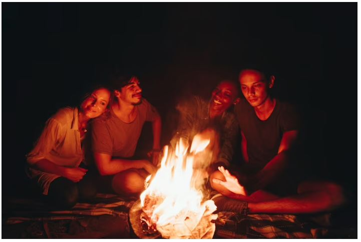
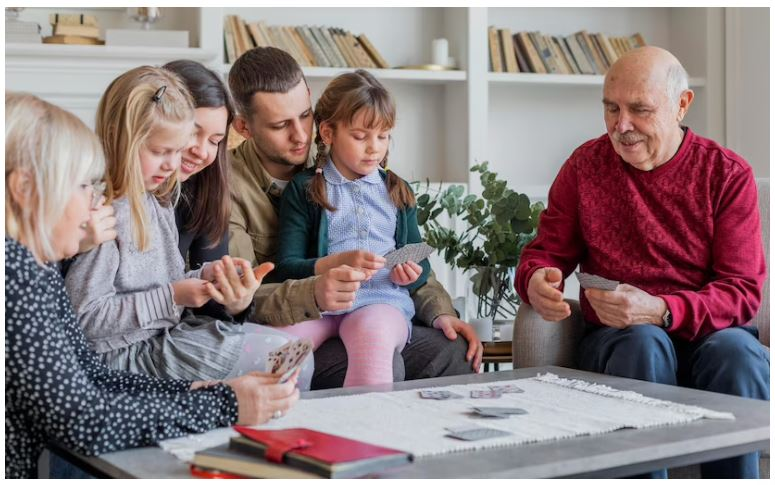
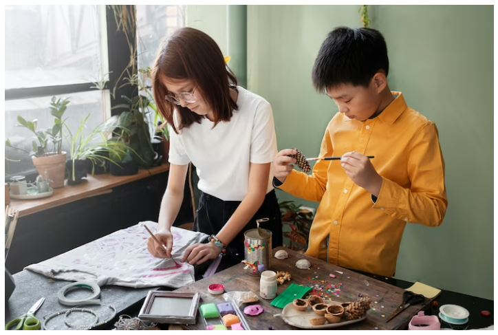
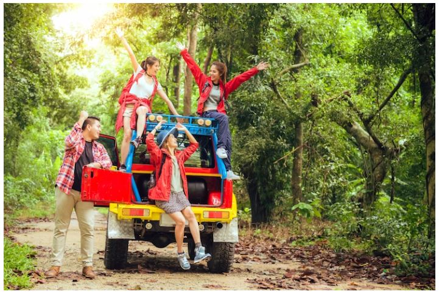
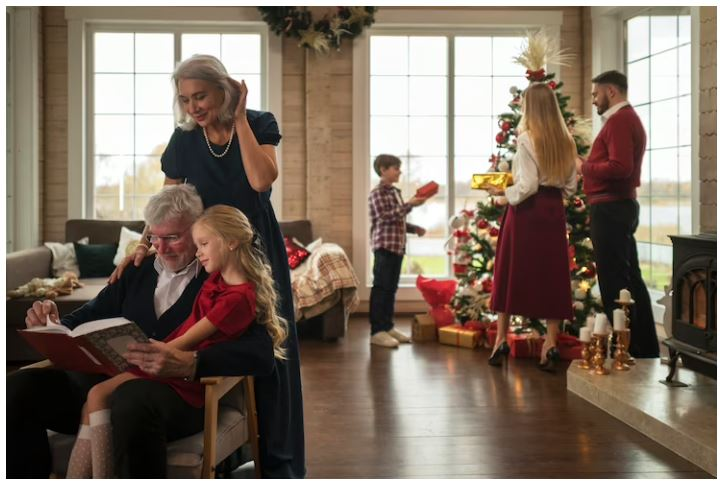
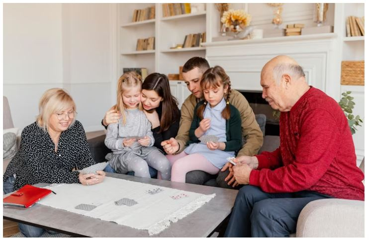

This article has been written and researched by our expert Loveable through a precise methodology. [Learn more about our methodology](https://avada.io/loveable/our-methodological.html)

[Loveable](https://avada.io/loveable/) > [Blog](https://avada.io/loveable/blog/) > [Family](https://avada.io/loveable/family/)

# 21 Fun and Creative Family Reunion Activities for All Ages

Written by [Rose Bryne](https://avada.io/loveable/author/rose/) Last Updated on August 25, 2023

- [21 Thoughtful Family Reunion Activities for All Ages](https://avada.io/loveable/blog/family-reunion-activities/#wp-block-heading-2-3)
    - [Keep Memories in the Photos](https://avada.io/loveable/blog/family-reunion-activities/#wp-block-heading-3-5) 
    - [Campfire Stories](https://avada.io/loveable/blog/family-reunion-activities/#wp-block-heading-3-7)
    - [Exchange Heartfelt Gifts](https://avada.io/loveable/blog/family-reunion-activities/#wp-block-heading-3-11)
    - [Create a Family Tree](https://avada.io/loveable/blog/family-reunion-activities/#wp-block-heading-3-14)
    - [Family Puzzles](https://avada.io/loveable/blog/family-reunion-activities/#wp-block-heading-3-18)
    - [Family Gifts Hunting](https://avada.io/loveable/blog/family-reunion-activities/#wp-block-heading-3-21)
    - [Family Feud](https://avada.io/loveable/blog/family-reunion-activities/#wp-block-heading-3-25)
    - [DIY Family Activities](https://avada.io/loveable/blog/family-reunion-activities/#wp-block-heading-3-29)
    - [Outdoor Movie Night](https://avada.io/loveable/blog/family-reunion-activities/#wp-block-heading-3-33)
    - [Travel to a Special Destination](https://avada.io/loveable/blog/family-reunion-activities/#wp-block-heading-3-37)
    - [Play Bingo Together](https://avada.io/loveable/blog/family-reunion-activities/#wp-block-heading-3-42) 
    - [Family Dance Party](https://avada.io/loveable/blog/family-reunion-activities/#wp-block-heading-3-46)
    - [Swap Stuff](https://avada.io/loveable/blog/family-reunion-activities/#wp-block-heading-3-50)
    - [Family Story](https://avada.io/loveable/blog/family-reunion-activities/#wp-block-heading-3-54)
    - [Family Award](https://avada.io/loveable/blog/family-reunion-activities/#wp-block-heading-3-59)
    - [Family Trivia](https://avada.io/loveable/blog/family-reunion-activities/#wp-block-heading-3-62)
    - [Message Cups](https://avada.io/loveable/blog/family-reunion-activities/#wp-block-heading-3-67)
    - [Famous Faces Tablecloth](https://avada.io/loveable/blog/family-reunion-activities/#wp-block-heading-3-70)
    - [Make a Reunion Video](https://avada.io/loveable/blog/family-reunion-activities/#wp-block-heading-3-74)
    - [Create a Favourite Family Music Playlist](https://avada.io/loveable/blog/family-reunion-activities/#wp-block-heading-3-77)
    - [Family Relay Races](https://avada.io/loveable/blog/family-reunion-activities/#wp-block-heading-3-81)
    - [Who Am I? – Family Game](https://avada.io/loveable/blog/family-reunion-activities/#wp-block-heading-3-83)
- [Bottom Line](https://avada.io/loveable/blog/family-reunion-activities/#wp-block-heading-2-88) 

Family reunions are a time for laughter, joy, and making memories with loved ones. It can be difficult to think of enjoyable and captivating activities that appeal to everyone. Whether you’re planning a reunion for a small or large group, there are plenty of activities that will keep everyone entertained, regardless of their age. 

From classic games like tug-of-war and scavenger hunts to more unique options like a family trivia night or a DIY photo booth, there’s something for everyone. Get ready to plan an unforgettable family reunion that will be remembered for ages by putting on your thinking cap and rolling up your sleeves. In this article, we’ll explore **21 fun and creative family reunion activities** that are sure to bring a smile to everyone’s face.

## **21 Thoughtful Family Reunion Activities for All Ages**

### **Keep Memories in the Photos** 

There are various activities to make a family gathering memorable, but one idea that shouldn’t be overlooked is a photo shoot. By preparing some props and coordinating a color code beforehand, you can create unforgettable pictures that everyone will cherish.

### **Campfire Stories**

Family reunions are always a great opportunity to strengthen the bond among family members. The gathering of loved ones is a perfect occasion to create new memories, share stories, and reminisce about the old times. One of the most exciting family reunion activities that you can organize is to ask each person at the dinner table to narrate a memory about another family member. 

More interestingly, you can encourage everyone to message each other before the reunion to dig out some of their most cherished tales from their treasure chest of memories. With this activity, you’ll surely have an unforgettable time with your loved ones!

### **Exchange Heartfelt Gifts**

Family reunions are always a great chance to communicate with loved ones and bring new memories that will last a lifetime. One activity that can really help to bring everyone together and make the reunion even more special is exchanging heartfelt gifts. 

Whether it’s a handmade keepsake or a special item that holds personal meaning, giving and receiving gifts are sure to add an extra element of excitement and joy to your family reunion. So why not get everyone involved and make this a new tradition for your next family gathering? It’s sure to be a hit with all generations!

### **Create a Family Tree**

Creating a [family tree](https://avada.io/loveable/family-tree-gifts/) can be an incredibly exciting project! Not only will it provide a way to visually display the connections between different family members, but it can also be a chance to learn more about your family’s history. 

One way to get started is by asking everyone to bring old photographs to the next family reunion. Imagine how thrilling it would be to uncover pictures of the generations from which your family has descended! Not only will this project be enjoyable, but it will also be educational for the younger members of your family.

### **Family Puzzles**

Looking for some fun-filled family reunion activities? Why not try turning old family or reunion pictures into [puzzles](https://avada.io/loveable/gift-puzzle-lovers/)! This exciting activity not only lets you relive old memories but also creates new ones. 

One way to increase the fun factor is by dividing the participants into teams and conducting a timed game. Moreover, you can organize the game during the weekend when everyone is present and ask them to arrange the pieces. Get ready for a blast of excitement and laughter as you piece together your family history!

### **Family Gifts Hunting**

Treasure hunts are always a joyous occasion, and when it’s a family treasure hunt, the excitement reaches a new level! Imagine the thrill of racing against each other to solve clues that lead to famous family stories. It’s a chance to bond, have fun, and learn more about each other. 

And for the kids, a treasure hunt can help them understand their family’s history in a playful way. So gather your loved ones, make teams, and enjoy a day full of excitement!

### **Family Feud**

Get ready for a thrilling and exciting family activity that will have your whole family participating in a friendly feud! We all know that every family has a few feuds, but this one is sure to bring everyone together. 

So, gather around and divide your family members into teams of 4-6 people. Don’t worry, this is not your typical family feud, as we will be asking questions with at least four answers. The team that is quick and smart enough to give the most answers first will be awarded more points. 

With this exciting activity, you’ll not only have a great time together, but you’ll also improve your knowledge and bond as a family. So, let the games begin, and let’s see which team will come out on top!

### **DIY Family Activities**

After all the excitement and fun-filled moments during the reunion games, there’s no better way to wind down than with a [family DIY activity](https://www.goodhousekeeping.com/home/craft-ideas/g1389/diy-kids-activities/)! It’s the perfect way to bring everyone together while channeling your creative side. You can choose from several activities, such as making decoupage coasters or photo frames. 

And the best part? Once you’re done, you can exchange them as little return gifts, reminding each other of the amazing time spent together at the family reunion. So let’s get ready to unleash our inner artists and have a blast with a family DIY activity!

### **Outdoor Movie Night**

Why not host an outdoor movie night? Rent a projector and set up a cozy outdoor cinema on your lawn. 

Don’t forget to bring blankets, pillows, and snacks to make it extra comfortable. And if you want to take it up a notch, make it a potluck so everyone can contribute their own delicious treats. 

Furthermore, you can easily pull this off while socially distanced. Spread out your seating arrangements and enjoy a movie under the stars while staying safe. If you can’t have everyone over, you can still take your movie night online via the ‘Netflix Party’ extension. Excited to host your own outdoor movie night? Get ready to have a blast!

### **Travel to a Special Destination**

Why not take the party on the road and host it in a location that offers endless fun for everyone? By choosing the right setting, you can create unforgettable memories that will last a lifetime. 

From amusement parks to zoos, the options are endless. So, pack your bags, book your accommodations, and get ready to bond over thrilling adventures.

**_Related_**: [26 Family Outdoor Activities to Enjoy Together](https://avada.io/loveable/family-outdoor-activities/)

### **Play Bingo Together** 

This interactive game is sure to get the whole family engaged and having a blast. With just some steps, you can print out bingo cards with quirky descriptions in each box, such as “has a tattoo” or “whose favorite food is sushi”. 

Once you have the cards ready, it’s time to start playing! As family members circulate around the room, they’ll be on the lookout for others who match the descriptions on their cards. When they find someone who fits, they can have them sign the box. 

The best part about reunion bingo is that it’s a great lesson to learn more about your family members. You might discover that your Aunt Sue has a secret talent for playing the guitar, or that your cousin Rachel is a huge fan of hiking. The game ends once everyone gets bingo, so make sure to keep playing until the very end. Get ready for an exciting and unique family reunion with reunion bingo!

### **Family Dance Party**

Why don’t consider dancing with abandon! With a little planning, you can turn your family hoedown into a night to remember. 

And don’t worry if you can’t gather in person – nowadays, thanks to technology, you can still hire a DJ to Zoom in and crank the tunes for your virtual ’80s revival night. So what are you waiting for? Get the music pumping, and let the dancing begin!

### **Swap Stuff**

If you’re looking for an activity to get rid of your old stuff, why not try hosting a SwapStuff party? It’s an awesome opportunity to gather with family and friends and exchange items you no longer need or want. 

Encourage everyone to bring their pre-loved belongings, from clothes to furniture and anything in between, and get ready for the ultimate round-robin. Interestingly, you might just obtain some treasures that you never even knew you wanted! 

And if you’re virtually inclined, you can still host a SwapStuff party online, simply have everyone showcase their items like Vanna White and turn it into an auction where the best reason for wanting a particular item wins. Exciting, right? So gather your friends and family and let the swapping begin!

### **Family Story**

Family Story Time is such a fun and exciting way to connect with your loved ones and share some quality time. One of the best parts of these gatherings is hearing all the hilarious and sometimes embarrassing stories about your family members. 

Children especially love hearing about their parents’ past experiences that they may not have known about before. To make this time even more special, have everyone bring an item to share that has sentimental value or is related to your family’s heritage. 

Whether it’s an antique instrument that your great-grandfather used to play or an old postcard, these items will surely spark some interesting stories and create lasting memories.

### **Family Award**

Looking for a fun and exciting family reunion activity? Why not create certificates to recognize your loved ones for all their unique qualities and quirks! With categories like “most contagious laugh,” “oldest and youngest family members,” “farthest distance traveled,” “loudest snorer,” “best hugger” and more, you’ll be able to celebrate everyone’s individuality and create unforgettable memories. 

Get ready for a night of happiness and love as you hand out these personalized certificates and show your family members just how much you appreciate them.

### **Family Trivia**

As the family reunion activity approaches, the excitement in the air is palpable. Everyone is keen on their loved ones and creating new memories. And what better way than by participating in a fun game that tests your family’s knowledge?

The game organizer must be diligent in their research, uncovering interesting tidbits and facts about family lore. Every detail matters, including the family member who won a basketball championship in 1965, Uncle Bob’s service in World War II, and the recent acceptance of someone into graduate school. 

This family reunion activity is sure to be a hit and with the game organizer’s attention to detail, everyone will have a chance to showcase their family knowledge and bond over shared experiences. 

### **Message Cups**

These [personalized cups](https://avada.io/loveable/personalized-cups/) are the perfect way to commemorate your time together and create lasting memories. You can inscribe your family’s famous saying or even a simple message like “Martin Family Reunion” and the year. 

Not only will they be a hit during mealtime, but they also make great keepsakes to take home with you. So why wait? Order your Message Cups today and get ready for a reunion like no other!

### **Famous Faces Tablecloth**

This fun and creative activity involves incorporating some of your favorite family photos into a custom-made tablecloth. 

By uploading your images to various photo sites, you can easily design and order your unique tablecloth to be shipped to you before the big reunion. And, the best part is that your guests will have a blast spotting their loved ones while they enjoy a meal together. So get ready to create a truly unforgettable experience that everyone in the family will love!

### **Make a Reunion Video**

Are you excited about the upcoming family reunion and want to capture all the beautiful moments in one place? Why not produce a reunion video? With a reunion video, you can relive all the fun and laughter anytime you want. 

You can get a personal way by including family reunion activities such as games, contests, and other exciting activities that everyone will enjoy. So, get ready to create a memorable keepsake that will last for years to come!

### **Create a Favourite Family Music Playlist**

One of the best family reunion activities is to create a music playlist that everyone can contribute to. You can easily share it digitally with all your family members! 

Encourage everyone to add their favorite songs from each era represented at the reunion. Don’t forget to also create CDs for the older family members who may not be tech-savvy. 

### **Family Relay Races**

These exciting and engaging activities are the perfect way to bond with loved ones while fostering team spirit and friendly competition. Take your pick from classic games like egg or sack races, or venture into uncharted territory with a unique twist, like a corn-on-the-cob eating relay. With family relay races, you’re sure to create memories that will last a lifetime.

### **Who Am I? – Family Game**

Are you looking for some exciting family reunion activities to make the day more memorable? One such activity that can add to the fun is “Who Am I?” game. This game is not only engaging but also a great way to bond with distant family members. 

The game involves placing the names of each person at the reunion into a hat and randomly drawing a name to tape to someone else’s forehead. Participants are required to ask questions with only “yes” or “no” as answers to discover the identity of the person they have become. The questions will be asked around the room.

**_Related_**: [25 Best Road Trip Games to Play in The Car Family](https://avada.io/loveable/road-trip-games-play-in-car/)

## **Bottom Line** 

**A Family Reunion** is a big deal for many people. While this doesn’t mean you have to take the conventional approach to planning and organizing, it does mean that you need to do something special. And, as with any holiday, that special something can often be the best part!

You may be thinking, “If only we could plan huge family reunion activities that would keep everyone entertained for hours on end. But, there’s no way our lives and schedules would ever allow this.” Well, you’re right. Such a fun-filled event is not possible, but it doesn’t mean you can’t pull off something just as fun, but completely different!

- [21 Thoughtful Family Reunion Activities for All Ages](https://avada.io/loveable/blog/family-reunion-activities/#wp-block-heading-2-3)
    - [Keep Memories in the Photos](https://avada.io/loveable/blog/family-reunion-activities/#wp-block-heading-3-5) 
    - [Campfire Stories](https://avada.io/loveable/blog/family-reunion-activities/#wp-block-heading-3-7)
    - [Exchange Heartfelt Gifts](https://avada.io/loveable/blog/family-reunion-activities/#wp-block-heading-3-11)
    - [Create a Family Tree](https://avada.io/loveable/blog/family-reunion-activities/#wp-block-heading-3-14)
    - [Family Puzzles](https://avada.io/loveable/blog/family-reunion-activities/#wp-block-heading-3-18)
    - [Family Gifts Hunting](https://avada.io/loveable/blog/family-reunion-activities/#wp-block-heading-3-21)
    - [Family Feud](https://avada.io/loveable/blog/family-reunion-activities/#wp-block-heading-3-25)
    - [DIY Family Activities](https://avada.io/loveable/blog/family-reunion-activities/#wp-block-heading-3-29)
    - [Outdoor Movie Night](https://avada.io/loveable/blog/family-reunion-activities/#wp-block-heading-3-33)
    - [Travel to a Special Destination](https://avada.io/loveable/blog/family-reunion-activities/#wp-block-heading-3-37)
    - [Play Bingo Together](https://avada.io/loveable/blog/family-reunion-activities/#wp-block-heading-3-42) 
    - [Family Dance Party](https://avada.io/loveable/blog/family-reunion-activities/#wp-block-heading-3-46)
    - [Swap Stuff](https://avada.io/loveable/blog/family-reunion-activities/#wp-block-heading-3-50)
    - [Family Story](https://avada.io/loveable/blog/family-reunion-activities/#wp-block-heading-3-54)
    - [Family Award](https://avada.io/loveable/blog/family-reunion-activities/#wp-block-heading-3-59)
    - [Family Trivia](https://avada.io/loveable/blog/family-reunion-activities/#wp-block-heading-3-62)
    - [Message Cups](https://avada.io/loveable/blog/family-reunion-activities/#wp-block-heading-3-67)
    - [Famous Faces Tablecloth](https://avada.io/loveable/blog/family-reunion-activities/#wp-block-heading-3-70)
    - [Make a Reunion Video](https://avada.io/loveable/blog/family-reunion-activities/#wp-block-heading-3-74)
    - [Create a Favourite Family Music Playlist](https://avada.io/loveable/blog/family-reunion-activities/#wp-block-heading-3-77)
    - [Family Relay Races](https://avada.io/loveable/blog/family-reunion-activities/#wp-block-heading-3-81)
    - [Who Am I? – Family Game](https://avada.io/loveable/blog/family-reunion-activities/#wp-block-heading-3-83)
- [Bottom Line](https://avada.io/loveable/blog/family-reunion-activities/#wp-block-heading-2-88) 

### [Rose Bryne](https://avada.io/loveable/author/rose/)

Hi, I'm Rose! I love animals and spending time with kids. At Loveable, I help people find unique gifts for special occasions like Valentine's Day, housewarmings, and graduations. I enjoy finding gifts for kids, teens, and animal lovers that match their interests and personalities. Making gift-giving a pleasant experience is my priority. Let me assist you in finding the perfect gift!

- [Twitter](https://twitter.com/intent/tweet)
- [Facebook](https://www.facebook.com/sharer/sharer.php)
- [instagram](https://avada.io/loveable/blog/family-reunion-activities/)
- [pinterest](https://www.pinterest.com/loveablellc/)

## Related Posts

[### 30 Best 4 Year Old Birthday Party Ideas For A Memorable Celebration](https://avada.io/loveable/blog/4-year-old-birthday-party-ideas/) 

[

### 16th Birthday Party Ideas to Make an Unforgettable Day

](https://avada.io/loveable/blog/16th-birthday-party-ideas/)

[

### 150+ Inspirational Birthday Quotes to Spread Joy on Special Day

](https://avada.io/loveable/blog/inspirational-birthday-quotes/)

[

### 160+ Birthday Wishes for Wife to Express Eternal Love

](https://avada.io/loveable/blog/birthday-wishes-for-wife/)

[### 90+ Heart Touching Birthday Wishes for Niece to Make Her Day Extra Special](https://avada.io/loveable/blog/birthday-wishes-for-niece/)
