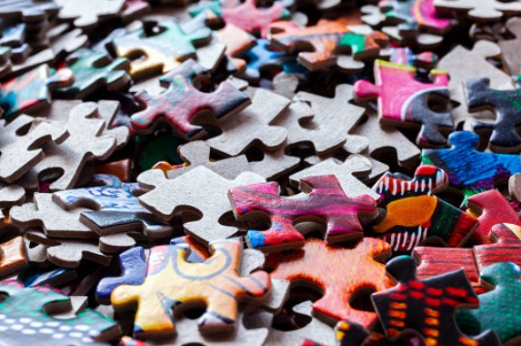

This article has been written and researched by our expert Loveable through a precise methodology. [Learn more about our methodology](https://avada.io/loveable/our-methodological.html)

[Loveable](https://avada.io/loveable/) > [Blog](https://avada.io/loveable/blog/) > [Family](https://avada.io/loveable/family/)

# 21 Fun and Engaging Memory Help Games | Improve Your Brainpower Today

Written by [Rose Bryne](https://avada.io/loveable/author/rose/) Last Updated on June 13, 2023

- [The Benefits Of Memory Help Games](https://avada.io/loveable/blog/memory-help-games/#wp-block-heading-2-3) 
- [6 Best Memory Help Games For All Ages](https://avada.io/loveable/blog/memory-help-games/#wp-block-heading-2-12) 
    - [1\. Chess](https://avada.io/loveable/blog/memory-help-games/#wp-block-heading-3-13)
    - [2\. Sudoku](https://avada.io/loveable/blog/memory-help-games/#wp-block-heading-3-16)
    - [3\. Crossword](https://avada.io/loveable/blog/memory-help-games/#wp-block-heading-3-18)
    - [4\. Jigsaw Puzzle](https://avada.io/loveable/blog/memory-help-games/#wp-block-heading-3-20) 
    - [5\. Concentration Games](https://avada.io/loveable/blog/memory-help-games/#wp-block-heading-3-23) 
    - [6\. Monopoly](https://avada.io/loveable/blog/memory-help-games/#wp-block-heading-3-25)
- [5 Short-Term Memory Games for Kids](https://avada.io/loveable/blog/memory-help-games/#wp-block-heading-2-27) 
    - [1\. Picture Bingo](https://avada.io/loveable/blog/memory-help-games/#wp-block-heading-3-28)
    - [2\. What’s Missing](https://avada.io/loveable/blog/memory-help-games/#wp-block-heading-3-31) 
    - [3\. Magic Cup](https://avada.io/loveable/blog/memory-help-games/#wp-block-heading-3-33) 
    - [4\. A Word From The Back](https://avada.io/loveable/blog/memory-help-games/#wp-block-heading-3-36) 
    - [5\. Number String](https://avada.io/loveable/blog/memory-help-games/#wp-block-heading-3-38) 
- [10 Fun Apps and Games to Help Improve Memory](https://avada.io/loveable/blog/memory-help-games/#wp-block-heading-2-40)
    - [1\. Elevate](https://avada.io/loveable/blog/memory-help-games/#wp-block-heading-3-42)
    - [2\. Braingle](https://avada.io/loveable/blog/memory-help-games/#wp-block-heading-3-44)
    - [3\. Clevermind](https://avada.io/loveable/blog/memory-help-games/#wp-block-heading-3-46)
    - [4\. Fit](https://avada.io/loveable/blog/memory-help-games/#wp-block-heading-3-48) 
    - [5\. Brain Trainer](https://avada.io/loveable/blog/memory-help-games/#wp-block-heading-3-50)
    - [6\. Brain Metrix](https://avada.io/loveable/blog/memory-help-games/#wp-block-heading-3-53)
    - [7\. Eidetic](https://avada.io/loveable/blog/memory-help-games/#wp-block-heading-3-55)
    - [8\. New York Times Crossword](https://avada.io/loveable/blog/memory-help-games/#wp-block-heading-3-57)
    - [9\. Mind Games](https://avada.io/loveable/blog/memory-help-games/#wp-block-heading-3-59)
    - [10\. Portrait Health Brain Teasers](https://avada.io/loveable/blog/memory-help-games/#wp-block-heading-3-62)
- [Bottom Line](https://avada.io/loveable/blog/memory-help-games/#wp-block-heading-2-64) 

A good memory helps us save and retrieve information, recognize individuals, and recall significant events. Therefore, you can know how it is important in life. However, as we age, our memory capacity declines, and we may find it difficult to recall simple things. Poor memory is not a normal thing, but it is considered a very serious disease that directly affects daily life.

Fortunately, there are many ways to improve memory, and one of the most effective is to play **memory-help games**. There are many various sorts of memory aid games available; whether you like playing alone or with others, a memory game is available to fit your tastes. These games can assist in improving cognitive function, attention span, and memory retention. Furthermore, memory aid games can be entertaining and engaging for children as well as adults. So, whether you want to improve your memory or simply have fun, these **memory-help games** are ideal.

## **The Benefits Of Memory Help Games** 

Certainly, they are types of games to help us improve memory span in simple and safe ways. Besides, they also provide you with an amazing time to play with your partners ( family, relatives, friends, etc.): 

- Improved performance since you can learn new knowledge more efficiently.
- Increased productivity as a result of having a strong working memory that helps you to properly remember and utilize knowledge
- Stress levels are reduced since you can simply and efficiently retain vital information.
- Improved decision-making abilities.
- Improved organization and memory for placing items

_**Check Out**_: [37 Best In Memory Of Gifts To Show Your Sympathy](https://avada.io/loveable/memory-gifts/)

## **6 Best Memory Help Games For All Ages** 

### **1\. Chess**

Chess is a popular game that has been shown to improve critical thinking and attention. It takes strategic thought, and players must consider many steps ahead. [Chess](https://avada.io/loveable/gifts-for-chess-lovers/) is an excellent technique to improve your memory since it challenges you to recall your opponent’s previous moves and predict their future ones. The game is loved by both the older and youth because of the high tactical requirements.

### **2\. Sudoku**

Sudoku is a famous puzzle game that requires players to employ problem-solving abilities and logical thinking because players must remember which numbers while working through the puzzle. It is known to improve concentration and memory. Sudoku can be played at many levels of difficulty, so it is easy to play for everyone.

### **3\. Crossword**

Crossword has been a traditional and familiar word puzzle game for a long time. To win, players fill in all of the squares with the proper letters, making words that cross at particular letters. It’s especially quite popular in education to attract learners and help them to remember vocabulary longer.

### **4\. Jigsaw Puzzle** 

This game is no new. It provides an excellent technique to exercise your brain. These [puzzles](https://avada.io/loveable/personalized-puzzles/) are made up of interlocking parts that fit together to form a whole picture. This game will take many your time and effort, but it will be very happy when you complete it. 

### **5\. Concentration Games** 

These games require you to observe and memorize information and recall it later. A classic example of a concentration game is memory match games, in which you match pairs of cards with identical images. Many concentration games are available as online games, making them easily accessible for anyone looking to exercise their brain.

### **6\. Monopoly**

Rolling a pair of dice and making smart decisions decide how players proceed on a board of 40 squares and 28 property locations in Monopoly. The properties are classified into eight color categories. Monopoly may be used to foster reinforcement learning, which is necessary to make complicated decisions based on learned tactics.

## **5 Short-Term Memory Games for Kids** 

### **1\. Picture Bingo**

Each player in this game receives a bingo card with graphics on it. The caller chooses photographs at random and yells them out, and the players mark the relevant images on their cards. The first person to mark their card with a full line of photos wins. 

### **2\. What’s Missing** 

Place various objects from your house on a tray, increasing the number of items as the youngster gets more familiar with the game. Examine the things on the tray carefully and talk about them with your kid, noting their colors, forms, and functions. Close your child’s eyes and cover the things with a tea towel. Take one thing from beneath the towel while they are shutting their eyes. 

### **3\. Magic Cup** 

Three plastic cups and a little ball are required for Magic Cup. Begin by placing the ball beneath one of the cups and rearranging the cups. After that, have your youngster predict which cup the ball is in. As your child improves at the game, you can speed up the shuffling or add more cups to make it more difficult. 

### **4\. A Word From The Back** 

Children must be able to translate a physical experience into a mental image and then memorize a brief succession of mental images in order to identify the word properly. To begin the game, one person will use their finger to draw a word on the back of the other player. The second player must then guess the word based on their feelings.

### **5\. Number String** 

Each participant in Number String takes turns adding a one-digit number to a growing series of numbers. Before adding their number, each participant must accurately memorize the complete string. The game continues until a player forgets a number or commits an error, eliminating them from the game.

## **10 Fun Apps and Games to Help Improve Memory**

### **1\. Elevate**

Elevate is a popular brain-training program that offers a range of activities to enhance memory, attention, and cognitive abilities. The app employs tailored training regimens to measure progress and assist users in reaching their objectives. Elevate includes over 35 games that test various parts of the brain, such as memory, numeracy, and problem-solving. 

### **2\. Braingle**

Braingle is a website and app that provides access to thousands of different games and challenges, such as memory games, logic puzzles, trivia quizzes, and more. Users may monitor their progress over time and compare their results to those of other gamers. Braingle also provides forums for player discussion.

### **3\. Clevermind**

Clevermind includes customized daily workouts geared to individual needs, as well as progress monitoring tools to assist users in measuring their cognitive improvement over time. The program also offers features like meditation exercises and music therapy to support an integrative approach to brain health.

### **4\. Fit** 

Fit is a free app designed to help your memory through engaging games that challenge your brain. With high ratings on both Online markets, it is a good choice for individuals looking to improve their mental fitness.

### **5\. Brain Trainer**

The Brain Trainer app is designed with a user-friendly design, so it’s easy for everyone to use. It has received many positive reviews from downloaders, indicating that it is one of the best options as memory help games 

### **6\. Brain Metrix**

Are you seeking an online platform to help improve your memory abilities? Brain Metrix is a great option. This free app offers many games specifically designed to increase brain fitness, which can ultimately help prevent or delay the onset of conditions.

### **7\. Eidetic**

Eidetic is an app with the motto of “Learn and remember anything” and utilizes the technique of spaced repetition to help users remember words and facts. Spaced repetition is a technique proven by scientific studies to be effective in helping the brain retain new information. 

### **8\. New York Times Crossword**

The New York Times Crossword is a timeless classic that has set the standard for all crossword puzzles. It is widely recognized for its engaging themes and progressively challenging word clues that put your critical thinking skills to the test.

### **9\. Mind Games**

Mind Games is a free app that offers 17 types of addictive brain puzzles, ranging in difficulty across about 190 levels. The puzzles are designed to test your memory, attention, reasoning, and other cognitive skills. 

### **10\. Portrait Health Brain Teasers**

Portrait Health Brain Teaser features a variety of entertaining and demanding brain teasers that assess five areas of cognitive skills, including word skills, critical thinking, memory, visual perception, and coordination. The puzzles are updated regularly, providing a continuous flow of new challenges to keep your mind engaged.

## **Bottom Line** 

These **21 Fun and Engaging Memory Help Games | Improve Your Brainpower Today** offer a variety of options for individuals looking to improve their brainpower. You can do it in many ways, from live game creation to mobile apps. Don’t let yourself be absent-minded like an old man; save it!

If you want to improve your cognitive skills or simply have fun while engaging your brain, there is an app or game on this list that can help you. There’s never been a better moment to start enhancing your brainpower, thanks to the convenience of smartphone applications and the abundance of possibilities accessible.

- [The Benefits Of Memory Help Games](https://avada.io/loveable/blog/memory-help-games/#wp-block-heading-2-3) 
- [6 Best Memory Help Games For All Ages](https://avada.io/loveable/blog/memory-help-games/#wp-block-heading-2-12) 
    - [1\. Chess](https://avada.io/loveable/blog/memory-help-games/#wp-block-heading-3-13)
    - [2\. Sudoku](https://avada.io/loveable/blog/memory-help-games/#wp-block-heading-3-16)
    - [3\. Crossword](https://avada.io/loveable/blog/memory-help-games/#wp-block-heading-3-18)
    - [4\. Jigsaw Puzzle](https://avada.io/loveable/blog/memory-help-games/#wp-block-heading-3-20) 
    - [5\. Concentration Games](https://avada.io/loveable/blog/memory-help-games/#wp-block-heading-3-23) 
    - [6\. Monopoly](https://avada.io/loveable/blog/memory-help-games/#wp-block-heading-3-25)
- [5 Short-Term Memory Games for Kids](https://avada.io/loveable/blog/memory-help-games/#wp-block-heading-2-27) 
    - [1\. Picture Bingo](https://avada.io/loveable/blog/memory-help-games/#wp-block-heading-3-28)
    - [2\. What’s Missing](https://avada.io/loveable/blog/memory-help-games/#wp-block-heading-3-31) 
    - [3\. Magic Cup](https://avada.io/loveable/blog/memory-help-games/#wp-block-heading-3-33) 
    - [4\. A Word From The Back](https://avada.io/loveable/blog/memory-help-games/#wp-block-heading-3-36) 
    - [5\. Number String](https://avada.io/loveable/blog/memory-help-games/#wp-block-heading-3-38) 
- [10 Fun Apps and Games to Help Improve Memory](https://avada.io/loveable/blog/memory-help-games/#wp-block-heading-2-40)
    - [1\. Elevate](https://avada.io/loveable/blog/memory-help-games/#wp-block-heading-3-42)
    - [2\. Braingle](https://avada.io/loveable/blog/memory-help-games/#wp-block-heading-3-44)
    - [3\. Clevermind](https://avada.io/loveable/blog/memory-help-games/#wp-block-heading-3-46)
    - [4\. Fit](https://avada.io/loveable/blog/memory-help-games/#wp-block-heading-3-48) 
    - [5\. Brain Trainer](https://avada.io/loveable/blog/memory-help-games/#wp-block-heading-3-50)
    - [6\. Brain Metrix](https://avada.io/loveable/blog/memory-help-games/#wp-block-heading-3-53)
    - [7\. Eidetic](https://avada.io/loveable/blog/memory-help-games/#wp-block-heading-3-55)
    - [8\. New York Times Crossword](https://avada.io/loveable/blog/memory-help-games/#wp-block-heading-3-57)
    - [9\. Mind Games](https://avada.io/loveable/blog/memory-help-games/#wp-block-heading-3-59)
    - [10\. Portrait Health Brain Teasers](https://avada.io/loveable/blog/memory-help-games/#wp-block-heading-3-62)
- [Bottom Line](https://avada.io/loveable/blog/memory-help-games/#wp-block-heading-2-64) 

### [Rose Bryne](https://avada.io/loveable/author/rose/)

Hi, I'm Rose! I love animals and spending time with kids. At Loveable, I help people find unique gifts for special occasions like Valentine's Day, housewarmings, and graduations. I enjoy finding gifts for kids, teens, and animal lovers that match their interests and personalities. Making gift-giving a pleasant experience is my priority. Let me assist you in finding the perfect gift!

- [Twitter](https://twitter.com/intent/tweet)
- [Facebook](https://www.facebook.com/sharer/sharer.php)
- [instagram](https://avada.io/loveable/blog/memory-help-games/)
- [pinterest](https://www.pinterest.com/loveablellc/)

## Related Posts

[### 30 Best 4 Year Old Birthday Party Ideas For A Memorable Celebration](https://avada.io/loveable/blog/4-year-old-birthday-party-ideas/) 

[

### 16th Birthday Party Ideas to Make an Unforgettable Day

](https://avada.io/loveable/blog/16th-birthday-party-ideas/)

[

### 150+ Inspirational Birthday Quotes to Spread Joy on Special Day

](https://avada.io/loveable/blog/inspirational-birthday-quotes/)

[

### 160+ Birthday Wishes for Wife to Express Eternal Love

](https://avada.io/loveable/blog/birthday-wishes-for-wife/)

[### 90+ Heart Touching Birthday Wishes for Niece to Make Her Day Extra Special](https://avada.io/loveable/blog/birthday-wishes-for-niece/)
