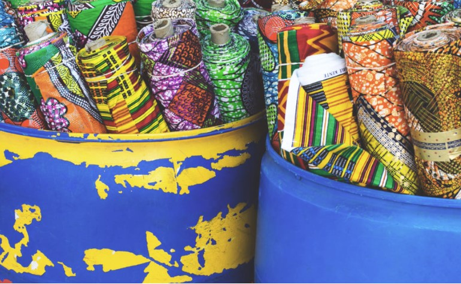
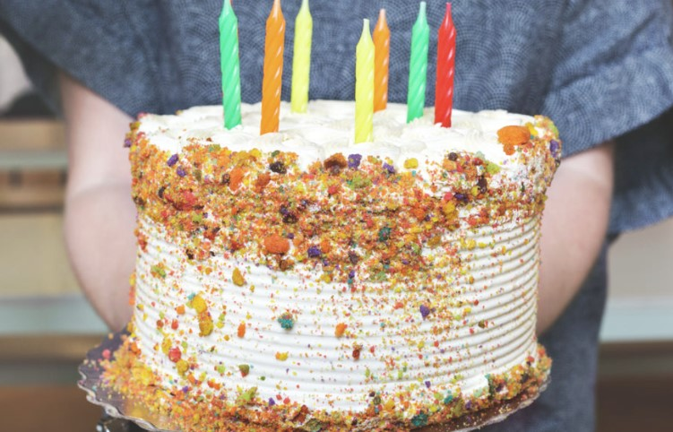
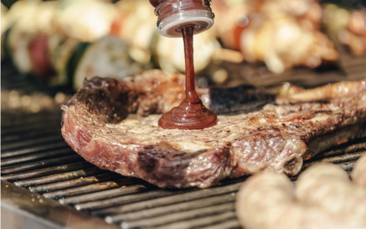
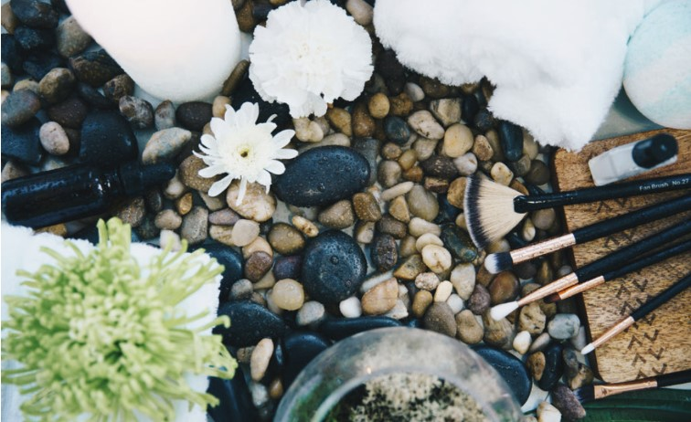
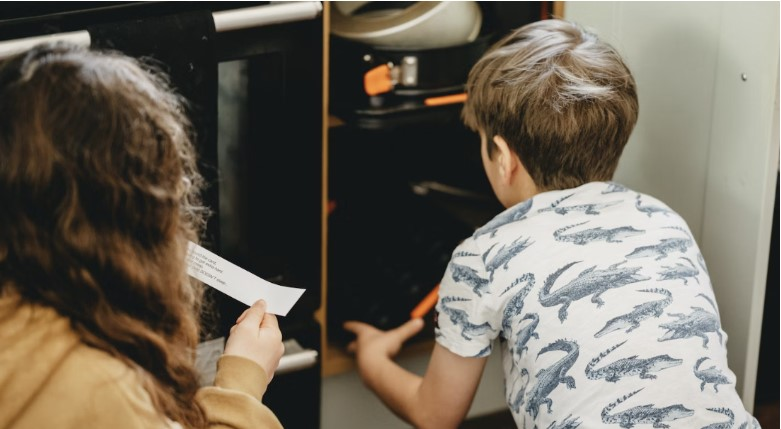
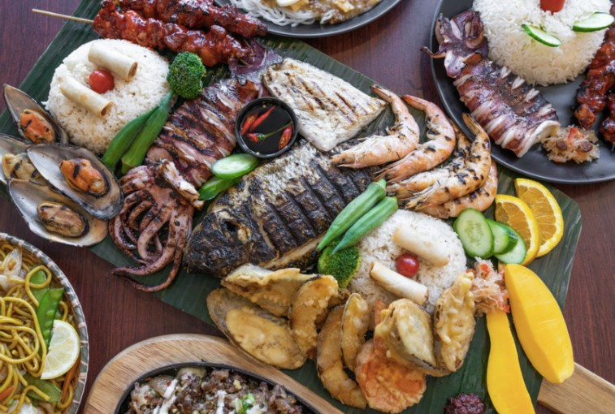
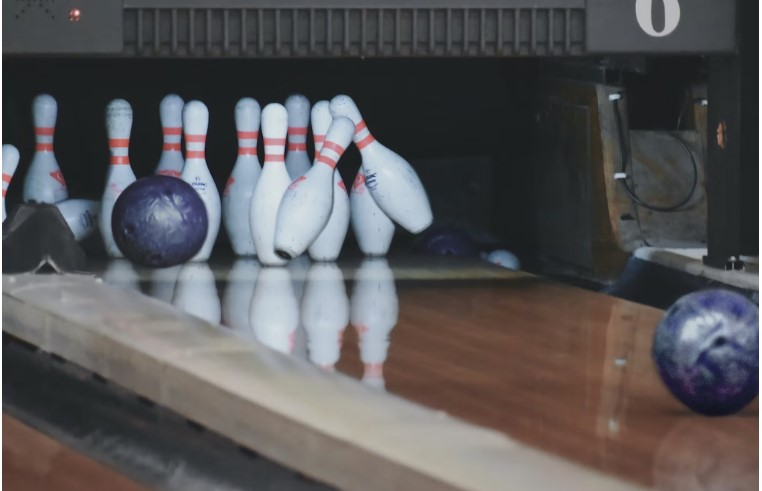
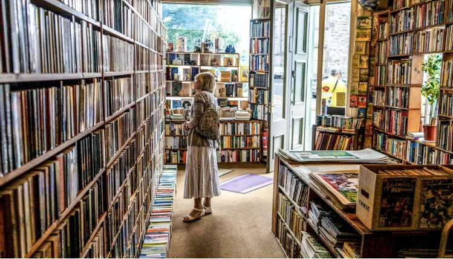
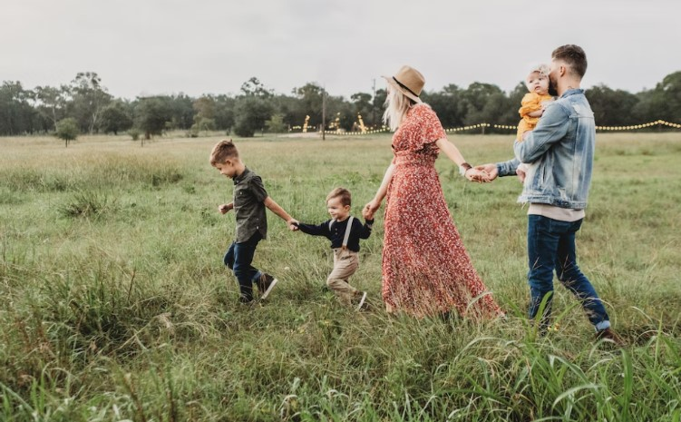

This article has been written and researched by our expert Loveable through a precise methodology. [Learn more about our methodology](https://avada.io/loveable/our-methodological.html)

[Loveable](https://avada.io/loveable/) > [Blog](https://avada.io/loveable/blog/) > [Family](https://avada.io/loveable/family/)

# 21 Meaningful Ideas For Celebrating Birthday With Family

Written by [Rose Bryne](https://avada.io/loveable/author/rose/) Last Updated on August 21, 2023

- [21 Meaningful Ideas For Celebrating Birthday With Family](https://avada.io/loveable/blog/celebrating-birthday-with-family/#wp-block-heading-2-4)
    - [1\. Decorate The House](https://avada.io/loveable/blog/celebrating-birthday-with-family/#wp-block-heading-3-5)
    - [2\. Prepare The Food and Drinks](https://avada.io/loveable/blog/celebrating-birthday-with-family/#wp-block-heading-3-9) 
    - [3\. Birthday Cake](https://avada.io/loveable/blog/celebrating-birthday-with-family/#wp-block-heading-3-13)
    - [4\. Prepare Some Homemade Birthday Gifts](https://avada.io/loveable/blog/celebrating-birthday-with-family/#wp-block-heading-3-16)
    - [5\. Garden BBQ Birthday Dinner](https://avada.io/loveable/blog/celebrating-birthday-with-family/#wp-block-heading-3-18)
    - [6\. Slumber Party](https://avada.io/loveable/blog/celebrating-birthday-with-family/#wp-block-heading-3-22)
    - [7\. Diy Birthday Spa](https://avada.io/loveable/blog/celebrating-birthday-with-family/#wp-block-heading-3-24)
    - [8\. Go Somewhere Fun As a Family](https://avada.io/loveable/blog/celebrating-birthday-with-family/#wp-block-heading-3-28)
    - [9\. Gift Scavenger Hunt](https://avada.io/loveable/blog/celebrating-birthday-with-family/#wp-block-heading-3-31)
    - [10\. Family Facetime](https://avada.io/loveable/blog/celebrating-birthday-with-family/#wp-block-heading-3-35) 
    - [11\. Have a “Yes” Day](https://avada.io/loveable/blog/celebrating-birthday-with-family/#wp-block-heading-3-37) 
    - [12\. Prepare Beautiful Personalized Gifts](https://avada.io/loveable/blog/celebrating-birthday-with-family/#wp-block-heading-3-41) 
    - [13\. Reserve Family Favorite Restaurant](https://avada.io/loveable/blog/celebrating-birthday-with-family/#wp-block-heading-3-43) 
    - [14\. Go to The Cinema](https://avada.io/loveable/blog/celebrating-birthday-with-family/#wp-block-heading-3-46) 
    - [15\. Trampoline Birthday Parties](https://avada.io/loveable/blog/celebrating-birthday-with-family/#wp-block-heading-3-49)
    - [16\. Bowling](https://avada.io/loveable/blog/celebrating-birthday-with-family/#wp-block-heading-3-51)
    - [17\. Pool Party](https://avada.io/loveable/blog/celebrating-birthday-with-family/#wp-block-heading-3-54)
    - [18\. Go to the Book Store](https://avada.io/loveable/blog/celebrating-birthday-with-family/#wp-block-heading-3-57) 
    - [19\. Family Shopping](https://avada.io/loveable/blog/celebrating-birthday-with-family/#wp-block-heading-3-61) 
    - [20\. Go for a Vacation](https://avada.io/loveable/blog/celebrating-birthday-with-family/#wp-block-heading-3-63) 
    - [21\. Go Camping](https://avada.io/loveable/blog/celebrating-birthday-with-family/#wp-block-heading-3-66) 
- [Bottom Line](https://avada.io/loveable/blog/celebrating-birthday-with-family/#wp-block-heading-2-69) 

Birthdays are special days that call for celebrations with our loved ones. While blowing out candles on a cake with friends and colleagues is always exciting, nothing compares to **celebrating your special day with your family**. From intimate gatherings to grand celebrations, there are countless ways to make your birthday unforgettable with those closest to you. 

In this article, we’ve put together 15 meaningful ideas for celebrating your birthday with family. Whether you’re planning a surprise party or a quiet night in, we’ve got you covered with unique and heartfelt ideas to make your birthday celebration one to remember. So, let’s dive in and start planning a birthday celebration that you and your family will cherish for years to come!

The best thing about celebrating a birthday with family is that you can be with your loved one on this important day, but birthday gifts are equally important at that moment. That’s why, at Loveable, we’ve compiled a list of meaningful birthday gift collections that you can give to anyone in your life, from [Amazon bestsellers gifts](https://avada.io/loveable/tricks-to-save-money-amazon/) to beautiful, customizable items from Loveable. You will surely give your loved ones the best with these ideas!

## 21 Meaningful Ideas For Celebrating Birthday With Family

### 1\. Decorate The House

Decorate The House

[Decorating](https://loveable.ai/collections/indoor-decor) [y](https://loveable.ai/collections/indoor-decor)[our home](https://loveable.ai/collections/indoor-decor) is an excellent way to add a festive touch to your birthday celebration with family. From colorful balloons and streamers to personalized banners and signs, there are endless options to choose from. 

You could even create a special birthday corner with photos and memorabilia from past celebrations. Don’t forget to set the table with your favorite dishes and add some fresh flowers to create a warm and inviting atmosphere. 

### 2\. Prepare The Food and Drinks 

From a simple home-cooked meal to an elaborate feast, you can choose to serve your favorite dishes that everyone will love. Consider incorporating your family’s favorite snacks, drinks, and desserts to make the celebration more special. 

You can also try new recipes or indulge in some fun and creative culinary experiments. Don’t forget to include some refreshing beverages such as lemonade, mocktails, or cocktails to quench everyone’s thirst. 

**Related**: [_35 Best Food Birthday Gifts That will Satisfy Anyone In Your Life_](https://avada.io/loveable/food-birthday-gifts/)

### 3\. Birthday Cake

Birthday Cake

Baking a cake is a quintessential part of any birthday celebration, and doing it with your family can make it all the more special. Whether you opt for a classic vanilla cake or something more decadent like chocolate or red velvet, the process of making a cake together can be a fun and memorable experience. 

### 4\. Prepare Some Homemade Birthday Gifts

Giving [homemade birthday gifts](https://avada.io/loveable/diy-birthday-gifts-mom/) is a thoughtful and heartfelt way to show your family members how much you care. You can get creative and make personalized gifts that reflect your interests, such as a scrapbook of family memories, a hand-painted picture frame, or a knitted scarf. 

### 5\. Garden BBQ Birthday Dinner

Garden BBQ Birthday Dinner

Don’t let the fact that we summer babies can’t enjoy the usual seasonal festivities get you down. Instead, why not take advantage of the beautiful weather and indulge in a big backyard BBQ [birthday party](https://avada.io/loveable/summer-birthday-party-ideas/)?

The best part? You can take your time and make it an all-day affair, soaking up the sun and enjoying each other’s company.

### 6\. Slumber Party

There are no other better ways to celebrate with your loved ones than by spending quality time in the great outdoors. Camping is the perfect option that guarantees fun and adventure for all. Pitch your tent and gather some delicious provisions to fuel your camping experience. Once you’ve indulged in a scrumptious summer birthday BBQ, why not extend the festivities by camping out in your own backyard?

### 7\. Diy Birthday Spa

Diy Birthday Spa

Treat your loved one to the ultimate relaxation experience with a DIY birthday spa day at home. Set the mood by lighting some scented candles and playing some soothing music. Create a luxurious atmosphere by laying out soft towels and bathrobes and filling a tub with warm water and some fragrant bath salts or bubbles. 

Once you’ve prepared everything, invite your family member to indulge in a day of pampering and self-care.

### 8\. Go Somewhere Fun As a Family

There’s no need to travel far to create unforgettable family memories. The whole family can enjoy plenty of exciting local activities together. From the Family Fun Center to mini-golf, ice-skating to bowling, and even ax throwing or airboat rides, there’s no shortage of thrilling options.

Embrace your inner child and join in on the fun with your kids. They’ll be over the moon when you partake in all the “kid” activities alongside them. 

### 9\. Gift Scavenger Hunt

Gift Scavenger Hunt

Take birthday gifting to the next level with a present scavenger hunt! Hide small gifts or clues around the house or backyard, leading your loved one on a fun and exciting treasure hunt. 

You can make it as simple or elaborate as you’d like, depending on the age and interests of your family member. The final clue can lead them to the ultimate birthday surprise, like a special birthday cake or a thoughtful gift.

### 10\. Family Facetime 

Distance won’t stop you from celebrating your loved one’s special day. Bring the party to them by organizing a virtual birthday bash! With a little bit of preparation, you can set up a Zoom call with family and friends from near and far, allowing them to sing Happy Birthday all at once. And don’t forget to prepare meaningful long-distant gifts for those you love.

### 11\. Have a “Yes” Day 

Have a “Yes” Day

Birthdays are all about celebrating the special person in your life, and what better way to do that than by saying yes to everything that makes them happy! Let them choose the activities, meals, and even the movie for the day. 

If they want to play board games all day, go for it! If they want to indulge in their favorite foods, don’t hold back! This day is all about making them feel loved, appreciated, and happy. 

### 12\. Prepare Beautiful Personalized Gifts 

Nothing means “I love you” more than a beautiful and personalized gift! Whether it’s a heartfelt card, a custom photo album, or a personalized piece of jewelry, taking the time to create a unique and thoughtful present shows how much you care. Get creative with your gift ideas and make something that truly reflects the personality and interests of your loved one. 

### 13\. Reserve Family Favorite Restaurant 

Reserve Family Favorite Restaurant 

Treat yourself on your special day and visit that favorite city restaurant you’ve been meaning to try. Use OpenTable or Resy to make a reservation, and make sure your friends and family arrive on time to avoid any issues with seating. Don’t let location or price hold you back from indulging in a delicious meal to celebrate your birthday!

### 14\. Go to The Cinema 

There’s truly nothing quite like catching a great flick at your neighborhood cinema. From the moment you grab a bucket of buttered popcorn and sink into your plush seat, you can just let go and bask in the thrill of the big screen for a blissful couple of hours. 

Of course, finding the perfect movie that will please everyone in the family is its own adventure. Still, the satisfaction of knowing everyone is having a blast makes the cost of admission totally worthwhile.

### 15\. Trampoline Birthday Parties

For families with a love of physical activity, a visit to a trampoline park could prove to be an exciting and enjoyable outing for all. Not only does it encourage you to get your blood pumping and your body in motion, but the park also offers a range of activities to cater to every taste and preference.

### 16\. Bowling

Bowling

[Bowling](https://en.wikipedia.org/wiki/Bowling) isn’t just a game for kids’ parties; it’s a fantastic activity that the whole family can enjoy, especially as a fun way to celebrate a birthday. Introducing a friendly bit of competition between family members provides a perfect opportunity to strengthen familial bonds while also having a blast.

### 17\. Pool Party

Gather around family and friends! It’s time to celebrate another year of life with a splash! A pool party is a perfect choice for a hot summer day. Refreshing drinks and delicious snacks await at the poolside while the grill sizzles with the tantalizing aroma of burgers and hot dogs. 

Happy birthday wishes are exchanged, and memories are made as we celebrate together in the cool waters of the pool!

### 18\. Go to the Book Store 

Go to the Book Store

The bookstore is a haven for those who crave knowledge and adventure. Rows upon rows of books of every genre and topic await, ready to take us on journeys to far-off lands and imaginative worlds. 

We pick out a few books to take home and then settle in for a quiet moment of reading or conversation over a steaming cup of coffee. If your loved one is passionate about books, you can also look for great bookworm gifts on their birthday to show interest.

### 19\. Family Shopping 

It’s time to celebrate a birthday in an ultimate way for the shopping-addicted family! A family shopping trip is a perfect choice for those who live and breathe fashion and trends. The excitement and thrill of discovering the latest and greatest styles fill the air as we enter the shopping mall.

### 20\. Go for a Vacation 

Go for a Vacation 

A birthday vacation is a great way to bond with your loved ones and create memories that will last a lifetime. Choose a destination that appeals to everyone, whether it’s a relaxing beach getaway or an exciting city adventure. Plan ahead and make reservations for activities and restaurants to ensure a stress-free trip. 

### 21\. Go Camping 

Looking for a cheap and exciting way to celebrate a birthday with your family? Why not plan a camping trip together? Escape into nature and disconnect from the hustle and bustle of daily life. Choose a campsite that has something for everyone, whether it’s a hiking, fishing, or simply enjoying the beauty of the great [outdoors](https://avada.io/loveable/family-outdoor-activities/).

In addition, you can also give your loved one [wonderful camping gifts](https://avada.io/loveable/gifts-campers/); with these gifts, you not only show your devotion but also ensure a fun and meaningful family camping trip.

## Bottom Line 

To sum it up, there are endless ways to **celebrate birthdays with family,** and these 21 meaningful ideas are just the beginning. Whether you choose to go on a vacation, have a pool party, or simply spend quality time together, the most important thing is to cherish the moment and make lasting memories. Take inspiration from these ideas and make them your own, tailoring them to your family’s interests and preferences.

- [21 Meaningful Ideas For Celebrating Birthday With Family](https://avada.io/loveable/blog/celebrating-birthday-with-family/#wp-block-heading-2-4)
    - [1\. Decorate The House](https://avada.io/loveable/blog/celebrating-birthday-with-family/#wp-block-heading-3-5)
    - [2\. Prepare The Food and Drinks](https://avada.io/loveable/blog/celebrating-birthday-with-family/#wp-block-heading-3-9) 
    - [3\. Birthday Cake](https://avada.io/loveable/blog/celebrating-birthday-with-family/#wp-block-heading-3-13)
    - [4\. Prepare Some Homemade Birthday Gifts](https://avada.io/loveable/blog/celebrating-birthday-with-family/#wp-block-heading-3-16)
    - [5\. Garden BBQ Birthday Dinner](https://avada.io/loveable/blog/celebrating-birthday-with-family/#wp-block-heading-3-18)
    - [6\. Slumber Party](https://avada.io/loveable/blog/celebrating-birthday-with-family/#wp-block-heading-3-22)
    - [7\. Diy Birthday Spa](https://avada.io/loveable/blog/celebrating-birthday-with-family/#wp-block-heading-3-24)
    - [8\. Go Somewhere Fun As a Family](https://avada.io/loveable/blog/celebrating-birthday-with-family/#wp-block-heading-3-28)
    - [9\. Gift Scavenger Hunt](https://avada.io/loveable/blog/celebrating-birthday-with-family/#wp-block-heading-3-31)
    - [10\. Family Facetime](https://avada.io/loveable/blog/celebrating-birthday-with-family/#wp-block-heading-3-35) 
    - [11\. Have a “Yes” Day](https://avada.io/loveable/blog/celebrating-birthday-with-family/#wp-block-heading-3-37) 
    - [12\. Prepare Beautiful Personalized Gifts](https://avada.io/loveable/blog/celebrating-birthday-with-family/#wp-block-heading-3-41) 
    - [13\. Reserve Family Favorite Restaurant](https://avada.io/loveable/blog/celebrating-birthday-with-family/#wp-block-heading-3-43) 
    - [14\. Go to The Cinema](https://avada.io/loveable/blog/celebrating-birthday-with-family/#wp-block-heading-3-46) 
    - [15\. Trampoline Birthday Parties](https://avada.io/loveable/blog/celebrating-birthday-with-family/#wp-block-heading-3-49)
    - [16\. Bowling](https://avada.io/loveable/blog/celebrating-birthday-with-family/#wp-block-heading-3-51)
    - [17\. Pool Party](https://avada.io/loveable/blog/celebrating-birthday-with-family/#wp-block-heading-3-54)
    - [18\. Go to the Book Store](https://avada.io/loveable/blog/celebrating-birthday-with-family/#wp-block-heading-3-57) 
    - [19\. Family Shopping](https://avada.io/loveable/blog/celebrating-birthday-with-family/#wp-block-heading-3-61) 
    - [20\. Go for a Vacation](https://avada.io/loveable/blog/celebrating-birthday-with-family/#wp-block-heading-3-63) 
    - [21\. Go Camping](https://avada.io/loveable/blog/celebrating-birthday-with-family/#wp-block-heading-3-66) 
- [Bottom Line](https://avada.io/loveable/blog/celebrating-birthday-with-family/#wp-block-heading-2-69) 

### [Rose Bryne](https://avada.io/loveable/author/rose/)

Hi, I'm Rose! I love animals and spending time with kids. At Loveable, I help people find unique gifts for special occasions like Valentine's Day, housewarmings, and graduations. I enjoy finding gifts for kids, teens, and animal lovers that match their interests and personalities. Making gift-giving a pleasant experience is my priority. Let me assist you in finding the perfect gift!

- [Twitter](https://twitter.com/intent/tweet)
- [Facebook](https://www.facebook.com/sharer/sharer.php)
- [instagram](https://avada.io/loveable/blog/celebrating-birthday-with-family/)
- [pinterest](https://www.pinterest.com/loveablellc/)

## Related Posts

[### 30 Best 4 Year Old Birthday Party Ideas For A Memorable Celebration](https://avada.io/loveable/blog/4-year-old-birthday-party-ideas/) 

[

### 16th Birthday Party Ideas to Make an Unforgettable Day

](https://avada.io/loveable/blog/16th-birthday-party-ideas/)

[

### 150+ Inspirational Birthday Quotes to Spread Joy on Special Day

](https://avada.io/loveable/blog/inspirational-birthday-quotes/)

[

### 160+ Birthday Wishes for Wife to Express Eternal Love

](https://avada.io/loveable/blog/birthday-wishes-for-wife/)

[### 90+ Heart Touching Birthday Wishes for Niece to Make Her Day Extra Special](https://avada.io/loveable/blog/birthday-wishes-for-niece/)
