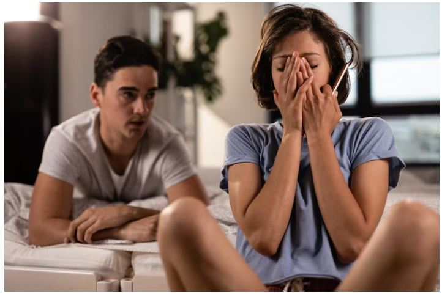
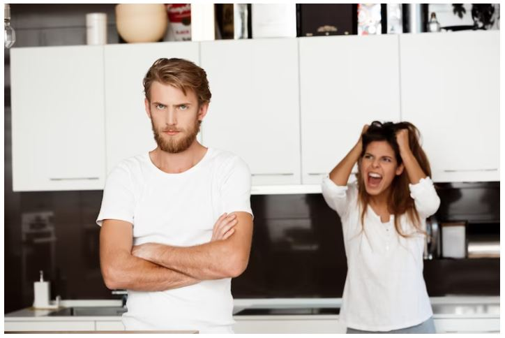
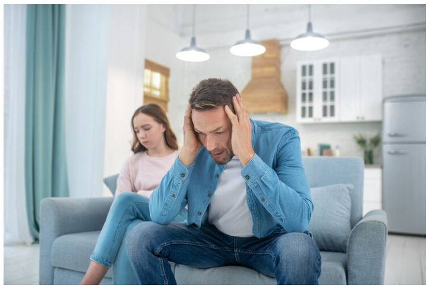
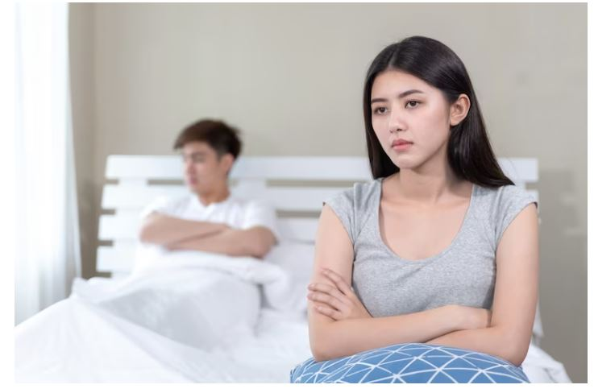
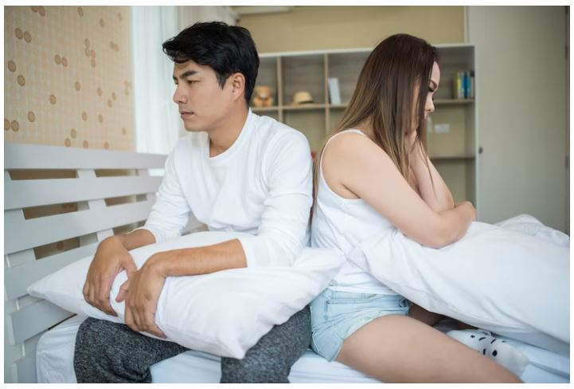
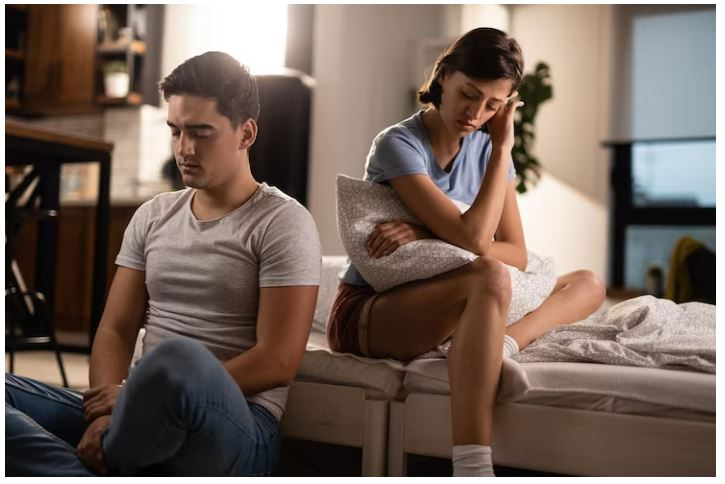
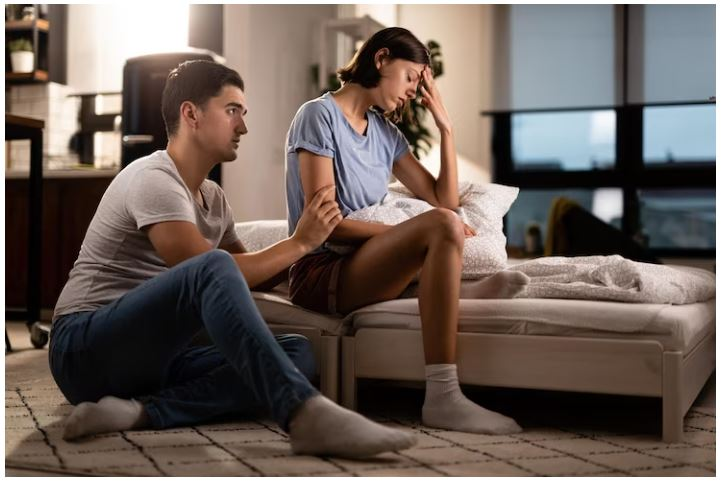
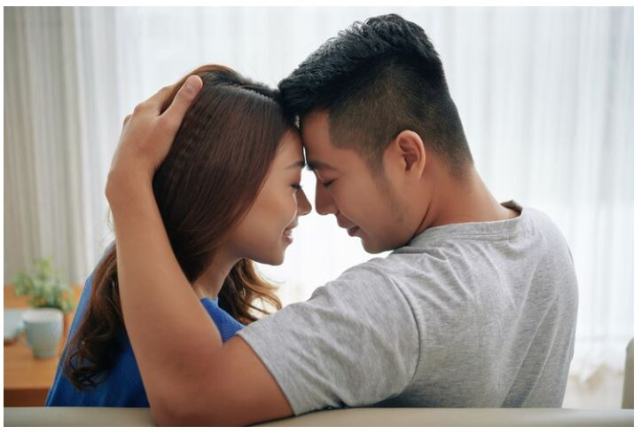
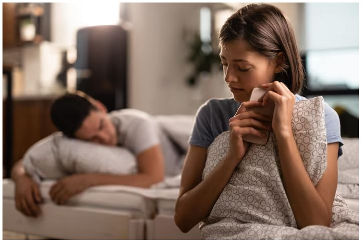
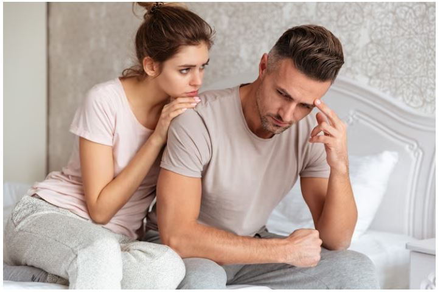

This article has been written and researched by our expert Loveable through a precise methodology. [Learn more about our methodology](https://avada.io/loveable/our-methodological.html)

[Loveable](https://avada.io/loveable/) > [Blog](https://avada.io/loveable/blog/) > [Family](https://avada.io/loveable/family/)

# 21 Signs That You’re In A Loveless Marriage And How To Reverse It!

Written by [Rose Bryne](https://avada.io/loveable/author/rose/) Last Updated on August 17, 2023

- [What does “loveless marriage” mean?](https://avada.io/loveable/blog/loveless-marriage/#wp-block-heading-2-4)
- [Signs That You’re In A Loveless Marriage](https://avada.io/loveable/blog/loveless-marriage/#wp-block-heading-2-7)
    - [1\. You aren’t making love](https://avada.io/loveable/blog/loveless-marriage/#wp-block-heading-3-8)
    - [2\. You have divorce fantasies](https://avada.io/loveable/blog/loveless-marriage/#wp-block-heading-3-11)
    - [3\. You put down each other’s worries](https://avada.io/loveable/blog/loveless-marriage/#wp-block-heading-3-14)
    - [4\. You feel like you’re always alone](https://avada.io/loveable/blog/loveless-marriage/#wp-block-heading-3-18)
    - [5\. Fun is over](https://avada.io/loveable/blog/loveless-marriage/#wp-block-heading-3-20)
    - [6\. They are no longer someone you can trust](https://avada.io/loveable/blog/loveless-marriage/#wp-block-heading-3-24)
    - [7\. You don’t feel cared for](https://avada.io/loveable/blog/loveless-marriage/#wp-block-heading-3-28)
    - [8\. You can’t stand anything they do](https://avada.io/loveable/blog/loveless-marriage/#wp-block-heading-3-32)
    - [9\. Someone of you lied](https://avada.io/loveable/blog/loveless-marriage/#wp-block-heading-3-37)
    - [10\. They are hiding things](https://avada.io/loveable/blog/loveless-marriage/#wp-block-heading-3-41)
    - [11\. Most of the time, you argue with people](https://avada.io/loveable/blog/loveless-marriage/#wp-block-heading-3-44)
    - [12\. You don’t argue about anything anymore](https://avada.io/loveable/blog/loveless-marriage/#wp-block-heading-3-47)
    - [13\. You can’t do a commitment](https://avada.io/loveable/blog/loveless-marriage/#wp-block-heading-3-51)
    - [14\. You feel like you’re under a microscope](https://avada.io/loveable/blog/loveless-marriage/#wp-block-heading-3-54)
    - [15\. They’re always putting on the brakes](https://avada.io/loveable/blog/loveless-marriage/#wp-block-heading-3-57)
    - [16\. Or they don’t even know there’s a problem](https://avada.io/loveable/blog/loveless-marriage/#wp-block-heading-3-62)
    - [17\. You are getting more and more interested in other people](https://avada.io/loveable/blog/loveless-marriage/#wp-block-heading-3-65)
    - [18\. You have different agendas](https://avada.io/loveable/blog/loveless-marriage/#wp-block-heading-3-68)
    - [19\. You criticize your partner all the time, or they do the same to you](https://avada.io/loveable/blog/loveless-marriage/#wp-block-heading-3-72)
    - [20\. Don’t face each other anymore](https://avada.io/loveable/blog/loveless-marriage/#wp-block-heading-3-76)
    - [21\. There is a great deal of disrespect](https://avada.io/loveable/blog/loveless-marriage/#wp-block-heading-3-79)
- [How To Reverse A Loveless Marriage](https://avada.io/loveable/blog/loveless-marriage/#wp-block-heading-2-83)
    - [1\. How the Love Bucket Model works](https://avada.io/loveable/blog/loveless-marriage/#wp-block-heading-3-85)
    - [2\. Fillers](https://avada.io/loveable/blog/loveless-marriage/#wp-block-heading-3-92)
    - [3\. Drainers](https://avada.io/loveable/blog/loveless-marriage/#wp-block-heading-3-109)
    - [4\. Bucket List Love](https://avada.io/loveable/blog/loveless-marriage/#wp-block-heading-3-125)
- [Final thoughts,](https://avada.io/loveable/blog/loveless-marriage/#wp-block-heading-2-132)

Marriages frequently suffer from communication problems that one spouse acknowledges, but the other refuses to accept. This might be because one person’s life objectives have changed, or they believe their worries are not being taken seriously.

But, being in an unhappy marriage does not have to be the end of the world. There may be hope if both individuals are willing to come up, speak things out, and work on their relationship.

The shared desire to repair the marriage is critical, and it may require an expert to find the flaws. The difficult thing is determining if you’re merely going through a hard patch in your marriage or whether you’re in an unhappy marriage. Fortunately, here are the **21 expert-recommended loveless marriage sign**s to help you figure it out.

## What does “loveless marriage” mean?

What does “loveless marriage” mean?

A loveless marriage is one in which one or both parties do not feel in love with one other. They frequently feel more like roommates or siblings than loving partners. Isolation, resentment, and pessimism are common outcomes of a loveless marriage.

## Signs That You’re In A Loveless Marriage

### 1\. You aren’t making love

Everyone’s libidos vary, but if you and your spouse go from having it on multiple times a week to once every few months, there’s a high possibility one of you is feeling rejected and undesired.

Compassion like this is unusual in other partnerships, making it extra meaningful. As a result, when your desire for your spouse or their attraction for you begins to fade, it can sting like hell and lead to resentment that pulls you apart.

### 2\. You have divorce fantasies

Thinking you’re married to someone else or alone isn’t necessarily a cause for worry. Nevertheless, daydreaming about a life without your partner or comparing your current life to an ideal one in which you’re married to someone else is a symptom that you’re no longer experiencing some or all of the traits that formerly drew you to your spouse. 

And if you’re alright with the prospect of living without your spouse, you probably don’t want to live with them.

### 3\. You put down each other’s worries

You put down each other’s worries

Unhappy marriages are frequently the result of imbalances in which one party believes they are superior to their mate and ignores their spouse’s sentiments. This is a major no-no because it undermines the principle of equal collaboration, which is important in marriage.

If you find yourself continuously fighting for the upper hand in talks with your spouse, you may want to meet with a therapist one-on-one to address why you don’t see the value in what your partner has to say or vice versa, and how this may be affecting your marriage.

### 4\. You feel like you’re always alone

Even when you and your spouse are just sitting on the sofa, if you sense that they aren’t really paying attention to you and appear more preoccupied with their phone, it may be an indication that you’re in a loveless marriage.

### 5\. Fun is over

Although it may seem obvious, humor and a lack of connection in a relationship can go hand in hand. 

Because laughing is a wonderful healer, it’s crucial for couples to find humor when things become tough during the routine arguments and sacrifices that come with marriage. 

If you and your spouse are no longer able to joke about and laugh things off, it may be because you two are stuck in a bad cycle and need assistance to get out.

### 6\. They are no longer someone you can trust

They are no longer someone you can trust

Transparency is necessary for all relationships to last. It doesn’t mean you can’t ever keep certain things private, but exchanging information about a career-changing project you’ve just been allocated at work or the news of your sister’s pregnancy with your partner is almost expected. 

Hence, if you discover that your neighbors know more about your life than your lover, you may need to work on some trust issues.

### 7\. You don’t feel cared for

Lean into your feelings of loneliness and sadness. You can discover what is making you feel abandoned by your spouse by asking more questions, such as why they never stop gushing over their new gym companion. Or that they habitually ignore you in favor of your children, giving them all of their time and attention.

You’ll be able to communicate with your spouse about what you need from them and why their behaviors make you feel particularly vulnerable after you identify the cause of these feelings. 

If your spouse doesn’t think there’s an issue with your loneliness or if they openly admit they’re leaving the marriage on purpose, you should seek outside assistance.

### 8\. You can’t stand anything they do

Does the sound of your spouse chewing make your hair stand on end? Do you wonder whether they’ve always spoken into the phone thus loudly?

As little irritations become major annoyances, it’s possible that your image of your partner is changing.

This is where one-on-one sessions, in addition to couples counseling, may truly help. Perhaps you’re feeling taken advantage of; perhaps they’ve taken on extra responsibilities at work and you’re missing them. 

Whatever it is, you can utilize a personal session to get to the bottom of why you’re suddenly rolling your eyes at their every action without embarrassing your spouse in front of your therapist.

### 9\. Someone of you lied

Someone of you lied

Once one of you had an affair, even if you and your partner thought you had moved on, you can still be holding onto bitterness that you have buried deep inside. Unhealed wounds can cause pain in a variety of ways, such as guilting your spouse for something you claimed to have forgiven them for and finding it difficult to trust them.

You don’t have to forget the affair ever happened, but if you and your spouse are having trouble getting over it despite your best efforts, you may need to just accept that you’re unhappy and consider seeking outside assistance, taking some time apart, or ending your relationship completely.

### 10\. They are hiding things

Even if you aren’t dealing with infidelity problems, you can have a suspicion that your spouse is seeing someone else because they’ve stopped sharing things about their day or their tales of their whereabouts don’t fit up.

A spouse who is dishonest in order to hide an affair or drug addiction issues is a typical relationship stressor that, if not handled, may push you and your partner into divorce.

### 11\. Most of the time, you argue with people

This one is a bit more evident. Couples frequently dismiss disputes and disagreements as “regular relationship things.” But in reality, they are significant indicators that you and your partner don’t share the same values.

Consider what you’re arguing over, whether you’re selecting fights to hide your upset, and how frequently you have the same disagreements instead of minimizing your spats as ordinary reactions. It’s possible that you and your partner are only going through what you believe to be normal routines when, in reality, you could no longer be a suitable match.

### 12\. You don’t argue about anything anymore

You don’t argue about anything anymore

This might show in a variety of ways, including you or your partner shutting down feelings, withdrawing and turning inward, and/or failing to bring up aspects of the relationship that are upsetting you. A lot of combat is unpleasant, but no fighting at all? It indicates you and your partner don’t believe your relationship is worth fighting for.

Instead of stewing in anger or apathy, you and your spouse should adopt an alternative way of dispute resolution, such as writing down your sentiments so you can better communicate them to your partner. When you’ve decided on the best technique, go back to your spouse and attempt to hear them out one more time.

### 13\. You can’t do a commitment

Monogamy, as you may have assumed at first, is not for everyone, and it may not be for you. It’s typical for one person in an unhappy marriage to feel like they’re losing out on life because they’re “locked down” to someone, or that they were pushed and forced into marriage before they were ready. 

Some people marry because they don’t want to be alone, while others marry because they feel obligated to at a particular age and subsequently discover marriage does not accord with their beliefs.

### 14\. You feel like you’re under a microscope

Every now and then, advice from your partner is natural. But if it’s constant criticism over how you set up the pantry and it makes you feel like you can’t do anything right, there’s a high possibility your marriage needs some very important TLC. 

Marriage, partnerships, and relationships all center around acceptance of oneself. Hence, if and when it ceases, you’re in trouble.

### 15\. They’re always putting on the brakes

They’re always putting on the brakes

Speaking with a person who is in denial might seem like hitting your head against a brick wall. Furthermore, it may be quite difficult to recover your connection with a partner who won’t even try to comprehend your concerns or apologize for how they’ve made you feel.

Compromise, calmness as you listen, and a true attempt to understand your partner’s perspective are necessary for a happy marriage. 

All in all, empathy is fundamental in marriages. It could be time for a split if your partner doesn’t care when you’re in pain and won’t seek therapy when you communicate how it impacts your relationship.

### 16\. Or they don’t even know there’s a problem

There is no way to get a marriage back on track if both partners refuse to confront their concerns. 

Thus, if your spouse doesn’t see anything that needs to be fixed in your loveless marriage, there’s a small chance you’ll be able to go back on track, given that only one of you believes you’ve lost your way.

### 17\. You are getting more and more interested in other people

When you are married, you don’t suddenly have to put on blinders that prevent you from finding other individuals appealing. 

Nevertheless, if you’ve had repeated ideas of emotionally cheating on your spouse, are constantly flirting with other people, or spending time with someone in a way that would cause you to feel guilty if your partner found out, you’re drifting away from your marriage. There’s a high likelihood that something is missing in your marriage that you’re looking for in other relationships.

### 18\. You have different agendas

You have different agendas

Assume you would want children, but your partner does not. If you regard marriage as a means of enhancing your connection with your partner, but your spouse believes saying “I do” is merely significant for tax purposes.

It’s easy for these divergent viewpoints to create conflict between you two if you’re together for various reasons. If you can’t discover an acceptable medium, you may have to seek out others whose aims are similar to yours.

### 19\. You criticize your partner all the time, or they do the same to you

We’re all angry at times. Yet, you must assess if your dissatisfaction stems from a genuine lack of regard for your plus one or whether you are simply having a poor day. 

When you use words like “never” and “always,” as in “you never help me clean” or “you always forget to help,” you’re not simply criticizing your spouse; you’re assassinating their character.

The first thing to consider is how you critique. Of course, we’ll all complain, but there are alternatives to do so that don’t include personal insults.

### 20\. Don’t face each other anymore

When a couple experiences ongoing, unresolved conflict and a pattern of low-grade opposition, even when they are not at war, they soon stop seeing one other as a source of peace, support, or companionship. 

They cease interacting like friends, including making plans, confiding in one another, chatting about their days, and expressing their thoughts. And they retreat, frequently out of a fear of being abandoned or harmed if they show too much vulnerability.

### 21\. There is a great deal of disrespect

Your marriage may be difficult if you reply to each other with sarcasm. Disrespect is frequently the result of a broken relationship, such as betrayal, secrecy, or another wrongdoing. And it is difficult to overcome. 

It is unacceptable to be nasty and abusive to your spouse, and you should not be treated in the same manner. 

There is hope if you are willing to work through the issue that is at the foundation of your discontent. But keep in mind that you can’t heal resentment unless you figure out what caused it.

## How To Reverse A Loveless Marriage

How To Reverse A Loveless Marriage

### 1\. How the Love Bucket Model works

In a marriage, each person has different needs, and we may either take care of those needs or ignore them. It emerges like a bucket of love. 

Every one of us has an internal love bucket that our spouse fills like a faucet. Our spouse is great at filling it up at the beginning of our relationship. Our love bucket quickly fills up and we begin to fall in love with them. 

Yet with time, whether on purpose or accidentally, our partner lowers the faucet down and only pours a little bit of water into our love bucket. They start acting in ways we find unattractive at the same time, which causes a hole to form in the bottom of our bucket and water to start dripping.

Our bucket gets lower and lower until it is completely dry because less water is flowing in and more is coming out, which causes us to lose interest in them. 

In couples counseling, one of the most crucial things is figuring out is what the top things are that fill and empty their love buckets. Love buckets may be refilled and couples can fall back in love and stay in love if we can identify those elements and put them into practice.

Related: [How To Spice Up Your Marriage](https://avada.io/loveable/how-to-spice-up-your-marriage/)

### 2\. Fillers

Fillers are all the actions you want to take in order to feel appreciated and content. They might be actions your spouse took when you first started dating but ceased doing them later on. They could still do things that you want them to keep doing, and that is how to stay in a loveless marriage.

Fillers are all the actions you want to take in order to feel appreciated and content

You may have given up on them since these are things they have never done. 

What are the top three things you need in your marriage in order to feel loved and satisfied? What are the top three actions listed below that would give you the impression that your marriage is not lacking in love? The fillers could be:

- Quality Time- Receiving your entire attention 
- Affection- Non-sexual contact
- Adoration- Hearing why you adore them
- Emotional Intimacy- Sharing and hearing inner thoughts and feelings 
- Recreational- Participating in physical activities together, such as hiking, bicycling, swimming, and so forth.
- Sex- Sexual activity together 
- Support My Interests- When they are asked about significant aspects of their life.
- Physical Attraction- When you perfect your look
- Thoughtful gestures- When you do acts of kindness

Write out the top three things you want your spouse to do to fill your love bucket, and then rate how well they did on each of those things during the previous seven days, with zero being the worst and 10 being the greatest. 

Remember that you are just considering the factors that they had control over. You wouldn’t deduct points for something like your spouse being unable to show love for part of the week because they had a terrible cold because that was beyond their control.

**_Related_**: [How To Rekindle A Relationship? 13 Tips From Psychologist](https://avada.io/loveable/how-to-rekindle-a-relationship/)

### 3\. Drainers

Our love bucket is filled with fillers, and it is drained by drainers. Whatever your partner does that makes you feel unfavorable about them is a drainer. Your love bucket’s bottom develops a hole due to drainers, enabling water to escape. 

Water won’t remain in your bucket, thus, if your lover is doing a great job filling your love bucket while also doing a lot of drainers. The fillers will be neutralized by the drainers. Thus, tracking fillers alone is ineffective. 

Drainers

To properly fill one another’s love buckets, we must keep track of both fillers and drainers. The following are the most common drainers:

- Parenting – Their partner’s parenting style
- Defensive – How they do not take ownership of their part in conflicts
- Finances – How they handle money
- Harsh Anger – How they get harsh with their anger
- Passive – How they become passive in certain areas of life
- Controlling – How they do not share power in decision-making
- Addictions – Their addiction interferes with their relationship
- Uneven Workload – They work more overall than their partner
- Sloppy – They tend to leave their belongings all over the house

Write down the top three things your spouse does that sap your energy, and then give them a score for each of those things, except the scoring is reversed. Zero is the best and negative 10 is the worst for drainers. Zero indicates that your companion did not drain your bucket at all, leaving no water in it. 

Negative ten indicates that they engaged in the drainer conduct often during the last seven days, draining a significant amount of water from your bucket.

### 4\. Bucket List Love

The objective of the love buckets is to ultimately get an eight to ten on each filler and a zero to negative two on each drainer. When you regularly do this, your partner will find it impossible to resist you, and your loveless marriage will transform into one filled with love! 

Your brain is hardwired to act the way you do in your marriage right now. So, just like a hiking route, it will take time for new neural pathways to emerge. 

Your brain is hardwired to act the way you do in your marriage right now

You unconsciously follow the well-traveled dominating route in your marriage since it is well-established. To become the new dominant path, as with your new marital conduct, a new pathway must first be worn down through the grass.

Couples often engage in far more drainer than filler actions when they initially make their list and obtain numbers. It normally takes six to twelve weeks until filler actions become regular and drainer behaviors become infrequent if they are both sincerely trying to fill up their partner’s love bucket.

**_Related_**: [Sex Bucket List Ideas](https://avada.io/loveable/sex-bucket-list/)

## Final thoughts,

**A loveless marriage** is sad, but it occurs from time to time in our life, as not every relationship is supposed to last forever. In truth, the majority of them are not. The obstacles that we face cause us to develop and evolve. It’s silly to believe that the person we meet when we’re 20 will be the person we need when we’re 50.

Although it may appear depressing at first, relationships may bring something wonderful into our lives, even if only for a short time. You get to build memories and experience profound love, and when it ends, you may find another partner who will meet your new wants. And don’t forget that you can do just fine on your own.

- [What does “loveless marriage” mean?](https://avada.io/loveable/blog/loveless-marriage/#wp-block-heading-2-4)
- [Signs That You’re In A Loveless Marriage](https://avada.io/loveable/blog/loveless-marriage/#wp-block-heading-2-7)
    - [1\. You aren’t making love](https://avada.io/loveable/blog/loveless-marriage/#wp-block-heading-3-8)
    - [2\. You have divorce fantasies](https://avada.io/loveable/blog/loveless-marriage/#wp-block-heading-3-11)
    - [3\. You put down each other’s worries](https://avada.io/loveable/blog/loveless-marriage/#wp-block-heading-3-14)
    - [4\. You feel like you’re always alone](https://avada.io/loveable/blog/loveless-marriage/#wp-block-heading-3-18)
    - [5\. Fun is over](https://avada.io/loveable/blog/loveless-marriage/#wp-block-heading-3-20)
    - [6\. They are no longer someone you can trust](https://avada.io/loveable/blog/loveless-marriage/#wp-block-heading-3-24)
    - [7\. You don’t feel cared for](https://avada.io/loveable/blog/loveless-marriage/#wp-block-heading-3-28)
    - [8\. You can’t stand anything they do](https://avada.io/loveable/blog/loveless-marriage/#wp-block-heading-3-32)
    - [9\. Someone of you lied](https://avada.io/loveable/blog/loveless-marriage/#wp-block-heading-3-37)
    - [10\. They are hiding things](https://avada.io/loveable/blog/loveless-marriage/#wp-block-heading-3-41)
    - [11\. Most of the time, you argue with people](https://avada.io/loveable/blog/loveless-marriage/#wp-block-heading-3-44)
    - [12\. You don’t argue about anything anymore](https://avada.io/loveable/blog/loveless-marriage/#wp-block-heading-3-47)
    - [13\. You can’t do a commitment](https://avada.io/loveable/blog/loveless-marriage/#wp-block-heading-3-51)
    - [14\. You feel like you’re under a microscope](https://avada.io/loveable/blog/loveless-marriage/#wp-block-heading-3-54)
    - [15\. They’re always putting on the brakes](https://avada.io/loveable/blog/loveless-marriage/#wp-block-heading-3-57)
    - [16\. Or they don’t even know there’s a problem](https://avada.io/loveable/blog/loveless-marriage/#wp-block-heading-3-62)
    - [17\. You are getting more and more interested in other people](https://avada.io/loveable/blog/loveless-marriage/#wp-block-heading-3-65)
    - [18\. You have different agendas](https://avada.io/loveable/blog/loveless-marriage/#wp-block-heading-3-68)
    - [19\. You criticize your partner all the time, or they do the same to you](https://avada.io/loveable/blog/loveless-marriage/#wp-block-heading-3-72)
    - [20\. Don’t face each other anymore](https://avada.io/loveable/blog/loveless-marriage/#wp-block-heading-3-76)
    - [21\. There is a great deal of disrespect](https://avada.io/loveable/blog/loveless-marriage/#wp-block-heading-3-79)
- [How To Reverse A Loveless Marriage](https://avada.io/loveable/blog/loveless-marriage/#wp-block-heading-2-83)
    - [1\. How the Love Bucket Model works](https://avada.io/loveable/blog/loveless-marriage/#wp-block-heading-3-85)
    - [2\. Fillers](https://avada.io/loveable/blog/loveless-marriage/#wp-block-heading-3-92)
    - [3\. Drainers](https://avada.io/loveable/blog/loveless-marriage/#wp-block-heading-3-109)
    - [4\. Bucket List Love](https://avada.io/loveable/blog/loveless-marriage/#wp-block-heading-3-125)
- [Final thoughts,](https://avada.io/loveable/blog/loveless-marriage/#wp-block-heading-2-132)

### [Rose Bryne](https://avada.io/loveable/author/rose/)

Hi, I'm Rose! I love animals and spending time with kids. At Loveable, I help people find unique gifts for special occasions like Valentine's Day, housewarmings, and graduations. I enjoy finding gifts for kids, teens, and animal lovers that match their interests and personalities. Making gift-giving a pleasant experience is my priority. Let me assist you in finding the perfect gift!

- [Twitter](https://twitter.com/intent/tweet)
- [Facebook](https://www.facebook.com/sharer/sharer.php)
- [instagram](https://avada.io/loveable/blog/loveless-marriage/)
- [pinterest](https://www.pinterest.com/loveablellc/)

## Related Posts

[### 30 Best 4 Year Old Birthday Party Ideas For A Memorable Celebration](https://avada.io/loveable/blog/4-year-old-birthday-party-ideas/) 

[

### 16th Birthday Party Ideas to Make an Unforgettable Day

](https://avada.io/loveable/blog/16th-birthday-party-ideas/)

[

### 150+ Inspirational Birthday Quotes to Spread Joy on Special Day

](https://avada.io/loveable/blog/inspirational-birthday-quotes/)

[

### 160+ Birthday Wishes for Wife to Express Eternal Love

](https://avada.io/loveable/blog/birthday-wishes-for-wife/)

[### 90+ Heart Touching Birthday Wishes for Niece to Make Her Day Extra Special](https://avada.io/loveable/blog/birthday-wishes-for-niece/)
