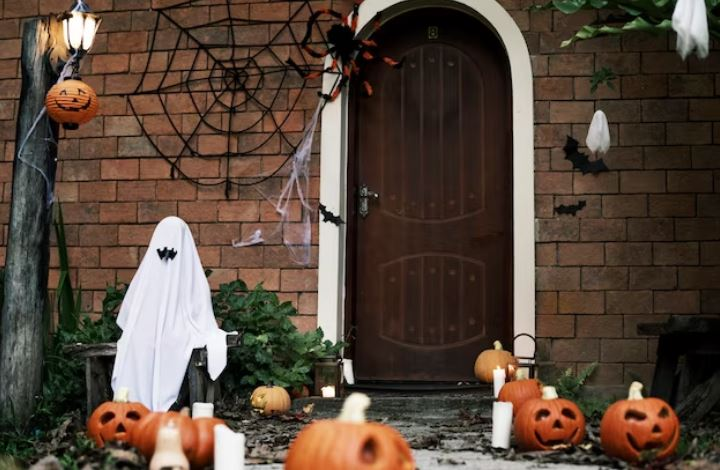
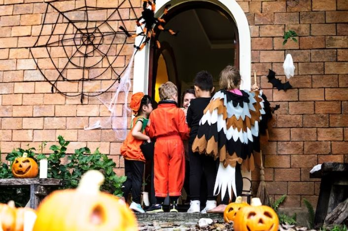
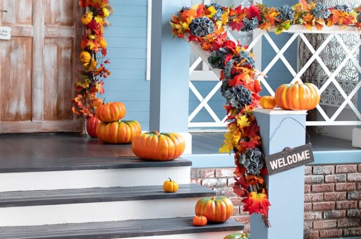
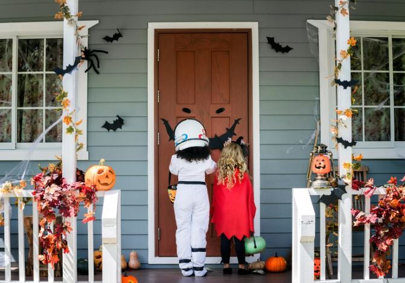
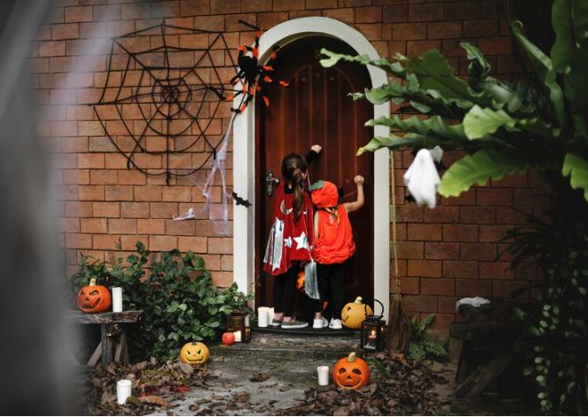
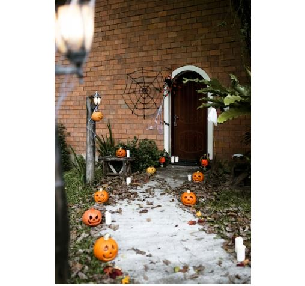
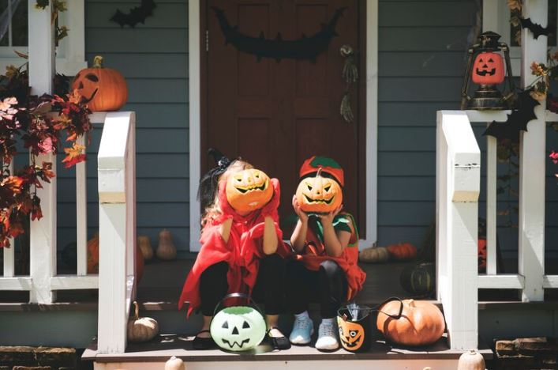
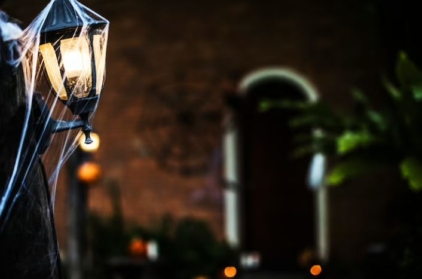

This article has been written and researched by our expert Loveable through a precise methodology. [Learn more about our methodology](https://avada.io/loveable/our-methodological.html)

[Loveable](https://avada.io/loveable/) > [Blog](https://avada.io/loveable/blog/) > [Holiday](https://avada.io/loveable/holiday/)

# 21 Unique DIY Halloween Door Decorations in 2023

Written by [Blake Simpson](https://avada.io/loveable/author/blake/) Last Updated on August 23, 2023

- [Purpose of Halloween door decorations](https://avada.io/loveable/blog/halloween-door-decorations/#wp-block-heading-2-3)
- [Classic Halloween Door Decoration Ideas](https://avada.io/loveable/blog/halloween-door-decorations/#wp-block-heading-2-10)
    - [Spooky Wreaths](https://avada.io/loveable/blog/halloween-door-decorations/#wp-block-heading-3-12)
    - [Haunted Doorways](https://avada.io/loveable/blog/halloween-door-decorations/#wp-block-heading-3-20)
    - [Pumpkin Patch Entrances](https://avada.io/loveable/blog/halloween-door-decorations/#wp-block-heading-3-28)
- [Creative and Unique Halloween Door Decoration Ideas](https://avada.io/loveable/blog/halloween-door-decorations/#wp-block-heading-2-36)
    - [Monster Mash](https://avada.io/loveable/blog/halloween-door-decorations/#wp-block-heading-3-37)
    - [Wicked Witch Welcome](https://avada.io/loveable/blog/halloween-door-decorations/#wp-block-heading-3-46)
    - [Spooky Spider Invasion](https://avada.io/loveable/blog/halloween-door-decorations/#wp-block-heading-3-55)
- [DIY Halloween Door Decorations on a Budget](https://avada.io/loveable/blog/halloween-door-decorations/#wp-block-heading-2-68)
- [Tips for Enhancing Halloween Door Decorations](https://avada.io/loveable/blog/halloween-door-decorations/#wp-block-heading-2-80)
    - [1\. Lighting Effects](https://avada.io/loveable/blog/halloween-door-decorations/#wp-block-heading-3-83)
    - [2\. Sound Effects and Spooky Music](https://avada.io/loveable/blog/halloween-door-decorations/#wp-block-heading-3-86)
    - [3\. Personalized Touches (e.g., family names, themed welcome signs)](https://avada.io/loveable/blog/halloween-door-decorations/#wp-block-heading-3-89)
- [To Conclude,](https://avada.io/loveable/blog/halloween-door-decorations/#wp-block-heading-2-93)

As the spooky season approaches, it’s time to transform your front door into a portal that evokes the perfect blend of fright and delight. Whether you prefer eerie elegance or ghoulish fun, we have gathered 21 fantastic ideas that will send shivers down your guests’ spines. 

From haunting wreaths to creepy crawlers and spellbinding signage, these decorations will make your home the talk of the neighborhood. Get ready to unleash your creativity and dive into the supernatural world of **Halloween door decor**!

## **Purpose of Halloween door decorations**

Halloween door decorations serve multiple purposes, all aimed at enhancing the spirit of the spooky season and creating a memorable experience for both residents and visitors. 

- Firstly, these decorations provide a festive and welcoming atmosphere, setting the tone for Halloween festivities. They act as a visual invitation, enticing trick-or-treaters, and party guests to step into a realm of otherworldly enchantment.
- Secondly, Halloween door decorations allow individuals to express their creativity and showcase their unique personalities. Whether it’s through creepy cobwebs, eerie lighting, or hauntingly beautiful wreaths, these decorations offer an outlet for artistic expression and personal style.
- Moreover, Halloween door decorations contribute to the overall ambiance of the neighborhood. When homes and communities come alive with ghostly apparitions, [carved pumpkins](https://avada.io/loveable/blog/halloween-pumpkin/), and spooky adornments, it creates a sense of unity and excitement. It encourages neighbors to come together, share in the Halloween spirit, and engage in a friendly competition to see who can create the most captivating and frightful displays.
- Halloween door decorations can also immerse us in the thrill of the season, unleash our imaginations, and embrace the supernatural. They provide a delightful and spine-chilling experience for all, transforming ordinary doorways into portals to a world of magic and mystery.

## **Classic Halloween Door Decoration Ideas**

Classic Halloween door decoration ideas, such as spooky wreaths, haunted doorways, and pumpkin patch entrances, offer a multitude of reasons why they should be your top choice when it comes to decking out your entrance with a touch of eerie charm. Let’s explore the captivating elements of each idea that make them a must-have for a truly bewitching Halloween experience.

### **Spooky Wreaths**

**1\. Traditional black and orange color schemes.** 

Spooky wreaths are an iconic choice that instantly set the stage for a hauntingly beautiful display. Their traditional black and orange color schemes evoke the classic Halloween palette, immediately immersing visitors in the spirit of the season.

**2\. Use of faux cobwebs, spiders, and skulls.** 

The inclusion of faux cobwebs, spiders, and skulls adds an extra dose of macabre flair, giving your door a spine-chilling touch that will send shivers down the spines of all who approach.

**3\. Incorporating eerie accents like bats or witches’ hats.** 

To further intensify the atmosphere, consider incorporating eerie [accents like bats](https://avada.io/loveable/bat-gifts/) or witches’ hats, ensuring your wreath becomes a bewitching centerpiece that captures everyone’s attention.

### **Haunted Doorways**

**1\. Creepy cloth draping and tattered curtains.** 

Haunted doorways hold a certain allure with their mysterious and foreboding appeal. By draping creepy clothes and tattered curtains around your entrance, you create the illusion of an abandoned and ghostly abode. This instantly transports your visitors to a world where the supernatural is just a step away.

**2\. Flickering candle lanterns or LED candles.** 

To enhance the eerie ambiance, adorn your doorway with [flickering candle](https://avada.io/loveable/blog/floating-candles-halloween/) lanterns or LED candles that cast an eerie glow, casting dancing shadows that play tricks on the imagination. 

**3\. Skulls, skeletons, or ghostly silhouettes.** 

Adding skulls, skeletons, or ghostly silhouettes completes the transformation, giving your door an air of haunted mystery that is sure to captivate all who encounter it.

### **Pumpkin Patch Entrances**

**1\. Displaying carved or painted pumpkins.** 

Pumpkin patch entrances bring a rustic and whimsical touch to your Halloween decor. Displaying carved or painted pumpkins not only showcases the iconic symbol of the season but also allows for endless creativity. Each pumpkin can become a [unique work of art](https://avada.io/loveable/gifts-for-art-lovers/), with sinister faces or charming designs that enchant passersby.

**2\. Hay bales, cornstalks, and fall foliage accents.** 

To create a truly immersive experience, surround your pumpkins with hay bales, cornstalks, and fall foliage accents, transporting visitors to a cozy autumnal setting.

**3\. Illuminated pumpkins or string lights for a magical touch.** 

Illuminated pumpkins or string lights can add a magical touch, casting a warm and enchanting glow that beckons all to step closer and embrace the enchantment of the season.

## **Creative and Unique Halloween Door Decoration Ideas**

### **Monster Mash**

**1\. Crafting monster eyes or mouths on the door**

Get creative and use colorful construction paper or felt to cut out eyes or mouths in various shapes and sizes. Play around with different expressions, from mischievous grins to wide-eyed surprises. You can create a row of eyes peeking out from behind the door or position a large, goofy mouth that seems ready to devour anyone who enters.

**2\. Utilizing colorful construction paper or felt**

Take advantage of vibrant construction paper or felt in a range of hues to add a burst of color to your Halloween door decorations. Choose bold and contrasting shades like electric green, vibrant purple, or neon orange. Use these materials to create additional elements like horns, ears, or hair to make your monster-themed door even more visually striking.

**3\. Adding googly eyes or glow-in-the-dark elements for extra impact**

For an extra dose of whimsy, attach googly eyes to your monster creations. These wiggly, moving eyes will bring your monsters to life and add a playful touch to your door. 

Additionally, consider incorporating glow-in-the-dark elements, such as paint or stickers, to make your monsters pop during nighttime. When the lights go out, your door will become a mesmerizing display of glowing creatures that will surely impress trick-or-treaters.

### **Wicked Witch Welcome**

**1\. Designing a witch-themed door with a pointed hat and broomstick**

Start by creating a door display that resembles a witch. Craft a large pointed hat out of black construction paper or fabric and position it at the top of the door. Attach a broomstick made from a bundle of twigs or a painted dowel beneath the hat. This combination will instantly evoke the image of a witch, setting the stage for a wickedly delightful experience.

**2\. Hanging a “Witch Parking Only” sign or cauldron prop**

Add an element of whimsy by hanging a “Witch Parking Only” sign near your door. You can create one using cardboard, paint, and spooky lettering. Alternatively, place a large cauldron prop by the entrance, either filled with eerie potions or simply serving as a decorative accent. This playful touch will entertain guests and add to the immersive witch-themed experience.

**3\. Incorporating witches’ shoes or stockings for added flair**

To enhance the authenticity of your witch-themed door, incorporate witches’ shoes or stockings as part of the decoration. Craft or purchase oversized witch shoes and position them near the door or suspend them from the doorknob. 

You can also hang witch-themed stockings filled with treats or small trinkets as a delightful surprise for trick-or-treaters. These whimsical details will add flair and charm to your witch-themed display.

### **Spooky Spider Invasion**

Here’s how you can bring this theme to life:

**1\. Creating a spider web design using black yarn or streamers**

Start by creating a spider web design on your door using black yarn or streamers. Begin by attaching one end of the yarn or streamer to a corner of the door and then crisscross it to create a web-like pattern. 

Extend the strands across the surface, gradually increasing the spacing between the threads as you move outward. Secure the ends with tape or adhesive to ensure they stay in place. This intricate web design will set the stage for a creepy and immersive experience.

**2\. Attaching large plastic spiders to the web or door frame**

Take your Spooky Spider Invasion to the next level by attaching large plastic spiders to the web or door frame. Place the spiders strategically along the yarn or streamers, positioning them as if they’re crawling or lurking. 

Opt for realistic-looking spiders to intensify the fright factor or go for colorful ones to create a more playful atmosphere. These giant arachnids will give your guests a spine-chilling surprise as they approach your door.

**3\. Using glow-in-the-dark or LED spiders for a haunting effect**

Enhance the eerie ambiance by incorporating glow-in-the-dark or LED spiders into your decoration. Charge the glow-in-the-dark spiders under a light source before darkness falls, and they will emit an ethereal glow, adding an otherworldly touch to your spider invasion. 

Alternatively, utilize LED spiders that flicker or emit a haunting glow, creating an even more chilling effect. These luminous creatures will leave a lasting impression on anyone who dares to approach your door after nightfall.

_**Related**_: Discover [Creative Ideas for Decorated Halloween Homes](https://avada.io/loveable/decorated-halloween-homes/)

## DIY Halloween Door Decorations on a Budget

Choosing these DIY Halloween door decorations on a budget is not only a creative and fun way to celebrate the spooky season, but it also allows you to save money while still achieving a captivating and festive display.

**1\. Paper Cutouts and Silhouettes**

Paper cutouts and silhouettes offer an affordable yet impactful option for decorating your door. With just a few sheets of colored paper and a pair of scissors, you can create an array of spooky shapes like bats, witches, or ghosts. 

These cutouts can be easily affixed to your door using tape or removable adhesive, instantly transforming it into a Halloween wonderland without breaking the bank.

**2\. Recycled Materials and Upcycling**

Recycled materials and upcycling provide a sustainable and budget-friendly approach to Halloween door decor. Repurpose old cardboard boxes, egg cartons, or plastic bottles to craft unique and eerie elements. 

With a bit of creativity and some paint or markers, you can transform these materials into spooky characters, haunted house facades, or even tombstones. Embracing upcycling not only saves money but also reduces waste, making it an eco-friendly choice.

**3\. Nature-inspired Elements (e.g., leaves, branches, pinecones)**

Nature-inspired elements bring an organic and enchanting touch to your Halloween door decoration without straining your budget. Gather fallen leaves, branches, and pinecones from your backyard or local park to create a rustic and autumnal atmosphere. 

Use these natural elements to adorn wreaths, garlands, or even create a haunted forest scene. Incorporate string lights or candles for an ethereal glow that enhances the charm of the outdoors. With nature as your inspiration, you can achieve a captivating Halloween display while staying within your budget.

## **Tips for Enhancing Halloween Door Decorations**

When it comes to enhancing your Halloween door decorations, there are several tips you can follow to take your display to the next level and create an immersive and memorable experience for your visitors. Here are some key ideas to consider.

### **1\. Lighting Effects**

Use lighting to create a captivating and eerie ambiance. Consider incorporating flickering LED candles, colored spotlights, or string lights to cast a spooky glow on your door and surrounding area. 

Play with shadows and angles to enhance the mysterious atmosphere. Experiment with different lighting techniques to highlight specific elements of your decorations and create a hauntingly beautiful display.

### **2\. Sound Effects and Spooky Music**

Set the mood with sound effects and music that evoke the spirit of Halloween. Place a small speaker near your door and play eerie sounds like creaking doors, howling winds, or creepy laughter. 

You can also create a playlist of spooky songs or soundtracks that will immerse your guests in a world of fright and fun. Just be mindful of the volume to ensure it complements the overall experience without overpowering conversations.

### **3\. Personalized Touches (e.g., family names, themed welcome signs)**

It is a great idea to add a personal touch to your Halloween door decorations to make them even more special and unique. Consider incorporating your family’s names or initials into the display. You can create personalized signs or banners that welcome guests to your haunted abode. 

Additionally, you can customize your decorations to match a specific theme or interest, such as a favorite movie or book. These personalized touches add a heartfelt and individualized element to your Halloween decor.

**_Related_**: Best [Personalized Halloween Gifts](https://avada.io/loveable/personalized-halloween-gifts/) For The One That Mean To You

## **To Conclude,**

With the help of these **21 DIY Halloween door decorations**, you can ignite your creativity and embrace the spirit of the spooky season. From classic options like spooky wreaths and haunted doorways to unique ideas such as monster mash, wicked witch welcome, and spooky spider invasion, there is something for every style and budget. 

Whether you choose to incorporate recycled materials, nature-inspired elements, or personalized touches, these decorations will transform your door into a captivating and immersive Halloween experience. So, let your imagination run wild, gather your crafting supplies, and get inspired to evoke the spirit of Halloween with these DIY door decorations that will leave a lasting impression on all who dare to approach!

- [Purpose of Halloween door decorations](https://avada.io/loveable/blog/halloween-door-decorations/#wp-block-heading-2-3)
- [Classic Halloween Door Decoration Ideas](https://avada.io/loveable/blog/halloween-door-decorations/#wp-block-heading-2-10)
    - [Spooky Wreaths](https://avada.io/loveable/blog/halloween-door-decorations/#wp-block-heading-3-12)
    - [Haunted Doorways](https://avada.io/loveable/blog/halloween-door-decorations/#wp-block-heading-3-20)
    - [Pumpkin Patch Entrances](https://avada.io/loveable/blog/halloween-door-decorations/#wp-block-heading-3-28)
- [Creative and Unique Halloween Door Decoration Ideas](https://avada.io/loveable/blog/halloween-door-decorations/#wp-block-heading-2-36)
    - [Monster Mash](https://avada.io/loveable/blog/halloween-door-decorations/#wp-block-heading-3-37)
    - [Wicked Witch Welcome](https://avada.io/loveable/blog/halloween-door-decorations/#wp-block-heading-3-46)
    - [Spooky Spider Invasion](https://avada.io/loveable/blog/halloween-door-decorations/#wp-block-heading-3-55)
- [DIY Halloween Door Decorations on a Budget](https://avada.io/loveable/blog/halloween-door-decorations/#wp-block-heading-2-68)
- [Tips for Enhancing Halloween Door Decorations](https://avada.io/loveable/blog/halloween-door-decorations/#wp-block-heading-2-80)
    - [1\. Lighting Effects](https://avada.io/loveable/blog/halloween-door-decorations/#wp-block-heading-3-83)
    - [2\. Sound Effects and Spooky Music](https://avada.io/loveable/blog/halloween-door-decorations/#wp-block-heading-3-86)
    - [3\. Personalized Touches (e.g., family names, themed welcome signs)](https://avada.io/loveable/blog/halloween-door-decorations/#wp-block-heading-3-89)
- [To Conclude,](https://avada.io/loveable/blog/halloween-door-decorations/#wp-block-heading-2-93)

### [Blake Simpson](https://avada.io/loveable/author/blake/)

Hi, I'm Blake from Loveable. I help people find perfect gifts for occasions like anniversaries and weddings. I also write a blog about holidays, sharing insights to make them more meaningful. Let's create unforgettable moments together!

- [Twitter](https://twitter.com/intent/tweet)
- [Facebook](https://www.facebook.com/sharer/sharer.php)
- [instagram](https://avada.io/loveable/blog/halloween-door-decorations/)
- [pinterest](https://www.pinterest.com/loveablellc/)

## Related Posts

[### 120+ Christian Birthday Wishes To Spread Your Love](https://avada.io/loveable/blog/christian-birthday-wishes/) 

[

### 35 Best 70th Birthday Ideas To Celebrate The Special Milestone

](https://avada.io/loveable/blog/70th-birthday-ideas/)

[

### 50 Best 30th Birthday Decorations for a Remarkable Birthday Bash

](https://avada.io/loveable/blog/30th-birthday-decorations/)

[

### 40 Delicious Vegan Christmas Desserts to Delight Your Palate

](https://avada.io/loveable/blog/vegan-christmas-desserts/)

[

### 60 Christmas Team Building Activities to Boost Workplace Spirit

](https://avada.io/loveable/blog/christmas-team-building-activities/)
