This article has been written and researched by our expert Loveable through a precise methodology. [Learn more about our methodology](https://avada.io/loveable/our-methodological.html)

[Loveable](https://avada.io/loveable/) > [Blog](https://avada.io/loveable/blog/) > [Holiday](https://avada.io/loveable/holiday/)

# 23 Creative Anniversary Celebration Ideas at Home to Make Your Milestone Special

Written by [Blake Simpson](https://avada.io/loveable/author/blake/) Last Updated on August 22, 2023

- [23 Creative Anniversary Celebration Ideas at Home](https://avada.io/loveable/blog/anniversary-celebration-ideas-at-home/#wp-block-heading-2-4) 
    - [1\. Order Romantic Anniversary Gifts](https://avada.io/loveable/blog/anniversary-celebration-ideas-at-home/#wp-block-heading-3-5)
    - [2\. Make a Romantic Dinner](https://avada.io/loveable/blog/anniversary-celebration-ideas-at-home/#wp-block-heading-3-7) 
    - [3\. Anniversary Scavenger Hunt](https://avada.io/loveable/blog/anniversary-celebration-ideas-at-home/#wp-block-heading-3-10)
    - [4\. Romantic Dance Together](https://avada.io/loveable/blog/anniversary-celebration-ideas-at-home/#wp-block-heading-3-12) 
    - [5\. DIY Home Spa](https://avada.io/loveable/blog/anniversary-celebration-ideas-at-home/#wp-block-heading-3-14) 
    - [6\. Build a Blanket Fort](https://avada.io/loveable/blog/anniversary-celebration-ideas-at-home/#wp-block-heading-3-17)
    - [7\. Reminiscing about a Beautiful Love Through Old Pictures](https://avada.io/loveable/blog/anniversary-celebration-ideas-at-home/#wp-block-heading-3-19)
    - [8\. Make a New Promise](https://avada.io/loveable/blog/anniversary-celebration-ideas-at-home/#wp-block-heading-3-21)
    - [9\. Watch Your Favorite Movie Together](https://avada.io/loveable/blog/anniversary-celebration-ideas-at-home/#wp-block-heading-3-24) 
    - [10\. Taste Some Wine](https://avada.io/loveable/blog/anniversary-celebration-ideas-at-home/#wp-block-heading-3-26) 
    - [11\. Dressed Up a Bit](https://avada.io/loveable/blog/anniversary-celebration-ideas-at-home/#wp-block-heading-3-29) 
    - [12\. Recreate the First Date](https://avada.io/loveable/blog/anniversary-celebration-ideas-at-home/#wp-block-heading-3-31)
    - [13\. Picnic in the Backyard](https://avada.io/loveable/blog/anniversary-celebration-ideas-at-home/#wp-block-heading-3-33)
    - [14\. Screen-Time Free](https://avada.io/loveable/blog/anniversary-celebration-ideas-at-home/#wp-block-heading-3-36)
    - [15\. Work on a DIY Project](https://avada.io/loveable/blog/anniversary-celebration-ideas-at-home/#wp-block-heading-3-38)
    - [16\. Write a Love Letter](https://avada.io/loveable/blog/anniversary-celebration-ideas-at-home/#wp-block-heading-3-40)
    - [17\. Take a Walk](https://avada.io/loveable/blog/anniversary-celebration-ideas-at-home/#wp-block-heading-3-44)
    - [18\. Adopt a Pet](https://avada.io/loveable/blog/anniversary-celebration-ideas-at-home/#wp-block-heading-3-46)
    - [19\. Decorate Your House](https://avada.io/loveable/blog/anniversary-celebration-ideas-at-home/#wp-block-heading-3-48) 
    - [20\. Gardening Together](https://avada.io/loveable/blog/anniversary-celebration-ideas-at-home/#wp-block-heading-3-52) 
    - [21\. Play the Numbers Game](https://avada.io/loveable/blog/anniversary-celebration-ideas-at-home/#wp-block-heading-3-54)
    - [22\. Do a Puzzle of Your Wedding Photo](https://avada.io/loveable/blog/anniversary-celebration-ideas-at-home/#wp-block-heading-3-56)
    - [23\. Prepare a Surprise Party](https://avada.io/loveable/blog/anniversary-celebration-ideas-at-home/#wp-block-heading-3-59)
- [Some perfect anniversary gift ideas for couples](https://avada.io/loveable/blog/anniversary-celebration-ideas-at-home/#wp-block-heading-2-61)
    - [1\. Custom Star Map With Favorite Song](https://avada.io/loveable/blog/anniversary-celebration-ideas-at-home/#wp-block-heading-3-62)
    - [2\. Personalized Steel Keychain](https://avada.io/loveable/blog/anniversary-celebration-ideas-at-home/#wp-block-heading-3-66)
    - [3\. Vinyl Record Song Lyrics Wall Art Square Canvas](https://avada.io/loveable/blog/anniversary-celebration-ideas-at-home/#wp-block-heading-3-70) 
    - [4\. Knock Knock What I Love about You Book](https://avada.io/loveable/blog/anniversary-celebration-ideas-at-home/#wp-block-heading-3-74) 
    - [5\. Sunflower Custom Song & Lyrics](https://avada.io/loveable/blog/anniversary-celebration-ideas-at-home/#wp-block-heading-3-77)
    - [6\. Custom Free Style Wooden Plaque](https://avada.io/loveable/blog/anniversary-celebration-ideas-at-home/#wp-block-heading-3-80)
    - [7\. Funny Mr. Right and Mrs. Always Right Novelty Glass](https://avada.io/loveable/blog/anniversary-celebration-ideas-at-home/#wp-block-heading-3-83)
    - [8\. Personalized White Mug](https://avada.io/loveable/blog/anniversary-celebration-ideas-at-home/#wp-block-heading-3-87)
- [Bottom line](https://avada.io/loveable/blog/anniversary-celebration-ideas-at-home/#wp-block-heading-2-91) 

Anniversaries are the best time to celebrate long-term relationships. What better way to celebrate than in the comfort of your own home? You can make your big day unforgettable without leaving the house with a little imagination and preparation. Whether you’re celebrating your first year together or your 50th, let’s create the feeling cozy as a [first date](https://avada.io/loveable/what-to-talk-about-on-first-date/).

It’s an indispensable part of any relationship, so your partner will definitely be disappointed if you don’t prepare for something special on that day. Don’t be impolite and wait to get delicate hints; Be proactive. You can also consider of [Anniversary gift from Lovable](https://avada.io/loveable/anniversary/), where you can get many meaningful gifts at reasonable prices. The choices are infinite, so you don’t have to break the bank to make your anniversary memorable.

Whatever your choice, there are lots of anniversary celebration ideas at home to make your milestone memorable. So, take out a pen and paper and begin brainstorming. What should we do to add more to the album’s top of beautiful moments in life?

## **23 Creative Anniversary Celebration Ideas at Home** 

### **1\. Order Romantic Anniversary Gifts**

Who doesn’t love to get gifts from their lover, right? Several possibilities are available, depending on your budget and your companion’s preferences. The choices are unlimited; you may even have a personalized present that reflects your sincerity. If you find it hard to do, browsing to the end, there are some great suggestions for you.

### **2\. Make a Romantic Dinner** 

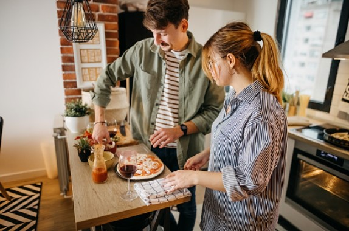

Set the table with flames, bouquets, and relaxing sounds to create a particular mood. Choose a meal that both of you enjoy, or come up with something new together. Consider trying a new dish together or enrolling in a virtual cooking class to [acquire a new skill](https://avada.io/loveable/learning-new-skill/) or cuisine. You may even make it a surprise by not revealing the menu until dinner time.

### **3\. Anniversary Scavenger Hunt**

Begin by crafting a series of clues or riddles that will lead your partner to specific locations within the house. Consider including tiny gifts such as their favorite sweets or a handmade love note. The more difficult it is to find something, the more precious it is. The ultimate goal may be a large prize, such as a rare gift or a romantic candlelight supper. 

### **4\. Romantic Dance Together** 

If you and your lover are into dancing, why not host a romantic dance party at your home for your anniversary? Who said that Anniversary has to be formal and quiet? Make a of your favorite love songs, turn down the lights, and make room for dancing. Dancing is not only entertaining, but it’s also a terrific way to connect and celebrate your love. 

### **5\. DIY Home Spa** 

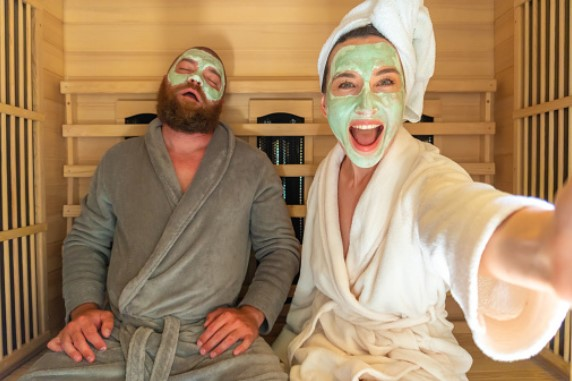

Why not make your own home spa? For your anniversary party, turn your house into a [special spa](https://avada.io/loveable/pampering-gifts-women/). Use candles, soothing music, and dark lighting to create a cozy ambiance. A DIY home spa is a terrific home anniversary idea. You can create a spa experience right at home for a romantic and refreshing anniversary celebration with a little creativity and preparation.

### **6\. Build a Blanket Fort**

Back to the time as a child, by building a [cozy blanket](https://avada.io/loveable/photo-blanket-gift/) fort on your anniversary, is it your childhood dream? By hanging blankets and adding cushions along with fairy lights, you may create a cozy alcove in your private room. Make it even more special by including snacks, novels, or some music to enjoy while snuggling up together. 

### **7\. Reminiscing about a Beautiful Love Through Old Pictures**

Digging through old images of the two of you is a touching way to commemorate your anniversary. Collect your photo albums, settle back, and relive the moments you’ve made together. You may even create a game out of it by trying to recollect specific moments from each photo 

### **8\. Make a New Promise**

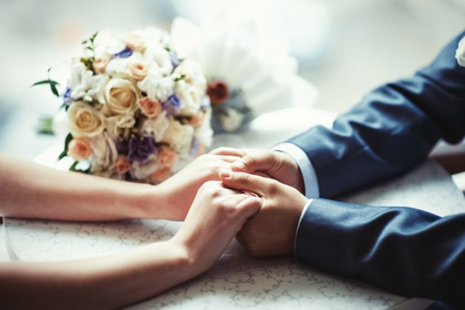

Consider your partnership and discuss your future goals. This might be as easy as agreeing to prepare supper for each other once a week or as serious as renewing your wedding vows. It’s a lovely way to renew your commitment to each other. However, be careful with your words and make sure your promises are kept. 

### **9\. Watch Your Favorite Movie Together** 

First, list a series of favorite films to choose from for this Anniversary. A romantic and sentimental approach to commemorate your anniversary at home is to watch a movie together. You might choose a new or old one, but it must be one that both of you appreciate. Turn down the lights, pop some popcorn, and curl up on the sofa to enjoy.

### **10\. Taste Some Wine** 

A little bit of alcohol will be the best choice to sublimate your emotions. Prepare for a tasting session at home by gathering your favorite wines or experimenting with new ones. Don’t forget to serve them with delectable nibbles such as cheese or chocolate. Enjoy each other’s company while sipping wonderful wine and making new memories.

### **11\. Dressed Up a Bit** 

Take this chance to dress up in the best dress you prepared for this party. Be well-prepared, from clothes to hair and cosmetics, or even take out your wedding gown to dust off. This might be a great way to relive your wedding day, the time when each other gave the best.

### **12\. Recreate the First Date**

Anyway, the first date is the most impressive moment you have the first look at someone. It’s an unforgettable memory in your album. Returning to the place where you initially met or had your [first date](https://avada.io/loveable/what-to-talk-about-on-first-date/). Try to reproduce the same atmosphere as eating the same meal, listening to the same music, or even dressing in the same clothing you did that day. 

### **13\. Picnic in the Backyard**

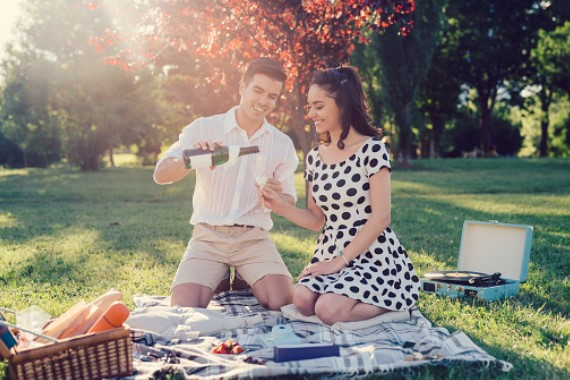

If you don’t want to go far, use your backyard as a tourist destination by redesigning it nicely. Setting up decorations in your backyard for a romantic picnic with your significant other. Make some tasty finger appetizers and a wonderful environment. For couples who wish to spend quality time together in a tranquil and personal atmosphere, a backyard picnic is a terrific anniversary celebration option.

### **14\. Screen-Time Free**

We might sometimes forget how great it is to be screen-free in this digital world. Make a rule to go screen-free in your anniversary celebration at home. Put away your smartphones and computers and spend time together without interruptions. You may [play board games](https://avada.io/loveable/gifts-board-game-lovers/), prepare supper together,  or simply have a profound talk.

### **15\. Work on a DIY Project**

Handmade products are never bad ideas for expressing love. Choose a project that both of you are interested in and spend the whole day making something lovely for your house. This anniversary project is not only enjoyable but also functional, as you will have a finished product to appreciate for years to come.

### **16\. Write a Love Letter**

Because of the popularity of texting, everyone gradually forgets that a letter is the best representative of showing gratitude. Spend some time conveying your emotions and recollections genuinely and meaningfully. Remember to wrap it in a lovely envelope with a personal touch, such as a spray of your favorite perfume or a little sketch. 

_**Related**_: [How To Write A Love Letter to Your Love](https://avada.io/loveable/write-a-love-letter/)

### **17\. Take a Walk**

Walking hand in hand is a simple yet significant way to honor the event, whether you take a stroll around your neighborhood or a next-door park. Use this time to confide in your relationship or simply enjoy each other’s company. It’s an excellent opportunity to disconnect from hardship and reconnect with your sweetheart in a tranquil space.

### **18\. Adopt a Pet**

Getting a new friend to make fun of your home ( a dog, cat, bird, etc.). Adopting a pet together is a wonderful way to spend your anniversary at home. Think about getting a pet from your local animal shelter or rescue group. Besides having a new friend to take care of and love, you’ll also be helping an animal in need. 

### **19\. Decorate Your House** 

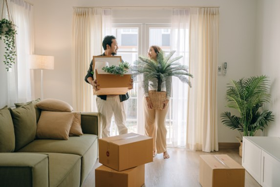

Decorating your house together is also a great idea to enjoy each other’s company. Let’s fill the space with candles, fairy lights and romantic music. You may also display pictures, artwork, or mementos from memorable times in your relationship. 

**_Related_**: [35 Best Home Decor Gift Ideas Will Make Up Your Lovely House](https://avada.io/loveable/home-decor-gifts/)

### **20\. Gardening Together** 

Make friends with nature to escape the city’s hustle and smoking. You might create a little herb garden together or plant some flowers. You’ll have something to look forward to as you see it develop and blossom. Nothing is better than taking a deep breath in your own world.

### **21\. Play the Numbers Game**

If you’ve been married for ten years, you may organize ten separate activities for the day, one for each year of your marriage. This anniversary idea is focused on having fun together.

### **22\. Do a Puzzle of Your Wedding Photo**

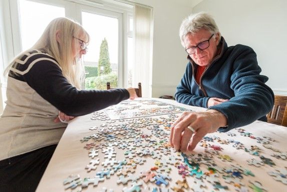

You can easily take some sets of Your [Wedding Photo Puzzle](https://avada.io/loveable/personalized-puzzles/) at suitable prices. A considerate idea to spend your anniversary at home is to put together a jigsaw puzzle of an iconic wedding photo. It may also be a calming hobby to exercise your brain. Let’s put the pieces back together to bring back those wonderful times.

### **23\. Prepare a Surprise Party**

Preparing a surprise party for your partner will be an exciting way to commemorate an anniversary celebration idea at home. Keep the party a secret from your spouse and carefully organize the timing. When your partner steps in, give her/him your sincerity with some prepared gifts.  

## **Some perfect anniversary gift ideas for couples**

### [**1\. Custom Star Map With Favorite Song**](https://loveable.ai/products/custom-star-map-with-favorite-song-best-personalized-acrylic-plaque-gift-for-anniversary-209ihpbnap156)

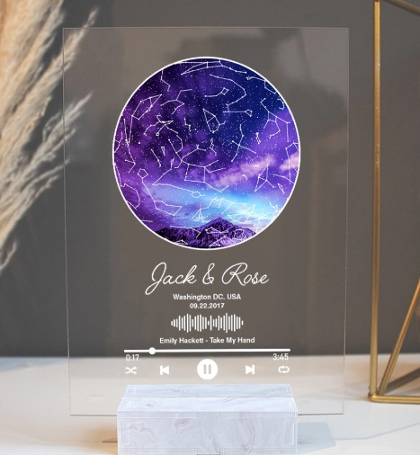

A personalized star map featuring your favorite music is a unique and considerate anniversary present. This customizable acrylic plaque shows a map of the stars on the date and place of your choosing.  

The high-quality acrylic material is long-lasting, sturdy, and environmentally friendly, making it even more personal with your favorite music. It’s the ideal method to remember your love and the unique occasions you’ve enjoyed together.

### [**2\. Personalized Steel Keychain**](https://loveable.ai/products/my-soulmate-my-everything-custom-name-and-photo-personalized-steel-keychain-best-gifts-for-couple-208ihpthkc070-1)

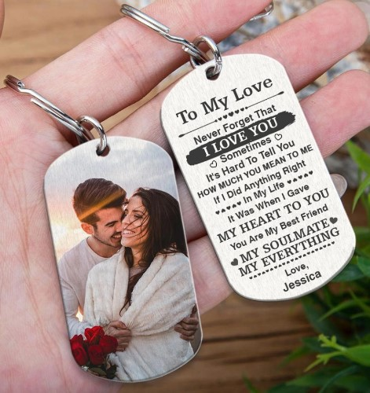

This keychain is made of high-quality stainless steel and has your personalized name and photo-etched on it. The keychain is also a useful item on a daily basis, reminding your partner of your love and gratitude every time they use their keys.

The personalized photo makes it into a one-of-a-kind keepsake. On the opposite side, a customized photo adds a personal touch to remember wonderful memories. It’s a nice and meaningful way to commemorate a special occasion while showing love. 

### [**3\. Vinyl Record Song Lyrics Wall Art Square Canvas**](https://loveable.ai/products/vinyl-record-song-lyrics-custom-wall-art-square-canvas-for-music-loving-husband-or-wife-sustainable-gift-208ihpthca116) 

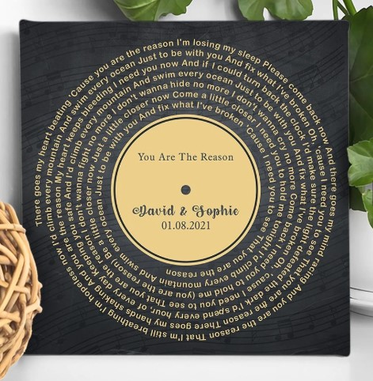

Looking for a unique and bespoke anniversary present for your music-obsessed wife or husband? Consider personalized vinyl record song lyrics wall art! Choose your favorite song lyrics and print them into a stunning work of art on a square canvas. 

It’s a wonderful opportunity to honor your love as well as your shared passion for music. What you need to do is just leave personalized information and your best memorable lyrics. 

### [**4\. Knock Knock What I Love about You Book**](https://www.amazon.com/Knock-What-Love-About-Journal/dp/1601064934) 

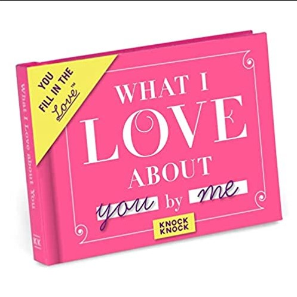

Consider the Knock Knock “What I Love About You” book as a fun gift for your Anniversary. With thoughtful suggestions and areas for your own personal thoughts, this fill-in-the-blank book lets you customize your love letter to your lover. It’s an ideal present for a love partner who values heartfelt gestures and the power of words. Let’s jot down your best memories!

### [**5\. Sunflower Custom Song & Lyrics**](https://loveable.ai/products/sunflower-custom-song-lyrics-personalized-names-date-best-gift-for-couple-custom-shape-wooden-sign-walldoor-hanging-anniversary-gift-new-home-party-gift-for-new-married-couple-302icnlnrw163)

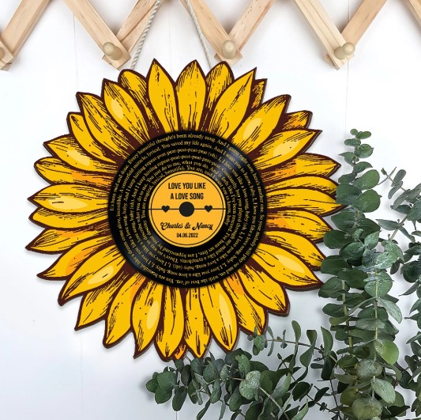

The Sunflower Custom Song & Lyrics is a personalized wooden sign that is perfect as an anniversary gift for couples. You can make the sign special with the couple’s names, a date, and lyrics from their favorite music. The wooden sign is unique with its design of a sunflower made of high-quality materials. This one-of-a-kind and considerate present is sure to make any couple smile and will be a treasured remembrance of their love. 

### [**6\. Custom Free Style Wooden Plaque**](https://loveable.ai/products/custom-free-style-wooden-plaque-best-gift-for-family-member-for-himher-for-husbandwife-on-anniversary-best-personalized-birthdays-gift-212ihnbnwp969)

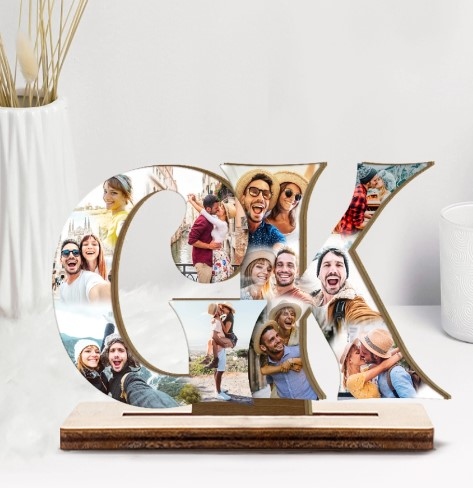

A personalized freestyle wooden plaque is to memorialize the moments. If there are many photos considered and you don’t know which is the best one, this product will help you to combine them all. From letters to numbers, you are entitled to choose the most meaningful ones with a set of 11 photos to print on. Each plaque is constructed of high-quality wood and is available in a number of sizes and forms to complement any decoration style. 

### **7**[**. Funny Mr. Right and Mrs. Always Right Novelty Glass**](https://www.amazon.com/Funny-Wedding-Gifts-Novelty-Engagement/dp/B06XF8MKZR)

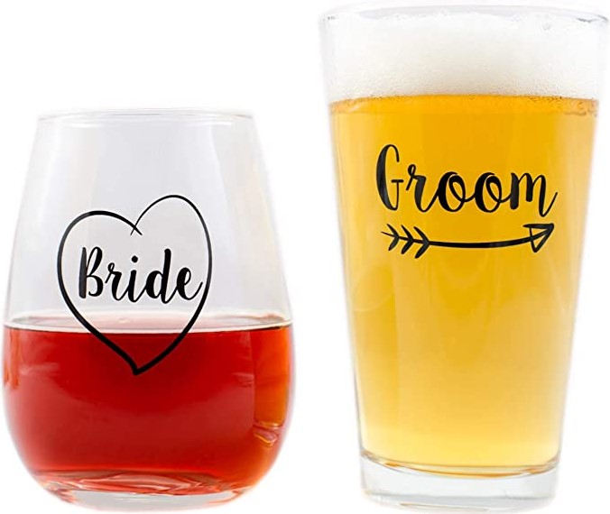

Having the same items is always interesting with couples because they can feel like the two are in pairs. So, when using couples’ gifts, they can always see the other’s picture. 

The set includes 2 items, one with the word “Mr. Right” presented for men and certainly, “Mrs. Always Right” for women. The glasses are built of high-quality materials to ensure their durability

### **8**[**. Personalized White Mug**](https://loveable.ai/products/custom-couple-mug-3-styles-personalized-white-mug-set-gifts-for-valentines-day-anniversaries-birthdays-special-occasions-209ihpthmu124)

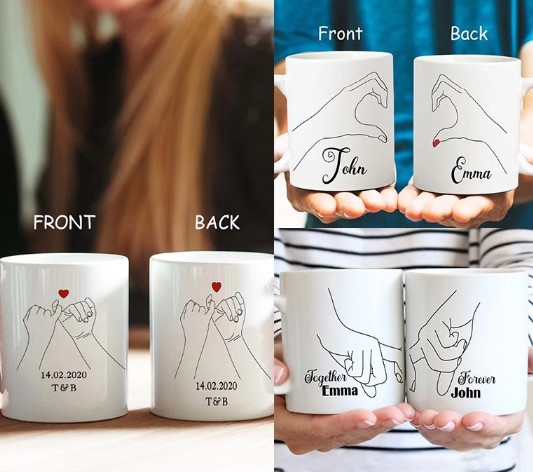

With a double-sided design and three styles for couples, it is promised to be the best gift for the anniversary celebration. The image of hand-in-hand present for forever love that always being together.

This useful and heartfelt gift is ideal for sipping coffee, tea, or any other beverage. A personalized mug is a gift that your significant other may use and enjoy every day.

## **Bottom line** 

The anniversary celebration is one of the most valuable times of the year for couples. Sitting together to review what we have experienced together through the years. Be well-prepared to see your partner’s smile – the smile of happiness and satisfaction. 

The most important thing is that you’re together and taking the time to enjoy each other, no matter how you choose to celebrate. This list of **23 Creative Anniversary Celebration Ideas at Home to Make Your Milestone Special** is the best reference for you to consider.

Besides, don’t forget to check out some surprise gifts above. Good luck and Happy Anniversary! 

- [23 Creative Anniversary Celebration Ideas at Home](https://avada.io/loveable/blog/anniversary-celebration-ideas-at-home/#wp-block-heading-2-4) 
    - [1\. Order Romantic Anniversary Gifts](https://avada.io/loveable/blog/anniversary-celebration-ideas-at-home/#wp-block-heading-3-5)
    - [2\. Make a Romantic Dinner](https://avada.io/loveable/blog/anniversary-celebration-ideas-at-home/#wp-block-heading-3-7) 
    - [3\. Anniversary Scavenger Hunt](https://avada.io/loveable/blog/anniversary-celebration-ideas-at-home/#wp-block-heading-3-10)
    - [4\. Romantic Dance Together](https://avada.io/loveable/blog/anniversary-celebration-ideas-at-home/#wp-block-heading-3-12) 
    - [5\. DIY Home Spa](https://avada.io/loveable/blog/anniversary-celebration-ideas-at-home/#wp-block-heading-3-14) 
    - [6\. Build a Blanket Fort](https://avada.io/loveable/blog/anniversary-celebration-ideas-at-home/#wp-block-heading-3-17)
    - [7\. Reminiscing about a Beautiful Love Through Old Pictures](https://avada.io/loveable/blog/anniversary-celebration-ideas-at-home/#wp-block-heading-3-19)
    - [8\. Make a New Promise](https://avada.io/loveable/blog/anniversary-celebration-ideas-at-home/#wp-block-heading-3-21)
    - [9\. Watch Your Favorite Movie Together](https://avada.io/loveable/blog/anniversary-celebration-ideas-at-home/#wp-block-heading-3-24) 
    - [10\. Taste Some Wine](https://avada.io/loveable/blog/anniversary-celebration-ideas-at-home/#wp-block-heading-3-26) 
    - [11\. Dressed Up a Bit](https://avada.io/loveable/blog/anniversary-celebration-ideas-at-home/#wp-block-heading-3-29) 
    - [12\. Recreate the First Date](https://avada.io/loveable/blog/anniversary-celebration-ideas-at-home/#wp-block-heading-3-31)
    - [13\. Picnic in the Backyard](https://avada.io/loveable/blog/anniversary-celebration-ideas-at-home/#wp-block-heading-3-33)
    - [14\. Screen-Time Free](https://avada.io/loveable/blog/anniversary-celebration-ideas-at-home/#wp-block-heading-3-36)
    - [15\. Work on a DIY Project](https://avada.io/loveable/blog/anniversary-celebration-ideas-at-home/#wp-block-heading-3-38)
    - [16\. Write a Love Letter](https://avada.io/loveable/blog/anniversary-celebration-ideas-at-home/#wp-block-heading-3-40)
    - [17\. Take a Walk](https://avada.io/loveable/blog/anniversary-celebration-ideas-at-home/#wp-block-heading-3-44)
    - [18\. Adopt a Pet](https://avada.io/loveable/blog/anniversary-celebration-ideas-at-home/#wp-block-heading-3-46)
    - [19\. Decorate Your House](https://avada.io/loveable/blog/anniversary-celebration-ideas-at-home/#wp-block-heading-3-48) 
    - [20\. Gardening Together](https://avada.io/loveable/blog/anniversary-celebration-ideas-at-home/#wp-block-heading-3-52) 
    - [21\. Play the Numbers Game](https://avada.io/loveable/blog/anniversary-celebration-ideas-at-home/#wp-block-heading-3-54)
    - [22\. Do a Puzzle of Your Wedding Photo](https://avada.io/loveable/blog/anniversary-celebration-ideas-at-home/#wp-block-heading-3-56)
    - [23\. Prepare a Surprise Party](https://avada.io/loveable/blog/anniversary-celebration-ideas-at-home/#wp-block-heading-3-59)
- [Some perfect anniversary gift ideas for couples](https://avada.io/loveable/blog/anniversary-celebration-ideas-at-home/#wp-block-heading-2-61)
    - [1\. Custom Star Map With Favorite Song](https://avada.io/loveable/blog/anniversary-celebration-ideas-at-home/#wp-block-heading-3-62)
    - [2\. Personalized Steel Keychain](https://avada.io/loveable/blog/anniversary-celebration-ideas-at-home/#wp-block-heading-3-66)
    - [3\. Vinyl Record Song Lyrics Wall Art Square Canvas](https://avada.io/loveable/blog/anniversary-celebration-ideas-at-home/#wp-block-heading-3-70) 
    - [4\. Knock Knock What I Love about You Book](https://avada.io/loveable/blog/anniversary-celebration-ideas-at-home/#wp-block-heading-3-74) 
    - [5\. Sunflower Custom Song & Lyrics](https://avada.io/loveable/blog/anniversary-celebration-ideas-at-home/#wp-block-heading-3-77)
    - [6\. Custom Free Style Wooden Plaque](https://avada.io/loveable/blog/anniversary-celebration-ideas-at-home/#wp-block-heading-3-80)
    - [7\. Funny Mr. Right and Mrs. Always Right Novelty Glass](https://avada.io/loveable/blog/anniversary-celebration-ideas-at-home/#wp-block-heading-3-83)
    - [8\. Personalized White Mug](https://avada.io/loveable/blog/anniversary-celebration-ideas-at-home/#wp-block-heading-3-87)
- [Bottom line](https://avada.io/loveable/blog/anniversary-celebration-ideas-at-home/#wp-block-heading-2-91) 

### [Blake Simpson](https://avada.io/loveable/author/blake/)

Hi, I'm Blake from Loveable. I help people find perfect gifts for occasions like anniversaries and weddings. I also write a blog about holidays, sharing insights to make them more meaningful. Let's create unforgettable moments together!

- [Twitter](https://twitter.com/intent/tweet)
- [Facebook](https://www.facebook.com/sharer/sharer.php)
- [instagram](https://avada.io/loveable/blog/anniversary-celebration-ideas-at-home/)
- [pinterest](https://www.pinterest.com/loveablellc/)

## Related Posts

[### 120+ Christian Birthday Wishes To Spread Your Love](https://avada.io/loveable/blog/christian-birthday-wishes/) 

[

### 35 Best 70th Birthday Ideas To Celebrate The Special Milestone

](https://avada.io/loveable/blog/70th-birthday-ideas/)

[

### 50 Best 30th Birthday Decorations for a Remarkable Birthday Bash

](https://avada.io/loveable/blog/30th-birthday-decorations/)

[

### 40 Delicious Vegan Christmas Desserts to Delight Your Palate

](https://avada.io/loveable/blog/vegan-christmas-desserts/)

[

### 60 Christmas Team Building Activities to Boost Workplace Spirit

](https://avada.io/loveable/blog/christmas-team-building-activities/)
