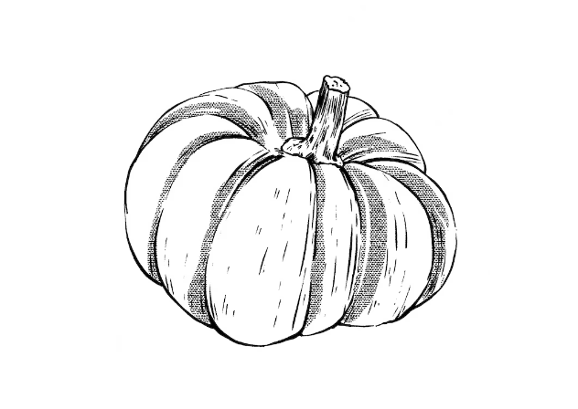
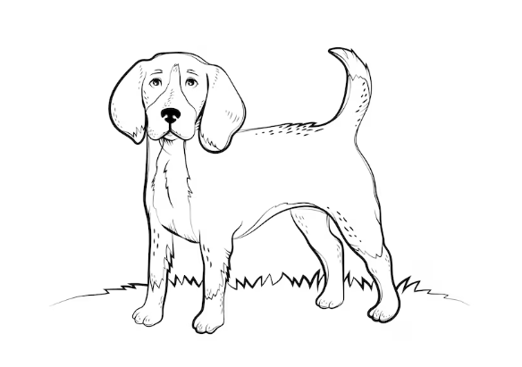

This article has been written and researched by our expert Loveable through a precise methodology. [Learn more about our methodology](https://avada.io/loveable/our-methodological.html)

[Loveable](https://avada.io/loveable/) > [Blog](https://avada.io/loveable/blog/) > [Holiday](https://avada.io/loveable/holiday/)

# 24 Scary and Easy Halloween Drawing Ideas for Anyone in 2023

Written by [Blake Simpson](https://avada.io/loveable/author/blake/) Last Updated on October 03, 2023

- [24 Easy Halloween Drawing Ideas for Kids and Beginners](https://avada.io/loveable/blog/halloween-drawing-ideas/#wp-block-heading-2-3)
    - [Pumpkin](https://avada.io/loveable/blog/halloween-drawing-ideas/#wp-block-heading-3-6)
    - [Candy](https://avada.io/loveable/blog/halloween-drawing-ideas/#wp-block-heading-3-9)
    - [Ghost](https://avada.io/loveable/blog/halloween-drawing-ideas/#wp-block-heading-3-12)
    - [Bat](https://avada.io/loveable/blog/halloween-drawing-ideas/#wp-block-heading-3-15)
    - [Skull](https://avada.io/loveable/blog/halloween-drawing-ideas/#wp-block-heading-3-18)
    - [Haunted House](https://avada.io/loveable/blog/halloween-drawing-ideas/#wp-block-heading-3-21)
    - [Cat](https://avada.io/loveable/blog/halloween-drawing-ideas/#wp-block-heading-3-26)
    - [Zombie](https://avada.io/loveable/blog/halloween-drawing-ideas/#wp-block-heading-3-29)
    - [Witch](https://avada.io/loveable/blog/halloween-drawing-ideas/#wp-block-heading-3-32)
    - [Dog](https://avada.io/loveable/blog/halloween-drawing-ideas/#wp-block-heading-3-35)
    - [Candy Corn](https://avada.io/loveable/blog/halloween-drawing-ideas/#wp-block-heading-3-39)
    - [Potion](https://avada.io/loveable/blog/halloween-drawing-ideas/#wp-block-heading-3-42)
    - [Frankenstein](https://avada.io/loveable/blog/halloween-drawing-ideas/#wp-block-heading-3-45)
    - [Moon](https://avada.io/loveable/blog/halloween-drawing-ideas/#wp-block-heading-3-48)
    - [Skeleton](https://avada.io/loveable/blog/halloween-drawing-ideas/#wp-block-heading-3-51)
    - [Spiderweb](https://avada.io/loveable/blog/halloween-drawing-ideas/#wp-block-heading-3-54)
    - [Witch Hat](https://avada.io/loveable/blog/halloween-drawing-ideas/#wp-block-heading-3-57)
    - [Owl](https://avada.io/loveable/blog/halloween-drawing-ideas/#wp-block-heading-3-60)
    - [Tree](https://avada.io/loveable/blog/halloween-drawing-ideas/#wp-block-heading-3-63)
    - [Mummy](https://avada.io/loveable/blog/halloween-drawing-ideas/#wp-block-heading-3-66)
    - [Wolf](https://avada.io/loveable/blog/halloween-drawing-ideas/#wp-block-heading-3-69)
    - [Shadow](https://avada.io/loveable/blog/halloween-drawing-ideas/#wp-block-heading-3-72)
    - [Costume](https://avada.io/loveable/blog/halloween-drawing-ideas/#wp-block-heading-3-75)
- [Bottom line](https://avada.io/loveable/blog/halloween-drawing-ideas/#wp-block-heading-2-81)

Are you ready to unlock your creativity and embrace the spooky spirit of Halloween? Look no further than the exciting world of Halloween drawing ideas! Although you’re a budding artist or just seeking a fun and interesting exercise, Halloween drawing provides limitless opportunities to bring your creativity to life. In this article, we will explore the top 24 funny and creative **Halloween drawing** **ideas** that are sure to ignite your artistic flair and leave a lasting impression.

Not only is Halloween drawing a fantastic way to express your creativity, but it also serves as a wonderful means of personal expression. Through your drawings, you can showcase your unique perspective on this festive season, incorporating elements that resonate with your own experiences and [Halloween traditions](https://avada.io/loveable/blog/halloween-traditions/). Whether you’re drawing a beloved Halloween tradition, a memorable moment from a spooky story, or a humorous take on a classic [Halloween symbol](https://avada.io/loveable/blog/halloween-symbols-explained/), your artwork will reflect your own personal vision of Halloween.

## **24 Easy Halloween Drawing Ideas for Kids and Beginners**

Halloween drawing allows you to capture the essence of this beloved holiday in a unique and playful way. From adorable pumpkins and mischievous ghosts to wicked witches and eerie landscapes, there’s no shortage of inspiration to be found. These drawing ideas will suit your own style and preferences, whether you like a whimsical and lighter approach or appreciate digging into the spookier aspect of Halloween.

One of the great things about Halloween drawing is that it offers the perfect opportunity to infuse humor into your artwork. Let your imagination run wild as you create funny and amusing [Halloween-themed cartoon characters](https://avada.io/loveable/blog/famous-halloween-cartoon-characters/) and scenes. Whether it’s a goofy vampire, a silly monster, or a comical skeleton, these drawings are sure to bring a smile to your face and to the faces of those who view your artwork. Now, explore 24 funny and creative ideas for Halloween drawing with us.

### **Pumpkin**

Nothing says Halloween quite like a pumpkin, and it’s the perfect place to begin our list of funny and creative ideas for Halloween drawing. Embrace the spirit of the season by capturing the essence of a spooky Jack-O-Lantern in your artwork. Let your imagination run wild as you carve out a face with mischievous eyes, a toothy grin, and a [floating candle](https://avada.io/loveable/blog/floating-candles-halloween/) within. Play with different expressions and designs, from silly and lighthearted to sinister and eerie. Bring this classic Halloween emblem to life with each stroke of your pencil or brush, and set the mood for a spooktacular sketching experience.

### **Candy**

Indulging in sweets and candy is one of the most delightful aspects of Halloween drawing. So why not capture the sugary goodness in your Halloween drawings? Let your creativity run wild as you imagine a whimsical world filled with colorful candies, lollipops, and treats galore. Draw candy corns, gummy worms, and chocolate bars with playful expressions, giving them a life of their own. Add a touch of humor by illustrating mischievous candies pulling pranks or engaging in silly activities. With each stroke of your pencil or paintbrush, bring the joy and sweetness of Halloween treats to your drawings, creating a deliciously fun and memorable experience.

### **Ghost**

Enjoy the Halloween drawing ideas and spirit with a fun and delightful ghost illustration. Prepare to bring your paper to life by drawing a comical ghost hovering in the air with a cheerful and mischievous atmosphere. Give your ghost a happy grin or a humorous stance to add a bit of whimsy. Allow your creativity to run wild as you experiment with various forms, sizes, and styles for your ghostly creation. This easy yet beautiful Halloween drawing concept is likely to bring smiles and joy to people who see it, whether it’s a charming and plump ghost or a comical and exaggerated one.

### **Bat**

Explore the dark and mysterious world of bats with this unique [Halloween animal](https://avada.io/loveable/blog/halloween-animals/) drawing idea. Unleash your artistic skills and bring a cute little bat to life on your paper. A bat sketch, with its unique wings and sharp ears, may lend a bit of fun and curiosity to your Halloween drawing. Experiment with different stances and emotions to give your bat individuality and charm. From a smiling bat to a mischievous one, let your creativity take flight as you create a charming and funny depiction of this nocturnal creature. Get ready to be captivated by the charm and creativity of your bat Halloween drawing.

### **Skull**

Embark on a chilling artistic journey by exploring the realm of skulls in your Halloween drawings. Create a spooky yet amusing atmosphere with a playful twist by adding a witch hat to your skull drawing. The contrast between the eerie skull and the whimsical hat is sure to bring a smile to your face. A skull design, with its empty eyes and toothy grin, maybe a fun and imaginative touch to your Halloween drawing. Allow your creativity to go wild as you experiment with various styles and flourishes to make your skull drawing really one-of-a-kind. Prepare to demonstrate your artistic abilities and attract people with this amusing and unique Halloween drawing concept.

### **Haunted House**

Get ready to showcase your artistic talents and bring the Halloween spirit to life on paper with a funny and creative Halloween drawing ideas. Immerse yourself in the spirit of Halloween as you sketch a whimsical and spooky haunted house, an iconic symbol of the holiday. Channel your creativity to depict a charmingly eerie abode, complete with creaky doors, twisted trees, and mysterious ghosts lurking in the shadows.

Let your imagination run wild and add playful details like jack-o’-lanterns or a full moon illuminating the scene. This captivating drawing will transport your audience to a world where imagination and fright collide. Whether you find haunted houses thrilling or terrifying, this drawing will surely captivate all.

So, grab your pencils and pens, and get ready to create a Halloween masterpiece that captures the essence of this spooky season. Happy drawing!

### **Cat**

Unleash your creativity this Halloween with adorable cat drawings wearing witch hats. Cats have long been associated with the mysterious and enchanting atmosphere of the holiday, making them a perfect subject for your Halloween-themed artwork. Let your imagination soar as you bring these feline characters to life, adding whimsical details like wide grins or mischievous glints in their eyes. These charming cat images will add a touch of enchantment and humor to your collection of Halloween drawings ideas with their pointed hats and cunning faces. So take your pencils and prepare to be enchanted by the world of amusing and inventive Halloween cat paintings.

### **Zombie**

Using a creepy zombie hand reaching out from a tomb, you can bring the undead to life. This Halloween drawing concept is ideal for individuals who wish to add a creepy element to their artwork. This zombie hand illustration will send shivers down your spine with its decaying flesh, skeleton fingers, and scary atmosphere. Prepare to show off your artistic abilities as you capture the eerie essence of Halloween in this terrifying artwork. Whether you choose a more realistic or cartoonish approach, this zombie hand painting is guaranteed to stand out in your collection of amusing and unique Halloween artworks.

### **Witch**

With a stunning pencil sketch of a witch soaring over the night sky on her trusty broomstick, you can immerse yourself in the mythical realm of Halloween. This Halloween drawing concept captures the appeal and magic of witches, as their flowing robes and pointed hats create a classic picture linked with the event. Allow your imagination to run wild as you bring this quirky witch to life on paper, portraying the spirit of Halloween in a fun and artistic manner. This witch design is likely to cast a spell on your mind and encourage laughter and creativity, whether you want a precise and realistic representation or a more whimsical and cartoonish version. 

### **Dog**

Embrace the spirit of fun and creativity as you bring a touch of whimsy to your collection of funny and creative Halloween drawings ideas. Unleash your artistic talents with a delightful Halloween drawing of a dog donning a charming lion costume, combining two beloved elements of Halloween: furry friends and imaginative costumes.

Capture the essence of joy and whimsy as you sketch this lovable canine transformed into a fierce lion, complete with a majestic mane and a mischievous grin. Whether you choose to portray the dog’s likeness with intricate detail or opt for a more cartoonish and humorous style, this Halloween drawing ideas is guaranteed to evoke smiles and laughter. So gather your creative equipment and let your creativity run wild. Bring this fuzzy companion to life on paper and you’ll have a fun and delightful concept that will fascinate everyone who sees it. With this adorable sketch of a dog wearing a lion costume, you can enjoy Halloween and show off your artistic talent. Have fun sketching!

### **Candy Corn**

A lovely Halloween drawing incorporating the well-known candy corn will satisfy your artistic demands. This imaginative and hilarious idea offers a lighthearted spin on the customary Halloween treat. Draw this delightful treat with imagination, adding comedy and appeal to your collection of amusing and imaginative Halloween paintings. Let your creativity run wild with vivid colors and exaggerated features, whether you decide to represent the candy corn as a costume or as a single figure. This adorable drawing concept will undoubtedly inspire smiles and convey the jovial Halloween atmosphere. So gather your creative supplies, whether they be analog or digital, and set off on a humorous artistic journey with this candy corn masterpiece.

### **Potion**

With this fascinating Halloween drawing concept, you may unleash your imagination and explore the ethereal realm of potions. With this amusing potion painting, you may imagine yourself as a skillful witch or wizard creating a wonderful elixir. Let your creativity go wild as you fill your potion painting with enchanted ingredients and fanciful components, such as bubbling cauldrons and multicolored mixes. Use humorous labels or oddball touches to give your artwork a lively and humorous touch. This sketch of a potion is the ideal chance for you to show off your artistic talent and add a little enchantment to your Halloween-themed crafts. Grab your pencils or computer tools, then start creating some entrancing art!

### **Frankenstein**

Take part in the Halloween mood with this cute and odd Frankenstein artwork. In your painting, bring the lovable monster to life by adding entertaining and imaginative touches. Try various facial characteristics and expressions to give Frankenstein a cute and amusing appearance. To give this iconic creature your own spin, use humorous details like enormous bolts, a cheeky smirk, or even a chic accessory. This Frankenstein design is certain to arouse the curiosity and enjoyment of everyone who sees it, whether you choose to depict it traditionally or add your own creative twist to it. Let your imagination go wild as you use your artistic talent and sense of humor to bring this well-known Halloween figure to life.

### **Moon**

This endearing illustration of a ghost lurking behind the moon is a great way to unleash your imagination and start a fun adventure into the realm of Halloween artwork. Using this straightforward yet compelling concept, you may experiment with various methods and aesthetics to bring this fantastical setting to life. Investigate the use of shade and highlighting to enhance depth and character and give the composition a sense of mystery and intrigue. Allow your imagination to soar as you see the cheeky ghost snatching a look from behind the glimmering moon and charming everyone who sees your artwork. You have the chance to demonstrate your artistic talent and pique people’ curiosity with this lighthearted Halloween drawing concept.

### **Skeleton**

Delve into the fascinating realm of Halloween drawings with this simplified yet captivating skeleton idea. Embrace the challenge of bringing a skeleton to life on your canvas as you explore the intricate details of its bony structure. This creative concept allows you to infuse your own unique style into the drawing, while keeping it approachable and fun. Play with shading and line work to give your skeleton character and depth, showcasing your artistic skills in a lighthearted and entertaining manner. This Halloween drawing concept is likely to capture and amuse viewers of all ages, whether you decide to emphasize the creepy features or add comic components. As you bring your skeleton masterpiece to life and savor the whimsy of the season, let your imagination run wild.

### **Spiderweb**

A mesmerizing spiderweb is a lovely way to add a new spin to a traditional Halloween drawing ideas. Explore the rich patterns and fine threads that make up this eerie yet hypnotic artwork to let your creativity run wild. Bring the spiderweb to life with each pencil stroke, adding your own special touches and artistic flare. This Halloween drawing concept is likely to arouse a sense of mystery and interest, whether you decide to include a humorous spider swinging from the web or decorate it with complex details. Embrace the challenge and the spooktacular atmosphere as you craft a magnificent spider web creation that will wow onlookers.

### **Witch Hat**

Any drawing may be made into a Halloween masterpiece by adding the witch hat, which serves as the season’s unofficial symbol. Your artwork gains an entrancing atmosphere with the simple addition of this magical accessory. The addition of a witch hat lends an air of enchantment and mystery to any subject, whether it be an adorable animal, a silly figure, or even a picturesque setting. Embrace Halloween’s lively and inventive spirit by experimenting with various looks and patterns. Bring your Halloween drawings to life by adding a little Halloween magic, and let your artistic talents show.

### **Owl**

A cute owl is a great addition to your notebook that will allow you to indulge in the whimsy of Halloween art. The owl fits the Halloween mood wonderfully thanks to its big eyes and fluffy feathers. Explore different stances and emotions to add a touch of personality as you capture its beauty and bring it to life in your painting. Allow your creativity to soar as you play around with various hues and patterns to produce a one-of-a-kind owl that captures the essence of Halloween. Take advantage of the chance to add a humorous and artistic touch to your work to create a truly magnificent illustration for Halloween.

### **Tree**

The spooky and intriguing tree Halloween drawing design is ideal for any Halloween-themed collection. Bring to life a ghostly tree with withered limbs reaching out like bony fingers against a starry sky to capture the spirit of the season. By using elements like dangling bats or the outline of a spectral figure, you may utilize your creative abilities to give the painting a feeling of mystery and interest. To create a genuinely eerie and gloomy landscape, let your imagination soar as you experiment with shading techniques and explore with contrasting hues. Artists of all skill levels will be enchanted and inspired by this Halloween drawing concept.

### **Mummy**

Begin a spine-chilling artistic experience with this hilarious mummy drawing concept that will have you caught up in creativity. As you depict this legendary creature of the underworld in your painting, let your imagination run wild. Draw a mummy with bandages covering its body and mischievous-looking eyes prowling out. Play around with various shading and texture methods to give the bandages a genuine, worn-out appearance. Maybe you could even give your Halloween-themed artwork a comedic spin by showing the mummy chasing an innocent victim. Put together to reveal your creative talent as you create a mummy artwork that will both enthrall and frighten people.

### **Wolf**

Draw this gorgeous wolf howling at the moon to inspire your artistic expression. Sketch this famous landscape that conjures a feeling of mystery and intrigue to capture the essence of Halloween drawing night. Intricately depict the wolf, highlighting its smooth coat and piercing eyes as it points its nose toward the full moon. Use shading methods to contrast bright and dark areas, improving the drawing’s ethereal atmosphere. Bring the wolf’s eerie howl to life with each pencil stroke to give your Halloween-themed artwork a touch of class and mystery. As you begin this captivating painting adventure, let your creativity soar.

### **Shadow**

Discover the fascinating world of shadows and add a touch of whimsy to your Halloween drawings. Explore the art of capturing light and dark contrasts as you create intriguing and playful shadow-themed illustrations. Experiment with different objects and their shadows, letting your imagination roam free. Whether it’s a mischievous cat casting an elongated shadow, a spooky figure lurking in the darkness, or a whimsical scene filled with enchanting silhouettes, incorporating shadows into your Halloween drawings can bring a unique and captivating dimension to your artwork. Embrace the magic of shadows and unlock a new level of creativity as you embark on this delightful and imaginative drawing adventure.

### **Costume**

Let your artistic skills bring Halloween costumes to life on paper with these fun and creative drawing ideas. Capture the excitement and creativity of Halloween by sketching out your favorite costumes, whether it’s a spooky vampire, a charming princess, a daring superhero, or a whimsical creature. Use your imagination to add intricate details and vibrant colors to showcase the unique features of each costume. Whether you’re drawing a fantastical ensemble or a classic character, let your pencil or pen bring out the playful and imaginative spirit of Halloween. Explore different styles and techniques to create captivating illustrations that celebrate the joy and creativity of Halloween costumes.

**_See More:_**

- [Halloween Pickup Lines](https://avada.io/loveable/blog/halloween-pickup-lines/)

- Spooky [Halloween Arch Ideas](https://avada.io/loveable/halloween-arch/)

## **Bottom line**

In conclusion, these top 24 funny and creative Halloween drawing ideas are sure to spark your imagination and bring out your artistic talents. From pumpkins and ghosts to witches and wolves, each drawing idea offers a unique opportunity to embrace the spooky and lighthearted essence of Halloween. Whether you’re a beginner or an experienced artist, these drawing ideas provide a range of options to explore and express your creativity. Let your imagination run wild as you bring these characters and elements to life on paper. So grab your pencils, markers, or digital tools, and let the Halloween spirit inspire you to create whimsical, funny, and imaginative drawings that will delight and entertain others. Happy drawing and Happy Halloween!

- [24 Easy Halloween Drawing Ideas for Kids and Beginners](https://avada.io/loveable/blog/halloween-drawing-ideas/#wp-block-heading-2-3)
    - [Pumpkin](https://avada.io/loveable/blog/halloween-drawing-ideas/#wp-block-heading-3-6)
    - [Candy](https://avada.io/loveable/blog/halloween-drawing-ideas/#wp-block-heading-3-9)
    - [Ghost](https://avada.io/loveable/blog/halloween-drawing-ideas/#wp-block-heading-3-12)
    - [Bat](https://avada.io/loveable/blog/halloween-drawing-ideas/#wp-block-heading-3-15)
    - [Skull](https://avada.io/loveable/blog/halloween-drawing-ideas/#wp-block-heading-3-18)
    - [Haunted House](https://avada.io/loveable/blog/halloween-drawing-ideas/#wp-block-heading-3-21)
    - [Cat](https://avada.io/loveable/blog/halloween-drawing-ideas/#wp-block-heading-3-26)
    - [Zombie](https://avada.io/loveable/blog/halloween-drawing-ideas/#wp-block-heading-3-29)
    - [Witch](https://avada.io/loveable/blog/halloween-drawing-ideas/#wp-block-heading-3-32)
    - [Dog](https://avada.io/loveable/blog/halloween-drawing-ideas/#wp-block-heading-3-35)
    - [Candy Corn](https://avada.io/loveable/blog/halloween-drawing-ideas/#wp-block-heading-3-39)
    - [Potion](https://avada.io/loveable/blog/halloween-drawing-ideas/#wp-block-heading-3-42)
    - [Frankenstein](https://avada.io/loveable/blog/halloween-drawing-ideas/#wp-block-heading-3-45)
    - [Moon](https://avada.io/loveable/blog/halloween-drawing-ideas/#wp-block-heading-3-48)
    - [Skeleton](https://avada.io/loveable/blog/halloween-drawing-ideas/#wp-block-heading-3-51)
    - [Spiderweb](https://avada.io/loveable/blog/halloween-drawing-ideas/#wp-block-heading-3-54)
    - [Witch Hat](https://avada.io/loveable/blog/halloween-drawing-ideas/#wp-block-heading-3-57)
    - [Owl](https://avada.io/loveable/blog/halloween-drawing-ideas/#wp-block-heading-3-60)
    - [Tree](https://avada.io/loveable/blog/halloween-drawing-ideas/#wp-block-heading-3-63)
    - [Mummy](https://avada.io/loveable/blog/halloween-drawing-ideas/#wp-block-heading-3-66)
    - [Wolf](https://avada.io/loveable/blog/halloween-drawing-ideas/#wp-block-heading-3-69)
    - [Shadow](https://avada.io/loveable/blog/halloween-drawing-ideas/#wp-block-heading-3-72)
    - [Costume](https://avada.io/loveable/blog/halloween-drawing-ideas/#wp-block-heading-3-75)
- [Bottom line](https://avada.io/loveable/blog/halloween-drawing-ideas/#wp-block-heading-2-81)

### [Blake Simpson](https://avada.io/loveable/author/blake/)

Hi, I'm Blake from Loveable. I help people find perfect gifts for occasions like anniversaries and weddings. I also write a blog about holidays, sharing insights to make them more meaningful. Let's create unforgettable moments together!

- [Twitter](https://twitter.com/intent/tweet)
- [Facebook](https://www.facebook.com/sharer/sharer.php)
- [instagram](https://avada.io/loveable/blog/halloween-drawing-ideas/)
- [pinterest](https://www.pinterest.com/loveablellc/)

## Related Posts

[### 120+ Christian Birthday Wishes To Spread Your Love](https://avada.io/loveable/blog/christian-birthday-wishes/) 

[

### 35 Best 70th Birthday Ideas To Celebrate The Special Milestone

](https://avada.io/loveable/blog/70th-birthday-ideas/)

[

### 50 Best 30th Birthday Decorations for a Remarkable Birthday Bash

](https://avada.io/loveable/blog/30th-birthday-decorations/)

[

### 40 Delicious Vegan Christmas Desserts to Delight Your Palate

](https://avada.io/loveable/blog/vegan-christmas-desserts/)

[

### 60 Christmas Team Building Activities to Boost Workplace Spirit

](https://avada.io/loveable/blog/christmas-team-building-activities/)
