This article has been written and researched by our expert Loveable through a precise methodology. [Learn more about our methodology](https://avada.io/loveable/our-methodological.html)

[Loveable](https://avada.io/loveable/) > [Blog](https://avada.io/loveable/blog/) > [Holiday](https://avada.io/loveable/holiday/)

# 25 Best Beginner Halloween Carving Ideas for Halloween 2023

Written by [Blake Simpson](https://avada.io/loveable/author/blake/) Last Updated on September 08, 2023

- [25 Creative Beginner Halloween Carving Ideas](https://avada.io/loveable/blog/beginner-halloween-carving-ideas/#wp-block-heading-2-3)
    - [Spider Web Pumpkin](https://avada.io/loveable/blog/beginner-halloween-carving-ideas/#wp-block-heading-3-4)
    - [Kitty Carved Pumpkin](https://avada.io/loveable/blog/beginner-halloween-carving-ideas/#wp-block-heading-3-7)
    - [Owl Pumpkin](https://avada.io/loveable/blog/beginner-halloween-carving-ideas/#wp-block-heading-3-10)
    - [Bean Bag Toss Pumpkin](https://avada.io/loveable/blog/beginner-halloween-carving-ideas/#wp-block-heading-3-13)
    - [Jigsaw Pumpkin](https://avada.io/loveable/blog/beginner-halloween-carving-ideas/#wp-block-heading-3-16)
    - [Toothy Grin Pumpkin](https://avada.io/loveable/blog/beginner-halloween-carving-ideas/#wp-block-heading-3-19)
    - [Haunted House Carved Pumpkin](https://avada.io/loveable/blog/beginner-halloween-carving-ideas/#wp-block-heading-3-22)
    - [Cat Skeleton Pumpkin](https://avada.io/loveable/blog/beginner-halloween-carving-ideas/#wp-block-heading-3-25)
    - [Impaled Fence Pumpkin](https://avada.io/loveable/blog/beginner-halloween-carving-ideas/#wp-block-heading-3-28)
    - [Scared Pumpkin](https://avada.io/loveable/blog/beginner-halloween-carving-ideas/#wp-block-heading-3-31)
    - [Pumpkin Doll House](https://avada.io/loveable/blog/beginner-halloween-carving-ideas/#wp-block-heading-3-34)
    - [Pumpkin Emojis](https://avada.io/loveable/blog/beginner-halloween-carving-ideas/#wp-block-heading-3-37)
    - [Cottage Pumpkin](https://avada.io/loveable/blog/beginner-halloween-carving-ideas/#wp-block-heading-3-40)
    - [Eyeball Pumpkin](https://avada.io/loveable/blog/beginner-halloween-carving-ideas/#wp-block-heading-3-43)
    - [Constellation Pumpkin](https://avada.io/loveable/blog/beginner-halloween-carving-ideas/#wp-block-heading-3-46)
    - [Harry Potter Pumpkin](https://avada.io/loveable/blog/beginner-halloween-carving-ideas/#wp-block-heading-3-49)
    - [Witch Pumpkin](https://avada.io/loveable/blog/beginner-halloween-carving-ideas/#wp-block-heading-3-52)
    - [Batman-Themed Pumpkin](https://avada.io/loveable/blog/beginner-halloween-carving-ideas/#wp-block-heading-3-55)
    - [Name Carved Pumpkin](https://avada.io/loveable/blog/beginner-halloween-carving-ideas/#wp-block-heading-3-58)
    - [Pumpkin Sign](https://avada.io/loveable/blog/beginner-halloween-carving-ideas/#wp-block-heading-3-61)
    - [Spider Pumpkin](https://avada.io/loveable/blog/beginner-halloween-carving-ideas/#wp-block-heading-3-64)
    - [Pumpkin Barrel](https://avada.io/loveable/blog/beginner-halloween-carving-ideas/#wp-block-heading-3-67)
    - [Music Note Pumpkin](https://avada.io/loveable/blog/beginner-halloween-carving-ideas/#wp-block-heading-3-70)
    - [Cupcake Pumpkin](https://avada.io/loveable/blog/beginner-halloween-carving-ideas/#wp-block-heading-3-73)
    - [Pineapple Pumpkin](https://avada.io/loveable/blog/beginner-halloween-carving-ideas/#wp-block-heading-3-76)
- [Bottom Line](https://avada.io/loveable/blog/beginner-halloween-carving-ideas/#wp-block-heading-2-79)

If you are looking to create some Halloween magic this year, carving a pumpkin is the way to go! We’ve got you covered with **25 beginner Halloween carving ideas** and designs that will transform a simple pumpkin into a spooktacular [Halloween pumpkin masterpiece](https://avada.io/loveable/blog/halloween-pumpkin/).

With our beginner Halloween carving ideas, you and your family can let your creativity shine. Have fun choosing from more detailed designs like the jigsaw pumpkin and the honeycomb pumpkin, or keep it simple with cute options like a cat or Mickey Mouse. Let’s make this Halloween memorable with creative Jack-o’-Lanterns that everyone will remember!

## **25 Creative Beginner Halloween Carving Ideas**

### **Spider Web Pumpkin**

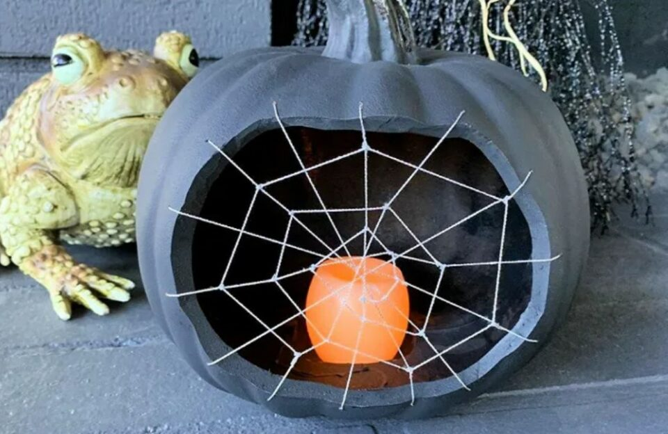

Take on this [Halloween crafting idea](https://avada.io/loveable/blog/easy-halloween-craft-ideas/) to brighten up your spooky decor. With just a bit of sewing skill, you can have an impressive fall display – whether it’s on your front door or at your dining table. Complement the look with a flameless candle for an extra touch of romance.

### **Kitty Carved Pumpkin**

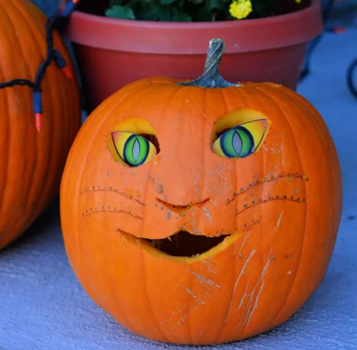

Pumpkin carving is an enjoyable [fall activity](https://avada.io/loveable/blog/fall-dates-ideas/) that families anticipate each year. If you are part of one of those families, your kids will be delighted with this kitty-carved pumpkin – it’s so much fun! The result is a cute and festive decoration that’s sure to impress trick-or-treaters and party guests alike.

### **Owl Pumpkin**

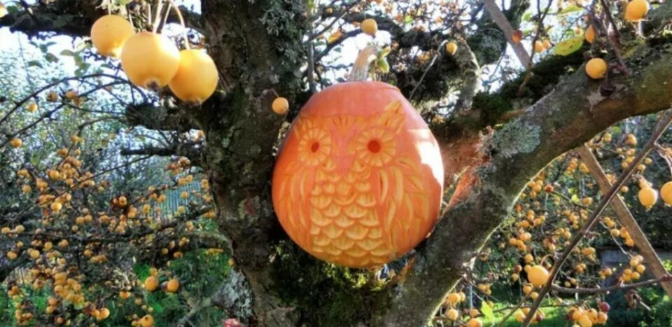

For those who enjoy carving pumpkins for Halloween, this beginner Halloween carving idea of crafting an owl out of a pumpkin costs almost nothing and is truly special. After creating your masterpiece, proudly display it on a tree in the backyard or indoors on shelves or a [Halloween mantel](https://avada.io/loveable/blog/halloween-mantel-decor-ideas/) – you won’t be able to help to smile at the sight!

### **Bean Bag Toss Pumpkin**

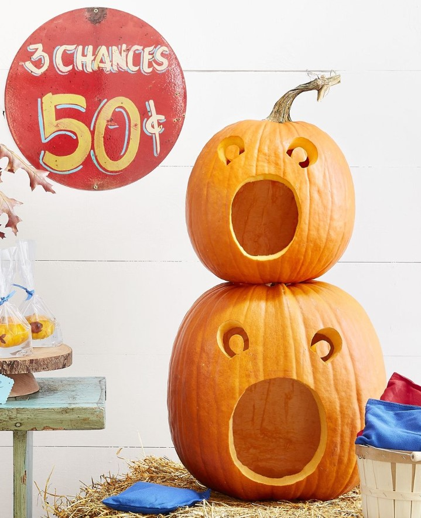

Of course, beginner Halloween carving ideas can also be [DIY backyard games](https://www.hgtv.com/design/make-and-celebrate/handmade/diy-backyard-games-pictures)! The whole gang will have so much fun playing bean bag toss at your harvest celebration. It is super easy to play: just throw the bean bags into the gourds’ mouths for points – 10 points for the bottom and 20 points for the top.

### **Jigsaw Pumpkin**

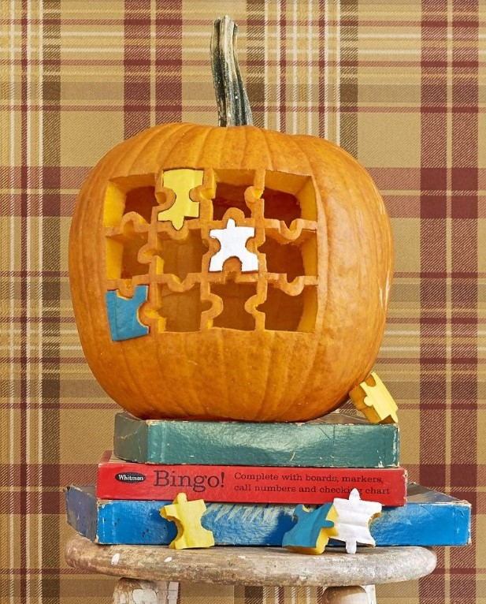

With minimal carving skills required, jigsaw pumpkin carving is an ideal way for kids and adults alike to make some fun and creative designs! You can also encourage your kids to [complete the puzzle](https://avada.io/loveable/gift-puzzle-lovers/) for some sweet rewards.

### **Toothy Grin Pumpkin**

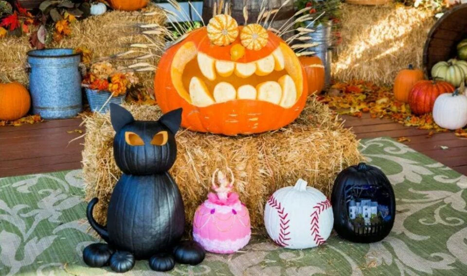

Give your pumpkin a big, toothy smile this Halloween! Depending on how you place the eyes, you can make it look friendly and festive or spooky and frightful.

### **Haunted House Carved Pumpkin**

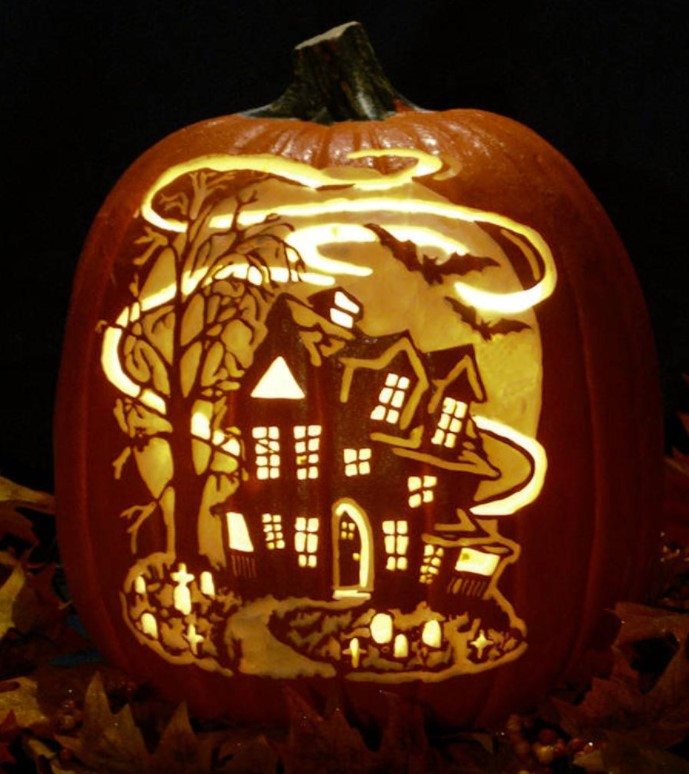

If you’re a fan of spooky [Halloween decorations](https://avada.io/loveable/halloween-decoration-ideas/), you’ll be delighted to hear about this haunted house with its carved pumpkins! Not only are these pumpkins super-easy to make, but they also are the perfect welcome for trick-or-treaters. The moonlight streaming through the haunted house’s windows makes it ideal for adding some frightfulness to your dining table.

### **Cat Skeleton Pumpkin**

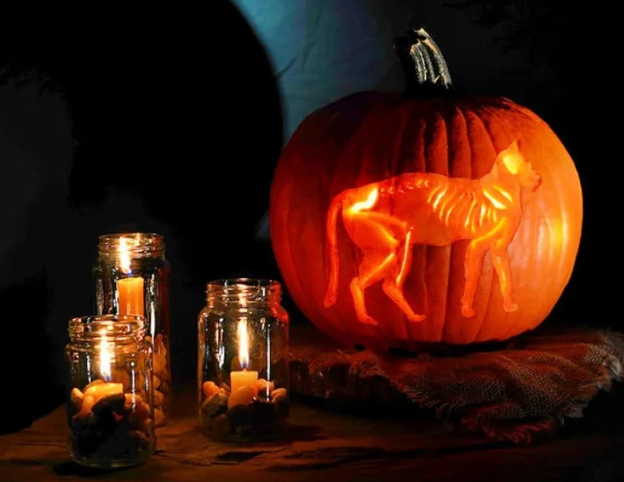

If you’ve been waiting a whole year just to [carve some pumpkins](https://avada.io/loveable/blog/halloween-pumpkin/)? This beginner Halloween carving idea of a cat skeleton Jack-o’-lantern is ideal for your Halloween festivities. Not only will it make trick-or-treaters say wow, but it won’t cost you a dime to set up this spooky scene. So go ahead and give it a try this year – you won’t be disappointed!

### **Impaled Fence Pumpkin**

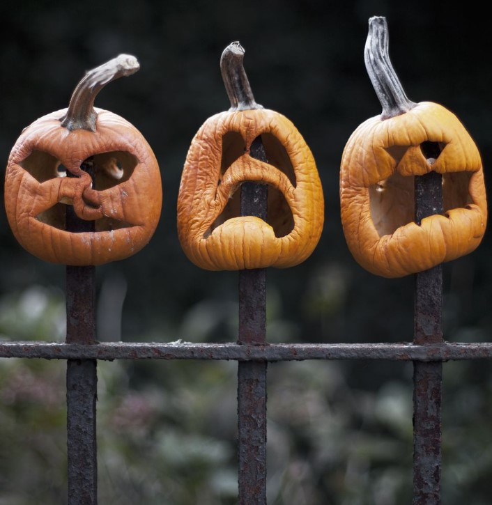

A row of fencing adorned with pumpkins with impaled faces will surely scare anyone who passes by. Give your overripe pumpkins a smushed look by smashing them with a hammer or tossing them on the ground. Be careful not to crack them completely!

### **Scared Pumpkin**

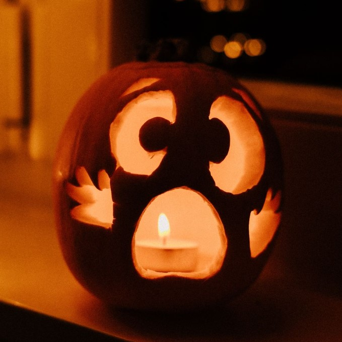

Carved pumpkins can be scary, too!  Make this beginner Halloween carving idea look like he’s just seen a ghost. To create a scared pumpkin this Halloween, carve out simple shapes such as triangles for the eyes and nose, and a half-moon shape for the mouth. Place a light inside, and you’ll have an even spookier glow.

### **Pumpkin Doll House**

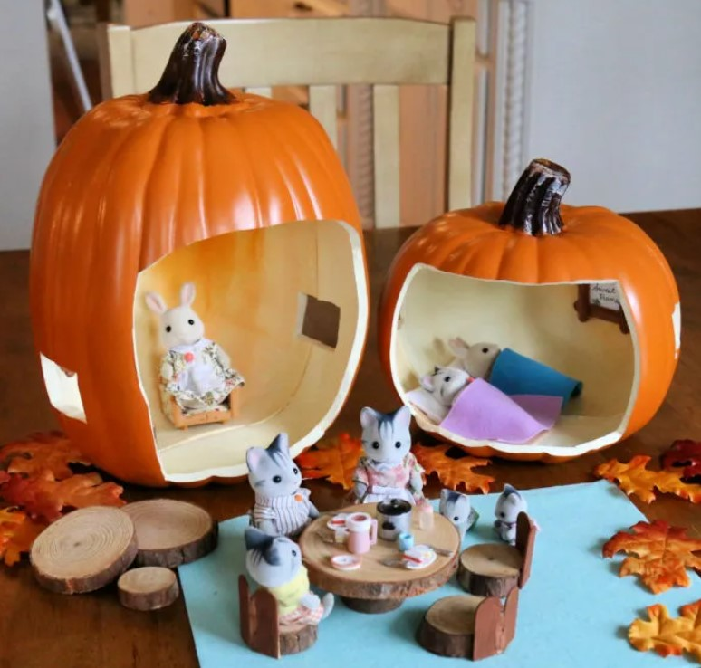

Do you know how easy the carvable foam pumpkins from most craft stores are to carve this time of year? If so, then you’ll love this adorable pumpkin dollhouse for your kids. Not only is it a fun activity they can do over and over again, but it makes a great decoration in their room too.

### **Pumpkin Emojis**

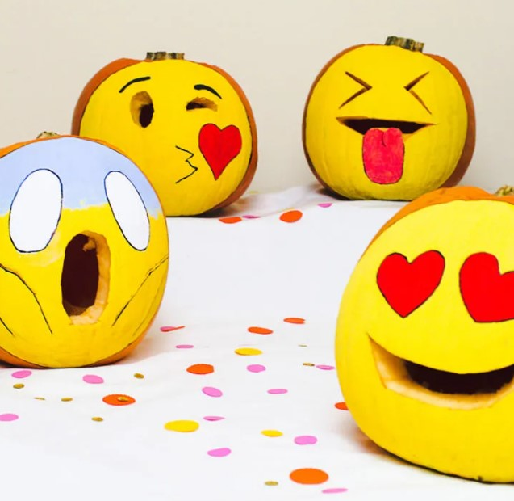

If you are fond of using emojis on a daily basis, this beginner Halloween carving idea will be the perfect treat. This emoji-themed design will add a great bit of fun to your home decoration or porch without costing you a fortune.

### **Cottage Pumpkin**

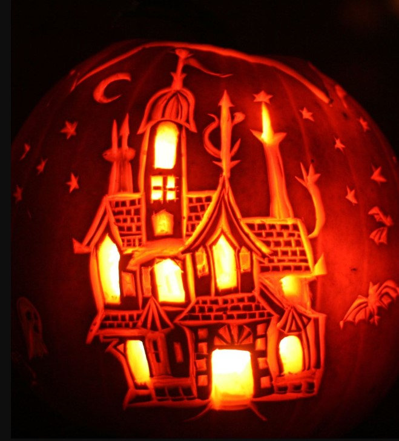

Are you ready to add a spooky touch to your [home decoration this Halloween](https://avada.io/loveable/decorated-halloween-homes/)? If so, then you will love working on this creepy cottage pumpkin! This handcrafted pumpkin features a little Halloween scene within foam pumpkins, making it ideal for displaying on your table or mantel. And the best part? You can use it even year after year for frightful fun.

### **Eyeball Pumpkin**

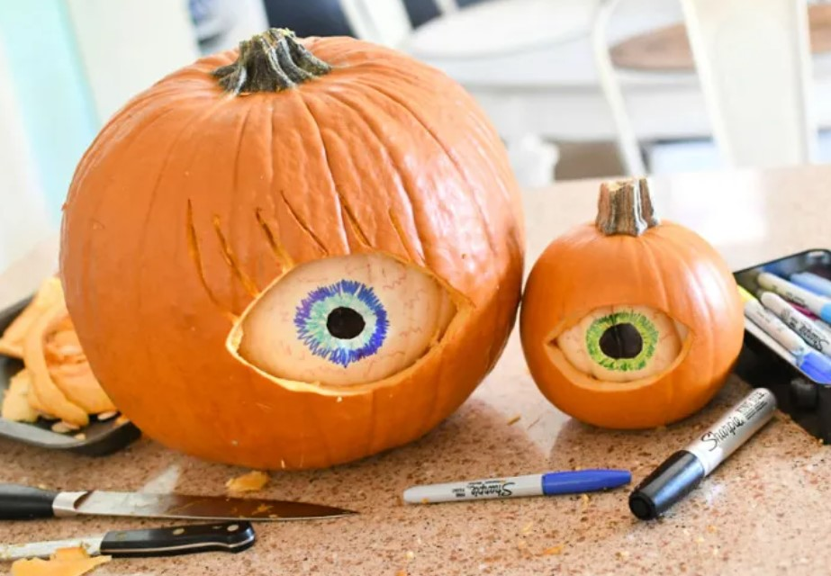

This Halloween season, get creative with a spooky eyeball pumpkin carving. By combining an orange pumpkin and a smaller white one, you can achieve a beautiful 3D effect. This is an awesome way to add some flair to your seasonal decorations – it is simple but looks impressive.

### **Constellation Pumpkin**

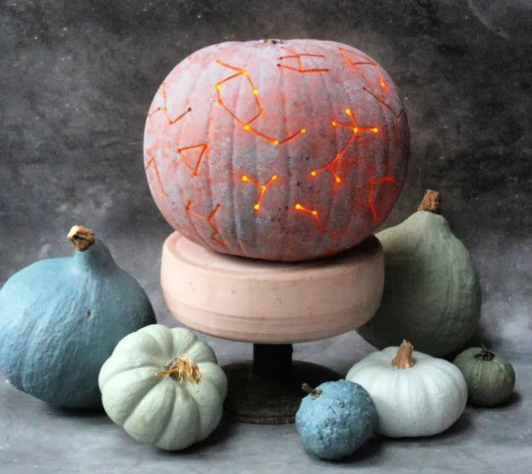

Halloween decoration does not have to be scary, even if you have kids who may not be afraid of the typical spooky pumpkins. Creating constellation pumpkins indoors or outdoors is a great way to take your fall spirit to the next level without scaring your kids. It’s easy, and you probably already have everything you need in your home.

### **Harry Potter Pumpkin**

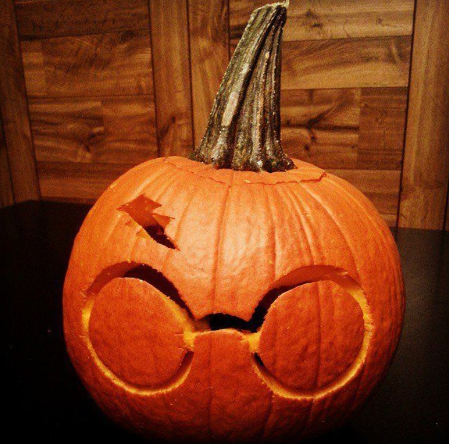

If you are a Potterhead, this Harry Potter pumpkin carving is the perfect Halloween activity to celebrate this year. No matter if you are a newbie, this beginner Halloween carving idea will be sure to look amazing on your dining table. Plus, it makes a creative decoration on your porch that will surprise any trick-or-treaters.

### **Witch Pumpkin**

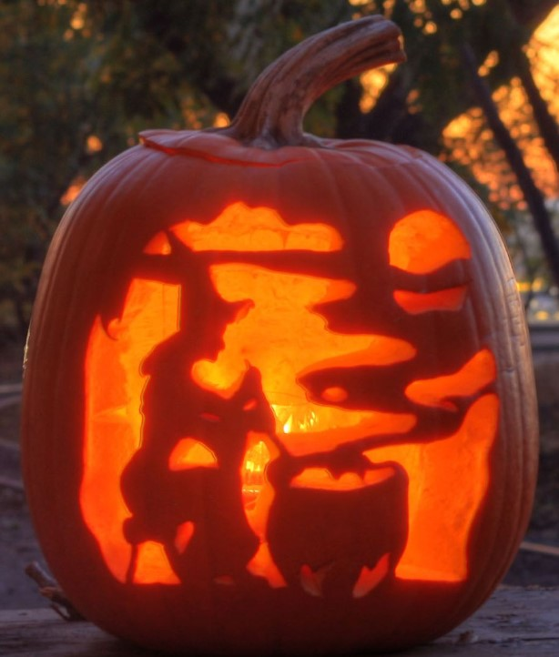

For beginner carving enthusiasts, a witch-themed design is an excellent starting point. One idea is to carve a witch’s hat onto the top of the pumpkin, with a crescent moon and stars etched into the body. These basic witch pumpkin carving concepts are an excellent way to get into the spooky spirit.

### **Batman-Themed Pumpkin**

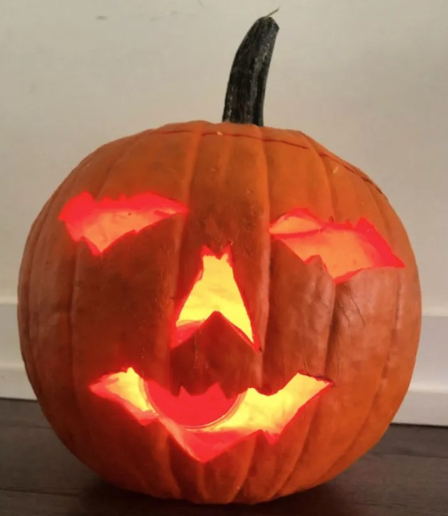

If you have some Batman enthusiasts in your house, this Batman-themed pumpkin carving is the perfect activity for Halloween. It is a perfect design for new starters to wow your tiny ghosts and goblins. This beginner Halloween carving idea will make Halloween even more fun. Have fun with this creative carving!

### **Name Carved Pumpkin**

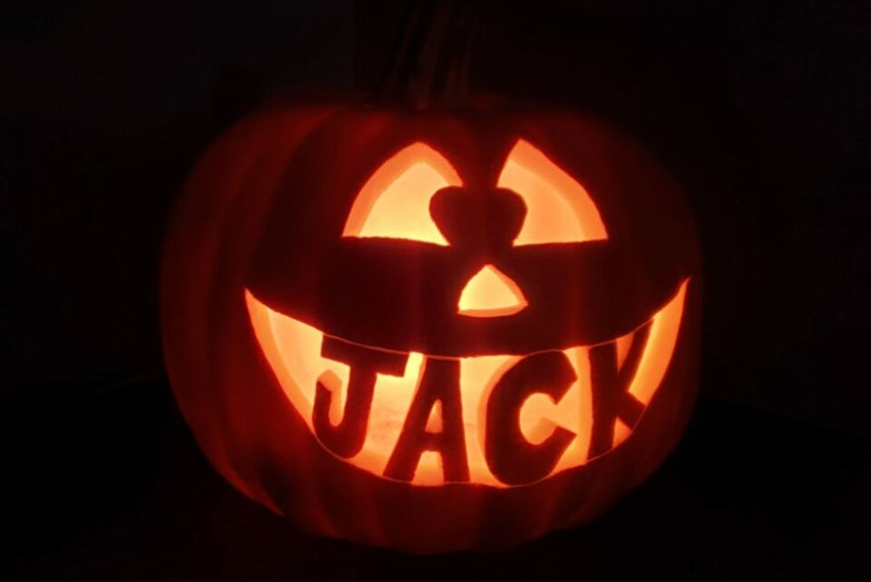

Beginner Halloween carving ideas allow you to transform normal-looking gourds into stunning fall masterpieces with maximum creativity. With this personalized name-carved pumpkin, you can send the best Halloween wishes to loved ones.

### **Pumpkin Sign**

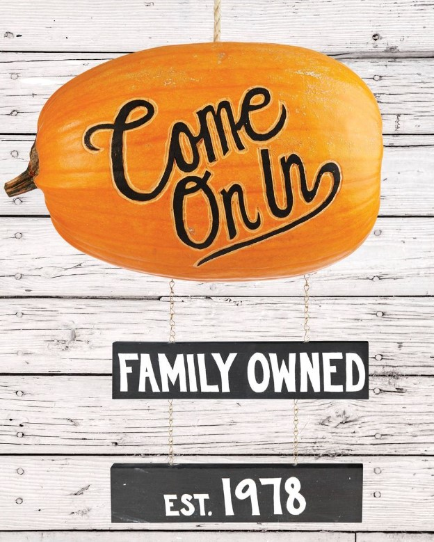

Get creative with a pumpkin sign to warmly welcome guests this [Halloween](https://avada.io/loveable/halloween-symbols-explained/). You can easily customize it with your family name, cute nickname, or even festive sayings.

### **Spider Pumpkin**

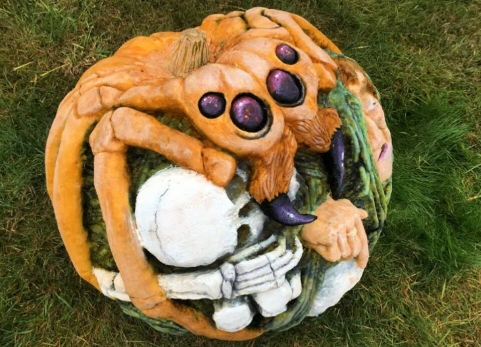

If you are passionate about working with giant pumpkins for Halloween, this beginner Halloween carving idea is the perfect fit for you. You will need some supplies and plenty of time, but the result will undoubtedly leave you feeling a sense of accomplishment. This unique design looks like the spider has devoured two people, so it is sure to turn heads!

### **Pumpkin Barrel**

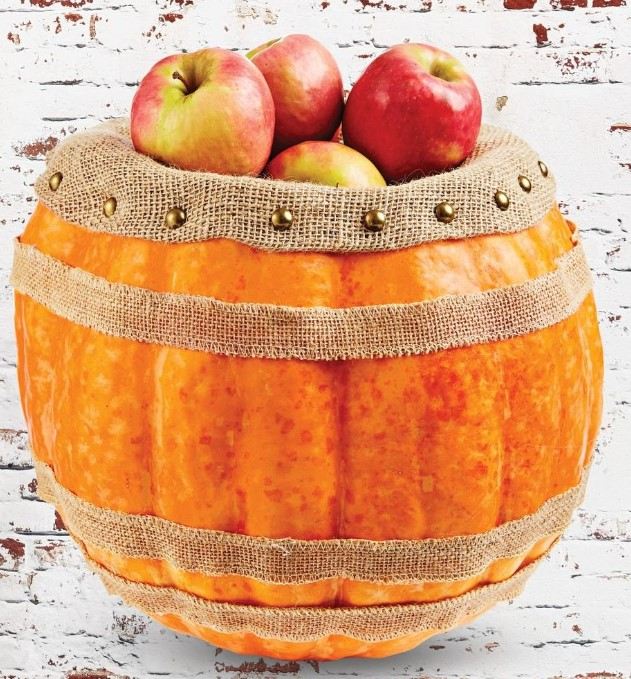

Unleash your inner artist this Halloween season with our collection of beginner Halloween carving ideas. This pumpkin barrel is perfect for showing off your apple-picking haul or filling it with candy so that trick-or-treaters can help themselves. Once you have your gorgeous pumpkins ready, you will love to display them on the table or front porch for trick-or-treaters.

### **Music Note Pumpkin**

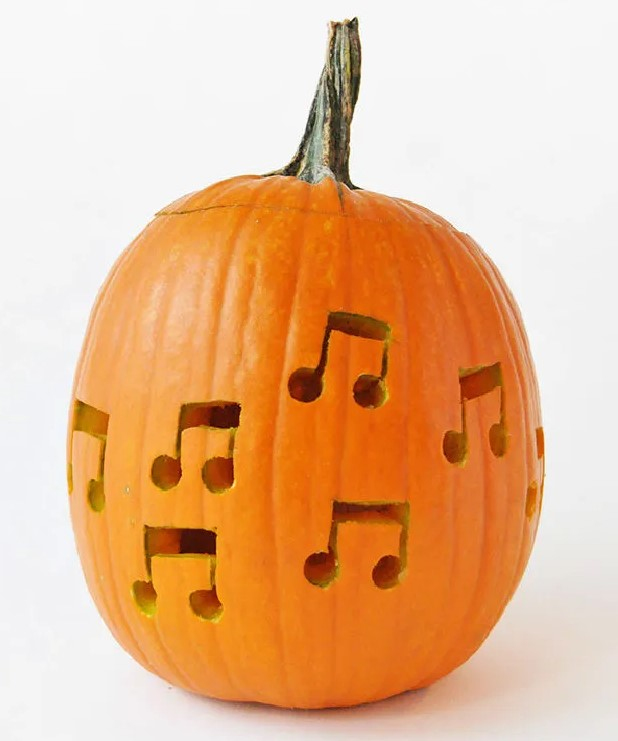

These pumpkins, drilled with musical notes, are exactly what you need for your Halloween Monster Mash Dance Party. The power drill is the main tool necessary for this design, making carving pumpkins incredibly fast and easy this year. It would be a great homemade gift to give your loved ones this spooky season!

### **Cupcake Pumpkin**

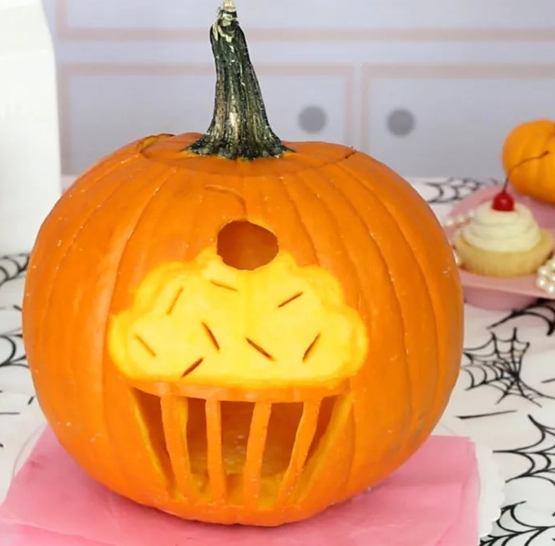

Many people eagerly anticipate the yearly festivities of pumpkin carving. If you’re one of these individuals, then this cupcake-inspired pumpkin design is sure to bring delight and joy. A great way to show off your sweet tooth!

### **Pineapple Pumpkin**

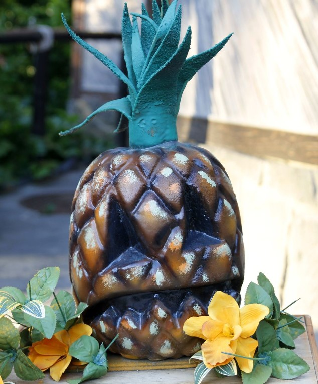

Interested in scary Halloween carving ideas? Check out this pineapple pumpkin design! For a spooky look, carve eyes and a face into a pumpkin to create a creepier version of a pineapple. Then, you can use your painting skills to complete the look. Finally, make a crown from green felt for an extra eerie touch.

## **Bottom Line**

Whether you’re a first-time carver or just looking for some simple and easy designs, there are many **beginner Halloween carving ideas** that can help you create a spooky masterpiece. From classic to creative jack-o’-lanterns, the possibilities are endless. So, grab a knife, some inspiration, and get ready to show off your own unique Halloween spirit! With a little practice, you’ll be impressing friends and family with your handmade creations in no time. Happy Halloween carving!

- [25 Creative Beginner Halloween Carving Ideas](https://avada.io/loveable/blog/beginner-halloween-carving-ideas/#wp-block-heading-2-3)
    - [Spider Web Pumpkin](https://avada.io/loveable/blog/beginner-halloween-carving-ideas/#wp-block-heading-3-4)
    - [Kitty Carved Pumpkin](https://avada.io/loveable/blog/beginner-halloween-carving-ideas/#wp-block-heading-3-7)
    - [Owl Pumpkin](https://avada.io/loveable/blog/beginner-halloween-carving-ideas/#wp-block-heading-3-10)
    - [Bean Bag Toss Pumpkin](https://avada.io/loveable/blog/beginner-halloween-carving-ideas/#wp-block-heading-3-13)
    - [Jigsaw Pumpkin](https://avada.io/loveable/blog/beginner-halloween-carving-ideas/#wp-block-heading-3-16)
    - [Toothy Grin Pumpkin](https://avada.io/loveable/blog/beginner-halloween-carving-ideas/#wp-block-heading-3-19)
    - [Haunted House Carved Pumpkin](https://avada.io/loveable/blog/beginner-halloween-carving-ideas/#wp-block-heading-3-22)
    - [Cat Skeleton Pumpkin](https://avada.io/loveable/blog/beginner-halloween-carving-ideas/#wp-block-heading-3-25)
    - [Impaled Fence Pumpkin](https://avada.io/loveable/blog/beginner-halloween-carving-ideas/#wp-block-heading-3-28)
    - [Scared Pumpkin](https://avada.io/loveable/blog/beginner-halloween-carving-ideas/#wp-block-heading-3-31)
    - [Pumpkin Doll House](https://avada.io/loveable/blog/beginner-halloween-carving-ideas/#wp-block-heading-3-34)
    - [Pumpkin Emojis](https://avada.io/loveable/blog/beginner-halloween-carving-ideas/#wp-block-heading-3-37)
    - [Cottage Pumpkin](https://avada.io/loveable/blog/beginner-halloween-carving-ideas/#wp-block-heading-3-40)
    - [Eyeball Pumpkin](https://avada.io/loveable/blog/beginner-halloween-carving-ideas/#wp-block-heading-3-43)
    - [Constellation Pumpkin](https://avada.io/loveable/blog/beginner-halloween-carving-ideas/#wp-block-heading-3-46)
    - [Harry Potter Pumpkin](https://avada.io/loveable/blog/beginner-halloween-carving-ideas/#wp-block-heading-3-49)
    - [Witch Pumpkin](https://avada.io/loveable/blog/beginner-halloween-carving-ideas/#wp-block-heading-3-52)
    - [Batman-Themed Pumpkin](https://avada.io/loveable/blog/beginner-halloween-carving-ideas/#wp-block-heading-3-55)
    - [Name Carved Pumpkin](https://avada.io/loveable/blog/beginner-halloween-carving-ideas/#wp-block-heading-3-58)
    - [Pumpkin Sign](https://avada.io/loveable/blog/beginner-halloween-carving-ideas/#wp-block-heading-3-61)
    - [Spider Pumpkin](https://avada.io/loveable/blog/beginner-halloween-carving-ideas/#wp-block-heading-3-64)
    - [Pumpkin Barrel](https://avada.io/loveable/blog/beginner-halloween-carving-ideas/#wp-block-heading-3-67)
    - [Music Note Pumpkin](https://avada.io/loveable/blog/beginner-halloween-carving-ideas/#wp-block-heading-3-70)
    - [Cupcake Pumpkin](https://avada.io/loveable/blog/beginner-halloween-carving-ideas/#wp-block-heading-3-73)
    - [Pineapple Pumpkin](https://avada.io/loveable/blog/beginner-halloween-carving-ideas/#wp-block-heading-3-76)
- [Bottom Line](https://avada.io/loveable/blog/beginner-halloween-carving-ideas/#wp-block-heading-2-79)

### [Blake Simpson](https://avada.io/loveable/author/blake/)

Hi, I'm Blake from Loveable. I help people find perfect gifts for occasions like anniversaries and weddings. I also write a blog about holidays, sharing insights to make them more meaningful. Let's create unforgettable moments together!

- [Twitter](https://twitter.com/intent/tweet)
- [Facebook](https://www.facebook.com/sharer/sharer.php)
- [instagram](https://avada.io/loveable/blog/beginner-halloween-carving-ideas/)
- [pinterest](https://www.pinterest.com/loveablellc/)

## Related Posts

[### 120+ Christian Birthday Wishes To Spread Your Love](https://avada.io/loveable/blog/christian-birthday-wishes/) 

[

### 35 Best 70th Birthday Ideas To Celebrate The Special Milestone

](https://avada.io/loveable/blog/70th-birthday-ideas/)

[

### 50 Best 30th Birthday Decorations for a Remarkable Birthday Bash

](https://avada.io/loveable/blog/30th-birthday-decorations/)

[

### 40 Delicious Vegan Christmas Desserts to Delight Your Palate

](https://avada.io/loveable/blog/vegan-christmas-desserts/)

[

### 60 Christmas Team Building Activities to Boost Workplace Spirit

](https://avada.io/loveable/blog/christmas-team-building-activities/)
