This article has been written and researched by our expert Loveable through a precise methodology. [Learn more about our methodology](https://avada.io/loveable/our-methodological.html)

[Loveable](https://avada.io/loveable/) > [Blog](https://avada.io/loveable/blog/) > [Holiday](https://avada.io/loveable/holiday/)

# 25 Best Black Christmas Movie Ideas to Enjoy This Holiday Season

Written by [Blake Simpson](https://avada.io/loveable/author/blake/) Last Updated on September 08, 2023

- [Unveiling Top 25 Black Christmas Movies](https://avada.io/loveable/blog/black-christmas-movie/#wp-block-heading-2-3)
    - [1\. “The Best Man Holiday” (2013)](https://avada.io/loveable/blog/black-christmas-movie/#wp-block-heading-3-4)
    - [2\. “This Christmas” (2007)](https://avada.io/loveable/blog/black-christmas-movie/#wp-block-heading-3-10)
    - [3\. “Almost Christmas” (2016)](https://avada.io/loveable/blog/black-christmas-movie/#wp-block-heading-3-16)
    - [4\. “Last Holiday” (2006)](https://avada.io/loveable/blog/black-christmas-movie/#wp-block-heading-3-22) 
    - [5\. “The Preacher’s Wife” (1996)](https://avada.io/loveable/blog/black-christmas-movie/#wp-block-heading-3-28)
    - [6\. “The Perfect Holiday” (2007)](https://avada.io/loveable/blog/black-christmas-movie/#wp-block-heading-3-34)
    - [7\. “The Divas’ Christmas Carol” (2000)](https://avada.io/loveable/blog/black-christmas-movie/#wp-block-heading-3-40)
    - [8\. “A Madea Christmas” (2013)](https://avada.io/loveable/blog/black-christmas-movie/#wp-block-heading-3-46)
    - [9\. “Black Nativity” (2013)](https://avada.io/loveable/blog/black-christmas-movie/#wp-block-heading-3-52)
    - [10\. “Marry Us for Christmas” (2014)](https://avada.io/loveable/blog/black-christmas-movie/#wp-block-heading-3-58)
    - [11\. “The Kid Who Loved Christmas” (1990)](https://avada.io/loveable/blog/black-christmas-movie/#wp-block-heading-3-64)
    - [12\. “The Perfect Gift” (2011)](https://avada.io/loveable/blog/black-christmas-movie/#wp-block-heading-3-70)
    - [13\. “Daddy’s Little Girls” (2007)](https://avada.io/loveable/blog/black-christmas-movie/#wp-block-heading-3-76)
    - [14\. “You Can’t Fight Christmas” (2017)](https://avada.io/loveable/blog/black-christmas-movie/#wp-block-heading-3-82)
    - [15\. “Holiday Heart” (2000)](https://avada.io/loveable/blog/black-christmas-movie/#wp-block-heading-3-88)
    - [16\. “Christmas Wedding Baby” (2014)](https://avada.io/loveable/blog/black-christmas-movie/#wp-block-heading-3-94)
    - [17\. “A Royal Family Holiday” (2015)](https://avada.io/loveable/blog/black-christmas-movie/#wp-block-heading-3-100)
    - [18\. “The Christmas Pact” (2018)](https://avada.io/loveable/blog/black-christmas-movie/#wp-block-heading-3-106)
    - [19\. “Christmas Everlasting” (2018)](https://avada.io/loveable/blog/black-christmas-movie/#wp-block-heading-3-112)
    - [20\. “A Snow Globe Christmas” (2013)](https://avada.io/loveable/blog/black-christmas-movie/#wp-block-heading-3-118)
    - [21\. “The Christmas Aunt” (2020)](https://avada.io/loveable/blog/black-christmas-movie/#wp-block-heading-3-124)
    - [22\. “One Fine Christmas” (2019)](https://avada.io/loveable/blog/black-christmas-movie/#wp-block-heading-3-130)
    - [23\. “Jingle Jangle: A Christmas Journey” (2020)](https://avada.io/loveable/blog/black-christmas-movie/#wp-block-heading-3-136)
    - [24\. “Dear Santa, I Need a Date” (2019)](https://avada.io/loveable/blog/black-christmas-movie/#wp-block-heading-3-142)
    - [25\. “The Christmas Lottery” (2020)](https://avada.io/loveable/blog/black-christmas-movie/#wp-block-heading-3-148)
- [Bottom Line](https://avada.io/loveable/blog/black-christmas-movie/#wp-block-heading-2-154)

Let’s open your TV and enjoy **Black Christmas movies**, where tales of love, family, and unity come alive against the backdrop of festive cheer this holiday. These cinematic gems not only entertain but also illuminate the significance of representation during the holiday season. 

Moreover, as you embrace the spirit of discovery, Christmas films offer a unique lens through which you can celebrate the magic of togetherness. Amid the twinkling lights, these films would remind you that the holiday spirit transcends boundaries, inviting you to revel in the beauty of shared experiences and cherished memories.

## **Unveiling Top 25 Black Christmas Movies**

### **1\. “The Best Man Holiday” (2013)**

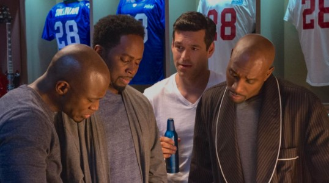

Cast: Taye Diggs, Nia Long, Morris Chestnut, Sanaa Lathan

In “The Best Man Holiday” (2013), you’ll be captivated by a heartwarming reunion of college friends. The story follows their journey as they gather for the holidays, rekindling old friendships and unearthing buried secrets. 

With a perfect blend of laughter and tears, you’ll witness their personal growth, challenges, and the enduring bond that defines true friendship.

**Where to watch:** [Prime Video](https://www.primevideo.com/detail/The-Best-Man-Holiday/0U8HHPTWL9T7E30V8LDPJ7YX41)

### **2\. “This Christmas” (2007)**

Cast: Loretta Devine, Delroy Lindo, Idris Elba, and Regina King

“This Christmas”, categorized as a heartwarming family drama, portrays the Whitfield family’s reunion for Christmas. As they reunite for the holidays, you’ll experience a rollercoaster of emotions, secrets revealed, and bonds strengthened.

It creates a lasting memory of the importance of family, love, and unity, leaving you with an enduring impression of the joy and challenges of the holiday season.

**Where to watch**: [Amazon Prime Video](https://www.amazon.com/This-Christmas-Delroy-Lindo/dp/B001NL258A)

### **3\. “Almost Christmas” (2016)**

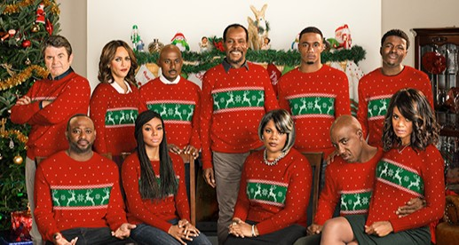

Cast: Danny Glover, Gabrielle Union, Mo’Nique, and more

Are you ready for a holiday flick with laughs, chaos, and plenty of heart? Look no further than “Almost Christmas”! The story kicks off when Walter Meyers (played by Danny Glover), a recent widower, invites his four grown kids and their families to spend Christmas under one roof.

From feuds at the dinner table to heartfelt moments that’ll tug at your heartstrings, “Almost Christmas” brings a relatable and heartwarming twist to the holiday season. 

**Where to watch:**  [Amazon Prime Video](https://www.amazon.com/Almost-Christmas-Kimberly-Elise/dp/B01M298Z2M/ref=sr_1_1)

### **4\. “Last Holiday” (2006)** 

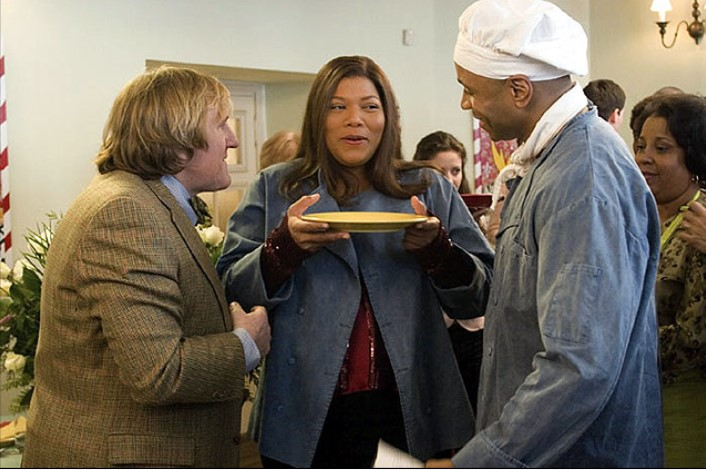

Cast: Queen Latifah, LL Cool J, Timothy Hutton 

Hey, movie buffs! Get ready to be whisked away to a world of culinary dreams and unexpected adventures with “Last Holiday” (2006). Starring Queen Latifah in all her glory, this gem falls right into the heartwarming comedy and Black movies categories.

The “Last Holiday” dishes out a delightful blend of laughter, self-discovery, and a sprinkle of romance. If you are ready to dive into this scrumptious adventure? You can savor every moment on some streaming platforms.

**Where to watch:** [Amazon Prime Video](https://www.amazon.com/Last-Holiday-LL-Cool-J/dp/B00K0V8NRQ/ref=sr_1_2)

### **5\. “The Preacher’s Wife” (1996)**

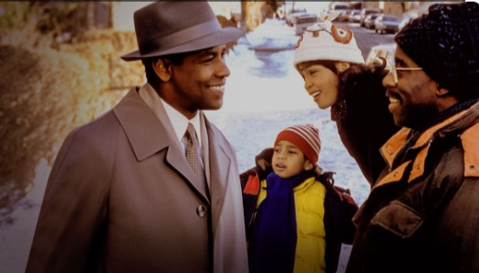

Cast: Denzel Washington, Whitney Houston, Courtney B. Vance, Gregory Hines, Jenifer Lewis

You absolutely will be charmed by a heavenly dose of Christmas magic and Black movie excellence with “The Preacher’s Wife” (1996).

Meet Julia Biggs (Whitney Houston), a pastor’s wife overwhelmed by her church’s troubles. Enter Dudley (Denzel Washington), an angel sent to assist but who ends up stirring unexpected emotions. “The Preacher’s Wife” is a must-watch that’ll leave you humming carols and believing in miracles.

**Where to watch:** [Amazon Prime Video](https://www.amazon.com/Preachers-Wife-Whitney-Houston/dp/B0B75NFKZ2/ref=sr_1_1)

### **6\. “The Perfect Holiday” (2007)**

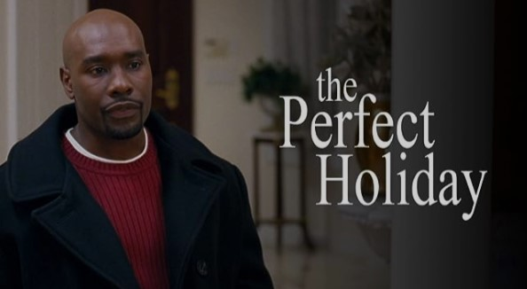

Cast: Morris Chestnut, Gabrielle Union, Faizon Love, Charlie Murphy

Nothing is more wonderful than enjoying romance on holiday cheer, and a dash of Black movie magic with “The Perfect Holiday” (2007) is a great choice for you to start.

A struggling single mom – Nancy meets Benjamin, a charming and handsome department store Santa. As their paths cross, a heartwarming connection forms, leading to a Christmas season filled with laughter, surprises, and magic. So, gather your loved ones, and get ready to be swept off your feet! 

**Where to watch:** [Amazon Prime Video](https://www.amazon.com/Perfect-Holiday-Morris-Chestnut/dp/B009LL806A/ref=sr_1_1)

### **7\. “The Divas’ Christmas Carol” (2000)**

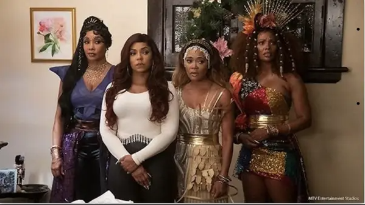

Cast: Vanessa L. Williams, Rozonda “Chilli” Thomas, Brian McNamara và Kathy Griffin.

“The Divas’ Christmas Carol” (2000) is an engaging black Christmas movie with a unique twist. Ebony Scrooge (Vanessa Williams), a self-absorbed pop star, is facing a magical transformation as she’s visited by three divas. 

This heartwarming musical adaptation offers a fresh twist on a timeless tale, leaving you a lesson of compassion, generosity, and the magic of the holiday spirit. Don’t miss out! 

Where to watch: [Amazon Prime Video](https://www.amazon.com/Christmas-Region-Vanessa-Williams-Nintendo-64/dp/B01M746XA2/ref=sr_1_1)

### **8\. “A Madea Christmas” (2013)**

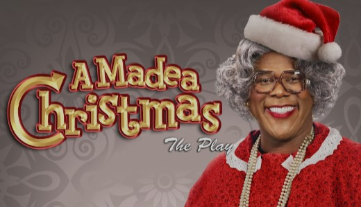

Cast: Kathy Najimy, Chad Michael Murray, Anna Maria Horsford, Tika Sumpter, Eric Lively, JR Lemon

For a hilarious and heartwarming dose of holiday cheer with “A Madea Christmas” (2013). Madea’s off to the countryside to surprise her niece Eileen for Christmas. But you know Madea, right? Chaos follows! 

This comedic Christmas movie teaches you with a lighthearted memory of the importance of understanding, unity, and the joy of celebrating the holidays in the most unexpected ways.

**Where to watch:** [Amazon Prime Video](https://www.amazon.com/Tyler-Perrys-Madea-Christmas-Perry/dp/B00NPTL6O2/ref=sr_1_1)

### **9\. “Black Nativity” (2013)**

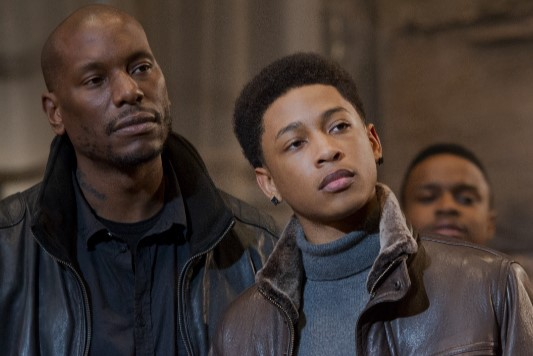

Cast: Forest Whitaker, Angela Bassett, Tyrese Gibson, Jennifer Hudson, Mary J

Brace yourselves for a soul-stirring holiday tale with “Black Nativity” (2013). Meet Langston (Jacob Latimore), a teenager sent to spend Christmas with his estranged grandparents. As he’s swept into the vibrant world of Harlem, he discovers the power of faith, family, and music.

The film’s emotional resonance and powerful performances will impress you with a lasting memory of the strength of love and the importance of heritage.

**Where to watch:** [Amazon Prime Video](https://www.amazon.com/Black-Nativity-Forest-Whitaker/dp/B0B8TRQD23/)

### **10\. “Marry Us for Christmas” (2014)**

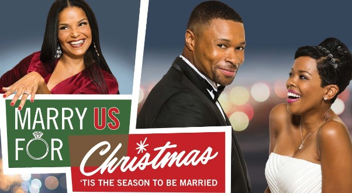

Cast: Malinda Williams, Victoria Rowell, Karon Riley, Gregory Alan Williams.

It’s time to dive into the heartwarming world of “Marry Us for Christmas” (2014). The film tells about  Marci (Malinda Williams) and Blair (Karon Riley), a couple navigating the ups and downs of holiday wedding planning. 

As they juggle family dynamics, love, and a whirlwind of festive chaos, this film serves as a heartwarming recipe for love, laughter, and togetherness.  

**Where to watch:** [Amazon Prime Video](https://www.amazon.com/Marry-Us-Christmas-Malinda-Williams/dp/B08225RTDT/ref=sr_1_1)

### **11\. “The Kid Who Loved Christmas” (1990)**

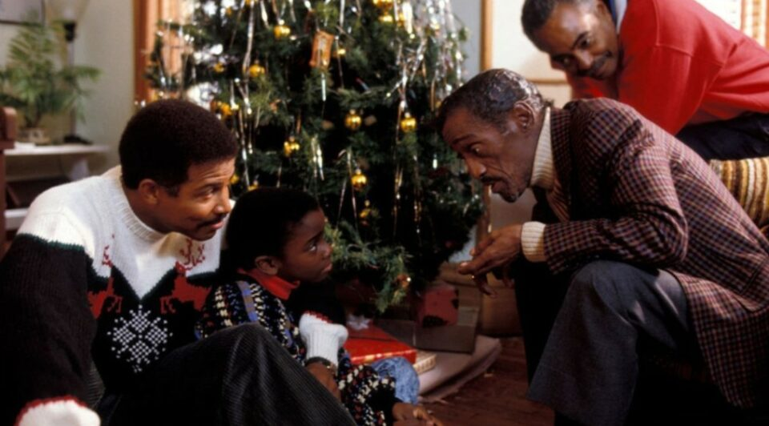

Cast: Sammy Davis Jr, Cicely Tyson, Michael Warren, Esther Rolle, and more

“The Kid Who Loved Christmas” (1990) tells about  Reggie (Trent Cameron), a young boy determined to reunite his family in time for Christmas. As Reggie embarks on a touching journey of hope and determination, you’ll be reminded of the power of family and the joy of spreading kindness.

When you watch the film, you’ll be reminded of the boundless spirit of childhood, leaving you with a heartwarming memory after the credits roll.

**Where to watch:** [YouTube](https://www.youtube.com/watch?v=dTF91IzUOKs)

### **12\. “The Perfect Gift” (2011)**

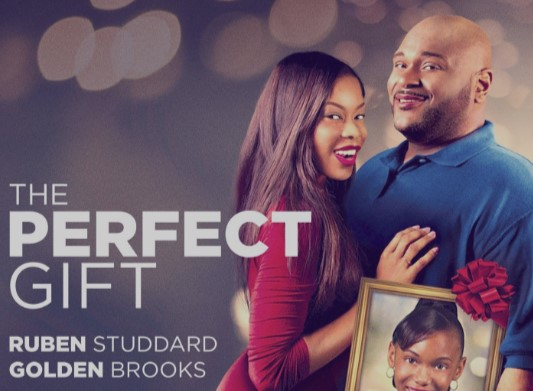

Cast: Ruben Studdard, Golden Brooks, Buddy Lewis, Jewel Lucien.

Hi, fellow movie enthusiasts! Streaming “The Perfect Gift” (2011) now. It is about Max (Ruben Studdard), a jazz musician who discovers the true meaning of Christmas when he finds himself in a small town. 

The Black Christmas movie immerses you, and you’ll witness the power of love and the profound impact that a single act of kindness can have on the lives of others. 

**Where to watch:** [Amazon Prime Video](https://www.amazon.com/Perfect-Gift-Ruben-Studdard/dp/B006DSLF6Q/ref=sr_1_1)

### **13\. “Daddy’s Little Girls” (2007)**

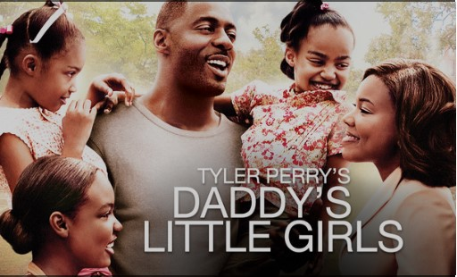

Cast: Idris Elba, Gabrielle Union, Louis Gossett Jr. và Tracee Ellis Ross

“Daddy’s Little Girls” (2007) is a standout gem in heartwarming black Christmas movies. Set against the backdrop of Atlanta, “Daddy’s Little Girls” is a touching tale of love, resilience, and holiday spirit. 

So, immediately turn on your TV and come with your dad to enjoy this masterpiece on Christmas. 

**Where to watch:** [Amazon Prime Video](https://www.amazon.com/Tyler-Perrys-Daddys-Little-Girls/dp/B000RVNIM4/ref=sr_1_2)

### **14\. “You Can’t Fight Christmas” (2017)**

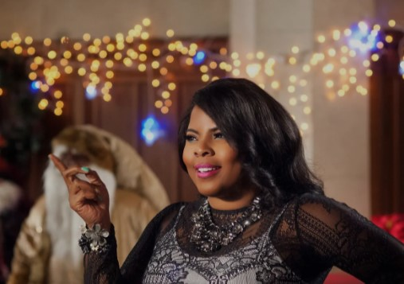

Cast: Brely Evans, Andra Fuller, Persia White, Porscha Coleman

If you want to laugh out loud, let’s turn on “You Can’t Fight Christmas” (2017), an addition to the world of vibrant classic movies. With an interesting story, you will meet Leslie, a spunky decorator, and Edmund, a no-nonsense hotel owner about to turn his world upside down.

This delightful romantic comedy reminds you of the beauty of embracing the magic of Christmas and the warmth of finding love in the most unexpected places.

**Where to watch:** [Amazon](https://www.amazon.com/Cant-Fight-Christmas-Brely-Evans/dp/B09LV3LF94)

### **15\. “Holiday Heart” (2000)**

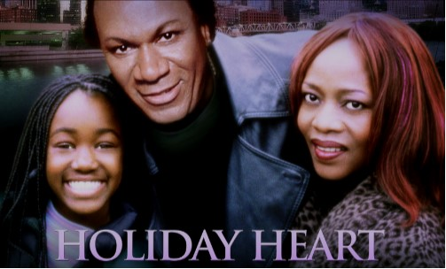

Cast: Ving Rhames, Alfre Woodard, Jesika Reynolds, Mykelti Williamson

It is nothing more than “You Can’t Fight Christmas” (2017), a must-watch story for those who love joyful black films during Christmas. 

“You Can’t Fight Christmas” crafts a merry tale of unexpected love amidst tinsel and twinkling lights. As Leslie brings her modern touch to holiday decorations, sparks fly, and hearts warm. The movie will enhance your holiday and support you to have an unforgettable Christmas. 

**Where to watch:**  [Amazon Prime Video](https://www.amazon.com/Holiday-Heart-Alfre-Woodard/dp/B0812C3RZS/)

### **16\. “Christmas Wedding Baby” (2014)**

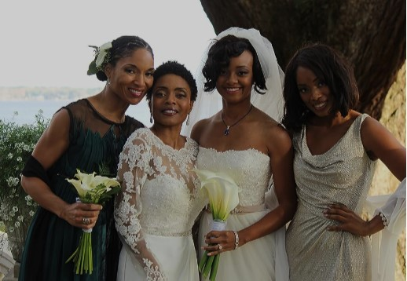

Cast: Kimberley Drummond and Lisa Arrindell Anderson.

Have you ever wondered what happens when love, weddings, and Christmas collide? Enter “Christmas Wedding Baby” (2014), a heartwarming treat in the world of enchanting Christmas movies. See Maya, a determined wedding planner, and her childhood friend Jason, whose return stirs up more than holiday cheer.

“Christmas Wedding Baby” is a captivating journey filled with laughter, tears, and moments that’ll tug at your heartstrings. 

**Where to watch:** [IMDb](https://www.imdb.com/title/tt3783740/)

### **17\. “A Royal Family Holiday” (2015)**

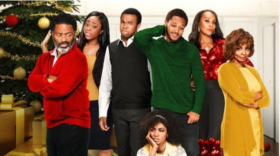

Cast: Javon Anderson, Tichina Arnold, Ele Bardha, Will Clarke

Introducing you to “The Christmas Pact” (2018), a heartwarming gem in the realm of captivating classic Christmas-themed movies. The movie honors the lifelong friendship between Sadie and Ben, whose reunion takes them on an unexpected journey.

You should binge-watch this film with your besties to strengthen your friendship on this holiday. 

**Where to watch:** [IMDb](https://www.imdb.com/title/tt4919764/)

### **18\. “The Christmas Pact” (2018)**

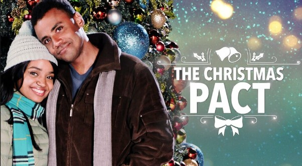

Cast: Kyla Pratt, Kiara Malcolm, Jarod Joseph, Akiz Aguma.

Can your childhood promise lead to forever love? Let’s turn on “The Christmas Pact” (2018) to meet lifelong pals Sadie and Ben. The movie opens a tale of friendship, nostalgia, and love’s gentle magic. As Sadie and Ben navigate adult waters, laughter and affection bloom.

“The Christmas Pact” will leave you with hope and the belief that some promises are meant to be fulfilled.

**Where to watch:** [Amazon Prime Video](https://www.amazon.com/CHRISTMAS-PACT-Quinn-Television/dp/B07L1CT2H8/)

### **19\. “Christmas Everlasting” (2018)**

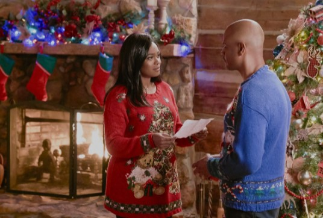

Cast: Tatyana Ali, Dondré T. Whitfield, Dennis Haysbert, Patti LaBelle

Watch Lucy, a high-powered attorney, she navigates life’s twists in the “Christmas Everlasting” (2018) movie. The movie paints a story of family, forgiveness, and finding love where you least expect it. 

“Christmas Everlasting” will impress you with a warm, introspective emotional impact, emphasizing the transformative nature of the holiday season.

**Where to watch:** [Amazon Prime Video](https://www.amazon.com/Christmas-Everlasting-Tatyana-Ali/dp/B07XZ6NP3F/ref=sr_1_1)

### **20\. “A Snow Globe Christmas” (2013)**

Cast: Christina Milian , Donald Faison , Alicia Witt

See your charming guides, your favorite radio DJ, and a sprinkle of snow globe wonder at “A Snow Globe Christmas” (2013). As the radio DJ finds herself transported to a yuletide wonderland, you’ll be swept away by the whimsy and warmth. 

This Christmas black movie will make you believe that true happiness lies in appreciating the beauty of life’s simple joys. It is time to put away some hectic things in your life and delve into the magic of Christmas with this film. 

**Where to watch:** [Amazon Prime Video](https://www.amazon.com/Snow-Globe-Christmas-Christina-Milian/dp/B00P7PE0XG/)

### **21\. “The Christmas Aunt” (2020)**

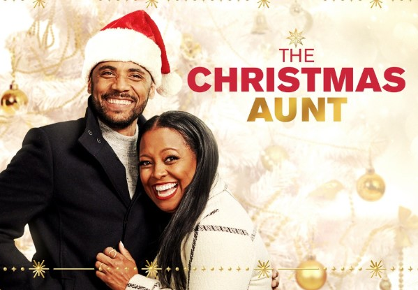

Cast: Keshia Knight Pulliam, Jarod Joseph, Angela Moore, Nyla Alleyne

Do you want to unwrap a mystery? “The Christmas Aunt” (2020) is a delightful addition to the world of intriguing black movies for you to enjoy this Christmas.  

It unveils a tale of family, nostalgia, and unexpected romance. Join Rebecca, a busy executive, as her life takes an unexpected turn during a visit from her mysterious aunt. This family drama will leave you with a sense of warmth.

**Where to watch:** [Amazon Prime Video](https://www.amazon.com/Christmas-Aunt-Howard-Braunstein-Films/dp/B08MBXHWB1/)

### **22\. “One Fine Christmas” (2019)**

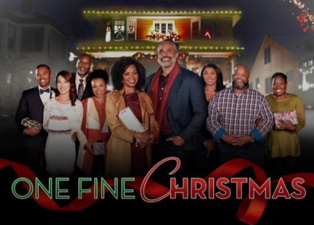

Cast: Vanessa Williams, Rick Fox, Sasha Fox, Reginald VelJohnson

“One Fine Christmas” (2019) is one of the most popular black movies for you and your beloved to watch this Christmas. Let’s join the Whitfield family as they navigate a holiday season filled with surprises. 

Furthermore, as you immerse yourself in their interconnected stories, you’ll be reminded of the true meaning of Christmas and the importance of cherishing the moments you share with loved ones.

**Where to watch:** [Amazon Prime Video](https://www.amazon.com/One-Fine-Christmas-Season-1/dp/B09KQTH7RG)

### **23\. “Jingle Jangle: A Christmas Journey” (2020)**

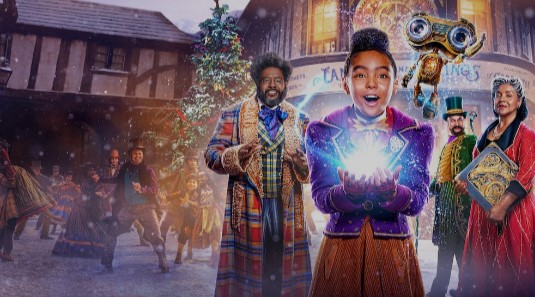

Cast: Forest Whitaker, Keegan-Michael Key, Hugh Bonneville, Anika Noni Rose

Say hello to “Jingle Jangle: A Christmas Journey” (2020), a mesmerizing black movie to bingle this holiday.  As Jeronicus’s inventions come alive, you’ll be captivated by the dazzling visuals and toe-tapping tunes. 

Through captivating visuals and heartfelt performances, you’ll be immersed in a heartwarming story that reminds you of the wonder of Christmas, leaving you with awe and inspiration.

**Where to watch:** [IMDb](https://www.imdb.com/title/tt7736496/)

### **24\. “Dear Santa, I Need a Date” (2019)**

Cast: Jay DeVon Johnson, Aisha Duran, Isaiah Jarel, Kaye Singleton

Are you curious about a Christmas comedy that will tickle your funny bone? Watch “Dear Santa, I Need a Date” (2019) and meet siblings Teddy and Tammy as they embark on a hilarious mission. 

Teddy and Tammy navigate through festive chaos, sparks fly, and hearts warm. Its comedic twists will leave you with the joyful magic of Christmas and the power of companionship.

**Where to watch:** [Netflix](https://www.netflix.com/vn-en/browse/genre/1159493)

### **25\. “The Christmas Lottery” (2020)**

Cast: Reginald VelJohnson, Asia’h Epperson, Brave Williams, Candiace Dillard Bassett

“The Christmas Lottery” (2020) tells an engaging story where you can feel free to laugh and forget all the bad things that happen during the year. You can join the Caldwell family on an unforgettable journey through the film. 

The Christmas Lottery starts when Caldwells win the town’s lottery, and their lives take unexpected turns. It will leave you with a sense of warmth and appreciation for the simple joys that Christmas can bring.

**Where to watch:** [Amazon Prime Video](https://www.amazon.com/Christmas-Lottery-Reginald-VelJohnson/dp/B08QRGKTKD/)

## **Bottom Line**

As you bid farewell to this cinematic journey through **Black Christmas movies**, let the echoes of heartfelt stories linger. With every flicker of the screen, you’ve embraced characters that mirror your experiences and celebrations.

That’s why whether you’re cuddled up with a loved one or braving these films alone, these movies will surely haunt your holiday in the best possible way. Now, let’s dim the lights, grab your favorite snacks, and let these spooky tales add excitement to your Christmas celebrations. Happy haunting!

_**See More:**_

- [Funny Christmas Movie Quotes](https://avada.io/loveable/blog/funny-christmas-movie-quotes/)

- Best [Christmas Movie Trivia Questions](https://avada.io/loveable/blog/christmas-movie-trivia/)

- [Unveiling Top 25 Black Christmas Movies](https://avada.io/loveable/blog/black-christmas-movie/#wp-block-heading-2-3)
    - [1\. “The Best Man Holiday” (2013)](https://avada.io/loveable/blog/black-christmas-movie/#wp-block-heading-3-4)
    - [2\. “This Christmas” (2007)](https://avada.io/loveable/blog/black-christmas-movie/#wp-block-heading-3-10)
    - [3\. “Almost Christmas” (2016)](https://avada.io/loveable/blog/black-christmas-movie/#wp-block-heading-3-16)
    - [4\. “Last Holiday” (2006)](https://avada.io/loveable/blog/black-christmas-movie/#wp-block-heading-3-22) 
    - [5\. “The Preacher’s Wife” (1996)](https://avada.io/loveable/blog/black-christmas-movie/#wp-block-heading-3-28)
    - [6\. “The Perfect Holiday” (2007)](https://avada.io/loveable/blog/black-christmas-movie/#wp-block-heading-3-34)
    - [7\. “The Divas’ Christmas Carol” (2000)](https://avada.io/loveable/blog/black-christmas-movie/#wp-block-heading-3-40)
    - [8\. “A Madea Christmas” (2013)](https://avada.io/loveable/blog/black-christmas-movie/#wp-block-heading-3-46)
    - [9\. “Black Nativity” (2013)](https://avada.io/loveable/blog/black-christmas-movie/#wp-block-heading-3-52)
    - [10\. “Marry Us for Christmas” (2014)](https://avada.io/loveable/blog/black-christmas-movie/#wp-block-heading-3-58)
    - [11\. “The Kid Who Loved Christmas” (1990)](https://avada.io/loveable/blog/black-christmas-movie/#wp-block-heading-3-64)
    - [12\. “The Perfect Gift” (2011)](https://avada.io/loveable/blog/black-christmas-movie/#wp-block-heading-3-70)
    - [13\. “Daddy’s Little Girls” (2007)](https://avada.io/loveable/blog/black-christmas-movie/#wp-block-heading-3-76)
    - [14\. “You Can’t Fight Christmas” (2017)](https://avada.io/loveable/blog/black-christmas-movie/#wp-block-heading-3-82)
    - [15\. “Holiday Heart” (2000)](https://avada.io/loveable/blog/black-christmas-movie/#wp-block-heading-3-88)
    - [16\. “Christmas Wedding Baby” (2014)](https://avada.io/loveable/blog/black-christmas-movie/#wp-block-heading-3-94)
    - [17\. “A Royal Family Holiday” (2015)](https://avada.io/loveable/blog/black-christmas-movie/#wp-block-heading-3-100)
    - [18\. “The Christmas Pact” (2018)](https://avada.io/loveable/blog/black-christmas-movie/#wp-block-heading-3-106)
    - [19\. “Christmas Everlasting” (2018)](https://avada.io/loveable/blog/black-christmas-movie/#wp-block-heading-3-112)
    - [20\. “A Snow Globe Christmas” (2013)](https://avada.io/loveable/blog/black-christmas-movie/#wp-block-heading-3-118)
    - [21\. “The Christmas Aunt” (2020)](https://avada.io/loveable/blog/black-christmas-movie/#wp-block-heading-3-124)
    - [22\. “One Fine Christmas” (2019)](https://avada.io/loveable/blog/black-christmas-movie/#wp-block-heading-3-130)
    - [23\. “Jingle Jangle: A Christmas Journey” (2020)](https://avada.io/loveable/blog/black-christmas-movie/#wp-block-heading-3-136)
    - [24\. “Dear Santa, I Need a Date” (2019)](https://avada.io/loveable/blog/black-christmas-movie/#wp-block-heading-3-142)
    - [25\. “The Christmas Lottery” (2020)](https://avada.io/loveable/blog/black-christmas-movie/#wp-block-heading-3-148)
- [Bottom Line](https://avada.io/loveable/blog/black-christmas-movie/#wp-block-heading-2-154)

### [Blake Simpson](https://avada.io/loveable/author/blake/)

Hi, I'm Blake from Loveable. I help people find perfect gifts for occasions like anniversaries and weddings. I also write a blog about holidays, sharing insights to make them more meaningful. Let's create unforgettable moments together!

- [Twitter](https://twitter.com/intent/tweet)
- [Facebook](https://www.facebook.com/sharer/sharer.php)
- [instagram](https://avada.io/loveable/blog/black-christmas-movie/)
- [pinterest](https://www.pinterest.com/loveablellc/)

## Related Posts

[### 120+ Christian Birthday Wishes To Spread Your Love](https://avada.io/loveable/blog/christian-birthday-wishes/) 

[

### 35 Best 70th Birthday Ideas To Celebrate The Special Milestone

](https://avada.io/loveable/blog/70th-birthday-ideas/)

[

### 50 Best 30th Birthday Decorations for a Remarkable Birthday Bash

](https://avada.io/loveable/blog/30th-birthday-decorations/)

[

### 40 Delicious Vegan Christmas Desserts to Delight Your Palate

](https://avada.io/loveable/blog/vegan-christmas-desserts/)

[

### 60 Christmas Team Building Activities to Boost Workplace Spirit

](https://avada.io/loveable/blog/christmas-team-building-activities/)
