This article has been written and researched by our expert Loveable through a precise methodology. [Learn more about our methodology](https://avada.io/loveable/our-methodological.html)

[Loveable](https://avada.io/loveable/) > [Blog](https://avada.io/loveable/blog/) > [Holiday](https://avada.io/loveable/holiday/)

# 25 Best Christmas Activities in Dallas You Can’t Miss

Written by [Blake Simpson](https://avada.io/loveable/author/blake/) Last Updated on September 27, 2023

- [25 Best Christmas Activities in Dallas You Should Do](https://avada.io/loveable/blog/christmas-activities-in-dallas/#wp-block-heading-2-3)
    - [1\. Visit Grapevine, The Christmas Capital](https://avada.io/loveable/blog/christmas-activities-in-dallas/#wp-block-heading-3-4)
    - [2\. Shop at the Texas Christkindl Market](https://avada.io/loveable/blog/christmas-activities-in-dallas/#wp-block-heading-3-7)
    - [3\. Celebrate Victorian Christmas at Old City Park](https://avada.io/loveable/blog/christmas-activities-in-dallas/#wp-block-heading-3-10)
    - [4\. Dallas Symphony Holiday Shows](https://avada.io/loveable/blog/christmas-activities-in-dallas/#wp-block-heading-3-13)
    - [5\. Enjoy the Dallas Christmas Village Customs](https://avada.io/loveable/blog/christmas-activities-in-dallas/#wp-block-heading-3-16)
    - [6\. Take Your Kids to Dallas Zoo Lights](https://avada.io/loveable/blog/christmas-activities-in-dallas/#wp-block-heading-3-19)
    - [7\. Miracle on Lowest Greenville](https://avada.io/loveable/blog/christmas-activities-in-dallas/#wp-block-heading-3-22)
    - [8\. Visit the annual Dallas Holiday Parade](https://avada.io/loveable/blog/christmas-activities-in-dallas/#wp-block-heading-3-25)
    - [9\. Attend Dallas Arboretum and Botanical Gardens](https://avada.io/loveable/blog/christmas-activities-in-dallas/#wp-block-heading-3-28)
    - [10\. Enjoy the Holiday Lights from Your Car](https://avada.io/loveable/blog/christmas-activities-in-dallas/#wp-block-heading-3-31)
    - [11\. Santa Claus Visits](https://avada.io/loveable/blog/christmas-activities-in-dallas/#wp-block-heading-3-34)
    - [12\. Experience the Dallas Symphony Orchestra](https://avada.io/loveable/blog/christmas-activities-in-dallas/#wp-block-heading-3-37)
    - [13\. Holiday at the Arboretum](https://avada.io/loveable/blog/christmas-activities-in-dallas/#wp-block-heading-3-40)
    - [14\. Dazzle at Enchant Christmas](https://avada.io/loveable/blog/christmas-activities-in-dallas/#wp-block-heading-3-43)
    - [15\. Light Shows Around Town](https://avada.io/loveable/blog/christmas-activities-in-dallas/#wp-block-heading-3-46)
    - [16\. Trains at NorthPark](https://avada.io/loveable/blog/christmas-activities-in-dallas/#wp-block-heading-3-49)
    - [17\. Ice Skating at Galleria](https://avada.io/loveable/blog/christmas-activities-in-dallas/#wp-block-heading-3-52)
    - [18\. View the Trains at NorthPark](https://avada.io/loveable/blog/christmas-activities-in-dallas/#wp-block-heading-3-55)
    - [19\. Holiday Dance Performances](https://avada.io/loveable/blog/christmas-activities-in-dallas/#wp-block-heading-3-58)
    - [20\. Dallas by Chocolate Christmas Lights Tour](https://avada.io/loveable/blog/christmas-activities-in-dallas/#wp-block-heading-3-61)
    - [21\. Support Small Businesses](https://avada.io/loveable/blog/christmas-activities-in-dallas/#wp-block-heading-3-64)
    - [22\. Check out the Boho Market](https://avada.io/loveable/blog/christmas-activities-in-dallas/#wp-block-heading-3-67)
    - [23\. Snowday Immersive Experience](https://avada.io/loveable/blog/christmas-activities-in-dallas/#wp-block-heading-3-70)
    - [24\. Virtual Entertainment](https://avada.io/loveable/blog/christmas-activities-in-dallas/#wp-block-heading-3-73)
    - [25\. Give Back This Holiday to the Needy](https://avada.io/loveable/blog/christmas-activities-in-dallas/#wp-block-heading-3-76)
- [Final Words](https://avada.io/loveable/blog/christmas-activities-in-dallas/#wp-block-heading-2-80)

The holiday season in Dallas is nothing short of magical. The city comes alive with twinkling lights, festive decorations, and a wide range of activities, which makes it a truly enchanting place to be. Whether you’re a local or just visiting, there’s no shortage of Christmas cheer.

In this guide, we’ll explore the **25 Best Christmas Activities in Dallas** that you can’t miss to experience when visiting here during the holiday season. From traditional celebrations to modern holiday spectacles, Dallas has something for everyone to enjoy during this special time of year.

## **25 Best Christmas Activities in Dallas You Should Do**

### **1\. Visit Grapevine, The Christmas Capital**

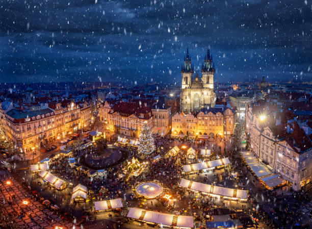

Grapevine in Texas proudly claims the title of “The Christmas Capital of Texas,” and for good reason. This charming town goes all out for the holidays, with its historic Main Street transformed into a winter wonderland. You can enjoy Dallas Christmas activities such as daily parades, meet Santa Claus, and explore the beautifully decorated shops and streets.

### **2\. Shop at the Texas Christkindl Market**

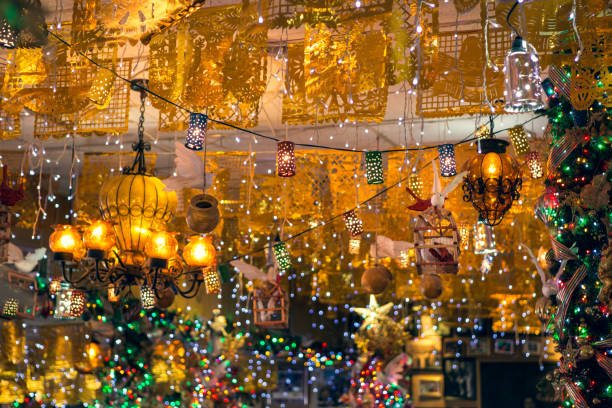

At the Texas Christkindl Market, you can learn about holiday customs from all over Europe. It is a great place to shop and enjoy the Christmas vibe in Dallas. You can look at unique gifts, eat traditional German food, and enjoy the holiday atmosphere.

### **3\. Celebrate Victorian Christmas at Old City Park**

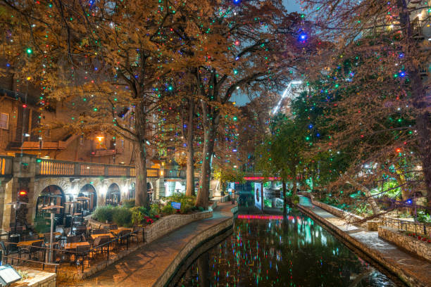

Travel back in time to a Victorian-era Christmas at the Heritage Village, Dallas. Experience the charm of yesteryear with historic buildings adorned with period decorations, carolers, and even horse-drawn carriage rides. It’s a delightful way to celebrate the season while learning about Dallas’s history.

### **4\. Dallas Symphony Holiday Shows**

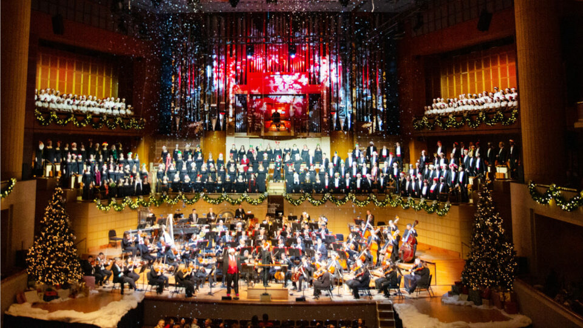

Indulge in the symphonic sounds of the season with the Dallas Symphony Orchestra. Their holiday shows are a beloved tradition, featuring classics like “The Nutcracker” and festive concerts that will put you in a joyful mood. That will be such an interesting Christmas activity in Dallas.

### **5\. Enjoy the Dallas Christmas Village Customs**

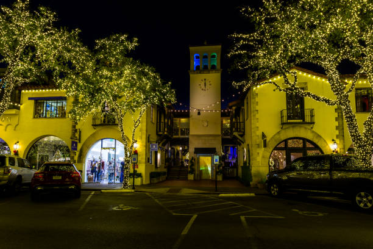

The Dallas Christmas Village, located at the Dallas Farmers Market, is a festive display of holiday cheer. Explore themed areas, meet Santa, and enjoy different activities and entertainment for all ages.

### **6\. Take Your Kids to Dallas Zoo Lights**

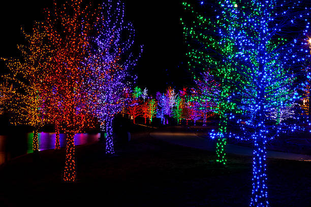

The Dallas Zoo transforms into a dazzling winter wonderland during the holiday season. Zoo Lights features over a million twinkling lights, elaborate displays, and even a visit from Santa. When you visit Dallas on Christmas, it’s a magical experience for the whole family.

### **7\. Miracle on Lowest Greenville**

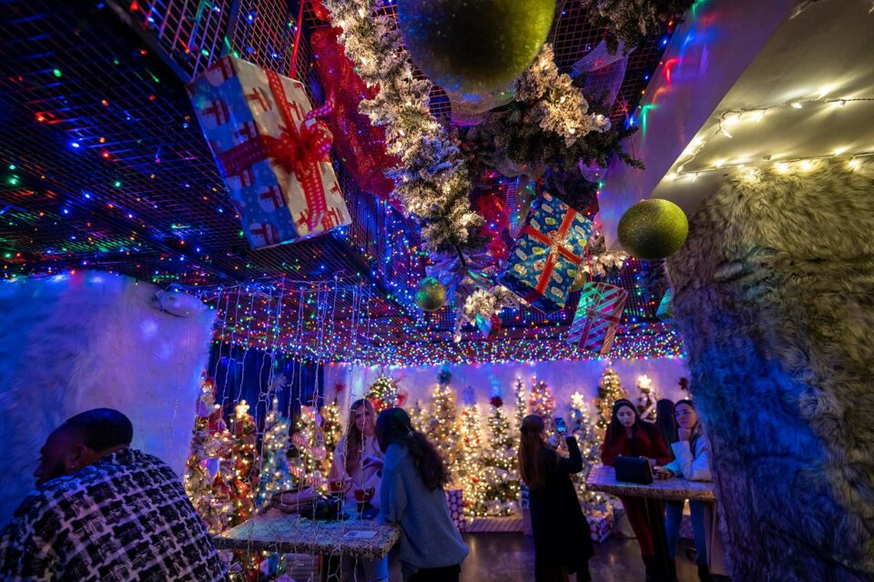

For a taste of holiday nostalgia, head to the “Miracle on Lowest Greenville.” This pop-up Christmas bar immerses you in a retro winter wonderland with festive cocktails and numerous Instagram-worthy decorations.

### **8\. Visit the annual Dallas Holiday Parade**

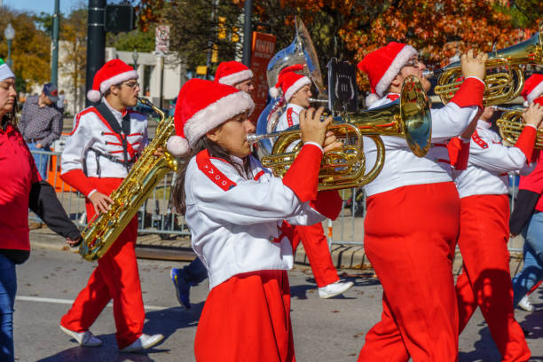

The Dallas Holiday Parade is a cherished tradition that brings the community together. Watch colorful floats, marching bands and larger-than-life balloons parade through the streets of downtown Dallas. It’s a spectacle that truly captures the spirit of the season.

### **9\. Attend Dallas Arboretum and Botanical Gardens**

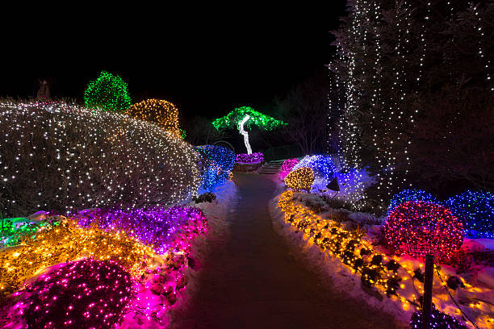

The sparkling botanical gardens are a year-round delight and truly shine during the holidays. The “12 Days of Christmas” exhibit features stunningly detailed 25-foot-tall Victorian gazebos, each adorned with characters from the beloved carol.

### **10\. Enjoy the Holiday Lights from Your Car**

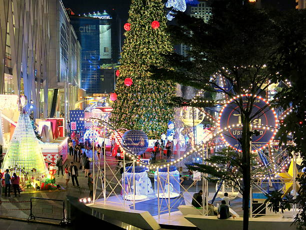

Sometimes, there’s nothing cozier than enjoying Christmas lights from the comfort of your car. Neighborhoods in Dallas go all out with their decorations, creating dazzling displays you can drive through. It’s a simple yet enchanting way to soak in the festive spirit.

### **11\. Santa Claus Visits**

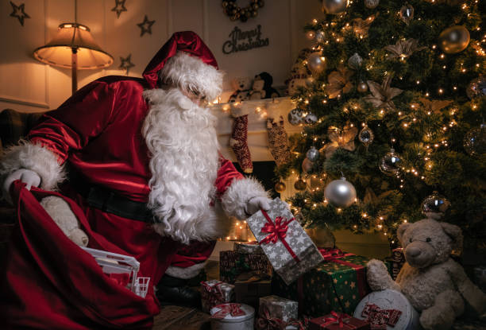

The Christmas season is incomplete without a visit to Santa Claus! Dallas offers several opportunities for children to meet the jolly man in red. From shopping malls to special Santa events, kids can share their holiday wishes with St. Nick himself. We are pretty sure that your kids will love this Christmas activity.

### **12\. Experience the Dallas Symphony Orchestra**

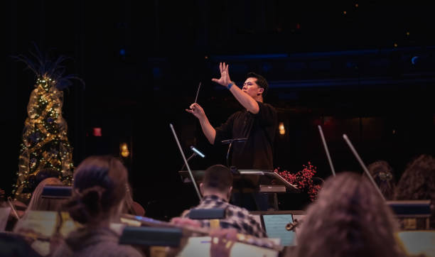

If you haven’t had your musical holiday cheer, catch a performance by the renowned Dallas Symphony Orchestra. Their holiday concerts are a delightful way to immerse yourself in the sounds of the season.

### **13\. Holiday at the Arboretum**

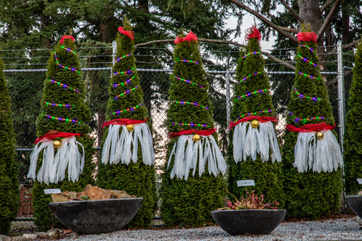

The pretty Arboretum and Botanical Gardens continue to enchant visitors with their holiday at the Arboretum celebration. Marvel at the elaborate outdoor displays, including the 12 Days of Christmas exhibit, and enjoy seasonal treats and activities in Dallas.

### **14\. Dazzle at Enchant Christmas**

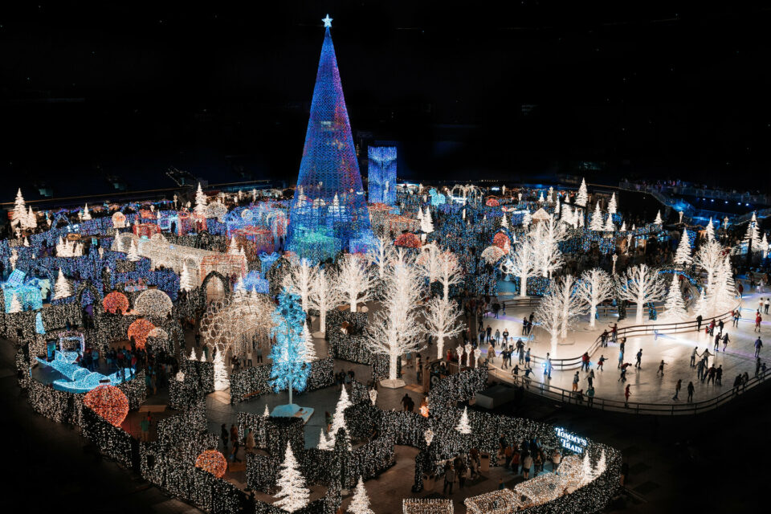

For a truly magical experience, don’t miss Enchant Christmas at Globe Life Field. This Dallas Christmas Activity features a stunning light maze, an ice skating trail, and the opportunity to help Santa find his lost reindeer. It’s an enchanting adventure for all ages.

### **15\. Light Shows Around Town**

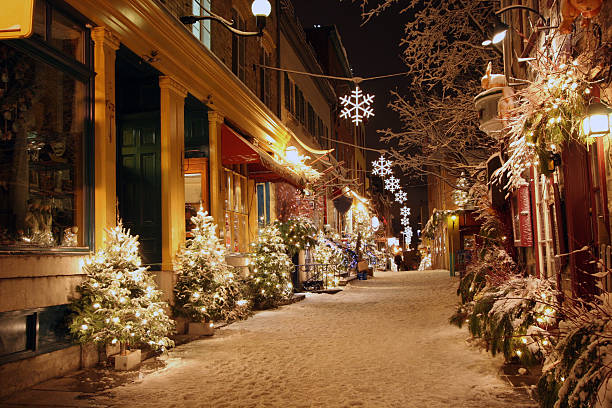

The city of Dallas shines brightly with holiday lights, and there are magnificent displays all across the city. To get into the holiday spirit, drive or walk around well-known neighborhoods for their expensive decorations.

### **16\. Trains at NorthPark**

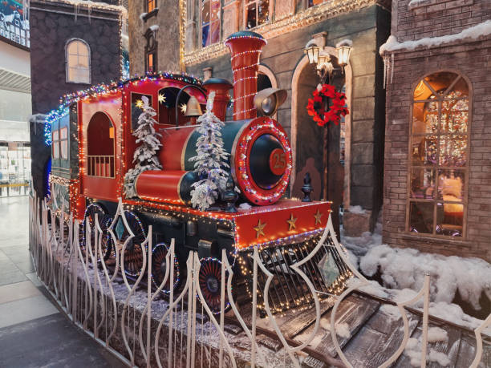

Sitting on a train at the NorthPark exhibit is something you cannot miss when coming to Dallas at Christmas. Marvel at intricate model train layouts that wind through miniature versions of iconic Dallas landmarks. What a lovely Christmas activity!

### **17\. Ice Skating at Galleria**

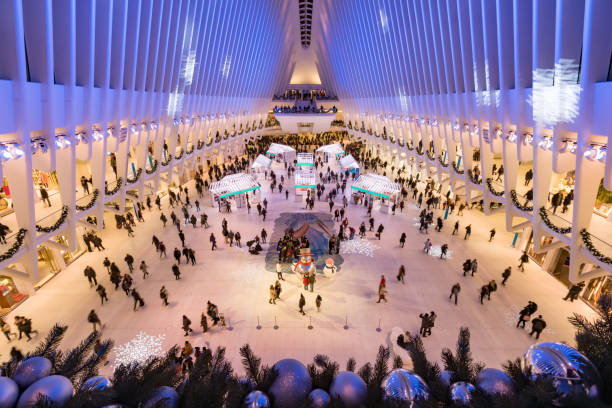

At the Galleria Dallas Ice Skating Center, you can lace up your skates and glide over the ice at your own pace. It’s the best way to have some fun in the snow without leaving the middle of the city—the heart of Dallas.

### **18\. View the Trains at NorthPark**

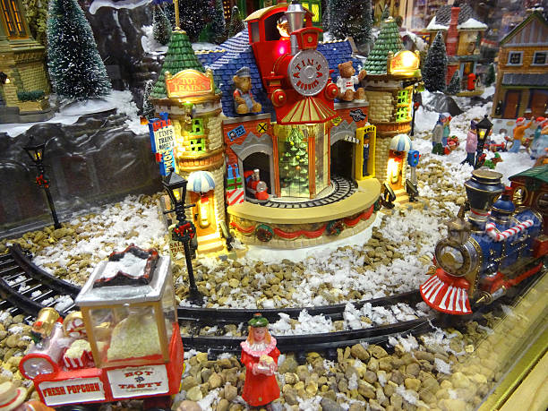

The Trains at NorthPark exhibit is a holiday tradition that benefits the Ronald McDonald House of Dallas. Marvel at intricate model train layouts that wind through miniature versions of iconic Dallas landmarks.

### **19\. Holiday Dance Performances**

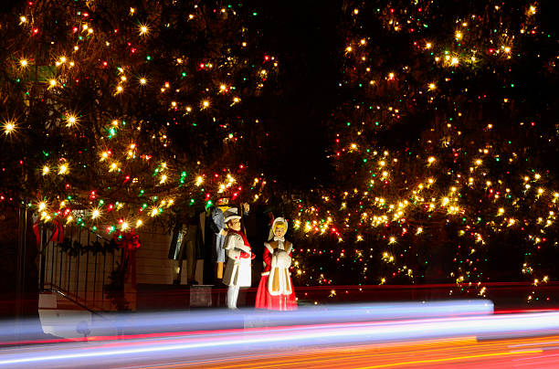

Immerse yourself in the art of dance with holiday-themed performances by local dance companies. From classic ballets like “The Nutcracker” to contemporary shows, Dallas offers a rich tapestry of dance during the holiday season. This Christmas activity is the best thing you can’t miss when you visit this lovely city.

### **20\. Dallas by Chocolate Christmas Lights Tour**

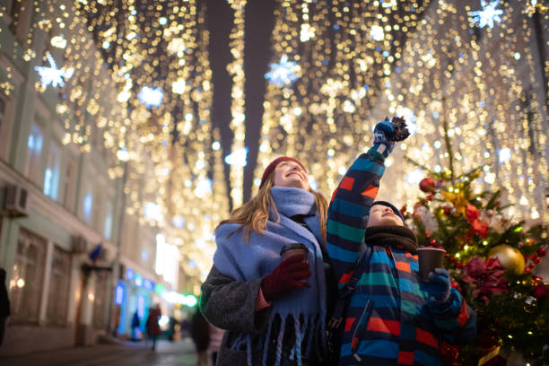

During the Dallas by Chocolate Christmas Lights Tour, you’ll be able to sate your craving for sweets while taking in the festive lights. This Christmas activity in Dallas also helps you experience some of the city’s liveliest areas on this trip, all while sampling some of the city’s most delicious chocolates.

### **21\. Support Small Businesses**

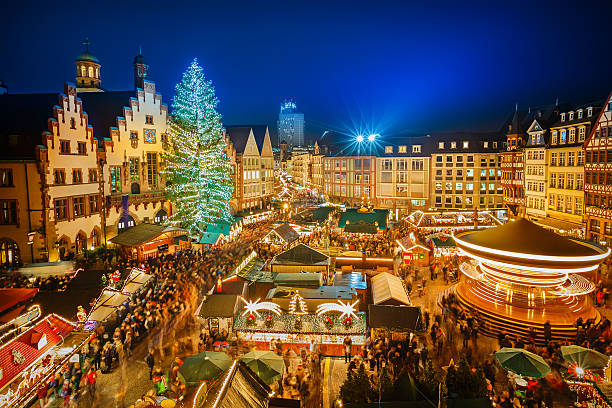

Spending money at locally owned and operated small businesses is a great way to spread holiday pleasure. It is not difficult to locate one-of-a-kind presents for the people in your life, thanks to the growing community of craftsmen and boutique businesses that Dallas is home to.

### **22\. Check out the Boho Market**

The Boho Market is a hub of creativity and craftsmanship. Exploring this vibrant market is an interesting Christmas activity to discover some handmade goods. You can also taste artisanal foods or buy one-of-a-kind gifts that make thoughtful presents.

### **23\. Snowday Immersive Experience**

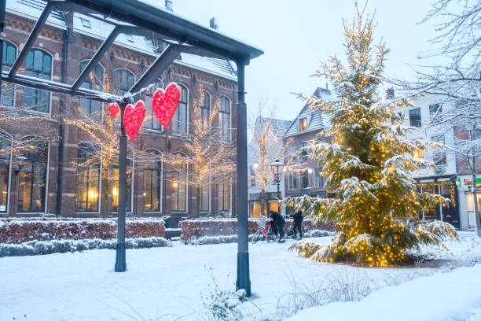

You will get to enjoy the magic of a winter wonderland in Dallas while participating in the snow day experience. With the help of this interactive pop-up, winter landscapes come to life, making it the ideal background for images taken over the Christmas season.

### **24\. Virtual Entertainment**

If you prefer to stay in, Dallas offers a range of virtual holiday entertainment options. From streaming classic Christmas movies to attending virtual celebrations, you can enjoy the season from the comfort of your home with this playful activity.

### **25\. Give Back This Holiday to the Needy**

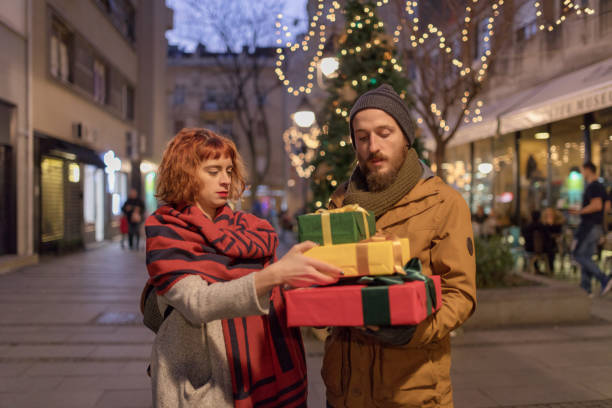

Lastly, consider sharing the holiday spirit by giving back to those in need, which is also a meaningful activity. Dallas has numerous charities and organizations that could use your support during Christmas. Whether you volunteer your time or donate, your generosity can make a meaningful difference in someone’s life.

**_See More:_** [Christmas in July Activities](https://avada.io/loveable/blog/christmas-in-july-activities/)

## **Final Words**

Dallas truly comes alive during Christmas, offering several thoughtful activities and experiences to make your holidays merry and bright. This place has it all, whether you’re seeking festive traditions or new and immersive adventures. Make the most of this special time of year by exploring the **25 Best Christmas Activities in Dallas** this vibrant city offers.

- [25 Best Christmas Activities in Dallas You Should Do](https://avada.io/loveable/blog/christmas-activities-in-dallas/#wp-block-heading-2-3)
    - [1\. Visit Grapevine, The Christmas Capital](https://avada.io/loveable/blog/christmas-activities-in-dallas/#wp-block-heading-3-4)
    - [2\. Shop at the Texas Christkindl Market](https://avada.io/loveable/blog/christmas-activities-in-dallas/#wp-block-heading-3-7)
    - [3\. Celebrate Victorian Christmas at Old City Park](https://avada.io/loveable/blog/christmas-activities-in-dallas/#wp-block-heading-3-10)
    - [4\. Dallas Symphony Holiday Shows](https://avada.io/loveable/blog/christmas-activities-in-dallas/#wp-block-heading-3-13)
    - [5\. Enjoy the Dallas Christmas Village Customs](https://avada.io/loveable/blog/christmas-activities-in-dallas/#wp-block-heading-3-16)
    - [6\. Take Your Kids to Dallas Zoo Lights](https://avada.io/loveable/blog/christmas-activities-in-dallas/#wp-block-heading-3-19)
    - [7\. Miracle on Lowest Greenville](https://avada.io/loveable/blog/christmas-activities-in-dallas/#wp-block-heading-3-22)
    - [8\. Visit the annual Dallas Holiday Parade](https://avada.io/loveable/blog/christmas-activities-in-dallas/#wp-block-heading-3-25)
    - [9\. Attend Dallas Arboretum and Botanical Gardens](https://avada.io/loveable/blog/christmas-activities-in-dallas/#wp-block-heading-3-28)
    - [10\. Enjoy the Holiday Lights from Your Car](https://avada.io/loveable/blog/christmas-activities-in-dallas/#wp-block-heading-3-31)
    - [11\. Santa Claus Visits](https://avada.io/loveable/blog/christmas-activities-in-dallas/#wp-block-heading-3-34)
    - [12\. Experience the Dallas Symphony Orchestra](https://avada.io/loveable/blog/christmas-activities-in-dallas/#wp-block-heading-3-37)
    - [13\. Holiday at the Arboretum](https://avada.io/loveable/blog/christmas-activities-in-dallas/#wp-block-heading-3-40)
    - [14\. Dazzle at Enchant Christmas](https://avada.io/loveable/blog/christmas-activities-in-dallas/#wp-block-heading-3-43)
    - [15\. Light Shows Around Town](https://avada.io/loveable/blog/christmas-activities-in-dallas/#wp-block-heading-3-46)
    - [16\. Trains at NorthPark](https://avada.io/loveable/blog/christmas-activities-in-dallas/#wp-block-heading-3-49)
    - [17\. Ice Skating at Galleria](https://avada.io/loveable/blog/christmas-activities-in-dallas/#wp-block-heading-3-52)
    - [18\. View the Trains at NorthPark](https://avada.io/loveable/blog/christmas-activities-in-dallas/#wp-block-heading-3-55)
    - [19\. Holiday Dance Performances](https://avada.io/loveable/blog/christmas-activities-in-dallas/#wp-block-heading-3-58)
    - [20\. Dallas by Chocolate Christmas Lights Tour](https://avada.io/loveable/blog/christmas-activities-in-dallas/#wp-block-heading-3-61)
    - [21\. Support Small Businesses](https://avada.io/loveable/blog/christmas-activities-in-dallas/#wp-block-heading-3-64)
    - [22\. Check out the Boho Market](https://avada.io/loveable/blog/christmas-activities-in-dallas/#wp-block-heading-3-67)
    - [23\. Snowday Immersive Experience](https://avada.io/loveable/blog/christmas-activities-in-dallas/#wp-block-heading-3-70)
    - [24\. Virtual Entertainment](https://avada.io/loveable/blog/christmas-activities-in-dallas/#wp-block-heading-3-73)
    - [25\. Give Back This Holiday to the Needy](https://avada.io/loveable/blog/christmas-activities-in-dallas/#wp-block-heading-3-76)
- [Final Words](https://avada.io/loveable/blog/christmas-activities-in-dallas/#wp-block-heading-2-80)

### [Blake Simpson](https://avada.io/loveable/author/blake/)

Hi, I'm Blake from Loveable. I help people find perfect gifts for occasions like anniversaries and weddings. I also write a blog about holidays, sharing insights to make them more meaningful. Let's create unforgettable moments together!

- [Twitter](https://twitter.com/intent/tweet)
- [Facebook](https://www.facebook.com/sharer/sharer.php)
- [instagram](https://avada.io/loveable/blog/christmas-activities-in-dallas/)
- [pinterest](https://www.pinterest.com/loveablellc/)

## Related Posts

[### 120+ Christian Birthday Wishes To Spread Your Love](https://avada.io/loveable/blog/christian-birthday-wishes/) 

[

### 35 Best 70th Birthday Ideas To Celebrate The Special Milestone

](https://avada.io/loveable/blog/70th-birthday-ideas/)

[

### 50 Best 30th Birthday Decorations for a Remarkable Birthday Bash

](https://avada.io/loveable/blog/30th-birthday-decorations/)

[

### 40 Delicious Vegan Christmas Desserts to Delight Your Palate

](https://avada.io/loveable/blog/vegan-christmas-desserts/)

[

### 60 Christmas Team Building Activities to Boost Workplace Spirit

](https://avada.io/loveable/blog/christmas-team-building-activities/)
