This article has been written and researched by our expert Loveable through a precise methodology. [Learn more about our methodology](https://avada.io/loveable/our-methodological.html)

[Loveable](https://avada.io/loveable/) > [Blog](https://avada.io/loveable/blog/) > [Holiday](https://avada.io/loveable/holiday/)

# 25 Best Christmas Drinks To Spread Joy and Warmth

Written by [Blake Simpson](https://avada.io/loveable/author/blake/) Last Updated on September 07, 2023

- [25 Best Christmas Drinks To Spread Joy and Warmth](https://avada.io/loveable/blog/christmas-drinks/#wp-block-heading-2-3)
    - [Christmas Martini](https://avada.io/loveable/blog/christmas-drinks/#wp-block-heading-3-4)
    - [Frozen Brandy Old-Fashioneds](https://avada.io/loveable/blog/christmas-drinks/#wp-block-heading-3-9)
    - [Christmas Margarita](https://avada.io/loveable/blog/christmas-drinks/#wp-block-heading-3-14)
    - [Cranberry-Lime Sangria](https://avada.io/loveable/blog/christmas-drinks/#wp-block-heading-3-18)
    - [Gingerbread Martini](https://avada.io/loveable/blog/christmas-drinks/#wp-block-heading-3-22)
    - [Mulled Wine](https://avada.io/loveable/blog/christmas-drinks/#wp-block-heading-3-26)
    - [Christmas Punch](https://avada.io/loveable/blog/christmas-drinks/#wp-block-heading-3-30)
    - [Chocolate Martini](https://avada.io/loveable/blog/christmas-drinks/#wp-block-heading-3-34)
    - [Peppermint Martini](https://avada.io/loveable/blog/christmas-drinks/#wp-block-heading-3-38)
    - [Cider Wassail](https://avada.io/loveable/blog/christmas-drinks/#wp-block-heading-3-42)
    - [Poinsettia](https://avada.io/loveable/blog/christmas-drinks/#wp-block-heading-3-46)
    - [Chocolate Candy Cane Martinis](https://avada.io/loveable/blog/christmas-drinks/#wp-block-heading-3-51)
    - [North Pole Cocktail](https://avada.io/loveable/blog/christmas-drinks/#wp-block-heading-3-55)
    - [Butterscotch Martinis](https://avada.io/loveable/blog/christmas-drinks/#wp-block-heading-3-59)
    - [Hot Buttered Rum](https://avada.io/loveable/blog/christmas-drinks/#wp-block-heading-3-63)
    - [Pomegranate Gin Fizz](https://avada.io/loveable/blog/christmas-drinks/#wp-block-heading-3-67)
    - [Classic Eggnog](https://avada.io/loveable/blog/christmas-drinks/#wp-block-heading-3-71)
    - [Christmas Sangria](https://avada.io/loveable/blog/christmas-drinks/#wp-block-heading-3-75)
    - [Pumpkin Spice White Russian](https://avada.io/loveable/blog/christmas-drinks/#wp-block-heading-3-79)
    - [Santa Clause Smash](https://avada.io/loveable/blog/christmas-drinks/#wp-block-heading-3-83)
    - [Spiked Hot Chocolate](https://avada.io/loveable/blog/christmas-drinks/#wp-block-heading-3-87)
    - [Christmas Mimosa](https://avada.io/loveable/blog/christmas-drinks/#wp-block-heading-3-91)
    - [Pomgaritas](https://avada.io/loveable/blog/christmas-drinks/#wp-block-heading-3-95)
    - [Spiked Apple Cider](https://avada.io/loveable/blog/christmas-drinks/#wp-block-heading-3-99)
    - [Peppermint Patty](https://avada.io/loveable/blog/christmas-drinks/#wp-block-heading-3-103)
- [Final Thoughts](https://avada.io/loveable/blog/christmas-drinks/#wp-block-heading-2-110)

The holiday season is upon us, and one of the most delightful ways to celebrate is by indulging in festive Christmas drinks. From heartwarming traditional favorites to creative and modern concoctions, these beverages are sure to add a touch of merriment to your celebrations. In this article, we’ll explore a variety of **Christmas drinks** that are perfect for spreading joy and warmth.

Are you excited to begin this festive journey?

## **25 Best Christmas Drinks To Spread Joy and Warmth**

### **Christmas Martini**

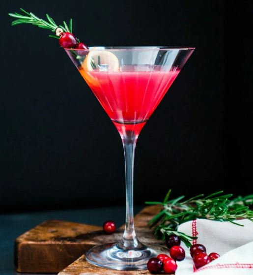

Fancy a remarkable and signature Christmas cocktail? Look no further than the Christmas Martini, a delightful blend of sweet and tart flavors, making it not only delicious but also a stunning addition to your festive celebrations! 

This martini is an ideal choice for entertaining, offering simplicity in preparation and showcasing a vibrant, captivating hue thanks to cranberry juice.

[Get the Christmas Martini recipe!](https://www.acouplecooks.com/christmas-martini/)

### **Frozen Brandy Old-Fashioneds**

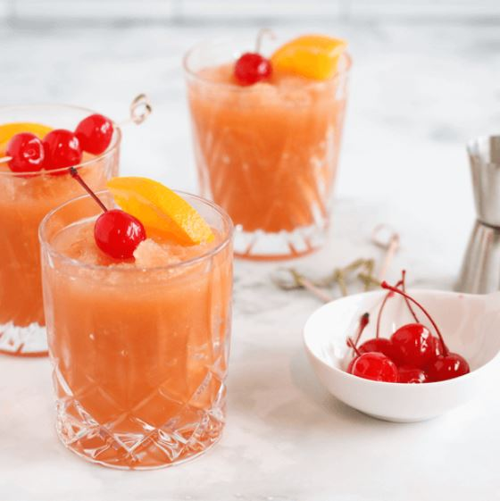

Embrace the holiday spirit even when the temperatures drop with these Frozen Brandy Old-Fashioneds, a delightful twist on the classic Wisconsin cocktail. This chilled rendition is ideal for kicking off your festive celebrations. 

The convenient make-ahead mixture ensures you’re ready to serve a delightful Christmas drink to your loved ones.

[Get the Frozen Brandy Old-Fashioneds recipe!](https://www.tasteofhome.com/recipes/frozen-brandy-old-fashioneds/)

### **Christmas Margarita**

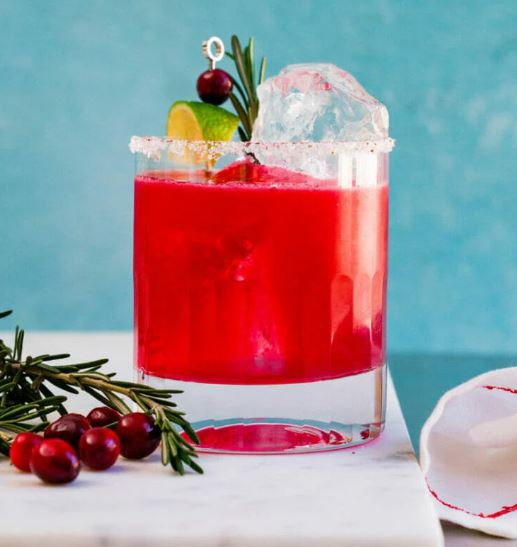

Introducing our beloved Christmas Margarita, another festive cocktail that captures the essence of the holiday season! This vibrant red libation is a feast for the eyes, and its delightful blend of sweet and tart flavors offers a crisp and invigorating experience. 

[Get the Christmas Margarita recipe!](https://www.acouplecooks.com/christmas-margarita/)

### **Cranberry-Lime Sangria**

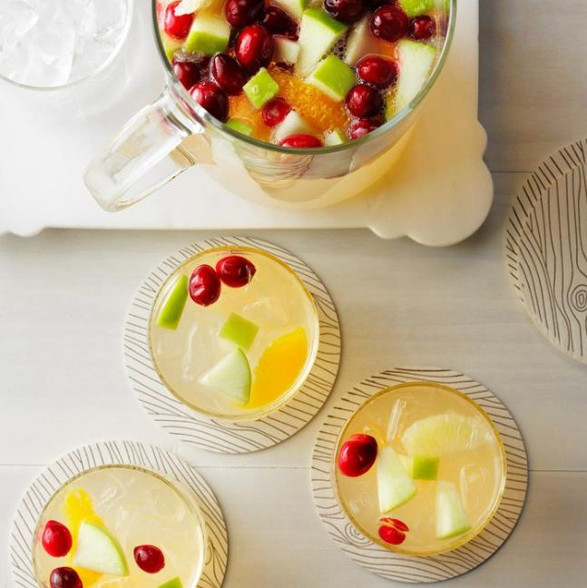

This refreshingly tangy and bright concoction is a surefire hit for your Christmas Eve celebrations or a festive holiday brunch. This delightful drink is not only perfect for planned gatherings but also incredibly convenient for unexpected guests, as it can be prepared ahead of time and kept ready for those delightful drop-in visits. 

[Get the Cranberry-Lime Sangria recipe!](https://www.tasteofhome.com/recipes/cranberry-lime-sangria/)

### **Gingerbread Martini**

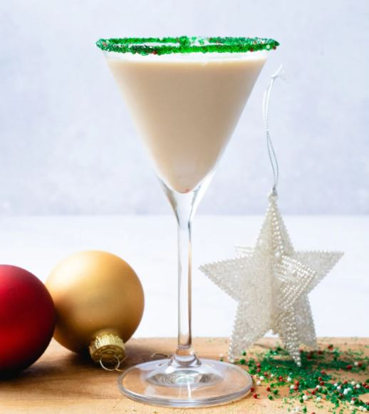

Searching for the ultimate Christmas drink to infuse some festive spirit? Look no further than the delightful Gingerbread Martini! This creamy libation is an absolute temptation, striking the perfect balance of sweetness and richly infused with the warmth of cinnamon, allspice, and ginger. 

[Get the Gingerbread Martini recipe!](https://www.acouplecooks.com/gingerbread-martini/)

### **Mulled Wine**

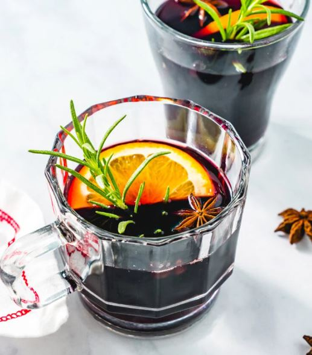

Discover the timeless delight of Mulled Wine, the quintessential holiday warmer crafted from red wine infused with a harmonious blend of comforting and aromatic spices, sure to envelop your holiday guests in a cozy embrace. 

[Get the Mulled Wine recipe!](https://www.acouplecooks.com/mulled-wine-recipe/)

### **Christmas Punch**

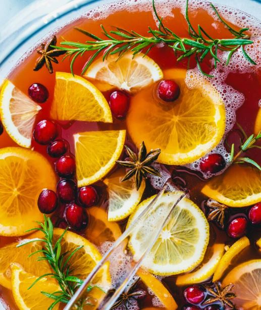

Its fruity and delicious flavor profile comes alive with a delightful sparkle from the addition of ginger ale. You have the option to craft it as a spirited punch with rum or enjoy it as a non-alcoholic delight by omitting the alcohol. 

[Get the Christmas Punch recipe!](https://www.acouplecooks.com/christmas-punch/)

### **Chocolate Martini**

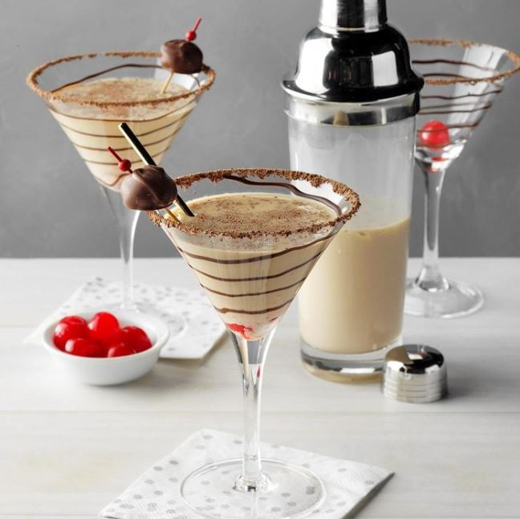

Introducing the Chocolate Martini Recipe, a delectable libation that boasts an enchanting appearance while delivering a delightful punch of flavor. Like many of the finest holiday vodka concoctions, this martini is a harmonious blend of elegance and potency, ensuring that your holiday festivities have a touch of glamour. 

[Get the Chocolate Martini recipe!](https://www.tasteofhome.com/recipes/double-chocolate-martini/)

### **Peppermint Martini**

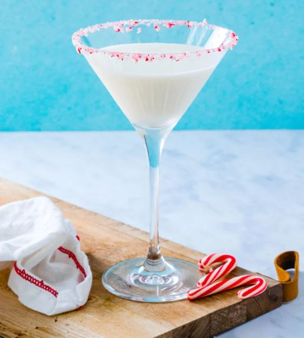

This Peppermint Martini is a wonderful addition to your holiday festivities, bringing joy and indulgence in every sip. Cheers to a truly delightful and unforgettable holiday treat!

[Get the Peppermint Martini recipe!](https://www.acouplecooks.com/peppermint-martini/)

### **Cider Wassail**

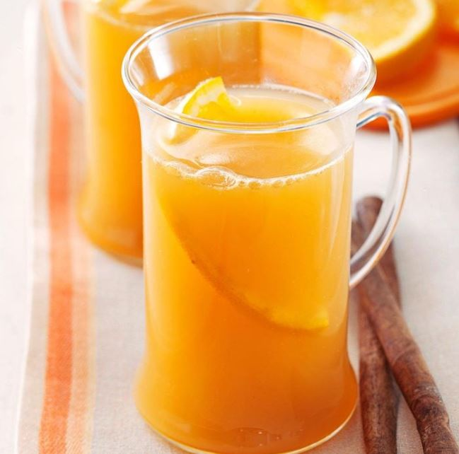

Indulge in the heartwarming flavors of Cider Wassail, a cherished recipe passed down from a beloved friend residing in Fort Wayne, Indiana, where we spent numerous cherished years. The appeal of this traditional wassail lies not only in its warmth and exceptional taste but also in its non-alcoholic nature, making it a delightful addition even for gatherings at our local church. 

[Get the Cider Wassail recipe!](https://www.tasteofhome.com/recipes/cider-wassail/)

### **Poinsettia**

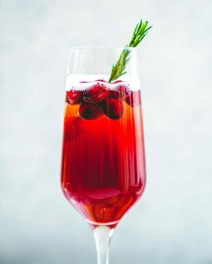

Prepare yourself for the ultimate in festive, effervescent Christmas cocktails: introducing the enchanting Poinsettia, a delightful concoction featuring cranberry and champagne! Its radiant hue and inviting ambiance render it a superb choice for the cozy winter months. 

With a straightforward list of ingredients, the Poinsettia brings simplicity and joy to your glass. Cheers to the vibrant allure and delicious charm of the Poinsettia cocktail, ready to infuse any moment with a burst of celebratory spirit!

[Get the Poinsettia recipe!](https://www.acouplecooks.com/poinsettia-drink-cranberry-champagne-cocktail/)

### **Chocolate Candy Cane Martinis**

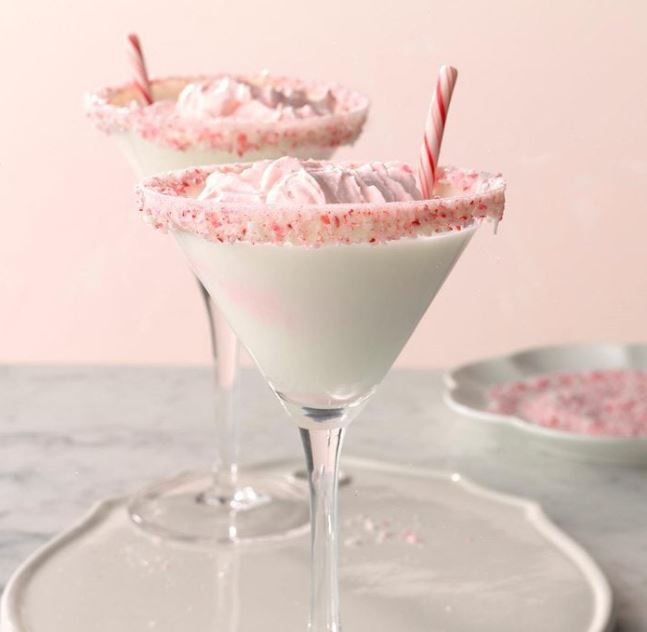

It is a delightful peppermint-infused martini that serves as the ultimate treat for a festive gathering among friends during Christmastime. The allure of this vodka cocktail lies not just in its taste but also in its artful presentation, with attention lavished on every detail. 

[Get the Chocolate Candy Cane Martinis recipe!](https://www.tasteofhome.com/recipes/chocolate-candy-cane-martinis/)

### **North Pole Cocktail**

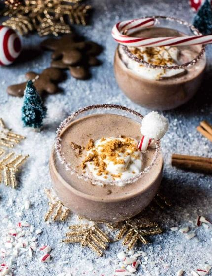

This enchanting concoction is a harmonious blend of sweetness with a delightful touch of chocolatey goodness, complemented by a subtle hint of peppermint and ginger. Imagine the perfect marriage of a gingerbread martini and a luscious chocolate martini, resulting in a truly magical experience! 

[Get the North Pole Cocktail recipe!](https://www.halfbakedharvest.com/north-pole-cocktail/)

### **Butterscotch Martinis**

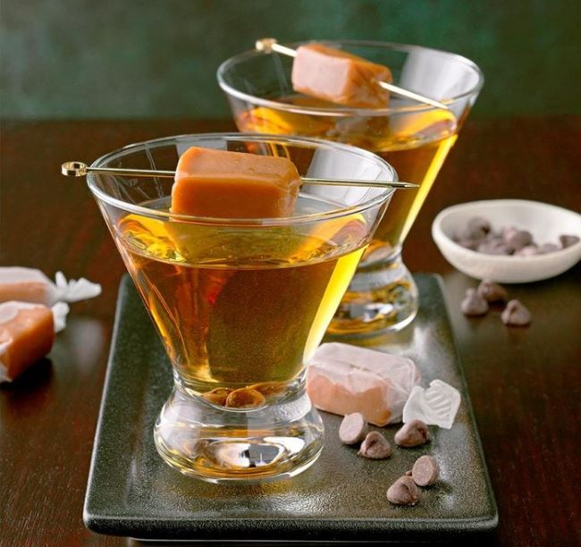

This perfect post-dinner treat offers the decadent flavors of butterscotch in the form of a captivating martini. With each sip, you’ll experience a harmonious blend of rich butterscotch flavors that evoke the essence of dessert, making it a delightful alternative to traditional sweet treats. 

[Get the Butterscotch Martinis recipe!](https://www.tasteofhome.com/recipes/butterscotch-martinis/)

### **Hot Buttered Rum**

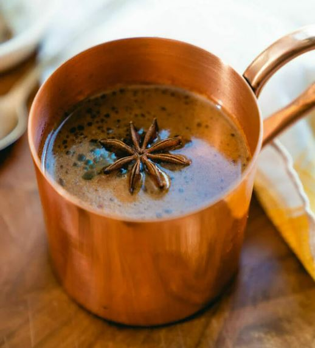

Indulge in the perfect fireside companion on those chilly evenings: the classic Hot Buttered Rum! The mere mention of its name evokes a comforting warmth that spreads from within. This time-honored libation has graced our glasses for centuries, especially during the cherished Christmas season. 

[Get the Hot Buttered Rum recipe!](https://www.acouplecooks.com/hot-buttered-rum/)

### **Pomegranate Gin Fizz**

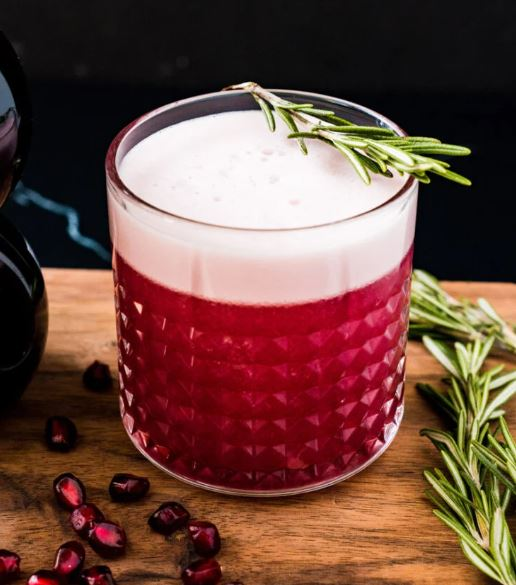

Behold a cocktail that we believe is truly exceptional: the exquisite Pomegranate Gin Fizz! We’ve taken the classic to new heights with a tantalizing pomegranate twist that enhances its sweet-tart essence and infuses it with a captivating jewel-toned hue. 

[Get the Pomegranate Gin Fizz recipe!](https://www.acouplecooks.com/pomegranate-gin-cocktail/)

### **Classic Eggnog**

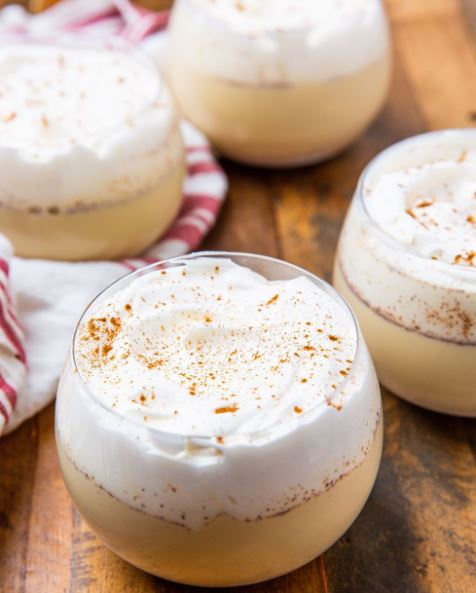

Eggnog is a special winter drink that people enjoy or dislike. It’s thick, creamy, and has a distinct eggy taste. We’re big fans of eggnog (like, really big fans), and we happily enjoy it either cold or hot all through the winter season. It’s our go-to drink when the weather gets chilly, bringing a cozy and nostalgic feeling to the holidays.

[Get the Classic Eggnog recipe!](https://www.delish.com/cooking/recipe-ideas/recipes/a50609/classic-eggnog-recipe/)

### **Christmas Sangria**

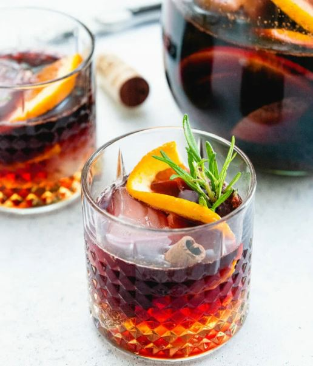

Prepare to be enchanted by the harmonious blend of cozy and refreshing notes in this Christmas cocktail—an extraordinary fusion that captures the spirit of the season while providing a revitalizing sip. Cheers to the delightful balance of flavors that will leave you longing for more, no matter the time of year!

[Get the Christmas Sangria recipe!](https://www.acouplecooks.com/apple-cider-sangria/)

### **Pumpkin Spice White Russian**

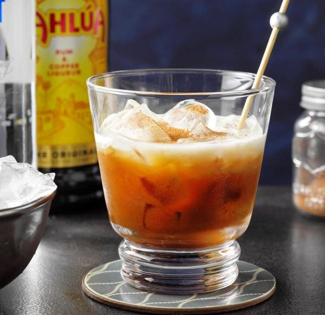

The result is a harmonious combination of creamy textures and warm spices that captures the essence of the holiday season. This festive concoction is bound to become your go-to Christmas drink, effortlessly transforming an ordinary evening into a cozy and memorable festive experience.

[Get the Pumpkin Spice White Russian recipe!](https://www.tasteofhome.com/recipes/pumpkin-spice-white-russian/)

### **Santa Clause Smash**

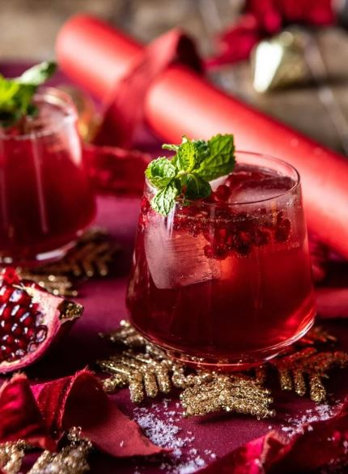

This is g a delightful Christmas cocktail that pays homage to the jolly man of the season. Crafted with homemade ginger honey syrup, luscious pomegranate, comforting bourbon, the zest of winter citrus, subtle hints of vanilla, and a refreshing touch of fizzy ginger beer, this concoction guarantees a joyful and snugly festive experience. 

[Get the Santa Clause Smash recipe!](https://www.halfbakedharvest.com/the-santa-clause-smash/)

### **Spiked Hot Chocolate**

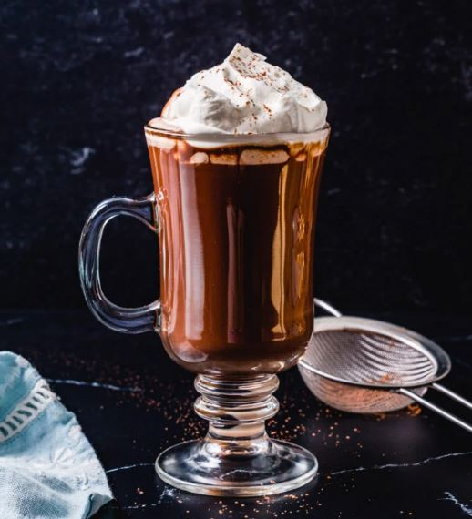

This exquisite concoction is more than a drink—it’s a journey into a world of delightful flavors and heartwarming sensations, perfect for enjoying the comforts of winter by the fireside.

[Get the Spiked Hot Chocolate recipe!](https://www.acouplecooks.com/spiked-hot-chocolate/)

### **Christmas Mimosa**

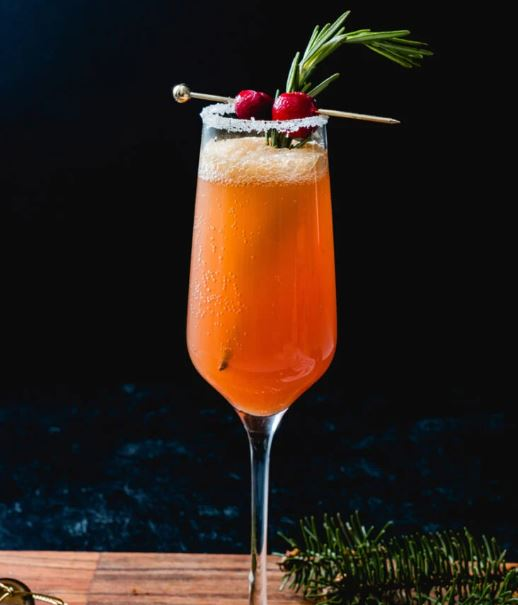

What could be more full of holiday cheer than starting your Christmas morning with a delightful Christmas Mimosa? This delightful beverage is effervescent, making it a perfect fit for the festive season.

[Get the Christmas Mimosa recipe!](https://www.acouplecooks.com/christmas-mimosa/)

### **Pomgaritas**

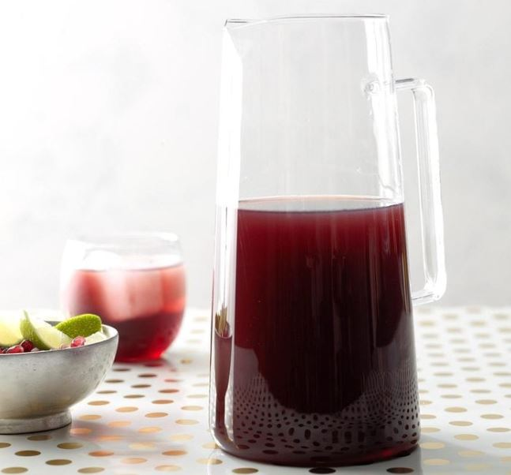

When it comes to Christmas drinks, this delightful twist on the classic margarita will add a burst of tartness with the essence of pomegranate juice. The deep ruby hue of this concoction makes it a perfect choice for Christmas drinks, adding a touch of elegance to your holiday gatherings. 

[Get the Pomgaritas recipe!](https://www.tasteofhome.com/recipes/pomgaritas/)

### **Spiked Apple Cider**

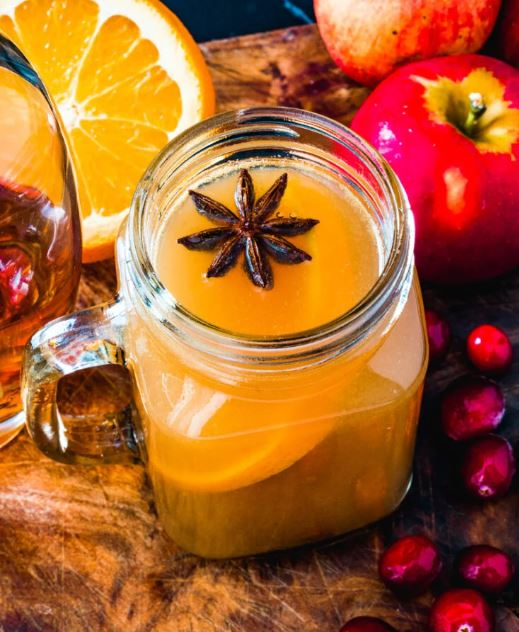

Introducing a warm and comforting Christmas cocktail that fills your kitchen with the delightful aromas of the holiday season: the Spiked and Spiced Apple Cider! This drink is tailor-made for the transition into cooler weather, providing the perfect blend of flavors and spirits. 

[Gett the Spiked Apple Cider recipe!](https://www.acouplecooks.com/spiked-apple-cider/)

### **Peppermint Patty**

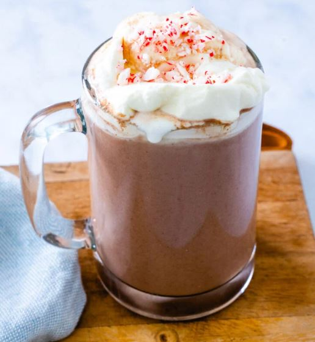

Indulge in the ultimate comfort of a mug that you’ll find irresistible to put down: the Peppermint Patty! This delightful hot chocolate is infused with not just one, but two exquisite liqueurs, introducing a delectable blend of mint and chocolate flavors that beautifully intertwine with the velvety richness of the beverage. 

[Get the Peppermint Patty recipe!](https://www.acouplecooks.com/peppermint-patty-drink/)

**_See More:_**

- Best [Christmas Cookie Recipes](https://avada.io/loveable/christmas-cookie-recipes/)

- Must-Try [Christmas Dinner Ideas](https://avada.io/loveable/christmas-dinner-ideas/)

## **Final Thoughts**

This holiday season, elevate your festive gatherings with a range of **Christmas drinks** that cater to every taste and preference. From classic favorites to creative twists, there’s something for everyone to enjoy. 

Whether you’re sipping on a cozy mug of hot cocoa, indulging in a decadent martini, or toasting with a sparkling pomegranate delight, these recipes will elevate your yuletide gatherings to a whole new level. Cheers to warmth, laughter, and the joy of the season!

- [25 Best Christmas Drinks To Spread Joy and Warmth](https://avada.io/loveable/blog/christmas-drinks/#wp-block-heading-2-3)
    - [Christmas Martini](https://avada.io/loveable/blog/christmas-drinks/#wp-block-heading-3-4)
    - [Frozen Brandy Old-Fashioneds](https://avada.io/loveable/blog/christmas-drinks/#wp-block-heading-3-9)
    - [Christmas Margarita](https://avada.io/loveable/blog/christmas-drinks/#wp-block-heading-3-14)
    - [Cranberry-Lime Sangria](https://avada.io/loveable/blog/christmas-drinks/#wp-block-heading-3-18)
    - [Gingerbread Martini](https://avada.io/loveable/blog/christmas-drinks/#wp-block-heading-3-22)
    - [Mulled Wine](https://avada.io/loveable/blog/christmas-drinks/#wp-block-heading-3-26)
    - [Christmas Punch](https://avada.io/loveable/blog/christmas-drinks/#wp-block-heading-3-30)
    - [Chocolate Martini](https://avada.io/loveable/blog/christmas-drinks/#wp-block-heading-3-34)
    - [Peppermint Martini](https://avada.io/loveable/blog/christmas-drinks/#wp-block-heading-3-38)
    - [Cider Wassail](https://avada.io/loveable/blog/christmas-drinks/#wp-block-heading-3-42)
    - [Poinsettia](https://avada.io/loveable/blog/christmas-drinks/#wp-block-heading-3-46)
    - [Chocolate Candy Cane Martinis](https://avada.io/loveable/blog/christmas-drinks/#wp-block-heading-3-51)
    - [North Pole Cocktail](https://avada.io/loveable/blog/christmas-drinks/#wp-block-heading-3-55)
    - [Butterscotch Martinis](https://avada.io/loveable/blog/christmas-drinks/#wp-block-heading-3-59)
    - [Hot Buttered Rum](https://avada.io/loveable/blog/christmas-drinks/#wp-block-heading-3-63)
    - [Pomegranate Gin Fizz](https://avada.io/loveable/blog/christmas-drinks/#wp-block-heading-3-67)
    - [Classic Eggnog](https://avada.io/loveable/blog/christmas-drinks/#wp-block-heading-3-71)
    - [Christmas Sangria](https://avada.io/loveable/blog/christmas-drinks/#wp-block-heading-3-75)
    - [Pumpkin Spice White Russian](https://avada.io/loveable/blog/christmas-drinks/#wp-block-heading-3-79)
    - [Santa Clause Smash](https://avada.io/loveable/blog/christmas-drinks/#wp-block-heading-3-83)
    - [Spiked Hot Chocolate](https://avada.io/loveable/blog/christmas-drinks/#wp-block-heading-3-87)
    - [Christmas Mimosa](https://avada.io/loveable/blog/christmas-drinks/#wp-block-heading-3-91)
    - [Pomgaritas](https://avada.io/loveable/blog/christmas-drinks/#wp-block-heading-3-95)
    - [Spiked Apple Cider](https://avada.io/loveable/blog/christmas-drinks/#wp-block-heading-3-99)
    - [Peppermint Patty](https://avada.io/loveable/blog/christmas-drinks/#wp-block-heading-3-103)
- [Final Thoughts](https://avada.io/loveable/blog/christmas-drinks/#wp-block-heading-2-110)

### [Blake Simpson](https://avada.io/loveable/author/blake/)

Hi, I'm Blake from Loveable. I help people find perfect gifts for occasions like anniversaries and weddings. I also write a blog about holidays, sharing insights to make them more meaningful. Let's create unforgettable moments together!

- [Twitter](https://twitter.com/intent/tweet)
- [Facebook](https://www.facebook.com/sharer/sharer.php)
- [instagram](https://avada.io/loveable/blog/christmas-drinks/)
- [pinterest](https://www.pinterest.com/loveablellc/)

## Related Posts

[### 120+ Christian Birthday Wishes To Spread Your Love](https://avada.io/loveable/blog/christian-birthday-wishes/) 

[

### 35 Best 70th Birthday Ideas To Celebrate The Special Milestone

](https://avada.io/loveable/blog/70th-birthday-ideas/)

[

### 50 Best 30th Birthday Decorations for a Remarkable Birthday Bash

](https://avada.io/loveable/blog/30th-birthday-decorations/)

[

### 40 Delicious Vegan Christmas Desserts to Delight Your Palate

](https://avada.io/loveable/blog/vegan-christmas-desserts/)

[

### 60 Christmas Team Building Activities to Boost Workplace Spirit

](https://avada.io/loveable/blog/christmas-team-building-activities/)
