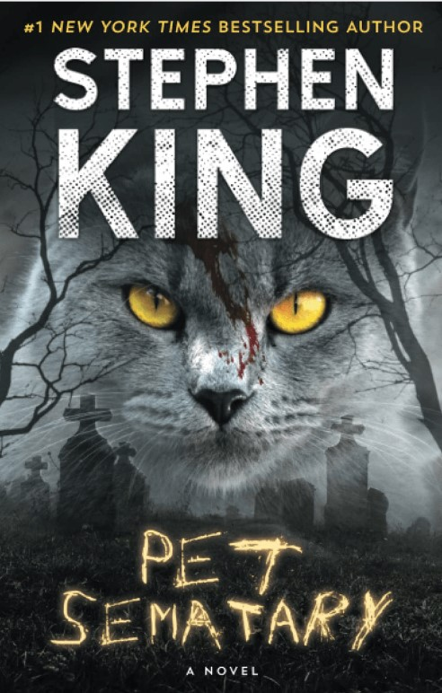

This article has been written and researched by our expert Loveable through a precise methodology. [Learn more about our methodology](https://avada.io/loveable/our-methodological.html)

[Loveable](https://avada.io/loveable/) > [Blog](https://avada.io/loveable/blog/) > [Holiday](https://avada.io/loveable/holiday/)

# 25 Best Halloween Books in 2023 that’ll Keep You Wondering At Night

Written by [Blake Simpson](https://avada.io/loveable/author/blake/) Last Updated on September 08, 2023

- [25 Best Halloween Books To Read on A Halloween Night](https://avada.io/loveable/blog/halloween-books/#wp-block-heading-2-3)
    - [The Very Secret Society of Irregular Witches by Sangu Mandanna](https://avada.io/loveable/blog/halloween-books/#wp-block-heading-3-4)
    - [The Haunting of Hill House by Shirley Jackson](https://avada.io/loveable/blog/halloween-books/#wp-block-heading-3-7)
    - [The Once and Future Witches by Alix E. Harrow](https://avada.io/loveable/blog/halloween-books/#wp-block-heading-3-10)
    - [Frankenstein by Mary Shelley](https://avada.io/loveable/blog/halloween-books/#wp-block-heading-3-13)
    - [The Graveyard Book by Neil Gaiman](https://avada.io/loveable/blog/halloween-books/#wp-block-heading-3-16)
    - [The Legend of Sleepy Hollow by Washington Irving](https://avada.io/loveable/blog/halloween-books/#wp-block-heading-3-19)
    - [A Discovery of Witches by Deborah Harkness](https://avada.io/loveable/blog/halloween-books/#wp-block-heading-3-22)
    - [Dracula by Bram Stoker](https://avada.io/loveable/blog/halloween-books/#wp-block-heading-3-25)
    - [Ten Great Mysteries by Edgar Allan Poe](https://avada.io/loveable/blog/halloween-books/#wp-block-heading-3-28)
    - [The Kiss Curse: A Novel by Erin Sterling](https://avada.io/loveable/blog/halloween-books/#wp-block-heading-3-31)
    - [The Shadow Knows by Diane Johnson](https://avada.io/loveable/blog/halloween-books/#wp-block-heading-3-34)
    - [The Devourers by Indra Das](https://avada.io/loveable/blog/halloween-books/#wp-block-heading-3-37)
    - [A Flicker in the Dark: A Novel by Stacy Willingham](https://avada.io/loveable/blog/halloween-books/#wp-block-heading-3-40)
    - [Fairy Tale by Stephen King](https://avada.io/loveable/blog/halloween-books/#wp-block-heading-3-43)
    - [Demon Copperhead by Barbara Kingsolver](https://avada.io/loveable/blog/halloween-books/#wp-block-heading-3-46)
    - [Mexican Gothic by Silvia Moreno-Garcia](https://avada.io/loveable/blog/halloween-books/#wp-block-heading-3-49)
    - [Love in the Time of Serial Killers by Alicia Thompson](https://avada.io/loveable/blog/halloween-books/#wp-block-heading-3-52)
    - [The House on Foster Hill by Jaime Jo Wright](https://avada.io/loveable/blog/halloween-books/#wp-block-heading-3-55)
    - [Always the First to Die by R.J.Jacobs](https://avada.io/loveable/blog/halloween-books/#wp-block-heading-3-58)
    - [White is for Witching by Helen Oyeyemi](https://avada.io/loveable/blog/halloween-books/#wp-block-heading-3-61)
    - [Pet Sematary by Stephen King](https://avada.io/loveable/blog/halloween-books/#wp-block-heading-3-64)
    - [Angelika Frankenstein Makes Her Match by Sally Thorne](https://avada.io/loveable/blog/halloween-books/#wp-block-heading-3-67)
    - [In the Night Wood by Dale Bailey](https://avada.io/loveable/blog/halloween-books/#wp-block-heading-3-70)
    - [Coraline by Neil Gaiman](https://avada.io/loveable/blog/halloween-books/#wp-block-heading-3-73)
    - [Her Body and Other Parties by Carmen Maria Machado](https://avada.io/loveable/blog/halloween-books/#wp-block-heading-3-76)
- [Bottom Line](https://avada.io/loveable/blog/halloween-books/#wp-block-heading-2-82)

When the leaves start to change color, nothing sets the mood quite like cozying up with a good book. From spooky stories of [witches](https://avada.io/loveable/witch-gifts/) and vampires to chilling thrillers that will keep you up all night, whatever your preference in genre, October provides a great excuse for reading some mysterious Halloween books. Get ready to hunker down with an eerie read this fall – it’s sure to be an unforgettable experience.

For this October, we have carefully selected a range of the **best Halloween books** on the market, including bestsellers, [Halloween-themed stories](https://avada.io/loveable/blog/best-halloween-stories/), and classic staples such as Coraline and Frankenstein. Whether you are looking for something classic or modern, we’ve got it all covered. Check them out now!

## **25 Best Halloween Books To Read on A Halloween Night**

### **The Very Secret Society of Irregular Witches by Sangu Mandanna**

Mika Moon is one of the only witches in Britain. She must remain secretive about her abilities and keep her distance from other witches. However, this all changes when she begins uploading videos of herself “pretending” to be a witch. Unexpectedly, she is contacted by an anonymous account that begs her to go to Nowhere House to teach young witches. There she meets a grumpy librarian named Jamie, who will stop at nothing to ensure the safety of the other witches.

### **The Haunting of Hill House by Shirley Jackson**

The Haunting of Hill House is among the best Halloween books of all time. This is a must-read for those who are a fan of the [series on Netflix](https://www.netflix.com/title/80189221). Dr. John Montague, a researcher, sets up a social experiment at Hill House, a labyrinthine manor. The eerie mansion prepares guests to experience strange noises, chilling sensations, and smells. But is Dr. Montague actually in control of these unexplainable events? Participants will soon find out.

### **The Once and Future Witches by Alix E. Harrow**

The Once and Future Witches has been a popular hit on Goodreads in 2020. It tells the story of three 1893 New Salem suffragists, the Eastwood sisters, who fight for modern women’s rights – including those of actual witches! It makes for a great Halloween book this year – an entertaining mix of history, fantasy, and magic that screams Halloween!

### **Frankenstein by Mary Shelley**

No Halloween book collection is complete without Mary Shelley’s iconic novel Frankenstein. Published first anonymously in 1818 and again with her name in 1831, this groundbreaking work of science fiction has [captivated readers](https://avada.io/loveable/gifts-readers/) of all ages for centuries. The book tells a story about a manufactured monster, Frankenstein, who is rejected by society and serves as a scary reminder of humanity’s power to control life, death, and nature.

### **The Graveyard Book by Neil Gaiman**

Although this is a children’s novel, Neil Gaiman’s Newbery Award-winning The Graveyard Book will appeal to a wide range of readers. Nobody Owens, a human kid raised by ghosts, is the protagonist of The Graveyard Book. The phantoms are fun to be around, but will Nobody ever overcome his fears and venture outside the graveyard to confront the guy who murdered his family?

### **The Legend of Sleepy Hollow by Washington Irving**

Even if you have never read The Legend of Sleepy Hollow, you have probably heard of the Headless Horseman. A beheaded ghost and haunted townspeople in a Gothic setting? Sounds like a spooky Halloween book this October.

### **A Discovery of Witches by Deborah Harkness**

This Halloween book recommendation, A Discovery of Witches, is sure to be a hit with readers who have embraced the dark academic trend in fiction. Combining this popular genre with the traditional mystique of supernatural [creatures associated with Halloween](https://avada.io/loveable/blog/halloween-animals/), this book introduces us to an Oxford scholar whose discovery of a long-lost manuscript unlocks a world of witches and vampires. With equal parts sensual romance, historical fiction, and addicting fantasy woven through its pages, A Discovery of Witches is the perfect choice for a spellbinding Halloween book – and it’s just the first in a trilogy!

### **Dracula by Bram Stoker**

First published in 1897, the novel follows Jonathan Harker as he traverses Transylvania to meet the mysterious Count Dracula. Despite multiple warnings about the danger ahead, Jonathan carries on with his fateful journey that culminates into a dark tale filled with sharp wit and survival. Furthermore, readers are still captivated by this story of star-crossed love that has remained relevant till today.

### **Ten Great Mysteries by Edgar Allan Poe**

If you’re looking for a quick but spooky fix this Halloween, Edgar Allan Poe’s collection of classic spine-tingling stories is the perfect choice. From the haunting tone of “The Fall of the House of Usher” to the gothic tragedy of “Lenore,” these timeless tales will transport you right back to your teenage camping trips where ghost stories were swapped around the fire. With this festive collection, you’ll be able to recapture that scary atmosphere in no time.

### **The Kiss Curse: A Novel by Erin Sterling**

Erin Sterling’s festive treat, The Kiss Curse, is set to delight readers this holiday season. Following in the footsteps of her successful previous novel, The Ex Hex, this novel follows the story of Gwyn Jones and Wells Penhallow, who have formed a coven together with Gwyn’s family members. Everything seems perfect until Wells opens a rival shop directly to Gwyn’s shop. Things take an exciting turn when they have to put their differences aside and form an unlikely partnership after a powerful coven starts causing Gwyn’s powers to diminish. It’s up to them to find out what is happening before it is too late. With secrets, magic, and thrilling adventures, this novel promises a captivating experience for readers.

### **The Shadow Knows by Diane Johnson**

Halloween horrors are all in our heads, but that doesn’t make them any less scary for N, a struggling young mother who discovers a blood-smeared door one day. Unable to shake her unsettling paranoia, everyday life begins to have hidden layers of mystery that she struggles to understand and unravel. This 1974 psychological thriller perfectly captures the tightrope walk between uncertainty and reality – making it an excellent piece of literature for any Halloween reading list.

### **The Devourers by Indra Das**

Indra Das’s 2017 debut novel is a blend of Indian folklore and horror. The story follows an Indian history professor named Alok, who is drawn into the darkly enchanting world of a stranger professing to be a part werewolf, embarking on an adventure down a dark path that combines modern stories with the deep past. Anyone looking for something more than average Halloween books should check out this breathtaking work.

### **A Flicker in the Dark: A Novel by Stacy Willingham**

Engaged psychologist Chloe Davis is far from her hometown of Baton Rouge, Louisiana. Even though she has left much behind, including her father’s confession to the murders of six teenage girls, she quickly realizes that her past could be catching up with her when two girls under similar circumstances go missing. As this haunting evidence confronts Chloe, it becomes increasingly clear that she must confront her past and help solve this case before anything else happens.

### **Fairy Tale by Stephen King**

Stephen King is an integral part of Halloween, like [Halloween pumpkins](https://avada.io/loveable/blog/halloween-pumpkin/) and candy. His latest work, “Fairy Tale” is a page-turner that is released just in time for the season, with all the classic elements of a King novel. A boy and his dog embroiled in an alternate universe teeming with fantasy, an old man living in an old house, a pot of gold, and countless unforgettable characters that could only exist inside King’s mind.

### **Demon Copperhead by Barbara Kingsolver**

In her new book, Barbara Kingsolver presents a remarkable adaptation of Charles Dickens’s classic David Copperfield. Set in the Appalachian Mountains, the novel follows the story of a young boy born into poverty as he navigates the perils of growing up in America’s South. From foster care to child labor and failing schools, this survivor’s tale is a compelling read that should be at the top of your list for spooky Halloween books.

### **Mexican Gothic by Silvia Moreno-Garcia**

This 2020 psychological horror novel set in 1950s Mexico centers around a woman who suspects her husband of trying to murder her. It is an atmospheric and dark tale, reminiscent of the Gothic horror genre, with its lush mansion setting, thrilling suspense, and supernatural elements making it one of the best horror novels ever written and one of the best books by Latinx authors. Read with caution – you might be looking over your shoulder for a few days after completing this spine-tingling Halloween book!

### **Love in the Time of Serial Killers by Alicia Thompson**

Phoebe Walsh, a Ph.D. candidate, has a true crime fascination that interferes with her dating life. When she returns to Florida to clean up her father’s house, she starts to believe that his next-door neighbor is a serial murderer.

### **The House on Foster Hill by Jaime Jo Wright**

Despite what the police say, Kaine Prescott believes her husband’s death was not an accident. She moved into a run-down house in a tiny and desolate Wisconsin town. Ivy Thorpe, who lived in the same house a century before Kaine, had a similar story. The narrative follows both storylines as they deal with their loss and trauma.

### **Always the First to Die by R.J.Jacobs**

This thriller set in the Florida Keys has everything you’d want in a Halloween book: a horror film set in a cursed mansion, a spouse who died under unexplained circumstances, and a hurricane that has knocked out electricity in the neighborhood.

### **White is for Witching by Helen Oyeyemi**

Miranda suffers from unusual diseases and begins hearing voices when her mother dies. Her scary old house in Dover, England, where she lives with her twin brother and father, seems suddenly full of the souls of her ancestors.

### **Pet Sematary by Stephen King**

Pet Sematary is another Stephen King story about a doctor who goes to a small town in Maine and quickly finds out the town is more dangerous than it appears. As he has bizarre nightmares about a burial ground just beyond, he becomes attracted to the makeshift graveyard in town, where generations of families have buried their dearest pets.

### **Angelika Frankenstein Makes Her Match by Sally Thorne**

Sally Thorne is the author of some of our favorite romance novels, such as 99 Percent Mine and The Hating Game. Finally, she is back with an intriguing Halloween book called Angelica Frankenstein Makes Her Match, which is the narrative of Frankenstein’s younger sister – Angelica, and her quest to find her perfect match.

### **In the Night Wood by Dale Bailey**

Charles Hayden and his wife, Erin, are both grieving the loss of their daughter. When Erin learns about an open property in England that was formerly held by her family, she and Charles decide to relocate. They believe they are leaving behind their gloomy days in America, but they quickly realize that more seductive horrors have been waiting for them all along.

### **Coraline by Neil Gaiman**

In Neil Gaiman’s novel Coraline, a young girl discovers a door leading to an alternate universe in her family’s house. In this alternate reality, she meets versions of her mother and father that are idealized versions of themselves. Initially, Coraline is enchanted by them and starts to become attached. However, as time passes, she discovers that there is something far more sinister at play. It soon becomes clear that the seemingly perfect world she has entered is not all it appears to be.

### **Her Body and Other Parties by Carmen Maria Machado**

This collection of short stories by Carmen Maria Machado features tales that explore the unique experiences of women, blending genres such as horror, fantasy, science fiction, and comedy. In one story, a woman discovers remains of corpses in the seams of her dresses, while another follows a woman who is haunted by the spirit of her former self following weight-loss surgery. Each story provides an interesting blend of genres to create a vivid and imaginative Halloween book for readers to enjoy.

_**Check Out**_:

- Best [Gifts For Book Lovers](https://avada.io/loveable/gifts-book-lovers/)
- Best [Books For Teens](https://avada.io/loveable/books-for-teens/)

## **Bottom Line**

Whether you are looking for spine-chilling thrillers, ghost stories, or supernatural tales, **these 25 mysterious Halloween books** guarantee an unforgettable Halloween experience. With a unique range of genres, from classic horror to modern-day suspense, they are perfect for getting you into the Halloween spirit. So, grab a candle, turn down the lights, and prepare to embark on a chilling adventure into the unknown with these haunting Halloween books.

- [25 Best Halloween Books To Read on A Halloween Night](https://avada.io/loveable/blog/halloween-books/#wp-block-heading-2-3)
    - [The Very Secret Society of Irregular Witches by Sangu Mandanna](https://avada.io/loveable/blog/halloween-books/#wp-block-heading-3-4)
    - [The Haunting of Hill House by Shirley Jackson](https://avada.io/loveable/blog/halloween-books/#wp-block-heading-3-7)
    - [The Once and Future Witches by Alix E. Harrow](https://avada.io/loveable/blog/halloween-books/#wp-block-heading-3-10)
    - [Frankenstein by Mary Shelley](https://avada.io/loveable/blog/halloween-books/#wp-block-heading-3-13)
    - [The Graveyard Book by Neil Gaiman](https://avada.io/loveable/blog/halloween-books/#wp-block-heading-3-16)
    - [The Legend of Sleepy Hollow by Washington Irving](https://avada.io/loveable/blog/halloween-books/#wp-block-heading-3-19)
    - [A Discovery of Witches by Deborah Harkness](https://avada.io/loveable/blog/halloween-books/#wp-block-heading-3-22)
    - [Dracula by Bram Stoker](https://avada.io/loveable/blog/halloween-books/#wp-block-heading-3-25)
    - [Ten Great Mysteries by Edgar Allan Poe](https://avada.io/loveable/blog/halloween-books/#wp-block-heading-3-28)
    - [The Kiss Curse: A Novel by Erin Sterling](https://avada.io/loveable/blog/halloween-books/#wp-block-heading-3-31)
    - [The Shadow Knows by Diane Johnson](https://avada.io/loveable/blog/halloween-books/#wp-block-heading-3-34)
    - [The Devourers by Indra Das](https://avada.io/loveable/blog/halloween-books/#wp-block-heading-3-37)
    - [A Flicker in the Dark: A Novel by Stacy Willingham](https://avada.io/loveable/blog/halloween-books/#wp-block-heading-3-40)
    - [Fairy Tale by Stephen King](https://avada.io/loveable/blog/halloween-books/#wp-block-heading-3-43)
    - [Demon Copperhead by Barbara Kingsolver](https://avada.io/loveable/blog/halloween-books/#wp-block-heading-3-46)
    - [Mexican Gothic by Silvia Moreno-Garcia](https://avada.io/loveable/blog/halloween-books/#wp-block-heading-3-49)
    - [Love in the Time of Serial Killers by Alicia Thompson](https://avada.io/loveable/blog/halloween-books/#wp-block-heading-3-52)
    - [The House on Foster Hill by Jaime Jo Wright](https://avada.io/loveable/blog/halloween-books/#wp-block-heading-3-55)
    - [Always the First to Die by R.J.Jacobs](https://avada.io/loveable/blog/halloween-books/#wp-block-heading-3-58)
    - [White is for Witching by Helen Oyeyemi](https://avada.io/loveable/blog/halloween-books/#wp-block-heading-3-61)
    - [Pet Sematary by Stephen King](https://avada.io/loveable/blog/halloween-books/#wp-block-heading-3-64)
    - [Angelika Frankenstein Makes Her Match by Sally Thorne](https://avada.io/loveable/blog/halloween-books/#wp-block-heading-3-67)
    - [In the Night Wood by Dale Bailey](https://avada.io/loveable/blog/halloween-books/#wp-block-heading-3-70)
    - [Coraline by Neil Gaiman](https://avada.io/loveable/blog/halloween-books/#wp-block-heading-3-73)
    - [Her Body and Other Parties by Carmen Maria Machado](https://avada.io/loveable/blog/halloween-books/#wp-block-heading-3-76)
- [Bottom Line](https://avada.io/loveable/blog/halloween-books/#wp-block-heading-2-82)

### [Blake Simpson](https://avada.io/loveable/author/blake/)

Hi, I'm Blake from Loveable. I help people find perfect gifts for occasions like anniversaries and weddings. I also write a blog about holidays, sharing insights to make them more meaningful. Let's create unforgettable moments together!

- [Twitter](https://twitter.com/intent/tweet)
- [Facebook](https://www.facebook.com/sharer/sharer.php)
- [instagram](https://avada.io/loveable/blog/halloween-books/)
- [pinterest](https://www.pinterest.com/loveablellc/)

## Related Posts

[### 120+ Christian Birthday Wishes To Spread Your Love](https://avada.io/loveable/blog/christian-birthday-wishes/) 

[

### 35 Best 70th Birthday Ideas To Celebrate The Special Milestone

](https://avada.io/loveable/blog/70th-birthday-ideas/)

[

### 50 Best 30th Birthday Decorations for a Remarkable Birthday Bash

](https://avada.io/loveable/blog/30th-birthday-decorations/)

[

### 40 Delicious Vegan Christmas Desserts to Delight Your Palate

](https://avada.io/loveable/blog/vegan-christmas-desserts/)

[

### 60 Christmas Team Building Activities to Boost Workplace Spirit

](https://avada.io/loveable/blog/christmas-team-building-activities/)
