This article has been written and researched by our expert Loveable through a precise methodology. [Learn more about our methodology](https://avada.io/loveable/our-methodological.html)

[Loveable](https://avada.io/loveable/) > [Blog](https://avada.io/loveable/blog/) > [Holiday](https://avada.io/loveable/holiday/)

# 25 Best Halloween Party Appetizers For 2023 Spooky Celebration (With Guide)

Written by [Blake Simpson](https://avada.io/loveable/author/blake/) Last Updated on September 07, 2023

- [10 Easy Halloween Party Appetizers for Every Home Cook](https://avada.io/loveable/blog/halloween-party-appetizers/#wp-block-heading-2-4)
    - [1\. Candied Pepitas Appetizer](https://avada.io/loveable/blog/halloween-party-appetizers/#wp-block-heading-3-5)
    - [2\. Delicious Pumpkin Eggs](https://avada.io/loveable/blog/halloween-party-appetizers/#wp-block-heading-3-9)
    - [3\. Cheese Sticks Dip Pumpkin Tomato Soup](https://avada.io/loveable/blog/halloween-party-appetizers/#wp-block-heading-3-13)
    - [4\. Halloween Appetizer Puppy Chow](https://avada.io/loveable/blog/halloween-party-appetizers/#wp-block-heading-3-17)
    - [5\. Curried Cashews Appetizer](https://avada.io/loveable/blog/halloween-party-appetizers/#wp-block-heading-3-21)
    - [6\. Roasted Pumpkin Seeds](https://avada.io/loveable/blog/halloween-party-appetizers/#wp-block-heading-3-25)
    - [7\. Butternut Squash Potstickers](https://avada.io/loveable/blog/halloween-party-appetizers/#wp-block-heading-3-29)
    - [8\. Delicious Soft Pretzel Balls](https://avada.io/loveable/blog/halloween-party-appetizers/#wp-block-heading-3-33)
    - [9\. Guacamole Eyeballs](https://avada.io/loveable/blog/halloween-party-appetizers/#wp-block-heading-3-37)
    - [10\. Vegetable Skeleton Crudite](https://avada.io/loveable/blog/halloween-party-appetizers/#wp-block-heading-3-41) 
- [20 Fun Halloween Appetizers for a Spooktacular Party](https://avada.io/loveable/blog/halloween-party-appetizers/#wp-block-heading-2-44)
    - [11\. Bagel Pizza Mummies Appetizer](https://avada.io/loveable/blog/halloween-party-appetizers/#wp-block-heading-3-45)
    - [12\. Delicious Pumpkin & Pesto Crostini](https://avada.io/loveable/blog/halloween-party-appetizers/#wp-block-heading-3-49)
    - [13\. Spinach Dip with Bread Bowl Cauldron](https://avada.io/loveable/blog/halloween-party-appetizers/#wp-block-heading-3-53)
    - [14\. Creative Peanut Butter Acorns Candy](https://avada.io/loveable/blog/halloween-party-appetizers/#wp-block-heading-3-57)
    - [15\. Spooky Witch Guacamole](https://avada.io/loveable/blog/halloween-party-appetizers/#wp-block-heading-3-61)
    - [16\. Human Frame Halloween Veggie Tray](https://avada.io/loveable/blog/halloween-party-appetizers/#wp-block-heading-3-65)
    - [17\. Appetizer Halloween Snack Tray](https://avada.io/loveable/blog/halloween-party-appetizers/#wp-block-heading-3-69)
    - [18\. Mummy Garlic Bread](https://avada.io/loveable/blog/halloween-party-appetizers/#wp-block-heading-3-73)
    - [19\. Halloween Jalapeño Popper Mummies](https://avada.io/loveable/blog/halloween-party-appetizers/#wp-block-heading-3-77)
    - [20\. Jack-O-Lantern Cheese Quesadillas](https://avada.io/loveable/blog/halloween-party-appetizers/#wp-block-heading-3-81)
    - [21\. Halloween Peanut Butter Ball](https://avada.io/loveable/blog/halloween-party-appetizers/#wp-block-heading-3-86)
    - [22\. Bacon-Wrapped Smokies](https://avada.io/loveable/blog/halloween-party-appetizers/#wp-block-heading-3-91)
    - [23\. Halloween Monster Munch](https://avada.io/loveable/blog/halloween-party-appetizers/#wp-block-heading-3-95)
    - [24\. Halloween Pumpkin Biscuits](https://avada.io/loveable/blog/halloween-party-appetizers/#wp-block-heading-3-99) 
    - [25\. Pepper-Jack Cornbread Sticks](https://avada.io/loveable/blog/halloween-party-appetizers/#wp-block-heading-3-103)
    - [26\. Ghostly Pizza For Halloween](https://avada.io/loveable/blog/halloween-party-appetizers/#wp-block-heading-3-107) 
    - [27\. Monster Wraps](https://avada.io/loveable/blog/halloween-party-appetizers/#wp-block-heading-3-110)
    - [28\. Creepy Stuffed Eyeballs](https://avada.io/loveable/blog/halloween-party-appetizers/#wp-block-heading-3-114)
    - [29\. Cheese Witch Brooms](https://avada.io/loveable/blog/halloween-party-appetizers/#wp-block-heading-3-118)
    - [30\. Severed Toes in Bandages](https://avada.io/loveable/blog/halloween-party-appetizers/#wp-block-heading-3-121)
- [Final Thoughts](https://avada.io/loveable/blog/halloween-party-appetizers/#wp-block-heading-2-128) 

What better way to celebrate the eerie charm of Halloween than with a tantalizing spread of thematic appetizers? Have you ever wondered how to transform ordinary snacks into ghoulish delights that will send shivers down your spine? We’ve got you covered! In this article, we’re dishing out the secrets to crafting **Halloween party appetizers** that will bewitch your taste buds and enchant your guests.

From creepy-crawly finger foods to spine-chilling dips, our collection of Halloween appetizers promises to make your party a hauntingly good time. Discover how to concoct witchy guacamole, where avocados transform into eerie green potions. Learn the art of crafting mini pumpkin-shaped cheese balls that ooze deliciousness. And that’s not all – we’re revealing recipes for mummy-wrapped hot dogs that’ll have everyone howling for more.

So, whether you’re hosting a spooky soiree or simply want to indulge in some ghostly treats, join us on this culinary adventure as we unlock the secrets behind crafting the most sensational Halloween appetizers. It’s time to awaken the kitchen witch within you and conjure up a spread that’s as spooktacular as the night itself.

## **10 Easy Halloween Party Appetizers for Every Home Cook**

### **1\. Candied Pepitas Appetizer**

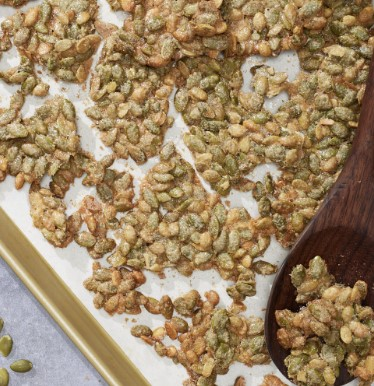

These candied pepitas achieve a delightful crispy and crunchy texture, enhanced by a touch of comforting warmth from the spices. They’re the perfect treat for autumn snacking. Although it might be a challenge to resist devouring them straight from the pan, these delectable pepitas can also serve as a versatile topping for a variety of dishes.

Get the [Candied Pepitas Appetizer](https://www.delish.com/cooking/recipe-ideas/a41612940/candied-pepitas-recipe/) 

### **2\. Delicious Pumpkin Eggs**

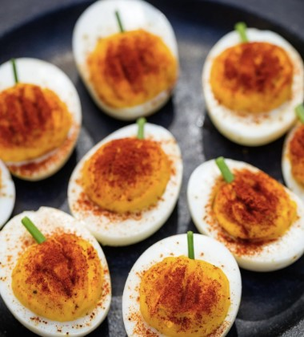

Creating these charming pumpkin deviled eggs is a breeze compared to carving Jack-o’-lanterns! A sprinkle of paprika adds a vibrant hue, and a crisp chive (or a snippet of scallion) serves as the ideal stem, bringing these little delights to life.

Get the tutorial for [Delicious Pumpkin Eggs](https://www.delish.com/cooking/recipe-ideas/recipes/a44140/pumpkin-deviled-eggs-recipe/)

### **3\. Cheese Sticks Dip Pumpkin Tomato Soup**

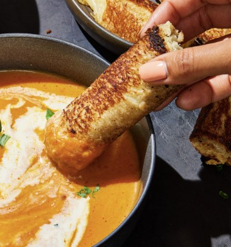

As much as we adore the traditional tomato soup, there’s a desire for a little twist when autumn rolls in. This soup receives an added touch of creamy indulgence, courtesy of velvety pumpkin puree, complemented by the richness of heavy cream and the robustness of sharp Parmesan. Whether you opt for one or delight in both, consider serving these soups as a delightful prelude to your Halloween main course.

Get the tutorial for [Cheese Sticks Dip Pumpkin Tomato Soup](https://www.delish.com/cooking/recipe-ideas/a41558090/pumpkin-tomato-soup-with-grilled-swiss-cheese-sticks-recipe/) here

### **4\. Halloween Appetizer Puppy Chow**

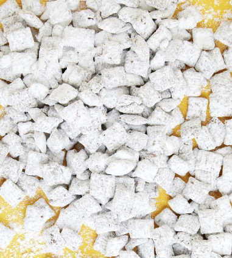

Puppy chow, also known as muddy buddies, stands as one of the simplest and tastiest snacks you’ll ever come across. Now, imagine taking this treat to an even higher level of goodness by adding some mix-ins. Picture the delightful combination of sweet and savory, where the inclusion of pretzels, classic potato chips, or salted peanuts could truly elevate the experience. These additions would undoubtedly enhance the already amazing flavors.

Get the [Halloween Appetizer Puppy Chow recipe](https://www.delish.com/cooking/recipe-ideas/a25429878/puppy-chow-recipe/) 

### **5\. Curried Cashews Appetizer**

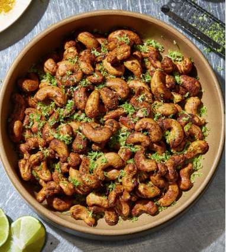

These curry-lime cashews are a delicious snack you can enjoy anytime. We believe the contrasting colors (and the unexpected mix of flavors) will also be a great addition to your Halloween appetizer selection.

Get the tutorial at [The Delish](https://www.delish.com/cooking/recipe-ideas/a36973655/curried-cashews-recipe/) 

### **6\. Roasted Pumpkin Seeds**

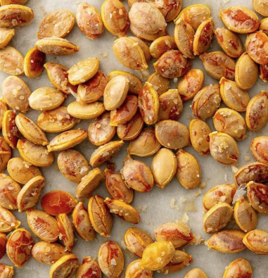

Pumpkin’s amazing and sometimes underestimated feature lies in its seeds! Preparing them is a breeze, and they transform into an incredibly tasty treat. While a simple preparation involves roasting with salt and melted butter, the possibilities are endless (check out our pumpkin-pie inspired version). So, let your imagination run wild and experiment with different variations.

Check out the [Roasted Pumpkin Seeds](https://www.delish.com/cooking/recipe-ideas/a21960824/best-roasted-pumpkin-seeds-recipe/) tutorial 

### **7\. Butternut Squash Potstickers**

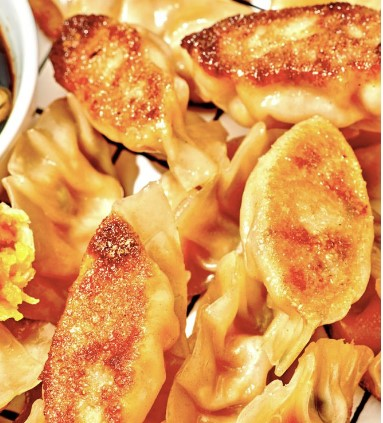

Crafting your own potstickers doesn’t need to be a complex endeavor. These vegan potstickers come together effortlessly, and a major chunk of your effort goes into roasting squash until it’s beautifully tender, which can be accomplished in advance. While getting the crimping technique down might require a bit of practice, the silver lining is that even if they appear a bit imperfect, their taste remains superb!

Check out the [Butternut Squash Potstickers](https://www.delish.com/cooking/recipe-ideas/a35396804/butternut-squash-potstickers-recipe/) recipe 

### **8\. Delicious Soft Pretzel Balls**

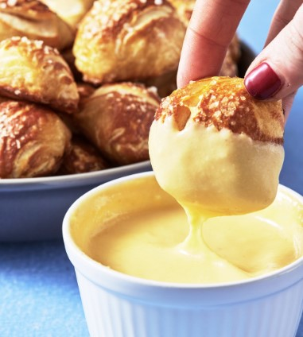

Opting for canned biscuit dough to create pretzel bites is truly the ultimate hack. These pretzels might not appear all that appealing right after they emerge from the boiling water, but fret not—once they bake in the oven, they’ll beautifully brown, crisp up, and become absolutely stunning!

Get the [Soft Pretzel Balls](https://www.delish.com/cooking/recipe-ideas/recipes/a51134/soft-pretzel-bites-recipe/) recipe 

### **9\. Guacamole Eyeballs**

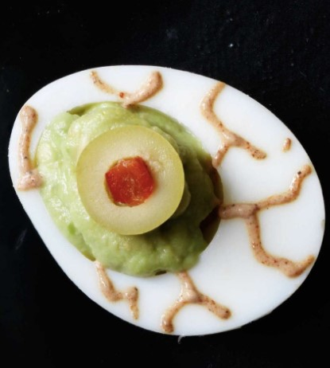

While deviled eggs are a familiar treat, have you ever come across eyeball guacamole? These small, eerie appetizers are perfect for enjoying during conversations as you snack away.

Get The [Guacamole Eyeballs](https://www.womansday.com/food-recipes/food-drinks/recipes/a11861/guacamoldy-eyeballs-recipe-123432/) Recipe 

### **10\. Vegetable Skeleton Crudite** 

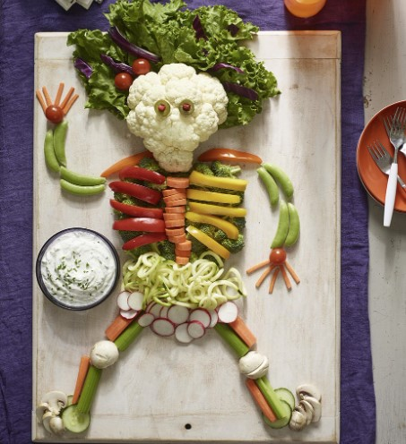

You’ll love how quick and charming this idea is. Simply arrange your preferred veggies in the outline of a skeleton. Our top picks include cauliflower, carrots, celery, radishes, bell peppers, and beyond. And of course, remember to include some [Halloween dip](https://avada.io/loveable/blog/halloween-dip-recipes/) for extra deliciousness!

## **20 Fun Halloween Appetizers for a Spooktacular Party**

### **11\. Bagel Pizza Mummies Appetizer**

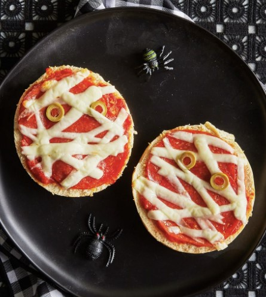

These incredibly speedy snacks are perfect for keeping the little ones satisfied before a Halloween dinner that’s kid-friendly. They also serve as an excellent strategy to ensure they’ve had something to eat before indulging in candy galore.

Check out how to make [Bagel Pizza Mummies Appetizer](https://www.countryliving.com/food-drinks/a44665784/pizza-mummies-recipe/) 

### **12\. Delicious Pumpkin & Pesto Crostini**

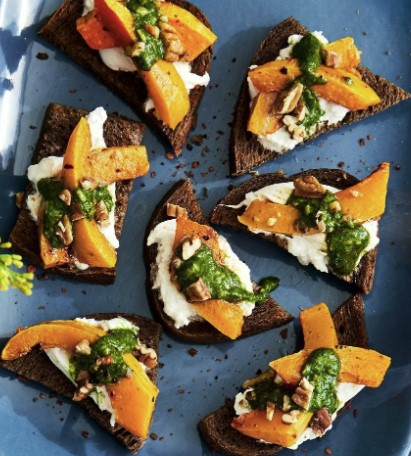

Unleash the enchantment of autumn with this easy-to-make recipe, tailor-made for the cozy vibes of fall. Whether you’re conjuring it up for a potluck extravaganza or a spooktacular Halloween gathering, prepare to witness these delectable delights vanish from the platter as if touched by a spell.

Check out how to make [Pumpkin & Pesto Crostini](https://www.countryliving.com/food-drinks/a33943615/pumpkin-and-pesto-crostini/)

### **13\. Spinach Dip with Bread Bowl Cauldron**

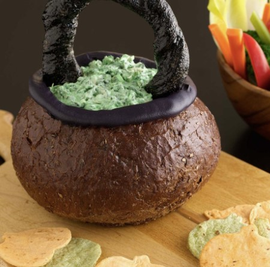

Wow your guests with this creative Halloween appetizer that skillfully turns pumpernickel bread, breadsticks, and cream cheese into an edible basket. This clever masterpiece is then generously loaded with a delightfully easy creamy spinach dip. To add a festive touch, pair them up with Pumpkin-Shaped Tortilla Dippers, as shown in the picture. Your guests are in for a treat!

Check out how to make [Spinach Dip with Bread Bowl Cauldron](https://www.countryliving.com/food-drinks/recipes/a32217/spooky-spinach-dip-in-bread-bowl-cauldron-recipe-122179/)

### **14\. Creative Peanut Butter Acorns Candy**

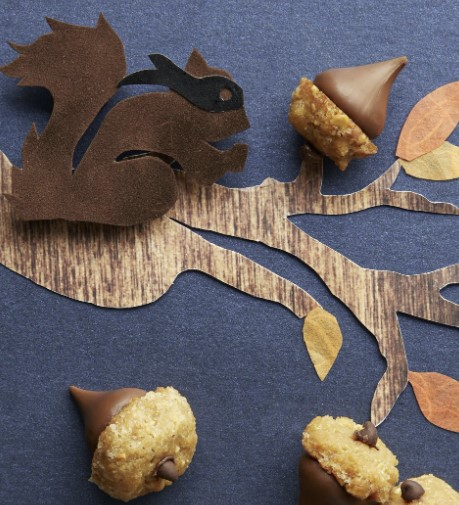

Indulge in the flavors of the season with a delightful fall treat: a petite peanut butter cookie topped with a chocolate kiss, cleverly crafted into an adorable acorn shape. This scrumptious combination is not only a feast for the taste buds but also adds a festive touch to any occasion. It’s the ideal appetizer to keep hungry folks satisfied until the main meal arrives.

Check out how to make [Peanut Butter Acorns Candy](https://www.countryliving.com/food-drinks/recipes/a5711/peanut-butter-acorns-recipe-clx1014/)

### **15\. Spooky Witch Guacamole**

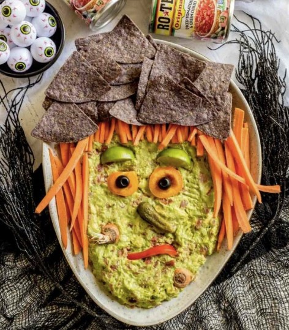

No need to tackle a complex new recipe in order to amaze your Halloween guests. By using just a handful of veggie slices, a handful of chips, and a dash of creativity, you can effortlessly give your favorite guacamole recipe a spooky twist. It’s a quick and easy way to add some Halloween flair to your spread.

Check out how to make [Spooky Witch Guacamole](https://www.confettiandbliss.com/guacamole-halloween-appetizers/)

### **16\. Human Frame Halloween Veggie Tray**

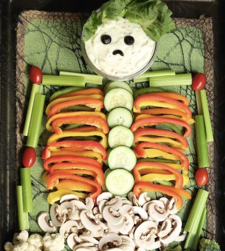

Once you’ve treated yourself to an abundance of Halloween sweets, you might find yourself craving something on the healthier side. This spread is not only adorable but also has the potential to entice even the kids into munching on their veggies.

Check out how to make [Human Frame Halloween Veggie Tray](https://go.skimresources.com/?id=74968X1525072&isjs=1&jv=15.4.2-stackpath&sref=https%3A%2F%2Fwww.countryliving.com%2Ffood-drinks%2Fg3498%2Fhalloween-appetizers%2F&url=https%3A%2F%2Fcookingwithjanica.com%2Fhalloween-veggie-tray-appetizer-trio-recipe%2F&xs=1&xtz=-420&xuuid=8461cf589759994fe82098386442d874&xjsf=other_click__auxclick%20%5B2%5D)

### **17\. Appetizer Halloween Snack Tray**

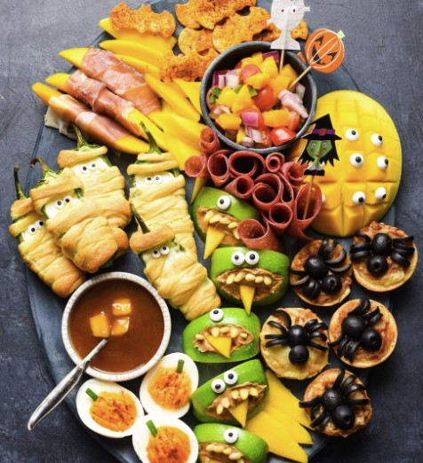

This loaded platter is a surefire winner. It offers a delightful blend of sweet and savory, with a touch of spookiness and playfulness thrown in. With such a variety, there’s an option that’s bound to satisfy every palate!

Check out how to make [Appetizer Halloween Snack Tray](https://go.skimresources.com/?id=74968X1525072&isjs=1&jv=15.4.2-stackpath&sref=https%3A%2F%2Fwww.countryliving.com%2Ffood-drinks%2Fg3498%2Fhalloween-appetizers%2F&url=https%3A%2F%2Ffoxeslovelemons.com%2Fhalloween-snack-dinner%2F&xs=1&xtz=-420&xuuid=8461cf589759994fe82098386442d874&xjsf=other_click__auxclick%20%5B2%5D)

### **18\. Mummy Garlic Bread**

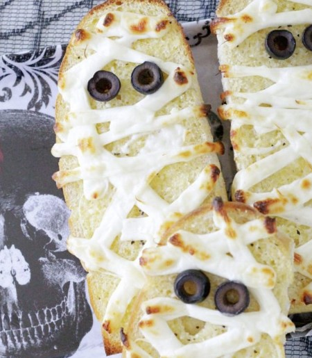

Is there anyone who can resist the allure of a slice (or maybe even two!) of cheesy garlic bread? This blogger has a fantastic suggestion: pair this delectable snack with a comforting bowl of tomato soup. It’s a match made in culinary heaven!

Check out how to make [Mummy Garlic Bread](https://go.skimresources.com/?id=74968X1525072&isjs=1&jv=15.4.2-stackpath&sref=https%3A%2F%2Fwww.countryliving.com%2Ffood-drinks%2Fg3498%2Fhalloween-appetizers%2F&url=https%3A%2F%2Fwww.foodtasticmom.com%2Fmummified-garlic-bread%2F&xs=1&xtz=-420&xuuid=8461cf589759994fe82098386442d874&xjsf=other_click__auxclick%20%5B2%5D)

### **19\. Halloween Jalapeño Popper Mummies**

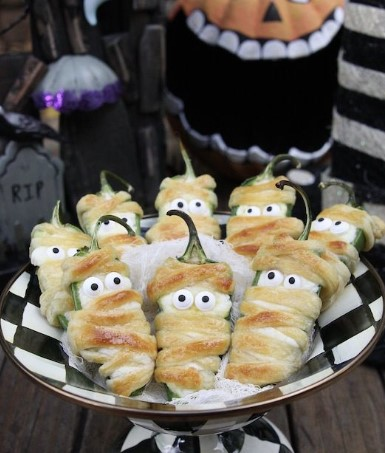

Creating these delightful cheesy poppers is a breeze, all thanks to the convenience of store-bought crescent rolls.

Discover the full [recipe for Halloween Jalapeño Popper Mummies](https://go.skimresources.com/?id=74968X1525072&isjs=1&jv=15.4.2-stackpath&sref=https%3A%2F%2Fwww.countryliving.com%2Ffood-drinks%2Fg3498%2Fhalloween-appetizers%2F&url=http%3A%2F%2Fwww.thehopelesshousewife.com%2F%3Fhhw_recipes%3Dhalloweeno-jalapeno-popper-mummies&xs=1&xtz=-420&xuuid=8461cf589759994fe82098386442d874&xjsf=other_click__auxclick%20%5B2%5D) over at The Hopeless Housewife.

### **20\. Jack-O-Lantern Cheese Quesadillas**

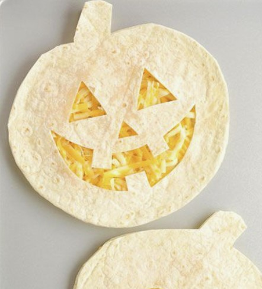

Crafting these charming miniature Jack-o’-lanterns is a quick 15-minute endeavor, requiring just two ingredients: cheese and tortillas! As long as you’re able to shape a pumpkin and carve a Jack-o’-lantern face, you’re all set to create these with ease.

For an extra dose of enjoyment, involve your kids by equipping them with edible markers to embellish the faces (although it’s recommended that you handle the cutting part).

Check out the [Jack-O-Lantern Cheese Quesadillas tutorial](https://onelittleproject.com/jackolantern-cheese-quesadillas/) 

### **21\. Halloween Peanut Butter Ball**

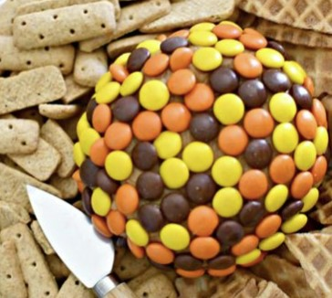

Halloween and chocolate are practically inseparable, and this Reese’s peanut butter ball takes the chocolate experience to the next level. The luscious interior is a blend of cream cheese, brown and powdered sugars, peanut butter, vanilla extract, and crushed peanut butter cups, creating a delectable core.To complete this indulgent treat, the outer layer is coated with delightful and crispy Reese’s Pieces.

For a delightful pairing, serve it alongside vanilla wafers, crushed ice cream cones, graham crackers, or any other accompaniment of your choice.

Check out the [Halloween Peanut Butter Ball](https://hip2save.com/recipes/reeses-peanut-butter-ball-dessert/) tutorial

### **22\. Bacon-Wrapped Smokies**

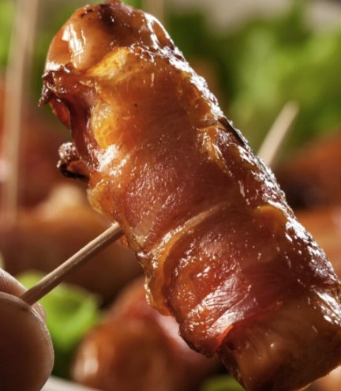

There’s something about wrapped items that trigger thoughts of mummies in my mind, especially during the Halloween season. For those who relish meaty delights, these treats are an absolute fantasy. Each one is perfectly tailored for a delectable bite-sized snack. Smoky sausages embraced by a bacon blanket and adorned with a generous coating of brown sugar. 

Honestly, what’s not to adore about these?

### **23\. Halloween Monster Munch**

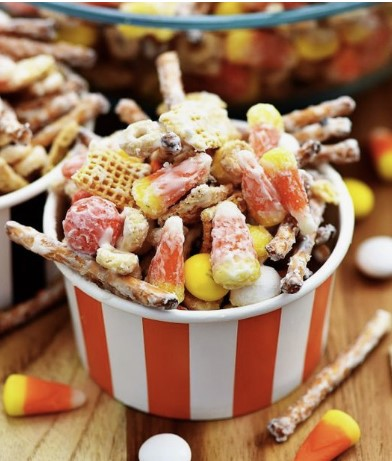

Gather up a medley of Chex, pretzels, your preferred cereals, and an assortment of Halloween candies. Give them a cheerful mix before generously drizzling them with melted white chocolate chips and a festive sprinkle of Halloween-themed decorations. The whole process is a quick affair, taking just a few minutes, and the resulting taste is truly delightful.

What adds to the fun is that you can stick to this recipe or let your creativity guide you as you whip up this delectable concoction! It’s the ultimate Halloween sugary delight that’s bound to be a hit.

### **24\. Halloween Pumpkin Biscuits** 

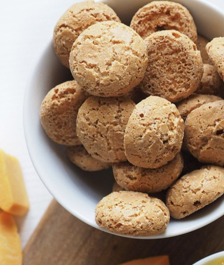

If you enjoy apple butter, you definitely should give pumpkin butter a shot on these delicious pumpkin biscuits, making for a delightful way to begin your meal on a sweet note. Alternatively, you can create a savory snack by layering ham and cheese between two biscuits.

Check out the [Halloween Pumpkin Biscuits](https://www.womansday.com/food-recipes/food-drinks/recipes/a16784/pumpkin-biscuits-3261/) recipe 

### **25\. Pepper-Jack Cornbread Sticks**

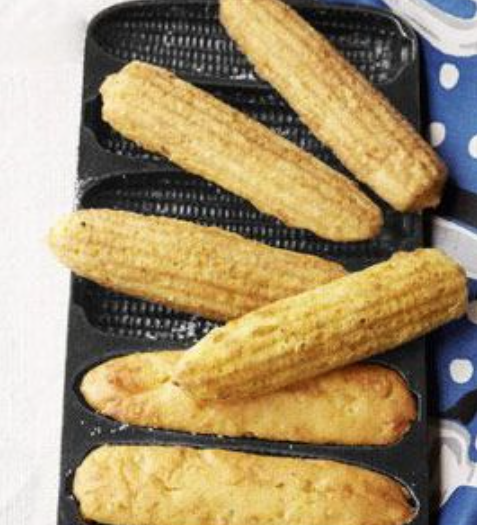

If you’re starting your dinner with a comforting soup or stew, why not complement it with some corn-on-the-cob cornbread sticks? The elongated, cob-shaped bread is just right for dipping into your dish!

Don’t miss out on the [recipe for Pepper-Jack Cornbread Sticks.](https://www.womansday.com/food-recipes/food-drinks/recipes/a39086/pepper-jack-cornbread-sticks-recipe-clv1012/)

### **26\. Ghostly Pizza For Halloween** 

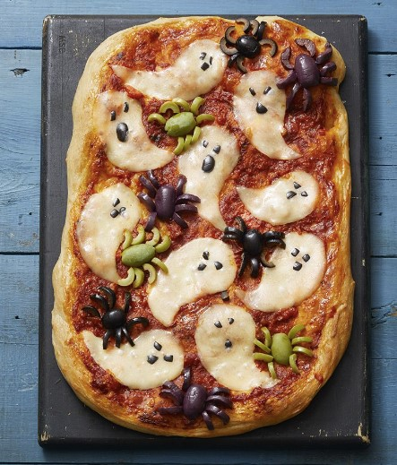

Here’s the trick: transform your cheese slices into ghostly shapes. You can go for the artistic touch with a free-hand technique, or opt for the easy route by using a ghost-shaped cookie cutter. Don’t miss out on the [Ghostly Pizza recipe](https://www.womansday.com/food-recipes/a33564112/ghostly-pizza-recipe/) – it’s a must-try!

### **27\. Monster Wraps**

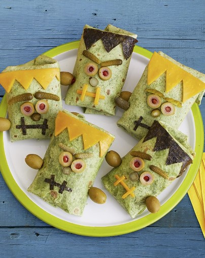

What makes these wraps truly awesome is their customizable nature. You can stuff them with whatever your guests crave, ensuring that even the choosiest of eaters can indulge in their creations!

Don’t forget to grab the [Monster Wraps recipe](https://www.womansday.com/food-recipes/a33564111/monster-wraps-recipe/) – it’s a game-changer!

### **28\. Creepy Stuffed Eyeballs**

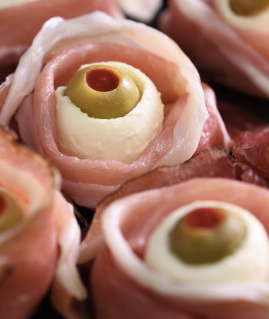

Here’s how to do it: take your preferred deli meat (think thinly-sliced, cured options), roll it up, and pop in a mozzarella ball. For that eerie touch, top it off with a green olive that’s been stuffed with red pepper – voila, you’ve got yourself an “eyeball” sensation!

Don’t forget to stock up on [stuffed olives](https://www.amazon.com/Members-Mark-Olives-stuffed-Pimiento/dp/B09X6BKQQD) for this spooky treat.

### **29\. Cheese Witch Brooms**

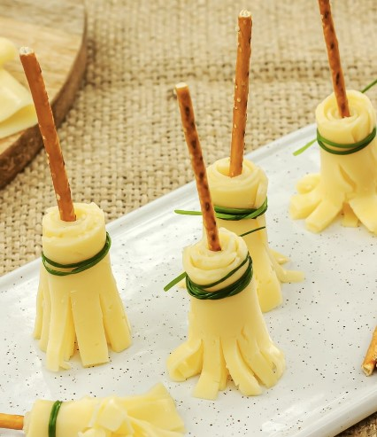

Here’s a fun trick: take a slice of cheese, roll it up, and use a knife or kitchen scissors to create a broom-like frayed end. Then, stick a pretzel right in the center and secure it with a slice of green onion tied around. Give it a try – you’ll have some whimsical broomstick snacks in no time!

### **30\. Severed Toes in Bandages**

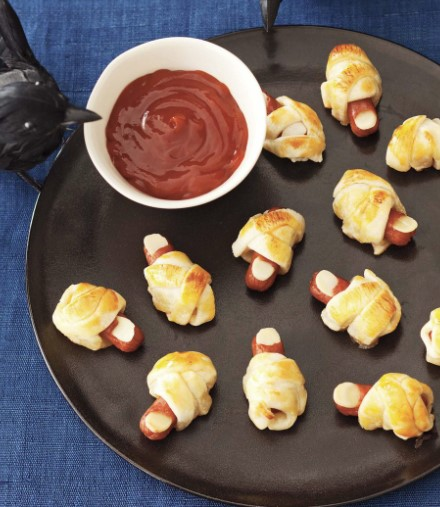

Imagine pigs in a blanket with a clever twist! Your guests will delight in these baked cocktail franks snugly wrapped in strips of pie crust. Offer up some blood-red ketchup or your preferred dipping sauce, and watch the savory magic unfold.

Make sure to check out the [Severed Toes in Bandages recipe](https://www.womansday.com/food-recipes/food-drinks/recipes/a11471/severed-toes-in-bandages-recipe-122709/) – it’s a culinary adventure that’s both spooky and scrumptious!

**_See More:_**

- Best [Halloween Punch](https://avada.io/loveable/blog/halloween-punch/) Ideas

- Delicious [Halloween Dessert Recipes](https://avada.io/loveable/blog/halloween-dessert-recipes/)

## **Final Thoughts** 

These 25 **Halloween party appetizers** are sure to elevate your 2023 spooky celebration to new heights. From eerie eyeball-deviled eggs to creepy-crawly spider sliders, this comprehensive guide has provided a thrilling array of culinary delights to delight and impress your guests. Whether you’re hosting a haunted house party or a cozy gathering, these creative and delicious appetizers will add a touch of magic to your Halloween festivities. So, get ready to embark on a culinary adventure and treat your taste buds to a spooktacular experience like never before!

- [10 Easy Halloween Party Appetizers for Every Home Cook](https://avada.io/loveable/blog/halloween-party-appetizers/#wp-block-heading-2-4)
    - [1\. Candied Pepitas Appetizer](https://avada.io/loveable/blog/halloween-party-appetizers/#wp-block-heading-3-5)
    - [2\. Delicious Pumpkin Eggs](https://avada.io/loveable/blog/halloween-party-appetizers/#wp-block-heading-3-9)
    - [3\. Cheese Sticks Dip Pumpkin Tomato Soup](https://avada.io/loveable/blog/halloween-party-appetizers/#wp-block-heading-3-13)
    - [4\. Halloween Appetizer Puppy Chow](https://avada.io/loveable/blog/halloween-party-appetizers/#wp-block-heading-3-17)
    - [5\. Curried Cashews Appetizer](https://avada.io/loveable/blog/halloween-party-appetizers/#wp-block-heading-3-21)
    - [6\. Roasted Pumpkin Seeds](https://avada.io/loveable/blog/halloween-party-appetizers/#wp-block-heading-3-25)
    - [7\. Butternut Squash Potstickers](https://avada.io/loveable/blog/halloween-party-appetizers/#wp-block-heading-3-29)
    - [8\. Delicious Soft Pretzel Balls](https://avada.io/loveable/blog/halloween-party-appetizers/#wp-block-heading-3-33)
    - [9\. Guacamole Eyeballs](https://avada.io/loveable/blog/halloween-party-appetizers/#wp-block-heading-3-37)
    - [10\. Vegetable Skeleton Crudite](https://avada.io/loveable/blog/halloween-party-appetizers/#wp-block-heading-3-41) 
- [20 Fun Halloween Appetizers for a Spooktacular Party](https://avada.io/loveable/blog/halloween-party-appetizers/#wp-block-heading-2-44)
    - [11\. Bagel Pizza Mummies Appetizer](https://avada.io/loveable/blog/halloween-party-appetizers/#wp-block-heading-3-45)
    - [12\. Delicious Pumpkin & Pesto Crostini](https://avada.io/loveable/blog/halloween-party-appetizers/#wp-block-heading-3-49)
    - [13\. Spinach Dip with Bread Bowl Cauldron](https://avada.io/loveable/blog/halloween-party-appetizers/#wp-block-heading-3-53)
    - [14\. Creative Peanut Butter Acorns Candy](https://avada.io/loveable/blog/halloween-party-appetizers/#wp-block-heading-3-57)
    - [15\. Spooky Witch Guacamole](https://avada.io/loveable/blog/halloween-party-appetizers/#wp-block-heading-3-61)
    - [16\. Human Frame Halloween Veggie Tray](https://avada.io/loveable/blog/halloween-party-appetizers/#wp-block-heading-3-65)
    - [17\. Appetizer Halloween Snack Tray](https://avada.io/loveable/blog/halloween-party-appetizers/#wp-block-heading-3-69)
    - [18\. Mummy Garlic Bread](https://avada.io/loveable/blog/halloween-party-appetizers/#wp-block-heading-3-73)
    - [19\. Halloween Jalapeño Popper Mummies](https://avada.io/loveable/blog/halloween-party-appetizers/#wp-block-heading-3-77)
    - [20\. Jack-O-Lantern Cheese Quesadillas](https://avada.io/loveable/blog/halloween-party-appetizers/#wp-block-heading-3-81)
    - [21\. Halloween Peanut Butter Ball](https://avada.io/loveable/blog/halloween-party-appetizers/#wp-block-heading-3-86)
    - [22\. Bacon-Wrapped Smokies](https://avada.io/loveable/blog/halloween-party-appetizers/#wp-block-heading-3-91)
    - [23\. Halloween Monster Munch](https://avada.io/loveable/blog/halloween-party-appetizers/#wp-block-heading-3-95)
    - [24\. Halloween Pumpkin Biscuits](https://avada.io/loveable/blog/halloween-party-appetizers/#wp-block-heading-3-99) 
    - [25\. Pepper-Jack Cornbread Sticks](https://avada.io/loveable/blog/halloween-party-appetizers/#wp-block-heading-3-103)
    - [26\. Ghostly Pizza For Halloween](https://avada.io/loveable/blog/halloween-party-appetizers/#wp-block-heading-3-107) 
    - [27\. Monster Wraps](https://avada.io/loveable/blog/halloween-party-appetizers/#wp-block-heading-3-110)
    - [28\. Creepy Stuffed Eyeballs](https://avada.io/loveable/blog/halloween-party-appetizers/#wp-block-heading-3-114)
    - [29\. Cheese Witch Brooms](https://avada.io/loveable/blog/halloween-party-appetizers/#wp-block-heading-3-118)
    - [30\. Severed Toes in Bandages](https://avada.io/loveable/blog/halloween-party-appetizers/#wp-block-heading-3-121)
- [Final Thoughts](https://avada.io/loveable/blog/halloween-party-appetizers/#wp-block-heading-2-128) 

### [Blake Simpson](https://avada.io/loveable/author/blake/)

Hi, I'm Blake from Loveable. I help people find perfect gifts for occasions like anniversaries and weddings. I also write a blog about holidays, sharing insights to make them more meaningful. Let's create unforgettable moments together!

- [Twitter](https://twitter.com/intent/tweet)
- [Facebook](https://www.facebook.com/sharer/sharer.php)
- [instagram](https://avada.io/loveable/blog/halloween-party-appetizers/)
- [pinterest](https://www.pinterest.com/loveablellc/)

## Related Posts

[### 120+ Christian Birthday Wishes To Spread Your Love](https://avada.io/loveable/blog/christian-birthday-wishes/) 

[

### 35 Best 70th Birthday Ideas To Celebrate The Special Milestone

](https://avada.io/loveable/blog/70th-birthday-ideas/)

[

### 50 Best 30th Birthday Decorations for a Remarkable Birthday Bash

](https://avada.io/loveable/blog/30th-birthday-decorations/)

[

### 40 Delicious Vegan Christmas Desserts to Delight Your Palate

](https://avada.io/loveable/blog/vegan-christmas-desserts/)

[

### 60 Christmas Team Building Activities to Boost Workplace Spirit

](https://avada.io/loveable/blog/christmas-team-building-activities/)
