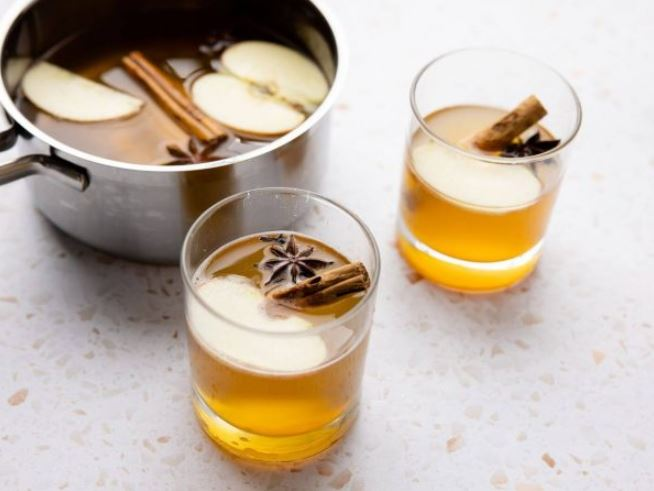

This article has been written and researched by our expert Loveable through a precise methodology. [Learn more about our methodology](https://avada.io/loveable/our-methodological.html)

[Loveable](https://avada.io/loveable/) > [Blog](https://avada.io/loveable/blog/) > [Holiday](https://avada.io/loveable/holiday/)

# 25 Best Halloween Punch Ideas for Any Spooky Party

Written by [Blake Simpson](https://avada.io/loveable/author/blake/) Last Updated on September 05, 2023

- [Best Halloween Punch Ideas](https://avada.io/loveable/blog/halloween-punch/#wp-block-heading-2-4)
    - [Frankenpunch](https://avada.io/loveable/blog/halloween-punch/#wp-block-heading-3-5)
    - [Halloween Slushy Punch](https://avada.io/loveable/blog/halloween-punch/#wp-block-heading-3-10)
    - [Hocus Pocus Halloween Punch](https://avada.io/loveable/blog/halloween-punch/#wp-block-heading-3-14)
    - [Orange Crush Cocktail](https://avada.io/loveable/blog/halloween-punch/#wp-block-heading-3-18)
    - [Polyjuice Potion](https://avada.io/loveable/blog/halloween-punch/#wp-block-heading-3-22)
    - [Bloody Mary Punch](https://avada.io/loveable/blog/halloween-punch/#wp-block-heading-3-26)
    - [Trick or Treat Punch](https://avada.io/loveable/blog/halloween-punch/#wp-block-heading-3-30)
    - [Pumpkin Pie Punch](https://avada.io/loveable/blog/halloween-punch/#wp-block-heading-3-34)
    - [Red Sangria](https://avada.io/loveable/blog/halloween-punch/#wp-block-heading-3-39)
    - [Fanta Jack O’ Lantern Floats](https://avada.io/loveable/blog/halloween-punch/#wp-block-heading-3-45)
    - [Eye of Newt Punch](https://avada.io/loveable/blog/halloween-punch/#wp-block-heading-3-50)
    - [Captain’s Cauldron Halloween Punch](https://avada.io/loveable/blog/halloween-punch/#wp-block-heading-3-54)
    - [Apple Cider Sangria](https://avada.io/loveable/blog/halloween-punch/#wp-block-heading-3-59)
    - [Dracula’s Blood Punch](https://avada.io/loveable/blog/halloween-punch/#wp-block-heading-3-63)
    - [Mulled Cider With Bourbon](https://avada.io/loveable/blog/halloween-punch/#wp-block-heading-3-67)
    - [Pumpkin Head Punch](https://avada.io/loveable/blog/halloween-punch/#wp-block-heading-3-71)
    - [Green Party Punch](https://avada.io/loveable/blog/halloween-punch/#wp-block-heading-3-75)
    - [Pirate Punch](https://avada.io/loveable/blog/halloween-punch/#wp-block-heading-3-79)
    - [Mulled Maple Apple Cider](https://avada.io/loveable/blog/halloween-punch/#wp-block-heading-3-83)
    - [Caramel Apple Punch](https://avada.io/loveable/blog/halloween-punch/#wp-block-heading-3-87)
    - [Fall Party Punch](https://avada.io/loveable/blog/halloween-punch/#wp-block-heading-3-91)
    - [Rum Punch](https://avada.io/loveable/blog/halloween-punch/#wp-block-heading-3-95)
    - [Purple People Eater Punch](https://avada.io/loveable/blog/halloween-punch/#wp-block-heading-3-100)
    - [Cranberry Mulled Wine](https://avada.io/loveable/blog/halloween-punch/#wp-block-heading-3-106)
    - [Devil’s Dark and Stormy Punch](https://avada.io/loveable/blog/halloween-punch/#wp-block-heading-3-110)
- [To Conclude,](https://avada.io/loveable/blog/halloween-punch/#wp-block-heading-2-118)

Get ready to add a chilling twist to your Halloween celebration with some delightfully spooky and delicious punch ideas that are sure to leave your guests in awe. Halloween is the perfect occasion to indulge in eerie concoctions that not only satisfy your taste buds but also add an extra dash of fright to the festivities. 

From eerie eyeball-filled brews to blood-red blends, these **Halloween punch ideas** will take center stage at your party and have everyone talking about your wickedly creative concoctions. 

So, gather your cauldron, summon your inner mixologist, and let’s dive into a world of hauntingly good drinks!

## **Best Halloween Punch Ideas**

### **Frankenpunch**

Experience the eerie delight of Frankenpunch, a hauntingly delicious concoction that fuses tropical and citrus notes into one spellbinding drink. This bewitching beverage comprises a blend of ginger ale, pineapple juice, and tequila, crowned with generous scoops of lime sorbet that float like spectral orbs on its surface. 

Despite its impressive flavor profile, creating Frankenpunch is a breeze, ensuring a taste that’s far from monstrous, yet guaranteed to mesmerize your taste buds.

[Check out the Frankenpunch recipe!](https://www.pinterest.com/pin/583849539200108205/)

### **Halloween Slushy Punch**

Crafted from a harmonious blend of zesty lemon juice, strawberry Jell-O, luscious pineapple juice, tangy orange juice, and effervescent lemon-lime soda, this citrus punch is an absolute thrill to the taste buds, sending delightful shivers down your spine with every sip.

[Check out the Halloween Slushy Punch recipe!](https://www.pinterest.com/pin/583849539200108105/)

### **Hocus Pocus Halloween Punch**

This bewitching punch is an exquisite fusion of peach mango juice, sparkling peach juice, and luscious mango sorbet. As the peaches and mangoes unite, a mesmerizing, golden-orange hue emerges, enthralling both the eyes and taste buds with its vibrant allure and distinctive fruity essence.

[Check out the Hocus Pocus Halloween Punch recipe!](https://www.pinterest.com/pin/583849539200108122/)

### **Orange Crush Cocktail**

Presenting the Orange Crush Cocktail, a bright and refreshing citrus delight perfect for serving in larger batches. Simply remember to add the soda only when pouring it into individual glasses to preserve its fizzy charm. 

[Check out the Orange Crush Cocktail recipe!](https://www.thepioneerwoman.com/food-cooking/recipes/a38975060/orange-crush-cocktail-recipe/)

### **Polyjuice Potion**

Calling all Harry Potter fans! Get ready for a magical experience with the Polyjuice Potion – a spellbinding mix of lime sherbet and Sprite, adorned with a touch of neon green food coloring. 

[Check out the Polyjuice Potion recipe!](https://go.skimresources.com/?id=74968X1616970&isjs=1&jv=15.4.2-stackpath&sref=https%3A%2F%2Fwww.thepioneerwoman.com%2Fholidays-celebrations%2Fg36792938%2Fhalloween-punch-recipes%2F%3Fslide%3D26&url=https%3A%2F%2Fhomemadehooplah.com%2Fpolyjuice-potion%2F&xs=1&xtz=-420&xuuid=751bc2d69eccc64d44683b41cdadba18&xjsf=other_click__auxclick%20%5B2%5D)

### **Bloody Mary Punch**

If savory cocktails are more to your taste, then the Bloody Mary Punch awaits. This unique concoction blends vegetable juice, lime juice, hot sauce, Worcestershire sauce, Old Bay, and ground pepper, creating a refreshingly savory flavor profile. While not a sugary delight, it serves as a perfect contrast to the Halloween sweets that abound.

[Check out the Bloody Mary Punch recipe!](https://www.pinterest.com/pin/583849539200108502/)

### **Trick or Treat Punch**

Behold the enchanting Trick or Treat Punch! This mesmerizing concoction resembles a potion straight from a witch’s cauldron, and its magical allure matches its appearance. Crafted with a combination of your favorite sugary beverages, including Kool-Aid, Gatorade, and soda, this layered punch promises a spellbinding taste experience.

[Check out the Trick or Treat Punch recipe!](https://www.pinterest.com/pin/583849539200108136/)

### **Pumpkin Pie Punch**

Pumpkin Pie Punch is a delightful concoction that proves pumpkin is not only for carving but also for crafting captivating punches.

This creamy libation blends rich pumpkin puree, luscious cream soda, spiced apple cider, and a dash of rum, resulting in a decadent and pumpkin-filled treat, tailor-made for [Halloween festivities](https://avada.io/loveable/blog/halloween-traditions/).

[Check out the Pumpkin Pie Punch recipe!](https://www.pinterest.com/pin/583849539200108149/)

### **Red Sangria**

Indulge in the eerie allure of Red Sangria, a chillingly delicious adult sipper ideal for your spooky gatherings. 

Prepare a generous batch of this vampire blood-colored libation, and for an extra eerie touch, consider adding blood oranges and pomegranate seeds or any seasonal fruits of your choice. 

The bewitching flavors will leave your guests enchanted, making this Red Sangria a hauntingly delightful addition to your Halloween celebrations. Sip and savor the sinister spirit of the season!

[Check out the Red Sangria recipe!](https://www.thepioneerwoman.com/food-cooking/recipes/a35824488/red-sangria/)

### **Fanta Jack O’ Lantern Floats**

If you cherished the taste of orange creamsicles during your childhood, this enchanting float will surely evoke fond memories.

To create this ultimate Halloween treat, simply combine Fanta orange soda with a luscious scoop of vanilla ice cream. The result is a bewitching fusion of drink and dessert that will delight both young and old.

[Check out the Fanta Jack O’ Lantern Floats recipe!](https://www.pinterest.com/pin/33565959710117993/)

### **Eye of Newt Punch**

This eerie concoction harmoniously blends apple juice, mango juice, and the enigmatic flavors of passionfruit and lychee. The addition of passionfruit seeds lends a spooky appearance without being too off-putting for the little ones. Rest assured, this peculiar combination is sure to be a hit among all your guests.

[Check out the Eye of Newt Punch recipe!](https://www.pinterest.com/pin/583849539200108170/)

### **Captain’s Cauldron Halloween Punch**

This is a mesmerizing fusion of pumpkin-spiced rum, tangy orange juice, luscious cranberry juice, and effervescent club soda, delivering an exhilarating party for your taste buds.

This enchanting concoction boasts an unexpected and delightful harmony of flavors, as the fruit juices and pumpkin rum unite in a spellbinding dance of taste.

[Check out the Captain’s Cauldron Halloween Punch recipe!](https://www.pinterest.com/pin/583849539200108546/)

### **Apple Cider Sangria**

Apple Cider Sangria is a bewitching concoction that apple cider enthusiasts will fall head over heels for! This spooktastic sangria combines the delightful essence of apple cider, the rich warmth of apple brandy, and the crisp freshness of fresh apple slices, creating a trifecta of apple deliciousness that will leave you enchanted with every sip. 

[Check out the Apple Cider Sangria recipe!](https://www.thepioneerwoman.com/food-cooking/recipes/a41139347/apple-cider-sangria-recipe/)

### **Dracula’s Blood Punch**

Indulge in the sinister allure of Dracula’s Blood Punch, a chilling concoction that will leave a lasting impression on your guests. With its crimson hue and exotic flavor, this haunting libation is sure to have your guests craving for more.

[Check out the Dracula’s Blood Punch recipe!](https://www.pinterest.com/pin/583849539200108182/)

### **Mulled Cider With Bourbon**

Crafted with care, one batch generously serves 6 to 8 people, making it the ideal big-batch punch to elevate the ambiance of your festive party. Gather your friends and loved ones, and let the comforting flavors of Mulled Cider With Bourbon cast a spell of warmth and merriment over your Halloween celebrations. 

[Check out the Mulled Cider With Bourbon recipe!](https://www.thepioneerwoman.com/food-cooking/recipes/a32304617/mulled-cider-with-bourbon-recipe/)

### **Pumpkin Head Punch**

This exquisite concoction harmoniously blends spiced pumpkin butter, vodka, cinnamon, ginger, lemon, honey, and more, culminating in a symphony of flavors that will transport your taste buds to an autumn wonderland.

[Check out the Pumpkin Head Punch recipe!](https://www.pinterest.com/pin/583849539200108477/)

### **Green Party Punch**

Green Party Halloween Punch is a delightful blend of lemonade mix and green berry Hawaiian punch that promises a refreshingly delicious experience for all [Halloween party](https://avada.io/loveable/blog/halloween-party-names/)\-goers.

[Check out the Green Party Punch recipe!](https://www.pinterest.com/pin/583849539200108492/)

### **Pirate Punch**

Who could resist the allure of a medley of tropical fruit juices paired with a satisfying kick of alcohol? This refreshing concoction combines the flavors of cranberry juice, orange juice, and pineapple juice, beautifully enhanced by the addition of amaretto, dark rum, and white rum.

[Check out the Pirate Punch recipe!](https://www.pinterest.com/pin/583849539200108186/)

### **Mulled Maple Apple Cider**

Embrace the spirit of the season and savor the magical essence of this cozy brew as it warms your soul and delights your senses. Get ready to enchant your guests with the bewitching aromas and flavors of Mulled Maple Apple Cider, a delightful potion perfect for Halloween gatherings and cozy autumn nights.

[Check out the Mulled Maple Apple Cider recipe!](https://www.thepioneerwoman.com/food-cooking/recipes/a34276628/mulled-maple-apple-cider/)

### **Caramel Apple Punch**

It is a liquid delight that captures the essence of caramel apples, the quintessential country fair treat. Discover the joy of this recipe that brings the nostalgic taste of caramel apples into a refreshing liquid form, leaving you utterly delighted.

[Check out the Caramel Apple Punch recipe!](https://www.pinterest.com/pin/583849539200108534/)

### **Fall Party Punch**

Take a look at the Fall Party Punch, a scrumptious elixir that will elevate your Halloween festivities with the delightful essence of autumn. Craft this enticing punch with a blend of apple cider, pineapple juice, and ginger ale.

[Check out the Fall Party Punch recipe!](https://www.pinterest.com/pin/583849539200108468/)

### **Rum Punch**

For all those dressed as pirates, this punch is the perfect companion to your swashbuckling adventures!

Experience the ultimate tropical punch with its refreshing and fruity flavor profile derived from a delightful blend of pineapple, oranges, and lime. The Rum Punch promises to transport you and your guests to an enchanting Caribbean paradise, as you revel in the vibrant and delightful taste of the islands.

[Check out the Rum Punch recipe!](https://www.pinterest.com/pin/583849539200108480/)

### **Purple People Eater Punch**

This punch is a vision in purple and equally pleasing to the taste buds. Its fizzy and refreshing nature, along with the delightful infusion of grape and sorbet, ensures a crowd-pleasing experience for all.

With just three simple ingredients, this punch is a breeze to make and a certified hit among both kids and adults alike.

Savor the magic of the Purple People Eater Punch at your next gathering, as it casts a spell of delight and leaves your guests mesmerized by its vibrant hue and delectable taste. 

[Check out the Purple People Eater Punch recipe!](https://www.pinterest.com/pin/583849539200108337/)

### **Cranberry Mulled Wine**

Choose the timeless Cranberry Mulled Wine as the perfect fall drink for your Halloween party. This classic beverage features an autumnal spice blend with hints of cinnamon, clove, and ginger, creating a delightful concoction that will warm your guests’ hearts and souls. 

[Check out the Cranberry Mulled Wine recipe!](https://www.thepioneerwoman.com/food-cooking/recipes/a33968509/cranberry-mulled-wine-recipe/)

### **Devil’s Dark and Stormy Punch**

This is a bewitching blend of dark rum, ginger beer, simple syrup, and fresh lime juice that will transport you to a magical world akin to Harry Potter’s spiked butterbeer.

This sinfully delightful punch strikes the perfect balance between sweetness, citrusy zing, and a hint of spice, creating a heavenly flavor experience that’s devilishly good.

[Check out the Devil’s Dark and Stormy Punch recipe!](https://www.pinterest.com/pin/583849539200108520/)

**Related:**

- Best [Halloween Drinks](https://avada.io/loveable/halloween-drinks/) and Cocktail

- Best [Halloween Cake](https://avada.io/loveable/halloween-cake/) that’s Delicious

## **To Conclude,**

As the night of ghouls and ghosts draws near, we hope these **Halloween punch ideas** have inspired you to conjure up a night of spine-tingling fun and unforgettable flavors. Whether you’re hosting a spooky soiree or a family-friendly gathering, these chilling concoctions are certain to wow your guests and add that extra touch of magic to your celebrations. 

So, unleash your creativity, experiment with eerie decorations, and let your imagination run wild as you whip up these delightful beverages. As your guests take their first sips and marvel at your concoctions, you’ll know that you’ve successfully cast a spell of enchantment upon your Halloween party. Cheers to a hauntingly delicious night ahead!

- [Best Halloween Punch Ideas](https://avada.io/loveable/blog/halloween-punch/#wp-block-heading-2-4)
    - [Frankenpunch](https://avada.io/loveable/blog/halloween-punch/#wp-block-heading-3-5)
    - [Halloween Slushy Punch](https://avada.io/loveable/blog/halloween-punch/#wp-block-heading-3-10)
    - [Hocus Pocus Halloween Punch](https://avada.io/loveable/blog/halloween-punch/#wp-block-heading-3-14)
    - [Orange Crush Cocktail](https://avada.io/loveable/blog/halloween-punch/#wp-block-heading-3-18)
    - [Polyjuice Potion](https://avada.io/loveable/blog/halloween-punch/#wp-block-heading-3-22)
    - [Bloody Mary Punch](https://avada.io/loveable/blog/halloween-punch/#wp-block-heading-3-26)
    - [Trick or Treat Punch](https://avada.io/loveable/blog/halloween-punch/#wp-block-heading-3-30)
    - [Pumpkin Pie Punch](https://avada.io/loveable/blog/halloween-punch/#wp-block-heading-3-34)
    - [Red Sangria](https://avada.io/loveable/blog/halloween-punch/#wp-block-heading-3-39)
    - [Fanta Jack O’ Lantern Floats](https://avada.io/loveable/blog/halloween-punch/#wp-block-heading-3-45)
    - [Eye of Newt Punch](https://avada.io/loveable/blog/halloween-punch/#wp-block-heading-3-50)
    - [Captain’s Cauldron Halloween Punch](https://avada.io/loveable/blog/halloween-punch/#wp-block-heading-3-54)
    - [Apple Cider Sangria](https://avada.io/loveable/blog/halloween-punch/#wp-block-heading-3-59)
    - [Dracula’s Blood Punch](https://avada.io/loveable/blog/halloween-punch/#wp-block-heading-3-63)
    - [Mulled Cider With Bourbon](https://avada.io/loveable/blog/halloween-punch/#wp-block-heading-3-67)
    - [Pumpkin Head Punch](https://avada.io/loveable/blog/halloween-punch/#wp-block-heading-3-71)
    - [Green Party Punch](https://avada.io/loveable/blog/halloween-punch/#wp-block-heading-3-75)
    - [Pirate Punch](https://avada.io/loveable/blog/halloween-punch/#wp-block-heading-3-79)
    - [Mulled Maple Apple Cider](https://avada.io/loveable/blog/halloween-punch/#wp-block-heading-3-83)
    - [Caramel Apple Punch](https://avada.io/loveable/blog/halloween-punch/#wp-block-heading-3-87)
    - [Fall Party Punch](https://avada.io/loveable/blog/halloween-punch/#wp-block-heading-3-91)
    - [Rum Punch](https://avada.io/loveable/blog/halloween-punch/#wp-block-heading-3-95)
    - [Purple People Eater Punch](https://avada.io/loveable/blog/halloween-punch/#wp-block-heading-3-100)
    - [Cranberry Mulled Wine](https://avada.io/loveable/blog/halloween-punch/#wp-block-heading-3-106)
    - [Devil’s Dark and Stormy Punch](https://avada.io/loveable/blog/halloween-punch/#wp-block-heading-3-110)
- [To Conclude,](https://avada.io/loveable/blog/halloween-punch/#wp-block-heading-2-118)

### [Blake Simpson](https://avada.io/loveable/author/blake/)

Hi, I'm Blake from Loveable. I help people find perfect gifts for occasions like anniversaries and weddings. I also write a blog about holidays, sharing insights to make them more meaningful. Let's create unforgettable moments together!

- [Twitter](https://twitter.com/intent/tweet)
- [Facebook](https://www.facebook.com/sharer/sharer.php)
- [instagram](https://avada.io/loveable/blog/halloween-punch/)
- [pinterest](https://www.pinterest.com/loveablellc/)

## Related Posts

[### 120+ Christian Birthday Wishes To Spread Your Love](https://avada.io/loveable/blog/christian-birthday-wishes/) 

[

### 35 Best 70th Birthday Ideas To Celebrate The Special Milestone

](https://avada.io/loveable/blog/70th-birthday-ideas/)

[

### 50 Best 30th Birthday Decorations for a Remarkable Birthday Bash

](https://avada.io/loveable/blog/30th-birthday-decorations/)

[

### 40 Delicious Vegan Christmas Desserts to Delight Your Palate

](https://avada.io/loveable/blog/vegan-christmas-desserts/)

[

### 60 Christmas Team Building Activities to Boost Workplace Spirit

](https://avada.io/loveable/blog/christmas-team-building-activities/)
