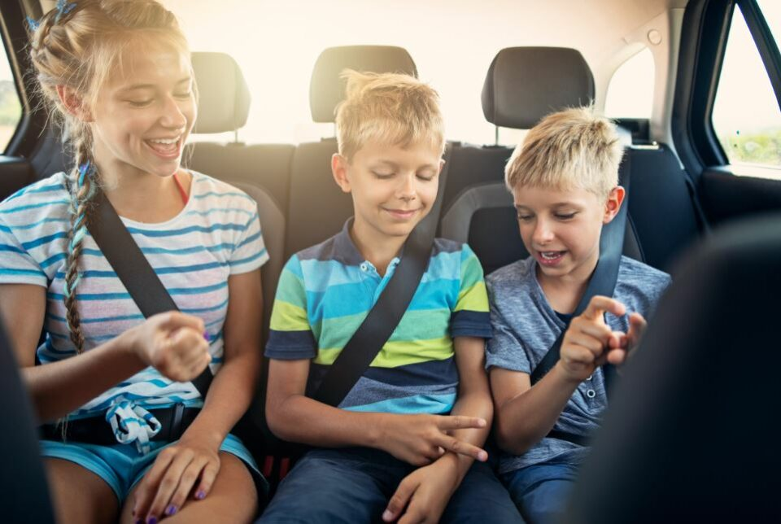

This article has been written and researched by our expert Loveable through a precise methodology. [Learn more about our methodology](https://avada.io/loveable/our-methodological.html)

[Loveable](https://avada.io/loveable/) > [Blog](https://avada.io/loveable/blog/) > [Family](https://avada.io/loveable/family/)

# 25 Best Road Trip Games to Play in The Car Family

Written by [Rose Bryne](https://avada.io/loveable/author/rose/) Last Updated on August 17, 2023

- [Why should your family play road trip games in the car family?](https://avada.io/loveable/blog/road-trip-games-play-in-car/#wp-block-heading-2-4)
- [25 best road trip games to play in the car family](https://avada.io/loveable/blog/road-trip-games-play-in-car/#wp-block-heading-2-11)
    - [1\. I’m taking a picnic](https://avada.io/loveable/blog/road-trip-games-play-in-car/#wp-block-heading-3-13)
    - [2\. Word repetition](https://avada.io/loveable/blog/road-trip-games-play-in-car/#wp-block-heading-3-15)
    - [3\. Ping Pong](https://avada.io/loveable/blog/road-trip-games-play-in-car/#wp-block-heading-3-17)
    - [4\. The game of license plates](https://avada.io/loveable/blog/road-trip-games-play-in-car/#wp-block-heading-3-21)
    - [5\. Tale time](https://avada.io/loveable/blog/road-trip-games-play-in-car/#wp-block-heading-3-23)
    - [6\. The letter game](https://avada.io/loveable/blog/road-trip-games-play-in-car/#wp-block-heading-3-26)
    - [7\. The game of animal names](https://avada.io/loveable/blog/road-trip-games-play-in-car/#wp-block-heading-3-29)
    - [8\. Theme song interactive](https://avada.io/loveable/blog/road-trip-games-play-in-car/#wp-block-heading-3-33)
    - [9\. Memory exam](https://avada.io/loveable/blog/road-trip-games-play-in-car/#wp-block-heading-3-35)
    - [10\. Hidden location race](https://avada.io/loveable/blog/road-trip-games-play-in-car/#wp-block-heading-3-38)
    - [11\. Optimum competition](https://avada.io/loveable/blog/road-trip-games-play-in-car/#wp-block-heading-3-41)
    - [12\. Watch what you say!](https://avada.io/loveable/blog/road-trip-games-play-in-car/#wp-block-heading-3-43)
    - [13\. Road trip riffing](https://avada.io/loveable/blog/road-trip-games-play-in-car/#wp-block-heading-3-45)
    - [14\. Who is the artist?](https://avada.io/loveable/blog/road-trip-games-play-in-car/#wp-block-heading-3-48)
    - [15\. Game of groceries](https://avada.io/loveable/blog/road-trip-games-play-in-car/#wp-block-heading-3-50)
    - [16\. What shade is that?](https://avada.io/loveable/blog/road-trip-games-play-in-car/#wp-block-heading-3-52)
    - [17\. Road trip scavenger hunt](https://avada.io/loveable/blog/road-trip-games-play-in-car/#wp-block-heading-3-54)
    - [18\. Buggy punch](https://avada.io/loveable/blog/road-trip-games-play-in-car/#wp-block-heading-3-57)
    - [19\. Three-way threat](https://avada.io/loveable/blog/road-trip-games-play-in-car/#wp-block-heading-3-60)
    - [20\. Categorical ABCs](https://avada.io/loveable/blog/road-trip-games-play-in-car/#wp-block-heading-3-62)
    - [21\. Search by car color](https://avada.io/loveable/blog/road-trip-games-play-in-car/#wp-block-heading-3-65)
    - [22\. What’s in my suitcase?](https://avada.io/loveable/blog/road-trip-games-play-in-car/#wp-block-heading-3-68)
    - [23\. Sing-along exercise](https://avada.io/loveable/blog/road-trip-games-play-in-car/#wp-block-heading-3-71)
    - [24\. Counting animals](https://avada.io/loveable/blog/road-trip-games-play-in-car/#wp-block-heading-3-74)
    - [25\. Several different backseat games](https://avada.io/loveable/blog/road-trip-games-play-in-car/#wp-block-heading-3-77)
- [The bottom line](https://avada.io/loveable/blog/road-trip-games-play-in-car/#wp-block-heading-2-81)

Family [road trips](https://avada.io/loveable/essential-road-trip-tips/) are fantastic pre-vacation times for connecting, storytelling, and creating memories. But if you don’t have a good selection of road trip games to keep you entertained, they may rapidly become a nightmare! 

These enjoyable, interactive family car trip **games to play in the car family** can help to break up tensions, stop fighting, and reduce screen time. They range from old favorites like “I Spy,” and “G-H-O-S-T” to fresh ones like “What Am I Counting” and “In My Suitcase.”

Before you bring out the iPad and start playing [video games](https://avada.io/loveable/gifts-pc-gamers/) or watching another movie with the kids, just so you can drive in peace for the next hour or so, check out these entertaining road activities.

## Why should your family play road trip games in the car family?

Why should your family play road trip games in the car family?

Road trip games are a perfect way to keep your family entertained while on the road. Not only will they help pass the time, but they can also be a great bonding experience for everyone involved. Here are a few reasons why your family should play games to play in the car family on your next journey:

- **They’re a great way to pass the time** – Whether you’re driving across the country or just taking a short road trip, there’s bound to be some downtime. Road trip games are a wonderful way to fill that time and keep everyone entertained.
- **They’re a great bonding experience** – Spending time together playing games is a great way to bond with your family. It’s a chance to unplug from technology and connect with each other on a more personal level.
- **They can be educational** – Many road trip games are actually quite educational. Trivia games, for example, can teach everyone a thing or two about [history](https://avada.io/loveable/gifts-history-lovers/), geography, and more.
- **They’re just plain fun** – At the end of the day, road trip games to play in the car family are just plain fun. Whether you’re playing them to pass the time or to bond with your family, they’re sure to provide some laughs and good memories.

## 25 best road trip games to play in the car family

Best road trip games to play in the car family

### 1\. I’m taking a picnic

This is a classic road trip game. “I’m going on a picnic, and I’m bringing…” says the first individual. Then comes something that starts with the letter “A,” like an anchovy. The second player repeats the first item, then adds a word beginning with the letter “B” to the line. The one who can recall the most things in alphabetical order wins.

### 2\. Word repetition

The first participant speaks out a word. The word of the following player must begin with the word’s last letter. For example, if you begin with “hour,” your children must think of a word that begins with the letter “R.” There should be no word repetitions! Choose a theme before you start, like nations or animals, to give it an added twist. Be aware that [preschoolers](https://avada.io/loveable/preschool-graduation-gifts/) may not enjoy this game.

### 3\. Ping Pong

Ping Pong

It’s easy to play this classic game. It only takes two participants, some paper, and a pencil, though two could make things go more quickly. First, player 1 puts an “X” on the grid, followed by Player 2’s “O.” 

Once a player gets three of the same letter across, down, or diagonally, the game is over. There are several kids in the car? Have two games playing at once to double the enjoyment.

### 4\. The game of license plates

Try to find tags from each of the 50 states as a group. A point is awarded to whoever yells out a state’s license plate first. Also, whoever spots a Canadian license plate first gets extra points! After the drive, whoever family member has the most points wins.

### 5\. Tale time

Create a family fairy tale by using your imagination! The first person introduces the story by saying, “Once upon a time…,” and then the second person continues the narrative with a line. Continue adding sentences in succession until the tale is completed.

If you want to end it after everyone has had a chance to speak for three sentences, you may either set a time restriction, like 20 minutes. To ensure you never forget the narrative, think about recording it on your phone and having it afterward transcribed.

### 6\. The letter game

One person takes the right side of the road, while the other takes a left. Then, each person seeks letters of the alphabet that appear on signs or license plates that are facing their direction.

The goal of the game is to name every alphabet letter from A to Z. The individual who names the alphabet in its whole first wins!

### 7\. The game of animal names

The Game of Animal Names

This is one of the best family games to play in the car that begins with one participant naming an animal. The following individual must then name another animal that starts with the animal that was mentioned before. For instance, because “dog” ends with a “g,” the person behind you may follow with “goat,” and so on.

Children enjoy that no one wins or loses in the game since it might continue forever. If your kids are a bit older, you may try substituting cuisines, locations, or TV series for the animal categories.

### 8\. Theme song interactive

Everyone tries to identify the TV show as quickly as they can when one person hums the theme song of a beloved program. The first player to guess correctly hums the following song, and the game begins again.

### 9\. Memory exam

“A is for \_\_,” the first person begins, using any word that starts with the letter “A,” such as “an apple,” to fill in the blank. The second person must repeat the “A” word while also coming up with a word for the letter B, such as “book,” adding “A is for apple, B is for banana.”

Continue repeating more letters and words as you go through the alphabet, taking turns from each individual. By the time you get to the letter “Z,” that player will have to repeat the entire alphabet, including the words for each letter. You can select an earlier letter to end on than “Z” if you’re playing with smaller children.

### 10\. Hidden location race

Hidden Location Race

One person searches a road map for a small town, hamlet, lake, or river. Then, that participant announces the venue they have picked. A second player gets 60 seconds to explore the map and try to locate the secret location.

### 11\. Optimum competition

Even though it’s not really a “car” game, this pastime is excellent for lengthy drives. Encourage children to participate in sports competitions during rest breaks to overcome the trip’s sedentary aspect. Then stage a 20-yard dash to see who can complete the most sprints, push-ups, or jumping jacks in a minute.

### 12\. Watch what you say!

Choose terms or phrases that are “off-limits” in the car before the journey, such as “Are we there yet?” or family members’ first names. If someone mentions one of the forbidden terms, they receive a point. At the conclusion of the drive, the player with the fewest points wins.

### 13\. Road trip riffing

Initially, the first player sings a few verses of a song. Another participant then joins in to relate the words to a different song. In essence, Player Two should start with the phrases that Player One sang last. As an illustration, consider the following: “Happy birthday to you,” “You look so beautiful in white,” and so on.

Travel riffing

### 14\. Who is the artist?

When a song plays on the radio, the first person to recognize the artist or group wins a point. Continue to play until you arrive at your place, and the player with the most points at that moment wins.

### 15\. Game of groceries

Ask your first player to come up with something you can get at the grocery store. Everyone else in the car takes turns asking questions to guess what it may be. Is it something you can eat? No? Try again until you get the item that person intends to buy.

### 16\. What shade is that?

Ask the family’s adults to make a list of several items that have the same hue. As an illustration, they may say, “Fire engines, apples, stop signs…” They ought to go until the children say, “Red!” Keep in mind that car rides are lengthy, so more items on your list are better!

### 17\. Road trip scavenger hunt

Print one copy of a Scavenger Hunt game card for each participant whoever finishes their card first wins.

Road Trip Scavenger Hunt

### 18\. Buggy punch

A classic travel favorite! Who can identify the most Volkswagen Beetles, often known as punch buggies, on the road? When you do, call it out loud while mentioning the color of the car (Yellow punch buggy!). These sorts of sightings are worth one point.

Vans are worth 5, while old bugs are worth 2. Rare cars like “Herby the Love Bug” are worth 10 times as much! By the time you get to your location, whoever has the most points wins. Keep in mind that the game isn’t over until the auto is parked!

### 19\. Three-way threat

The Triple Threat is the next game on the wishlist of road trip games to play in the cars. Adults in this situation are required to select three nouns, such as “table,” “bird,” and “fruit.” The children must come up with a tale that combines all three elements. You should be prepared for things to quickly become ridiculous.

### 20\. Categorical ABCs

This game is rather simple in comparison to other good games to play in the car with family. Ask the first person to pick a category and give a word that starts with the letter A.

The following individual follows suit, but their response must start with the letter B. After that, the person in charge of letter C is in charge. The “food” category includes items like apples, broccoli, and cookies as examples.

### 21\. Search by car color

Among the fun games to play in the car with your family, this is a fantastic game for younger children. For each child, print out a game card, and instruct them to circle the different automobile colors as they come across them.

Search by car color

### 22\. What’s in my suitcase?

Why not spice up your car trip experience with a silly memory game? “I’m going on vacation, and I packed…” begins the first participant. Anything that starts with the letter A can be used to complete the phrase.

The following player must repeat the first player’s speech and add a new item to the list that starts with the letter B. Keep on composing letters and see how many you can finish before someone forgets!

### 23\. Sing-along exercise

Are you looking for games to play in the car family with a little rhythm? Look nowhere else. One player begins singing a verse from a well-known song to begin the game. Passengers must concentrate on the final phrase sung.

The person singing after you must make sure your line starts with the same word. Find out how long it takes for someone to become trapped!

### 24\. Counting animals

You must list a number of things or animals to watch out for a while driving in order to play this game. You have a wide range of options, including cows, stop signs, yellow automobiles, and more.

Count up each item from the list that you find. By the finish of the journey, whoever has the most points wins!

### 25\. Several different backseat games

Several different backseat games

If you don’t want to ever run out of kid-friendly driving activities, consult this helpful resource book. Over 100 fun games to play in the car with the family, interesting facts, and other activities to do on a road trip without ever having to pick up a digital device are all included in The Best Ever Back Seat Games.

**_Related_**: [Gifts for Board Game Lovers](https://avada.io/loveable/gifts-board-game-lovers/)

## The bottom line

When you’re ready to plug into the family and get everyone involved in some fun road activities, be flexible with the rules. While this is true for car trip games in general, it is especially handy if you have young children with you!

You can toss someone out if they break the streak and play until only one person remains; then, you get to determine the rules. You may also give someone a specified amount of “strikes” before they are out. Or you may all agree to work together as a family to see how much you can accomplish. All of those will make the games to play in the car family much more enjoyable!

- [Why should your family play road trip games in the car family?](https://avada.io/loveable/blog/road-trip-games-play-in-car/#wp-block-heading-2-4)
- [25 best road trip games to play in the car family](https://avada.io/loveable/blog/road-trip-games-play-in-car/#wp-block-heading-2-11)
    - [1\. I’m taking a picnic](https://avada.io/loveable/blog/road-trip-games-play-in-car/#wp-block-heading-3-13)
    - [2\. Word repetition](https://avada.io/loveable/blog/road-trip-games-play-in-car/#wp-block-heading-3-15)
    - [3\. Ping Pong](https://avada.io/loveable/blog/road-trip-games-play-in-car/#wp-block-heading-3-17)
    - [4\. The game of license plates](https://avada.io/loveable/blog/road-trip-games-play-in-car/#wp-block-heading-3-21)
    - [5\. Tale time](https://avada.io/loveable/blog/road-trip-games-play-in-car/#wp-block-heading-3-23)
    - [6\. The letter game](https://avada.io/loveable/blog/road-trip-games-play-in-car/#wp-block-heading-3-26)
    - [7\. The game of animal names](https://avada.io/loveable/blog/road-trip-games-play-in-car/#wp-block-heading-3-29)
    - [8\. Theme song interactive](https://avada.io/loveable/blog/road-trip-games-play-in-car/#wp-block-heading-3-33)
    - [9\. Memory exam](https://avada.io/loveable/blog/road-trip-games-play-in-car/#wp-block-heading-3-35)
    - [10\. Hidden location race](https://avada.io/loveable/blog/road-trip-games-play-in-car/#wp-block-heading-3-38)
    - [11\. Optimum competition](https://avada.io/loveable/blog/road-trip-games-play-in-car/#wp-block-heading-3-41)
    - [12\. Watch what you say!](https://avada.io/loveable/blog/road-trip-games-play-in-car/#wp-block-heading-3-43)
    - [13\. Road trip riffing](https://avada.io/loveable/blog/road-trip-games-play-in-car/#wp-block-heading-3-45)
    - [14\. Who is the artist?](https://avada.io/loveable/blog/road-trip-games-play-in-car/#wp-block-heading-3-48)
    - [15\. Game of groceries](https://avada.io/loveable/blog/road-trip-games-play-in-car/#wp-block-heading-3-50)
    - [16\. What shade is that?](https://avada.io/loveable/blog/road-trip-games-play-in-car/#wp-block-heading-3-52)
    - [17\. Road trip scavenger hunt](https://avada.io/loveable/blog/road-trip-games-play-in-car/#wp-block-heading-3-54)
    - [18\. Buggy punch](https://avada.io/loveable/blog/road-trip-games-play-in-car/#wp-block-heading-3-57)
    - [19\. Three-way threat](https://avada.io/loveable/blog/road-trip-games-play-in-car/#wp-block-heading-3-60)
    - [20\. Categorical ABCs](https://avada.io/loveable/blog/road-trip-games-play-in-car/#wp-block-heading-3-62)
    - [21\. Search by car color](https://avada.io/loveable/blog/road-trip-games-play-in-car/#wp-block-heading-3-65)
    - [22\. What’s in my suitcase?](https://avada.io/loveable/blog/road-trip-games-play-in-car/#wp-block-heading-3-68)
    - [23\. Sing-along exercise](https://avada.io/loveable/blog/road-trip-games-play-in-car/#wp-block-heading-3-71)
    - [24\. Counting animals](https://avada.io/loveable/blog/road-trip-games-play-in-car/#wp-block-heading-3-74)
    - [25\. Several different backseat games](https://avada.io/loveable/blog/road-trip-games-play-in-car/#wp-block-heading-3-77)
- [The bottom line](https://avada.io/loveable/blog/road-trip-games-play-in-car/#wp-block-heading-2-81)

### [Rose Bryne](https://avada.io/loveable/author/rose/)

Hi, I'm Rose! I love animals and spending time with kids. At Loveable, I help people find unique gifts for special occasions like Valentine's Day, housewarmings, and graduations. I enjoy finding gifts for kids, teens, and animal lovers that match their interests and personalities. Making gift-giving a pleasant experience is my priority. Let me assist you in finding the perfect gift!

- [Twitter](https://twitter.com/intent/tweet)
- [Facebook](https://www.facebook.com/sharer/sharer.php)
- [instagram](https://avada.io/loveable/blog/road-trip-games-play-in-car/)
- [pinterest](https://www.pinterest.com/loveablellc/)

## Related Posts

[### 30 Best 4 Year Old Birthday Party Ideas For A Memorable Celebration](https://avada.io/loveable/blog/4-year-old-birthday-party-ideas/) 

[

### 16th Birthday Party Ideas to Make an Unforgettable Day

](https://avada.io/loveable/blog/16th-birthday-party-ideas/)

[

### 150+ Inspirational Birthday Quotes to Spread Joy on Special Day

](https://avada.io/loveable/blog/inspirational-birthday-quotes/)

[

### 160+ Birthday Wishes for Wife to Express Eternal Love

](https://avada.io/loveable/blog/birthday-wishes-for-wife/)

[### 90+ Heart Touching Birthday Wishes for Niece to Make Her Day Extra Special](https://avada.io/loveable/blog/birthday-wishes-for-niece/)
