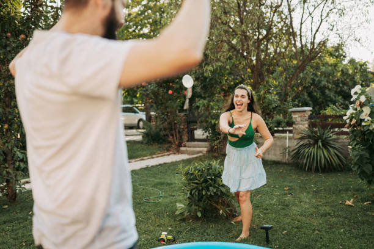
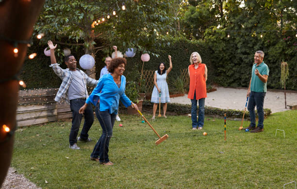
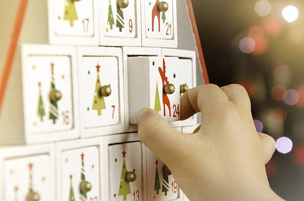
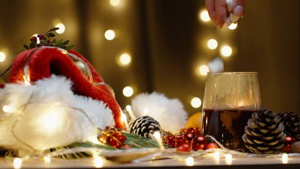
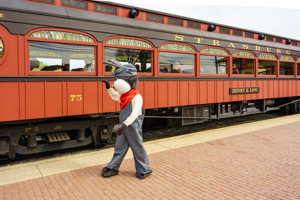
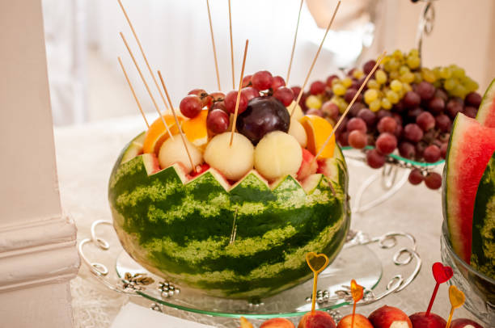
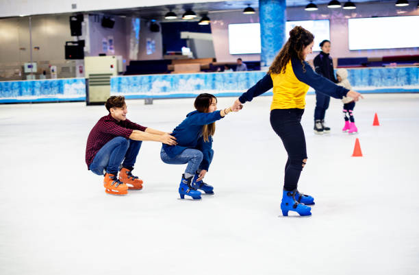
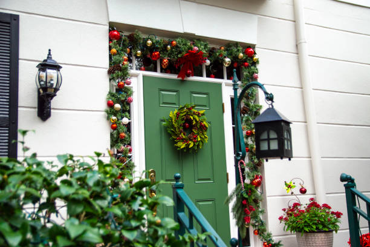

This article has been written and researched by our expert Loveable through a precise methodology. [Learn more about our methodology](https://avada.io/loveable/our-methodological.html)

[Loveable](https://avada.io/loveable/) > [Blog](https://avada.io/loveable/blog/) > [Holiday](https://avada.io/loveable/holiday/)

# 25+ Christmas in July Activities to Beat the Heat

Written by [Blake Simpson](https://avada.io/loveable/author/blake/) Last Updated on September 26, 2023

- [25+ Christmas in July Activities to Heat Up Your Holidays](https://avada.io/loveable/blog/christmas-in-july-activities/#wp-block-heading-2-2)
    - [1\. Listen to Christmas music](https://avada.io/loveable/blog/christmas-in-july-activities/#wp-block-heading-3-3)
    - [2\. Snowball fight! (made from water balloons)](https://avada.io/loveable/blog/christmas-in-july-activities/#wp-block-heading-3-6)
    - [3\. Christmas trivia](https://avada.io/loveable/blog/christmas-in-july-activities/#wp-block-heading-3-9)
    - [4\. Bake Christmas cookies](https://avada.io/loveable/blog/christmas-in-july-activities/#wp-block-heading-3-13)
    - [5\. Lawn game](https://avada.io/loveable/blog/christmas-in-july-activities/#wp-block-heading-3-16)
    - [6\. Christmas carol charades](https://avada.io/loveable/blog/christmas-in-july-activities/#wp-block-heading-3-20)
    - [7\. Make a Christmas backdrop](https://avada.io/loveable/blog/christmas-in-july-activities/#wp-block-heading-3-23)
    - [8\. Read a Christmas story](https://avada.io/loveable/blog/christmas-in-july-activities/#wp-block-heading-3-26)
    - [9\. Do good deeds](https://avada.io/loveable/blog/christmas-in-july-activities/#wp-block-heading-3-29)
    - [10\. Advent calendar](https://avada.io/loveable/blog/christmas-in-july-activities/#wp-block-heading-3-32)
    - [11\. Christmas table decorations](https://avada.io/loveable/blog/christmas-in-july-activities/#wp-block-heading-3-35)
    - [12\. Make hot chocolate](https://avada.io/loveable/blog/christmas-in-july-activities/#wp-block-heading-3-38)
    - [13\. Decorate Christmas cookies](https://avada.io/loveable/blog/christmas-in-july-activities/#wp-block-heading-3-41)
    - [14\. Set up a Christmas tree](https://avada.io/loveable/blog/christmas-in-july-activities/#wp-block-heading-3-44)
    - [15\. Christmas caroling](https://avada.io/loveable/blog/christmas-in-july-activities/#wp-block-heading-3-47)
    - [16\. Christmas drink party](https://avada.io/loveable/blog/christmas-in-july-activities/#wp-block-heading-3-50)
    - [17\. Christmas dinner](https://avada.io/loveable/blog/christmas-in-july-activities/#wp-block-heading-3-53)
    - [18\. Ugly T-shirt contest](https://avada.io/loveable/blog/christmas-in-july-activities/#wp-block-heading-3-56)
    - [19\. Exchange gifts](https://avada.io/loveable/blog/christmas-in-july-activities/#wp-block-heading-3-59)
    - [20\. Hallmark movie marathon](https://avada.io/loveable/blog/christmas-in-july-activities/#wp-block-heading-3-62)
    - [21\. Polar Express train rides](https://avada.io/loveable/blog/christmas-in-july-activities/#wp-block-heading-3-66)
    - [22\. Create fruit centerpieces](https://avada.io/loveable/blog/christmas-in-july-activities/#wp-block-heading-3-69)
    - [23\. Indoor ice skating](https://avada.io/loveable/blog/christmas-in-july-activities/#wp-block-heading-3-72) 
    - [24\. Decorate your house](https://avada.io/loveable/blog/christmas-in-july-activities/#wp-block-heading-3-75)
    - [25\. Book Santa Claus](https://avada.io/loveable/blog/christmas-in-july-activities/#wp-block-heading-3-78)
    - [26\. Paint holiday pottery](https://avada.io/loveable/blog/christmas-in-july-activities/#wp-block-heading-3-81)
- [Final thought](https://avada.io/loveable/blog/christmas-in-july-activities/#wp-block-heading-2-84)

Who says Christmas only comes once a year? When the summer sun is blazing and the heat is unbearable, why not bring the festive spirit of Christmas into July? In this article, we’ve compiled a list of **25+ Christmas in July Activities** that will turn your summer days into a holiday wonderland. Let’s discover how to beat the heat while celebrating Christmas in July!

## **25+ Christmas in July Activities to Heat Up Your Holidays**

### **1\. Listen to Christmas music**

What’s better than basking in the sun while listening to the soothing sounds of Christmas carols? Create a playlist of your favorite holiday tunes and let the music transport you to a winter wonderland, even if you’re sipping lemonade by the pool. It’s a simple activity in July to get into the festive mood.

### **2\. Snowball fight! (made from water balloons)**

Cool off with an epic snowball fight, but with a twist—water balloons! Fill them up and gather your friends and family for an exhilarating water balloon battle. It’s a surefire way to beat the heat while having a blast.

### **3\. Christmas trivia**

Test your knowledge of all things Christmas with a friendly trivia competition. Challenge your loved ones with questions about holiday traditions, movies, and songs. Who can answer the most questions correctly? The winner gets a candy cane!

You can read more: [Christmas Trivia](https://www.quizbreaker.com/christmas-trivia)

### **4\. Bake Christmas cookies**

Participate in the relaxing baking activity and prepare a batch of your most beloved cookies for the holiday. Choose your favorite Christmas cookie—gingerbread, sugar, or snickerdoodles—and appreciate the comforting sweetness of Christmas in July.

### **5\. Lawn game**

Transform your backyard into a playground of fun with Christmas-themed lawn games. From cornhole with a holiday twist to a giant Jenga game adorned with festive decor, there’s no shortage of competitive entertainment under the July sun.

Read more: [Lawn Games](https://nymag.com/strategist/article/best-outdoor-games.html)

### **6\. Christmas carol charades**

Combine the magic of Christmas carols with the excitement of charades. Act out your favorite holiday songs and let your friends guess the tune. Who knew caroling activities could be this entertaining?

### **7\. Make a Christmas backdrop**

Turn your outdoor space into a winter wonderland with a festive backdrop. Hang fairy lights, sprinkle some fake snow, and you’ll have the perfect setting for memorable photos with your loved ones for Christmas in July.

### **8\. Read a Christmas story**

On Christmas in July, your family or friends can listen to a Christmas story that will warm their hearts. Storytelling brings the spirit of Christmas to life, whether it’s an old favorite like “A Christmas Carol” or a sweet story for kids.

### **9\. Do good deeds**

Do something meaningful this Christmas by engaging in [charitable activities](https://avada.io/loveable/blog/volunteer-activities/). Consider donating to a local charity or volunteering your time to help those in need. Christmas in July is about spreading kindness, so you should do good things, right?

### **10\. Advent calendar**

Don’t reserve the joy of advent calendars for December alone. Craft your very own for July and unwrap a small surprise each day. It’s like waking up to a mini Christmas celebration every morning, spreading holiday cheer throughout the summer.

### **11\. Christmas table decorations**

[Christmas table decorations](https://avada.io/loveable/blog/christmas-coffee-table-decoration/) can infuse your meals with a little bit of the enchantment of the holiday season. This activity is about providing your guests a visual feast, so think about using beautiful tablecloths, lovely centerpieces, and personalized place cards.

### **12\. Make hot chocolate**

Savor the warmth of a steaming cup of hot chocolate, garnished with fluffy marshmallows, velvety whipped cream, and a dusting of chocolate shavings. Who says hot cocoa is reserved solely for winter? On Christmas in July, this beverage becomes a delightful contrast—a comforting treat under the summer sun.

### **13\. Decorate Christmas cookies**

Take cookie decorating to the next level by hosting a friendly competition. You can see who can create the most festive and delicious Christmas cookies in July. It’s a treat for your taste buds and your creativity.

### **14\. Set up a Christmas tree**

Surprise your senses by setting up a Christmas tree in July. Adorn it with sparkling ornaments and twinkling lights to recreate the enchantment of holiday decorating. July’s warmth becomes the backdrop for this unexpected festive tradition, allowing you to relish the joy of the holidays all over again.

### **15\. Christmas caroling**

By going Christmas caroling, you can bring joy to the people in your neighborhood. Wear your best holiday clothes and sing carols with your friends and family as you welcome your neighbors. Let the holiday spirit fill the air as you enjoy the magic of music and being together.

### **16\. Christmas drink party**

Gather your friends and family for a Christmas Drink party, with everyone raising their glasses to summer merriment. You can embrace the holiday spirit with various festive drinks, including creamy eggnog and refreshing peppermint mochas. Sip and savor these delightful concoctions while soaking up the sun, creating a festive atmosphere that will make your Christmas in July celebration truly unforgettable. 

### **17\. Christmas dinner**

Cooking a Christmas meal in classic style, including all of your most beloved members, is a blessing, right? The traditional Thanksgiving meal is complete with roasted turkey, mashed potatoes, and cranberry sauce. It’s a wonderful way to mark the Christmas in July!

### **18\. [Ugly T-shirt contest](https://www.etsy.com/market/ugly_shirt_contest)**

Trade those conventional ugly Christmas sweaters for a twist—host an Ugly T-shirt contest. Challenge your friends and family to find or craft the most outrageously tacky holiday-themed shirts. Laughter is guaranteed as participants compete for the title of the wackiest wardrobe in this fun and lighthearted Christmas in July activity.

### **19\. Exchange gifts**

Why limit the joy of gift-giving to December? In July, organize a Secret Santa gift exchange with friends or family. Revel in the delight of giving and receiving presents, spreading the warmth of the holiday season during the summer. It’s a heartwarming way to celebrate Christmas in July.

### **20\. Hallmark movie marathon**

A Hallmark Movie Marathon is a great way to beat the summer heat. Read touching stories about love, family, and the magic of the holiday season. It’s the best way to enjoy Christmas in July, with all the coziness and cheer of your favorite Hallmark movies.

Read more: [Hallmark Movie Marathon](https://www.hallmarkchannel.com/christmas/christmas-marathon-movies/**)

### **21\. Polar Express train rides**

If you are lucky, experience the magic of a Polar Express Train ride, a rare treat in July for Christmas time. The journey with Santa Claus aboard is a wondrous adventure suitable for all ages, promising cherished memories and holiday enchantment.

### **22\. Create fruit centerpieces**

Put some creativity into the fruit bouquets you make. Make your own cute holiday creatures out of fruits, including watermelons, pineapples, and other tropical fruits. It is a refreshing and entertaining way to keep cool while showing off your creative side.

### **23\. Indoor ice skating** 

Find an indoor ice skating rink, prepare your skates, and head there. Even though it’s the middle of July, you can still glide across the ice and enjoy the feeling of being in a winter wonderland.

### **24\. Decorate your house**

Don’t limit your decorating skills to the backyard; bring the holiday spirit indoors by adorning your home with Christmas lights, stockings, and wreaths. Make every corner of your house feel like the North Pole.

### **25\. Book Santa Claus**

Want to surprise your guests with the ultimate Christmas in July guest? Book a professional Santa Claus to make a special appearance. This activity captures the enchantment of the holiday season with Santa’s presence.

### **26\. Paint holiday pottery**

It’s never too early to start drawing and making holiday gifts. Putting holiday designs on pottery is a great way to let your artistic side come into play. You can make custom decorations, mugs, or plates to remember your Christmas in July event. 

## **Final thought**

Christmas in July is a fantastic way to relive the magic of the holiday season during the sweltering summer months. Whether you host a festive party, you can enjoy Christmas-themed activities with loved ones, or simply sip hot chocolate by the pool.

Having these **25+ Christmas in July Activities** at your party will ensure your holiday is filled with warmth, joy, and unforgettable memories. So, gather your friends and family, embrace the holiday spirit, and beat the heat with these delightful Christmas in July festivities!

- [25+ Christmas in July Activities to Heat Up Your Holidays](https://avada.io/loveable/blog/christmas-in-july-activities/#wp-block-heading-2-2)
    - [1\. Listen to Christmas music](https://avada.io/loveable/blog/christmas-in-july-activities/#wp-block-heading-3-3)
    - [2\. Snowball fight! (made from water balloons)](https://avada.io/loveable/blog/christmas-in-july-activities/#wp-block-heading-3-6)
    - [3\. Christmas trivia](https://avada.io/loveable/blog/christmas-in-july-activities/#wp-block-heading-3-9)
    - [4\. Bake Christmas cookies](https://avada.io/loveable/blog/christmas-in-july-activities/#wp-block-heading-3-13)
    - [5\. Lawn game](https://avada.io/loveable/blog/christmas-in-july-activities/#wp-block-heading-3-16)
    - [6\. Christmas carol charades](https://avada.io/loveable/blog/christmas-in-july-activities/#wp-block-heading-3-20)
    - [7\. Make a Christmas backdrop](https://avada.io/loveable/blog/christmas-in-july-activities/#wp-block-heading-3-23)
    - [8\. Read a Christmas story](https://avada.io/loveable/blog/christmas-in-july-activities/#wp-block-heading-3-26)
    - [9\. Do good deeds](https://avada.io/loveable/blog/christmas-in-july-activities/#wp-block-heading-3-29)
    - [10\. Advent calendar](https://avada.io/loveable/blog/christmas-in-july-activities/#wp-block-heading-3-32)
    - [11\. Christmas table decorations](https://avada.io/loveable/blog/christmas-in-july-activities/#wp-block-heading-3-35)
    - [12\. Make hot chocolate](https://avada.io/loveable/blog/christmas-in-july-activities/#wp-block-heading-3-38)
    - [13\. Decorate Christmas cookies](https://avada.io/loveable/blog/christmas-in-july-activities/#wp-block-heading-3-41)
    - [14\. Set up a Christmas tree](https://avada.io/loveable/blog/christmas-in-july-activities/#wp-block-heading-3-44)
    - [15\. Christmas caroling](https://avada.io/loveable/blog/christmas-in-july-activities/#wp-block-heading-3-47)
    - [16\. Christmas drink party](https://avada.io/loveable/blog/christmas-in-july-activities/#wp-block-heading-3-50)
    - [17\. Christmas dinner](https://avada.io/loveable/blog/christmas-in-july-activities/#wp-block-heading-3-53)
    - [18\. Ugly T-shirt contest](https://avada.io/loveable/blog/christmas-in-july-activities/#wp-block-heading-3-56)
    - [19\. Exchange gifts](https://avada.io/loveable/blog/christmas-in-july-activities/#wp-block-heading-3-59)
    - [20\. Hallmark movie marathon](https://avada.io/loveable/blog/christmas-in-july-activities/#wp-block-heading-3-62)
    - [21\. Polar Express train rides](https://avada.io/loveable/blog/christmas-in-july-activities/#wp-block-heading-3-66)
    - [22\. Create fruit centerpieces](https://avada.io/loveable/blog/christmas-in-july-activities/#wp-block-heading-3-69)
    - [23\. Indoor ice skating](https://avada.io/loveable/blog/christmas-in-july-activities/#wp-block-heading-3-72) 
    - [24\. Decorate your house](https://avada.io/loveable/blog/christmas-in-july-activities/#wp-block-heading-3-75)
    - [25\. Book Santa Claus](https://avada.io/loveable/blog/christmas-in-july-activities/#wp-block-heading-3-78)
    - [26\. Paint holiday pottery](https://avada.io/loveable/blog/christmas-in-july-activities/#wp-block-heading-3-81)
- [Final thought](https://avada.io/loveable/blog/christmas-in-july-activities/#wp-block-heading-2-84)

### [Blake Simpson](https://avada.io/loveable/author/blake/)

Hi, I'm Blake from Loveable. I help people find perfect gifts for occasions like anniversaries and weddings. I also write a blog about holidays, sharing insights to make them more meaningful. Let's create unforgettable moments together!

- [Twitter](https://twitter.com/intent/tweet)
- [Facebook](https://www.facebook.com/sharer/sharer.php)
- [instagram](https://avada.io/loveable/blog/christmas-in-july-activities/)
- [pinterest](https://www.pinterest.com/loveablellc/)

## Related Posts

[### 120+ Christian Birthday Wishes To Spread Your Love](https://avada.io/loveable/blog/christian-birthday-wishes/) 

[

### 35 Best 70th Birthday Ideas To Celebrate The Special Milestone

](https://avada.io/loveable/blog/70th-birthday-ideas/)

[

### 50 Best 30th Birthday Decorations for a Remarkable Birthday Bash

](https://avada.io/loveable/blog/30th-birthday-decorations/)

[

### 40 Delicious Vegan Christmas Desserts to Delight Your Palate

](https://avada.io/loveable/blog/vegan-christmas-desserts/)

[

### 60 Christmas Team Building Activities to Boost Workplace Spirit

](https://avada.io/loveable/blog/christmas-team-building-activities/)
