This article has been written and researched by our expert Loveable through a precise methodology. [Learn more about our methodology](https://avada.io/loveable/our-methodological.html)

[Loveable](https://avada.io/loveable/) > [Blog](https://avada.io/loveable/blog/) > [Holiday](https://avada.io/loveable/holiday/)

# 25 Christmas Movie Characters Bringing Everlasting Memory to Your Heart

Written by [Blake Simpson](https://avada.io/loveable/author/blake/) Last Updated on September 11, 2023

- [15 Most Popular Christmas Movie Characters of All Time](https://avada.io/loveable/blog/christmas-movie-characters/#wp-block-heading-2-3) 
    - [1\. Rudolph (Rudolph the Red-Nosed Reindeer – 1964)](https://avada.io/loveable/blog/christmas-movie-characters/#wp-block-heading-3-4)
    - [2\. Kevin McCallister (Home Alone – 1990)](https://avada.io/loveable/blog/christmas-movie-characters/#wp-block-heading-3-9)
    - [3\. Buddy (Elf – 2003)](https://avada.io/loveable/blog/christmas-movie-characters/#wp-block-heading-3-14)
    - [4\. Ebenezer Scrooge (A Christmas Carol – 1984)](https://avada.io/loveable/blog/christmas-movie-characters/#wp-block-heading-3-19)
    - [5. Frosty the Snowman (Frosty the Snowman – 1969)](https://avada.io/loveable/blog/christmas-movie-characters/#wp-block-heading-3-24)
    - [6\. Grinch (How the Grinch Stole Christmas – 2000)](https://avada.io/loveable/blog/christmas-movie-characters/#wp-block-heading-3-29)
    - [7. Jack Skellington (The Nightmare Before Christmas – 1993)](https://avada.io/loveable/blog/christmas-movie-characters/#wp-block-heading-3-34)
    - [8. Clark Griswold (National Lampoon’s Christmas Vacation – 1989)](https://avada.io/loveable/blog/christmas-movie-characters/#wp-block-heading-3-39)
    - [9. Hermey the Elf (Rudolph the Red-Nosed Reindeer – 1964)](https://avada.io/loveable/blog/christmas-movie-characters/#wp-block-heading-3-44)
    - [10. George Bailey (It’s a Wonderful Life – 1946)](https://avada.io/loveable/blog/christmas-movie-characters/#wp-block-heading-3-49)
    - [11. Cindy Lou Who (How the Grinch Stole Christmas – 2000)](https://avada.io/loveable/blog/christmas-movie-characters/#wp-block-heading-3-54)
    - [12. Kris Fawcett (Bad Santa – 2003)](https://avada.io/loveable/blog/christmas-movie-characters/#wp-block-heading-3-59)
    - [13. Karen (Frosty the Snowman – 1969)](https://avada.io/loveable/blog/christmas-movie-characters/#wp-block-heading-3-64)
    - [14. Susan Walker (Miracle on 34th Street – 1947)](https://avada.io/loveable/blog/christmas-movie-characters/#wp-block-heading-3-69)
    - [15. Scott Calvin (The Santa Clause – 1994)](https://avada.io/loveable/blog/christmas-movie-characters/#wp-block-heading-3-74)
- [5 Famous Female Christmas Movie Characters](https://avada.io/loveable/blog/christmas-movie-characters/#wp-block-heading-2-79)
    - [1\. Clara (The Nutcracker – 2009)](https://avada.io/loveable/blog/christmas-movie-characters/#wp-block-heading-3-80)
    - [2\. Violet Bick (It’s a Wonderful Life – 1946)](https://avada.io/loveable/blog/christmas-movie-characters/#wp-block-heading-3-85)
    - [3\. Jovie (Elf – 2003)](https://avada.io/loveable/blog/christmas-movie-characters/#wp-block-heading-3-90)
    - [4\. Marta Matuschek (The Shop Around the Corner – 1940)](https://avada.io/loveable/blog/christmas-movie-characters/#wp-block-heading-3-95)
    - [5. Kate McCallister (Home Alone – 1990)](https://avada.io/loveable/blog/christmas-movie-characters/#wp-block-heading-3-100)
- [5 Humorous Characters You Must See for Merry Christmas](https://avada.io/loveable/blog/christmas-movie-characters/#wp-block-heading-2-105)
    - [1\. Ralphie Parker (A Christmas Story – 1983)](https://avada.io/loveable/blog/christmas-movie-characters/#wp-block-heading-3-106)
    - [2. John McClane (Die Hard – 1988)](https://avada.io/loveable/blog/christmas-movie-characters/#wp-block-heading-3-111)
    - [3. Uncle Billy (It’s a Wonderful Life – 1946)](https://avada.io/loveable/blog/christmas-movie-characters/#wp-block-heading-3-116)
    - [4. Cousin Eddie (National Lampoon’s Christmas Vacation – 1989)](https://avada.io/loveable/blog/christmas-movie-characters/#wp-block-heading-3-121)
    - [5. Willie Soke (Bad Santa – 2003)](https://avada.io/loveable/blog/christmas-movie-characters/#wp-block-heading-3-126) 
- [Bottom Line](https://avada.io/loveable/blog/christmas-movie-characters/#wp-block-heading-2-134)

Let’s enter on a joyful cinematic sleigh ride as we unwrap the captivating world of Christmas movie characters! Right now, we’re diving deep into the magic of holiday films to celebrate 25 iconic **Christmas movie characters**. Through the time, they have etched their names in the annals of your hearts.

From Santa’s merry helpers to endearing protagonists and lovable misfits, these characters have sprinkled festive charm and everlasting memories into your lives. Just join us as we journey through yuletide tales and rediscover the cherished figures who make your favorite Christmas movies truly unforgettable.

## **15 Most Popular Christmas Movie Characters of All Time** 

### **1\. Rudolph (Rudolph the Red-Nosed Reindeer – 1964)**

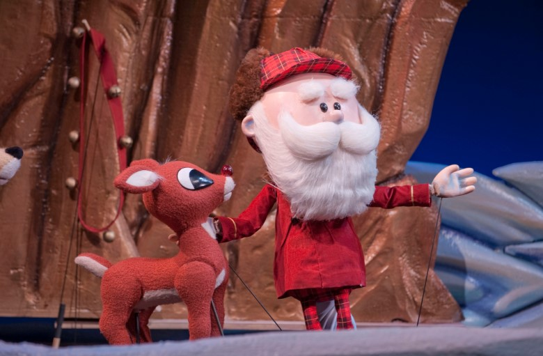

You might remember Rudolph from the classic story “Rudolph the Red-Nosed Reindeer” from 1964. This reindeer, with a shiny red nose that stands out, is quite special.

Alongside his pals, like Hermey the elf and Yukon Cornelius, he finds the strength to overcome obstacles and even save Christmas. Rudolph’s journey taught you that your differences could become your strengths, and it’s okay to be yourself. 

**Where to watch**: [Amazon Prime Video](https://www.amazon.com/Rudolph-Red-Nosed-Reindeer-Larry-Mann/dp/B09M699B8F/)

### **2\. Kevin McCallister (Home Alone – 1990)**

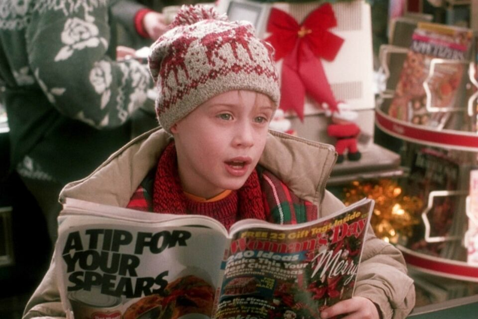

Portrayed by Macaulay Culkin at just 10 years old, Kevin McCallister of “Home Alone” (1990) instantly became the mischievous yet endearing face of the holiday. As the young boy inadvertently left behind when his family goes on vacation, Kevin’s clever booby traps to defend his home from burglars turned this film into a timeless comedy sensation.

Kevin’s adventure is a mix of humor and excitement, and his ability to handle things on his own reminds you that you can handle challenges. 

**Where to watch**: [Amazon Prime Video](https://www.amazon.com/Home-Alone-Macaulay-Culkin/dp/B0031QNMKK/)

### **3\. Buddy (Elf – 2003)**

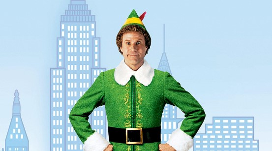

You might recall Buddy from the movie “Elf” released in 2003. Buddy, played by Will Ferrell, is a human raised by elves at the North Pole. When he discovers he’s not an elf, he travels to New York City to find his real father. 

His childlike wonder teaches you about spreading happiness and embracing your true self. So, if you are a fan of this Christmas movie character, let’s head to your phone and watch it now. 

**Where to watch**: [Amazon Prime Video](https://www.amazon.com/Elf-Will-Ferrell/dp/B09PQKZJYZ)

### **4\. Ebenezer Scrooge (A Christmas Carol – 1984)**

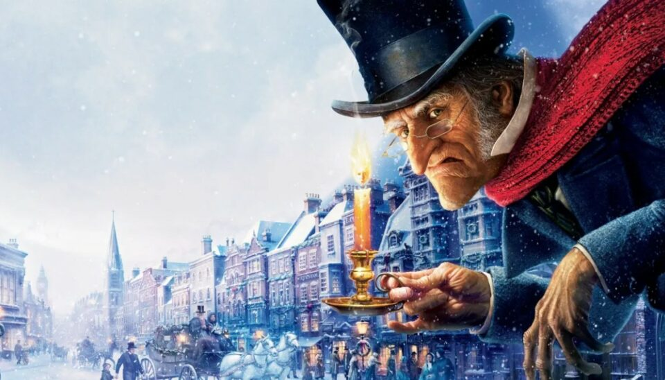

You’ve probably heard of Ebenezer Scrooge from the story “A Christmas Carol.” He’s a wealthy and miserly man who doesn’t care much for others. One Christmas Eve, he’s visited by three ghosts who show him his past, present, and bleak future. 

Through these visions, you see Scrooge transform from a cold-hearted person to someone filled with compassion. Scrooge is a Xmas movie character who reminds you that giving can bring happiness and meaning to your life. 

**Where to watch**: [Amazon Prime Video](https://www.amazon.com/Christmas-Carol-George-C-Scott/dp/B004CNPUWO/)

### **5. Frosty the Snowman (Frosty the Snowman – 1969)**

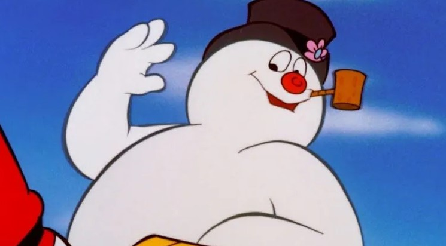

Frosty the Snowman in the 1969 animated classic, voiced by Jackie Vernon, brought a winter wonderland to life. Frosty’s heartwarming journey with children to the North Pole captures the magic of imagination and friendship. 

Throughout the story, you see Frosty’s caring heart as he guides his friends on an adventure to keep him from melting. This Christmas film character will teach you about the value of friendship and the joy of living in the moment. 

**Where to watch**: [Amazon Prime Video](https://www.amazon.com/Frosty-Snowman-Billy-Wolfe/dp/B09M7TWZDD/)

### **6\. Grinch (How the Grinch Stole Christmas – 2000)**

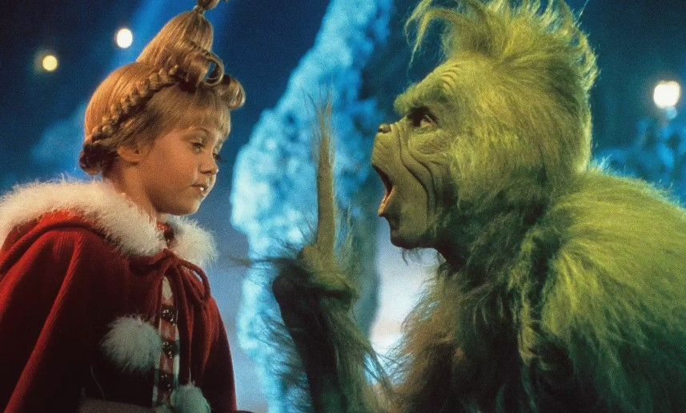

You surely know the Grinch from “How the Grinch Stole Christmas.” He’s a green and grumpy creature who dislikes the holiday spirit. The Grinch hatches a plan to steal all the Christmas joy from the cheerful town of Whoville. 

However, as the story unfolds, you witness a change in his heart. Through the kindness of the Whos, the Grinch discovers the true meaning of Christmas. His transformation shows you the power of love and community. 

**Where to watch**: [Amazon Prime Video](https://www.amazon.com/Dr-Seuss-Grinch-Stole-Christmas/dp/B009CG9LZI/)

### **7. Jack Skellington (The Nightmare Before Christmas – 1993)**

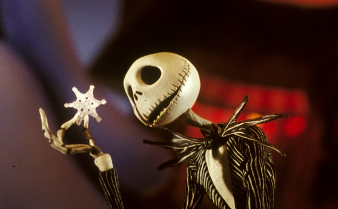

Remember the Christmas movie, “The Nightmare Before Christmas” released in 1993? Jack is the Pumpkin King of Halloween Town who becomes curious about Christmas. 

His desire to understand this festive holiday leads him to take over Christmas preparations, but things don’t go as planned. Jack will teach you about embracing who you are and appreciating the uniqueness of others. 

**Where to watch**: [Amazon Prime Video](https://www.amazon.com/Tim-Burtons-Nightmare-Before-Christmas/dp/B0CG7G8ZR6/)

### **8. Clark Griswold (National Lampoon’s Christmas Vacation – 1989)**

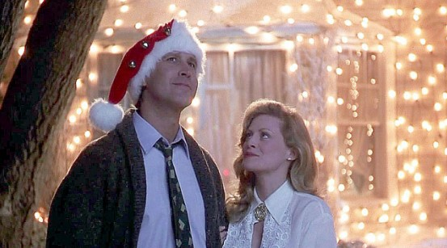

Clark Griswold is portrayed by Chevy Chase in “National Lampoon’s Christmas Vacation” (1989). Clark’s determination to create the perfect Christmas for his family leads to a series of comical mishaps, making the film a side-splitting yuletide favorite.

Moreover, Clark is an iconic Christmas movie character who delivers a lesson that even when things don’t go as planned, the joy of spending time with family is what truly matters. 

**Where to watch**: [Amazon Prime Video](https://www.amazon.com/National-Lampoons-Christmas-Vacation-Chevy/dp/B009IU6BIS/)

### **9. Hermey the Elf (Rudolph the Red-Nosed Reindeer – 1964)**

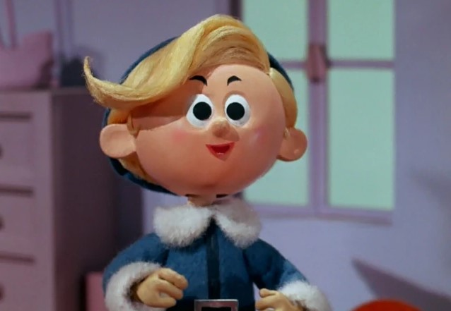

Let’s recall “Rudolph the Red-Nosed Reindeer”, a wonderful [animated Christmas movie](https://avada.io/loveable/blog/animated-christmas-movies/) that is warmed up with the Hermey character. Hermey is unlike other elves; he dreams of becoming a dentist rather than making toys. 

His friendship with Rudolph shows that embracing differences can lead to meaningful connections. Hermey’s character will encourage you to be true to yourself and support others in their pursuits.

**Where to watch**: [Amazon Prime Video](https://www.amazon.com/Rudolph-Red-Nosed-Reindeer-Larry-Mann/dp/B09M699B8F/)

### **10. George Bailey (It’s a Wonderful Life – 1946)**

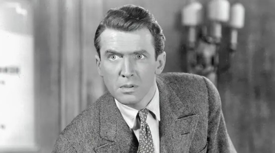

If you have been living in the 1940s, you might not forget the popular Christmas film character – George Bailey from “It’s a Wonderful Life.” George is a kind and selfless man who sacrifices his dreams for his family and community.

Through George’s story, you’ll understand the value of compassion and the ripple effect of your actions. And you will know how valuable your presence and kindness is. 

**Where to watch**: [Amazon Prime Video](https://www.amazon.com/Its-Wonderful-Life-James-Stewart/dp/B07JNJQTSX)

### **11. Cindy Lou Who (How the Grinch Stole Christmas – 2000)**

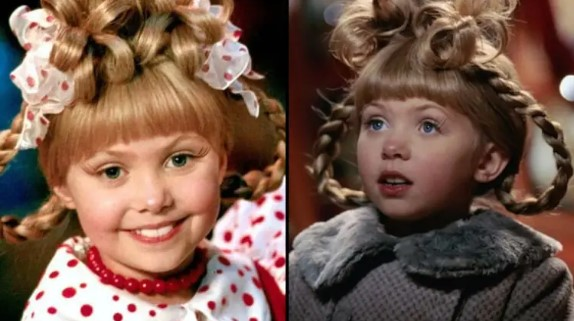

Let’s turn on your TV and watch Cindy Lou Who from “How the Grinch Stole Christmas” this festive season. Cindy Lou is a curious and kind-hearted little girl in Whoville. Despite the Grinch’s reputation, she sees the good in him.

Her determination to help the Grinch shows that small acts of kindness can make a big difference. Cindy Lou teaches you the power of understanding and reaching out to others through her innocence and empathy. 

**Where to watch**: [Amazon Prime Video](https://www.amazon.com/Dr-Seuss-Grinch-Stole-Christmas/dp/B009CG9LZI/)

### **12. Kris Fawcett (Bad Santa – 2003)**

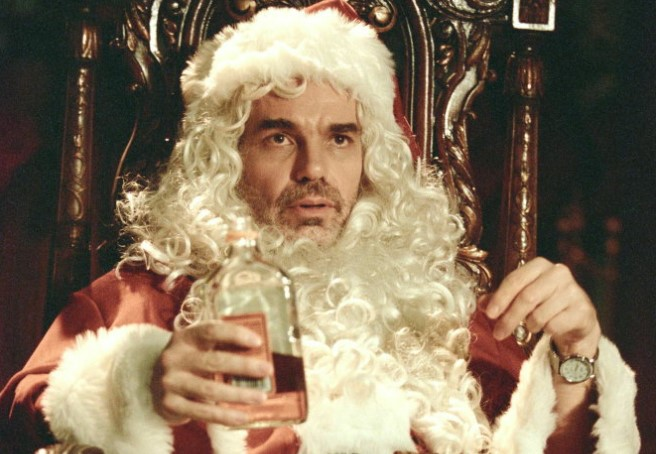

Meet Kris Fawcett from “Bad Santa” – a character that might surprise you. Kris is a kid with an attitude, and he’s not your typical movie child. You’ll notice his boldness and quick wit as he navigates the holiday chaos. 

Despite the unconventional circumstances, Kris uniquely bonds with Willie, the not-so-jolly Santa. You’ll chuckle at their unlikely friendship and Kris’s candid remarks.  

**Where to watch**: [Amazon Prime Video](https://www.amazon.com/Bad-Santa-Billy-Bob-Thornton/dp/B01NCHA4UW/)

### **13. Karen (Frosty the Snowman – 1969)**

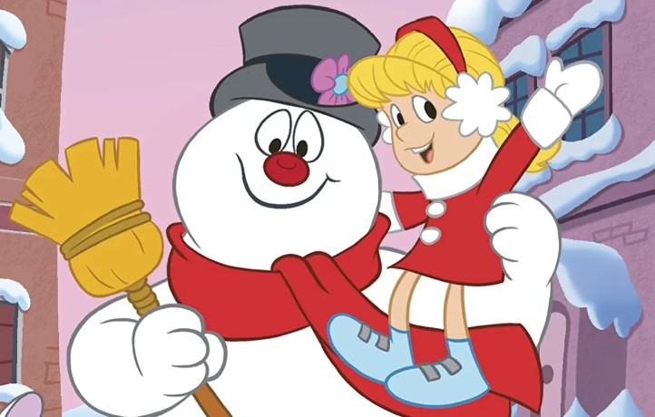

Let’s return to your childhood and watch the Karen from “Frosty the Snowman”. Karen is a kind-hearted little girl who befriends Frosty the Snowman. She joins Frosty on an adventure to the North Pole to avoid melting.

When you watch this Christmas movie character, you will understand the importance of friendship and looking out for others. Her willingness to help Frosty despite the challenges shows that compassion can lead to wonderful experiences for you. 

**Where to watch**: [Amazon Prime Video](https://www.amazon.com/Frosty-Snowman-Billy-Wolfe/dp/B09M7TWZDD/)

### **14. Susan Walker (Miracle on 34th Street – 1947)**

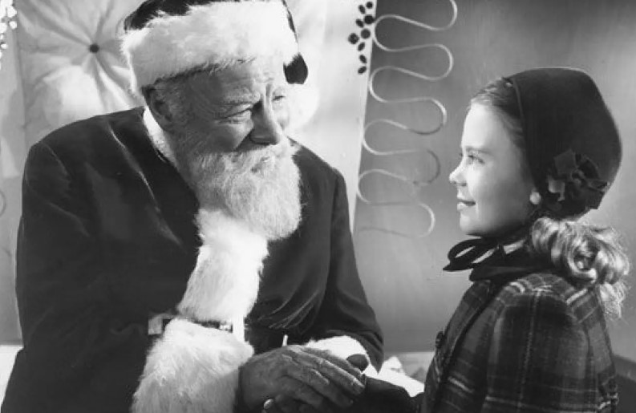

If you plan to surprise your grandparents or parents, nothing is more ideal than Susan Walker from “Miracle on 34th Street” (1947). Susan is a curious and skeptical little girl who encounters Kris Kringle, who claims to be the real Santa Claus. 

Susan’s journey will relive your beloved’s memory and their Christmas celebration at that time. Let’s follow this character while listening to your loved seniors talking about their memories with this film. 

**Where to watch**: [Amazon Prime Video](https://www.amazon.com/Miracle-34th-Street-Maureen-OHara/dp/B0031QNDUO/)

### **15. Scott Calvin (The Santa Clause – 1994)**

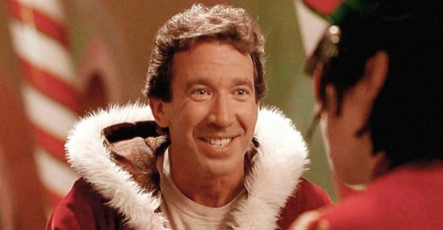

You probably remember Scott Calvin from “The Santa Clause,” released in 1994. Scott, portrayed by Tim Allen, is a regular guy who unexpectedly becomes Santa Claus after a mishap on Christmas Eve. 

Throughout his journey, you witness his transformation from skepticism to embracing his new role. Moreover, his humorous moments and heartfelt experiences will bring you joy and fulfillment. 

**Where to watch**: [Amazon Prime Video](https://www.amazon.com/Santa-Clause-Tim-Allen/dp/B0060CSH9S/)

## **5 Famous Female Christmas Movie Characters**

### **1\. Clara (The Nutcracker – 2009)**

Clara, you’re the heart of “The Nutcracker.” Throughout the story, she will face the Mouse King and explore the Land of Sweets. Her kindness, especially towards the Nutcracker Prince, warms my heart. 

Through her eyes, you’ll experience the enchantment of a world where dreams come to life. Clara’s journey reminds you that with courage and imagination, you can truly make the holiday magic your own.

**Where to watch**: [Amazon Prime Video](https://www.amazon.com/Nutcracker-Royal-Ballet/dp/B082YM9GRZ/)

### **2\. Violet Bick (It’s a Wonderful Life – 1946)**

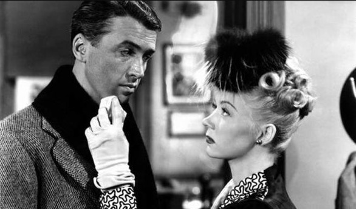

Let’s meet Violet Bick, a character in the timeless classic ‘It’s a Wonderful Life’ (1946). Violet’s sense of independence and desire for a better life creates an intriguing contrast. 

Her charm and ambition add depth to the story’s small-town setting. Her presence will prompt you to reflect on the different paths people take in life.

**Where to watch**: [Amazon Prime Video](https://www.amazon.com/Its-Wonderful-Life-James-Stewart/dp/B07JNJQTSX)

### **3\. Jovie (Elf – 2003)**

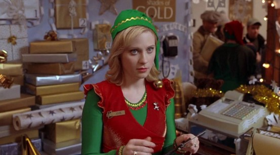

Let me introduce you to Jovie, a Christmas movie character in ‘Elf’ (2003).  Jovie’s journey is relatable as she learns to open her heart to joy and love. Besides, you’ll witness her transformation from a quiet worker to someone who embraces the holiday spirit.

Jovie perfectly adds a touch of warmth and authenticity to this festive tale, reminding you of the magic of the season.

**Where to watch**: [Amazon Prime Video](https://www.amazon.com/Elf-Will-Ferrell/dp/B09PQKZJYZ)

### **4\. Marta Matuschek (The Shop Around the Corner – 1940)**

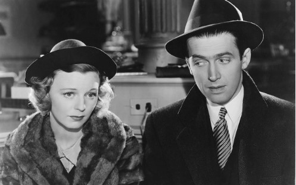

Why not take on a shuttle and come back to your parents’ time with ‘The Shop Around the Corner’ (1940) and meet Marta Matuschek? In the film, Marta’s complexity and vulnerability make her relatable and human.

Her journey will teach you about the power of empathy and second chances. Through her experiences, you’ll witness the transformative nature of love and forgiveness. 

**Where to watch**: [Amazon Prime Video](https://www.amazon.com/Shop-Around-Corner-James-Stewart/dp/B004GAKENI/r)

### **5. Kate McCallister (Home Alone – 1990)**

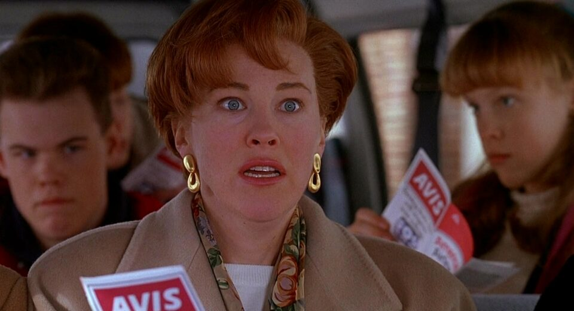

You might remember Kate McCallister, a Xmas movie character in the iconic film ‘Home Alone’ (1990). Kate represents a caring and determined mother stereotype. 

This film shows Kate’s strength and love shine through as she navigates the chaos. Her actions remind you of the power of family and the lengths a mother would go to protect her child. 

**Where to watch**: [Amazon Prime Video](https://www.amazon.com/Home-Alone-Macaulay-Culkin/dp/B0031QNMKK/)

## **5 Humorous Characters You Must See for Merry Christmas**

### **1\. Ralphie Parker (A Christmas Story – 1983)**

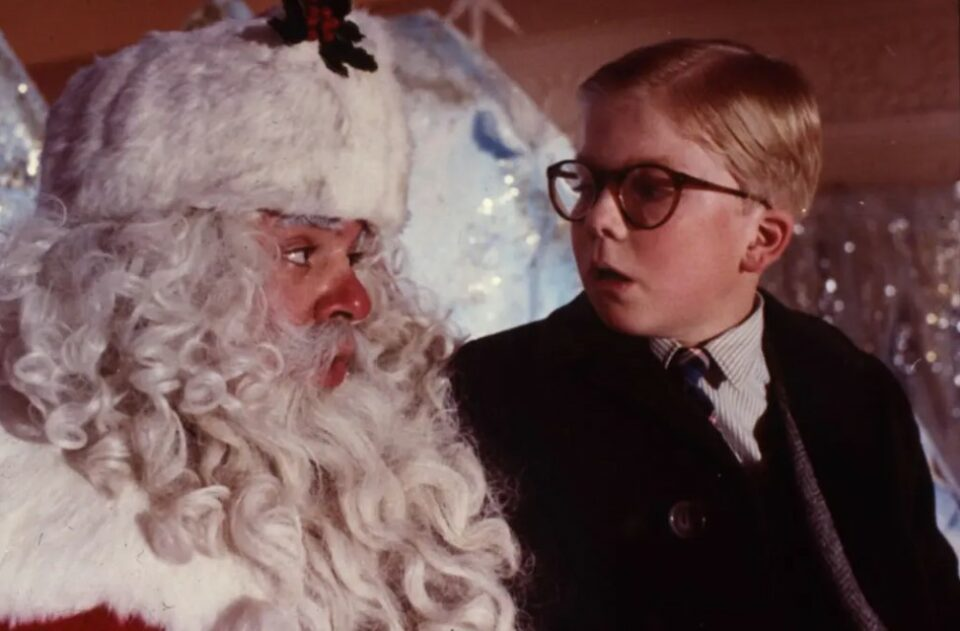

You may know Ralphie Parker from “A Christmas Story.” He’s a kid, just like you children. Ralphie really wants a special toy for Christmas – a Red Ryder BB gun. He dreams about it all the time. But things aren’t that easy for him.

Ralphie’s journey is like a rollercoaster, with ups and downs. You’ll laugh at his wild thoughts and his trying to navigate tricky situations. 

**Where to watch**: [Amazon Prime Video](https://www.amazon.com/Christmas-Story-Peter-Billingsley/dp/B009IU78LM/)

### **2. John McClane (Die Hard – 1988)**

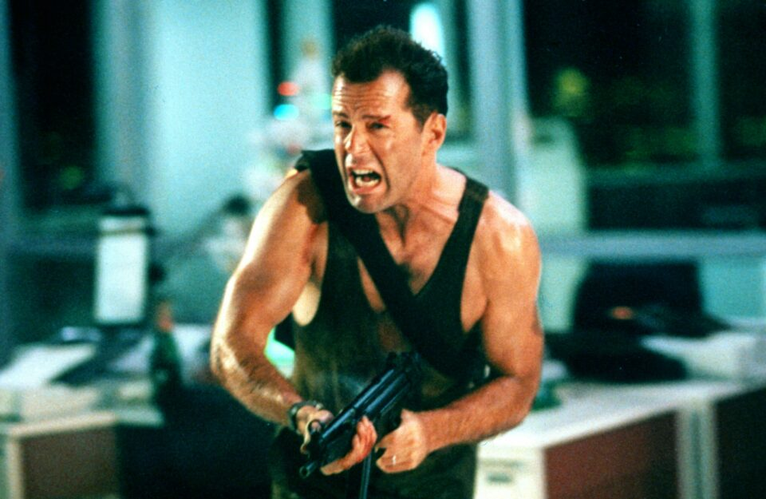

When you meet John McClane in “Die Hard,” you will know he’s not your typical hero. An everyday New York cop is just trying to reconnect with his wife at her work Christmas party. But things turn wild when terrorists crash the party and take everyone hostage. 

McClane’s bravery and clever strategies make “Die Hard” an action-packed classic you won’t forget. So, let’s turn on your TV and watch this hilarious Christmas movie character. 

**Where to watch**: [Amazon Prime Video](https://www.amazon.com/Die-Hard-Bruce-Willis/dp/B000SZK41M/)

### **3. Uncle Billy (It’s a Wonderful Life – 1946)**

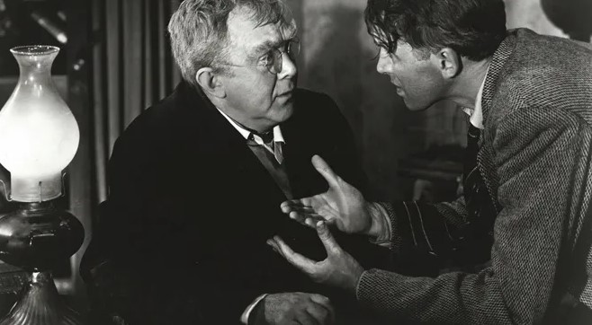

In “It’s a Wonderful Life,” you’ll meet Uncle Billy, a lovable character with a warm heart. He’s the uncle of the main character, George Bailey, and he works at the family’s building and loan business. 

While he means well, you’ll notice that Uncle Billy is a bit forgetful and sometimes gets things mixed up. is genuine care for the Bailey family, and his touching moments of vulnerability teach you that mistakes happen to the best of us.

**Where to watch**: [Amazon Prime Video](https://www.amazon.com/Its-Wonderful-Life-James-Stewart/dp/B07JNJQTSX)

### **4. Cousin Eddie (National Lampoon’s Christmas Vacation – 1989)**

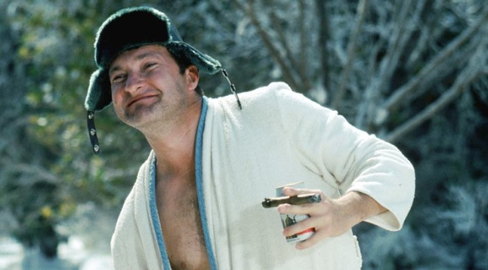

As you watch Cousin Eddie in “National Lampoon’s Christmas Vacation,” you’ll instantly be struck by his unique charm. He’s the quirky cousin of the main character, Clark Griswold, and he brings lots of comedic moments to the story. 

Throughout this Christmas film character, you’ll shake your head and laugh at Eddie’s antics. 

**Where to watch**: [Amazon Prime Video](https://www.amazon.com/National-Lampoons-Christmas-Vacation-Chevy/dp/B009IU6BIS/)

### **5. Willie Soke (Bad Santa – 2003)** 

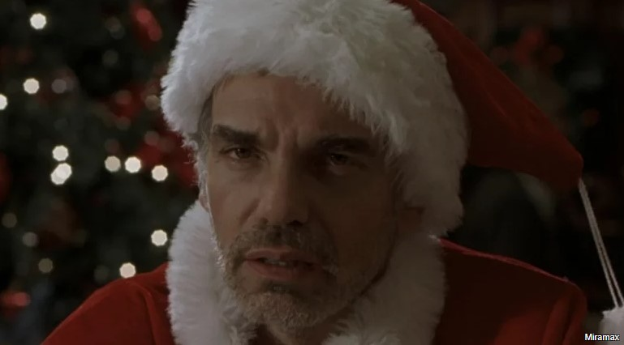

Whenever you encounter Willie Soke in “Bad Santa,” you can’t stand your laugh at him. He’s a down-on-his-luck guy who pretends to be a shopping mall Santa during the holiday season but is far from the jolly and cheerful type.

You’ll be amused by his crude language, questionable choices, and misanthropic attitude. Therefore, if you want to relieve your stress, let’s see Willie Soke this Christmas season. 

**Where to watch**: [Amazon Prime Video](https://www.amazon.com/Bad-Santa-Billy-Bob-Thornton/dp/B01NCHA4UW/)

**_See More:_**

- [Classic Christmas Movies](https://avada.io/loveable/blog/classic-christmas-movies/)

- Best [Black Christmas Movie](https://avada.io/loveable/blog/black-christmas-movie/)

## **Bottom Line**

In a series of introductions above, these 25 interesting **Christmas movie characters** have truly etched themselves into your heart. Now, might you laugh at Cousin Eddie’s antics and root for John McClane’s heroic efforts? Each character has brought a unique spark to make the holiday more fun.

Beyond that, these characters also remind you of the power of love, family, and the season’s magic. They’ve become your holiday companions, making the festive season more cherished and memorable.

- [15 Most Popular Christmas Movie Characters of All Time](https://avada.io/loveable/blog/christmas-movie-characters/#wp-block-heading-2-3) 
    - [1\. Rudolph (Rudolph the Red-Nosed Reindeer – 1964)](https://avada.io/loveable/blog/christmas-movie-characters/#wp-block-heading-3-4)
    - [2\. Kevin McCallister (Home Alone – 1990)](https://avada.io/loveable/blog/christmas-movie-characters/#wp-block-heading-3-9)
    - [3\. Buddy (Elf – 2003)](https://avada.io/loveable/blog/christmas-movie-characters/#wp-block-heading-3-14)
    - [4\. Ebenezer Scrooge (A Christmas Carol – 1984)](https://avada.io/loveable/blog/christmas-movie-characters/#wp-block-heading-3-19)
    - [5. Frosty the Snowman (Frosty the Snowman – 1969)](https://avada.io/loveable/blog/christmas-movie-characters/#wp-block-heading-3-24)
    - [6\. Grinch (How the Grinch Stole Christmas – 2000)](https://avada.io/loveable/blog/christmas-movie-characters/#wp-block-heading-3-29)
    - [7. Jack Skellington (The Nightmare Before Christmas – 1993)](https://avada.io/loveable/blog/christmas-movie-characters/#wp-block-heading-3-34)
    - [8. Clark Griswold (National Lampoon’s Christmas Vacation – 1989)](https://avada.io/loveable/blog/christmas-movie-characters/#wp-block-heading-3-39)
    - [9. Hermey the Elf (Rudolph the Red-Nosed Reindeer – 1964)](https://avada.io/loveable/blog/christmas-movie-characters/#wp-block-heading-3-44)
    - [10. George Bailey (It’s a Wonderful Life – 1946)](https://avada.io/loveable/blog/christmas-movie-characters/#wp-block-heading-3-49)
    - [11. Cindy Lou Who (How the Grinch Stole Christmas – 2000)](https://avada.io/loveable/blog/christmas-movie-characters/#wp-block-heading-3-54)
    - [12. Kris Fawcett (Bad Santa – 2003)](https://avada.io/loveable/blog/christmas-movie-characters/#wp-block-heading-3-59)
    - [13. Karen (Frosty the Snowman – 1969)](https://avada.io/loveable/blog/christmas-movie-characters/#wp-block-heading-3-64)
    - [14. Susan Walker (Miracle on 34th Street – 1947)](https://avada.io/loveable/blog/christmas-movie-characters/#wp-block-heading-3-69)
    - [15. Scott Calvin (The Santa Clause – 1994)](https://avada.io/loveable/blog/christmas-movie-characters/#wp-block-heading-3-74)
- [5 Famous Female Christmas Movie Characters](https://avada.io/loveable/blog/christmas-movie-characters/#wp-block-heading-2-79)
    - [1\. Clara (The Nutcracker – 2009)](https://avada.io/loveable/blog/christmas-movie-characters/#wp-block-heading-3-80)
    - [2\. Violet Bick (It’s a Wonderful Life – 1946)](https://avada.io/loveable/blog/christmas-movie-characters/#wp-block-heading-3-85)
    - [3\. Jovie (Elf – 2003)](https://avada.io/loveable/blog/christmas-movie-characters/#wp-block-heading-3-90)
    - [4\. Marta Matuschek (The Shop Around the Corner – 1940)](https://avada.io/loveable/blog/christmas-movie-characters/#wp-block-heading-3-95)
    - [5. Kate McCallister (Home Alone – 1990)](https://avada.io/loveable/blog/christmas-movie-characters/#wp-block-heading-3-100)
- [5 Humorous Characters You Must See for Merry Christmas](https://avada.io/loveable/blog/christmas-movie-characters/#wp-block-heading-2-105)
    - [1\. Ralphie Parker (A Christmas Story – 1983)](https://avada.io/loveable/blog/christmas-movie-characters/#wp-block-heading-3-106)
    - [2. John McClane (Die Hard – 1988)](https://avada.io/loveable/blog/christmas-movie-characters/#wp-block-heading-3-111)
    - [3. Uncle Billy (It’s a Wonderful Life – 1946)](https://avada.io/loveable/blog/christmas-movie-characters/#wp-block-heading-3-116)
    - [4. Cousin Eddie (National Lampoon’s Christmas Vacation – 1989)](https://avada.io/loveable/blog/christmas-movie-characters/#wp-block-heading-3-121)
    - [5. Willie Soke (Bad Santa – 2003)](https://avada.io/loveable/blog/christmas-movie-characters/#wp-block-heading-3-126) 
- [Bottom Line](https://avada.io/loveable/blog/christmas-movie-characters/#wp-block-heading-2-134)

### [Blake Simpson](https://avada.io/loveable/author/blake/)

Hi, I'm Blake from Loveable. I help people find perfect gifts for occasions like anniversaries and weddings. I also write a blog about holidays, sharing insights to make them more meaningful. Let's create unforgettable moments together!

- [Twitter](https://twitter.com/intent/tweet)
- [Facebook](https://www.facebook.com/sharer/sharer.php)
- [instagram](https://avada.io/loveable/blog/christmas-movie-characters/)
- [pinterest](https://www.pinterest.com/loveablellc/)

## Related Posts

[### 120+ Christian Birthday Wishes To Spread Your Love](https://avada.io/loveable/blog/christian-birthday-wishes/) 

[

### 35 Best 70th Birthday Ideas To Celebrate The Special Milestone

](https://avada.io/loveable/blog/70th-birthday-ideas/)

[

### 50 Best 30th Birthday Decorations for a Remarkable Birthday Bash

](https://avada.io/loveable/blog/30th-birthday-decorations/)

[

### 40 Delicious Vegan Christmas Desserts to Delight Your Palate

](https://avada.io/loveable/blog/vegan-christmas-desserts/)

[

### 60 Christmas Team Building Activities to Boost Workplace Spirit

](https://avada.io/loveable/blog/christmas-team-building-activities/)
