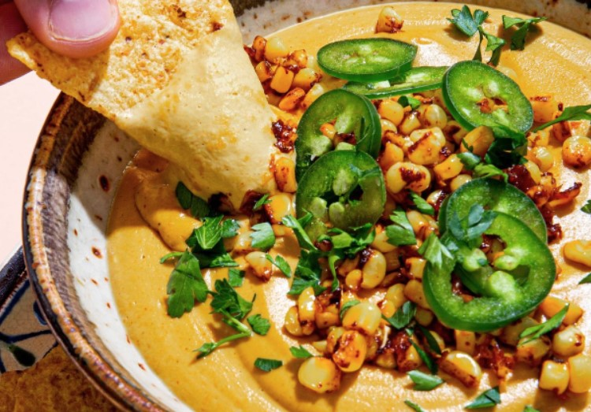

This article has been written and researched by our expert Loveable through a precise methodology. [Learn more about our methodology](https://avada.io/loveable/our-methodological.html)

[Loveable](https://avada.io/loveable/) > [Blog](https://avada.io/loveable/blog/) > [Holiday](https://avada.io/loveable/holiday/)

# 25 Creative Halloween Dip Recipes For Coming Up October 

Written by [Blake Simpson](https://avada.io/loveable/author/blake/) Last Updated on September 05, 2023

- [25 Creative Halloween Dip Recipes to Delight Your Guests](https://avada.io/loveable/blog/halloween-dip-recipes/#wp-block-heading-2-4)
    - [1\. Seven-Layer Taco Halloween Dip](https://avada.io/loveable/blog/halloween-dip-recipes/#wp-block-heading-3-5) 
    - [2\. Halloween Vegetable Dip for Vegetarian](https://avada.io/loveable/blog/halloween-dip-recipes/#wp-block-heading-3-9) 
    - [3\. Pumpkin Cider Cheese Halloween Dip](https://avada.io/loveable/blog/halloween-dip-recipes/#wp-block-heading-3-14)
    - [4\. Cute Ghost Banana and Peanut Butter Dip](https://avada.io/loveable/blog/halloween-dip-recipes/#wp-block-heading-3-19)
    - [5\. Spicy Pumpkin Hummus Dip](https://avada.io/loveable/blog/halloween-dip-recipes/#wp-block-heading-3-24)
    - [6\. Spooky Black Bean Swamp Dip](https://avada.io/loveable/blog/halloween-dip-recipes/#wp-block-heading-3-28)
    - [7\. Compost Crudités with Ranch Dirt Dip](https://avada.io/loveable/blog/halloween-dip-recipes/#wp-block-heading-3-32)
    - [8\. Taco Graveyard Dip](https://avada.io/loveable/blog/halloween-dip-recipes/#wp-block-heading-3-36)
    - [9\. Pumpkin Cannoli Cream Dip](https://avada.io/loveable/blog/halloween-dip-recipes/#wp-block-heading-3-40)
    - [10\. Pumpkin Shaped Cheese Ball](https://avada.io/loveable/blog/halloween-dip-recipes/#wp-block-heading-3-45) 
    - [11\. Skillet Chili & Meatballs](https://avada.io/loveable/blog/halloween-dip-recipes/#wp-block-heading-3-50)
    - [12\. Pumpkin Tomato Soup & Grilled Cheese Sticks](https://avada.io/loveable/blog/halloween-dip-recipes/#wp-block-heading-3-55)
    - [13\. Soft Pretzel Bites](https://avada.io/loveable/blog/halloween-dip-recipes/#wp-block-heading-3-59)
    - [14\. Halloween Jack-o’-Lantern Onion Dip](https://avada.io/loveable/blog/halloween-dip-recipes/#wp-block-heading-3-63)
    - [15\. Cheese Tower Dip](https://avada.io/loveable/blog/halloween-dip-recipes/#wp-block-heading-3-68)
- [10 Easy Halloween Dip Recipes That Anyone Can Make](https://avada.io/loveable/blog/halloween-dip-recipes/#wp-block-heading-2-73) 
    - [16\. Butternut Squash Hummus with Spooky Tortilla Chips](https://avada.io/loveable/blog/halloween-dip-recipes/#wp-block-heading-3-74)
    - [17\. Cheesy Mini Meatball Skillet Dip](https://avada.io/loveable/blog/halloween-dip-recipes/#wp-block-heading-3-78)
    - [18\. Chipotle Vegan Queso](https://avada.io/loveable/blog/halloween-dip-recipes/#wp-block-heading-3-82)
    - [19\. Flamin’ Hot Cheetos Mozzarella Sticks](https://avada.io/loveable/blog/halloween-dip-recipes/#wp-block-heading-3-86)
    - [20\. Candied Pepitas Dip for Halloween](https://avada.io/loveable/blog/halloween-dip-recipes/#wp-block-heading-3-90) 
    - [21\. Spooky Spider Ring Dip](https://avada.io/loveable/blog/halloween-dip-recipes/#wp-block-heading-3-94) 
    - [22\. Avocado Hummus Healthy Dip](https://avada.io/loveable/blog/halloween-dip-recipes/#wp-block-heading-3-98)
    - [23\. Puppy Chow Dip](https://avada.io/loveable/blog/halloween-dip-recipes/#wp-block-heading-3-102) 
    - [24\. Halloween Dip: Butternut Squash Potstickers](https://avada.io/loveable/blog/halloween-dip-recipes/#wp-block-heading-3-106) 
    - [25\. Delicious Pumpkin Pie](https://avada.io/loveable/blog/halloween-dip-recipes/#wp-block-heading-3-110) 
- [Halloween Dip, In Conclusion](https://avada.io/loveable/blog/halloween-dip-recipes/#wp-block-heading-2-117) 

As October draws near, it’s time to prepare for a spooktacular Halloween celebration! And what better way to add a wickedly delightful touch to your festivities than with some eerie and mouth-watering dip recipes? We’ve curated a collection of 25 creative **Halloween dip** ideas that will leave your taste buds screaming for more.

From creepy crawlies to ghostly flavors, these dips are sure to thrill your guests. How about trying our “Monster Mash Guacamole,” a fiendishly green avocado dip adorned with spooky olive eyes? Or indulge in the “Cauldron Cheese Fondue,” a bubbling cauldron of melted cheese that will enchant everyone at your [Halloween party](https://avada.io/loveable/blog/kids-halloween-party/). Each dip has been crafted to perfection, ensuring a hauntingly good time for all.

But that’s not all!  We’ll guide you through easy-to-follow recipes, step-by-step instructions, and even some devilish tricks to customize your dips to suit your taste. So, don your [Halloween costumes](https://avada.io/loveable/halloween-costume-ideas/), light up the jack-o’-lanterns, and get ready to impress your friends and family with these 25 creative Halloween dip recipes!

## **25 Creative Halloween Dip Recipes to Delight Your Guests**

### **1\. Seven-Layer Taco Halloween Dip** 

Discover the Spooky Halloween Seven Layer Taco Dip, a Nest favorite! A tantalizing treat with spicy bean dip, fresh guacamole, and flavorful sour cream. Topped with cheddar, diced tomatoes, black olive spiders, and green onions. Add a scary sour cream spider web and olive spiders for a “boo-tiful” Party Dip! 🎃

Check out the tutorial at [norinesnest](https://www.norinesnest.com/spooky-halloween-seven-layer-taco-dip/)

### **2\. Halloween Vegetable Dip for Vegetarian** 

Tired of the same old humdrum crudité platters? Fear not, for we have conjured up a bewitching veggie creation that will cast a spell on your taste buds! Behold the enchanting vegetable witch, ready to be summoned in less than an hour. No magic wand required, just a bunch of cut-up, crisp raw vegetables such as celery, carrots, broccoli, and cauliflower. Whip up this magical elixir a day in advance and let it chill in the fridge, ensuring that your prep will be a breeze when the time comes to cast your culinary spell.

Embrace the art of vegetable sorcery and let your creativity flow as you assemble this adorable culinary sorceress.

Check out the [Halloween Vegetable Dip](https://www.foodnetwork.com/holidays-and-parties/packages/halloween/halloween-dip-ideas) recipe 

### **3\. Pumpkin Cider Cheese Halloween Dip**

In the enchanted realm of autumn, where the leaves dance in a riot of colors, a magical fusion of hard cider and pumpkin emerges, evoking feelings of warmth and nostalgia. Behold the bewitching creation that unites these two ingredients in a symphony of taste and texture, crafting an ooey, gooey, and melty masterpiece that will cast a spell on your senses. 

And there’s more to this gastronomic sorcery! Accompanied by the savory allure of crispy, thick-cut bacon and the refreshing charm of sliced apples, this concoction becomes the ultimate elixir for a Halloween dinner party fit for gourmands and goblins alike.

Check out the [Pumpkin Cider Cheese Halloween Dip](https://www.foodnetwork.com/recipes/food-network-kitchen/pumpkin-hard-cider-cheese-dip-3364340) recipe 

### **4\. Cute Ghost Banana and Peanut Butter Dip**

Blend the enchanting fusion of creamy peanut butter, velvety cream cheese, the golden touch of light brown sugar, and the secret ingredient – yogurt, to create a bewitching sweet dip that will leave you under its spell.

The frozen apparitions of white chocolate-covered bananas, transformed into delightful banana “ghosts” eager to lend their spectral powers as dipping devices. With these charming specters at your service, you’ll scoop up all the creaminess of the dip, sending shivers of delight down your spine with each delectable bite.

Check out [Ghost Banana and Peanut Butter Dip](https://www.foodnetwork.com/recipes/food-network-kitchen/banana-ghosts-with-peanut-butter-dip-12801061) recipe

### **5\. Spicy Pumpkin Hummus Dip**

Prepare to be amazed as this bewitching creation materializes in a mere 15 minutes, making it the ultimate quick fix for your cravings. In the cauldron of culinary magic, we’ve blended this ubiquitous ingredient into a nourishing and inventive delight that will accompany you throughout the season, leaving a trail of satisfied munching wherever it goes. So, embrace the [pumpkin’s seasonal charm](https://avada.io/loveable/blog/halloween-pumpkin/) and indulge in this easy and oh-so-delicious hummus crafted to add a touch of autumnal wonder to your snacking repertoire!

Check out the [Spicy Pumpkin Hummus Dip](https://www.foodnetwork.com/recipes/spicy-pumpkin-hummus-1957841) recipe

### **6\. Spooky Black Bean Swamp Dip**

Delight in the bold and enchanting flavors that dance upon your palate, leaving you under their delicious spell. Fear not the seemingly daunting preparation, for the magic of this potion lies in its simplicity – a potion that calls for charred poblano peppers, cilantro, scallions, lime juice, and black beans, all blended into a smooth and spellbinding concoction. As you serve this dark elixir with your favorite tortilla chips, brace yourself for a taste experience that defies expectations and leaves you craving for more!

Check out the [Spooky Black Bean Swamp Dip](https://www.foodnetwork.com/recipes/food-network-kitchen/black-bean-swamp-dip-7439546) recipe

### **7\. Compost Crudités with Ranch Dirt Dip**

Transforming ordinary vegetables into extraordinary treats, the “Dirt-Like Ranch and Vegetable Dip” emerges as the star of the show. As kids venture into the realm of playful spookiness, they’ll discover a homemade ranch dip adorned with crushed pumpernickel bread, mimicking the texture of enchanted soil. Embrace the enchantment and revel in the joy of watching young hearts and taste buds unite in this delightful veggie adventure, proving that healthy eating can be a bewitching delight!

Check out the [Compost Crudités with Ranch Dirt Dip](https://www.foodnetwork.com/recipes/trisha-yearwood/compost-crudites-with-ranch-dirt-dip-5457168) recipe 

### **8\. Taco Graveyard Dip**

The irresistible charm of taco dip, a timeless crowd-pleaser that never fails to captivate hearts and appetites. But this recipe unveils a twist that will raise eyebrows and bring smiles aplenty. Imagine tortillas transformed into eerie “tombstones,” while a hearty foundation of savory ground beef and creamy refried beans sets the stage for an unforgettable taste adventure. Witness the excitement in kids’ eyes as they encounter this fun and creative presentation, while parents revel in the explosion of flavors that this dip has to offer. 

Check out the [Taco Graveyard Dip](https://www.foodnetwork.com/recipes/food-network-kitchen/taco-graveyard-dip-9343164) tutorial 

### **9\. Pumpkin Cannoli Cream Dip**

Prepare to be enchanted by the allure of a delectable treat that will sweep you off your feet – the irresistible Cannoli Cream Dip! And the best part? This enchanting recipe is ready to delight your taste buds in a mere 30 minutes! Embrace the magic of culinary creativity as you conjure up the homemade cannoli cream, where ricotta cheese, sugar, pumpkin puree, white chocolate chips, and a dash of pumpkin pie spice whirl together in a food processor, transforming into a velvety smooth delight that will have you under its spell.

Let the playful spirit of Halloween take center stage as you serve this bewitching dip with cannoli chips and a whimsical jack-o’-lantern grinning with delight. 

Check out the [Pumpkin Cannoli Cream Dip](https://www.foodnetwork.com/fnk/recipes/pumpkin-cannoli-cream-dip-7579379) tutorial 

### **10\. Pumpkin Shaped Cheese Ball** 

Cheese balls are the undisputed rock stars of the party scene – their popularity never wanes, and they always manage to steal the spotlight. The Pumpkin-Shaped Cheese Ball – a work of art that’s sure to turn heads and ignite taste bud fireworks at any autumn or Halloween gathering. Imagine velvety cream cheese meticulously crafted into a whimsical pumpkin shape, then dazzled with the vibrant, fiery hues of crushed cheese puffs – a true feast for the eyes and the palate! To add a touch of authenticity, we’ve got a charming bell pepper stem gracing the top, sealing the deal of deliciousness. 

Accompanied by an entourage of crackers, chips, or crostinis, this delectable creation is a guaranteed show-stopper, leaving guests in awe and craving more. 

Check out the [Pumpkin Shaped Cheese Ball](https://www.foodnetwork.com/recipes/food-network-kitchen/pumpkin-cheese-ball-3885543) recipe

### **11\. Skillet Chili & Meatballs**

Prepare to embark on a culinary adventure that blends the thrill of game-day snacking with the fiery essence of spicy chili, all wrapped up in the magic of fall festivities! The Chili Meatball Meltdown.

Instead of the conventional crumbled ground meat, we’re rolling those delightful elements into flawless meatballs that are sure to make taste buds cheer! These succulent meatballs dive headfirst into a pool of mouthwatering chili sauce, transforming the dish into a bewitchingly brilliant dip and appetizer, perfect for all your spooktacular fall parties.

Check out the [Skillet Chili & Meatballs recipe](https://www.delish.com/cooking/recipe-ideas/a41094669/skillet-chili-and-meatballs-recipe/)

### **12\. Pumpkin Tomato Soup & Grilled Cheese Sticks**

If you’re a fan of tomato soup but want a delightful fall twist, this creamy pumpkin and Parmesan version is a must-try! The combination of sweet pumpkin puree, rich heavy cream, and sharp Parmesan cheese creates a luxurious and comforting soup that will warm your soul. Whether you serve it as a delightful appetizer or alongside your main meal, this Halloween treat is sure to be a hit with everyone at the table.

Check out the [Pumpkin Tomato Soup & Grilled Cheese Sticks](https://www.delish.com/cooking/recipe-ideas/a41558090/pumpkin-tomato-soup-with-grilled-swiss-cheese-sticks-recipe/)  recipe 

### **13\. Soft Pretzel Bites**

Making pretzel bites with canned biscuit dough is a fantastic hack that saves time and effort. Though they may not look perfect when they come out of the boiling water, fear not! Once baked, these pretzel bites will turn beautifully golden and crispy. So, get ready to enjoy these oh-so-gorgeous and delicious treats straight from the oven!

Check out the [Soft Pretzel Bites recipe](https://www.delish.com/cooking/recipe-ideas/recipes/a51134/soft-pretzel-bites-recipe/) 

### **14\. Halloween Jack-o’-Lantern Onion Dip**

Looking for a Halloween party snack that will have your guests gasping with delight? Look no further than this wickedly adorable Jack-o’-Lantern Onion Dip! Picture A scrumptious, heartwarming dip ensconced within a glorious, golden-brown pumpkin-shaped crust made from none other than heavenly frozen pizza dough. 

Inside this cheesy cocoon lies a treasure trove of ooey-gooey delights – cheddar, cream cheese, chives, onions, and more, all swirling together in a dance of flavor that will make taste buds tango! Dip into this cheesy wonderland with a cascade of tortilla chips, providing the perfect crunchy scoop to unearth the creamy goodness within. 

Check out the [Halloween Jack-o’-Lantern Onion Dip](https://www.foodnetwork.com/recipes/jack-o-lantern-onion-dip-5463525) recipe

### **15\. Cheese Tower Dip**

Layers of rich yellow cheddar, velvety goat cheese, and the intriguingly spiced paprika-rubbed white cheddar, meticulously stacked to mimic the iconic candy corn. It’s a masterpiece of flavors and colors that will light up the room and ignite taste bud fireworks!

Don’t forget to arm your guests with an array of cheese knives and an ample supply of crackers to embark on this delectable adventure. Each slice is a burst of delight, a harmonious blend of cheese heaven that will make your taste buds do a joyful dance. 

Check out [Cheese Tower Dip](https://www.foodnetwork.com/recipes/food-network-kitchen/candy-corn-cheese-tower-3885545) recipe

## **10 Easy Halloween Dip Recipes That Anyone Can Make** 

### **16\. Butternut Squash Hummus with Spooky Tortilla Chips**

Get ready for a taste of fall with this fun and festive Roasted Butternut Squash Hummus! It’s the perfect way to celebrate the season. To add a little extra flair, use cookie cutters to make spooky shapes out of tortillas. Just bake them until they’re crispy and serve alongside the delicious hummus. Enjoy the flavors and have a great time with friends and family!

Check out the [Butternut Squash Hummus with Spooky Tortilla Chips](https://www.foodnetwork.com/recipes/trisha-yearwood/roasted-butternut-squash-hummus-with-spooky-baked-tortilla-chips-3893626) Recipe 

### **17\. Cheesy Mini Meatball Skillet Dip**

Get ready for a mouthwatering adventure that’s perfect for Halloween family fun! This skillet dip is a delightful combination of cheese dip and meatballs, making it a hit with everyone. Gather your little helpers and have a blast shaping the mini-meatballs together (or use store-bought if you prefer). It’s a tasty treat and a fun activity all rolled into one. So, wash those hands clean, get cooking, and enjoy a spooktacular time with this delicious skillet dip!

Check out [Cheesy Mini Meatball Skillet Dip recipe](https://www.delish.com/cooking/recipe-ideas/a38832726/mini-meatball-cheese-dip-recipe/) 

### **18\. Chipotle Vegan Queso**

Indulge in the goodness of this vegan queso, crafted with cashews instead of cheese. You won’t believe how close it tastes to the original! It’s a perfect treat for your Halloween guests – a delightful trick that will leave them amazed and satisfied. So, serve up this tasty queso and watch as everyone enjoys the scrumptious flavors, completely plant-based and oh-so-delicious!

Check out [Chipotle Vegan Queso recipe](https://www.delish.com/cooking/recipe-ideas/a36816841/vegan-queso-recipe/)

### **19\. Flamin’ Hot Cheetos Mozzarella Sticks**

If you love cheese, spice, and a crunchy bite, these extra hot mozzarella sticks are an absolute delight! In just 25 minutes, you’ll have the ultimate crowd-pleaser appetizer ready to impress your guests. So, get ready to savor the cheesy goodness with an extra kick, making these mozzarella sticks an irresistible treat for everyone to enjoy!

Check out the [Flamin’ Hot Cheetos Mozzarella Sticks](https://www.delish.com/cooking/recipe-ideas/a28568097/flamin-hot-mozzarella-sticks-recipe/) recipe 

### **20\. Candied Pepitas Dip for Halloween** 

These candied pepitas are the epitome of crispness and crunchiness, enhanced with a touch of cozy spice that makes them absolutely perfect for enjoying during the autumn season. While it might be a challenge to resist devouring them straight from the pan with your hands, they also serve as a delightful topping option for a wide variety of dishes.

Check out the [Candied Pepitas recipe](https://www.delish.com/cooking/recipe-ideas/a41612940/candied-pepitas-recipe/) 

### **21\. Spooky Spider Ring Dip** 

If your affection for crescent rolls matches your taco obsession, then this Halloween-themed appetizer is tailor-made for you. Designed to charmingly resemble a spider, with legs made from crescent rolls and a body crafted from a crescent roll ring, it’s generously filled with a flavorful beef mixture infused with the spices of a classic taco. This creation strikes a delightful balance between adorable, eerie, and incredibly delicious.

Check out the [Spooky Spider Ring Dip Recipe](https://www.delish.com/cooking/recipe-ideas/a41559528/spider-taco-ring-recipe/)

### **22\. Avocado Hummus Healthy Dip**

Imagine a delightfully eerie green dip that marries the best qualities of hummus and guacamole into one irresistible concoction.

Explore the [Avocado Hummus recipe](https://www.delish.com/cooking/recipe-ideas/recipes/a58255/avocado-hummus-recipe/) and bring this fusion to life.

### **23\. Puppy Chow Dip** 

Ever tried puppy chow (also known as muddy buddies)? It’s seriously one of the simplest and most incredibly tasty snacks you’ll ever come across. But guess what? There’s a way to take it up a notch—by adding mix-ins. Our personal favorite is a combination of sweet and savory elements. Think pretzels, classic potato chips, or even salted peanuts. These additions are sure to elevate the experience to a whole new level.

Don’t miss out on the [Puppy Chow recipe](https://www.delish.com/cooking/recipe-ideas/a25429878/puppy-chow-recipe/) and give this delectable treat a whirl.

### **24\. Halloween Dip: Butternut Squash Potstickers** 

Crafting your very own potstickers doesn’t need to be a complex endeavor. These vegan potstickers are a breeze to assemble, and the majority of your effort goes into roasting your squash until it’s beautifully tender—something you can totally prep in advance. As for the crimping part, it might take a bit of practice, but here’s the silver lining: even if they end up looking a tad unconventional, rest assured, they’ll still be bursting with incredible flavor!

Check out the [Butternut Squash Potstickers recipe](https://www.delish.com/cooking/recipe-ideas/a35396804/butternut-squash-potstickers-recipe/) and embark on your culinary adventure.

### **25\. Delicious Pumpkin Pie** 

Over the years, we’ve whipped up a plethora of pumpkin pie-inspired treats. However, this one holds a special place in our hearts due to its sheer simplicity, making it the perfect go-to option for a last-minute Halloween gathering. While gingersnaps are a fantastic choice for dipping, don’t limit yourself—think beyond! Imagine the delectable possibilities with apple fries, cannoli shells, or even graham crackers. Each bite promises a delightful burst of flavor.

Explore this [pumpkin pie delight](https://www.delish.com/cooking/recipe-ideas/a44041/pumpkin-pie-dip-recipe/) and elevate your Halloween spread.

**_See More:_**

- Top [Halloween Dinner Ideas](https://avada.io/loveable/halloween-dinner-ideas/)

- Delicious [Halloween Dessert Recipes](https://avada.io/loveable/halloween-dessert-recipes/)

## **Halloween Dip, In Conclusion** 

In conclusion, as October draws near, our collection of 25 creative **Halloween dip** recipes offers a delightful array of flavors and spooktacular delights to elevate your festive gatherings. Whether you’re hosting a haunted house party or simply seeking to add a playful twist to your October menu, these dips are sure to cast a flavorful spell on your taste buds. From eerie eyeball guacamole to creepy-crawly spider dip, these recipes inspire both culinary imagination and Halloween spirit. So, gather your cauldron of ingredients and embark on a culinary journey that promises to enchant both young and old alike throughout the bewitching season. 

- [25 Creative Halloween Dip Recipes to Delight Your Guests](https://avada.io/loveable/blog/halloween-dip-recipes/#wp-block-heading-2-4)
    - [1\. Seven-Layer Taco Halloween Dip](https://avada.io/loveable/blog/halloween-dip-recipes/#wp-block-heading-3-5) 
    - [2\. Halloween Vegetable Dip for Vegetarian](https://avada.io/loveable/blog/halloween-dip-recipes/#wp-block-heading-3-9) 
    - [3\. Pumpkin Cider Cheese Halloween Dip](https://avada.io/loveable/blog/halloween-dip-recipes/#wp-block-heading-3-14)
    - [4\. Cute Ghost Banana and Peanut Butter Dip](https://avada.io/loveable/blog/halloween-dip-recipes/#wp-block-heading-3-19)
    - [5\. Spicy Pumpkin Hummus Dip](https://avada.io/loveable/blog/halloween-dip-recipes/#wp-block-heading-3-24)
    - [6\. Spooky Black Bean Swamp Dip](https://avada.io/loveable/blog/halloween-dip-recipes/#wp-block-heading-3-28)
    - [7\. Compost Crudités with Ranch Dirt Dip](https://avada.io/loveable/blog/halloween-dip-recipes/#wp-block-heading-3-32)
    - [8\. Taco Graveyard Dip](https://avada.io/loveable/blog/halloween-dip-recipes/#wp-block-heading-3-36)
    - [9\. Pumpkin Cannoli Cream Dip](https://avada.io/loveable/blog/halloween-dip-recipes/#wp-block-heading-3-40)
    - [10\. Pumpkin Shaped Cheese Ball](https://avada.io/loveable/blog/halloween-dip-recipes/#wp-block-heading-3-45) 
    - [11\. Skillet Chili & Meatballs](https://avada.io/loveable/blog/halloween-dip-recipes/#wp-block-heading-3-50)
    - [12\. Pumpkin Tomato Soup & Grilled Cheese Sticks](https://avada.io/loveable/blog/halloween-dip-recipes/#wp-block-heading-3-55)
    - [13\. Soft Pretzel Bites](https://avada.io/loveable/blog/halloween-dip-recipes/#wp-block-heading-3-59)
    - [14\. Halloween Jack-o’-Lantern Onion Dip](https://avada.io/loveable/blog/halloween-dip-recipes/#wp-block-heading-3-63)
    - [15\. Cheese Tower Dip](https://avada.io/loveable/blog/halloween-dip-recipes/#wp-block-heading-3-68)
- [10 Easy Halloween Dip Recipes That Anyone Can Make](https://avada.io/loveable/blog/halloween-dip-recipes/#wp-block-heading-2-73) 
    - [16\. Butternut Squash Hummus with Spooky Tortilla Chips](https://avada.io/loveable/blog/halloween-dip-recipes/#wp-block-heading-3-74)
    - [17\. Cheesy Mini Meatball Skillet Dip](https://avada.io/loveable/blog/halloween-dip-recipes/#wp-block-heading-3-78)
    - [18\. Chipotle Vegan Queso](https://avada.io/loveable/blog/halloween-dip-recipes/#wp-block-heading-3-82)
    - [19\. Flamin’ Hot Cheetos Mozzarella Sticks](https://avada.io/loveable/blog/halloween-dip-recipes/#wp-block-heading-3-86)
    - [20\. Candied Pepitas Dip for Halloween](https://avada.io/loveable/blog/halloween-dip-recipes/#wp-block-heading-3-90) 
    - [21\. Spooky Spider Ring Dip](https://avada.io/loveable/blog/halloween-dip-recipes/#wp-block-heading-3-94) 
    - [22\. Avocado Hummus Healthy Dip](https://avada.io/loveable/blog/halloween-dip-recipes/#wp-block-heading-3-98)
    - [23\. Puppy Chow Dip](https://avada.io/loveable/blog/halloween-dip-recipes/#wp-block-heading-3-102) 
    - [24\. Halloween Dip: Butternut Squash Potstickers](https://avada.io/loveable/blog/halloween-dip-recipes/#wp-block-heading-3-106) 
    - [25\. Delicious Pumpkin Pie](https://avada.io/loveable/blog/halloween-dip-recipes/#wp-block-heading-3-110) 
- [Halloween Dip, In Conclusion](https://avada.io/loveable/blog/halloween-dip-recipes/#wp-block-heading-2-117) 

### [Blake Simpson](https://avada.io/loveable/author/blake/)

Hi, I'm Blake from Loveable. I help people find perfect gifts for occasions like anniversaries and weddings. I also write a blog about holidays, sharing insights to make them more meaningful. Let's create unforgettable moments together!

- [Twitter](https://twitter.com/intent/tweet)
- [Facebook](https://www.facebook.com/sharer/sharer.php)
- [instagram](https://avada.io/loveable/blog/halloween-dip-recipes/)
- [pinterest](https://www.pinterest.com/loveablellc/)

## Related Posts

[### 120+ Christian Birthday Wishes To Spread Your Love](https://avada.io/loveable/blog/christian-birthday-wishes/) 

[

### 35 Best 70th Birthday Ideas To Celebrate The Special Milestone

](https://avada.io/loveable/blog/70th-birthday-ideas/)

[

### 50 Best 30th Birthday Decorations for a Remarkable Birthday Bash

](https://avada.io/loveable/blog/30th-birthday-decorations/)

[

### 40 Delicious Vegan Christmas Desserts to Delight Your Palate

](https://avada.io/loveable/blog/vegan-christmas-desserts/)

[

### 60 Christmas Team Building Activities to Boost Workplace Spirit

](https://avada.io/loveable/blog/christmas-team-building-activities/)
