This article has been written and researched by our expert Loveable through a precise methodology. [Learn more about our methodology](https://avada.io/loveable/our-methodological.html)

[Loveable](https://avada.io/loveable/) > [Blog](https://avada.io/loveable/blog/) > [Holiday](https://avada.io/loveable/holiday/)

# 25 Delicious Halloween Dessert Recipes for a Simple Trick-or-Treat

Written by [Blake Simpson](https://avada.io/loveable/author/blake/) Last Updated on September 05, 2023

- [15 Creative Halloween Dessert Recipes To Serve at Any Party (With Tutorials)](https://avada.io/loveable/blog/halloween-dessert-recipes/#wp-block-heading-2-5)
    - [1\. Ghost Pretzels With Chocolate Dipped](https://avada.io/loveable/blog/halloween-dessert-recipes/#wp-block-heading-3-6) 
    - [2\. Cookie Jar With Graveyard Theme](https://avada.io/loveable/blog/halloween-dessert-recipes/#wp-block-heading-3-10)
    - [3\. Tombstone Chocolate Cookies](https://avada.io/loveable/blog/halloween-dessert-recipes/#wp-block-heading-3-14)
    - [4\. Buggy Leaf Spice Cookies](https://avada.io/loveable/blog/halloween-dessert-recipes/#wp-block-heading-3-18)
    - [5\. Bats Flying Across the Moon Cookies](https://avada.io/loveable/blog/halloween-dessert-recipes/#wp-block-heading-3-22)
    - [6\. Monster Heads Marshmallow](https://avada.io/loveable/blog/halloween-dessert-recipes/#wp-block-heading-3-26) 
    - [7\. Fall Theme Cookies](https://avada.io/loveable/blog/halloween-dessert-recipes/#wp-block-heading-3-30)
    - [8\. Frankenstein Cupcakes](https://avada.io/loveable/blog/halloween-dessert-recipes/#wp-block-heading-3-34)
    - [9\. Peanut Butter Cheesecake](https://avada.io/loveable/blog/halloween-dessert-recipes/#wp-block-heading-3-38)
    - [10\. Banana Mummy Pops](https://avada.io/loveable/blog/halloween-dessert-recipes/#wp-block-heading-3-42)
    - [11\. Spooky Candy Apple](https://avada.io/loveable/blog/halloween-dessert-recipes/#wp-block-heading-3-46) 
    - [12\. Haystack Creatures](https://avada.io/loveable/blog/halloween-dessert-recipes/#wp-block-heading-3-50)
    - [13\. Mixed-Up Monsters Sweets](https://avada.io/loveable/blog/halloween-dessert-recipes/#wp-block-heading-3-54)
    - [14\. Delicious Pear-Apricot Pie](https://avada.io/loveable/blog/halloween-dessert-recipes/#wp-block-heading-3-58)
    - [15\. Spooky Witch Finger Cookies](https://avada.io/loveable/blog/halloween-dessert-recipes/#wp-block-heading-3-62)
- [10 Funny Halloween Dessert Recipes to Enjoy](https://avada.io/loveable/blog/halloween-dessert-recipes/#wp-block-heading-2-66) 
    - [1\. Dracula Dentures](https://avada.io/loveable/blog/halloween-dessert-recipes/#wp-block-heading-3-67)
    - [2\. Zombie Brain Cupcakes](https://avada.io/loveable/blog/halloween-dessert-recipes/#wp-block-heading-3-71)
    - [3\. Jack-O’-Lantern Theme Cookies Sandwich](https://avada.io/loveable/blog/halloween-dessert-recipes/#wp-block-heading-3-76)
    - [4\. Cute Marshmallow Brownies](https://avada.io/loveable/blog/halloween-dessert-recipes/#wp-block-heading-3-80)
    - [5\. Magic Black Widow Oreo Pops](https://avada.io/loveable/blog/halloween-dessert-recipes/#wp-block-heading-3-84)
    - [6\. Milk Chocolate Stuffed Cookies](https://avada.io/loveable/blog/halloween-dessert-recipes/#wp-block-heading-3-88)
    - [7\. Mummy Cookies](https://avada.io/loveable/blog/halloween-dessert-recipes/#wp-block-heading-3-93) 
    - [8\. Monster Eyeball Cookie Pops](https://avada.io/loveable/blog/halloween-dessert-recipes/#wp-block-heading-3-98)
    - [9\. Creepy Halloween Cookie Cake](https://avada.io/loveable/blog/halloween-dessert-recipes/#wp-block-heading-3-102) 
    - [10\. Poisonous Apple](https://avada.io/loveable/blog/halloween-dessert-recipes/#wp-block-heading-3-107) 
- [Bottom Line.](https://avada.io/loveable/blog/halloween-dessert-recipes/#wp-block-heading-2-114) 

Are you excited to try some scary yet yummy Halloween treats? Get ready for a list of 25 amazing **Halloween dessert recipes** that will make your taste buds happy and your Halloween party a hit! These recipes will give your celebrations a spooky twist and leave everyone wanting more.

In this article, we’ve gathered 25 wickedly delicious Halloween dessert recipes that you’ll love. From chocolate cauldron cakes to ghost-shaped cookies, each recipe offers a fun and tasty twist on traditional Halloween flavors. You’ll be inspired to create some mouthwatering treats that will impress your guests.

So, without further delay, let’s get started on this exciting journey to create the most delicious and spooky Halloween desserts. Get your apron on, grab your cooking tools, and let’s whip up some magical treats together!

You’re definitely going to enjoy our collection of [Halloween Dinner ideas](https://avada.io/loveable/halloween-dinner-ideas/), with lots of creative suggestions you might have never thought of before. Take a look right away

## **15 Creative Halloween Dessert Recipes To Serve at Any Party (With Tutorials)**

### **1\. Ghost Pretzels With Chocolate Dipped** 

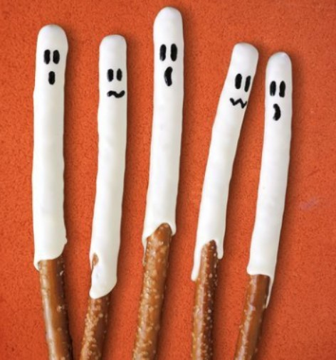

Discover the ultimate fuss-free dessert, our top pick for the easiest sweet treat ever! Picture this: microwave some white candy melts with a touch of coconut oil in quick 20-second bursts until they melt into velvety goodness. 

Next, take your pretzel rods and dip their ends two-thirds of the way into the luscious candy coating, letting any excess drip away before placing them on a baking sheet lined with parchment paper. Now comes the fun part – watch these ghostly delights set into shape. And to give them their spooky personalities, grab a black edible marker and bring your ghost faces to life! 

### **2\. Cookie Jar With Graveyard Theme**

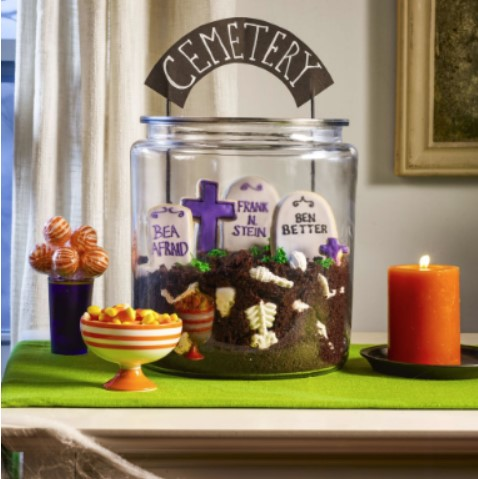

Take a large glass cookie jar and fill it to the brim with mouthwatering chocolate cake crumbs, interspersed with eerie white chocolate bones. But that’s just the beginning of this spine-chilling delight! Use a tombstone cookie cutter to shape sugar cookies into ghostly memorials, and with a touch of artistic flair, decorate them with royal icing for that eerie touch. 

Now, imagine a graveyard scene coming to life on your dessert – with tufts of grass created from vibrant green-tinted buttercream, and, the finishing touch, a DIY cemetery sign crafted from cardstock and painted wood skewers. Every bite will take you on a chilling journey through this ghostly graveyard of delectable delights!

### **3\. Tombstone Chocolate Cookies**

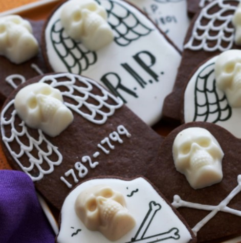

Satisfy your chocolate cravings and embrace the spookiness with these hauntingly delightful treats! Crafted from rich chocolate butter cookie dough and adorned with eerie white chocolate skulls, these treats are sure to bring a wickedly delicious twist to your snacking experience.

Ready to unlock the secrets to making these [Chocolate Tombstone Cookies](https://www.womansday.com/food-recipes/food-drinks/recipes/a11067/chocolate-tombstone-cookies-recipe-122454/)

### **4\. Buggy Leaf Spice Cookies**

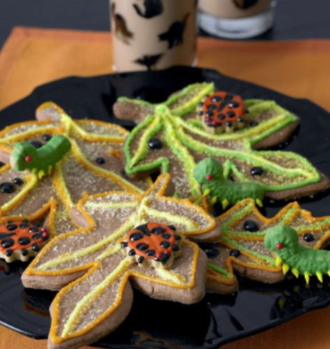

Prepare to be charmed by the adorable and surprisingly cute bugs crawling on your cookies! Made from a delightful blend of apple or pumpkin spice mixed into the sugar cookie dough, these cookies are not only scrumptious but also come with a touch of whimsy that will leave you smiling with every bite.

How to create these enchanting [Buggy Leaf Spice Cookies](https://www.womansday.com/food-recipes/food-drinks/recipes/a9947/buggy-leaf-spice-cookies-121371/)

### **5\. Bats Flying Across the Moon Cookies**

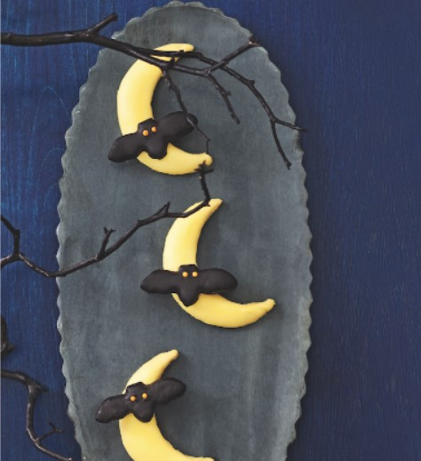

No need to worry about complicated baking sessions! Embrace the magic of [easy creativity](https://avada.io/loveable/blog/easy-draw-halloween/) by cutting out delightful bat and moon shapes from soft chocolate chip cookies. It’s time to let your imagination run wild as you decorate these whimsical treats and turn them into edible masterpieces! So, get ready to add a touch of enchantment to your dessert table with these fun and fuss-free delights!

Check out the [Bats Flying Across the Moon Cookies Recipe](https://www.womansday.com/food-recipes/food-drinks/recipes/a11390/bats-flying-across-the-moon-cookies-recipe-122707/)

### **6\. Monster Heads Marshmallow** 

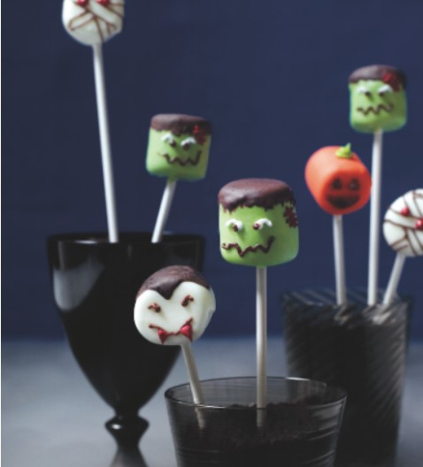

Short on time but craving a spooktacular dessert for your Halloween party? Look no further, as we’ve got the perfect treats that perfectly match the eerie ambiance of your spooky gathering. These desserts are quick to make yet delightfully haunting, ensuring your guests will be enchanted by their ghoulish charm. Get ready to impress with these easy and spooky delights that will leave everyone howling for more!

Check out the [Marshmallow Monster Heads recipe.](https://www.womansday.com/food-recipes/food-drinks/recipes/a11873/marshmallow-heads-recipe-123439/)

### **7\. Fall Theme Cookies**

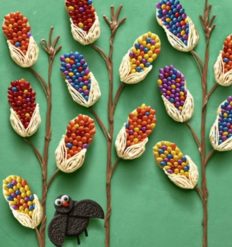

Indulge in the simplicity of creating these adorable cookies! With just a few easy steps, you can turn ordinary Nutter Butter cookies into delightful masterpieces. Begin by generously spreading smooth icing on top of each cookie, and then artfully arrange chocolate-covered sunflower seeds to add a burst of flavor and charm. 

To complete the picture-perfect look, skillfully pipe frosting on the bottoms to create the illusion of cute corn husks. These charming treats are bound to bring smiles to faces of all ages, making them the perfect addition to any sweet gathering!

### **8\. Frankenstein Cupcakes**

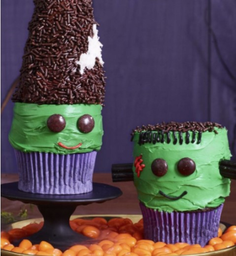

Get ready to unleash your creativity with these monstrously fun Frankenstein and His Bride Cupcakes! Whether you choose to decorate store-bought cupcakes or bake your own, these spooky treats are sure to thrill everyone at your Halloween celebration. With vibrant green frosting, dark and mysterious chocolate sprinkles, and a touch of shredded coconut, you can transform ordinary cupcakes into delightful edible masterpieces. 

Join us on this thrilling culinary adventure and [get the recipe](https://www.womansday.com/food-recipes/food-drinks/a23570068/frankenstein-and-his-bride-cupcakes-recipe/) to create these ghoulishly delicious treats that will bring the spirit of Halloween to life on your dessert table!

### **9\. Peanut Butter Cheesecake**

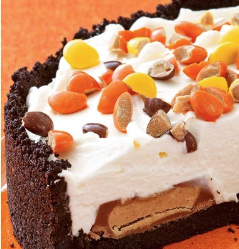

If elaborate decorations aren’t your thing, fear not! Embrace the Halloween spirit with ease by indulging in this no-bake peanut butter cheesecake. Its rich and creamy goodness captures the essence of the season without any of the hassle. So, treat yourself and your guests to this delectable dessert that will leave you enchanted with its delightful flavors. Halloween has never been easier or more delicious!

Check out the [Peanut Butter Cheesecake](https://www.womansday.com/food-recipes/food-drinks/recipes/a12933/no-bake-peanut-butter-cheesecake-recipe-wdy1014/)

### **10\. Banana Mummy Pops**

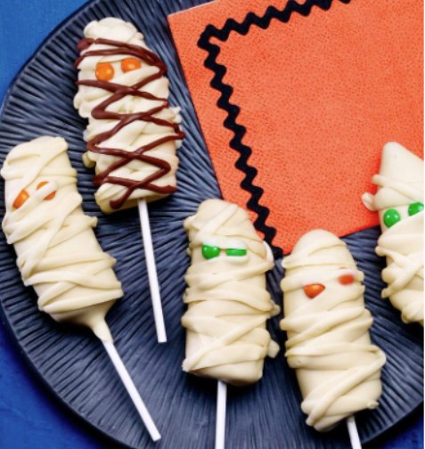

Prepare for a spooktacular hit at your [Halloween party](https://avada.io/loveable/blog/kids-halloween-party/) with these adorable banana mummies! These charming treats are bound to steal the show on your treat table. Plus, here’s a bonus: your kids won’t even realize they’re indulging in a healthy fruit snack! Get ready to amaze your guests with these delightfully spooky and delicious banana mummies that are sure to leave everyone enchanted by their cuteness and taste.

Check out the [Banana Mummy Pops recipe](https://www.womansday.com/food-recipes/food-drinks/recipes/a12930/banana-mummies-recipe-wdy1014/)

### **11\. Spooky Candy Apple** 

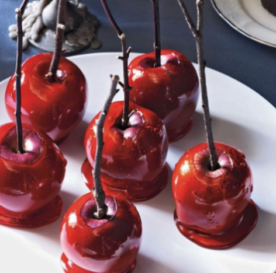

Transform small Red Delicious apples into magical delights by dipping them in a luscious, bright red syrup infused with the fiery flavor of red cinnamon candies. The result? A tantalizing fusion of sweet and spicy that will leave your taste buds under a spell. So, embark on this enchanting culinary journey and conjure up a delightful treat that will bewitch everyone who takes a bite!

Check out the spooky [Candy Apple Recipe](https://www.womansday.com/food-recipes/food-drinks/recipes/a11353/candy-apples-recipe-122751/)

### **12\. Haystack Creatures**

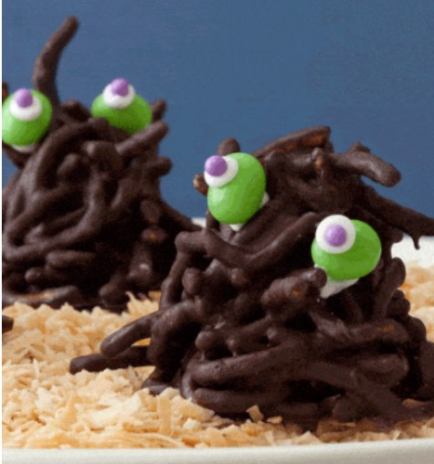

Prepare to embark on an intergalactic adventure with these whimsical and wacky aliens perched on a bed of toasted coconut! These delightful treats are crafted from chow mein noodles coated in melted chocolate, creating a perfect blend of sweet and savory flavors. But that’s not all – their extraterrestrial charm comes to life with eyes made from vibrant green jelly beans and purple sugar dot pupils. Get ready to be mesmerized by these adorable treats that are sure to transport your taste buds to another world of flavor and fun!

Check out the [Haystack Creatures Recipe](https://www.womansday.com/food-recipes/food-drinks/recipes/a11427/haystack-creatures-recipe-122706/)

### **13\. Mixed-Up Monsters Sweets**

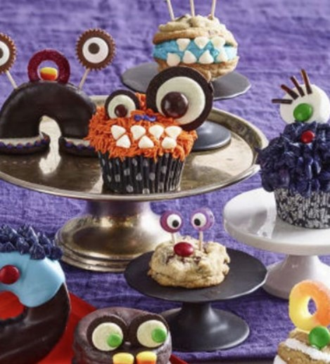

Unleash your creativity and bring these sweet and scary [Halloween food](https://avada.io/loveable/blog/halloween-food-ideas/) to life using ingredients lurking in your pantry! Begin with a cupcake, cookie, or doughnut as your base, and then let your imagination run wild. Go mad with frosting, marshmallows, chocolate chips, Oreos, M&M’s, candy corn, peanut butter cups, gummies, shoestring licorice, and candy eyeballs.

 Assemble your little monsters with toothpicks and tiny dabs of frosting, and watch them come alive before your eyes! Get ready for a spooktacular culinary adventure that will thrill your taste buds and delight your Halloween guests!

### **14\. Delicious Pear-Apricot Pie**

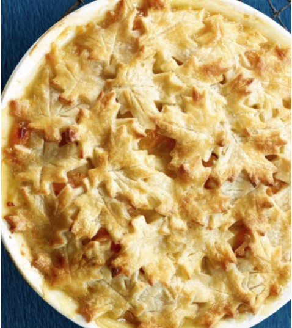

Elevate your Halloween treats with a delightful and fruity pie that might require some extra time in the oven, but trust us, it will be absolutely worth the wait. As the timer dings, prepare to indulge in a heavenly blend of flavors that will cast a magical spell on your taste buds. Get ready for a spooktacular treat that will leave your guests enchanted and craving more!

Check out the tutorial [here](https://www.womansday.com/food-recipes/food-drinks/recipes/a12578/gingery-pear-apricot-pie-recipe-wdy1114/)

### **15\. Spooky Witch Finger Cookies**

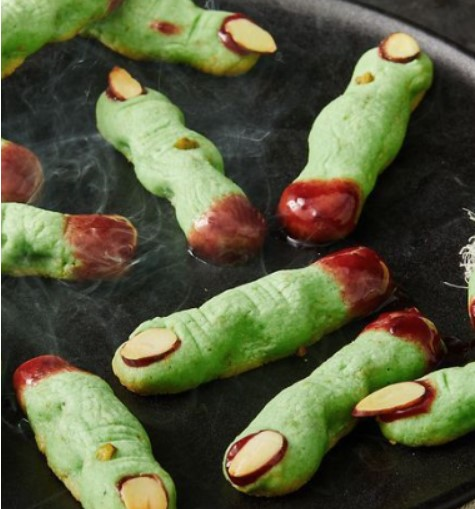

Calling all ghouls, goblins, and witches to the front! Spooky season is upon us, and we’re ready to celebrate in bone-chilling style with these frighteningly delicious witch-finger cookies. Just as the name suggests, these eerie treats are shortbread cookies shaped like severed fingers, complete with almond nails and a touch of blood-red jam. Get ready to be bewitched by these wickedly delightful cookies that will add a hauntingly fun touch to your Halloween festivities!

Check Out The [Witch Finger Cookies Tutorials](https://www.delish.com/cooking/recipe-ideas/a41056672/witch-finger-cookies-recipes/)

## **10 Funny Halloween Dessert Recipes to Enjoy** 

### **1\. Dracula Dentures**

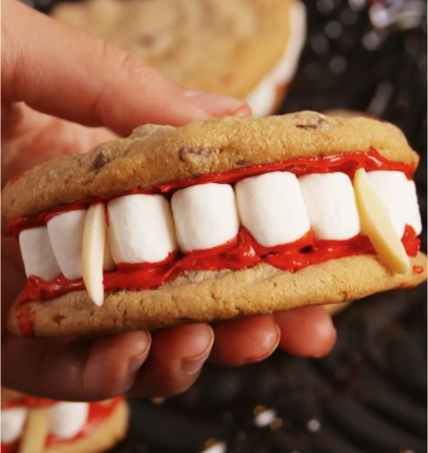

These are the perfect treats to make, and we’ve made things a little easier for you by using store-bought ingredients. The real excitement lies in the assembling process, so we don’t want you to tire out from baking. However, if you’re really craving a homemade chocolate chip cookie, we’ve got that covered too. So, gather your little goblins, and let the fun begin as you create these delightful and spooky treats that will add a dash of magic to your Halloween celebration!

Check out the [Dracula Dentures Recipe](https://www.delish.com/cooking/recipe-ideas/a55668/dracula-dentures-recipe/)

### **2\. Zombie Brain Cupcakes**

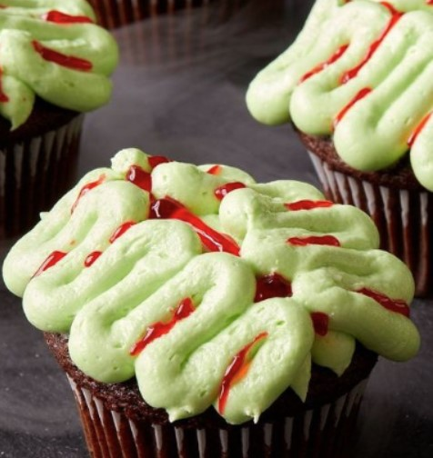

Step up your Halloween bash with a delightfully creepy twist – create zombie brain cupcakes that will leave your guests screaming for more! These moist, chocolatey delights are topped with luscious vanilla frosting, but the real magic lies in the clever piping and neon green food coloring that transform them into ghoulish masterpieces. 

And to add a haunting touch, don’t forget the blood-red decorating gel – we’re taking the spookiness to the next level! Get ready to impress your partygoers with these super-festive and spooky treats that will make your Halloween celebration unforgettable!

Check out The [Zombie Brain Cupcakes Tutorial](https://www.delish.com/cooking/recipe-ideas/a41546860/zombie-brain-cupcakes-recipe/)

### **3\. Jack-O’-Lantern Theme Cookies Sandwich**

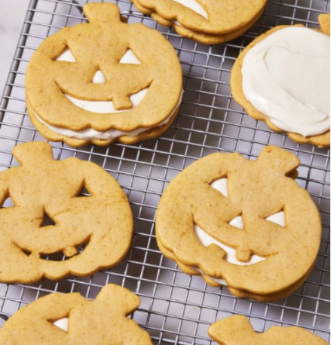

Indulge in the perfect fall dessert with these delightful pumpkin sugar cookies, filled with a luscious cream cheese frosting that will leave your taste buds singing with joy. Take it up a notch for Halloween by carving a Jack-O’-Lantern design into these cookies, creating an adorable treat that everyone will adore. This sweet delight is so much better than carving a real pumpkin, and it’s sure to become a beloved favorite during the festive season. So, get ready to savor the flavors of fall with these scrumptious cookies that are bound to bring smiles to faces of all ages!

Check out [Jack-O’-Lantern Theme Cookies Sandwich Tutorial](https://www.delish.com/cooking/recipe-ideas/a37887818/jack-olantern-sandwich-cookies-recipe/)

### **4\. Cute Marshmallow Brownies**

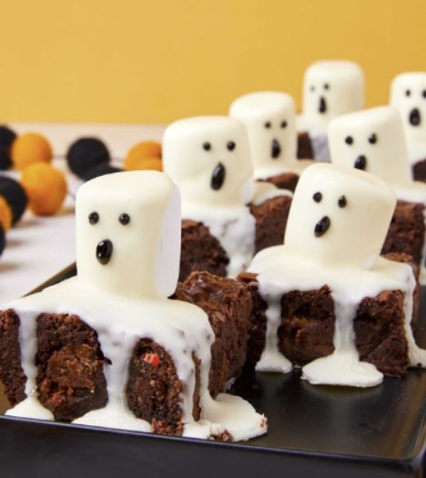

Treat yourself to the ultimate indulgence with these decadent and fudgy brownies that are definitely worth making from scratch. However, we understand that time can be tight, so feel free to use your favorite boxed brownie mix as a quick and easy alternative. No matter which route you choose, you’re in for a delightful chocolatey experience that will satisfy your sweet cravings. So, whether you opt for homemade or boxed, get ready to indulge in the rich goodness of these irresistible brownies!

Check out the [Marshmallow Brownies tutorial](https://www.delish.com/cooking/recipe-ideas/a29132419/ghost-marshmallow-brownies-recipe/) 

### **5\. Magic Black Widow Oreo Pops**

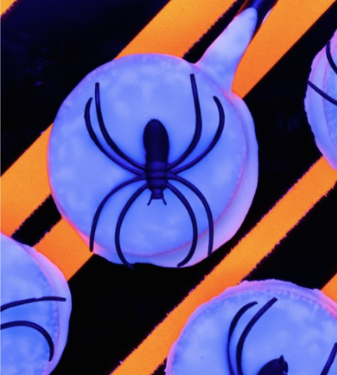

Experience the enchanting glow of white chocolate like never before! Under a black light, it already has a soft radiance, but we’ve taken it up a notch by adding a splash of tonic water to the melted chocolate. The result? An eerie and mesmerizing green glow that will leave you captivated. Get ready to embark on a thrilling culinary adventure with this magical and otherworldly treat that will add a hauntingly fun touch to your Halloween festivities!

Check out the [Glowing Black Widow Oreo Pops recipe.](https://www.delish.com/cooking/recipe-ideas/recipes/a44336/glowing-black-widow-oreo-pops-recipe/)

### **6\. Milk Chocolate Stuffed Cookies**

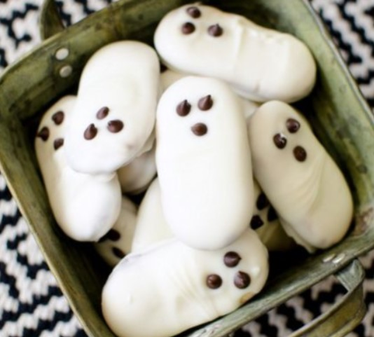

Picture this: two spiced brown sugar cookies hugging a rich milk chocolate filling, dusted with a sprinkle of cinnamon sugar. Absolutely yum! But that’s not all – these cookies are also shaped like Jack-o’-lanterns, giving you that perfect blend of spooky and adorable. A treat for the eyes and the taste buds!

And while they may not have actual pumpkin, fear not! These cookies are infused with the warm flavors of cinnamon, ginger, and nutmeg, making them a delightful autumn indulgence.

Check out [The Milk Chocolate Stuffed Cookies](https://butterwithasideofbread.com/easy-ghost-halloween-cookies/) tutorial 

### **7\. Mummy Cookies** 

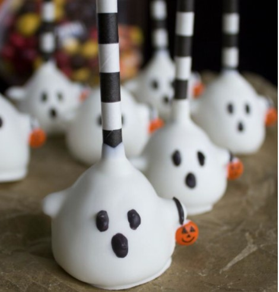

Prepare to be bewitched by these sweet and buttery sugar cookies dressed up as adorable mummies! This Halloween dessert is simply irresistible! The best part? They’re incredibly quick and easy to make. With just six basic ingredients, the sugar cookies come together effortlessly. And frosting them? A piece of cake! No piping skills are required to achieve this spooktacular look.

Get ready to delight your guests with these delightful treats that are both charming and delicious. A Halloween favorite that will have everyone coming back for more!

Check out the [Mummy Cookies tutorial](http://thecraftingfoodie.com/ghost-cakepops/)

### **8\. Monster Eyeball Cookie Pops**

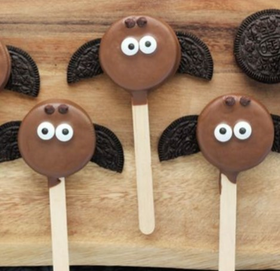

These adorable treats strike the perfect balance between cute and creepy, capturing everyone’s attention with their eye-catching charm. With your favorite chocolate chip cookie recipe and a bunch of candy eyeballs, you can effortlessly whip up these eye-popping delights. And for a genius touch, pair them with an eyeglass (get it?) of chocolate milk – just stick on printed eyeballs to any glass, and you’ve got a fun and creative presentation! Get ready to be mesmerized by these deliciously haunting treats that will make your Halloween party a hit!

Check out the  [Monster Eyeball Cookie Pop tutorial](https://onesweetappetite.com/easy-bat-oreos/) 

### **9\. Creepy Halloween Cookie Cake** 

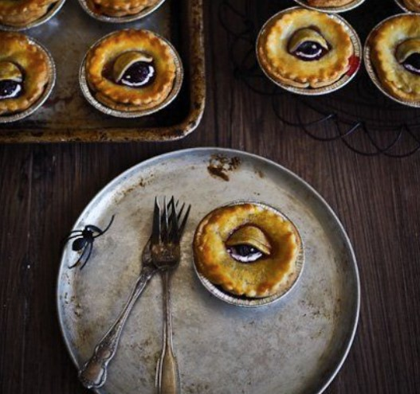

This mouthwatering cookie cake is a giant chocolate chip cookie, generously adorned with orange-tinted vanilla frosting, Reese’s Peanut Pieces, and Rolos, and lavishly drizzled with chocolate syrup. It’s a dessert that dreams are made of!

Indulge in its sweet, chewy, and irresistibly chocolatey goodness. The addition of Reese’s Peanut Pieces provides a delightful contrast of sweetness, saltiness, and peanut buttery goodness, all while giving it that perfect Halloween touch! Get ready to be enchanted by this scrumptious creation that will steal the spotlight at your Halloween celebration!

Check out the [Creepy Halloween Cookie Cake Tutorial](http://www.notquitenigella.com/2017/10/13/scary-halloween-pies/)

### **10\. Poisonous Apple** 

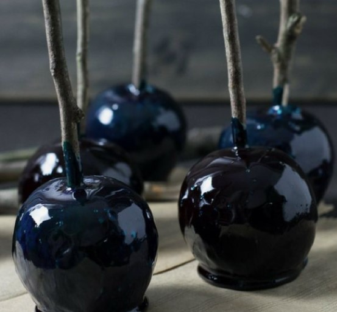

While caramel apples are a breeze to make, these Poison Apples take the treat to a whole new level! Prepare for an exciting twist as you venture into making a bewitching black candy coating, which requires boiling sugar syrup. Don’t worry; it’s not as complicated as it sounds, I promise! All you need is a candy thermometer, and you’ll be amazed at the results. So, give it a try, and you’ll discover the magic of creating these enchanting Poison Apples that are sure to cast a spell on your taste buds!

Check out the [Poisonous Apple](https://travelcooktell.com/halloween-recipe-poison-apples/)

_**Related:**_

- Best [Halloween Food Ideas](https://avada.io/loveable/halloween-food-ideas/)

- Spooktacular [Halloween Potluck Ideas](https://avada.io/loveable/halloween-potluck-ideas/)

## **Bottom Line.** 

These 25 Delicious **Halloween Dessert Recipes** promise an enchanting culinary journey that is sure to thrill and delight. From hauntingly cute mummy cookies to bewitching zombie brain cupcakes, this collection offers a delightful range of treats that perfectly capture the spirit of Halloween. Whether you’re hosting a spooky party or simply looking to indulge in some frightfully delicious delights, these recipes are a must-try. So, don your apron and get ready to create magical and mouthwatering Halloween treats that will leave everyone under a sweet and spooky spell!

- [15 Creative Halloween Dessert Recipes To Serve at Any Party (With Tutorials)](https://avada.io/loveable/blog/halloween-dessert-recipes/#wp-block-heading-2-5)
    - [1\. Ghost Pretzels With Chocolate Dipped](https://avada.io/loveable/blog/halloween-dessert-recipes/#wp-block-heading-3-6) 
    - [2\. Cookie Jar With Graveyard Theme](https://avada.io/loveable/blog/halloween-dessert-recipes/#wp-block-heading-3-10)
    - [3\. Tombstone Chocolate Cookies](https://avada.io/loveable/blog/halloween-dessert-recipes/#wp-block-heading-3-14)
    - [4\. Buggy Leaf Spice Cookies](https://avada.io/loveable/blog/halloween-dessert-recipes/#wp-block-heading-3-18)
    - [5\. Bats Flying Across the Moon Cookies](https://avada.io/loveable/blog/halloween-dessert-recipes/#wp-block-heading-3-22)
    - [6\. Monster Heads Marshmallow](https://avada.io/loveable/blog/halloween-dessert-recipes/#wp-block-heading-3-26) 
    - [7\. Fall Theme Cookies](https://avada.io/loveable/blog/halloween-dessert-recipes/#wp-block-heading-3-30)
    - [8\. Frankenstein Cupcakes](https://avada.io/loveable/blog/halloween-dessert-recipes/#wp-block-heading-3-34)
    - [9\. Peanut Butter Cheesecake](https://avada.io/loveable/blog/halloween-dessert-recipes/#wp-block-heading-3-38)
    - [10\. Banana Mummy Pops](https://avada.io/loveable/blog/halloween-dessert-recipes/#wp-block-heading-3-42)
    - [11\. Spooky Candy Apple](https://avada.io/loveable/blog/halloween-dessert-recipes/#wp-block-heading-3-46) 
    - [12\. Haystack Creatures](https://avada.io/loveable/blog/halloween-dessert-recipes/#wp-block-heading-3-50)
    - [13\. Mixed-Up Monsters Sweets](https://avada.io/loveable/blog/halloween-dessert-recipes/#wp-block-heading-3-54)
    - [14\. Delicious Pear-Apricot Pie](https://avada.io/loveable/blog/halloween-dessert-recipes/#wp-block-heading-3-58)
    - [15\. Spooky Witch Finger Cookies](https://avada.io/loveable/blog/halloween-dessert-recipes/#wp-block-heading-3-62)
- [10 Funny Halloween Dessert Recipes to Enjoy](https://avada.io/loveable/blog/halloween-dessert-recipes/#wp-block-heading-2-66) 
    - [1\. Dracula Dentures](https://avada.io/loveable/blog/halloween-dessert-recipes/#wp-block-heading-3-67)
    - [2\. Zombie Brain Cupcakes](https://avada.io/loveable/blog/halloween-dessert-recipes/#wp-block-heading-3-71)
    - [3\. Jack-O’-Lantern Theme Cookies Sandwich](https://avada.io/loveable/blog/halloween-dessert-recipes/#wp-block-heading-3-76)
    - [4\. Cute Marshmallow Brownies](https://avada.io/loveable/blog/halloween-dessert-recipes/#wp-block-heading-3-80)
    - [5\. Magic Black Widow Oreo Pops](https://avada.io/loveable/blog/halloween-dessert-recipes/#wp-block-heading-3-84)
    - [6\. Milk Chocolate Stuffed Cookies](https://avada.io/loveable/blog/halloween-dessert-recipes/#wp-block-heading-3-88)
    - [7\. Mummy Cookies](https://avada.io/loveable/blog/halloween-dessert-recipes/#wp-block-heading-3-93) 
    - [8\. Monster Eyeball Cookie Pops](https://avada.io/loveable/blog/halloween-dessert-recipes/#wp-block-heading-3-98)
    - [9\. Creepy Halloween Cookie Cake](https://avada.io/loveable/blog/halloween-dessert-recipes/#wp-block-heading-3-102) 
    - [10\. Poisonous Apple](https://avada.io/loveable/blog/halloween-dessert-recipes/#wp-block-heading-3-107) 
- [Bottom Line.](https://avada.io/loveable/blog/halloween-dessert-recipes/#wp-block-heading-2-114) 

### [Blake Simpson](https://avada.io/loveable/author/blake/)

Hi, I'm Blake from Loveable. I help people find perfect gifts for occasions like anniversaries and weddings. I also write a blog about holidays, sharing insights to make them more meaningful. Let's create unforgettable moments together!

- [Twitter](https://twitter.com/intent/tweet)
- [Facebook](https://www.facebook.com/sharer/sharer.php)
- [instagram](https://avada.io/loveable/blog/halloween-dessert-recipes/)
- [pinterest](https://www.pinterest.com/loveablellc/)

## Related Posts

[### 120+ Christian Birthday Wishes To Spread Your Love](https://avada.io/loveable/blog/christian-birthday-wishes/) 

[

### 35 Best 70th Birthday Ideas To Celebrate The Special Milestone

](https://avada.io/loveable/blog/70th-birthday-ideas/)

[

### 50 Best 30th Birthday Decorations for a Remarkable Birthday Bash

](https://avada.io/loveable/blog/30th-birthday-decorations/)

[

### 40 Delicious Vegan Christmas Desserts to Delight Your Palate

](https://avada.io/loveable/blog/vegan-christmas-desserts/)

[

### 60 Christmas Team Building Activities to Boost Workplace Spirit

](https://avada.io/loveable/blog/christmas-team-building-activities/)
