This article has been written and researched by our expert Loveable through a precise methodology. [Learn more about our methodology](https://avada.io/loveable/our-methodological.html)

[Loveable](https://avada.io/loveable/) > [Blog](https://avada.io/loveable/blog/) > [Holiday](https://avada.io/loveable/holiday/)

# 25+ Denver Christmas Activities to Ignite Your Holiday Spirit

Written by [Blake Simpson](https://avada.io/loveable/author/blake/) Last Updated on September 27, 2023

- [25+ Best Denver Christmas Activities You Must Try](https://avada.io/loveable/blog/denver-christmas-activities/#wp-block-heading-2-3) 
    - [1\. Enjoy Stunning Candlelit Concerts](https://avada.io/loveable/blog/denver-christmas-activities/#wp-block-heading-3-4)
    - [2\. Go on a Wintry Road Trip](https://avada.io/loveable/blog/denver-christmas-activities/#wp-block-heading-3-8)
    - [3\. Sip & Shop Holiday Market](https://avada.io/loveable/blog/denver-christmas-activities/#wp-block-heading-3-12)
    - [4\. Take A Right on Larimer Square](https://avada.io/loveable/blog/denver-christmas-activities/#wp-block-heading-3-15)
    - [5\. Walk Through the Denver Zoo Lights](https://avada.io/loveable/blog/denver-christmas-activities/#wp-block-heading-3-18)
    - [6\. Miracle Pop-Up Bar](https://avada.io/loveable/blog/denver-christmas-activities/#wp-block-heading-3-22)
    - [7\. The Butterfly Pavilion](https://avada.io/loveable/blog/denver-christmas-activities/#wp-block-heading-3-25)
    - [8\. Skate on the ice at Skyline Park](https://avada.io/loveable/blog/denver-christmas-activities/#wp-block-heading-3-28)
    - [9.  Visit Pueblo Zoo to Gaze](https://avada.io/loveable/blog/denver-christmas-activities/#wp-block-heading-3-32)
    - [10\. Walk through the Luminova Holiday Lights](https://avada.io/loveable/blog/denver-christmas-activities/#wp-block-heading-3-36)
    - [11\. Watch a Muppet Christmas Carol](https://avada.io/loveable/blog/denver-christmas-activities/#wp-block-heading-3-40)
    - [12\. Explore the Delights of the Christkindlmarket](https://avada.io/loveable/blog/denver-christmas-activities/#wp-block-heading-3-44)
    - [13\. Experience the Blossoms of Light](https://avada.io/loveable/blog/denver-christmas-activities/#wp-block-heading-3-48)
    - [14\. Meet Santa on the Polar Express Train Ride](https://avada.io/loveable/blog/denver-christmas-activities/#wp-block-heading-3-53)
    - [15\. Witness the Holiday Lights](https://avada.io/loveable/blog/denver-christmas-activities/#wp-block-heading-3-57)
    - [16\. Enjoy a Ride on the Denver Pavilions Holiday Carousel](https://avada.io/loveable/blog/denver-christmas-activities/#wp-block-heading-3-61)
    - [17\. Explore the Cherry Creek North Winter Wanderland](https://avada.io/loveable/blog/denver-christmas-activities/#wp-block-heading-3-65)
    - [18\. Experience the Mile High Tree Light Show](https://avada.io/loveable/blog/denver-christmas-activities/#wp-block-heading-3-69)
    - [19\. Enjoy Colorado Symphony Orchestra](https://avada.io/loveable/blog/denver-christmas-activities/#wp-block-heading-3-73)
    - [20\. Attend the Colorado Ballet](https://avada.io/loveable/blog/denver-christmas-activities/#wp-block-heading-3-77)
    - [21\. Light the World Giving Machines](https://avada.io/loveable/blog/denver-christmas-activities/#wp-block-heading-3-80)
    - [22\. Take Photos with Santa](https://avada.io/loveable/blog/denver-christmas-activities/#wp-block-heading-3-84) 
    - [23\. Discover Denver’s Latest Culinary Delights](https://avada.io/loveable/blog/denver-christmas-activities/#wp-block-heading-3-88)
    - [24\. Join the Ugly Sweater Karaoke Bash](https://avada.io/loveable/blog/denver-christmas-activities/#wp-block-heading-3-91)
    - [25\. Explore Downtown Denver’s Breweries on a Hoppy Adventure](https://avada.io/loveable/blog/denver-christmas-activities/#wp-block-heading-3-94)
    - [26\. Attend Festive Volunteer Day](https://avada.io/loveable/blog/denver-christmas-activities/#wp-block-heading-3-98)
- [Bottom Line](https://avada.io/loveable/blog/denver-christmas-activities/#wp-block-heading-2-101)

Whenever the Christmas season is approaching, Denver transforms into a winter wonderland. **Denver Christmas activities** are a delightful mix of tradition and innovation. 

You can watch the twinkling lights adorning the historic Larimer Square or do ice skating amidst urban splendor. More and more activities that are waiting below are suggestions you should try once when coming to Denver. Explore the myriad of festive offerings that make Christmas in Denver magical!

## **25+ Best Denver Christmas Activities You Must Try** 

### **1\. Enjoy Stunning Candlelit Concerts**

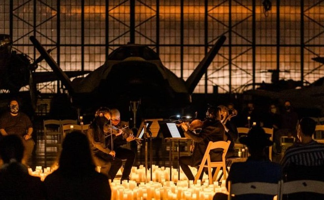

Here, the atmosphere comes alive with the melodies of the most celebrated classical composers worldwide. These captivating musical pieces are brought to life by talented musicians, comprising a string quartet. This experience is exactly what you can anticipate when you partake in the Candlelight series, one of the finest Denver Christmas activities, promising an evening of musical delight like no other.

See more at [Fever Up](https://feverup.com/en/denver/candlelight?utm_content=holiday-things-to-do-denver&utm_source=secretdenver&utm_medium=post&utm_term=cta1)

### **2\. Go on a Wintry Road Trip**

Get ready for this year’s Christmas activity by embarking on a journey to a delightful, snow-covered mountain town. Crested Butte eagerly anticipates your visit with your family to explore their ski slopes, wander through their town centers, and relish a wonderfully snug stay.

See more at [Crested Butte](https://www.visitcrestedbutte.com/)

### **3\. Sip & Shop Holiday Market**

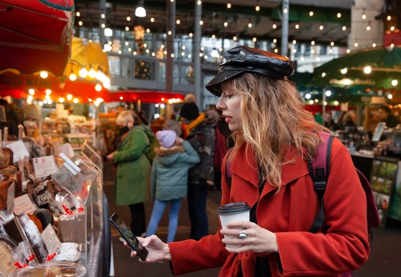

This market area offers charming lanes filled with enchanting handmade crafts and festive treats from local and global businesses. This is a great idea for Denver Christmas activities, right? You can also visit Cherry Creek for their yearly holiday market, where you’ll find mesmerizing light displays and a changing selection of small-scale vendors.

### **4\. Take A Right on Larimer Square**

In the heart of Larimer Square in Denver, you’ll find a majestic Christmas tree adorned with sparkling lights and surrounded by a sea of joyful holiday decorations. It’s a wonderful time for you to take a moment to marvel at its beauty and snap some memorable photos with your loved ones. Please add it to your list of Denver Christmas activities!

### **5\. Walk Through the Denver Zoo Lights**

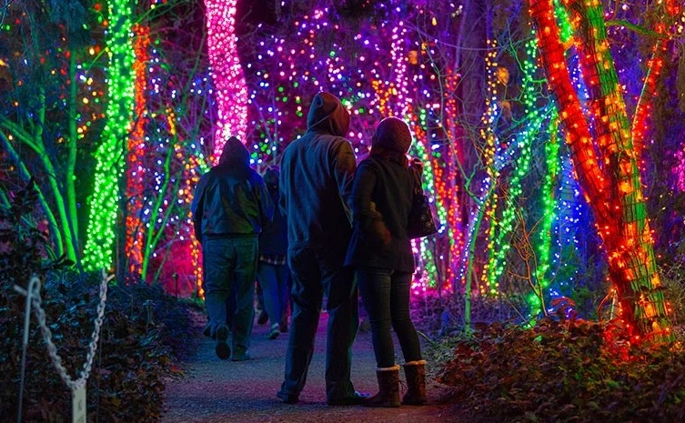

Denver Zoo Lights is a popular holiday tradition with 2 million LED lights spread across 80 acres. It’s known for its wildness and outdoor animal viewing but is limited to cold-weather animals like Bactrian camel, Amur tiger, and Przewalski’s horse. This is definitely a Christmas activity that will get your kids excited.

See more at [Denver Zoo](https://denverzoo.org/events/zoolights/)

### **6\. Miracle Pop-Up Bar**

If you’re in the mood for some holiday cheer in liquid form, make your way to the Miracle Bar! This charming bar magically appears in Denver every Christmas season, offering many Christmas and Hanukkah-themed beverages, including the snowball old-fashioned. What are you waiting for? Invite your friends or loved ones to experience this exciting activity together.

### **7\. The Butterfly Pavilion**

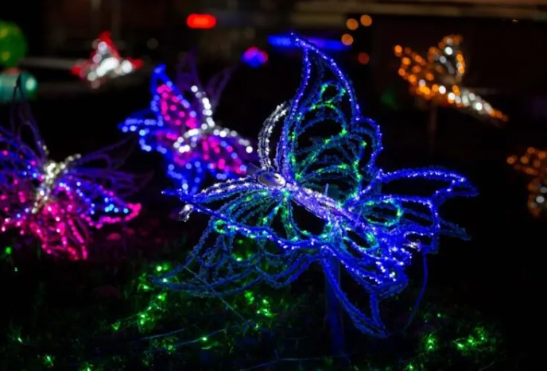

Visit the Butterfly Pavilion’s “Living Lights” event, held annually from December to January, featuring colorful rainbow-colored insects and UV-lit scorpions. The event includes a kids’ dance party, aerial performances, and many insect exhibits, making it a must-see Christmas activity in Denver for a family bond.

### **8\. Skate on the ice at Skyline Park**

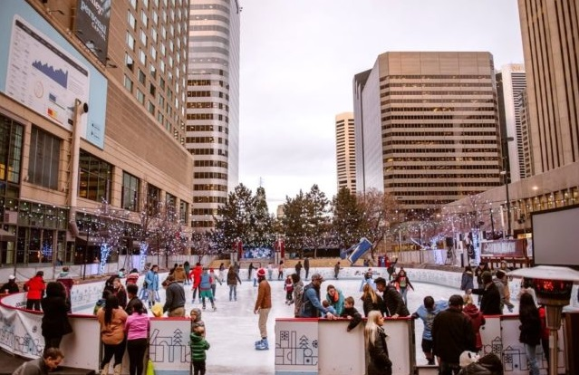

Skate gracefully with friends, family, or someone special as you glide across the ice gracefully and easily. Show off your skills, perform stunning spins, or simply relish the feeling of freedom as you effortlessly traverse the pristine ice this Christmas. Whether you’re a beginner or a seasoned skater, the rink at Skyline Park provides a welcoming space for you to enjoy the excitement of ice skating.

See more at [Winter in Denver](https://www.winterindenver.com/rink)

### **9.  Visit Pueblo Zoo to Gaze**

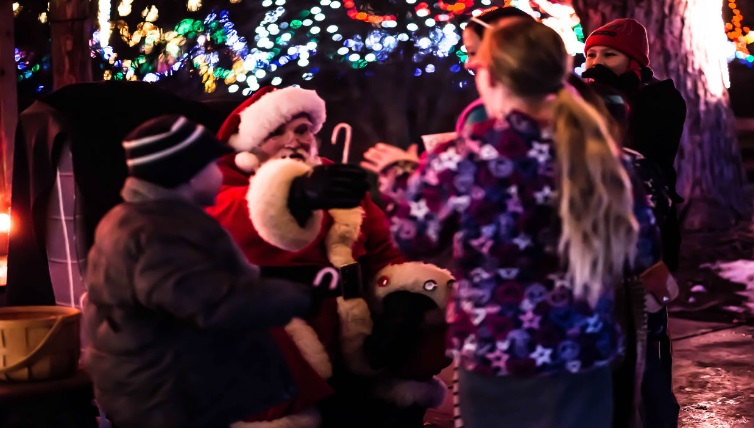

In Denver, you can meander through the exhibition area, showcasing sculptural light installations inspired by different animals and insects, amounting to an impressive display of over 250,000 glittering lights. Moreover, during the event at the Pueblo Zoo space, you’ll find a Christmas-themed café where you can indulge in snacks or savor a warm cup of cocoa.

Read more at [The Pueblo Chieftain](https://www.chieftain.com/story/news/2017/12/19/light-show-electricritters-through-dec/9368959007/)

### **10\. Walk through the Luminova Holiday Lights**

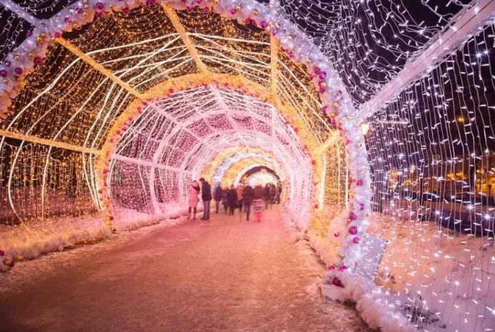

The Luminova Holidays event, held annually at Elitch Gardens, is a 200,000-square-foot Denver Christmas-themed event. It features festive light displays, amusements, and festive activities. Visitors can see snowmen, candy-cane tunnels, and Santa, and enjoy treats. Bring your loved ones to experience these precious moments together!

Read more at [Luminova Holidays](https://www.luminovaholidays.com/)

### **11\. Watch a Muppet Christmas Carol**

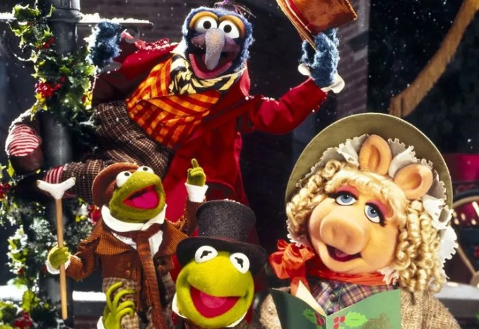

Watching “The Muppet Christmas Carol” in Denver is not just entertaining; it is a timeless tradition that brings families and friends closer during the most magical time of the year. So, don’t miss out on this cherished Denver Christmas experience, and create cherished memories that will warm your heart long after the final credits roll.

Read more at [Liverpool Echo](https://www.liverpoolecho.co.uk/whats-on/family-kids-news/watch-disneys-muppet-christmas-carol-20276824)

### **12\. Explore the Delights of the Christkindlmarket**

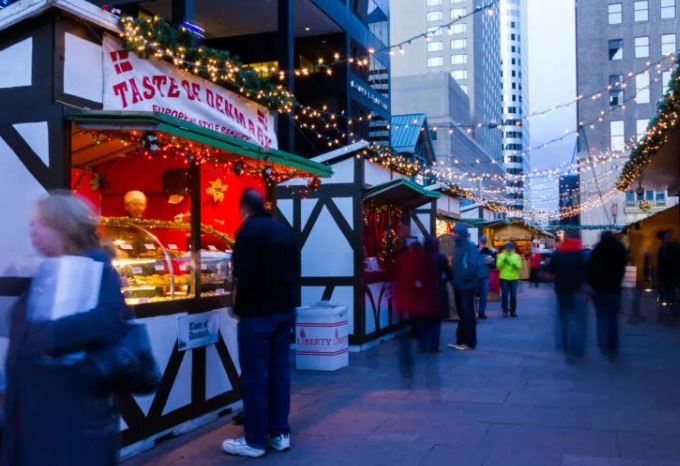

Whether you’re seeking holiday shopping, culinary delights, or a joyful and festive atmosphere, the Christkindlmarket in Denver provides an unforgettable experience for all visitors. This market provides a festive atmosphere with carousel rides, Santa Claus encounters, live music, and cultural performances, ensuring visitors a fun and enjoyable experience.

See more at [Christkindlmarket Denver](https://www.christkindlmarketdenver.com/)

### **13\. Experience the Blossoms of Light**

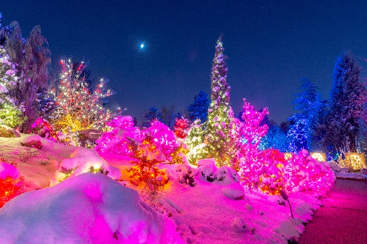

During the annual Blossoms of Light event, you can witness the enchanting metamorphosis of the Denver Botanic Gardens as they adorn with over half a million vibrant light installations, draping the trees and pathways in a mesmerizing glow.

The snowy backdrop, which Denver frequently enjoys, enhances the spectacle, turning the surroundings into a captivating winter wonderland!

See more at [Denver Botanic Garden](https://www.botanicgardens.org/blog/not-so-secret-secrets-blossoms-light)

### **14\. Meet Santa on the Polar Express Train Ride**

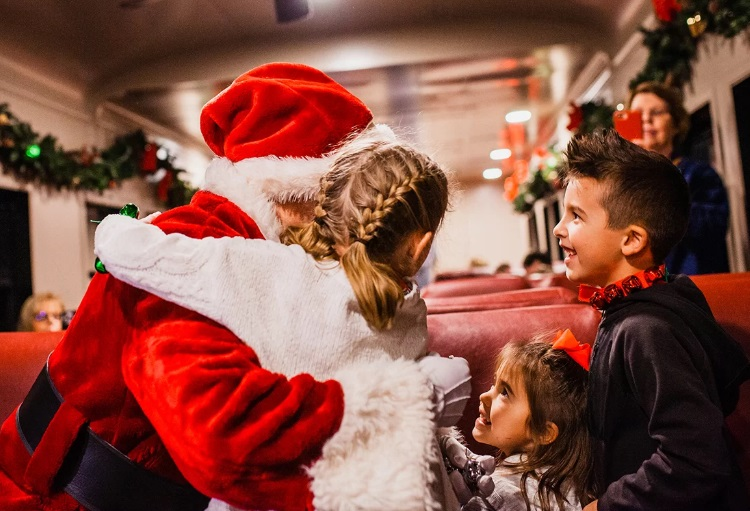

The Polar Express Train Ride at the Colorado Railroad Museum offers a unique and delightful experience for children and adults. Participants travel to the North Pole aboard a 19th-century steam train with entertaining elf performances. This top Denver Christmas activity includes meeting Santa and enjoying hot cocoa and cookies. 

Read more at [Colorado Railroad Museum](https://coloradorailroadmuseum.org/polar-express/)

### **15\. Witness the Holiday Lights**

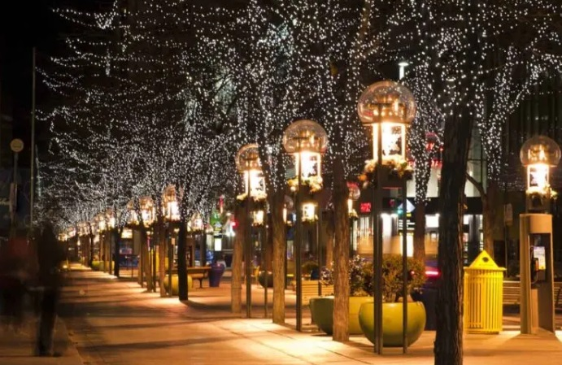

Thanks to a dusting of snow and a generous dose of Christmas spirit, Adventure Golf and Raceway undergoes a magical transformation every holiday season. Here, you can marvel at the three themed mini-golf courses, which come alive with thousands of rainbow lights. 

Gather your loved ones, bundle up in cozy attire, and immerse yourself in the magical glow of Denver’s Christmas lights – a delightful holiday activity that will leave you with a sense of wonder and festive cheer!

### **16\. Enjoy a Ride on the Denver Pavilions Holiday Carousel**

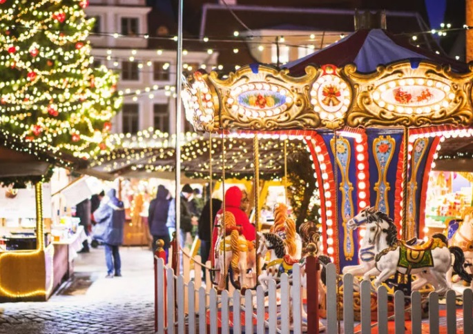

This lovely carousel ride features charming antique-style horses adorned with radiant lighted garlands, making it an ideal spot to capture delightful selfies! You can find this carousel in Denver at 500 16th Street, nestled amidst shops and boutiques along the 16th Street Mall. 

These stores offer a plethora of Christmas-themed souvenirs and gifts for you to explore. When you plan your visit, make sure to bundle up warmly and bring along your cheerful Christmas spirit!

### **17\. Explore the Cherry Creek North Winter Wanderland**

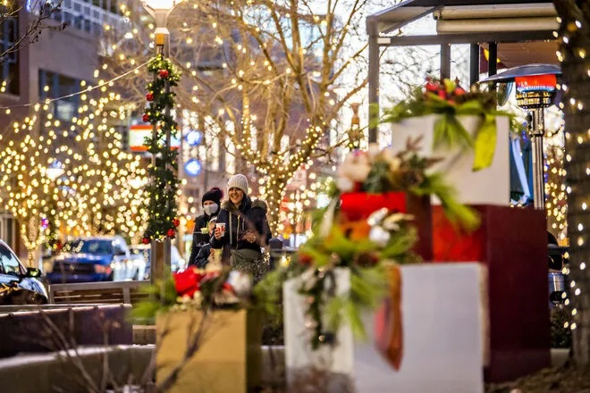

For a guaranteed photo-worthy moment, go to The Cherry Creek North Winter Wanderland. Here, you can stroll through a mesmerizing Wanderland adorned with nearly a million glistening lights, illuminating over 600 trees and spanning 16 city blocks! Furthermore, you’ll be treated to 8 enchanting light displays synchronized to holiday tunes.

Whether you’re searching for unique gifts, a picturesque backdrop for family photos, or simply soaking up the festive atmosphere, this Denver Christmas activity is a must-visit destination.

### **18\. Experience the Mile High Tree Light Show**

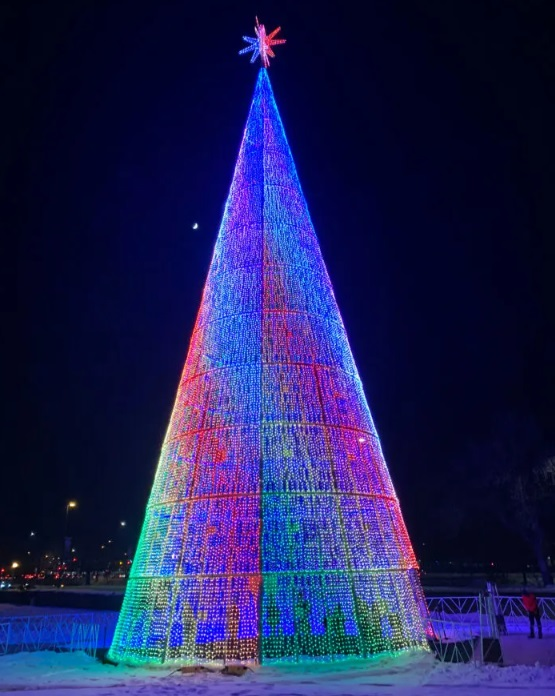

The Mile High Tree Light Show, held every December, is a unique Christmas attraction in Denver. Standing 110 feet tall, the tree showcases vibrant light displays and is a must-visit for the holiday season. Visitors can step inside the tree to witness the captivating spectacle firsthand. This 15-minute show is a beloved Christmas attraction in Denver.

Read more at [Denver](https://www.denver.org/milehighholidays/tree/)

### **19\. Enjoy Colorado Symphony Orchestra**

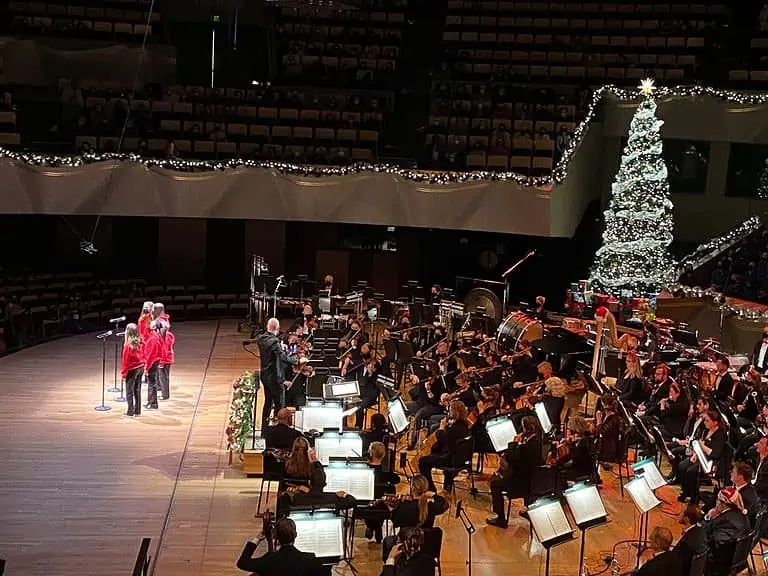

As you indulge in the beautiful tunes of the Colorado Symphony Orchestra, you will be swept away by the sheer grandeur and precision of their music. Each performance is a curated masterpiece led by esteemed conductors, showcasing the orchestra’s exceptional range and versatility.

This delightful activity offers an excellent opportunity to bond with loved ones while reveling in the holiday spirit. Bring your family and friends and let the Colorado Symphony Orchestra serenade you into the Christmas cheer!

### **20\. Attend the Colorado Ballet**

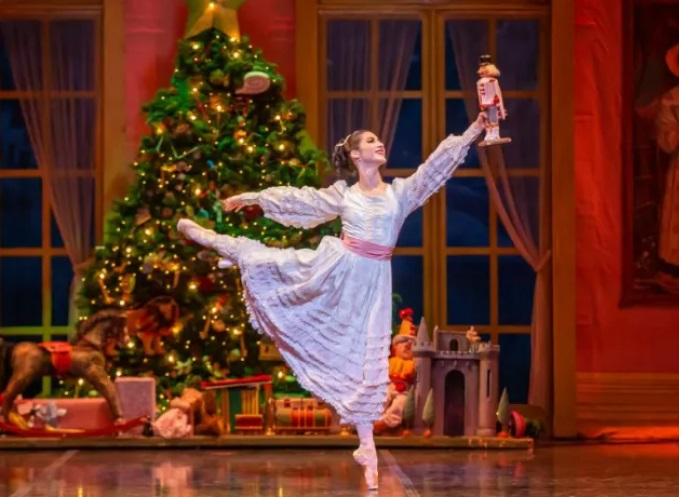

Establish a cherished Christmas tradition at the Denver Center for the Performing Arts, where you can relish concerts, ballets, plays, and captivating performances. This performance will become some of your most treasured Denver Christmas activities, ones you’ll eagerly anticipate and enjoy year after year.

### **21\. Light the World Giving Machines**

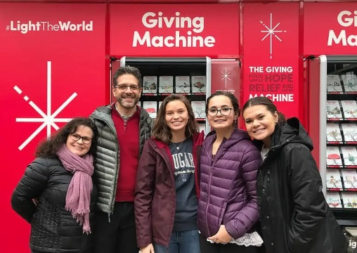

These Giving Machines are strategically placed in high-traffic areas such as shopping centers, airports, or cultural hubs, attracting the attention of passersby, families, and tourists alike. Each machine displays different chosen items or services that can be purchased, representing urgent assistance needed by individuals and communities worldwide. This Christmas, let’s make something meaningful!

Read more at [Giving Machines Denver](https://givingmachinesdenver.org/)

### **22\. Take Photos with Santa** 

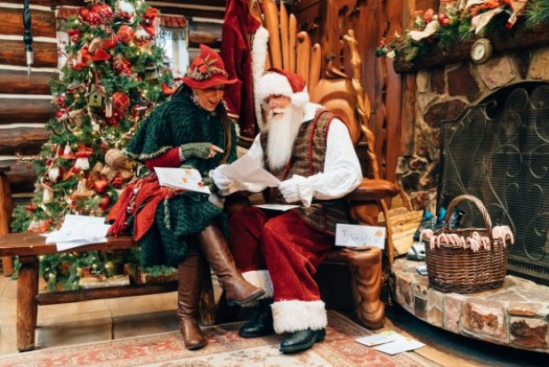

Located in the heart of the Orchard Town Center, the Santa’s Village is a beautifully decorated winter wonderland, guaranteed to transport you and your family into the holiday spirit this Christmas. Step inside and be greeted by Santa Claus, who will welcome you with his warm smile and hearty laughter.

Read more at [Skypark at Santa’s Village](https://skyparksantasvillage.com/santas-village-2021/)

### **23\. Discover Denver’s Latest Culinary Delights**

Explore newly opened restaurants from the past year, each offering innovative concepts and a wide array of flavors to satisfy every taste bud. You can choose a single restaurant to savor or opt for an exciting food tour, visiting several eateries in the same neighborhood, much like a brewery tour. It’s a delectable journey through Denver’s dining scene that promises to be a gastronomic delight!

### **24\. Join the Ugly Sweater Karaoke Bash**

Denver offers various karaoke bars, including Muse Karaoke Bar, Family Karaoke, and Punch Bowl Social, where participants can showcase their vocal talents. This event space can be transformed into a karaoke haven, with a holiday classics and hits playlist. Prizes for the best sweater and performance will hype up a lively party atmosphere!

### **25\. Explore Downtown Denver’s Breweries on a Hoppy Adventure**

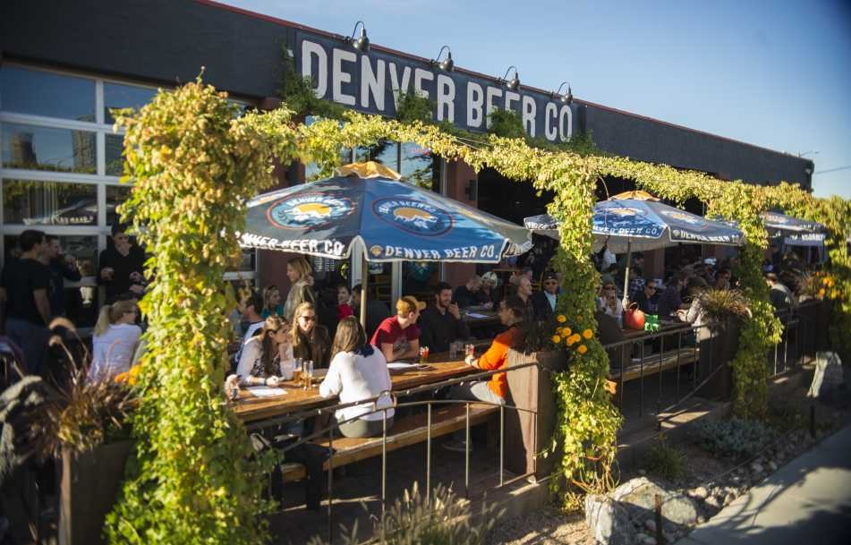

The brewery hop starts by equipping participants with a map and guidebook, containing detailed information about some of Denver’s finest breweries and their signature beers. Participants can plan their own route, deciding which breweries they would like to visit and in what order. So what you need to do is don your favorite ugly Christmas sweater, gather your friends and loved ones, and immerse yourself in the holiday spirit!

Read more at [Denver](https://www.denver.org/things-to-do/tours/brewery-tours/)

### **26\. Attend Festive Volunteer Day**

By collaborating with regional nonprofits like the Food Bank of the Rockies or the Denver Rescue Mission, you can plan a fun volunteer day for your organization throughout Christmas. The community will benefit from this day of service, which will include feeding the hungry, and team relationships will be strengthened.

## **Bottom Line**

To wrap up, **Denver’s Christmas activities** offer a diverse and captivating bunch of experiences that will fill your holiday season with joy and wonder. From the twinkling lights of The Butterfly Pavilion to the festive atmosphere of the Christkindl Market, we invite you to enjoy the magic of the season in this sparkling place – Denver.

Let’s gather your loved ones, bundle up in cozy winter attire, and embark on a memorable journey through the enchanting world of Denver’s Christmas festivities. Make this holiday season one to remember by immersing yourself in the rich tapestry of traditions and celebrations that Denver offers.

- [25+ Best Denver Christmas Activities You Must Try](https://avada.io/loveable/blog/denver-christmas-activities/#wp-block-heading-2-3) 
    - [1\. Enjoy Stunning Candlelit Concerts](https://avada.io/loveable/blog/denver-christmas-activities/#wp-block-heading-3-4)
    - [2\. Go on a Wintry Road Trip](https://avada.io/loveable/blog/denver-christmas-activities/#wp-block-heading-3-8)
    - [3\. Sip & Shop Holiday Market](https://avada.io/loveable/blog/denver-christmas-activities/#wp-block-heading-3-12)
    - [4\. Take A Right on Larimer Square](https://avada.io/loveable/blog/denver-christmas-activities/#wp-block-heading-3-15)
    - [5\. Walk Through the Denver Zoo Lights](https://avada.io/loveable/blog/denver-christmas-activities/#wp-block-heading-3-18)
    - [6\. Miracle Pop-Up Bar](https://avada.io/loveable/blog/denver-christmas-activities/#wp-block-heading-3-22)
    - [7\. The Butterfly Pavilion](https://avada.io/loveable/blog/denver-christmas-activities/#wp-block-heading-3-25)
    - [8\. Skate on the ice at Skyline Park](https://avada.io/loveable/blog/denver-christmas-activities/#wp-block-heading-3-28)
    - [9.  Visit Pueblo Zoo to Gaze](https://avada.io/loveable/blog/denver-christmas-activities/#wp-block-heading-3-32)
    - [10\. Walk through the Luminova Holiday Lights](https://avada.io/loveable/blog/denver-christmas-activities/#wp-block-heading-3-36)
    - [11\. Watch a Muppet Christmas Carol](https://avada.io/loveable/blog/denver-christmas-activities/#wp-block-heading-3-40)
    - [12\. Explore the Delights of the Christkindlmarket](https://avada.io/loveable/blog/denver-christmas-activities/#wp-block-heading-3-44)
    - [13\. Experience the Blossoms of Light](https://avada.io/loveable/blog/denver-christmas-activities/#wp-block-heading-3-48)
    - [14\. Meet Santa on the Polar Express Train Ride](https://avada.io/loveable/blog/denver-christmas-activities/#wp-block-heading-3-53)
    - [15\. Witness the Holiday Lights](https://avada.io/loveable/blog/denver-christmas-activities/#wp-block-heading-3-57)
    - [16\. Enjoy a Ride on the Denver Pavilions Holiday Carousel](https://avada.io/loveable/blog/denver-christmas-activities/#wp-block-heading-3-61)
    - [17\. Explore the Cherry Creek North Winter Wanderland](https://avada.io/loveable/blog/denver-christmas-activities/#wp-block-heading-3-65)
    - [18\. Experience the Mile High Tree Light Show](https://avada.io/loveable/blog/denver-christmas-activities/#wp-block-heading-3-69)
    - [19\. Enjoy Colorado Symphony Orchestra](https://avada.io/loveable/blog/denver-christmas-activities/#wp-block-heading-3-73)
    - [20\. Attend the Colorado Ballet](https://avada.io/loveable/blog/denver-christmas-activities/#wp-block-heading-3-77)
    - [21\. Light the World Giving Machines](https://avada.io/loveable/blog/denver-christmas-activities/#wp-block-heading-3-80)
    - [22\. Take Photos with Santa](https://avada.io/loveable/blog/denver-christmas-activities/#wp-block-heading-3-84) 
    - [23\. Discover Denver’s Latest Culinary Delights](https://avada.io/loveable/blog/denver-christmas-activities/#wp-block-heading-3-88)
    - [24\. Join the Ugly Sweater Karaoke Bash](https://avada.io/loveable/blog/denver-christmas-activities/#wp-block-heading-3-91)
    - [25\. Explore Downtown Denver’s Breweries on a Hoppy Adventure](https://avada.io/loveable/blog/denver-christmas-activities/#wp-block-heading-3-94)
    - [26\. Attend Festive Volunteer Day](https://avada.io/loveable/blog/denver-christmas-activities/#wp-block-heading-3-98)
- [Bottom Line](https://avada.io/loveable/blog/denver-christmas-activities/#wp-block-heading-2-101)

### [Blake Simpson](https://avada.io/loveable/author/blake/)

Hi, I'm Blake from Loveable. I help people find perfect gifts for occasions like anniversaries and weddings. I also write a blog about holidays, sharing insights to make them more meaningful. Let's create unforgettable moments together!

- [Twitter](https://twitter.com/intent/tweet)
- [Facebook](https://www.facebook.com/sharer/sharer.php)
- [instagram](https://avada.io/loveable/blog/denver-christmas-activities/)
- [pinterest](https://www.pinterest.com/loveablellc/)

## Related Posts

[### 120+ Christian Birthday Wishes To Spread Your Love](https://avada.io/loveable/blog/christian-birthday-wishes/) 

[

### 35 Best 70th Birthday Ideas To Celebrate The Special Milestone

](https://avada.io/loveable/blog/70th-birthday-ideas/)

[

### 50 Best 30th Birthday Decorations for a Remarkable Birthday Bash

](https://avada.io/loveable/blog/30th-birthday-decorations/)

[

### 40 Delicious Vegan Christmas Desserts to Delight Your Palate

](https://avada.io/loveable/blog/vegan-christmas-desserts/)

[

### 60 Christmas Team Building Activities to Boost Workplace Spirit

](https://avada.io/loveable/blog/christmas-team-building-activities/)
