This article has been written and researched by our expert Loveable through a precise methodology. [Learn more about our methodology](https://avada.io/loveable/our-methodological.html)

[Loveable](https://avada.io/loveable/) > [Blog](https://avada.io/loveable/blog/) > [Holiday](https://avada.io/loveable/holiday/)

# 25 Spooktacular Halloween Potluck Ideas at a Halloween Party

Written by [Blake Simpson](https://avada.io/loveable/author/blake/) Last Updated on August 31, 2023

- [Halloween Potluck Ideas: Spooky Savory Dishes (With Tutorial)](https://avada.io/loveable/blog/halloween-potluck-ideas/#wp-block-heading-2-4)
    - [1\. Creepy Eyeball Pasta](https://avada.io/loveable/blog/halloween-potluck-ideas/#wp-block-heading-3-6)
    - [2\. Delicious Pumpkin Curry](https://avada.io/loveable/blog/halloween-potluck-ideas/#wp-block-heading-3-10)
    - [3\. Mini Ghost Pizza](https://avada.io/loveable/blog/halloween-potluck-ideas/#wp-block-heading-3-14)
    - [4\. Pub Beer Cheese](https://avada.io/loveable/blog/halloween-potluck-ideas/#wp-block-heading-3-18)
    - [5\. Roasted Butternut Squash Soup Halloween Potluck](https://avada.io/loveable/blog/halloween-potluck-ideas/#wp-block-heading-3-22) 
    - [6\. Graveyard Chicken Enchilada Dip](https://avada.io/loveable/blog/halloween-potluck-ideas/#wp-block-heading-3-26)
    - [7\. Pumpkin Chili Halloween Potluck Ideas](https://avada.io/loveable/blog/halloween-potluck-ideas/#wp-block-heading-3-30) 
    - [8\. Halloween Mummy Hot Dogs](https://avada.io/loveable/blog/halloween-potluck-ideas/#wp-block-heading-3-35)
    - [9\. Sweet Potato Sliders Halloween Potluck](https://avada.io/loveable/blog/halloween-potluck-ideas/#wp-block-heading-3-40) 
    - [10\. Delicious Stuffed Acorn Squash Halloween Potluck](https://avada.io/loveable/blog/halloween-potluck-ideas/#wp-block-heading-3-45) 
    - [11\. Jack-O-Lantern Stuffed Peppers](https://avada.io/loveable/blog/halloween-potluck-ideas/#wp-block-heading-3-50)
    - [12\. Cowboy Salad](https://avada.io/loveable/blog/halloween-potluck-ideas/#wp-block-heading-3-54)
    - [13\. Mummy Meatballs Halloween](https://avada.io/loveable/blog/halloween-potluck-ideas/#wp-block-heading-3-59) 
    - [14\. Jalapeño Popper Dip Halloween Potluck](https://avada.io/loveable/blog/halloween-potluck-ideas/#wp-block-heading-3-63) 
    - [15\. Pumpkin Bacon Mac & Cheese](https://avada.io/loveable/blog/halloween-potluck-ideas/#wp-block-heading-3-67)
    - [16\. Stuffing Stuffed Pumpkins Halloween Potluck Idea](https://avada.io/loveable/blog/halloween-potluck-ideas/#wp-block-heading-3-71) 
- [Halloween Potluck Idea: Creepy Beverages](https://avada.io/loveable/blog/halloween-potluck-ideas/#wp-block-heading-2-76)
    - [17\. Witches’ Brew](https://avada.io/loveable/blog/halloween-potluck-ideas/#wp-block-heading-3-77)
    - [18\. Mad Scientist Punch Halloween Beverage](https://avada.io/loveable/blog/halloween-potluck-ideas/#wp-block-heading-3-81) 
    - [19\. Purple People Eater Punch](https://avada.io/loveable/blog/halloween-potluck-ideas/#wp-block-heading-3-85)
- [Halloween Potluck Idea: Spooky Delicious Dessert](https://avada.io/loveable/blog/halloween-potluck-ideas/#wp-block-heading-2-89) 
    - [20\. Browned Butter Cereal Bars](https://avada.io/loveable/blog/halloween-potluck-ideas/#wp-block-heading-3-90)
    - [21\. Halloween Peanut Butter Cookie Pops](https://avada.io/loveable/blog/halloween-potluck-ideas/#wp-block-heading-3-94)
    - [22\. Trick-or-Treat Pizza](https://avada.io/loveable/blog/halloween-potluck-ideas/#wp-block-heading-3-98)
    - [23\. Halloween Jack-o’-Lantern Cupcakes](https://avada.io/loveable/blog/halloween-potluck-ideas/#wp-block-heading-3-102) 
    - [24\. Slithering Hummus Bites](https://avada.io/loveable/blog/halloween-potluck-ideas/#wp-block-heading-3-106)
- [Halloween Potluck Ideas, In conclusion](https://avada.io/loveable/blog/halloween-potluck-ideas/#wp-block-heading-2-111)

Are you ready to have a fantastic Halloween season with fun **Halloween potluck Ideas**? Picture a table decorated with delicious dishes that capture the Halloween spirit. Whether you’re hosting a [Halloween party for kids](https://avada.io/loveable/blog/kids-halloween-party/) or attending one, we have some great ideas to share with you. Get ready for a spooktacular potluck that will leave everyone wanting more.

Looking for inspiration for your Halloween potluck menu? Look no further! We have a selection of Halloween potluck ideas that will delight your taste buds. From tasty treats like meatballs shaped like pumpkins and a dip with a graveyard theme, to sweet goodies like ghostly cupcakes and spiderweb brownies, there’s something for everyone. These spooky dishes will surely impress your friends and family, making your Halloween gathering a memorable event.

Get ready to cast a spell with your culinary prowess, because this Halloween, the treats will be just as thrilling as the tricks.

## **Halloween Potluck Ideas: Spooky Savory Dishes (With Tutorial)**

Here, we bring you the most amazing and exciting recipes to celebrate Halloween in 2023. The following list includes savory dishes for the whole family to enjoy together at dinner time, as well as delicious homemade [Hall](https://avada.io/loveable/blog/halloween-dessert-recipes/)[o](https://avada.io/loveable/blog/halloween-dessert-recipes/)[ween desserts](https://avada.io/loveable/blog/halloween-dessert-recipes/) and refreshing drinks for the kids. Additionally, we have some delightful snack recipes to surprise those trick-or-treat guests. Although we didn’t create these recipes ourselves, we carefully selected them from professional chefs and the wonderful collections of [The Delish](https://www.delish.com/) and [Taste Of Home](https://www.tasteofhome.com/), along with some contributions from other users. We hope this collection provides you with creative ideas to create your own fantastic dishes.

### **1\. Creepy Eyeball Pasta**

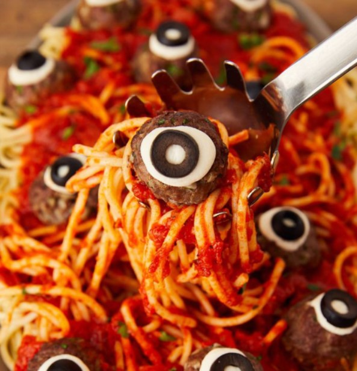

Spaghetti and meatballs are a timeless favorite for potluck gatherings, but when it comes to [Halloween dinner](https://avada.io/loveable/blog/halloween-dinner-ideas/), ordinary just won’t cut it—it needs to be delightfully spooky! In the past, we’ve enjoyed festive dishes like Jack-o’-Lantern stuffed peppers and ghost pizza bagels. However, our latest obsession revolves around transforming regular meatballs into eerie masterpieces that resemble monstrous eyeballs. It’s an exciting way to add a frightful touch to our Halloween feast!

**Check out** [**Creepy Eyeball Pasta**](https://www.delish.com/cooking/recipe-ideas/a23712888/eyeball-pasta-halloween-dinner-recipe/) **Recipe**

### **2\. Delicious Pumpkin Curry**

The natural, sweet flavors of pumpkin create an excellent foundation for a tantalizing Thai-inspired coconut milk curry with a hint of spice. To enhance the dish, we start by roasting the pumpkin, allowing it to develop a delightful caramelization and nutty undertones. As a next step, we take a portion of the roasted pumpkin and blend it into the curry sauce, introducing an additional dimension of pumpkin essence to the overall flavor profile. The result is a mouthwatering combination that’s sure to please the taste buds! 

Check out [Delicious Pumpkin Curry](https://www.delish.com/cooking/recipe-ideas/a36983076/pumpkin-curry-recipe/) Recipe 

### **3\. Mini Ghost Pizza**

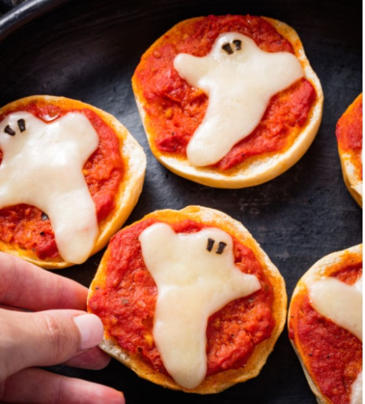

The most frightening aspect of these pizza bagels is the speed at which we’ll devour them.  We highly suggest employing a cookie cutter to create ghost-shaped bagels, and feel free to experiment with different shapes if you have them on hand!

Check out [Mini Ghost Pizza Recipe](https://www.delish.com/holiday-recipes/halloween/recipes/a49353/ghost-pizza-bagels-recipe/) 

### **4\. Pub Beer Cheese**

This recipe is a perfect choice for any party, as it not only comes together in a matter of minutes but also requires just a single bowl, making cleanup a breeze. Talk about effortlessness! The best part is that you can use whichever type of beer suits your taste buds—whether it’s a hoppy IPA, a creamy stout, or perhaps even your beloved pumpkin beer if you’re feeling adventurous. The options are endless, allowing you to tailor the dish to your preferred flavor profile. So go ahead and enjoy the simplicity and versatility of this delightful recipe at your next gathering!

Check out [Pub Beer Cheese recipe](https://www.delish.com/cooking/recipe-ideas/recipes/a55502/pub-beer-cheese-recipe/) 

### **5\. Roasted Butternut Squash Soup Halloween Potluck** 

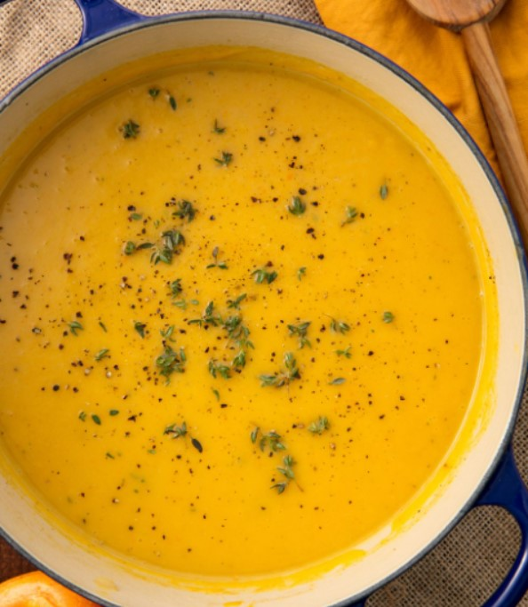

When it comes to capturing the essence of falling leaves and the crisp autumn air, opinions may vary. While some argue that pumpkin pie or warm apple cider takes the crown, for us, nothing complements the October sweater weather quite like a comforting serving of butternut squash soup. Its flavors perfectly harmonize with the season. If you’re planning to bring this to a potluck, make sure to save yourself a portion in advance, because once it hits the table, there won’t be a single leftover to take home!

Check out [Roasted Butternut Squash Soup](https://www.delish.com/cooking/recipe-ideas/recipes/a55386/best-roasted-butternut-squash-soup-recipe/) recipe 

### **6\. Graveyard Chicken Enchilada Dip**

Creating this easy graveyard requires fewer than 10 ingredients, and you may even find some of them already stocked in your pantry! If you prefer a more convenient approach, don’t hesitate to utilize store-bought ingredients. However, if you’re feeling adventurous, consider making your enchilada sauce from scratch, preparing homemade chicken, and crafting a personalized taco seasoning blend to elevate the dish. The choice is yours, and both options guarantee a delicious outcome for your culinary graveyard masterpiece.

Check out [Graveyard Chicken Enchilada Dip](https://www.delish.com/holiday-recipes/recipes/a49349/graveyard-chicken-enchilada-dip/) recipe 

### **7\. Pumpkin Chili Halloween Potluck Ideas** 

Trick or treat! This unique recipe takes a delightful twist by incorporating kabocha squash instead of the usual pumpkin. Kabocha squash offers a flavor profile that falls somewhere between the creamy richness of butternut squash and the satisfying sweetness of a starchy sweet potato. Its taste is wonderfully complex, boasting floral undertones and earthy hints of chestnut. 

Interestingly, the kabocha squash’s forest green rind, which can appear somewhat eerie, is actually completely edible once the squash is cooked through. This means you can skip the hassle of peeling it before adding it to your chili. Embrace the flavors and convenience of kabocha squash in this recipe for a delightful and slightly spooky twist on a classic dish.

Check out [Pumpkin Chili](https://www.delish.com/cooking/recipe-ideas/a37103149/pumpkin-chili-recipe/) recipe 

### **8\. Halloween Mummy Hot Dogs**

While there may be numerous mummy hot dogs out there, we firmly believe that ours stands out from the rest for a couple of compelling reasons. Firstly, our mummy hot dogs are skillfully stuffed with cheese, taking them to a whole new level of deliciousness. As you take a bite, the ooey-gooey surprise of melty cheese will undoubtedly elevate your taste experience. 

Secondly, before these delightful mummies hit the oven, they are lovingly brushed with melted butter, resulting in a golden, flaky exterior that’s simply irresistible. The combination of buttery goodness, flakiness, and cheesy indulgence creates a winning formula that guarantees culinary satisfaction. When it comes to mummy hot dogs, our version truly hits the mark, leaving your taste buds craving more.

Check out [Halloween Mummy Hot Dogs](https://www.delish.com/holiday-recipes/halloween/a28621353/mummy-hot-dogs-recipe/) recipe 

### **9\. Sweet Potato Sliders Halloween Potluck** 

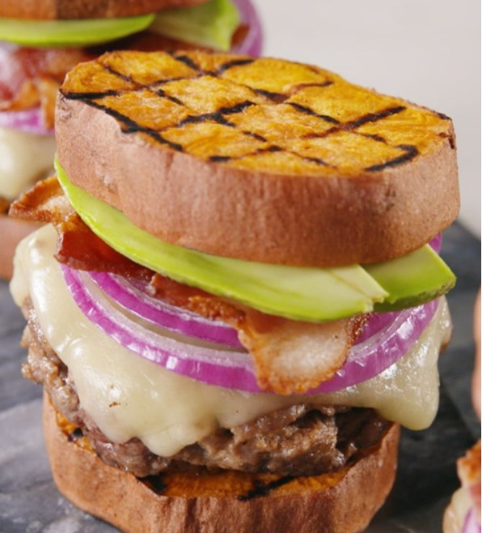

Don’t let the appearance fool you—these petite sliders may seem intricate, but rest assured, they are incredibly simple to make. The best part? Both the burgers and sweet potatoes cook in nearly the same timeframe, ensuring that these sliders can be ready in under 30 minutes. This makes them an ideal choice when you find yourself in need of a quick and easy dish for a last-minute potluck gathering. 

The efficiency of the cooking process allows you to whip up a crowd-pleasing option without the stress of spending excessive time in the kitchen. So, dive into the preparation of these delightful sliders, and enjoy the convenience and flavor they bring to your potluck table.

Check out [Sweet Potato Sliders](https://www.delish.com/cooking/recipe-ideas/a21084799/sweet-potato-sliders-recipe/) recipe 

### **10\. Delicious Stuffed Acorn Squash Halloween Potluck** 

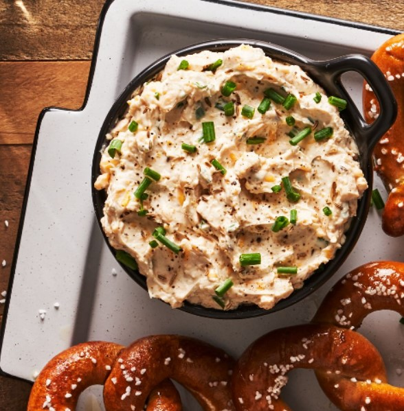

Prepare to indulge in the harmonious blend of our beloved autumn flavors showcased in this delightful stuffed acorn squash recipe. Surprisingly effortless to make, this dish offers an explosion of incredible flavors. The addition of kale brings a satisfying heartiness that can only be achieved by incorporating a robust cruciferous green. Its earthy notes complement the tender and naturally sweet flesh of the acorn squash perfectly, creating a mouthwatering combination that will leave you craving more. 

As you savor each bite, the delightful medley of flavors will dance on your taste buds, leaving you with a resounding “Mmm.” Don’t miss out on this extraordinary culinary experience that celebrates the best of fall’s bounty.

Check out [Stuffed Acorn Squash](https://www.delish.com/cooking/recipe-ideas/a28484111/easy-stuffed-acorn-squash-recipe/) recipe 

### **11\. Jack-O-Lantern Stuffed Peppers**

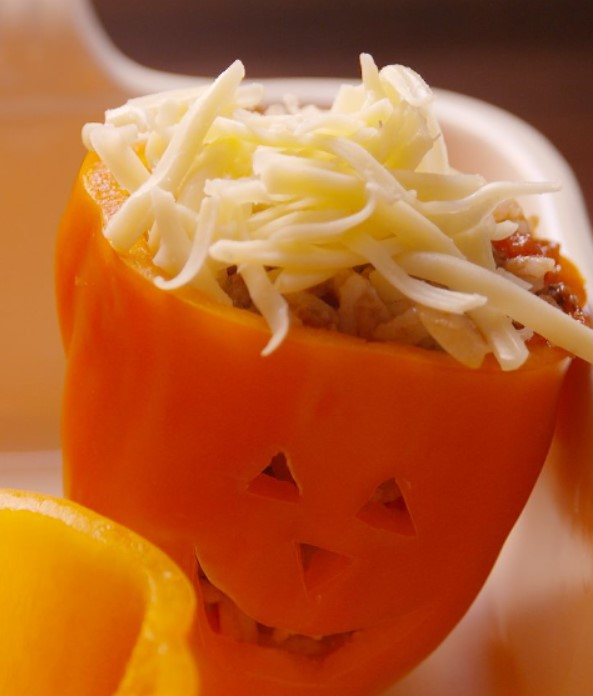

Creating these charming peppers is a delightful experience that rivals the satisfaction of pumpkin carving, and the best part? It’s much easier! While we opted for a traditional filling of rice and ground beef, you’re welcome to draw inspiration from any of our other stuffed pepper recipes if you’d like to explore different flavors and ingredients. The possibilities are endless, allowing you to tailor the filling to your personal preferences.

Check out the [Jack-O-Lantern Stuffed Peppers](https://www.delish.com/cooking/recipe-ideas/recipes/a49656/jack-o-lantern-stuffed-peppers-recipe/) recipe 

### **12\. Cowboy Salad**

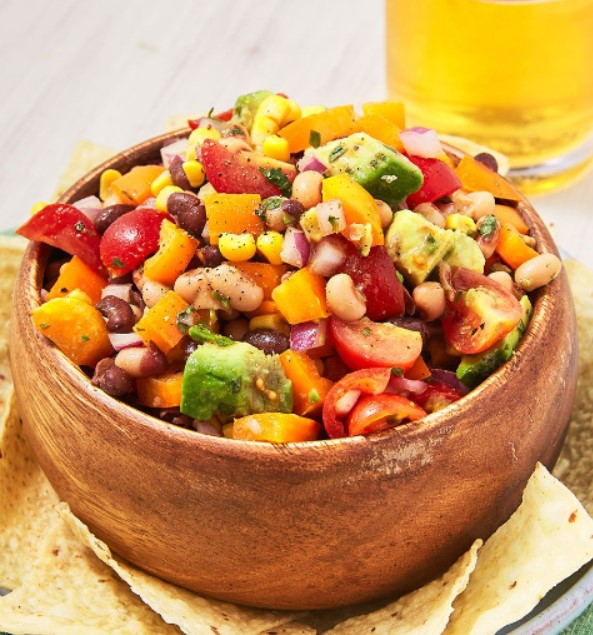

You’ll be amazed at how effortlessly this last-minute [Halloween dip](https://avada.io/loveable/blog/halloween-dip-recipes/) comes together. Simply combine the ingredients, pour the mixture into a Halloween-themed bowl of your choice, place it at the center of the table, and watch as everyone dives in with excitement. 

While the name might mislead some to expect caviar, this salsa-like recipe gets its unique moniker from the inclusion of black-eyed peas. But rest assured, the flavors are anything but ordinary. Don’t let anyone be fooled by the name—this dip packs a punch with its delicious combination of ingredients. 

Check out the [Cowboy Salad](https://www.delish.com/cooking/recipe-ideas/recipes/a53100/cowboy-caviar-recipe/) recipe 

### **13\. Mummy Meatballs Halloween** 

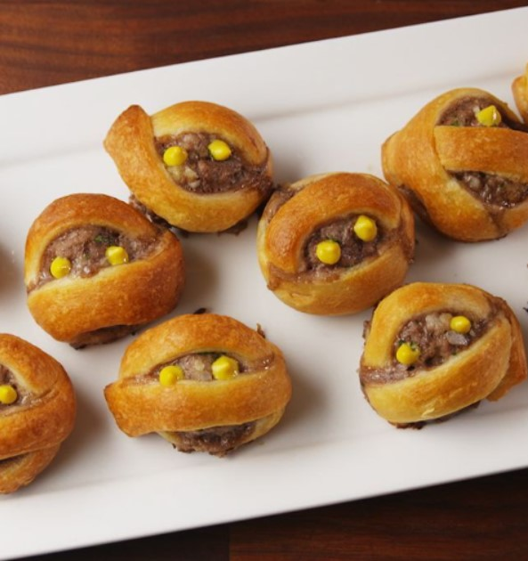

Elevate your next Halloween party with a simple trick that turns ordinary meatballs into extra spooky delights in no time. All you need is store-bought crescent roll dough to wrap around the meatballs, instantly transforming them into eerie morsels. To add an extra layer of flavor, consider using the same mustard you use for the meatball eyes to create a delectable honey-mustard sauce for dipping. Alternatively, you can go with the classic option of serving them alongside the marinara sauce. 

Check out [Mummy Meatballs Halloween](https://www.delish.com/cooking/recipe-ideas/recipes/a55767/mummy-meatballs-recipe/) recipe 

### **14\. Jalapeño Popper Dip Halloween Potluck** 

Get ready to savor a dip that brings just the right amount of kick, courtesy of the jalapeño. It delivers a flavorful punch without overwhelming your taste buds, ensuring that you won’t be desperately reaching for a glass of milk. Even those who typically shy away from spicy foods will find themselves captivated by this irresistible blend. Its perfectly balanced heat level makes it undeniably scary good. 

Check out the [Jalapeño Popper Dip Halloween](https://www.delish.com/cooking/recipe-ideas/recipes/a51154/jalapeno-popper-dip-recipe/) recipe 

### **15\. Pumpkin Bacon Mac & Chees**e

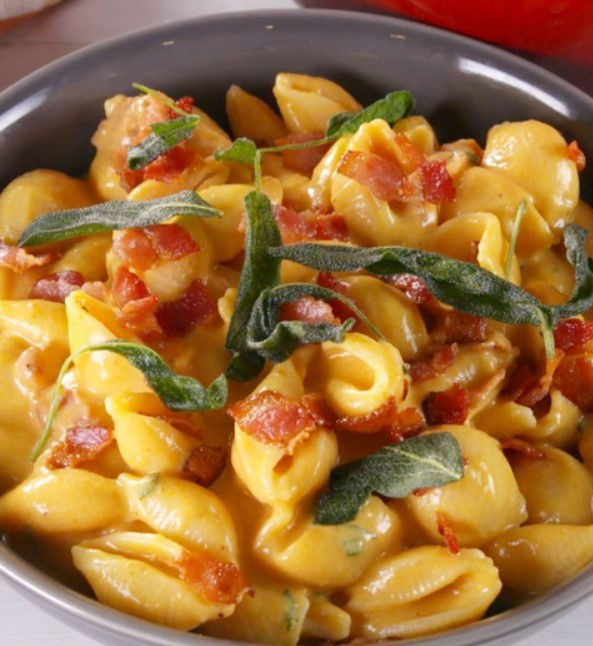

No doubt about it, mac & cheese is a beloved classic. But have you ever tried the enchanting combination of PUMPKIN mac & cheese? It’s a game-changer that elevates this comfort food to a whole new level. The velvety pumpkin adds a touch of autumnal magic to the cheesy goodness, creating a potluck-friendly meal that is worthy of any and every occasion, all the way until spring. Prepare to dazzle your taste buds and impress your friends and family with this irresistible twist on a timeless favorite.

Check out [Pumpkin Bacon Mac & Cheese](https://www.delish.com/cooking/recipe-ideas/a29464767/pumpkin-bacon-mac-and-cheese-recipe/) recipe 

### **16\. Stuffing Stuffed Pumpkins Halloween Potluck Idea** 

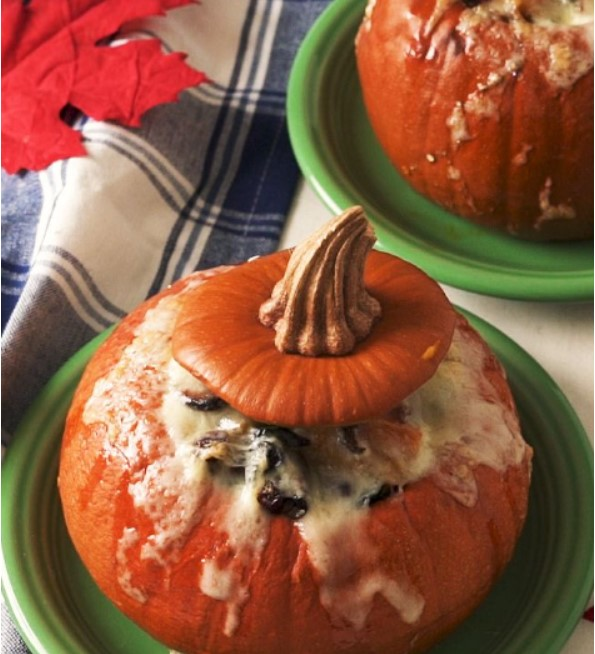

Why settle for baking your stuffing in a plain, ordinary baking dish when you can take it to a whole new level by baking it inside a pumpkin?! This delightful autumnal recipe harnesses the natural sweetness of the squash to infuse the stuffing with an incredibly flavorful twist. Not only does it taste absolutely amazing, but it also creates a stunning visual presentation that will leave your guests in awe. 

Embrace the opportunity to elevate your stuffing game by using a pumpkin as your flavorful vessel. The result is a dish that not only tastes incredible but also looks like a work of art.

Check out the [Stuffing Stuffed Pumpkins](https://www.delish.com/cooking/recipe-ideas/a34701190/stuffing-stuffed-pumpkins-recipe/) recipe

## **Halloween Potluck Idea: Creepy Beverages**

### **17\. Witches’ Brew**

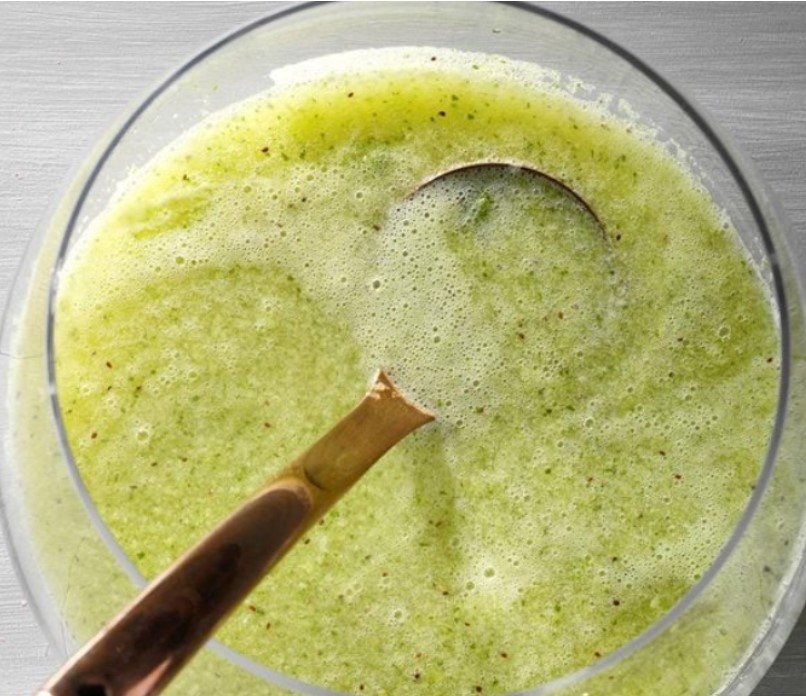

For those who prefer a nonalcoholic option, simply omit the vodka, allowing the little ones to join in on the fun. It’s the perfect way to ensure that everyone can enjoy a spooky and delightful beverage during your Halloween celebration. So, let your imagination run wild and stir up some magical drinks that will add an extra dose of enchantment to your festivities!

Check out [Witches’ Brew](https://www.tasteofhome.com/recipes/witches-brew/) recipe 

### **18\. Mad Scientist Punch Halloween Beverage** 

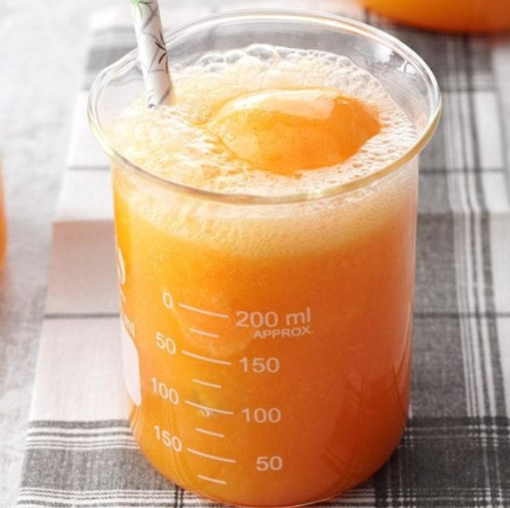

Our talented home economists have crafted a delightful “potion” using common kitchen staples like juice concentrate, soft drink mix, soda, and sherbet. This concoction is a true crowd-pleaser, captivating kids of all ages with its enchanting flavors and fizzy appeal. With a combination of familiar ingredients transformed into a magical beverage, this potion is sure to add an extra touch of whimsy to any gathering or celebration.

Check out [Mad Scientist Punch](https://www.tasteofhome.com/recipes/mad-scientist-punch/) recipe 

### **19\. Purple People Eater Punch**

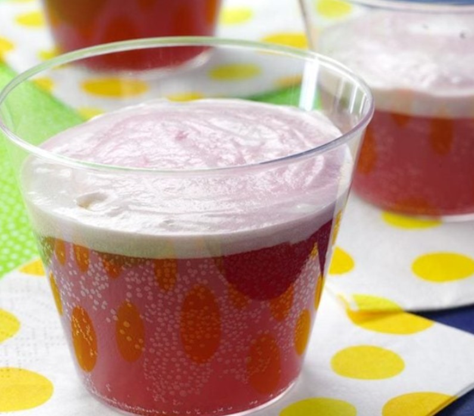

Indulge in the vibrant flavors of this Halloween punch that resembles the taste of grape sparkling wine. Its colorful allure and delightful blend of ingredients will captivate your taste buds. Prepare to witness the rapid disappearance of this enchanting beverage from your spooky buffet, as guests eagerly partake in its deliciousness. This vibrant punch is the perfect addition to your Halloween celebration, adding a touch of sparkle and allure to the festivities. 

Check out the [Purple People Eater Punch](https://www.tasteofhome.com/recipes/purple-people-eater-punch/) recipe 

## **Halloween Potluck Idea: Spooky Delicious Dessert** 

### **20\. Browned Butter Cereal Bars**

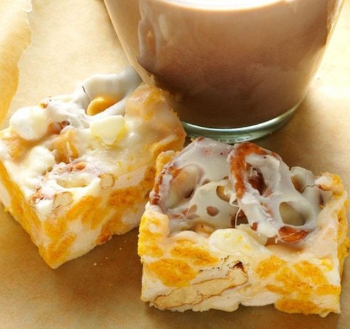

Crispy rice treats hold a special place in my heart as one of the first recipes I ever made as a child. In this version, I aimed to create something equally nostalgic yet elevated. The addition of Cap’n Crunch cereal and browned butter takes these treats to a whole new level, leaving friends and family in awe of the genius combination. However, for me, it’s simply a matter of creating something undeniably delicious. 

Check out [Browned Butter Cereal Bars](https://www.tasteofhome.com/recipes/browned-butter-cereal-bars/) recipe 

### **21\. Halloween Peanut Butter Cookie Pops**

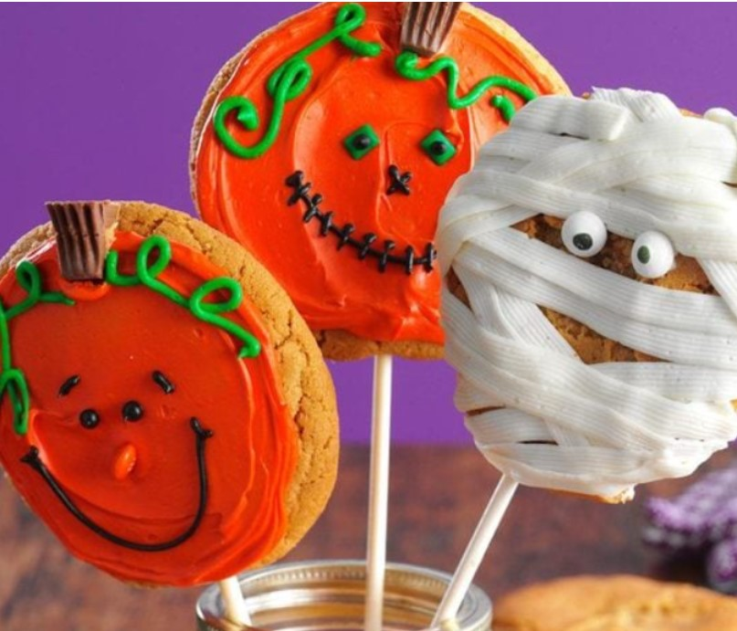

Discover a delightful surprise as a miniature candy bar hides within these playful pops. Adorned with vibrant frosting and adorned with charming candy faces, these cookie pops are irresistible and serve as the ultimate Halloween treat. The combination of the hidden candy, colorful frosting, and adorable decorations adds an extra layer of excitement to each bite. Prepare to indulge in these addictive and enchanting cookie pops that are sure to bring joy to any Halloween celebration.

Check out [Halloween Peanut Butter Cookie Pops](https://www.tasteofhome.com/recipes/halloween-peanut-butter-cookie-pops/) recipe 

### **22\. Trick-or-Treat Pizza**

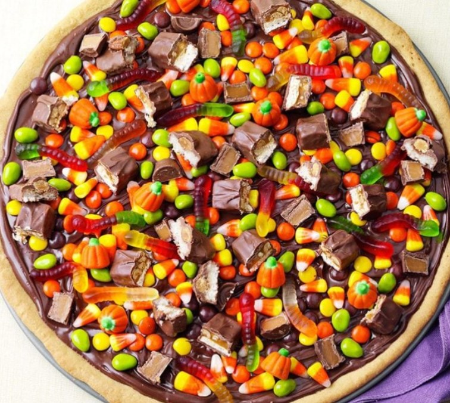

Make the most of your leftover Halloween candy by creating a decadent treat that will leave everyone in awe. Take a monster-sized cookie and let your imagination run wild as you pile your favorite candies onto its irresistible surface. Embrace the sweet indulgence as a medley of flavors and textures collide in every mouthwatering bite. 

Check out the [Trick-or-Treat Pizza](https://www.tasteofhome.com/recipes/trick-or-treat-pizza/) recipe 

### **23\. Halloween Jack-o’-Lantern Cupcakes** 

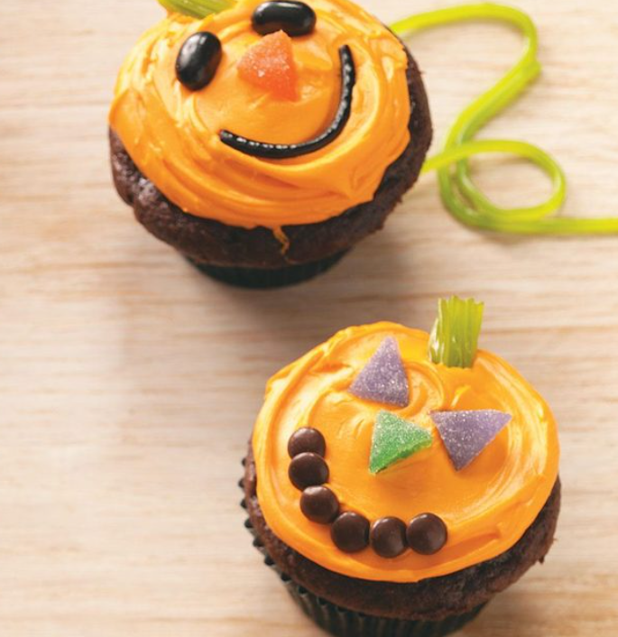

Set aside a bit of time to engage in the delightful activity of decorating these Halloween pumpkins with whimsical Jack-o’-lantern faces. It’s a wonderful way to embrace the spirit of the season and indulge in some creative fun. These pumpkin treats are not only enjoyable to make but also perfect for sharing with others. Whether you’re creating them for a festive gathering or simply to spread some Halloween cheer, these adorable treats are guaranteed to bring smiles to the faces of those who receive them. 

Check out the [Jack-o’-Lantern Cupcakes](https://www.tasteofhome.com/recipes/jack-o-lantern-cupcakes/) recipe 

### **24\. Slithering Hummus Bites**

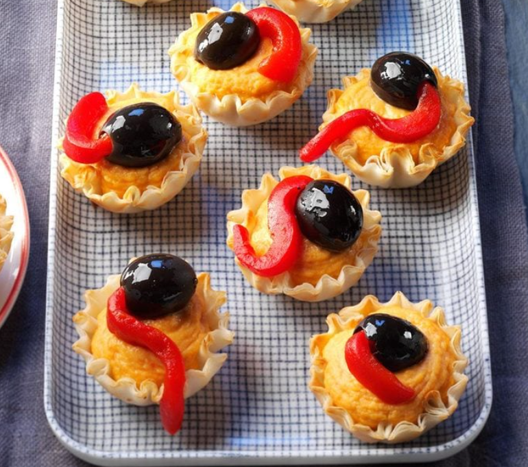

My friends frequently request my hummus dip for their parties, but one Halloween, I decided to take it up a notch. I transformed the beloved dip into an extraordinary creation by piping it into delicate phyllo shells and adorning them with olives and roasted red peppers, resulting in spooky and whimsical creatures. The combination of flavors and textures creates an unforgettable experience for both the eyes and the taste buds. 

Check out [Slithering Hummus Bites](https://www.tasteofhome.com/recipes/slithering-hummus-bites/) recipe 

**Related:** _Creepy and Cute [Halloween Cookie Ideas](https://avada.io/loveable/halloween-cookie-ideas/) to Delight Your Senses_

## **Halloween Potluck Ideas, In conclusion**

These **Halloween potluck ideas** offer a plethora of creative and delicious options to make your Halloween gathering a memorable one. From spooky appetizers to festive main courses, homemade treats, and refreshing drinks, there’s something for everyone to enjoy. Whether you’re hosting a party or contributing to a potluck, these recipes are sure to impress your guests and evoke the spirit of Halloween. So, don your costumes, set the table with eerie decorations, and dive into these culinary delights for a truly spooktacular celebration. Happy Halloween!

- [Halloween Potluck Ideas: Spooky Savory Dishes (With Tutorial)](https://avada.io/loveable/blog/halloween-potluck-ideas/#wp-block-heading-2-4)
    - [1\. Creepy Eyeball Pasta](https://avada.io/loveable/blog/halloween-potluck-ideas/#wp-block-heading-3-6)
    - [2\. Delicious Pumpkin Curry](https://avada.io/loveable/blog/halloween-potluck-ideas/#wp-block-heading-3-10)
    - [3\. Mini Ghost Pizza](https://avada.io/loveable/blog/halloween-potluck-ideas/#wp-block-heading-3-14)
    - [4\. Pub Beer Cheese](https://avada.io/loveable/blog/halloween-potluck-ideas/#wp-block-heading-3-18)
    - [5\. Roasted Butternut Squash Soup Halloween Potluck](https://avada.io/loveable/blog/halloween-potluck-ideas/#wp-block-heading-3-22) 
    - [6\. Graveyard Chicken Enchilada Dip](https://avada.io/loveable/blog/halloween-potluck-ideas/#wp-block-heading-3-26)
    - [7\. Pumpkin Chili Halloween Potluck Ideas](https://avada.io/loveable/blog/halloween-potluck-ideas/#wp-block-heading-3-30) 
    - [8\. Halloween Mummy Hot Dogs](https://avada.io/loveable/blog/halloween-potluck-ideas/#wp-block-heading-3-35)
    - [9\. Sweet Potato Sliders Halloween Potluck](https://avada.io/loveable/blog/halloween-potluck-ideas/#wp-block-heading-3-40) 
    - [10\. Delicious Stuffed Acorn Squash Halloween Potluck](https://avada.io/loveable/blog/halloween-potluck-ideas/#wp-block-heading-3-45) 
    - [11\. Jack-O-Lantern Stuffed Peppers](https://avada.io/loveable/blog/halloween-potluck-ideas/#wp-block-heading-3-50)
    - [12\. Cowboy Salad](https://avada.io/loveable/blog/halloween-potluck-ideas/#wp-block-heading-3-54)
    - [13\. Mummy Meatballs Halloween](https://avada.io/loveable/blog/halloween-potluck-ideas/#wp-block-heading-3-59) 
    - [14\. Jalapeño Popper Dip Halloween Potluck](https://avada.io/loveable/blog/halloween-potluck-ideas/#wp-block-heading-3-63) 
    - [15\. Pumpkin Bacon Mac & Cheese](https://avada.io/loveable/blog/halloween-potluck-ideas/#wp-block-heading-3-67)
    - [16\. Stuffing Stuffed Pumpkins Halloween Potluck Idea](https://avada.io/loveable/blog/halloween-potluck-ideas/#wp-block-heading-3-71) 
- [Halloween Potluck Idea: Creepy Beverages](https://avada.io/loveable/blog/halloween-potluck-ideas/#wp-block-heading-2-76)
    - [17\. Witches’ Brew](https://avada.io/loveable/blog/halloween-potluck-ideas/#wp-block-heading-3-77)
    - [18\. Mad Scientist Punch Halloween Beverage](https://avada.io/loveable/blog/halloween-potluck-ideas/#wp-block-heading-3-81) 
    - [19\. Purple People Eater Punch](https://avada.io/loveable/blog/halloween-potluck-ideas/#wp-block-heading-3-85)
- [Halloween Potluck Idea: Spooky Delicious Dessert](https://avada.io/loveable/blog/halloween-potluck-ideas/#wp-block-heading-2-89) 
    - [20\. Browned Butter Cereal Bars](https://avada.io/loveable/blog/halloween-potluck-ideas/#wp-block-heading-3-90)
    - [21\. Halloween Peanut Butter Cookie Pops](https://avada.io/loveable/blog/halloween-potluck-ideas/#wp-block-heading-3-94)
    - [22\. Trick-or-Treat Pizza](https://avada.io/loveable/blog/halloween-potluck-ideas/#wp-block-heading-3-98)
    - [23\. Halloween Jack-o’-Lantern Cupcakes](https://avada.io/loveable/blog/halloween-potluck-ideas/#wp-block-heading-3-102) 
    - [24\. Slithering Hummus Bites](https://avada.io/loveable/blog/halloween-potluck-ideas/#wp-block-heading-3-106)
- [Halloween Potluck Ideas, In conclusion](https://avada.io/loveable/blog/halloween-potluck-ideas/#wp-block-heading-2-111)

### [Blake Simpson](https://avada.io/loveable/author/blake/)

Hi, I'm Blake from Loveable. I help people find perfect gifts for occasions like anniversaries and weddings. I also write a blog about holidays, sharing insights to make them more meaningful. Let's create unforgettable moments together!

- [Twitter](https://twitter.com/intent/tweet)
- [Facebook](https://www.facebook.com/sharer/sharer.php)
- [instagram](https://avada.io/loveable/blog/halloween-potluck-ideas/)
- [pinterest](https://www.pinterest.com/loveablellc/)

## Related Posts

[### 120+ Christian Birthday Wishes To Spread Your Love](https://avada.io/loveable/blog/christian-birthday-wishes/) 

[

### 35 Best 70th Birthday Ideas To Celebrate The Special Milestone

](https://avada.io/loveable/blog/70th-birthday-ideas/)

[

### 50 Best 30th Birthday Decorations for a Remarkable Birthday Bash

](https://avada.io/loveable/blog/30th-birthday-decorations/)

[

### 40 Delicious Vegan Christmas Desserts to Delight Your Palate

](https://avada.io/loveable/blog/vegan-christmas-desserts/)

[

### 60 Christmas Team Building Activities to Boost Workplace Spirit

](https://avada.io/loveable/blog/christmas-team-building-activities/)
