This article has been written and researched by our expert Loveable through a precise methodology. [Learn more about our methodology](https://avada.io/loveable/our-methodological.html)

[Loveable](https://avada.io/loveable/) > [Blog](https://avada.io/loveable/blog/) > [Holiday](https://avada.io/loveable/holiday/)

# 25 Unique Halloween Mantel Decor Ideas to Haunt Your Home in 2023

Written by [Blake Simpson](https://avada.io/loveable/author/blake/) Last Updated on August 24, 2023

- [25 Creative Halloween Mantel Decor Ideas](https://avada.io/loveable/blog/halloween-mantel-decor-ideas/#wp-block-heading-2-4)
    - [1\. Vintage Halloween Mantel Decor](https://avada.io/loveable/blog/halloween-mantel-decor-ideas/#wp-block-heading-3-5)
    - [2\. Christmas in October](https://avada.io/loveable/blog/halloween-mantel-decor-ideas/#wp-block-heading-3-9)
    - [3\. Spiders, Pumpkins & Prints. Oh My!](https://avada.io/loveable/blog/halloween-mantel-decor-ideas/#wp-block-heading-3-13)
    - [4\. Sitting Pretty](https://avada.io/loveable/blog/halloween-mantel-decor-ideas/#wp-block-heading-3-17)
    - [5\. Black & Gold](https://avada.io/loveable/blog/halloween-mantel-decor-ideas/#wp-block-heading-3-21)
    - [6\. Classic Halloween Style](https://avada.io/loveable/blog/halloween-mantel-decor-ideas/#wp-block-heading-3-25)
    - [7\. The Pumpkin Posse](https://avada.io/loveable/blog/halloween-mantel-decor-ideas/#wp-block-heading-3-28)
    - [8\. Spooky Vibes](https://avada.io/loveable/blog/halloween-mantel-decor-ideas/#wp-block-heading-3-32)
    - [9\. Getting Spooky with Fabric](https://avada.io/loveable/blog/halloween-mantel-decor-ideas/#wp-block-heading-3-35)
    - [10\. DIY Halloween Decor](https://avada.io/loveable/blog/halloween-mantel-decor-ideas/#wp-block-heading-3-40)
    - [11\. Batty & Beautiful Halloween Mantel Decor](https://avada.io/loveable/blog/halloween-mantel-decor-ideas/#wp-block-heading-3-44)
    - [12\. Vintage Spool Display](https://avada.io/loveable/blog/halloween-mantel-decor-ideas/#wp-block-heading-3-48)
    - [13\. Mounted Deer Head Fall Mantel Decor](https://avada.io/loveable/blog/halloween-mantel-decor-ideas/#wp-block-heading-3-52)
    - [14\. Spooky Scene Halloween Mantel Decor](https://avada.io/loveable/blog/halloween-mantel-decor-ideas/#wp-block-heading-3-56)
    - [15\. Black Crow Wreath Halloween Mantel Decor](https://avada.io/loveable/blog/halloween-mantel-decor-ideas/#wp-block-heading-3-60)
    - [16\. Pumpkins Aplenty Fall Mantel Decor](https://avada.io/loveable/blog/halloween-mantel-decor-ideas/#wp-block-heading-3-64)
    - [17\. Rainbow Pumpkins Fall Mantel Decor](https://avada.io/loveable/blog/halloween-mantel-decor-ideas/#wp-block-heading-3-68)
    - [18\. Colorful Halloween Mantel Decor](https://avada.io/loveable/blog/halloween-mantel-decor-ideas/#wp-block-heading-3-73)
    - [19\. Halloween Critters Halloween Mantel Decor](https://avada.io/loveable/blog/halloween-mantel-decor-ideas/#wp-block-heading-3-78)
    - [20\. Pop of Green Halloween Mantel Decor](https://avada.io/loveable/blog/halloween-mantel-decor-ideas/#wp-block-heading-3-81)
    - [21\. Crafty Cat Face Garland Halloween Mantel Decor](https://avada.io/loveable/blog/halloween-mantel-decor-ideas/#wp-block-heading-3-85)
    - [22\. Brewing Up Some Halloween Style!](https://avada.io/loveable/blog/halloween-mantel-decor-ideas/#wp-block-heading-3-89)
    - [23\. Branching Out](https://avada.io/loveable/blog/halloween-mantel-decor-ideas/#wp-block-heading-3-93)
    - [24\. Rustic Halloween Fireplace Mantel](https://avada.io/loveable/blog/halloween-mantel-decor-ideas/#wp-block-heading-3-97)
    - [25\. Stacked to Perfection](https://avada.io/loveable/blog/halloween-mantel-decor-ideas/#wp-block-heading-3-101)
    - [Bottom Line](https://avada.io/loveable/blog/halloween-mantel-decor-ideas/#wp-block-heading-3-106)

Welcome to our spine-chilling collection of the 25 **best Halloween mantel decor ideas** that will send shivers down your spine and transform your home into a haunted haven. Halloween is the perfect time to unleash your creativity and give your mantel a terrifying makeover that will leave guests trembling with both fear and admiration. 

Whether you prefer eerie elegance, bone-chilling spookiness, or playful Halloween charm, we have curated an array of bewitching ideas to inspire you. From ghostly garlands to [wicked witches](https://avada.io/loveable/witch-gifts/), haunted candelabras, to creepy crawlies, get ready to discover enchanting and frightfully fantastic ways to adorn your mantel for the most thrilling holiday of the year. 

So gather your cauldron, light the black candles, and prepare for a hauntingly good time as we delve into the 25 best **Halloween mantel decor** ideas that will leave a lasting impression on all who dare to enter your domain.

## **25 Creative Halloween Mantel Decor Ideas**

### **1\. Vintage Halloween Mantel Decor**

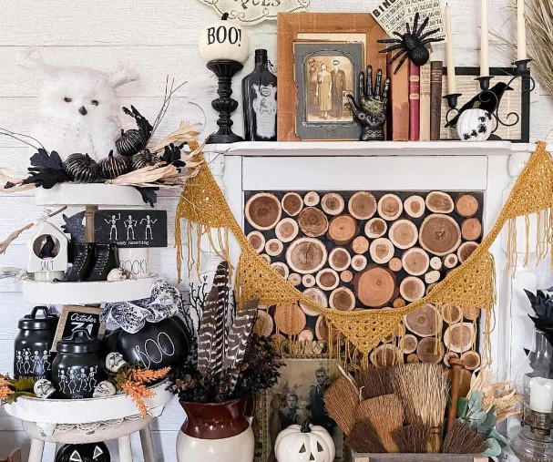

Why settle for a couple of decorations when you can create a bewitching extravaganza? Feast your eyes on a mesmerizing display that boasts an array of enchanting elements. Behold the sleepy nesting owl, calmly observing the eerie scene.

Cast your gaze upon a mysterious wooden box brimming with a collection of broom heads, hinting at a witch’s midnight flight. Prepare to be astounded by the sheer magnificence of it all! 

### **2\. Christmas in October**

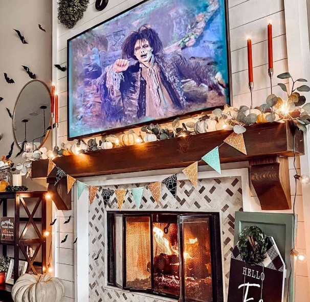

Why wait for Christmas to indulge in the warm glow of twinkling string lights? Give your mantel an enchanting ambiance by breaking out those festive lights a little early.

Picture the magic as they delicately drape across your Halloween display, casting a mesmerizing radiance that illuminates every spine-tingling detail. And why stop there? Take it up a notch by adding elegant [candlesticks](https://avada.io/loveable/blog/floating-candles-halloween/), like the ingenious homeowner above.

### **3\. Spiders, Pumpkins & Prints. Oh My!**

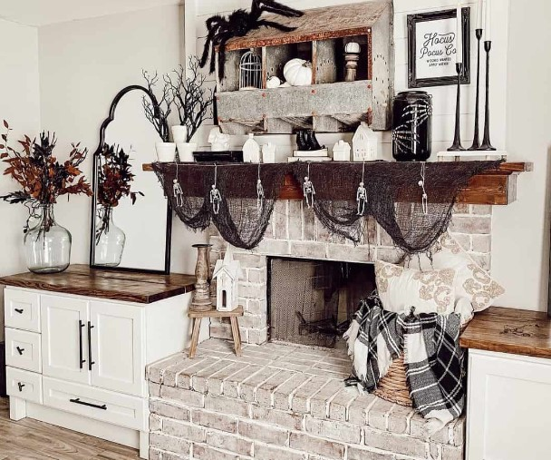

Embrace the versatility of this option as you effortlessly switch out the prints to match the changing seasons. And here’s a little secret to save you some major moola: printable art! With a wide range of printable [Halloween art](https://avada.io/loveable/blog/halloween-drawing-ideas/) available, you can find designs that suit your style and taste, all at incredibly affordable prices. 

For as little as $1 to $10, you can have a digital copy delivered straight to your inbox, ready to be transformed into a haunting masterpiece. All you need is some quality paper and a printer, or you can conveniently visit a printing place like Staples to bring your artwork to life.

### **4\. Sitting Pretty**

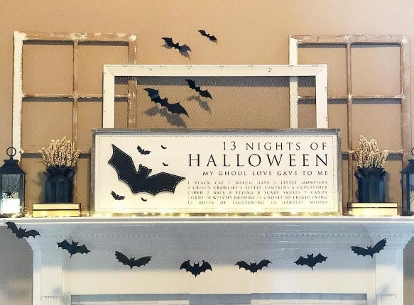

Say goodbye to the frustrations of hammering nails and enjoy the effortless elegance it brings. Take inspiration from the captivating example above, where a Halloween sign takes center stage, surrounded by vintage window frames. The combination exudes a delightful blend of rustic chic and Halloween-appropriate aesthetics. 

If you’re unable to find old window frames, fear not! You can craft your own frames using thin pieces of wood. To achieve an aged and weathered appearance, paint the frames in your desired color and then skillfully distress them using sandpaper once the paint has dried.

### **5\. Black & Gold**

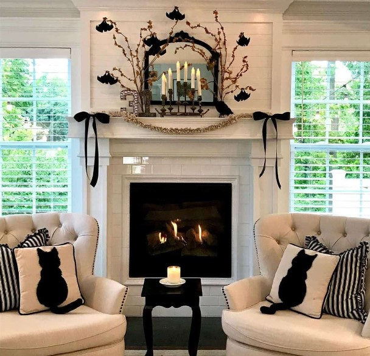

Elevate your [Halloween decor](https://avada.io/loveable/blog/halloween-decoration-ideas/) with a striking color scheme: black and gold. This offbeat combination infuses the perfect mix of Halloween vibes and a touch of glamour. Ideal for neutral rooms or when you crave a hint of opulence, the metallic allure of gold and copper adds a captivating charm.

Picture a black mantel adorned with gilded accents, shimmering candle holders, and intricate golden ornaments. The result is a spellbinding fusion of darkness and radiance that will leave your guests enchanted.

### **6\. Classic Halloween Style**

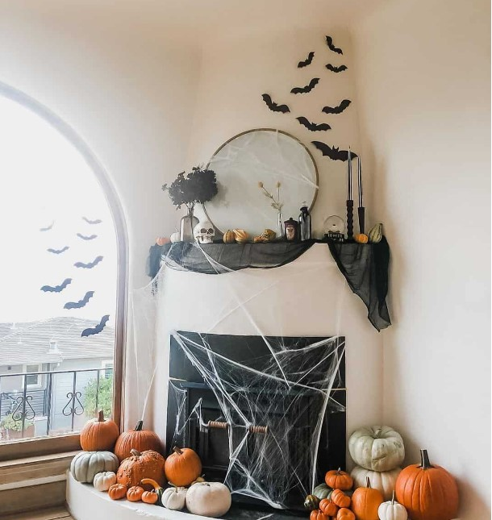

Embrace the Halloween spirit with a group of pumpkins adorning your fireplace. Even without carving or painting, they make a magnificent statement. Their simplicity allows for easy integration with other decorations, creating a harmonious display. Let the natural [beauty of pumpkins](https://avada.io/loveable/blog/halloween-pumpkin/) shine as they become the centerpiece of your Halloween decor.

### **7\. The Pumpkin Posse**

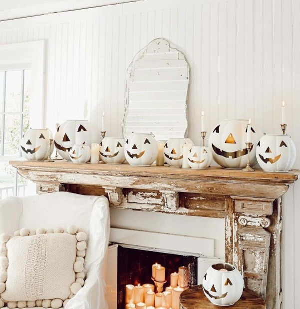

Witness the mastery of carving skills in this impressive pumpkin posse! Each intricately carved pumpkin brings its own unique personality to the ensemble, forming a captivating display. But fret not if you can’t find white pumpkins readily available.

A simple solution awaits: grab some orange pumpkins and give them a fresh coat of white paint. With a few brushstrokes, you can achieve a similar look and join the ranks of this stunning pumpkin arrangement.

### **8\. Spooky Vibes**

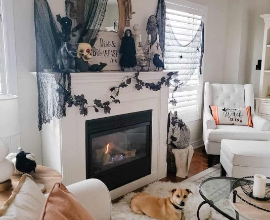

Meet Mr. Pup, basking in the cozy warmth of the crackling fire as we delight in the eerie ambiance of this Halloween mantel decor. His adorable presence adds an extra dose of charm to the spooky atmosphere. As we revel in the hauntingly delightful display, the flickering flames cast dancing shadows upon the carefully curated decorations.

### **9\. Getting Spooky with Fabric**

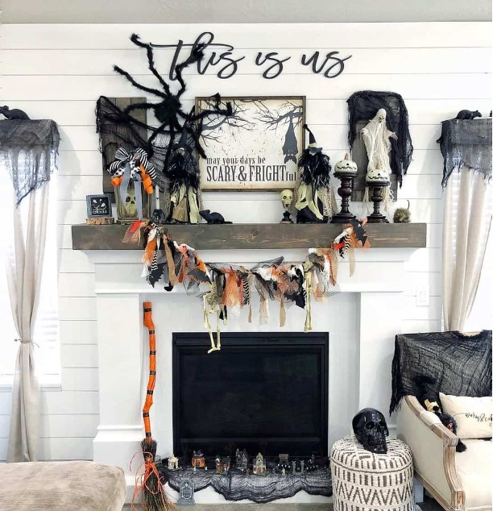

Simply tie the fabric pieces onto the rope to create a hauntingly beautiful garland. Choose from an array of fabrics such as lace, chiffon, burnt-out velvet, or mesh, as their ethereal textures perfectly drape over objects, adding a touch of spookiness.

However, exercise caution and ensure that any flammable materials, including paper and fabric, are kept away from flames if you have a working fireplace. Safety should always be a priority.

**You may also like:** [Best Halloween Gift Collections](https://avada.io/loveable/halloween/)

### **10\. DIY Halloween Decor**

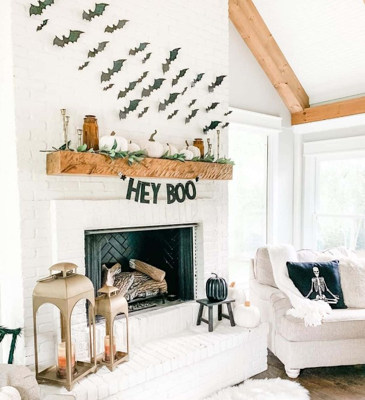

Take inspiration from paper bats and Halloween banners, which serve as perfect examples of cheap and enjoyable DIY projects. Crafting your own paper bats and creating personalized Halloween banners not only keeps costs low but also offers a wonderful opportunity for a family activity.

Get the kids involved and let their creativity soar as they lend a hand in crafting these decorations. Not only will you achieve a spooktacular mantel, but you’ll also create cherished memories together. 

### **11\. Batty & Beautiful Halloween Mantel Decor**

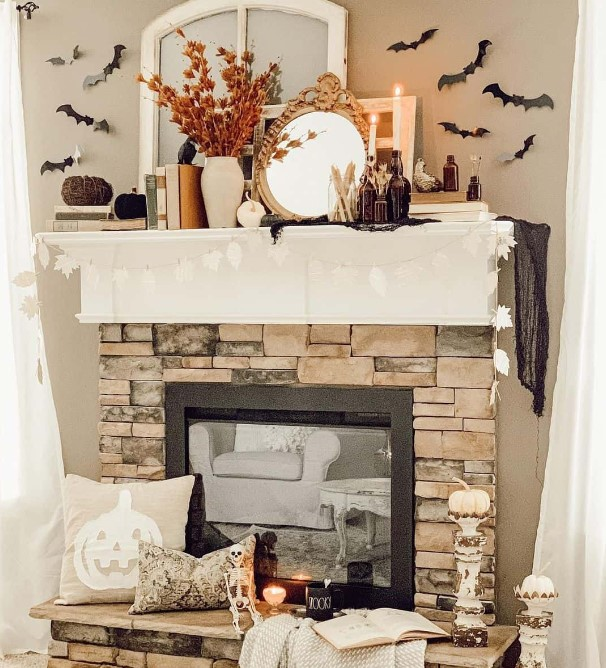

The secret lies in finding small gaps on your mantel to introduce carefully selected pieces of Halloween decor. If you aim for a mix of fun and class, opt for a neutral color scheme. This will create an elegant backdrop that allows the Halloween elements to shine.

On the other hand, if you prefer your Halloween decorations to be bold and eclectic, seize opportunities to incorporate eye-catching hues like vibrant orange and lively lime green. Let these vivid colors pop against the neutral backdrop, adding a playful and energetic vibe to your mantel. 

### **12\. Vintage Spool Display**

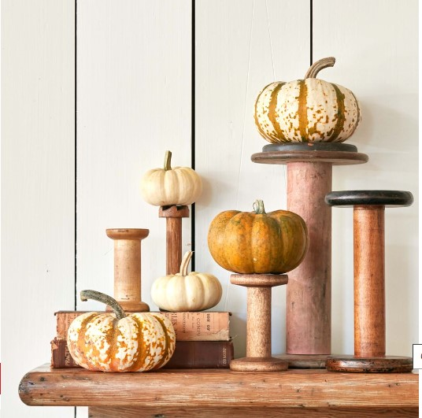

Elevate your mantel in a matter of seconds with a clever stacking technique. Simply perch petite pumpkins atop wooden spools and bobbins for an instant mantel upgrade that takes only 60 seconds.

This creative arrangement adds depth and visual interest to your display, transforming ordinary objects into charming pedestals for your pumpkins. The juxtaposition of natural elements and vintage-inspired spools creates a delightful fusion of rustic and whimsical aesthetics. 

### **13\. Mounted Deer Head Fall Mantel Decor**

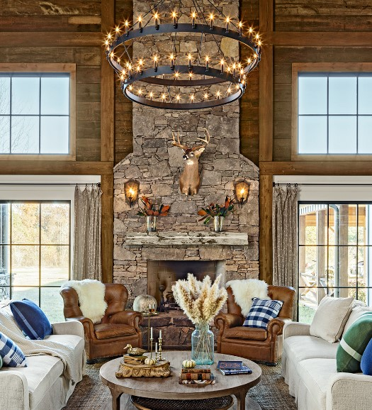

In this natural Arkansas fieldstone fireplace setting, symmetry takes the spotlight. A striking mounted deer head serves as the focal point, anchoring the room’s design.

Magnolia leaves arranged in clear vases on either side add a touch of organic beauty. The furniture arrangement complements the taxidermy, while romantic lighting from sconces and a double-tiered chandelier casts a warm glow over the entire space.

### **14\. Spooky Scene Halloween Mantel Decor**

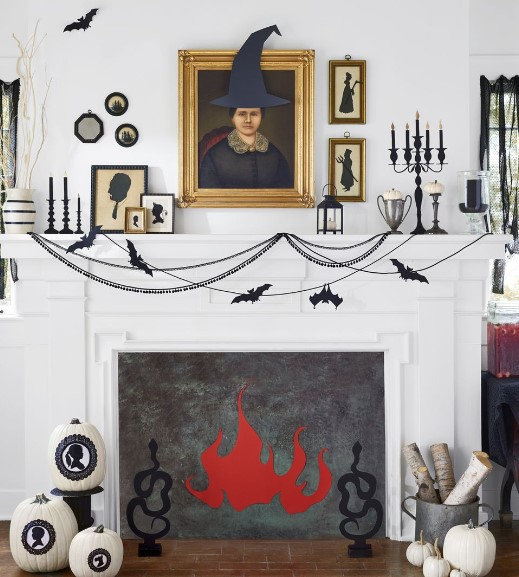

Create a spooky look by decorating old portraits and silhouettes with witch hats, pitchforks, scythes, fangs, and devil horns. Add detailed cutouts of candelabras and sticks with “lit” gold flames for a faux glow.

Attach paper bats to black sewing trimming using upholstery tacks. Line the fireplace opening with paper or painted wood and add a fiery red paper glow. Use black foam core to craft snake andirons glued to painted craft blocks. Unleash your creativity and transform your mantel into a haunting Halloween display.

### **15\. Black Crow Wreath Halloween Mantel Decor**

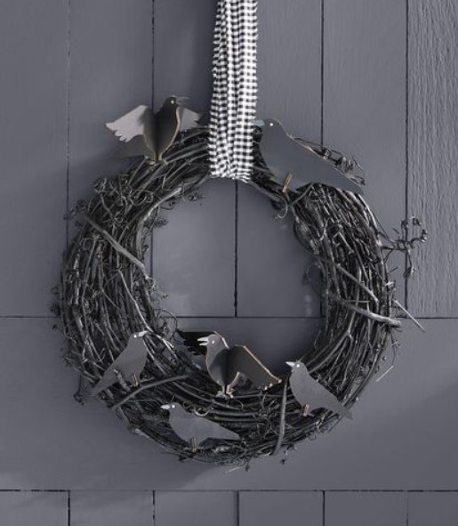

Wreaths have evolved beyond their traditional use on doors and are now being incorporated into interior decor for various occasions. One captivating idea is to hang a black crow grapevine wreath above a mantel, creating a spooky and eye-catching focal point during holiday seasons.

Another option is to layer a wreath over a mirror, adding depth and intrigue to the reflection. If you have ample space, consider hanging a trio of wreaths together for a maximum impact that will leave a lasting impression on your guests.

### **16\. Pumpkins Aplenty Fall Mantel Decor**

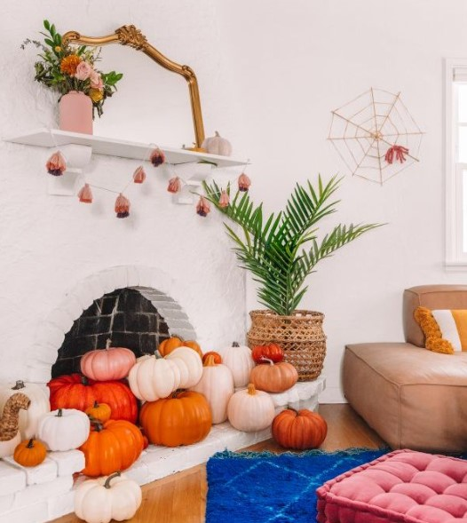

Transform your non-functioning fireplace into a charming fall display. Fill it with a seasonal symbol and add a simple garland in autumn colors along the mantel. Place mini pumpkins for extra flair. This look lasts all season, and for Halloween, consider adding a spider and web nearby. Enjoy the cozy and festive vibes!

Watch more at [DIY Studio](https://studiodiy.com/our-halloween-home-tour/).

### **17\. Rainbow Pumpkins Fall Mantel Decor**

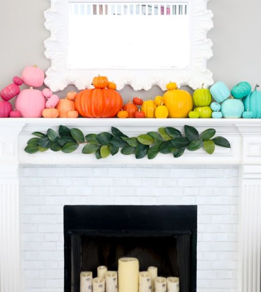

Break away from the traditional fall color palette and embrace a cheerful and vibrant rainbow-inspired look. Instead of sticking to the usual rich tones, opt for a range of hues that evoke happiness and playfulness.

If you’re concerned about the boldness of the colors, you can still create a cohesive and pleasing aesthetic by selecting a specific color family. Consider using all pastel shades for a soft and whimsical vibe, or go for a natural palette that incorporates cream, green, and apricot tones for a more earthy and harmonious feel. 

Watch more at [A Kailo Chic Life](https://akailochiclife.com/2017/09/decorate-it-rainbow-pumpkin-mante.html).

### **18\. Colorful Halloween Mantel Decor**

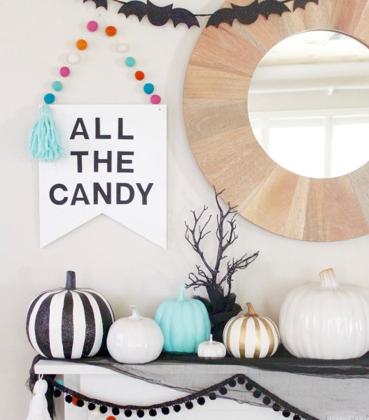

In this stylish Halloween mantel display, the blogger cleverly combines warm wood elements with bold black-and-white pieces and small pops of color, resulting in a sophisticated and joyful aesthetic.

By incorporating the contrasting elements of wood and black-and-white, a visually striking and modern look is achieved. The warm wood tones bring a sense of warmth and natural texture, while the black-and-white pieces add a touch of elegance and graphic appeal.

To infuse the display with a sense of playfulness, small pops of color are incorporated, creating delightful accents that bring joy to the overall composition.

### **19\. Halloween Critters Halloween Mantel Decor**

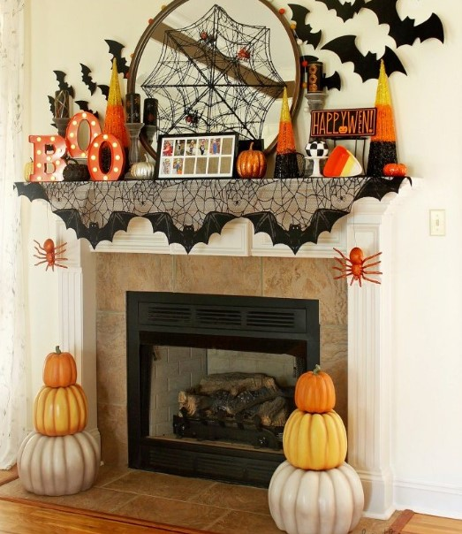

This joyous mantel is bursting with seasonal fun. A clever spiderweb with spiders hangs over the mirror while bats take flight around the space. Pumpkin topiaries flank the firebox, serving as festive decorations that can last through Thanksgiving. Enjoy the exuberant atmosphere created by these delightful elements!

### **20\. Pop of Green Halloween Mantel Decor**

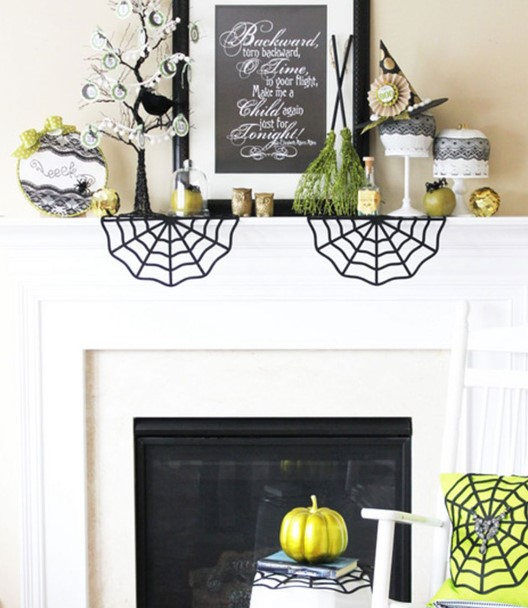

For a twist on the classic Halloween color palette, consider skipping the traditional orange and opting for a spooky pop of neon green instead.

This vibrant and eye-catching hue adds a modern and unexpected touch to your Halloween decor. Whether you incorporate it in your costumes, decorations, or even lighting, neon green brings a unique and eerie ambiance to the festivities. 

### **21\. Crafty Cat Face Garland Halloween Mantel Decor**

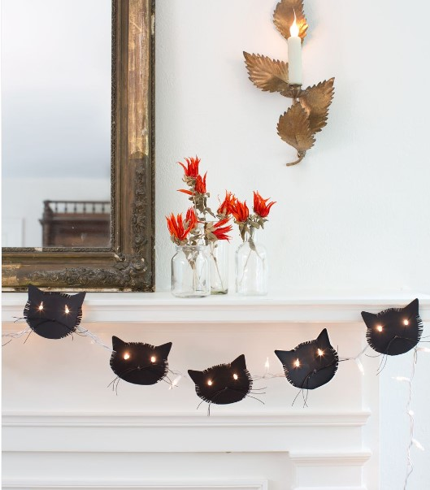

Elevate your mantel decor with a perfect makeover using a DIY black cat garland made from black card stock and string lights. Simply download the cat face template, trace it onto black card stock, and cut out the desired number of cat faces. Add texture by fringing the sides and top, attach black waxed twine as whiskers, and create eye holes using a hole punch. Hang string lights and position the cat faces on two lightbulbs for glowing cat eyes. 

Revitalize your mantel with this DIY black cat garland. Download the template, cut out cat faces from black card stock, and add texture by fringing the edges. Attach black waxed twine as whiskers and create eye holes using a hole punch. Hang string lights and position the cat faces on light bulbs for glowing eyes. 

### **22\. Brewing Up Some Halloween Style!**

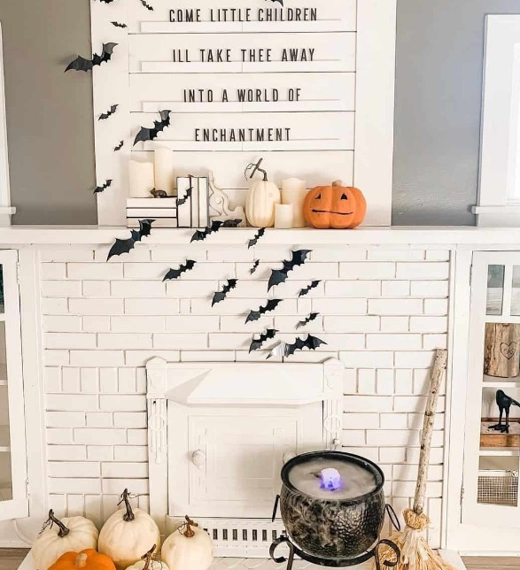

To create an enchanting Halloween mantel, gather the essential potion ingredients: expressive pumpkins and a flock of bats. Once combined in a metaphorical cauldron, you’ll witness the transformation into a fresh and bright Halloween display.

The expressive pumpkins and bats, carefully arranged, infuse the mantel with a captivating and festive atmosphere. Embrace the magic of this imaginative composition and enjoy the spellbinding charm it brings to your Halloween decor.

### **23\. Branching Out**

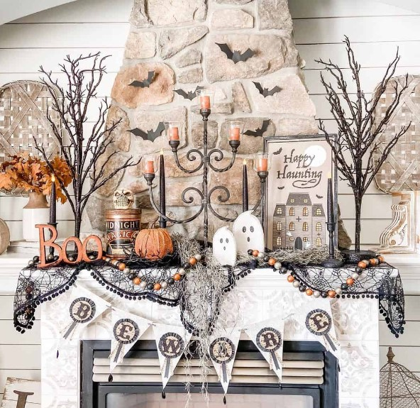

Elevate your Halloween mantel display by incorporating a couple of branches and black paint. These simple and affordable additions can bring height and visual interest to your decor.

Painting the branches with either acrylic or spray paint—though the latter is faster—can give them a spooky and dramatic effect. Alternatively, if you prefer a non-DIY option, consider using candlesticks nestled in holders to add height and intrigue to your mantel. This alternative solution provides a captivating visual element without the need for crafting. 

### **24\. Rustic Halloween Fireplace Mantel**

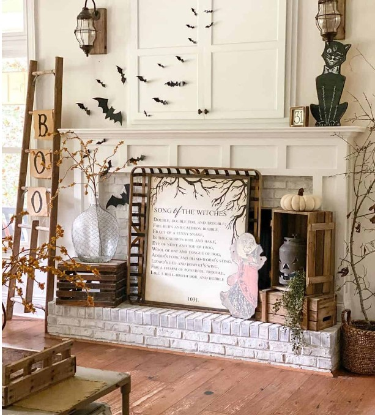

Combining these two methods results in a rustic delight that captures attention and creates a captivating mantel display. The vintage accessories bring a unique and nostalgic touch, while the handmade decorations add a personalized and creative flair.

This delightful combination ensures that your mantel decor stands out and reflects your individual style. Enjoy the process of curating and crafting these elements to create a truly captivating and charming mantel display for Halloween.

### **25\. Stacked to Perfection**

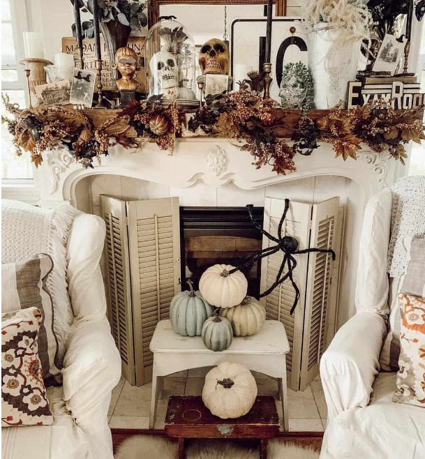

These painted pumpkins beautifully complement the artful arrangement, adding a sophisticated and personalized element to the display. Instead of swiping them from a giant spider’s watch, you can easily create your own painted pumpkins using a pumpkin painting tutorial.

The tutorial is versatile and can be applied to both real and fake pumpkins, allowing you to customize your decorations to suit your preferences. Embrace the opportunity to express your creativity and elevate the vintage charm of your mantel with these painted pumpkins, making your Halloween display truly memorable.

**_Related_**: Discover Creative [Ideas for Decorated Halloween Homes](https://avada.io/loveable/decorated-halloween-homes/)

### **Bottom Line**

In conclusion, these 25 Bes**t Halloween Mantel Decor** Ideas offer a hauntingly delightful array of inspiration to transform your home into a spooky haven. From classic and elegant to whimsical and playful, there is something to suit every style and preference. Whether you choose to adorn your mantel with eerie candle arrangements, macabre garlands, or vintage curiosities, these ideas will help you create a captivating and memorable Halloween atmosphere. 

Embrace the spirit of the season and let your mantel become a bewitching focal point that leaves a lasting impression on guests and families alike. With these creative and haunting decor ideas, you are sure to infuse your home with the perfect blend of spooky charm and festive delight. Happy decorating!

- [25 Creative Halloween Mantel Decor Ideas](https://avada.io/loveable/blog/halloween-mantel-decor-ideas/#wp-block-heading-2-4)
    - [1\. Vintage Halloween Mantel Decor](https://avada.io/loveable/blog/halloween-mantel-decor-ideas/#wp-block-heading-3-5)
    - [2\. Christmas in October](https://avada.io/loveable/blog/halloween-mantel-decor-ideas/#wp-block-heading-3-9)
    - [3\. Spiders, Pumpkins & Prints. Oh My!](https://avada.io/loveable/blog/halloween-mantel-decor-ideas/#wp-block-heading-3-13)
    - [4\. Sitting Pretty](https://avada.io/loveable/blog/halloween-mantel-decor-ideas/#wp-block-heading-3-17)
    - [5\. Black & Gold](https://avada.io/loveable/blog/halloween-mantel-decor-ideas/#wp-block-heading-3-21)
    - [6\. Classic Halloween Style](https://avada.io/loveable/blog/halloween-mantel-decor-ideas/#wp-block-heading-3-25)
    - [7\. The Pumpkin Posse](https://avada.io/loveable/blog/halloween-mantel-decor-ideas/#wp-block-heading-3-28)
    - [8\. Spooky Vibes](https://avada.io/loveable/blog/halloween-mantel-decor-ideas/#wp-block-heading-3-32)
    - [9\. Getting Spooky with Fabric](https://avada.io/loveable/blog/halloween-mantel-decor-ideas/#wp-block-heading-3-35)
    - [10\. DIY Halloween Decor](https://avada.io/loveable/blog/halloween-mantel-decor-ideas/#wp-block-heading-3-40)
    - [11\. Batty & Beautiful Halloween Mantel Decor](https://avada.io/loveable/blog/halloween-mantel-decor-ideas/#wp-block-heading-3-44)
    - [12\. Vintage Spool Display](https://avada.io/loveable/blog/halloween-mantel-decor-ideas/#wp-block-heading-3-48)
    - [13\. Mounted Deer Head Fall Mantel Decor](https://avada.io/loveable/blog/halloween-mantel-decor-ideas/#wp-block-heading-3-52)
    - [14\. Spooky Scene Halloween Mantel Decor](https://avada.io/loveable/blog/halloween-mantel-decor-ideas/#wp-block-heading-3-56)
    - [15\. Black Crow Wreath Halloween Mantel Decor](https://avada.io/loveable/blog/halloween-mantel-decor-ideas/#wp-block-heading-3-60)
    - [16\. Pumpkins Aplenty Fall Mantel Decor](https://avada.io/loveable/blog/halloween-mantel-decor-ideas/#wp-block-heading-3-64)
    - [17\. Rainbow Pumpkins Fall Mantel Decor](https://avada.io/loveable/blog/halloween-mantel-decor-ideas/#wp-block-heading-3-68)
    - [18\. Colorful Halloween Mantel Decor](https://avada.io/loveable/blog/halloween-mantel-decor-ideas/#wp-block-heading-3-73)
    - [19\. Halloween Critters Halloween Mantel Decor](https://avada.io/loveable/blog/halloween-mantel-decor-ideas/#wp-block-heading-3-78)
    - [20\. Pop of Green Halloween Mantel Decor](https://avada.io/loveable/blog/halloween-mantel-decor-ideas/#wp-block-heading-3-81)
    - [21\. Crafty Cat Face Garland Halloween Mantel Decor](https://avada.io/loveable/blog/halloween-mantel-decor-ideas/#wp-block-heading-3-85)
    - [22\. Brewing Up Some Halloween Style!](https://avada.io/loveable/blog/halloween-mantel-decor-ideas/#wp-block-heading-3-89)
    - [23\. Branching Out](https://avada.io/loveable/blog/halloween-mantel-decor-ideas/#wp-block-heading-3-93)
    - [24\. Rustic Halloween Fireplace Mantel](https://avada.io/loveable/blog/halloween-mantel-decor-ideas/#wp-block-heading-3-97)
    - [25\. Stacked to Perfection](https://avada.io/loveable/blog/halloween-mantel-decor-ideas/#wp-block-heading-3-101)
    - [Bottom Line](https://avada.io/loveable/blog/halloween-mantel-decor-ideas/#wp-block-heading-3-106)

### [Blake Simpson](https://avada.io/loveable/author/blake/)

Hi, I'm Blake from Loveable. I help people find perfect gifts for occasions like anniversaries and weddings. I also write a blog about holidays, sharing insights to make them more meaningful. Let's create unforgettable moments together!

- [Twitter](https://twitter.com/intent/tweet)
- [Facebook](https://www.facebook.com/sharer/sharer.php)
- [instagram](https://avada.io/loveable/blog/halloween-mantel-decor-ideas/)
- [pinterest](https://www.pinterest.com/loveablellc/)

## Related Posts

[### 120+ Christian Birthday Wishes To Spread Your Love](https://avada.io/loveable/blog/christian-birthday-wishes/) 

[

### 35 Best 70th Birthday Ideas To Celebrate The Special Milestone

](https://avada.io/loveable/blog/70th-birthday-ideas/)

[

### 50 Best 30th Birthday Decorations for a Remarkable Birthday Bash

](https://avada.io/loveable/blog/30th-birthday-decorations/)

[

### 40 Delicious Vegan Christmas Desserts to Delight Your Palate

](https://avada.io/loveable/blog/vegan-christmas-desserts/)

[

### 60 Christmas Team Building Activities to Boost Workplace Spirit

](https://avada.io/loveable/blog/christmas-team-building-activities/)
