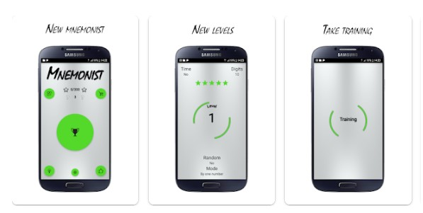
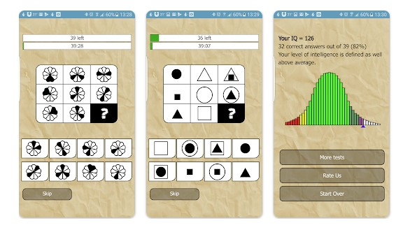

This article has been written and researched by our expert Loveable through a precise methodology. [Learn more about our methodology](https://avada.io/loveable/our-methodological.html)

[Loveable](https://avada.io/loveable/) > [Blog](https://avada.io/loveable/blog/) > [Family](https://avada.io/loveable/family/)

# 26 Best IQ Games: Boost Your Brainpower with Fun and Challenging Puzzles

Written by [Rose Bryne](https://avada.io/loveable/author/rose/) Last Updated on September 29, 2023

- [Top 26 Best Mobile IQ Games To Boost Brainpower](https://avada.io/loveable/blog/best-iq-games/#wp-block-heading-2-6) 
    - [1\. Brain Games: IQ Challenge](https://avada.io/loveable/blog/best-iq-games/#wp-block-heading-3-7)
    - [2\. IQ Test – Cryptex Challenge](https://avada.io/loveable/blog/best-iq-games/#wp-block-heading-3-12)
    - [3\. Peak](https://avada.io/loveable/blog/best-iq-games/#wp-block-heading-3-16)
    - [4\. Lumosity](https://avada.io/loveable/blog/best-iq-games/#wp-block-heading-3-21)
    - [5\. Word Search Puzzle](https://avada.io/loveable/blog/best-iq-games/#wp-block-heading-3-25)
    - [6\. Brain Dots](https://avada.io/loveable/blog/best-iq-games/#wp-block-heading-3-29)
    - [7\. Math Workout](https://avada.io/loveable/blog/best-iq-games/#wp-block-heading-3-33)
    - [8\. Brain Out](https://avada.io/loveable/blog/best-iq-games/#wp-block-heading-3-37)
    - [9\. Sudoku](https://avada.io/loveable/blog/best-iq-games/#wp-block-heading-3-42)
    - [10\. Elevate](https://avada.io/loveable/blog/best-iq-games/#wp-block-heading-3-47)
    - [11\. Vocabulary Builder](https://avada.io/loveable/blog/best-iq-games/#wp-block-heading-3-51)
    - [12\. CogniFit – Brain Training](https://avada.io/loveable/blog/best-iq-games/#wp-block-heading-3-55)
    - [13\. Memorado Brain Training](https://avada.io/loveable/blog/best-iq-games/#wp-block-heading-3-59) 
    - [14\. NeuroNation](https://avada.io/loveable/blog/best-iq-games/#wp-block-heading-3-64)
    - [15\. Blackbox](https://avada.io/loveable/blog/best-iq-games/#wp-block-heading-3-69)
    - [16\. Scrabble GO](https://avada.io/loveable/blog/best-iq-games/#wp-block-heading-3-74)
    - [17\. Einstein’s Riddle](https://avada.io/loveable/blog/best-iq-games/#wp-block-heading-3-78)
    - [18\. Mnemonist](https://avada.io/loveable/blog/best-iq-games/#wp-block-heading-3-83)
    - [19\. Happify](https://avada.io/loveable/blog/best-iq-games/#wp-block-heading-3-87)
    - [20\. Eidetic](https://avada.io/loveable/blog/best-iq-games/#wp-block-heading-3-91)
    - [21\. IQ Test Brain Training Riddles](https://avada.io/loveable/blog/best-iq-games/#wp-block-heading-3-96)
    - [22\. IQ Test](https://avada.io/loveable/blog/best-iq-games/#wp-block-heading-3-101)
    - [23\. Mensa IQ Check](https://avada.io/loveable/blog/best-iq-games/#wp-block-heading-3-105)
    - [24\. Classic Chess](https://avada.io/loveable/blog/best-iq-games/#wp-block-heading-3-109)
    - [26\. MindPal](https://avada.io/loveable/blog/best-iq-games/#wp-block-heading-3-113)
    - [26\. Brain It On!](https://avada.io/loveable/blog/best-iq-games/#wp-block-heading-3-116)
- [5 Best IQ Games Product To Assist Children Intellignce As They Grow](https://avada.io/loveable/blog/best-iq-games/#wp-block-heading-2-119) 
    - [IQ Fit – Fun 3D Travel Game](https://avada.io/loveable/blog/best-iq-games/#wp-block-heading-3-120)
    - [The Genius Square STEM Puzzle Game](https://avada.io/loveable/blog/best-iq-games/#wp-block-heading-3-123)
    - [3D Brain Teaser Puzzle Game](https://avada.io/loveable/blog/best-iq-games/#wp-block-heading-3-127)
    - [Gravity 3D Maze Game Rubik](https://avada.io/loveable/blog/best-iq-games/#wp-block-heading-3-130)
    - [STEM Toy for Kids Gravity Maze](https://avada.io/loveable/blog/best-iq-games/#wp-block-heading-3-133)
- [How to check your IQ online?](https://avada.io/loveable/blog/best-iq-games/#wp-block-heading-2-137)
    - [IQTest.com](https://avada.io/loveable/blog/best-iq-games/#wp-block-heading-3-138)
    - [Free-IQTest.net](https://avada.io/loveable/blog/best-iq-games/#wp-block-heading-3-140)
    - [Mensa IQ Test](https://avada.io/loveable/blog/best-iq-games/#wp-block-heading-3-142)
- [Bottom Line](https://avada.io/loveable/blog/best-iq-games/#wp-block-heading-2-144)

We all want to become more intelligent, but finding an easy and suitable solution, especially for busy people, can be challenging. Can we enhance our IQ while engaging and entertaining ourselves, or are we confined to holding thick books with hundreds of pages to read?

The choice is yours, but we are here to assist you if you opt for the first option. Engaging with your phone does not necessarily mean engaging in mindless activities that harm your brain and eyes. You can interact with thousands more beneficial and thought-provoking apps available on Google Play and the App Store.

With that idea in mind, this article will present you with the top 25 utility apps that can entertain you while effectively boosting your IQ. These apps help in intellectual training and provide a fun and highly interactive experience. Rest assured that even if you spend the whole day in bed, you can still exercise your brain (of course, keeping [phone usage](https://avada.io/loveable/screen-time-management-tips/) under 180 minutes).

Make the choice that suits you best, and let us help you achieve your goal of enhancing your intelligence.

**You may also like**: [21 Fun and Engaging Memory Help Games | Improve Your Brainpower Today](https://avada.io/loveable/memory-help-games/)

## **Top 26 Best Mobile IQ Games To Boost Brainpower** 

### **1\. Brain Games: IQ Challenge**

Put yourself in the world of brain-boosting puzzles with the Brain Puzzle IQ Challenge Test game.

In this game, you will encounter a wide variety of brain teasers, logic puzzles, math problems, and pattern recognition tasks. Each level presents a unique and engaging challenge that requires critical thinking, problem-solving, and creative reasoning to solve. As you progress through the game, the puzzles become increasingly complex, providing a stimulating and rewarding experience.

Available: Android and IOS

### **2\. IQ Test – Cryptex Challenge**

What makes Brain Teasers Logic Puzzles & Riddles an effective tool for boosting IQ is its ability to engage your brain in stimulating and intellectually demanding activities. By regularly challenging yourself with these mind-bending puzzles, you can enhance your analytical thinking, improve your problem-solving capabilities, and strengthen your cognitive skills.

Available: Android and IOS

### **3\. Peak**

Peak offers a user-friendly interface with a sleek and quirky design that enhances the overall experience. With a diverse selection of over 40 unique games, Peak not only excels in its exceptional design but also delivers enjoyable gameplay. 

The development team, consisting of neuroscientists and game developers, successfully merges the realms of gaming and brain training seamlessly. Concentration games enhance focus, puzzle games boost memory, and other engaging options are available to cater to various cognitive needs. 

Available: Android and IOS

### **4\. Lumosity**

The Lumosity program is grounded in several cognitive science studies that suggest engaging in a diverse range of brain exercises can enhance memory and cognitive abilities. Upon beginning the program, it assesses your performance across various domains and subsequently generates a personalized 15-minute daily training plan for you.

Available: Android and IOS

### **5\. Word Search Puzzle**

In today’s technologically advanced era, playing crossword games online or through game applications has become effortlessly accessible. Surprisingly, engaging in [crossword puzzles](https://crosswordsweekly.com/) can significantly improve mental health, enhance critical thinking abilities, and acquire new knowledge.

Available: Android and IOS

### **6\. Brain Dots**

Brain Dots is a game designed to enhance brain function and enhance concentration during reading or writing activities. The game features numerous levels, with the level of difficulty increasing as more levels are unlocked.

Players are initially provided with a set number of hints at no cost. However, once these hints are exhausted, one can purchase additional hints or acquire one by watching a brief advertisement. The game can be accessed on Android devices.

### **7\. Math Workout**

Math Workout has become one of the most renowned math games available. Despite its minimalistic design, this software shines through its exceptional functionality while compromising on visual aesthetics. With daily sessions, users can practice exercises across various skill levels and keep track of their progress.

Available: Android and IOS

### **8\. Brain Out**

Brain Out is a thrilling and enjoyable game that enhances your logic and reasoning skills as you play. It presents exciting and mind-bending challenges requiring thinking creatively and applying logic. This engaging and captivating game serves as a source of amusement while empowering your brain.

By solving puzzles and challenges that encourage thinking outside the box, Brain Out provides a diverse and unpredictable experience. You may encounter random puzzles that range from math problems requiring logical reasoning to seemingly simple questions designed to play with your mind and create confusion.

Available: Android and IOS

### **9\. Sudoku**

You can download the Sudoku mobile game app on your device completely free of charge, granting you access to many challenging levels in this captivating mind game. Sudoku revolves around numbers and patterns, requiring you to keenly observe the number trail and strategize thoughtfully to establish the correct sequence. 

This multitasking number game is widely recognized for its positive impact on mental health, serving as an effective means to enhance thinking abilities and concentration.

Available: Android and IOS

### **10\. Elevate**

Elevate is a popular brain game that shares similarities with Lumosity, offering a vast selection of over 35 games for you to enjoy. This game enables you to track your progress through a personalized profile, allowing you to review your daily stats and identify areas of strength and areas that need improvement. By engaging with Elevate, you can enhance your brain power, sharpen your focus, boost your memory, and refine your decision-making skills. 

Available: Android and IOS

### **11\. Vocabulary Builder**

Vocab Builder is a straightforward app that excels in aiding your vocabulary development by introducing new words and providing synonyms for those you already know. Additionally, it is an ideal companion for students preparing for targeted exams such as the GRE, SAT, and other similar tests.

Available: Android

### **12\. CogniFit – Brain Training**

CogniFit Brain Fitness is an app that helps train your brain to improve cognitive skills and mental alertness. Its structured program assesses and enhances overall mental fitness and health. The app presents the training in a fun game-like format, ensuring an enjoyable experience for users. You can track your progress and gain insights into your brain health. If you’re competitive, you can even challenge your friends. 

Available: Android and IOS

### **13\. Memorado Brain Training** 

Memorado is a brain training app that acts like a workout gym for your brain. It offers 24 games with over 720 levels to challenge your working memory, concentration, and cognitive control.

Through scientifically researched games, Memorado helps you improve and connect different cognitive functions, ultimately enhancing your intelligence. The app was developed by brain training experts and maintains close ties with the research community.

Available on Android and IOS

### **14\. NeuroNation**

NeuroNation is an app that focuses on training your brain and memory. They specialize in creating scientifically proven online courses that can enhance concentration, memory retention, and cognitive speed. It’s no surprise that they have their own brain-training app.

This app assesses your strengths and potential, tailoring a personalized training plan just for you. With 27 exercises across 250 levels, it ensures that your brain stays active and engaged for years to come.

Available on Android and IOS

### **15\. Blackbox**

If you’re on the hunt for an impressive brain training game, look no further than Blackbox. This puzzle app has won the prestigious Apple Design Award for its distinctive gameplay and minimalist style. 

Prepare yourself for a collection of mind-boggling brain teasers and puzzles cleverly disguised as various mini-games. Not only does Blackbox boast a stunning design, but it is also considered one of the top brain games available for download on your iPhone.

Available on IOS

### **16\. Scrabble GO**

Now you can enjoy everyone’s beloved competitive spelling game on your mobile device. While it may not be marketed as a brain training game, it’s perfect for boosting your vocabulary, testing your concentration, and having a great time.

Say goodbye to boredom and immerse yourself in the exciting world of this mobile app. It’s all about fun and expanding your word skills!

### **17\. Einstein’s Riddle**

This game is all about solving logic puzzles by using clues. If you’re eager to sharpen your problem-solving abilities, this game offers a great workout. The objective of each puzzle is to arrange items correctly based on the provided clues. You’ll need to analyze the clues carefully and adjust them to solve the riddle. Sometimes, you’ll even need to refer to previous clues to fully grasp the puzzle’s solution. 

Get ready to engage your brain and enjoy the challenge of unraveling these intriguing riddles.

Available on Android and IOS

### **18\. Mnemonist**

If you’re looking to improve your memory and expand your vocabulary, Mnemonist is the perfect app for you. It focuses on a straightforward word-based game where you practice memorizing a list of words in a specific order and then writes them down in the same sequence. This exercise not only helps enhance your memory skills but also provides an opportunity to learn new words along the way.

Available on Android and IOS

### **19\. Happify**

Drawing on the principles of positive psychology, which emphasizes focusing on strengths and virtues to create a meaningful life, this app offers quizzes, polls, and a gratitude journal, all supported by a positive community. By engaging in these activities and cultivating life-changing habits, the aim is to enhance these skills and keep users smiling throughout the day. Unlock the power of happiness and start training your brain for a happier life with this app. 

Available on Android and IOS

### **20\. Eidetic**

Eidetic is a unique app that utilizes spaced repetition to aid in memorization. Whether you need to remember important phone numbers, intriguing words, or fascinating facts, Eidetic has got you covered. Unlike conventional brain training apps, Eidetic focuses on meaningful and contextual items, such as your partner’s phone number, bank account details, or a memorable quote worth sharing.

With helpful notifications, the app reminds you when it’s time to put your memory to the test. 

Available on Android and IOS

### **21\. IQ Test Brain Training Riddles**

This app offers all the features you’d expect from a real IQ test. It assesses your processing speed, memory, and ability to understand numbers. Once you finish the test, you’ll receive a detailed diagram of your results. This will give you a clear picture of your strengths and areas for improvement.

The best part is all the features of the IQ Test app are completely free. You can enjoy the full range of options without any cost.

Available on Android and IOS

### **22\. IQ Test**

The app lets you train your brain by solving different IQ tests. You need to concentrate and stay focused while doing it. If you come across a difficult question, you can simply press the ‘skip’ button. After taking the IQ Test, you’ll receive a thorough review of your results. You can use the visuals and text for future reference. If you want to share your results, you can export the file.

Available on Android and IOS

### **23\. Mensa IQ Check**

If you want to measure how smart you are, you should download Mensa. It has many different IQ tests that can help you find out your intelligence level. The app is small, only requiring 60 MB of memory. Plus, you don’t need an internet connection for it to work properly.

Available on Android

### **24\. Classic Chess**

You may already know that playing chess is a highly effective way to enhance strategic thinking. With each move your opponent makes, you are forced to come up with countermoves. A game of chess not only hones your strategic thinking skills but also provides an effective means of interacting with other players.

You can download and try out many different versions of chess to see which one suits you best. Numerous chess apps are available on platforms like iOS and Android, so go ahead and download one to try.

### **26\. MindPal**

MindPal has over 30 games in categories like words, math, memory, and puzzles. These games have thousands of levels, providing endless enjoyment. However, it can be challenging to play and remember multiple games every day, right? That’s where the app’s progress-tracking features come in handy. On MindPal, you’ll find a weekly calendar that shows how close or far you are from completing each day’s challenges.

### **26\. Brain It On!**

Brain It On! is one of the free brain games that focuses on physics. But don’t worry; you don’t need to know much about physics to solve its many puzzles. All you need is the ability to draw lines, think creatively, and remember your strategies from previous levels. Similar tricks might still come in handy as you tackle new challenges, so you can keep making progress.

## 5 Best IQ Games Product To Assist Children Intellignce As They Grow 

### [**IQ Fit – Fun 3D Travel Game**](https://www.amazon.com/SmartGames-SG423US-IQ-Fit/dp/B0084ZJ9RS/ref=sr_1_1?crid=30RQ1KBT5EM1T&keywords=IQ+games&qid=1684989267&sprefix=iq+game%2Caps%2C413&sr=8-1)

IQ Fit is an [ideal item for memory and IQ boosting](https://avada.io/loveable/educational-toys-1-year-olds/). The game features different shapes and pieces that need to be fitted together on a game board. It requires logical thinking, spatial awareness, and problem-solving skills to find the correct placement for each piece. By solving these puzzles, players are encouraged to think critically, analyze patterns, and exercise their cognitive abilities.

### [**The Genius Square STEM Puzzle Game**](https://www.amazon.com/Genius-Square-Solutions-Opponent-Different/dp/B07KCDBJTX/ref=sr_1_3?crid=30RQ1KBT5EM1T&keywords=IQ+games&qid=1684989267&sprefix=iq+game%2Caps%2C413&sr=8-3)

The Genius Square game consists of a game board and various shapes that players need to fit into the board. You need to fill the entire board by strategically placing the shapes in the correct positions. The catch is that players have limited time and must think quickly to find the right combinations.

The game offers different levels of difficulty, allowing players to choose the challenge that suits their skill level. With each level, the complexity increases, providing a continuous test of one’s mental agility and spatial reasoning abilities. The game promotes quick thinking, strategic planning, and spatial awareness.

### [**3D Brain Teaser Puzzle Game**](https://www.amazon.com/Educational-Insights-Kanoodle-Twisting-Solitaire/dp/B000FGECAI/ref=sr_1_2?crid=30RQ1KBT5EM1T&keywords=IQ+games&qid=1684989267&sprefix=iq+game%2Caps%2C413&sr=8-2)

This is a compact and portable IQ game designed to provide fun and challenging brain teasers. The game includes a variety of colorful puzzle pieces that need to be arranged on a game board following specific rules and restrictions. By solving the puzzles, players can enhance their critical thinking, problem-solving, and spatial reasoning skills. With multiple levels of difficulty, Kanoodle offers a range of challenges for players of all ages and skill levels.

### **[Gravity 3D Maze Game Rubik](https://www.amazon.com/Ogm-Perplexus-3x3-Rubiks-GTL/dp/B07WDCYRVV/ref=sr_1_15?crid=30RQ1KBT5EM1T&keywords=IQ+games&qid=1684989267&sprefix=iq+game%2Caps%2C413&sr=8-15)**

The toy features a 3D spherical maze with multiple obstacles and a small metal ball that players need to navigate through the twists and turns of the maze. You need to maneuver the ball along the tracks, avoiding traps and dead ends, to reach the endpoint. The Perplexus game helps develop spatial awareness, hand-eye coordination, and problem-solving skills for children very well. 

### [**STEM Toy for Kids Gravity Maze**](https://www.amazon.com/ThinkFun-Gravity-Marble-Logic-Girls/dp/B00IUAAK2A/ref=sr_1_4?crid=1GFNU2I2GOQ3I&keywords=IQ+toys&qid=1684990150&sprefix=iq+to%2Caps%2C386&sr=8-4)

This game is designed to enhance IQ by stimulating critical thinking, problem-solving skills, and spatial reasoning abilities. The Gravity Maze game features a series of colorful towers, tracks, and target pieces. Your mission is to create a pathway using the provided towers and tracks to guide a marble from the starting point to the target.

The game offers multiple difficulty levels, allowing players to gradually progress and face more complex challenges as their skills improve. 

## How to check your IQ online?

### [**IQTest.com**](https://iqtest.com/)

IQ test offers a free IQ test that you can take to assess your intelligence quotient. The test consists of various questions designed to measure different aspects of intelligence.

### [**Free-IQTest.net**](https://www.free-iqtest.net/)

This website provides a free IQ test that you can take online. The test includes questions assessing your logical reasoning, verbal comprehension, and mathematical abilities.

### [**Mensa IQ Test**](https://www.mensa.org/public/mensa-iq-challenge)

Mensa, a renowned high IQ society, offers a free online IQ test on its website. The test is designed to measure your intelligence and is similar to the tests used for Mensa membership qualification.

## **Bottom Line**

Engaging in IQ games can be a refreshing and enlightening experience in a world overflowing with distractions and mindless entertainment. The **25 best IQ games** compiled here offer a remarkable opportunity to elevate your brainpower while having fun with stimulating puzzles.

These games are more than mere sources of entertainment; they serve as gateways to expand your cognitive abilities, challenge your problem-solving skills, and sharpen your mental acuity.

- [Top 26 Best Mobile IQ Games To Boost Brainpower](https://avada.io/loveable/blog/best-iq-games/#wp-block-heading-2-6) 
    - [1\. Brain Games: IQ Challenge](https://avada.io/loveable/blog/best-iq-games/#wp-block-heading-3-7)
    - [2\. IQ Test – Cryptex Challenge](https://avada.io/loveable/blog/best-iq-games/#wp-block-heading-3-12)
    - [3\. Peak](https://avada.io/loveable/blog/best-iq-games/#wp-block-heading-3-16)
    - [4\. Lumosity](https://avada.io/loveable/blog/best-iq-games/#wp-block-heading-3-21)
    - [5\. Word Search Puzzle](https://avada.io/loveable/blog/best-iq-games/#wp-block-heading-3-25)
    - [6\. Brain Dots](https://avada.io/loveable/blog/best-iq-games/#wp-block-heading-3-29)
    - [7\. Math Workout](https://avada.io/loveable/blog/best-iq-games/#wp-block-heading-3-33)
    - [8\. Brain Out](https://avada.io/loveable/blog/best-iq-games/#wp-block-heading-3-37)
    - [9\. Sudoku](https://avada.io/loveable/blog/best-iq-games/#wp-block-heading-3-42)
    - [10\. Elevate](https://avada.io/loveable/blog/best-iq-games/#wp-block-heading-3-47)
    - [11\. Vocabulary Builder](https://avada.io/loveable/blog/best-iq-games/#wp-block-heading-3-51)
    - [12\. CogniFit – Brain Training](https://avada.io/loveable/blog/best-iq-games/#wp-block-heading-3-55)
    - [13\. Memorado Brain Training](https://avada.io/loveable/blog/best-iq-games/#wp-block-heading-3-59) 
    - [14\. NeuroNation](https://avada.io/loveable/blog/best-iq-games/#wp-block-heading-3-64)
    - [15\. Blackbox](https://avada.io/loveable/blog/best-iq-games/#wp-block-heading-3-69)
    - [16\. Scrabble GO](https://avada.io/loveable/blog/best-iq-games/#wp-block-heading-3-74)
    - [17\. Einstein’s Riddle](https://avada.io/loveable/blog/best-iq-games/#wp-block-heading-3-78)
    - [18\. Mnemonist](https://avada.io/loveable/blog/best-iq-games/#wp-block-heading-3-83)
    - [19\. Happify](https://avada.io/loveable/blog/best-iq-games/#wp-block-heading-3-87)
    - [20\. Eidetic](https://avada.io/loveable/blog/best-iq-games/#wp-block-heading-3-91)
    - [21\. IQ Test Brain Training Riddles](https://avada.io/loveable/blog/best-iq-games/#wp-block-heading-3-96)
    - [22\. IQ Test](https://avada.io/loveable/blog/best-iq-games/#wp-block-heading-3-101)
    - [23\. Mensa IQ Check](https://avada.io/loveable/blog/best-iq-games/#wp-block-heading-3-105)
    - [24\. Classic Chess](https://avada.io/loveable/blog/best-iq-games/#wp-block-heading-3-109)
    - [26\. MindPal](https://avada.io/loveable/blog/best-iq-games/#wp-block-heading-3-113)
    - [26\. Brain It On!](https://avada.io/loveable/blog/best-iq-games/#wp-block-heading-3-116)
- [5 Best IQ Games Product To Assist Children Intellignce As They Grow](https://avada.io/loveable/blog/best-iq-games/#wp-block-heading-2-119) 
    - [IQ Fit – Fun 3D Travel Game](https://avada.io/loveable/blog/best-iq-games/#wp-block-heading-3-120)
    - [The Genius Square STEM Puzzle Game](https://avada.io/loveable/blog/best-iq-games/#wp-block-heading-3-123)
    - [3D Brain Teaser Puzzle Game](https://avada.io/loveable/blog/best-iq-games/#wp-block-heading-3-127)
    - [Gravity 3D Maze Game Rubik](https://avada.io/loveable/blog/best-iq-games/#wp-block-heading-3-130)
    - [STEM Toy for Kids Gravity Maze](https://avada.io/loveable/blog/best-iq-games/#wp-block-heading-3-133)
- [How to check your IQ online?](https://avada.io/loveable/blog/best-iq-games/#wp-block-heading-2-137)
    - [IQTest.com](https://avada.io/loveable/blog/best-iq-games/#wp-block-heading-3-138)
    - [Free-IQTest.net](https://avada.io/loveable/blog/best-iq-games/#wp-block-heading-3-140)
    - [Mensa IQ Test](https://avada.io/loveable/blog/best-iq-games/#wp-block-heading-3-142)
- [Bottom Line](https://avada.io/loveable/blog/best-iq-games/#wp-block-heading-2-144)

### [Rose Bryne](https://avada.io/loveable/author/rose/)

Hi, I'm Rose! I love animals and spending time with kids. At Loveable, I help people find unique gifts for special occasions like Valentine's Day, housewarmings, and graduations. I enjoy finding gifts for kids, teens, and animal lovers that match their interests and personalities. Making gift-giving a pleasant experience is my priority. Let me assist you in finding the perfect gift!

- [Twitter](https://twitter.com/intent/tweet)
- [Facebook](https://www.facebook.com/sharer/sharer.php)
- [instagram](https://avada.io/loveable/blog/best-iq-games/)
- [pinterest](https://www.pinterest.com/loveablellc/)

## Related Posts

[### 30 Best 4 Year Old Birthday Party Ideas For A Memorable Celebration](https://avada.io/loveable/blog/4-year-old-birthday-party-ideas/) 

[

### 16th Birthday Party Ideas to Make an Unforgettable Day

](https://avada.io/loveable/blog/16th-birthday-party-ideas/)

[

### 150+ Inspirational Birthday Quotes to Spread Joy on Special Day

](https://avada.io/loveable/blog/inspirational-birthday-quotes/)

[

### 160+ Birthday Wishes for Wife to Express Eternal Love

](https://avada.io/loveable/blog/birthday-wishes-for-wife/)

[### 90+ Heart Touching Birthday Wishes for Niece to Make Her Day Extra Special](https://avada.io/loveable/blog/birthday-wishes-for-niece/)
